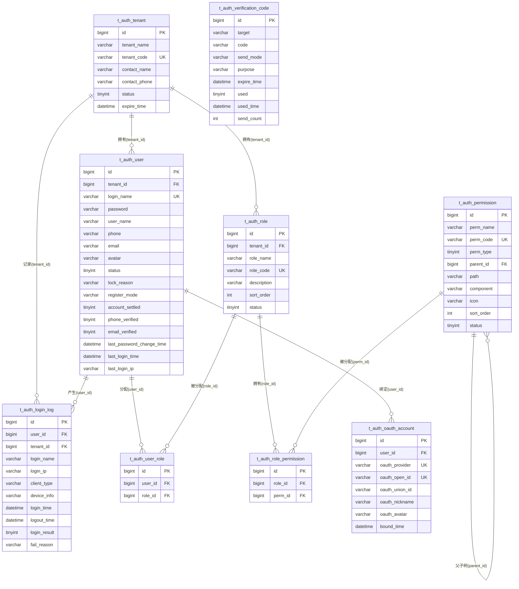

# 数据库设计文档（DBD）
**项目名称**：云漫智企（CloudStrollOffice）
**版本号**：0.0.1
**日期**：2026-08-07
**编写人**：DBA

## 1. 设计目标
- **支持认证底座业务**：为统一认证授权底座（注册 5 策略、登录 4 策略、双 Token 轮换、密码/手机号管理、验证码、RBAC 权限、登录日志）提供持久化数据支撑。
- **多租户数据隔离**：基于 RBAC（用户-角色-权限）模型实现多租户数据空间隔离，登录名/手机号/角色编码在租户内唯一，租户间数据不可见。
- **数据规模预估**：本版本为认证底座，租户/用户/角色/权限数据量可控（万级以内）；登录日志表随使用增长，后续版本规划归档策略。
- **一致性要求**：密码一律 BCrypt 加密存储（禁止明文）；逻辑删除统一（deleted 0-正常 1-删除）；所有表统一雪花算法主键与 create_time/update_time 自动填充。
- **热路径性能**：登录名（租户内唯一）、手机号、角色编码、权限编码等高频查询字段建立唯一索引/普通索引；验证码表按目标+用途、过期时间建立索引支撑过期清理。

## 2. 数据库选型
**数据库产品**：MariaDB（业务关系型数据库）
**版本**：10.6 (LTS)
**选型理由**：
- 兼容 MySQL 生态，JDBC 驱动 `org.mariadb.jdbc.Driver`，与 MyBatis-Plus 3.5.6 无缝集成。
- 开源免费、稳定性与性能满足企业办公场景，Docker Compose 一键编排（8 容器）部署简单。
- 支持 utf8mb4 字符集与 InnoDB 事务引擎，满足多租户 RBAC 关联事务与中文业务数据存储。
- 认证库 `cloudstroll_office_auth` 承载 9 张业务表；`cloudstroll_office_biz` / `cloudstroll_office_system` 库仅建库预留，供后续版本填充业务表。
- 缓存数据库：Redis 7.2.x（非关系型，承载登录态会话、Token 黑名单、账号/租户状态缓存、验证码临时缓存），不在本 DBD 表结构范围内。

## 3. ER 图

## 4. 逻辑模型
| 实体 | 表名 | 说明 | 关键属性 | 关系 |
| --- | --- | --- | --- | --- |
| 租户 | t_auth_tenant | SaaS 平台企业租户，状态控制与过期管理 | 租户编码（唯一）、租户名称、联系人、状态、过期时间 | 1 对 N：用户/角色/登录日志 |
| 用户 | t_auth_user | 平台用户账号，多租户隔离 | 登录名（租户内唯一）、BCrypt 密码、姓名、手机号、邮箱、状态、注册模式、账号完善/验证标记 | N 对 1：租户；N 对 N：角色（经 t_auth_user_role）；1 对 N：OAuth 账号/登录日志 |
| 角色 | t_auth_role | 角色定义，租户内隔离 | 角色编码（租户内唯一）、角色名称、描述、排序、状态 | N 对 1：租户；N 对 N：用户/权限 |
| 权限 | t_auth_permission | 权限点定义，树形结构（菜单/按钮/API） | 权限编码（全局唯一）、权限名称、类型、父权限 ID | 自关联树（parent_id）；N 对 N：角色 |
| 用户-角色关联 | t_auth_user_role | 用户与角色多对多 | 用户 ID、角色 ID | 多对多中间表 |
| 角色-权限关联 | t_auth_role_permission | 角色与权限多对多 | 角色 ID、权限 ID | 多对多中间表 |
| 登录日志 | t_auth_login_log | 登录认证审计记录 | 用户/租户/登录名/IP/客户端类型/设备/时间/结果/失败原因 | N 对 1：用户/租户 |
| OAuth 账号关联 | t_auth_oauth_account | 用户与第三方 OAuth 账号绑定 | OAuth 提供商（openId 组合唯一）、unionId、昵称、头像、绑定时间 | N 对 1：用户 |
| 验证码记录 | t_auth_verification_code | 验证码生命周期管理（生成→校验→过期→使用） | 发送目标、验证码、发送方式、用途、过期时间、使用状态、发送次数 | 独立表（目标+用途查询） |

## 5. 物理模型
公共字段说明（除 t_auth_user_role / t_auth_role_permission / t_auth_login_log 外均继承 BaseEntity 全部字段；关联表与日志表由 DBA 补齐 update_time/deleted 与实体一致）：
- `id` BIGINT(20) 主键（MyBatis-Plus 雪花算法 ASSIGN_ID）
- `create_time` DATETIME 创建时间，默认 CURRENT_TIMESTAMP，插入自动填充
- `update_time` DATETIME 更新时间，默认 CURRENT_TIMESTAMP ON UPDATE CURRENT_TIMESTAMP，插入/更新自动填充
- `deleted` TINYINT(1) 逻辑删除：0-正常 1-删除（@TableLogic）

### 5.1 t_auth_tenant（租户表）
| 字段名 | 类型 | 长度 | 允许空 | 默认值 | 主键/外键 | 说明 |
| --- | --- | --- | --- | --- | --- | --- |
| id | BIGINT | 20 | 否 | - | 主键 | 租户 ID（雪花算法） |
| tenant_name | VARCHAR | 100 | 否 | - | - | 租户名称 |
| tenant_code | VARCHAR | 50 | 否 | - | 唯一 | 租户编码（全局唯一标识） |
| contact_name | VARCHAR | 50 | 是 | NULL | - | 联系人姓名 |
| contact_phone | VARCHAR | 20 | 是 | NULL | - | 联系人电话 |
| status | TINYINT | 4 | 否 | 0 | - | 状态：0-正常 1-禁用 2-过期 |
| expire_time | DATETIME | - | 是 | NULL | - | 过期时间（NULL 表示永不过期） |
| create_time | DATETIME | - | 否 | CURRENT_TIMESTAMP | - | 创建时间 |
| update_time | DATETIME | - | 否 | CURRENT_TIMESTAMP | - | 更新时间 |
| deleted | TINYINT | 1 | 否 | 0 | - | 逻辑删除：0-正常 1-删除 |

### 5.2 t_auth_user（用户表）
| 字段名 | 类型 | 长度 | 允许空 | 默认值 | 主键/外键 | 说明 |
| --- | --- | --- | --- | --- | --- | --- |
| id | BIGINT | 20 | 否 | - | 主键 | 用户 ID（雪花算法） |
| tenant_id | BIGINT | 20 | 否 | - | 外键→t_auth_tenant.id | 租户 ID（多租户隔离） |
| login_name | VARCHAR | 50 | 否 | - | 唯一（租户内） | 登录名（租户内唯一） |
| password | VARCHAR | 255 | 否 | - | - | 密码（BCrypt 加密） |
| user_name | VARCHAR | 50 | 否 | - | - | 用户显示名 |
| phone | VARCHAR | 20 | 是 | NULL | - | 手机号 |
| email | VARCHAR | 100 | 是 | NULL | - | 邮箱 |
| avatar | VARCHAR | 500 | 是 | NULL | - | 头像 URL |
| status | TINYINT | 4 | 否 | 0 | - | 状态：0-正常 1-锁定 2-禁用 3-封禁 |
| lock_reason | VARCHAR | 255 | 是 | NULL | - | 锁定/封禁原因（管理员封禁时填写） |
| register_mode | VARCHAR | 32 | 是 | USERNAME | - | 注册模式（USERNAME/PHONE_CODE/OAUTH/PHONE_SET_USERNAME/OAUTH_SET_INFO） |
| account_settled | TINYINT | 1 | 是 | 1 | - | 账号信息是否完善：0-未完善 1-已完善（两步注册） |
| phone_verified | TINYINT | 1 | 是 | 0 | - | 手机号是否已验证：0-未验证 1-已验证 |
| email_verified | TINYINT | 1 | 是 | 0 | - | 邮箱是否已验证：0-未验证 1-已验证 |
| last_password_change_time | DATETIME | - | 是 | NULL | - | 最后修改密码时间 |
| last_login_time | DATETIME | - | 是 | NULL | - | 最后登录时间 |
| last_login_ip | VARCHAR | 50 | 是 | NULL | - | 最后登录 IP |
| create_time | DATETIME | - | 否 | CURRENT_TIMESTAMP | - | 创建时间 |
| update_time | DATETIME | - | 否 | CURRENT_TIMESTAMP | - | 更新时间 |
| deleted | TINYINT | 1 | 否 | 0 | - | 逻辑删除：0-正常 1-删除 |

### 5.3 t_auth_role（角色表）
| 字段名 | 类型 | 长度 | 允许空 | 默认值 | 主键/外键 | 说明 |
| --- | --- | --- | --- | --- | --- | --- |
| id | BIGINT | 20 | 否 | - | 主键 | 角色 ID（雪花算法） |
| tenant_id | BIGINT | 20 | 否 | - | 外键→t_auth_tenant.id | 租户 ID（多租户隔离） |
| role_name | VARCHAR | 50 | 否 | - | - | 角色名称 |
| role_code | VARCHAR | 50 | 否 | - | 唯一（租户内） | 角色编码（租户内唯一） |
| description | VARCHAR | 500 | 是 | NULL | - | 角色描述 |
| sort_order | INT | 11 | 是 | 0 | - | 排序号 |
| status | TINYINT | 4 | 否 | 0 | - | 状态：0-正常 1-禁用 |
| create_time | DATETIME | - | 否 | CURRENT_TIMESTAMP | - | 创建时间 |
| update_time | DATETIME | - | 否 | CURRENT_TIMESTAMP | - | 更新时间 |
| deleted | TINYINT | 1 | 否 | 0 | - | 逻辑删除：0-正常 1-删除 |

### 5.4 t_auth_permission（权限表）
| 字段名 | 类型 | 长度 | 允许空 | 默认值 | 主键/外键 | 说明 |
| --- | --- | --- | --- | --- | --- | --- |
| id | BIGINT | 20 | 否 | - | 主键 | 权限 ID（雪花算法） |
| perm_name | VARCHAR | 100 | 否 | - | - | 权限名称 |
| perm_code | VARCHAR | 100 | 否 | - | 唯一 | 权限标识（如 system:user:list，全局唯一） |
| perm_type | TINYINT | 4 | 否 | 1 | - | 类型：1-菜单 2-按钮 3-API |
| parent_id | BIGINT | 20 | 是 | 0 | 自关联→id | 父权限 ID（0 表示顶级） |
| path | VARCHAR | 200 | 是 | NULL | - | 前端路由路径 |
| component | VARCHAR | 200 | 是 | NULL | - | 前端组件路径 |
| icon | VARCHAR | 100 | 是 | NULL | - | 图标 |
| sort_order | INT | 11 | 是 | 0 | - | 排序号 |
| status | TINYINT | 4 | 否 | 0 | - | 状态：0-正常 1-禁用 |
| create_time | DATETIME | - | 否 | CURRENT_TIMESTAMP | - | 创建时间 |
| update_time | DATETIME | - | 否 | CURRENT_TIMESTAMP | - | 更新时间 |
| deleted | TINYINT | 1 | 否 | 0 | - | 逻辑删除：0-正常 1-删除 |

### 5.5 t_auth_user_role（用户角色关联表）
| 字段名 | 类型 | 长度 | 允许空 | 默认值 | 主键/外键 | 说明 |
| --- | --- | --- | --- | --- | --- | --- |
| id | BIGINT | 20 | 否 | - | 主键 | 关联 ID（雪花算法） |
| user_id | BIGINT | 20 | 否 | - | 外键→t_auth_user.id | 用户 ID |
| role_id | BIGINT | 20 | 否 | - | 外键→t_auth_role.id | 角色 ID |
| create_time | DATETIME | - | 否 | CURRENT_TIMESTAMP | - | 创建时间 |
| update_time | DATETIME | - | 否 | CURRENT_TIMESTAMP | - | 更新时间（与实体 BaseEntity 一致） |
| deleted | TINYINT | 1 | 否 | 0 | - | 逻辑删除：0-正常 1-删除（与实体 BaseEntity 一致） |

### 5.6 t_auth_role_permission（角色权限关联表）
| 字段名 | 类型 | 长度 | 允许空 | 默认值 | 主键/外键 | 说明 |
| --- | --- | --- | --- | --- | --- | --- |
| id | BIGINT | 20 | 否 | - | 主键 | 关联 ID（雪花算法） |
| role_id | BIGINT | 20 | 否 | - | 外键→t_auth_role.id | 角色 ID |
| perm_id | BIGINT | 20 | 否 | - | 外键→t_auth_permission.id | 权限 ID |
| create_time | DATETIME | - | 否 | CURRENT_TIMESTAMP | - | 创建时间 |
| update_time | DATETIME | - | 否 | CURRENT_TIMESTAMP | - | 更新时间（与实体 BaseEntity 一致） |
| deleted | TINYINT | 1 | 否 | 0 | - | 逻辑删除：0-正常 1-删除（与实体 BaseEntity 一致） |

### 5.7 t_auth_login_log（登录日志表）
| 字段名 | 类型 | 长度 | 允许空 | 默认值 | 主键/外键 | 说明 |
| --- | --- | --- | --- | --- | --- | --- |
| id | BIGINT | 20 | 否 | - | 主键 | 日志 ID（雪花算法） |
| user_id | BIGINT | 20 | 否 | - | 外键→t_auth_user.id | 用户 ID |
| tenant_id | BIGINT | 20 | 否 | - | 外键→t_auth_tenant.id | 租户 ID |
| login_name | VARCHAR | 50 | 是 | NULL | - | 登录名（冗余存储，防用户删除后日志失联） |
| login_ip | VARCHAR | 50 | 否 | - | - | 登录 IP 地址 |
| client_type | VARCHAR | 20 | 否 | - | - | 客户端类型（WINDOWS/UBUNTU/H5/ANDROID/IOS/WECHAT_MINI） |
| device_info | VARCHAR | 500 | 是 | NULL | - | 设备信息 |
| login_time | DATETIME | - | 否 | - | - | 登录时间 |
| logout_time | DATETIME | - | 是 | NULL | - | 登出时间（NULL 表示未登出） |
| login_result | TINYINT | 4 | 否 | 0 | - | 登录结果：0-成功 1-失败 |
| fail_reason | VARCHAR | 255 | 是 | NULL | - | 失败原因 |
| create_time | DATETIME | - | 否 | CURRENT_TIMESTAMP | - | 创建时间 |
| update_time | DATETIME | - | 否 | CURRENT_TIMESTAMP | - | 更新时间（与实体 BaseEntity 一致） |
| deleted | TINYINT | 1 | 否 | 0 | - | 逻辑删除：0-正常 1-删除（与实体 BaseEntity 一致） |

### 5.8 t_auth_oauth_account（OAuth 第三方账号关联表）
| 字段名 | 类型 | 长度 | 允许空 | 默认值 | 主键/外键 | 说明 |
| --- | --- | --- | --- | --- | --- | --- |
| id | BIGINT | 20 | 否 | - | 主键 | 主键 ID（雪花算法） |
| user_id | BIGINT | 20 | 否 | - | 外键→t_auth_user.id | 平台用户 ID |
| oauth_provider | VARCHAR | 32 | 否 | - | 唯一组合 | OAuth 提供商（WECHAT/DINGTALK/WECHAT_WORK/ALIPAY） |
| oauth_open_id | VARCHAR | 256 | 否 | - | 唯一组合 | 第三方平台用户唯一标识（openId） |
| oauth_union_id | VARCHAR | 256 | 是 | NULL | - | 第三方平台用户统一标识（unionId，可选） |
| oauth_nickname | VARCHAR | 128 | 是 | NULL | - | 第三方平台昵称 |
| oauth_avatar | VARCHAR | 512 | 是 | NULL | - | 第三方平台头像 URL |
| bound_time | DATETIME | - | 是 | NULL | - | 绑定时间 |
| create_time | DATETIME | - | 否 | CURRENT_TIMESTAMP | - | 创建时间 |
| update_time | DATETIME | - | 否 | CURRENT_TIMESTAMP | - | 更新时间 |
| deleted | TINYINT | 1 | 否 | 0 | - | 逻辑删除：0-正常 1-删除 |

### 5.9 t_auth_verification_code（验证码记录表）
| 字段名 | 类型 | 长度 | 允许空 | 默认值 | 主键/外键 | 说明 |
| --- | --- | --- | --- | --- | --- | --- |
| id | BIGINT | 20 | 否 | - | 主键 | 主键 ID（雪花算法） |
| target | VARCHAR | 128 | 否 | - | - | 发送目标（手机号或邮箱） |
| code | VARCHAR | 16 | 否 | - | - | 验证码内容（6 位数字） |
| send_mode | VARCHAR | 16 | 否 | - | - | 发送方式（SMS-短信/EMAIL-邮件） |
| purpose | VARCHAR | 32 | 否 | - | - | 用途（REGISTER/LOGIN/RESET_PASSWORD/CHANGE_PHONE） |
| expire_time | DATETIME | - | 否 | - | - | 过期时间（创建时间+5 分钟） |
| used | TINYINT | 1 | 否 | 0 | - | 是否已使用：0-未使用 1-已使用（一次性） |
| used_time | DATETIME | - | 是 | NULL | - | 使用时间 |
| send_count | INT | 11 | 是 | 0 | - | 已发送次数（频率控制） |
| create_time | DATETIME | - | 否 | CURRENT_TIMESTAMP | - | 创建时间 |
| update_time | DATETIME | - | 否 | CURRENT_TIMESTAMP | - | 更新时间 |
| deleted | TINYINT | 1 | 否 | 0 | - | 逻辑删除：0-正常 1-删除 |

## 6. 索引设计
| 索引名称 | 表名 | 字段 | 类型 | 说明 |
| --- | --- | --- | --- | --- |
| PRIMARY | t_auth_tenant | id | 主键索引（BTREE） | 主键 |
| uk_tenant_code | t_auth_tenant | tenant_code | 唯一索引 | 租户编码全局唯一，登录时按 tenant_code 查询 |
| PRIMARY | t_auth_user | id | 主键索引（BTREE） | 主键 |
| uk_user_login_name | t_auth_user | tenant_id, login_name | 唯一索引 | 租户内登录名唯一，登录认证热路径查询 |
| idx_register_mode | t_auth_user | register_mode | 普通索引 | 按注册模式筛选统计 |
| idx_status | t_auth_user | status | 普通索引 | 按账号状态筛选（封禁/锁定批量操作） |
| PRIMARY | t_auth_role | id | 主键索引（BTREE） | 主键 |
| uk_role_code | t_auth_role | tenant_id, role_code | 唯一索引 | 租户内角色编码唯一 |
| PRIMARY | t_auth_permission | id | 主键索引（BTREE） | 主键 |
| uk_perm_code | t_auth_permission | perm_code | 唯一索引 | 权限编码全局唯一 |
| idx_parent_id | t_auth_permission | parent_id | 普通索引 | 权限树父子查询 |
| PRIMARY | t_auth_user_role | id | 主键索引（BTREE） | 主键 |
| uk_user_role | t_auth_user_role | user_id, role_id | 唯一索引 | 同一用户-角色关系唯一，防重复分配 |
| idx_role_id | t_auth_user_role | role_id | 普通索引 | 按角色反查用户 |
| PRIMARY | t_auth_role_permission | id | 主键索引（BTREE） | 主键 |
| uk_role_perm | t_auth_role_permission | role_id, perm_id | 唯一索引 | 同一角色-权限关系唯一 |
| idx_perm_id | t_auth_role_permission | perm_id | 普通索引 | 按权限反查角色 |
| PRIMARY | t_auth_login_log | id | 主键索引（BTREE） | 主键 |
| idx_log_user_time | t_auth_login_log | user_id, login_time | 普通索引 | 按用户+时间查登录历史 |
| idx_log_tenant_time | t_auth_login_log | tenant_id, login_time | 普通索引 | 按租户+时间查登录历史（审计） |
| PRIMARY | t_auth_oauth_account | id | 主键索引（BTREE） | 主键 |
| uk_provider_openid | t_auth_oauth_account | oauth_provider, oauth_open_id | 唯一索引 | 同一提供商下 openId 唯一，OAuth 登录匹配 |
| idx_user_id | t_auth_oauth_account | user_id | 普通索引 | 按平台用户 ID 查询绑定账号 |
| PRIMARY | t_auth_verification_code | id | 主键索引（BTREE） | 主键 |
| idx_target_purpose | t_auth_verification_code | target, purpose | 普通索引 | 按发送目标和用途查询最新验证码 |
| idx_expire_time | t_auth_verification_code | expire_time | 普通索引 | 按过期时间清理过期记录 |

## 7. 视图 / 存储过程 / 触发器设计
### 7.1 视图
无。用户权限查询（角色编码/权限编码）由 Mapper XML 联表 SQL 实现（selectRoleCodesByUserId / selectPermissionCodesByUserId），不建视图。
### 7.2 存储过程
无。验证码过期清理由服务层定时调用（VerificationCodeManager.cleanExpiredCodes → deleteExpired），不建存储过程。
### 7.3 触发器
无。审计字段（create_time/update_time）由 MyBatis-Plus 自动填充实现，不建触发器。

## 8. 数据字典
### 枚举值汇总
| 字段路径 | 取值 | 说明 |
| --- | --- | --- |
| t_auth_tenant.status | 0 / 1 / 2 | 0-正常 1-禁用 2-过期 |
| t_auth_user.status | 0 / 1 / 2 / 3 | 0-正常 1-锁定 2-禁用 3-封禁（封禁后登录与访问实时失效） |
| t_auth_user.register_mode | USERNAME / PHONE_CODE / OAUTH / PHONE_SET_USERNAME / OAUTH_SET_INFO | 用户名密码 / 手机验证码 / OAuth 注册 / 手机号设用户名 / OAuth 补全信息（对应 RegisterModeEnum 5 策略） |
| t_auth_user.account_settled | 0 / 1 | 0-未完善（两步注册待补全） 1-已完善 |
| t_auth_user.phone_verified / email_verified | 0 / 1 | 0-未验证 1-已验证 |
| t_auth_role.status | 0 / 1 | 0-正常 1-禁用 |
| t_auth_permission.perm_type | 1 / 2 / 3 | 1-菜单 2-按钮 3-API |
| t_auth_permission.status | 0 / 1 | 0-正常 1-禁用 |
| t_auth_login_log.client_type | WINDOWS / UBUNTU / H5 / ANDROID / IOS / WECHAT_MINI | 6 种客户端类型（ClientTypeEnum，同端互斥/多端共存） |
| t_auth_login_log.login_result | 0 / 1 | 0-成功 1-失败 |
| t_auth_oauth_account.oauth_provider | WECHAT / DINGTALK / WECHAT_WORK / ALIPAY | OAuth 提供商（OAuthProviderEnum，可扩展） |
| t_auth_verification_code.send_mode | SMS / EMAIL | 短信 / 邮件通道 |
| t_auth_verification_code.purpose | REGISTER / LOGIN / RESET_PASSWORD / CHANGE_PHONE | 验证码用途（按用途隔离，不同用途不通用） |
| t_auth_verification_code.used | 0 / 1 | 0-未使用 1-已使用（校验成功后立即失效） |
| 公共字段 deleted | 0 / 1 | 0-正常 1-逻辑删除（MyBatis-Plus @TableLogic） |
| 登录模式（非表字段） | USERNAME_PASSWORD / PHONE_CODE / PHONE_PASSWORD / OAUTH | LoginModeEnum 4 种登录策略（请求参数） |

## 9. 备份恢复策略
- **备份频率**：每日全量备份（mysqldump，UTC 凌晨低峰期执行）；登录日志等增长型数据后续版本规划归档。
- **备份方式**：`mysqldump -u root -p --single-transaction --routines --events cloudstroll_office_auth`，备份文件按日期命名，保留最近 7 天；Docker 环境使用 `docker exec mariadb mysqldump` 执行。
- **恢复演练**：每季度执行一次恢复演练，在隔离环境验证备份可恢复性。
- **初始脚本**：`scripts/sql/init-v0.2.0-full.sql` 为全量可重复执行脚本（INSERT IGNORE 幂等），开发/测试环境可随时重建。

## 10. 安全策略
- **账号权限**：应用连接使用最小权限账号（仅 DML + 认证库），DDL 由 DBA 通过管理账号执行；生产环境禁止使用 root 连接应用。
- **敏感数据**：密码一律 BCrypt 加密存储（成本因子 10），禁止明文；日志禁止输出密码与 Token；登录失败统一提示不泄露具体原因（防账号枚举）。
- **数据隔离**：多租户隔离——所有业务查询限定当前租户（tenant_id 条件），租户间数据不可见；逻辑删除保证误删可恢复。
- **审计**：登录日志表（t_auth_login_log）记录每次登录的 IP/客户端类型/结果/失败原因，供安全审计追溯；管理员封禁/踢人等操作通过登录日志与状态字段留痕。
- **密钥管理**：数据库密码通过环境变量注入（env.json / env.example.json 模板），禁止硬编码与提交仓库；生产环境建议使用密钥管理服务。
- **传输安全**：生产环境网关前端 TLS 终止（HTTPS），数据库与中间件处于 Docker 桥接网络内不对外暴露。

---

# 版本 v0.2.5：部署资产集中化（2026-08-09）

**版本号**：v0.2.5
**日期**：2026-08-09
**编写人**：DBA

## 0. 版本变更说明
**本版本（v0.2.5）不涉及数据库结构变更。**

v0.2.5 为"部署资产集中化"工程版本，变更范围如下（详见 PRD v0.2.5 与 SAD v0.2.5）：
- 新建根目录 `deploy` 作为全部最终构建产物（后端 jar 包、客户端安装文件/exe）与部署资产（env.json / env.example.json、deploy/scripts 下 .sh/.ps1）的唯一落点；
- 修改 Maven 各模块与 Flutter 客户端构建配置，最终产物输出至 `deploy`，构建中间产物禁止进入；
- 迁移 `env.json` / `env.example.json` 至 `deploy`，迁移根目录 `scripts` 下全部 .sh/.ps1 至 `deploy/scripts` 并同步适配脚本内路径引用。

以上变更均为工程目录结构与构建/部署配置调整，**不涉及任何表结构、索引、存储过程、视图、触发器或初始化数据的增删改**。数据库设计（含 9 张认证业务表与 biz/system 预留库）完全沿用本文档上文（v0.0.1 基线）。

## 1. 设计目标
沿用本文档上文（v0.0.1）设计目标：
- 支持认证底座业务：统一认证授权底座（注册 5 策略、登录 4 策略、双 Token 轮换、密码/手机号管理、验证码、RBAC 权限、登录日志）持久化数据支撑。
- 多租户数据隔离：基于 RBAC（用户-角色-权限）模型实现多租户数据空间隔离。
- 数据规模预估：认证底座数据量可控（万级以内），登录日志表随使用增长，后续版本规划归档。
- 一致性要求：密码 BCrypt 加密存储、逻辑删除统一、雪花算法主键与审计时间自动填充。
- 热路径性能：登录名（租户内唯一）、手机号、角色编码、权限编码等高频查询字段建立唯一索引/普通索引。

## 2. 数据库选型
**数据库产品**：MariaDB（业务关系型数据库）+ Redis（缓存数据库，非关系型，不在本 DBD 表结构范围内）
**版本**：MariaDB 10.6 (LTS) / Redis 7.2.x
**选型理由**：沿用本文档上文（v0.0.1）选型，本版本无变更。
- 兼容 MySQL 生态，JDBC 驱动 `org.mariadb.jdbc.Driver`，与 MyBatis-Plus 3.5.6 无缝集成。
- 开源免费、稳定性与性能满足企业办公场景，Docker Compose 一键编排（8 容器）部署简单。
- 认证库 `cloudstroll_office_auth` 承载 9 张业务表；`cloudstroll_office_biz` / `cloudstroll_office_system` 库仅建库预留。

## 3. ER 图
沿用本文档上文（v0.0.1）第 3 章 ER 图（9 张认证业务表实体关系），本版本无变更。

## 4. 逻辑模型
沿用本文档上文（v0.0.1）第 4 章逻辑模型（租户 / 用户 / 角色 / 权限 / 用户-角色关联 / 角色-权限关联 / 登录日志 / OAuth 账号关联 / 验证码记录 共 9 个实体），本版本无变更。

## 5. 物理模型
沿用本文档上文（v0.0.1）第 5 章物理模型，共 9 张表，本版本无变更：
| 表名 | 说明 |
| --- | --- |
| t_auth_tenant | 租户表 |
| t_auth_user | 用户表 |
| t_auth_role | 角色表 |
| t_auth_permission | 权限表 |
| t_auth_user_role | 用户角色关联表 |
| t_auth_role_permission | 角色权限关联表 |
| t_auth_login_log | 登录日志表 |
| t_auth_oauth_account | OAuth 第三方账号关联表 |
| t_auth_verification_code | 验证码记录表 |

## 6. 索引设计
沿用本文档上文（v0.0.1）第 6 章索引设计（9 张表主键索引 + 7 个唯一索引 + 9 个普通索引），本版本无变更。

## 7. 视图 / 存储过程 / 触发器设计
沿用本文档上文（v0.0.1）第 7 章，本版本无变更：
### 7.1 视图
无。用户权限查询由 Mapper XML 联表 SQL 实现，不建视图。
### 7.2 存储过程
无。验证码过期清理由服务层定时调用实现，不建存储过程。
### 7.3 触发器
无。审计字段由 MyBatis-Plus 自动填充实现，不建触发器。

## 8. 数据字典
沿用本文档上文（v0.0.1）第 8 章数据字典（枚举值汇总），本版本无变更。

## 9. 备份恢复策略
沿用本文档上文（v0.0.1）第 9 章，本版本无变更：
- 每日全量备份（mysqldump --single-transaction --routines --events cloudstroll_office_auth），保留最近 7 天。
- 每季度执行一次恢复演练。
- 初始脚本 `docs/cso-dbd.sql` 为全量可重复执行脚本（INSERT IGNORE 幂等）。

## 10. 安全策略
沿用本文档上文（v0.0.1）第 10 章，本版本无变更：
- 应用连接最小权限账号，生产禁止 root 连接应用。
- 密码一律 BCrypt 加密存储，禁止明文。
- 多租户隔离：所有业务查询限定当前租户（tenant_id）。
- 登录日志审计（IP/客户端类型/结果/失败原因）。
- 数据库密码通过环境变量注入（env.json / env.example.json 模板，v0.2.5 起存放于 `deploy` 目录）。
- 数据库与中间件处于 Docker 桥接网络内不对外暴露。

<!-- SPDX-License-Identifier: Apache-2.0 / Copyright 2026 jenemy8023 <jenemy8023@163.com> -->

---

# 版本 v0.2.6：服务启动修复与 API 回归闭环（2026-08-09）

**版本号**：v0.2.6
**日期**：2026-08-09
**编写人**：DBA

## 0. 版本变更说明
**本版本（v0.2.6）不涉及数据库结构变更。**

v0.2.6 为"部署与配置缺陷修复"工程版本（需求来源：docs/cso-v0.2.5/regression-api-test.md 记录的回归测试问题），变更范围如下（详见 PRD v0.2.6 与 SAD v0.2.6）：
- **F-001 引入 bootstrap 配置引导依赖**：全项目 pom 引入 `spring-cloud-starter-bootstrap`，恢复 bootstrap.yml（含 Nacos discovery/config server-addr）在 Spring Boot 3.x 下的加载，消除 auth/biz/system 启动报错 `No spring.config.import property has been defined`（SAD ADR-014）；
- **F-002 修复 RSA 密钥格式契约**：deploy-rsa-keygen.ps1 生成/env.json 注入的 `RSA_PUBLIC_KEY`、`RSA_PRIVATE_KEY` 由 PEM 整体 Base64 统一为 DER 编码单行 Base64，与 Java 端 `Base64.getDecoder()` + `X509EncodedKeySpec`/`PKCS8EncodedKeySpec` 解码契约严格一致，消除网关启动报错 `RSA 公钥解析失败`（SAD ADR-015）；
- **F-003~F-005 验证闭环**：4 服务启动与健康检查验证、v0.0.1 基线接口回归（TC-001~045）、既有接口契约无回归保障（TC-046~051），均为部署验证与测试类活动。

以上变更均为**构建/依赖配置与密钥格式契约类修复**，**不涉及任何表结构、索引、存储过程、视图、触发器或初始化数据的增删改**（PRD v0.2.6 第 6 章数据需求明确：不新增数据表、不修改表结构；MariaDB cloudstroll_office_auth 等 9 张表数据结构不变，仅依赖其可用性完成服务启动验证）。数据库设计（含 9 张认证业务表与 biz/system 预留库）完全沿用本文档上文（v0.0.1 基线，v0.2.5 确认无变更后继续沿用）。

## 1. 设计目标
沿用本文档上文（v0.0.1）设计目标：
- 支持认证底座业务：统一认证授权底座（注册 5 策略、登录 4 策略、双 Token 轮换、密码/手机号管理、验证码、RBAC 权限、登录日志）持久化数据支撑。
- 多租户数据隔离：基于 RBAC（用户-角色-权限）模型实现多租户数据空间隔离。
- 数据规模预估：认证底座数据量可控（万级以内），登录日志表随使用增长，后续版本规划归档。
- 一致性要求：密码 BCrypt 加密存储、逻辑删除统一、雪花算法主键与审计时间自动填充。
- 热路径性能：登录名（租户内唯一）、手机号、角色编码、权限编码等高频查询字段建立唯一索引/普通索引。

## 2. 数据库选型
**数据库产品**：MariaDB（业务关系型数据库）+ Redis（缓存数据库，非关系型，不在本 DBD 表结构范围内）
**版本**：MariaDB 10.6 (LTS) / Redis 7.2.x
**选型理由**：沿用本文档上文（v0.0.1）选型，本版本无变更。
- 兼容 MySQL 生态，JDBC 驱动 `org.mariadb.jdbc.Driver`，与 MyBatis-Plus 3.5.6 无缝集成。
- 开源免费、稳定性与性能满足企业办公场景，Docker Compose 一键编排（8 容器）部署简单。
- 认证库 `cloudstroll_office_auth` 承载 9 张业务表；`cloudstroll_office_biz` / `cloudstroll_office_system` 库仅建库预留。

## 3. ER 图
沿用本文档上文（v0.0.1）第 3 章 ER 图（9 张认证业务表实体关系），本版本无变更。

## 4. 逻辑模型
沿用本文档上文（v0.0.1）第 4 章逻辑模型（租户 / 用户 / 角色 / 权限 / 用户-角色关联 / 角色-权限关联 / 登录日志 / OAuth 账号关联 / 验证码记录 共 9 个实体），本版本无变更。

## 5. 物理模型
沿用本文档上文（v0.0.1）第 5 章物理模型，共 9 张表，本版本无变更：
| 表名 | 说明 |
| --- | --- |
| t_auth_tenant | 租户表 |
| t_auth_user | 用户表 |
| t_auth_role | 角色表 |
| t_auth_permission | 权限表 |
| t_auth_user_role | 用户角色关联表 |
| t_auth_role_permission | 角色权限关联表 |
| t_auth_login_log | 登录日志表 |
| t_auth_oauth_account | OAuth 第三方账号关联表 |
| t_auth_verification_code | 验证码记录表 |

## 6. 索引设计
沿用本文档上文（v0.0.1）第 6 章索引设计（9 张表主键索引 + 7 个唯一索引 + 9 个普通索引），本版本无变更。

## 7. 视图 / 存储过程 / 触发器设计
沿用本文档上文（v0.0.1）第 7 章，本版本无变更：
### 7.1 视图
无。用户权限查询由 Mapper XML 联表 SQL 实现，不建视图。
### 7.2 存储过程
无。验证码过期清理由服务层定时调用实现，不建存储过程。
### 7.3 触发器
无。审计字段由 MyBatis-Plus 自动填充实现，不建触发器。

## 8. 数据字典
沿用本文档上文（v0.0.1）第 8 章数据字典（枚举值汇总），本版本无变更。
说明：本版本仅调整 `deploy/env.json` 中 RSA 密钥配置值的**格式**（PEM 整体 Base64 → DER 单行 Base64），不涉及任何表字段枚举值变化；数据库密码、Redis、Nacos 连接参数保持不变。

## 9. 备份恢复策略
沿用本文档上文（v0.0.1）第 9 章，本版本无变更：
- 每日全量备份（mysqldump --single-transaction --routines --events cloudstroll_office_auth），保留最近 7 天。
- 每季度执行一次恢复演练。
- 初始脚本 `docs/cso-dbd.sql` 为全量可重复执行脚本（INSERT IGNORE 幂等）；部署脚本引用的副本 `scripts/sql/init-v0.2.0-full.sql` 保持可用（v0.2.6 回归测试依赖其初始化测试数据）。

## 10. 安全策略
沿用本文档上文（v0.0.1）第 10 章，本版本无变更：
- 应用连接最小权限账号，生产禁止 root 连接应用。
- 密码一律 BCrypt 加密存储，禁止明文。
- 多租户隔离：所有业务查询限定当前租户（tenant_id）。
- 登录日志审计（IP/客户端类型/结果/失败原因）。
- 数据库密码通过环境变量注入（env.json / env.example.json 模板，存放于 `deploy` 目录）；RSA 密钥亦经环境变量注入，私钥不得入库、不得写入日志（v0.2.6 修复后格式契约为 DER 单行 Base64，安全属性不变）。
- 数据库与中间件处于 Docker 桥接网络内不对外暴露。

<!-- SPDX-License-Identifier: Apache-2.0 / Copyright 2026 jenemy8023 <jenemy8023@163.com> -->

---

# 版本 v0.2.7：部署脚本体系重构与仓库清洁度治理（2026-08-10）

**版本号**：v0.2.7
**日期**：2026-08-10
**编写人**：DBA

## 0. 版本变更说明
**本版本（v0.2.7）不涉及数据库结构变更。**

v0.2.7 为"部署脚本体系重构与仓库清洁度治理"工程版本（需求来源：用户输入——检查并重构 deploy\scripts 目录下所有脚本，实现环境可用性检查、基础设施一键启动、后端服务按序一键启动三大能力，并治理 .gitignore 排除临时/中间文件），变更范围如下（详见 PRD v0.2.7 与 SAD v0.2.7 ADR-016）：
- **F-001 env.json 配置加载统一**：新增 `load-env.ps1` / `load-env.sh`，全部脚本统一从 `deploy/env.json` 加载配置（NACOS_*/DB_*/REDIS_*/RSA_* 等），脚本内不硬编码环境地址与凭据；
- **F-002~F-005 环境可用性检查**：`deploy-check-env.ps1` / `.sh` 基于 env.json 检查 JDK（java 命令 + JAVA_HOME + 版本 21）、MariaDB（命令/服务/进程 + SELECT 1）、Redis（命令/服务/进程 + redis-cli ping）、Nacos（NACOS_HOME/startup 脚本 + HTTP 探测）的可用性；
- **F-006~F-007 运行状态检测与基础设施一键启动**：`deploy-start-services.ps1` / `.sh` 检测 MariaDB/Redis/Nacos 是否已启动，未启动者自动启动（系统服务优先，其次可执行文件/NACOS_HOME 启动脚本），启动后再次探测确认；
- **F-008~F-009 后端服务按序一键启动**：`deploy-start-all.ps1` / `.sh` 按 gateway → auth → biz → system 顺序一键启动 4 个后端服务，启动前校验 jar 包与关键环境变量，逐服务健康确认；单服务启动脚本（deploy-start-gateway/auth/biz/system）保持可用；
- **F-010~F-011 前置检查整合与契约对齐**：`deploy-check-env` 去除硬编码默认地址（192.168.1.100 等），输出分级（通过/警告/失败）与退出码约定统一；deploy-rsa-keygen.sh 与 .ps1 输出契约一致（DER 编码单行 Base64，不破坏 ADR-015）；删除弃用脚本残留（deploy-env.ps1 / deploy-env-template.ps1）；
- **F-012 .gitignore 临时/中间文件治理**：补充 JVM 调试产物、测试缓存、构建中间产物、工具残留等排除规则。

以上变更均为**部署运维层脚本重构与仓库治理类工作**，**不涉及任何表结构、索引、存储过程、视图、触发器或初始化数据的增删改**（PRD v0.2.7 第 6 章数据需求明确：不新增业务数据表、不修改既有表结构；MariaDB cloudstroll_office_auth 等 9 张表数据结构不变，仅依赖其可用性与运行状态完成脚本验证；deploy/env.json 仅调整连接参数读取方式，不改变数据库连接目标与结构）。数据库设计（含 9 张认证业务表与 biz/system 预留库）完全沿用本文档上文（v0.0.1 基线，v0.2.5 / v0.2.6 确认无变更后继续沿用）。

## 1. 设计目标
沿用本文档上文（v0.0.1）设计目标：
- 支持认证底座业务：统一认证授权底座（注册 5 策略、登录 4 策略、双 Token 轮换、密码/手机号管理、验证码、RBAC 权限、登录日志）持久化数据支撑。
- 多租户数据隔离：基于 RBAC（用户-角色-权限）模型实现多租户数据空间隔离。
- 数据规模预估：认证底座数据量可控（万级以内），登录日志表随使用增长，后续版本规划归档。
- 一致性要求：密码 BCrypt 加密存储、逻辑删除统一、雪花算法主键与审计时间自动填充。
- 热路径性能：登录名（租户内唯一）、手机号、角色编码、权限编码等高频查询字段建立唯一索引/普通索引。

## 2. 数据库选型
**数据库产品**：MariaDB（业务关系型数据库）+ Redis（缓存数据库，非关系型，不在本 DBD 表结构范围内）
**版本**：MariaDB 10.6 (LTS) / Redis 7.2.x
**选型理由**：沿用本文档上文（v0.0.1）选型，本版本无变更。
- 兼容 MySQL 生态，JDBC 驱动 `org.mariadb.jdbc.Driver`，与 MyBatis-Plus 3.5.6 无缝集成。
- 开源免费、稳定性与性能满足企业办公场景，Docker Compose 一键编排（8 容器）部署简单。
- 认证库 `cloudstroll_office_auth` 承载 9 张业务表；`cloudstroll_office_biz` / `cloudstroll_office_system` 库仅建库预留。
- v0.2.7 部署脚本（deploy-check-env / deploy-start-services）通过 `SELECT 1`、`redis-cli ping`、HTTP 探测等对上述基础设施做可用性与运行状态检查，连接参数统一读取自 `deploy/env.json`（经 load-env 加载），不改变数据库选型与结构。

## 3. ER 图
沿用本文档上文（v0.0.1）第 3 章 ER 图（9 张认证业务表实体关系），本版本无变更。

## 4. 逻辑模型
沿用本文档上文（v0.0.1）第 4 章逻辑模型（租户 / 用户 / 角色 / 权限 / 用户-角色关联 / 角色-权限关联 / 登录日志 / OAuth 账号关联 / 验证码记录 共 9 个实体），本版本无变更。

## 5. 物理模型
沿用本文档上文（v0.0.1）第 5 章物理模型，共 9 张表，本版本无变更：
| 表名 | 说明 |
| --- | --- |
| t_auth_tenant | 租户表 |
| t_auth_user | 用户表 |
| t_auth_role | 角色表 |
| t_auth_permission | 权限表 |
| t_auth_user_role | 用户角色关联表 |
| t_auth_role_permission | 角色权限关联表 |
| t_auth_login_log | 登录日志表 |
| t_auth_oauth_account | OAuth 第三方账号关联表 |
| t_auth_verification_code | 验证码记录表 |

## 6. 索引设计
沿用本文档上文（v0.0.1）第 6 章索引设计（9 张表主键索引 + 7 个唯一索引 + 9 个普通索引），本版本无变更。

## 7. 视图 / 存储过程 / 触发器设计
沿用本文档上文（v0.0.1）第 7 章，本版本无变更：
### 7.1 视图
无。用户权限查询由 Mapper XML 联表 SQL 实现，不建视图。
### 7.2 存储过程
无。验证码过期清理由服务层定时调用实现，不建存储过程。
### 7.3 触发器
无。审计字段由 MyBatis-Plus 自动填充实现，不建触发器。

## 8. 数据字典
沿用本文档上文（v0.0.1）第 8 章数据字典（枚举值汇总），本版本无变更。
说明：本版本仅将部署脚本读取数据库/Redis/Nacos 连接参数的方式统一为经 `load-env` 从 `deploy/env.json` 加载（DB_HOST/DB_PORT/DB_USERNAME/DB_PASSWORD/DB_SERVICE_NAME/DB_PROCESS_NAME、REDIS_HOST/REDIS_PORT/REDIS_PASSWORD/REDIS_DATABASE/REDIS_SERVICE_NAME/REDIS_PROCESS_NAME、NACOS_ADDR/NACOS_HOME），参数值与数据库连接目标不变，不涉及任何表字段枚举值变化。

## 9. 备份恢复策略
沿用本文档上文（v0.0.1）第 9 章，本版本无变更：
- 每日全量备份（mysqldump --single-transaction --routines --events cloudstroll_office_auth），保留最近 7 天。
- 每季度执行一次恢复演练。
- 初始脚本 `docs/cso-dbd.sql` 为全量可重复执行脚本（INSERT IGNORE 幂等）；部署脚本引用的副本 `scripts/sql/init-v0.2.0-full.sql` 保持可用（v0.2.6 回归测试依赖其初始化测试数据，v0.2.7 脚本重构不改变该引用关系）。

## 10. 安全策略
沿用本文档上文（v0.0.1）第 10 章，本版本无变更：
- 应用连接最小权限账号，生产禁止 root 连接应用。
- 密码一律 BCrypt 加密存储，禁止明文。
- 多租户隔离：所有业务查询限定当前租户（tenant_id）。
- 登录日志审计（IP/客户端类型/结果/失败原因）。
- 数据库密码通过环境变量注入（`deploy/env.json` / `env.example.json` 模板）；v0.2.7 重构后脚本统一经 load-env 加载，脚本输出对 DB_PASSWORD / REDIS_PASSWORD 一律掩码（`****`）显示、日志不打印明文，避免脚本化操作引入凭据泄露风险。
- 数据库与中间件处于 Docker 桥接网络内不对外暴露。

<!-- SPDX-License-Identifier: Apache-2.0 / Copyright 2026 jenemy8023 <jenemy8023@163.com> -->