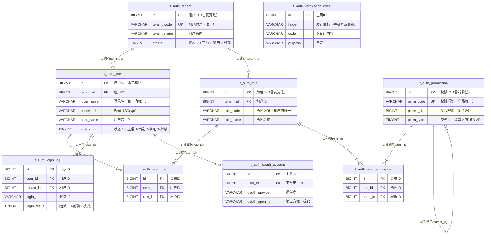

# 数据库设计文档（DBD）
**项目名称**：云漫智企（CloudStrollOffice）
**版本号**：0.0.1
**日期**：2026-08-06
**编写人**：DBA

## 1. 设计目标
本数据库设计服务于微服务企业办公套件「云漫智企」（CloudStrollOffice），覆盖以下目标：

- **统一认证授权**：支撑认证服务（auth-service，端口 9100）的多模式登录/注册、JWT 双 Token、RBAC 权限模型、OAuth 第三方账号绑定、手机/邮箱验证码、登录安全审计等核心能力。
- **多租户隔离**：基于租户表（t_auth_tenant）实现 SaaS 多租户数据隔离，用户、角色均在租户维度内唯一与隔离。
- **数据规模预估**：租户量级千级以内；单租户用户万级；登录日志为高频写入（预计日均十万级），需保证审计查询路径的索引效率；验证码记录量大但生命周期短（5 分钟过期），需支持按过期时间清理。
- **一致性要求**：业务表使用 InnoDB 事务引擎保证 ACID；用户-角色、角色-权限关联通过唯一约束防重；逻辑删除（deleted 字段）统一规范，禁止物理删除业务数据。
- **可扩展性**：企业服务（biz-service）与系统服务（system-service）数据库本版本仅建库不建表，为后续版本预留业务扩展空间。

## 2. 数据库选型
**数据库产品**：MariaDB（主数据库）、Redis 7.2.x（缓存层，用于会话管理、验证码限流等）
**版本**：MariaDB 10.6 (LTS)
**选型理由**：
- 与 MySQL 5.7+ 完全兼容，项目持久层使用 MyBatis-Plus 3.5.6 可直接适配，迁移成本低。
- 10.6 为 LTS 长期支持版本，稳定性与安全性有保障，社区生态成熟。
- InnoDB 引擎提供行级锁与事务支持，满足 RBAC 关联数据与登录审计的一致性要求。
- 开源免费，适合企业内部办公套件场景的私有化部署。
- 补充说明：认证服务原有 SQL 脚本（scripts/sql/）均按 MariaDB 10.6 / MySQL 5.7+ 语法编写，字符集统一 utf8mb4、排序规则 utf8mb4_general_ci，支持中文存储与检索。

## 3. ER 图

## 4. 逻辑模型
本版本数据库共 3 个库：认证服务库 `cloudstroll_office_auth`（9 张业务表）、企业服务库 `cloudstroll_office_biz`（预留）、系统服务库 `cloudstroll_office_system`（预留）。

认证库实体与关系：

1. **租户（t_auth_tenant）**：SaaS 平台企业租户，属性含租户名称、租户编码、联系人、状态、过期时间；一个租户拥有多个用户、多个角色。
2. **用户（t_auth_user）**：平台账号，属性含登录名、BCrypt 密码、显示名、手机号、邮箱、头像、状态、注册模式、账号完善状态、手机/邮箱验证状态、最后密码修改时间、最后登录信息；登录名在租户内唯一；一个用户可绑定多个角色（多对多）、多个 OAuth 第三方账号（一对多）、产生多条登录日志（一对多）。
3. **角色（t_auth_role）**：租户内角色定义，角色编码租户内唯一；一个角色可被多个用户关联（多对多）、分配多个权限（多对多）。
4. **权限（t_auth_permission）**：权限点定义，perm_code 全局唯一，通过 parent_id 构成树形结构（菜单 → 按钮/API）。
5. **用户-角色关联（t_auth_user_role）**：用户与角色的多对多关联，同一对 (user_id, role_id) 唯一。
6. **角色-权限关联（t_auth_role_permission）**：角色与权限的多对多关联，同一对 (role_id, perm_id) 唯一。
7. **登录日志（t_auth_login_log）**：用户登录认证审计记录，含登录 IP、客户端类型、设备信息、登录/登出时间、登录结果与失败原因。
8. **OAuth 账号（t_auth_oauth_account）**：用户与第三方 OAuth 账号绑定关系，同一提供商下 openId 唯一，支持一个用户绑定多个第三方账号。
9. **验证码记录（t_auth_verification_code）**：验证码生命周期管理（生成→校验→过期→使用），按发送目标+用途检索，按过期时间清理。

## 5. 物理模型

### 5.1 租户表（t_auth_tenant）
| 字段名 | 类型 | 长度 | 允许空 | 默认值 | 主键/外键 | 说明 |
| --- | --- | --- | --- | --- | --- | --- |
| id | BIGINT | 20 | 否 | 无 | 主键 | 租户ID（雪花算法） |
| tenant_name | VARCHAR | 100 | 否 | 无 | | 租户名称 |
| tenant_code | VARCHAR | 50 | 否 | 无 | 唯一键 | 租户编码（唯一标识） |
| contact_name | VARCHAR | 50 | 是 | NULL | | 联系人姓名 |
| contact_phone | VARCHAR | 20 | 是 | NULL | | 联系人电话 |
| status | TINYINT | 4 | 否 | 0 | | 状态：0-正常 1-禁用 2-过期 |
| expire_time | DATETIME | | 是 | NULL | | 过期时间（NULL 表示永不过期） |
| create_time | DATETIME | | 否 | CURRENT_TIMESTAMP | | 创建时间 |
| update_time | DATETIME | | 否 | CURRENT_TIMESTAMP ON UPDATE | | 更新时间 |
| deleted | TINYINT | 1 | 否 | 0 | | 逻辑删除：0-正常 1-删除 |

### 5.2 用户表（t_auth_user）
| 字段名 | 类型 | 长度 | 允许空 | 默认值 | 主键/外键 | 说明 |
| --- | --- | --- | --- | --- | --- | --- |
| id | BIGINT | 20 | 否 | 无 | 主键 | 用户ID（雪花算法） |
| tenant_id | BIGINT | 20 | 否 | 无 | 外键 | 租户ID，关联 t_auth_tenant.id |
| login_name | VARCHAR | 50 | 否 | 无 | 唯一键 | 登录名（租户内唯一） |
| password | VARCHAR | 255 | 否 | 无 | | 密码（BCrypt 加密） |
| user_name | VARCHAR | 50 | 否 | 无 | | 用户显示名 |
| phone | VARCHAR | 20 | 是 | NULL | | 手机号 |
| email | VARCHAR | 100 | 是 | NULL | | 邮箱 |
| avatar | VARCHAR | 500 | 是 | NULL | | 头像 URL |
| status | TINYINT | 4 | 否 | 0 | | 状态：0-正常 1-锁定 2-禁用 3-封禁 |
| register_mode | VARCHAR | 32 | 是 | 'USERNAME' | | 注册模式（USERNAME/PHONE_CODE/OAUTH/PHONE_SET_USERNAME/OAUTH_SET_INFO），v0.1.6 扩展 |
| account_settled | TINYINT | 1 | 是 | 1 | | 账号信息是否完善：0-未完善 1-已完善，v0.1.6 扩展 |
| phone_verified | TINYINT | 1 | 是 | 0 | | 手机号是否已验证：0-未验证 1-已验证，v0.1.6 扩展 |
| email_verified | TINYINT | 1 | 是 | 0 | | 邮箱是否已验证：0-未验证 1-已验证，v0.1.6 扩展 |
| last_password_change_time | DATETIME | | 是 | NULL | | 最后修改密码时间，v0.1.6 扩展 |
| last_login_time | DATETIME | | 是 | NULL | | 最后登录时间 |
| last_login_ip | VARCHAR | 50 | 是 | NULL | | 最后登录 IP |
| create_time | DATETIME | | 否 | CURRENT_TIMESTAMP | | 创建时间 |
| update_time | DATETIME | | 否 | CURRENT_TIMESTAMP ON UPDATE | | 更新时间 |
| deleted | TINYINT | 1 | 否 | 0 | | 逻辑删除：0-正常 1-删除 |

### 5.3 角色表（t_auth_role）
| 字段名 | 类型 | 长度 | 允许空 | 默认值 | 主键/外键 | 说明 |
| --- | --- | --- | --- | --- | --- | --- |
| id | BIGINT | 20 | 否 | 无 | 主键 | 角色ID（雪花算法） |
| tenant_id | BIGINT | 20 | 否 | 无 | 外键 | 租户ID，关联 t_auth_tenant.id |
| role_name | VARCHAR | 50 | 否 | 无 | | 角色名称 |
| role_code | VARCHAR | 50 | 否 | 无 | 唯一键 | 角色编码（租户内唯一） |
| description | VARCHAR | 500 | 是 | NULL | | 角色描述 |
| sort_order | INT | 11 | 是 | 0 | | 排序号 |
| status | TINYINT | 4 | 否 | 0 | | 状态：0-正常 1-禁用 |
| create_time | DATETIME | | 否 | CURRENT_TIMESTAMP | | 创建时间 |
| update_time | DATETIME | | 否 | CURRENT_TIMESTAMP ON UPDATE | | 更新时间 |
| deleted | TINYINT | 1 | 否 | 0 | | 逻辑删除：0-正常 1-删除 |

### 5.4 权限表（t_auth_permission）
| 字段名 | 类型 | 长度 | 允许空 | 默认值 | 主键/外键 | 说明 |
| --- | --- | --- | --- | --- | --- | --- |
| id | BIGINT | 20 | 否 | 无 | 主键 | 权限ID（雪花算法） |
| perm_name | VARCHAR | 100 | 否 | 无 | | 权限名称 |
| perm_code | VARCHAR | 100 | 否 | 无 | 唯一键 | 权限标识（如 system:user:list，全局唯一） |
| perm_type | TINYINT | 4 | 否 | 1 | | 类型：1-菜单 2-按钮 3-API |
| parent_id | BIGINT | 20 | 是 | 0 | 外键（自关联） | 父权限ID（0 表示顶级） |
| path | VARCHAR | 200 | 是 | NULL | | 路由路径 |
| component | VARCHAR | 200 | 是 | NULL | | 组件路径 |
| icon | VARCHAR | 100 | 是 | NULL | | 图标 |
| sort_order | INT | 11 | 是 | 0 | | 排序号 |
| status | TINYINT | 4 | 否 | 0 | | 状态：0-正常 1-禁用 |
| create_time | DATETIME | | 否 | CURRENT_TIMESTAMP | | 创建时间 |
| update_time | DATETIME | | 否 | CURRENT_TIMESTAMP ON UPDATE | | 更新时间 |
| deleted | TINYINT | 1 | 否 | 0 | | 逻辑删除：0-正常 1-删除 |

### 5.5 用户角色关联表（t_auth_user_role）
| 字段名 | 类型 | 长度 | 允许空 | 默认值 | 主键/外键 | 说明 |
| --- | --- | --- | --- | --- | --- | --- |
| id | BIGINT | 20 | 否 | 无 | 主键 | 关联ID（雪花算法） |
| user_id | BIGINT | 20 | 否 | 无 | 外键 | 用户ID，关联 t_auth_user.id |
| role_id | BIGINT | 20 | 否 | 无 | 外键 | 角色ID，关联 t_auth_role.id |
| create_time | DATETIME | | 否 | CURRENT_TIMESTAMP | | 创建时间 |

### 5.6 角色权限关联表（t_auth_role_permission）
| 字段名 | 类型 | 长度 | 允许空 | 默认值 | 主键/外键 | 说明 |
| --- | --- | --- | --- | --- | --- | --- |
| id | BIGINT | 20 | 否 | 无 | 主键 | 关联ID（雪花算法） |
| role_id | BIGINT | 20 | 否 | 无 | 外键 | 角色ID，关联 t_auth_role.id |
| perm_id | BIGINT | 20 | 否 | 无 | 外键 | 权限ID，关联 t_auth_permission.id |
| create_time | DATETIME | | 否 | CURRENT_TIMESTAMP | | 创建时间 |

### 5.7 登录日志表（t_auth_login_log）
| 字段名 | 类型 | 长度 | 允许空 | 默认值 | 主键/外键 | 说明 |
| --- | --- | --- | --- | --- | --- | --- |
| id | BIGINT | 20 | 否 | 无 | 主键 | 日志ID（雪花算法） |
| user_id | BIGINT | 20 | 否 | 无 | 外键 | 用户ID，关联 t_auth_user.id |
| tenant_id | BIGINT | 20 | 否 | 无 | 外键 | 租户ID，关联 t_auth_tenant.id |
| login_name | VARCHAR | 50 | 是 | NULL | | 登录名 |
| login_ip | VARCHAR | 50 | 否 | 无 | | 登录 IP 地址 |
| client_type | VARCHAR | 20 | 否 | 无 | | 客户端类型（WINDOWS/H5/ANDROID/IOS/WECHAT_MINI/UBUNTU） |
| device_info | VARCHAR | 500 | 是 | NULL | | 设备信息 |
| login_time | DATETIME | | 否 | 无 | | 登录时间 |
| logout_time | DATETIME | | 是 | NULL | | 登出时间（NULL 表示未登出） |
| login_result | TINYINT | 4 | 否 | 0 | | 登录结果：0-成功 1-失败 |
| fail_reason | VARCHAR | 255 | 是 | NULL | | 失败原因 |
| create_time | DATETIME | | 否 | CURRENT_TIMESTAMP | | 创建时间 |

### 5.8 OAuth 第三方账号关联表（t_auth_oauth_account）
| 字段名 | 类型 | 长度 | 允许空 | 默认值 | 主键/外键 | 说明 |
| --- | --- | --- | --- | --- | --- | --- |
| id | BIGINT | 20 | 否 | 无 | 主键 | 主键ID（雪花算法） |
| user_id | BIGINT | 20 | 否 | 无 | 外键 | 平台用户ID，关联 t_auth_user.id |
| oauth_provider | VARCHAR | 32 | 否 | 无 | 唯一键（联合） | OAuth提供商（WECHAT/DINGTALK/WECHAT_WORK/ALIPAY） |
| oauth_open_id | VARCHAR | 256 | 否 | 无 | 唯一键（联合） | 第三方平台用户唯一标识（openId） |
| oauth_union_id | VARCHAR | 256 | 是 | NULL | | 第三方平台用户统一标识（unionId，可选） |
| oauth_nickname | VARCHAR | 128 | 是 | NULL | | 第三方平台昵称 |
| oauth_avatar | VARCHAR | 512 | 是 | NULL | | 第三方平台头像URL |
| bound_time | DATETIME | | 是 | NULL | | 绑定时间 |
| create_time | DATETIME | 3 | 否 | CURRENT_TIMESTAMP(3) | | 创建时间 |
| update_time | DATETIME | 3 | 否 | CURRENT_TIMESTAMP(3) ON UPDATE | | 更新时间 |
| deleted | TINYINT | 1 | 否 | 0 | | 逻辑删除：0-正常 1-删除 |

### 5.9 验证码记录表（t_auth_verification_code）
| 字段名 | 类型 | 长度 | 允许空 | 默认值 | 主键/外键 | 说明 |
| --- | --- | --- | --- | --- | --- | --- |
| id | BIGINT | 20 | 否 | 无 | 主键 | 主键ID（雪花算法） |
| target | VARCHAR | 128 | 否 | 无 | | 发送目标（手机号或邮箱） |
| code | VARCHAR | 16 | 否 | 无 | | 验证码内容（6位数字） |
| send_mode | VARCHAR | 16 | 否 | 无 | | 发送方式（SMS/EMAIL） |
| purpose | VARCHAR | 32 | 否 | 无 | | 用途（REGISTER/LOGIN/RESET_PASSWORD/CHANGE_PHONE） |
| expire_time | DATETIME | | 否 | 无 | | 过期时间（创建时间+5分钟） |
| used | TINYINT | 1 | 否 | 0 | | 是否已使用：0-未使用 1-已使用 |
| used_time | DATETIME | | 是 | NULL | | 使用时间（标记为已使用时记录） |
| send_count | INT | 11 | 是 | 0 | | 当日已发送次数 |
| create_time | DATETIME | 3 | 否 | CURRENT_TIMESTAMP(3) | | 创建时间 |
| update_time | DATETIME | 3 | 否 | CURRENT_TIMESTAMP(3) ON UPDATE | | 更新时间 |
| deleted | TINYINT | 1 | 否 | 0 | | 逻辑删除：0-正常 1-删除 |

## 6. 索引设计
| 索引名称 | 表名 | 字段 | 类型 | 说明 |
| --- | --- | --- | --- | --- |
| PRIMARY | t_auth_tenant | id | 主键索引 | 租户主键 |
| uk_tenant_code | t_auth_tenant | tenant_code | 唯一索引 | 租户编码全局唯一 |
| PRIMARY | t_auth_user | id | 主键索引 | 用户主键 |
| uk_user_login_name | t_auth_user | tenant_id, login_name | 唯一索引 | 登录名在租户内唯一 |
| idx_register_mode | t_auth_user | register_mode | 普通索引 | 支持按注册模式筛选查询（v0.1.6） |
| idx_status | t_auth_user | status | 普通索引 | 支持按用户状态筛选 |
| PRIMARY | t_auth_role | id | 主键索引 | 角色主键 |
| uk_role_code | t_auth_role | tenant_id, role_code | 唯一索引 | 角色编码在租户内唯一 |
| PRIMARY | t_auth_permission | id | 主键索引 | 权限主键 |
| uk_perm_code | t_auth_permission | perm_code | 唯一索引 | 权限标识全局唯一 |
| idx_parent_id | t_auth_permission | parent_id | 普通索引 | 支持树形结构按父节点查询 |
| PRIMARY | t_auth_user_role | id | 主键索引 | 关联主键 |
| uk_user_role | t_auth_user_role | user_id, role_id | 唯一索引 | 用户-角色关联防重 |
| idx_role_id | t_auth_user_role | role_id | 普通索引 | 支持按角色反查用户 |
| PRIMARY | t_auth_role_permission | id | 主键索引 | 关联主键 |
| uk_role_perm | t_auth_role_permission | role_id, perm_id | 唯一索引 | 角色-权限关联防重 |
| idx_perm_id | t_auth_role_permission | perm_id | 普通索引 | 支持按权限反查角色 |
| PRIMARY | t_auth_login_log | id | 主键索引 | 日志主键 |
| idx_log_user_time | t_auth_login_log | user_id, login_time | 普通索引 | 支持按用户+时间查询登录历史 |
| idx_log_tenant_time | t_auth_login_log | tenant_id, login_time | 普通索引 | 支持按租户+时间查询审计记录 |
| PRIMARY | t_auth_oauth_account | id | 主键索引 | 主键 |
| uk_provider_openid | t_auth_oauth_account | oauth_provider, oauth_open_id | 唯一索引 | 同一OAuth提供商下openId唯一 |
| idx_user_id | t_auth_oauth_account | user_id | 普通索引 | 支持按平台用户ID查询绑定账号 |
| PRIMARY | t_auth_verification_code | id | 主键索引 | 主键 |
| idx_target_purpose | t_auth_verification_code | target, purpose | 普通索引 | 支持按发送目标和用途查询 |
| idx_expire_time | t_auth_verification_code | expire_time | 普通索引 | 支持按过期时间清理过期记录 |

## 7. 视图 / 存储过程 / 触发器设计
### 7.1 视图
本版本不设计视图。登录日志、RBAC 关联查询均通过服务层 MyBatis-Plus 联表查询实现，避免视图带来的性能不可控问题。

### 7.2 存储过程
本版本不设计存储过程。业务逻辑统一收敛在 Java 服务层（Spring Boot + MyBatis-Plus），便于版本控制、单元测试与跨数据库迁移。

### 7.3 触发器
本版本不设计触发器。create_time / update_time 由 DDL 内建 DEFAULT CURRENT_TIMESTAMP / ON UPDATE CURRENT_TIMESTAMP 自动维护；逻辑删除由服务层统一处理，避免触发器带来的隐式行为与维护成本。

## 8. 数据字典
### 枚举值汇总
| 字段路径 | 取值 | 说明 |
| --- | --- | --- |
| t_auth_tenant.status | 0 | 正常 |
| t_auth_tenant.status | 1 | 禁用 |
| t_auth_tenant.status | 2 | 过期 |
| t_auth_user.status | 0 | 正常 |
| t_auth_user.status | 1 | 锁定 |
| t_auth_user.status | 2 | 禁用 |
| t_auth_user.status | 3 | 封禁 |
| t_auth_user.register_mode | USERNAME | 用户名密码注册 |
| t_auth_user.register_mode | PHONE_CODE | 手机号验证码注册 |
| t_auth_user.register_mode | OAUTH | 第三方 OAuth 直接注册 |
| t_auth_user.register_mode | PHONE_SET_USERNAME | 手机号注册后设置用户名完善 |
| t_auth_user.register_mode | OAUTH_SET_INFO | OAuth 注册后完善资料 |
| t_auth_user.account_settled | 0 | 账号信息未完善 |
| t_auth_user.account_settled | 1 | 账号信息已完善 |
| t_auth_user.phone_verified | 0 | 手机号未验证 |
| t_auth_user.phone_verified | 1 | 手机号已验证 |
| t_auth_user.email_verified | 0 | 邮箱未验证 |
| t_auth_user.email_verified | 1 | 邮箱已验证 |
| t_auth_user.deleted | 0 | 正常 |
| t_auth_user.deleted | 1 | 已删除（逻辑删除） |
| t_auth_role.status | 0 | 正常 |
| t_auth_role.status | 1 | 禁用 |
| t_auth_permission.perm_type | 1 | 菜单 |
| t_auth_permission.perm_type | 2 | 按钮 |
| t_auth_permission.perm_type | 3 | API |
| t_auth_permission.status | 0 | 正常 |
| t_auth_permission.status | 1 | 禁用 |
| t_auth_permission.parent_id | 0 | 顶级节点（无父权限） |
| t_auth_login_log.client_type | WINDOWS | Windows 桌面客户端 |
| t_auth_login_log.client_type | H5 | H5 移动网页客户端 |
| t_auth_login_log.client_type | ANDROID | Android 客户端 |
| t_auth_login_log.client_type | IOS | iOS 客户端 |
| t_auth_login_log.client_type | WECHAT_MINI | 微信小程序客户端 |
| t_auth_login_log.client_type | UBUNTU | Ubuntu 桌面客户端 |
| t_auth_login_log.login_result | 0 | 登录成功 |
| t_auth_login_log.login_result | 1 | 登录失败 |
| 登录模式（业务层） | USERNAME_PASSWORD | 用户名密码登录 |
| 登录模式（业务层） | PHONE_CODE | 手机号验证码登录 |
| 登录模式（业务层） | OAUTH | 第三方 OAuth 登录 |
| 登录模式（业务层） | OAUTH_SET_INFO | OAuth 登录后完善资料 |
| t_auth_oauth_account.oauth_provider | WECHAT | 微信开放平台 |
| t_auth_oauth_account.oauth_provider | DINGTALK | 钉钉 |
| t_auth_oauth_account.oauth_provider | WECHAT_WORK | 企业微信 |
| t_auth_oauth_account.oauth_provider | ALIPAY | 支付宝 |
| t_auth_verification_code.send_mode | SMS | 短信发送 |
| t_auth_verification_code.send_mode | EMAIL | 邮件发送 |
| t_auth_verification_code.purpose | REGISTER | 注册验证 |
| t_auth_verification_code.purpose | LOGIN | 登录验证 |
| t_auth_verification_code.purpose | RESET_PASSWORD | 重置密码 |
| t_auth_verification_code.purpose | CHANGE_PHONE | 更换手机号 |
| t_auth_verification_code.used | 0 | 未使用 |
| t_auth_verification_code.used | 1 | 已使用 |
| 逻辑删除（deleted，通用） | 0 | 正常 |
| 逻辑删除（deleted，通用） | 1 | 已删除 |

## 9. 备份恢复策略
- **备份频率**：全量备份每日 1 次（凌晨业务低峰 02:00），增量备份（binlog）持续开启，按日志每 30 分钟归档。
- **备份方式**：使用 mysqldump --single-transaction 在线全量备份（InnoDB 一致性快照），binlog 归档用于时间点恢复；备份文件统一存放于独立备份存储（异地备份一份）。
- **保留周期**：全量备份保留 30 天，binlog 保留 15 天；月度全量备份单独归档保留 12 个月。
- **恢复演练**：每季度执行一次恢复演练，验证备份可用性与 RTO（目标 4 小时）/ RPO（目标 30 分钟）。
- **开发环境**：可执行本 DBD 配套初始化 SQL（含 DROP/CREATE DATABASE 段）重建库表。

## 10. 安全策略
- **账号权限**：生产数据库禁止使用 root 直连；为 auth-service 创建最小权限专用账号（仅授权 cloudstroll_office_auth 的 SELECT/INSERT/UPDATE/DELETE），biz/system 库各自独立账号；应用层禁止 DDL 权限。
- **敏感数据加密**：用户密码统一 BCrypt（cost=10）加盐哈希存储，禁止明文；验证码仅保存哈希不落明文（或保存短时有效密文并在校验后立即标记使用）；OAuth access_token/refresh_token 不落库，仅存 openId/unionId 等标识。
- **数据脱敏**：登录日志中手机号、邮箱等个人敏感信息按需脱敏展示；日志输出禁止包含密码、Token、密钥。
- **审计**：登录成功/失败全部记录 t_auth_login_log 审计日志（含 IP、客户端、设备、失败原因）；登录失败限流由 Redis 计数支撑。
- **网络安全**：数据库仅监听内网地址；应用与数据库之间使用独立内网安全组；生产环境启用 TLS 加密连接。
- **合规**：敏感数据访问遵循最小权限原则；管理员账号 admin（默认密码 admin123）首次登录强制修改密码。

<!-- SPDX-License-Identifier: Apache-2.0 / Copyright 2026 jenemy8023 <jenemy8023@163.com> -->
