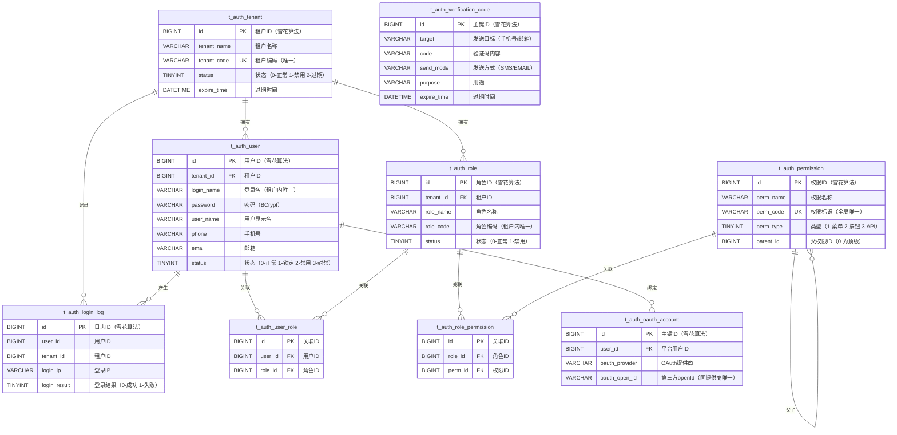

# 数据库设计文档（DBD）
**项目名称**：云漫智企（CloudStrollOffice，英文缩写 cso）
**版本号**：v0.0.1（初始化归档版本，对应实际业务版本 v0.1.6）
**日期**：2026-08-05
**编写人**：DBA

## 1. 设计目标

- **支撑业务**：为认证服务（auth-service）的统一认证授权体系提供数据支撑，覆盖多模式登录注册（4 种登录 + 5 种注册）、JWT RS256 双 Token、RBAC 多租户权限模型（用户-角色-权限三层关联）、密码管理、手机号变更、验证码生命周期管理、登录日志审计、OAuth 第三方账号关联等核心能力；企业服务（biz-service）与系统服务（system-service）当前为骨架阶段，预留独立数据库空间。
- **多租户隔离**：以租户（tenant）为数据隔离边界，用户名在租户内唯一、角色编码在租户内唯一，租户间数据不可见，支撑多企业共用一套系统的 SaaS 化运营。
- **数据规模预估**：单租户用户规模十万级以内、角色/权限百级以内，登录日志与验证码记录为高频写入的流水数据（日增万级），需按时间维度建索引并规划归档清理。
- **一致性要求**：事务内保证 RBAC 关联数据（用户-角色、角色-权限）的强一致；会话、黑名单、状态等热点数据一致性由 Redis 实时缓存保证（详见第 11 章）；逻辑删除统一采用 `deleted` 标记（0-正常 1-删除），配合 MyBatis-Plus `@TableLogic` 实现软删除。
- **规范化与反规范化权衡**：业务表遵循第三范式（3NF）设计，用户表冗余最后登录时间/IP 等高频读取字段以降低查询次数；流水表（登录日志、验证码记录）不做跨表冗余。

## 2. 数据库选型

**数据库产品**：MariaDB（关系型数据）+ Redis（缓存）
**版本**：MariaDB 10.6 (LTS)；Redis 7.2.x
**选型理由**：
- MariaDB 10.6 (LTS) 与 MySQL 完全兼容、开源免费、社区版长期维护，无商业授权成本；项目 ORM 采用 MyBatis-Plus 3.5.6，驱动使用 MariaDB Connector/J 3.3.3，生态成熟稳定。
- 字符集统一 utf8mb4（排序规则 utf8mb4_general_ci），支持中文等全 Unicode 字符；存储引擎统一 InnoDB，支持事务、行级锁与崩溃恢复。
- Redis 7.2.x 承载高实时性要求的数据：登录态会话、Token 黑名单、账号/租户状态缓存、验证码缓存与发送频率计数，保障登出/踢人/封禁等操作的即时生效与网关 9 步校验的低延迟查询。

## 3. ER 图

## 4. 逻辑模型

### 4.1 实体清单

| 实体 | 表名 | 说明 | 关键属性 |
| --- | --- | --- | --- |
| 租户 | t_auth_tenant | SaaS 企业租户，数据隔离边界 | 租户编码（唯一）、租户名称、状态、过期时间 |
| 用户 | t_auth_user | 平台账号，登录名租户内唯一 | 登录名、密码（BCrypt）、手机号、邮箱、注册模式、账号完善/验证状态 |
| 角色 | t_auth_role | 权限集合，角色编码租户内唯一 | 角色名称、角色编码、描述、排序 |
| 权限 | t_auth_permission | 权限点，树形结构（菜单/按钮/API） | 权限名称、权限编码（唯一）、类型、父权限 |
| 用户-角色 | t_auth_user_role | 用户与角色多对多关联 | 用户 ID、角色 ID（联合唯一） |
| 角色-权限 | t_auth_role_permission | 角色与权限多对多关联 | 角色 ID、权限 ID（联合唯一） |
| 登录日志 | t_auth_login_log | 登录/登出审计流水 | 用户、租户、IP、客户端类型、结果、失败原因 |
| OAuth 账号 | t_auth_oauth_account | 用户与第三方 OAuth 账号绑定 | 提供商、openId（同提供商唯一）、unionId、昵称 |
| 验证码记录 | t_auth_verification_code | 验证码生命周期流水 | 目标、验证码、发送方式、用途、过期时间、使用状态 |

### 4.2 公共字段（继承 BaseEntity）

所有业务实体均含公共字段：`id`（BIGINT 主键，MyBatis-Plus 雪花算法 ASSIGN_ID 生成）、`create_time`（创建时间）、`update_time`（更新时间）、`deleted`（逻辑删除标记，0-正常 1-删除）。

### 4.3 关系说明

- 租户与用户：1 对 N；租户与角色：1 对 N；租户与登录日志：1 对 N。
- 用户与角色：N 对 M，通过 t_auth_user_role 关联（联合唯一约束防止重复分配）。
- 角色与权限：N 对 M，通过 t_auth_role_permission 关联（联合唯一约束）。
- 权限自关联：parent_id 引用自身 id 构成树形结构（0 表示顶级节点）。
- 用户与 OAuth 账号：1 对 N（一个用户可绑定多个第三方账号）。
- 用户与登录日志：1 对 N（登录流水不删除，仅归档）。
- 关联关系逻辑上存在外键引用，物理表不建 FOREIGN KEY 约束（由服务层保证，提升写入性能并支持逻辑删除语义）。

## 5. 物理模型

统一约定：存储引擎 InnoDB；字符集 utf8mb4；排序规则 utf8mb4_general_ci；时间字段类型 DATETIME；主键/唯一键/普通键均使用 BTREE 索引；所有表均带公共字段（id/create_time/update_time/deleted），其中 id 为雪花算法 BIGINT 主键。

### 5.1 t_auth_tenant（租户表）

| 字段名 | 类型 | 长度 | 允许空 | 默认值 | 主键/外键 | 说明 |
| --- | --- | --- | --- | --- | --- | --- |
| id | BIGINT | 20 | 否 | - | 主键 | 租户 ID（雪花算法） |
| tenant_name | VARCHAR | 100 | 否 | - | - | 租户名称 |
| tenant_code | VARCHAR | 50 | 否 | - | 唯一键 uk_tenant_code | 租户编码（唯一标识） |
| contact_name | VARCHAR | 50 | 是 | NULL | - | 联系人姓名 |
| contact_phone | VARCHAR | 20 | 是 | NULL | - | 联系人电话 |
| status | TINYINT | 4 | 否 | 0 | - | 状态：0-正常 1-禁用 2-过期 |
| expire_time | DATETIME | - | 是 | NULL | - | 过期时间（NULL 表示永不过期） |
| create_time | DATETIME | - | 否 | CURRENT_TIMESTAMP | - | 创建时间 |
| update_time | DATETIME | - | 否 | CURRENT_TIMESTAMP ON UPDATE | - | 更新时间 |
| deleted | TINYINT | 1 | 否 | 0 | - | 逻辑删除：0-正常 1-删除 |

### 5.2 t_auth_user（用户表）

| 字段名 | 类型 | 长度 | 允许空 | 默认值 | 主键/外键 | 说明 |
| --- | --- | --- | --- | --- | --- | --- |
| id | BIGINT | 20 | 否 | - | 主键 | 用户 ID（雪花算法） |
| tenant_id | BIGINT | 20 | 否 | - | 逻辑关联 t_auth_tenant.id | 租户 ID |
| login_name | VARCHAR | 50 | 否 | - | 唯一键 uk_user_login_name（tenant_id, login_name） | 登录名（租户内唯一） |
| password | VARCHAR | 255 | 否 | - | - | 密码（BCrypt 加密） |
| user_name | VARCHAR | 50 | 否 | - | - | 用户显示名 |
| phone | VARCHAR | 20 | 是 | NULL | - | 手机号 |
| email | VARCHAR | 100 | 是 | NULL | - | 邮箱 |
| avatar | VARCHAR | 500 | 是 | NULL | - | 头像 URL |
| status | TINYINT | 4 | 否 | 0 | - | 状态：0-正常 1-锁定 2-禁用 3-封禁 |
| lock_reason | VARCHAR | 255 | 是 | NULL | - | 锁定/封禁原因 |
| register_mode | VARCHAR | 32 | 是 | 'USERNAME' | - | 注册模式（USERNAME/PHONE_CODE/OAUTH/PHONE_SET_USERNAME/OAUTH_SET_INFO） |
| account_settled | TINYINT | 1 | 是 | 1 | - | 账号信息是否完善：0-未完善 1-已完善 |
| phone_verified | TINYINT | 1 | 是 | 0 | - | 手机号是否已验证：0-未验证 1-已验证 |
| email_verified | TINYINT | 1 | 是 | 0 | - | 邮箱是否已验证：0-未验证 1-已验证 |
| last_password_change_time | DATETIME | - | 是 | NULL | - | 最后修改密码时间 |
| last_login_time | DATETIME | - | 是 | NULL | - | 最后登录时间 |
| last_login_ip | VARCHAR | 50 | 是 | NULL | - | 最后登录 IP |
| create_time | DATETIME | - | 否 | CURRENT_TIMESTAMP | - | 创建时间 |
| update_time | DATETIME | - | 否 | CURRENT_TIMESTAMP ON UPDATE | - | 更新时间 |
| deleted | TINYINT | 1 | 否 | 0 | - | 逻辑删除：0-正常 1-删除 |

### 5.3 t_auth_role（角色表）

| 字段名 | 类型 | 长度 | 允许空 | 默认值 | 主键/外键 | 说明 |
| --- | --- | --- | --- | --- | --- | --- |
| id | BIGINT | 20 | 否 | - | 主键 | 角色 ID（雪花算法） |
| tenant_id | BIGINT | 20 | 否 | - | 逻辑关联 t_auth_tenant.id | 租户 ID |
| role_name | VARCHAR | 50 | 否 | - | - | 角色名称 |
| role_code | VARCHAR | 50 | 否 | - | 唯一键 uk_role_code（tenant_id, role_code） | 角色编码（租户内唯一） |
| description | VARCHAR | 500 | 是 | NULL | - | 角色描述 |
| sort_order | INT | 11 | 是 | 0 | - | 排序号 |
| status | TINYINT | 4 | 否 | 0 | - | 状态：0-正常 1-禁用 |
| create_time | DATETIME | - | 否 | CURRENT_TIMESTAMP | - | 创建时间 |
| update_time | DATETIME | - | 否 | CURRENT_TIMESTAMP ON UPDATE | - | 更新时间 |
| deleted | TINYINT | 1 | 否 | 0 | - | 逻辑删除：0-正常 1-删除 |

### 5.4 t_auth_permission（权限表）

| 字段名 | 类型 | 长度 | 允许空 | 默认值 | 主键/外键 | 说明 |
| --- | --- | --- | --- | --- | --- | --- |
| id | BIGINT | 20 | 否 | - | 主键 | 权限 ID（雪花算法） |
| perm_name | VARCHAR | 100 | 否 | - | - | 权限名称 |
| perm_code | VARCHAR | 100 | 否 | - | 唯一键 uk_perm_code | 权限标识（如 system:user:list，全局唯一） |
| perm_type | TINYINT | 4 | 否 | 1 | - | 类型：1-菜单 2-按钮 3-API |
| parent_id | BIGINT | 20 | 是 | 0 | 逻辑自关联 id | 父权限 ID（0 表示顶级） |
| path | VARCHAR | 200 | 是 | NULL | - | 前端路由路径 |
| component | VARCHAR | 200 | 是 | NULL | - | 前端组件路径 |
| icon | VARCHAR | 100 | 是 | NULL | - | 图标 |
| sort_order | INT | 11 | 是 | 0 | - | 排序号 |
| status | TINYINT | 4 | 否 | 0 | - | 状态：0-正常 1-禁用 |
| create_time | DATETIME | - | 否 | CURRENT_TIMESTAMP | - | 创建时间 |
| update_time | DATETIME | - | 否 | CURRENT_TIMESTAMP ON UPDATE | - | 更新时间 |
| deleted | TINYINT | 1 | 否 | 0 | - | 逻辑删除：0-正常 1-删除 |

### 5.5 t_auth_user_role（用户-角色关联表）

| 字段名 | 类型 | 长度 | 允许空 | 默认值 | 主键/外键 | 说明 |
| --- | --- | --- | --- | --- | --- | --- |
| id | BIGINT | 20 | 否 | - | 主键 | 关联 ID（雪花算法） |
| user_id | BIGINT | 20 | 否 | - | 逻辑关联 t_auth_user.id | 用户 ID |
| role_id | BIGINT | 20 | 否 | - | 逻辑关联 t_auth_role.id | 角色 ID |
| create_time | DATETIME | - | 否 | CURRENT_TIMESTAMP | - | 创建时间 |
| update_time | DATETIME | - | 否 | CURRENT_TIMESTAMP ON UPDATE | - | 更新时间 |
| deleted | TINYINT | 1 | 否 | 0 | - | 逻辑删除：0-正常 1-删除 |

### 5.6 t_auth_role_permission（角色-权限关联表）

| 字段名 | 类型 | 长度 | 允许空 | 默认值 | 主键/外键 | 说明 |
| --- | --- | --- | --- | --- | --- | --- |
| id | BIGINT | 20 | 否 | - | 主键 | 关联 ID（雪花算法） |
| role_id | BIGINT | 20 | 否 | - | 逻辑关联 t_auth_role.id | 角色 ID |
| perm_id | BIGINT | 20 | 否 | - | 逻辑关联 t_auth_permission.id | 权限 ID |
| create_time | DATETIME | - | 否 | CURRENT_TIMESTAMP | - | 创建时间 |
| update_time | DATETIME | - | 否 | CURRENT_TIMESTAMP ON UPDATE | - | 更新时间 |
| deleted | TINYINT | 1 | 否 | 0 | - | 逻辑删除：0-正常 1-删除 |

### 5.7 t_auth_login_log（登录日志表）

| 字段名 | 类型 | 长度 | 允许空 | 默认值 | 主键/外键 | 说明 |
| --- | --- | --- | --- | --- | --- | --- |
| id | BIGINT | 20 | 否 | - | 主键 | 日志 ID（雪花算法） |
| user_id | BIGINT | 20 | 否 | - | 逻辑关联 t_auth_user.id | 用户 ID |
| tenant_id | BIGINT | 20 | 否 | - | 逻辑关联 t_auth_tenant.id | 租户 ID |
| login_name | VARCHAR | 50 | 是 | NULL | - | 登录名 |
| login_ip | VARCHAR | 50 | 否 | - | - | 登录 IP 地址 |
| client_type | VARCHAR | 20 | 否 | - | - | 客户端类型（WINDOWS/H5/ANDROID/IOS/WECHAT_MINI/UBUNTU） |
| device_info | VARCHAR | 500 | 是 | NULL | - | 设备信息 |
| login_time | DATETIME | - | 否 | - | - | 登录时间 |
| logout_time | DATETIME | - | 是 | NULL | - | 登出时间（NULL 表示未登出） |
| login_result | TINYINT | 4 | 否 | 0 | - | 登录结果：0-成功 1-失败 |
| fail_reason | VARCHAR | 255 | 是 | NULL | - | 失败原因 |
| create_time | DATETIME | - | 否 | CURRENT_TIMESTAMP | - | 创建时间 |
| update_time | DATETIME | - | 否 | CURRENT_TIMESTAMP ON UPDATE | - | 更新时间 |
| deleted | TINYINT | 1 | 否 | 0 | - | 逻辑删除：0-正常 1-删除 |

### 5.8 t_auth_oauth_account（OAuth 第三方账号关联表）

| 字段名 | 类型 | 长度 | 允许空 | 默认值 | 主键/外键 | 说明 |
| --- | --- | --- | --- | --- | --- | --- |
| id | BIGINT | 20 | 否 | - | 主键 | 主键 ID（雪花算法） |
| user_id | BIGINT | 20 | 否 | - | 逻辑关联 t_auth_user.id | 平台用户 ID |
| oauth_provider | VARCHAR | 32 | 否 | - | 唯一键 uk_provider_openid（oauth_provider, oauth_open_id） | OAuth 提供商（WECHAT/DINGTALK/WECHAT_WORK/ALIPAY 等） |
| oauth_open_id | VARCHAR | 256 | 否 | - | 唯一键 uk_provider_openid | 第三方平台用户唯一标识（openId） |
| oauth_union_id | VARCHAR | 256 | 是 | NULL | - | 第三方平台用户统一标识（unionId，可选） |
| oauth_nickname | VARCHAR | 128 | 是 | NULL | - | 第三方平台昵称 |
| oauth_avatar | VARCHAR | 512 | 是 | NULL | - | 第三方平台头像 URL |
| bound_time | DATETIME | - | 是 | NULL | - | 绑定时间 |
| create_time | DATETIME(3) | - | 否 | CURRENT_TIMESTAMP(3) | - | 创建时间（毫秒精度） |
| update_time | DATETIME(3) | - | 否 | CURRENT_TIMESTAMP(3) ON UPDATE | - | 更新时间（毫秒精度） |
| deleted | TINYINT | 1 | 否 | 0 | - | 逻辑删除：0-正常 1-删除 |

### 5.9 t_auth_verification_code（验证码记录表）

| 字段名 | 类型 | 长度 | 允许空 | 默认值 | 主键/外键 | 说明 |
| --- | --- | --- | --- | --- | --- | --- |
| id | BIGINT | 20 | 否 | - | 主键 | 主键 ID（雪花算法） |
| target | VARCHAR | 128 | 否 | - | - | 发送目标（手机号或邮箱） |
| code | VARCHAR | 16 | 否 | - | - | 验证码内容（6 位数字） |
| send_mode | VARCHAR | 16 | 否 | - | - | 发送方式（SMS-短信，EMAIL-邮件） |
| purpose | VARCHAR | 32 | 否 | - | - | 用途（REGISTER/LOGIN/RESET_PASSWORD/CHANGE_PHONE） |
| expire_time | DATETIME | - | 否 | - | - | 过期时间（创建时间 + 5 分钟） |
| used | TINYINT | 1 | 否 | 0 | - | 是否已使用：0-未使用 1-已使用 |
| used_time | DATETIME | - | 是 | NULL | - | 使用时间（标记为已使用时记录） |
| send_count | INT | 11 | 是 | 0 | - | 已发送次数（用于频率控制） |
| create_time | DATETIME(3) | - | 否 | CURRENT_TIMESTAMP(3) | - | 创建时间（毫秒精度） |
| update_time | DATETIME(3) | - | 否 | CURRENT_TIMESTAMP(3) ON UPDATE | - | 更新时间（毫秒精度） |
| deleted | TINYINT | 1 | 否 | 0 | - | 逻辑删除：0-正常 1-删除 |

## 6. 索引设计

| 索引名称 | 表名 | 字段 | 类型 | 说明 |
| --- | --- | --- | --- | --- |
| PRIMARY | t_auth_tenant | id | 主键 | 租户主键（BTREE） |
| uk_tenant_code | t_auth_tenant | tenant_code | 唯一 | 租户编码唯一，登录时按租户编码精确定位 |
| PRIMARY | t_auth_user | id | 主键 | 用户主键（BTREE） |
| uk_user_login_name | t_auth_user | tenant_id, login_name | 唯一 | 登录名租户内唯一（多租户隔离核心约束） |
| idx_register_mode | t_auth_user | register_mode | 普通 | 按注册模式筛选/统计 |
| idx_status | t_auth_user | status | 普通 | 按账号状态筛选（封禁/停用批量操作） |
| PRIMARY | t_auth_role | id | 主键 | 角色主键（BTREE） |
| uk_role_code | t_auth_role | tenant_id, role_code | 唯一 | 角色编码租户内唯一 |
| PRIMARY | t_auth_permission | id | 主键 | 权限主键（BTREE） |
| uk_perm_code | t_auth_permission | perm_code | 唯一 | 权限编码全局唯一 |
| idx_parent_id | t_auth_permission | parent_id | 普通 | 权限树形查询（按父节点加载子节点） |
| PRIMARY | t_auth_user_role | id | 主键 | 关联主键（BTREE） |
| uk_user_role | t_auth_user_role | user_id, role_id | 唯一 | 防重复分配（联合唯一） |
| idx_role_id | t_auth_user_role | role_id | 普通 | 反向查询角色下的用户 |
| PRIMARY | t_auth_role_permission | id | 主键 | 关联主键（BTREE） |
| uk_role_perm | t_auth_role_permission | role_id, perm_id | 唯一 | 防重复分配（联合唯一） |
| idx_perm_id | t_auth_role_permission | perm_id | 普通 | 反向查询权限被哪些角色引用 |
| PRIMARY | t_auth_login_log | id | 主键 | 日志主键（BTREE） |
| idx_log_user_time | t_auth_login_log | user_id, login_time | 普通 | 按用户查登录历史（复合前缀索引） |
| idx_log_tenant_time | t_auth_login_log | tenant_id, login_time | 普通 | 按租户查登录历史/审计 |
| PRIMARY | t_auth_oauth_account | id | 主键 | 主键（BTREE） |
| uk_provider_openid | t_auth_oauth_account | oauth_provider, oauth_open_id | 唯一 | 同一 OAuth 提供商下 openId 唯一，OAuth 登录匹配 |
| idx_user_id | t_auth_oauth_account | user_id | 普通 | 按平台用户查询已绑定的第三方账号 |
| PRIMARY | t_auth_verification_code | id | 主键 | 主键（BTREE） |
| idx_target_purpose | t_auth_verification_code | target, purpose | 普通 | 按发送目标与用途查询/防滥用 |
| idx_expire_time | t_auth_verification_code | expire_time | 普通 | 按过期时间清理过期记录 |

## 7. 视图 / 存储过程 / 触发器设计

### 7.1 视图
无。用户-角色-权限三层关联查询由服务层通过 MyBatis-Plus 多表 JOIN 完成，不建视图。

### 7.2 存储过程
无。业务逻辑集中在服务层，数据库仅承担数据存储与约束，便于微服务多实例水平扩展。

### 7.3 触发器
无。公共字段（create_time/update_time/deleted）由 MyBatis-Plus 自动填充处理器与 DEFAULT 值保证，避免触发器带来的隐式开销与维护成本。

## 8. 数据字典

### 枚举值汇总

| 字段路径 | 取值 | 说明 |
| --- | --- | --- |
| t_auth_tenant.status | 0 | 正常 |
| t_auth_tenant.status | 1 | 禁用 |
| t_auth_tenant.status | 2 | 过期 |
| t_auth_user.status | 0 | 正常 |
| t_auth_user.status | 1 | 锁定 |
| t_auth_user.status | 2 | 禁用 |
| t_auth_user.status | 3 | 封禁 |
| t_auth_user.register_mode | USERNAME | 用户名密码注册 |
| t_auth_user.register_mode | PHONE_CODE | 手机验证码注册 |
| t_auth_user.register_mode | OAUTH | OAuth 第三方注册 |
| t_auth_user.register_mode | PHONE_SET_USERNAME | 手机号设用户名注册（两步注册） |
| t_auth_user.register_mode | OAUTH_SET_INFO | OAuth 补全信息注册（两步注册） |
| t_auth_user.account_settled | 0 / 1 | 账号信息未完善 / 已完善 |
| t_auth_user.phone_verified | 0 / 1 | 手机号未验证 / 已验证 |
| t_auth_user.email_verified | 0 / 1 | 邮箱未验证 / 已验证 |
| t_auth_role.status | 0 / 1 | 正常 / 禁用 |
| t_auth_permission.perm_type | 1 | 菜单 |
| t_auth_permission.perm_type | 2 | 按钮 |
| t_auth_permission.perm_type | 3 | API |
| t_auth_permission.parent_id | 0 | 顶级节点（无父权限） |
| t_auth_permission.status | 0 / 1 | 正常 / 禁用 |
| t_auth_login_log.client_type | WINDOWS / UBUNTU / H5 / ANDROID / IOS / WECHAT_MINI | 客户端类型（对应 ClientTypeEnum 6 种） |
| t_auth_login_log.login_result | 0 / 1 | 登录成功 / 失败 |
| t_auth_oauth_account.oauth_provider | WECHAT / QQ / GITEE / GITHUB 等 | OAuth 提供商（OAuthProviderEnum，可扩展） |
| t_auth_verification_code.send_mode | SMS / EMAIL | 短信 / 邮件发送方式 |
| t_auth_verification_code.purpose | REGISTER | 注册用途 |
| t_auth_verification_code.purpose | LOGIN | 登录用途 |
| t_auth_verification_code.purpose | RESET_PASSWORD | 重置密码用途 |
| t_auth_verification_code.purpose | CHANGE_PHONE | 更换手机号用途 |
| t_auth_verification_code.used | 0 / 1 | 未使用 / 已使用（一次性校验） |
| 全表 deleted | 0 / 1 | 逻辑删除：正常 / 已删除 |

## 9. 备份恢复策略

- **备份方式**：使用 mariadb-dump 全量备份 + binlog 增量备份组合。每日凌晨 02:00 执行一次全量备份（`mariadb-dump --single-transaction --routines --triggers --all-databases`），输出至独立备份目录/存储卷，保留最近 7 天。
- **备份保留周期**：全量备份保留 7 天（周备保留 4 周，月备保留 12 个月）；binlog 保留 7 天。
- **恢复演练**：每季度至少执行一次恢复到测试库的演练，验证备份可用性与 RPO/RTO（目标 RPO ≤ 5 分钟、RTO ≤ 30 分钟）。
- **归档清理**：登录日志（t_auth_login_log）与验证码记录（t_auth_verification_code）按 `idx_log_tenant_time` / `idx_expire_time` 定期归档清理，超过 6 个月的历史流水导出归档后从在线库删除（逻辑删除优先，物理清理按运维窗口执行）。
- **Redis 持久化**：Redis 开启 RDB + AOF 混合持久化，AOF 每 1 秒 fsync，作为缓存数据灾备；Redis 数据可从 MariaDB + 业务重建，允许丢失非关键缓存。

## 10. 安全策略

- **账号权限最小化**：为应用创建专用数据库账号（如 `auth_app`），仅授予 `cloudstroll_office_auth` 库 SELECT/INSERT/UPDATE/DELETE 权限，禁止 DDL 与跨库访问；DBA 使用独立管理账号，权限分离。
- **敏感数据保护**：密码仅存 BCrypt 哈希（自带盐值，禁止明文与可逆加密）；日志、响应体、异常信息禁止输出密码、Token、验证码等敏感信息（项目日志规范强制）。
- **连接安全**：生产环境数据库仅内网访问，不映射公网端口；应用通过环境变量注入 `DB_PASSWORD` 等凭据，密钥不入库、不提交仓库。
- **数据加密**：传输层使用 TLS 加密数据库连接；静态数据按需使用 MariaDB 表级加密（file key management）保护备份文件。
- **审计留痕**：登录日志表全量记录登录/登出行为（IP、客户端类型、结果、失败原因）；关键安全事件（登录失败、Token 失效、封禁、踢人、改密）通过业务日志 + 登录日志双轨留痕。
- **防滥用约束**：验证码记录表按目标+用途检索防爆破；唯一键（租户内登录名、角色编码、OAuth openId）从数据库层杜绝数据冲突；逻辑删除（deleted）统一由 MyBatis-Plus `@TableLogic` 控制，防止误删与绕过。

## 11. Redis 缓存设计（补充）

缓存数据不入 MariaDB，由 Redis 7.2.x 承载（Key 前缀详见公共模块 `RedisKeyConstants`）：

| 缓存类型 | Key 模式（示意） | TTL | 说明 |
| --- | --- | --- | --- |
| 登录态会话 | `auth:session:{userId}:{clientType}` | 对齐 Refresh Token 生命周期（7 天） | 记录会话状态，支持同端互斥/多端共存，登出/踢人实时清除 |
| Token 黑名单 | `auth:blacklist:{tokenVersion}` | 7 天 | 登出、刷新轮换、踢人后旧 Token 入黑名单，网关实时拦截 |
| 账号状态缓存 | `auth:user:status:{userId}` | 短 TTL + 变更即刷新 | 网关校验账号状态（封禁 403），封禁/解封实时生效 |
| 租户状态缓存 | `auth:tenant:status:{tenantId}` | 短 TTL + 变更即刷新 | 网关校验租户状态（禁用 403） |
| 验证码缓存 | `auth:code:{purpose}:{target}` | 300 秒（5 分钟） | 验证码生成与一次性校验，校验通过即删除 |
| 发送频率计数 | `auth:code:interval:{purpose}:{target}` | 60 秒 | 同一目标同一用途发送间隔控制 |

<!-- SPDX-License-Identifier: Apache-2.0 / Copyright 2026 jenemy8023 <jenemy8023@163.com> -->
