# 详细设计文档（LLD）
**项目名称**：云漫智企（CloudStrollOffice）
**版本号**：v0.0.1
**日期**：2026-08-07
**编写人**：TL

> 说明：LLD 聚焦整体业务逻辑的详细设计（模块划分、业务流程、核心业务逻辑、业务规则等）；接口（API）的详细设计由 API 设计文档单独负责，LLD 中不重复编写接口定义、请求/响应参数等内容。

## 1. 模块概述

本版本（v0.0.1 初始化基线，反推存量代码 v0.1.6 能力）以**统一认证授权**为平台底座，由六个 Maven/工程模块构成：

| 模块 | 定位 | 核心职责 |
| --- | --- | --- |
| cloudoffice-common | 公共依赖层（jar） | 统一响应体 ApiResult/PageResult、统一异常体系（BaseException→BusinessException/AuthException，29 个错误码）、枚举常量（登录/注册/客户端/OAuth）、Redis Key 规范、跨服务 DTO（LoginUserDTO/TokenPairDTO）、SpringDoc 配置 |
| cloudoffice-gateway | API 网关（:9000） | 统一路由 `/api/v1/{module}/**`；AuthFilter 全局认证过滤器执行 9 步校验；白名单放行、用户信息 Header 透传、CORS；响应式 Redis 校验 |
| cloudoffice-auth-service | 认证授权服务（:9100） | 登录/注册编排（策略工厂 4 登录 + 5 注册）、JWT RS256 双 Token 签发与轮换、Redis 会话管理（会话/黑名单/状态缓存）、密码管理、手机号变更、验证码管理、RBAC 用户/角色/权限管理、登录日志审计、健康检查 |
| cloudoffice-biz-service | 企业服务骨架（:9200） | 健康检查；为后续企业信息/人事/工作流/薪酬业务预留扩展空间 |
| cloudoffice-system-service | 系统服务骨架（:9400） | 健康检查；为后续系统配置/审计业务预留扩展空间 |
| cloudoffice-flutter-app | 多端客户端（Flutter Web/Windows） | 登录/注册/忘记密码/首页认证页面、provider 状态管理、dio 网络层（ApiClient/ApiInterceptor 自动刷新）、Token 安全存储、go_router 路由守卫 |

**模块间协作关系**：客户端统一请求网关 :9000；网关按模块前缀路由至对应微服务；auth-service 为业务数据与认证逻辑核心，读写 MariaDB（认证库 9 张表）与 Redis（会话/黑名单/状态/验证码）；gateway 与 auth-service 共享 RSA 公钥验签；所有模块仅依赖 common，禁止互相依赖（ADR-001）。

## 2. 模块划分与职责

### 2.1 模块依赖关系

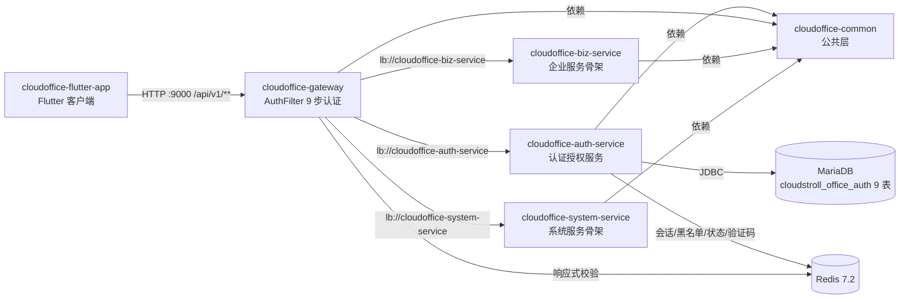

### 2.2 auth-service 内部组件职责

| 组件 | 职责 | 关键类 |
| --- | --- | --- |
| Controller 层 | REST 入口与参数校验 | AuthController、UserController、RoleController、PermissionController、HealthController |
| 编排服务 | 统一编排登录/注册主流程（策略认证→状态校验→Token→会话→日志） | AuthenticationService |
| 策略工厂 | 按 loginMode/registerMode 分发至具体策略；新增方式仅需新增策略实现（ADR-005） | LoginStrategyFactory、RegisterStrategyFactory |
| 登录策略 | 4 种登录：用户名密码/手机验证码/手机+密码/OAuth | UsernamePasswordStrategy、PhoneCodeLoginStrategy、PhonePasswordLoginStrategy、OAuthLoginStrategy |
| 注册策略 | 5 种注册：用户名密码/手机验证码/OAuth/手机设用户名/OAuth 补全信息 | UsernamePwdRegisterStrategy、PhoneCodeRegisterStrategy、OAuthRegisterStrategy、PhoneSetUsernameStrategy、OAuthSetInfoStrategy |
| 登录业务服务 | 登录、登出（幂等）、强制踢人（管理员校验/指定端/所有端） | LoginService（LoginServiceImpl） |
| Token 服务 | JWT RS256 双 Token 签发、解析、刷新轮换、黑名单吊销 | TokenService（TokenServiceImpl）、JwtUtils |
| 会话服务 | Redis 登录态创建/查询/移除/全端移除、Token 黑名单、账号/租户状态缓存 | LoginSessionService（LoginSessionServiceImpl） |
| 验证码服务 | 生成（6 位数字）、发送（模拟/真实通道）、校验（一次性/防暴力）、频率控制、过期清理 | VerificationCodeManager（VerificationCodeManagerImpl）、VerificationCodeService、SimulatedVerificationCodeService |
| 业务服务 | 密码管理、RBAC 用户/角色/权限管理、登录日志审计 | PasswordService、UserService、RoleService、PermissionService、LoginLogService |
| Mapper 层 | 9 张表数据访问（MyBatis-Plus） | User/Tenant/Role/Permission/UserRole/RolePermission/LoginLog/OAuthAccount/VerificationCodeMapper |
| 配置层 | 安全、RSA 密钥、Redis、MyBatis-Plus、密码策略、验证码策略、OAuth 骨架 | SecurityConfig、RsaKeyConfig、RedisConfig、MyBatisPlusConfig、PasswordProperties、VerificationCodeProperties、OAuth2Config |

### 2.3 gateway 内部组件职责

| 组件 | 职责 |
| --- | --- |
| AuthFilter（GlobalFilter） | 全局 9 步认证：白名单→Bearer 格式→RS256 验签→tokenType→黑名单→登录态→账号状态→租户状态→Header 透传；统一 401/403 ApiResult 错误响应 |
| AuthProperties | 白名单路径配置（Ant 匹配） |
| RsaKeyConfig | RSA 公钥加载（环境变量注入） |
| RedisConfig | ReactiveRedisTemplate（响应式非阻塞校验，ADR-002） |

## 3. 类图

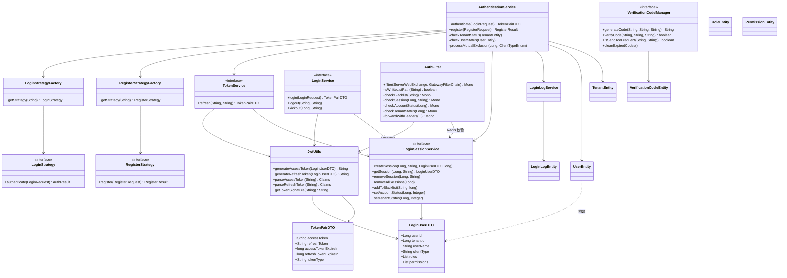

## 4. 核心业务流程时序图

### 4.1 多模式登录流程（F-002）

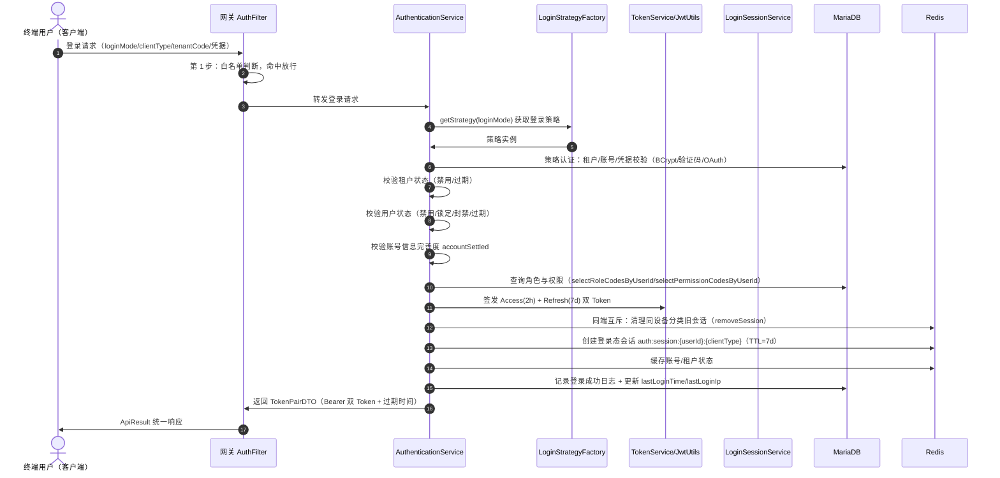

### 4.2 注册流程（含两步注册，F-001）

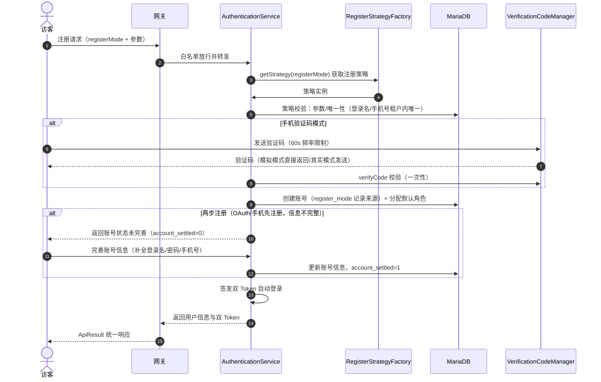

### 4.3 网关认证流程（9 步校验，F-005）

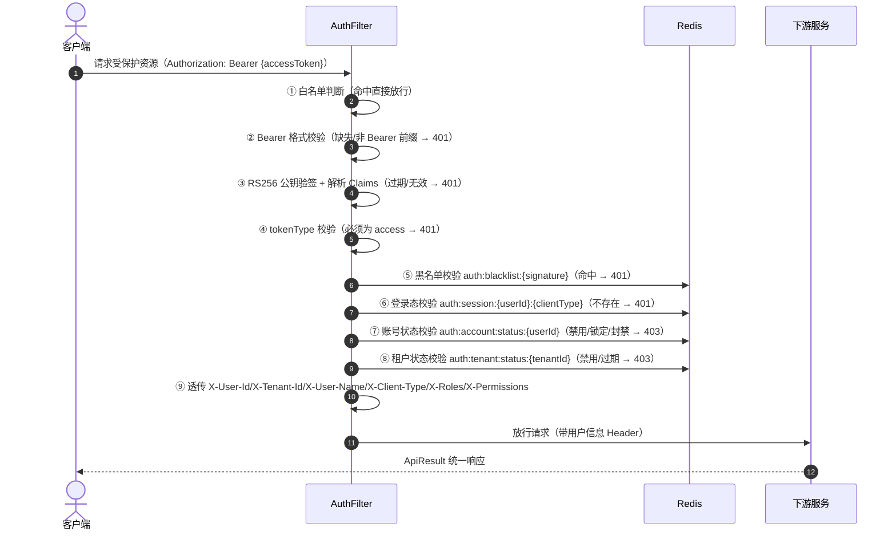

### 4.4 Token 刷新与轮换流程（F-003）

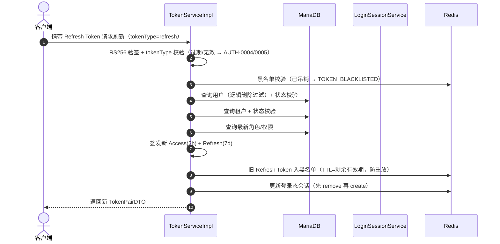

### 4.5 会话安全控制流程（登出/踢人/密码重置，F-004/F-006）

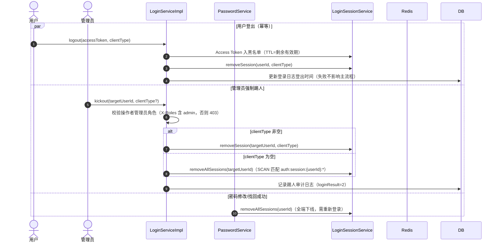

## 5. 状态图

### 5.1 账号状态流转（UserEntity.status）

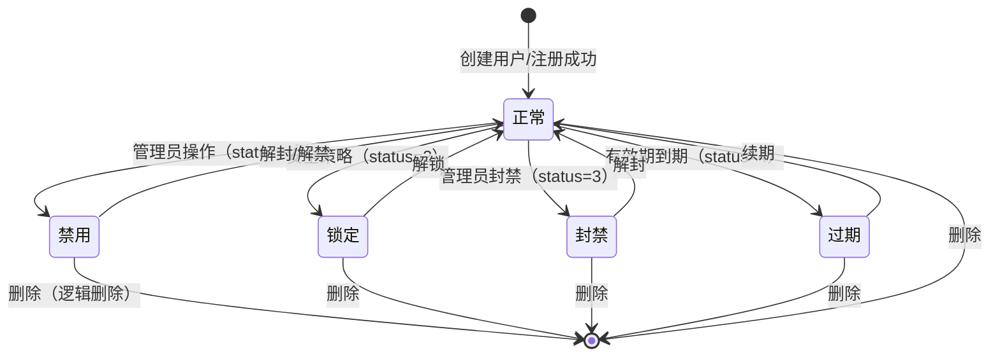

### 5.2 租户状态流转（TenantEntity.status）

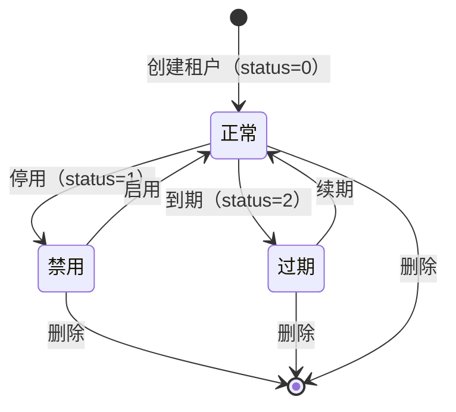

### 5.3 验证码状态流转（VerificationCodeEntity）

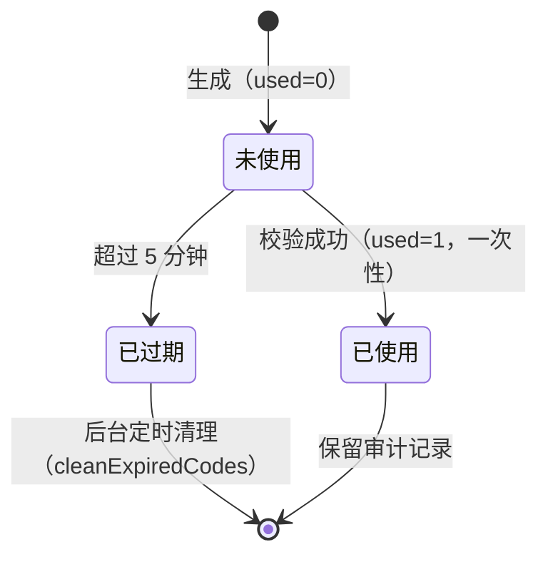

### 5.4 Token 生命周期

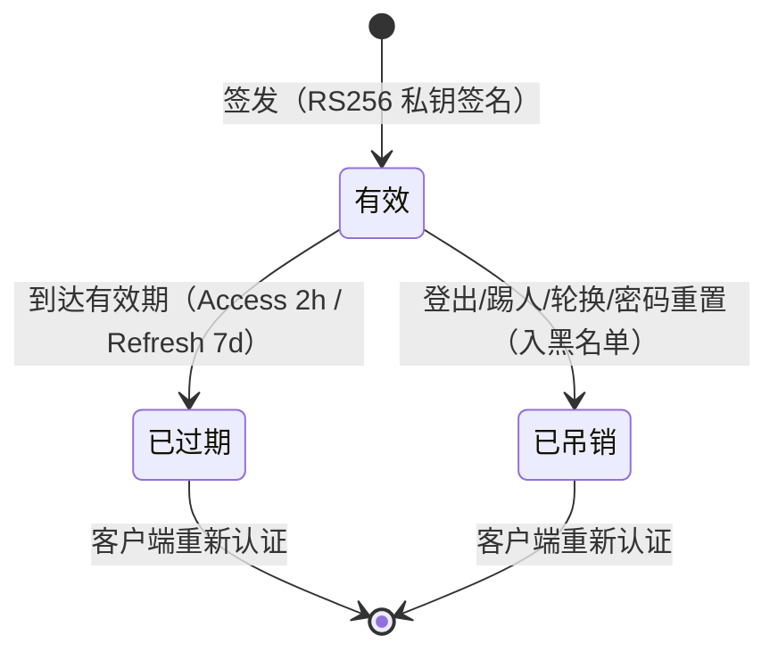

## 6. 核心业务逻辑

### 6.1 登录认证编排（AuthenticationService.authenticate）

```
功能：统一登录认证主流程
输入：LoginRequest（loginMode、clientType、tenantCode、凭据）
输出：TokenPairDTO（双 Token + 过期时间）

流程：
1. strategy = loginStrategyFactory.getStrategy(request.loginMode)   // 策略分发，无效模式抛 LOGIN_MODE_INVALID
2. authResult = strategy.authenticate(request)                       // 策略内认证（用户名密码/手机验证码/手机+密码/OAuth）
3. user = userMapper.selectById(authResult.userId)；tenant = tenantMapper.selectById(authResult.tenantId)
4. checkTenantStatus(tenant)        // 租户 status==1 禁用、expireTime 早于当前 → 拒绝
5. checkUserStatus(user)            // 用户 status：1 禁用/2 锁定/3 封禁/4 过期 → 拒绝
6. if (user.accountSettled == 0) 抛 ACCOUNT_NOT_SETTLED            // 两步注册未完善
7. roles = authResult.roles ?? selectRoleCodesByUserId；permissions = authResult.permissions ?? selectPermissionCodesByUserId
8. loginUser = LoginUserDTO(userId, tenantId, userName, clientType, roles, permissions)
9. accessToken = jwtUtils.generateAccessToken(loginUser)            // claims: sub/tenantId/clientType/tokenType=access/roles/permissions
   refreshToken = jwtUtils.generateRefreshToken(loginUser)          // claims: tokenType=refresh/tokenVersion(雪花,防重放)
10. processMutualExclusion(userId, clientType)                      // 同端互斥：遍历同设备分类客户端类型清理旧会话
11. loginSessionService.createSession(userId, clientType, loginUser, refreshTokenExpiration)  // Redis 会话 TTL=7d
12. setAccountStatus(userId, user.status)；setTenantStatus(tenantId, tenant.status)          // 状态缓存（网关实时校验）
13. loginLogService.recordLoginSuccess(...)                          // 登录成功日志
14. user.lastLoginTime/lastLoginIp 更新
15. return tokenPair
```

### 6.2 Token 刷新轮换（TokenServiceImpl.refresh）

```
功能：Refresh Token 轮换刷新
输入：refreshToken、clientType
输出：新 TokenPairDTO

流程：
1. 参数校验 refreshToken 非空
2. claims = jwtUtils.parseRefreshToken(refreshToken)   // RS256 验签 + tokenType=refresh；过期→REFRESH_TOKEN_EXPIRED，无效→REFRESH_TOKEN_INVALID
3. signature = getTokenSignature(refreshToken)         // SHA-256 指纹
4. if (loginSessionService.isBlacklisted(signature)) 抛 TOKEN_BLACKLISTED   // 防重放
5. 提取 userId/tenantId/clientType；查询用户+租户并校验状态
6. 查询最新角色权限（刷新时重新拉取，保证权限变更生效）
7. 签发新双 Token（Access 2h + Refresh 7d，新 tokenVersion）
8. loginSessionService.addToBlacklist(oldSignature, 剩余有效期)   // 旧 Refresh 立即吊销
9. removeSession + createSession 更新登录态会话
10. return 新 TokenPairDTO
```

### 6.3 网关 9 步认证（AuthFilter.filter）

```
功能：全部非白名单请求的统一认证拦截
输入：ServerWebExchange（请求）
输出：放行（透传 Header）或 401/403 统一错误响应

流程：
1. 白名单 Ant 匹配（登录/注册/刷新/验证码/找回/健康检查/OpenAPI）→ 直接放行
2. Authorization 头缺失或非 "Bearer " 前缀 → 401 TOKEN_INVALID
3. RS256 公钥验签解析 Claims（ExpiredJwtException→TOKEN_EXPIRED；JwtException→TOKEN_INVALID）
4. claims.tokenType != "access" → 401 TOKEN_INVALID
5. Redis 黑名单命中 → 401 TOKEN_BLACKLISTED
6. Redis 登录态不存在 → 401 SESSION_KICKED_OUT
7. 账号状态缓存 1/2/3 → 403 ACCOUNT_DISABLED/LOCKED/BANNED
8. 租户状态缓存 1/2 → 403 TENANT_DISABLED/TENANT_EXPIRED
9. 透传 X-User-Id/X-Tenant-Id/X-User-Name/X-Client-Type/X-Roles/X-Permissions 后放行
```

### 6.4 验证码管理（VerificationCodeManagerImpl）

```
功能：验证码全生命周期管理
配置：长度 6 位（首位不为 0）、有效期 300s、发送间隔 60s、模拟模式 VERIFICATION_CODE_MOCK

生成 generateCode(target, mode, purpose)：
1. code = ThreadLocalRandom(100000, 999999)
2. 写库 t_auth_verification_code（used=0，expireTime=now+300s）
3. 写 Redis 缓存 auth:verification:{purpose}:{target}（TTL=300s）
4. 写频率标记 auth:verification:freq:{purpose}:{target}（TTL=60s）

发送 sendVerificationCode：
1. isSendTooFrequent(target, purpose) 命中频率标记 → SMS_SEND_TOO_FREQUENT（429）
2. 模拟模式 → SimulatedVerificationCodeService 直接返回固定验证码
3. 真实模式 → 短信/邮件通道（生产切换）

校验 verifyCode(target, code, purpose)：
1. 查最新未使用验证码（按 target+purpose）
2. 校验：实体非空 → 未过期 → 未使用 → code 匹配
3. 校验通过 → updateUsedStatus(used=1) 一次性失效

清理 cleanExpiredCodes：deleteExpired(now) 定时清理过期记录
```

### 6.5 登出与强制踢人（LoginServiceImpl）

```
登出 logout(accessToken, clientType)（幂等）：
1. parseAccessToken 解析用户与过期时间
2. Token 签名指纹入黑名单（TTL=剩余有效期）
3. removeSession(userId, clientType)
4. 更新登录日志登出时间
5. 任何异常仅记录警告，不向外抛出（重复登出/Token 已失效不报错）

强制踢人 kickout(targetUserId, clientType)：
1. 从请求头 X-Roles 解析操作者，非 admin 角色 → PERMISSION_DENIED（403）
2. 校验目标用户存在
3. clientType 非空 → removeSession(指定端)；为空 → removeAllSessions(SCAN 匹配 auth:session:{userId}:*)
4. 记录踢人审计日志（loginResult=2，failReason=管理员强制踢人；日志失败不影响主流程）
```

### 6.6 RBAC 权限计算（用户-角色-权限）

```
权限模型：用户 --(t_auth_user_role 多对多)--> 角色 --(t_auth_role_permission 多对多)--> 权限（树形 t_auth_permission）
权限计算：
  roles(userId)       = selectRoleCodesByUserId(userId)      // 角色编码列表
  permissions(userId) = selectPermissionCodesByUserId(userId) // 用户所分配角色权限的并集
落点：
  · 登录/刷新时写入 JWT claims（roles/permissions）
  · 网关校验后透传 X-Roles/X-Permissions 至下游
  · 本版本提供模型与数据管理 API，接口级鉴权注解随业务版本演进
多租户约束：用户名/角色编码按租户唯一；查询均带 tenant 条件限定数据空间
```

## 7. 业务规则与约束

| 类别 | 规则 | 来源/落点 |
| --- | --- | --- |
| 密码策略 | 长度 8-64 字符（PasswordProperties）；BCrypt 加密存储，禁止明文；修改密码时新旧密码不得相同；日志禁止输出密码 | FR-006/NFR-003 |
| 唯一性 | 登录名/手机号在租户内唯一；角色编码在租户内唯一；权限编码全局唯一 | FR-001/FR-009~013 |
| 登录模式 | 4 种：USERNAME_PASSWORD/PHONE_CODE/PHONE_PASSWORD/OAUTH；无效模式抛 LOGIN_MODE_INVALID | FR-002 |
| 注册模式 | 5 种：USERNAME/PHONE_CODE/OAUTH/PHONE_SET_USERNAME/OAUTH_SET_INFO；无效模式抛 REGISTER_MODE_INVALID | FR-001 |
| 客户端类型 | 6 种：Windows/Ubuntu/H5/Android/iOS/WeChatMini；无效类型抛 CLIENT_TYPE_INVALID | FR-002 |
| 会话策略 | 同端互斥（同一设备分类只保留最新会话，旧 Token 会话清除）；多端共存（不同设备分类可同时在线） | FR-002/FR-004 |
| Token 规则 | Access 2h + Refresh 7d；RS256（RSA 2048）；Refresh 轮换后旧 Token 立即入黑名单（TTL=剩余有效期）；黑名单按 Token SHA-256 签名指纹存储 | FR-003/NFR-005 |
| 状态规则 | 用户状态：0 正常/1 禁用/2 锁定/3 封禁/4 过期；租户状态：0 正常/1 禁用/2 过期；封禁/停用实时生效（Redis 缓存 + 网关校验） | FR-010/FR-011 |
| 验证码规则 | 6 位数字、5 分钟有效、60 秒发送间隔、一次性失效、按用途隔离（REGISTER/LOGIN/RESET_PASSWORD/CHANGE_PHONE 等）、错误次数限制防暴力尝试 | FR-008 |
| 防枚举 | 登录失败统一提示（"用户名或密码错误"），不泄露账号是否存在 | FR-002/NFR-005 |
| 两步注册 | account_settled=0 用户登录被拒（ACCOUNT_NOT_SETTLED），须先补全登录名/密码/手机号 | FR-001 |
| 账号安全 | 密码修改/找回成功后清除该用户全部客户端类型登录态；管理员踢人须拥有 admin 角色 | FR-004/FR-006 |
| 多租户 | 登录/注册必带 tenantCode；数据查询与操作限定当前租户空间；初始默认租户 DEFAULT、超级管理员 admin/admin123（部署后立即修改） | FR-010 |
| 架构约束 | 模块间只依赖 common，禁止互相依赖；API 统一 /api/v1/{module}/**；响应统一 ApiResult | FR-018/ADR-001 |
| 脱敏约束 | 日志中手机号/邮箱/Tenant 签名脱敏输出；Token 签名日志显示前 8 位+**** | NFR-004 |

## 8. 业务数据流

### 8.1 登录认证数据流

```
客户端（loginMode/clientType/tenantCode/凭据）
  → 网关 AuthFilter（白名单放行，转发）
  → AuthenticationService（策略认证 → 状态校验 → 构建 LoginUserDTO）
      ├─→ MariaDB：t_auth_tenant（租户状态）/ t_auth_user（账号凭据 BCrypt 比对、状态）/ 角色权限关联（RBAC 并集）
      ├─→ Redis：同端互斥清理 → auth:session:{userId}:{clientType}（LoginUserDTO，TTL=7d）
      ├─→ Redis：auth:account:status:{userId} / auth:tenant:status:{tenantId}（状态缓存）
      ├─→ JwtUtils：RSA 私钥签名签发双 Token（RSA_PRIVATE_KEY 环境变量注入）
      ├─→ MariaDB：t_auth_login_log（成功日志）+ t_auth_user（lastLoginTime/lastLoginIp）
      └─→ 返回 TokenPairDTO → 网关 → 客户端（flutter_secure_storage 安全存储）
```

### 8.2 业务访问数据流（已登录）

```
客户端（Authorization: Bearer {accessToken}）
  → 网关 AuthFilter：①~④ 本地校验（白名单/格式/RS256 验签/tokenType）
  → Redis：⑤ 黑名单 → ⑥ 登录态 → ⑦ 账号状态 → ⑧ 租户状态（ReactiveRedisTemplate 响应式）
  → 网关：⑨ 写入 X-User-Id/X-Tenant-Id/X-User-Name/X-Client-Type/X-Roles/X-Permissions
  → 下游服务（auth/biz/system）：从请求头读取用户上下文，返回 ApiResult
  → 客户端：ApiInterceptor 收到 401 时携带 Refresh Token 调 /api/v1/auth/refresh 重试原请求
```

### 8.3 验证码数据流

```
发送请求（target/purpose）
  → VerificationCodeManager：频率标记校验（Redis）→ 生成 6 位码
  → MariaDB：t_auth_verification_code（used=0，expireTime=now+300s）
  → Redis：auth:verification:{purpose}:{target}（TTL=300s）+ auth:verification:freq:{purpose}:{target}（TTL=60s）
  → 发送通道：SimulatedVerificationCodeService（开发模拟）/ 短信·邮件（生产）
校验请求（target/code/purpose）
  → 查最新未使用记录 → 校验过期/已用/内容 → 置 used=1（一次性）→ 返回校验结果
```

## 9. 数据结构定义

### 9.1 跨服务传输对象（common）

| 结构 | 关键字段 | 用途 |
| --- | --- | --- |
| LoginUserDTO | userId、tenantId、userName、clientType、roles（List\<String\>）、permissions（List\<String\>） | 登录用户上下文；Redis 会话存储载体；网关 Header 透传来源 |
| TokenPairDTO | accessToken、refreshToken、accessTokenExpireIn、refreshTokenExpireIn、tokenType="Bearer" | 登录/注册/刷新统一返回的双 Token 载体 |
| ApiResult\<T\> | code、message、data、timestamp | 全接口统一响应体 |
| PageResult\<T\> | records、total、page、size | 分页统一结构 |

### 9.2 认证策略结果（auth-service 内部）

| 结构 | 关键字段 | 用途 |
| --- | --- | --- |
| AuthResult | userId、tenantId、roles、permissions | 登录策略认证结果，供编排服务构建 LoginUserDTO |
| RegisterResult | 用户信息 + TokenPairDTO | 注册策略结果，供编排服务返回 |

### 9.3 JWT Claims 载荷

| Claim | Access Token | Refresh Token |
| --- | --- | --- |
| sub | userId | userId |
| tenantId | √ | √ |
| clientType | √ | √ |
| tokenType | "access" | "refresh" |
| roles / permissions | √ | - |
| tokenVersion | - | 雪花算法唯一值（防重放） |
| iat / exp | 签发/2h | 签发/7d |

### 9.4 Redis Key 规范（RedisKeyConstants 统一管理）

| Key | 格式 | TTL | 用途 |
| --- | --- | --- | --- |
| 登录态会话 | auth:session:{userId}:{clientType} | 7d（刷新续期） | 网关登录态校验 |
| Token 黑名单 | auth:blacklist:{signature} | Token 剩余有效期 | 登出/踢人/轮换吊销 |
| 账号状态缓存 | auth:account:status:{userId} | 无（随状态变更更新） | 网关实时账号状态校验 |
| 租户状态缓存 | auth:tenant:status:{tenantId} | 无（随状态变更更新） | 网关实时租户状态校验 |
| 验证码缓存 | auth:verification:{purpose}:{target} | 300s | 验证码临时存储 |
| 验证码频率标记 | auth:verification:freq:{purpose}:{target} | 60s | 发送频率控制 |

## 10. 异常处理策略

### 10.1 异常体系（common）

```
BaseException（抽象基类）
├── BusinessException    // 业务异常（状态异常、租户异常、唯一性冲突等）
└── AuthException        // 认证异常（Token 无效/过期/黑名单、登录失败等）
错误码：ErrorCode 枚举共 29 个
  · HTTP 类：200/400/401/403/404/405/409/429/500/503
  · AUTH-0001~0019：Token/账号状态/登录/验证码/租户/权限类（19 个）
  · AUTH-0020~0033：密码重置/OAuth/手机号/账号未完善/模式无效类（14 个）
兜底：GlobalExceptionHandler（@RestControllerAdvice）统一捕获 10+ 类异常：
  参数校验（MethodArgumentNotValidException/BindException）、类型转换、非法参数、
  业务异常、认证异常、兜底 Exception → 统一 ApiResult 响应，不泄露堆栈（NFR-007）
```

### 10.2 异常分类与处理

| 异常类别 | 典型场景 | 错误码/HTTP | 处理方式 |
| --- | --- | --- | --- |
| 认证异常 | Token 缺失/无效/过期/黑名单、登录失败 | AUTH-0001~0010（401） | AuthException 抛出，网关/服务统一 401 |
| 状态异常 | 账号禁用/锁定/封禁/过期、租户禁用/过期 | AUTH-0006~0009、0014~0015（403） | BusinessException 抛出，403 |
| 验证码异常 | 验证码错误/过期、发送频繁 | AUTH-0011/0019/0023~0025 | BusinessException 抛出，400/429 |
| 账号安全异常 | 原密码错误、手机号已绑定、账号未完善 | AUTH-0022/0028~0031 | BusinessException 抛出，400/403/409 |
| 参数异常 | 参数缺失/格式错误/长度不符 | BAD_REQUEST（400） | 框架参数校验 + 全局处理器 |
| 权限异常 | 非管理员踢人、越权操作 | PERMISSION_DENIED（403） | 业务校验抛出 |
| 未预期异常 | 运行时异常、中间件故障 | INTERNAL_ERROR（500） | 全局兜底，日志记录，响应不泄露细节 |

### 10.3 容错降级（关键路径）

- Redis 会话/状态写入失败：记录 error 日志，不影响登录主流程返回（会话后续由刷新/网关兜底）
- 同端互斥处理失败：记录 error 日志，不阻断登录
- 登出异常：幂等处理，仅警告不抛出
- 踢人审计日志失败：不影响踢人主流程
- 验证码 Redis 频率检查异常：放行（避免阻塞正常发送）

## 11. 日志规范

| 业务路径 | 日志级别 | 日志内容要求 |
| --- | --- | --- |
| 登录 | info / warn | 成功：userId/tenantId/clientType/ip；失败：登录名、失败原因（密码错误等），禁止记录密码 |
| 注册 | info / warn | 成功：userId/tenantId/registerMode；失败：唯一性冲突原因 |
| Token 签发/刷新 | info / debug | 成功：userId/clientType；黑名单命中：签名脱敏（前 8 位+****） |
| 会话管理 | info / debug | 创建/移除：userId/clientType/TTL；全端移除：userId/删除数量 |
| 强制踢人 | info / warn | 操作者/目标用户/客户端类型/拒绝原因（非管理员） |
| 验证码 | info / warn | 目标脱敏（138****0000、a***@example.com）、purpose、过期时间；禁止输出验证码明文 |
| 密码管理 | warn | 修改/找回事件，禁止输出新旧密码 |
| 网关认证 | debug / warn / error | 校验通过/失败路径、userId、错误类别；响应体不泄露堆栈 |
| 全局兜底 | error | 异常堆栈记录到日志（服务端可见），响应仅返回统一错误码 |

**红线**：日志禁止输出密码、Token 原文、RSA 私钥等敏感信息（NFR-004）；手机号/邮箱/Token 签名输出前一律脱敏。

## 12. 性能优化点

| 风险点 | 现状/手段 | 优化方向 |
| --- | --- | --- |
| 网关认证热路径 | 9 步校验中 5 步为 Redis 读取，使用 ReactiveRedisTemplate 响应式非阻塞，不阻塞事件循环（ADR-002）；单请求额外耗时 ≤20ms（NFR-001） | 可引入本地缓存（Caffeine）缓存账号/租户状态，进一步降低 Redis 往返 |
| 会话/状态高频读写 | Redis 承载全部热路径数据（会话/黑名单/状态/验证码），单次读写 ≤10ms（NFR-002） | 黑名单可采用 TTL 精准过期，避免长 TTL 垃圾 Key |
| 登录/注册同步事务 | 登录流程为同步事务处理，登录/刷新 P95 ≤500ms（NFR-001） | 后续版本登录日志写入可异步化（MQ），降低事务时长 |
| RBAC 权限查询 | 登录/刷新时实时查询角色权限并写入 JWT | 权限变更低频场景可引入缓存，减少 DB 查询 |
| 全端下线 SCAN | removeAllSessions 使用 Redis SCAN 匹配删除，避免 KEYS 阻塞 | 可维护用户会话索引集合（SET），O(1) 定位会话 |
| 登录日志增长 | t_auth_login_log 随使用持续增长 | 后续版本规划日志归档与分区策略 |
| 数据库连接池 | auth-service HikariCP（max 20/min 5）、Redis 连接池（auth 16/gateway 8） | 按流量动态调优连接池参数 |
| 验证码清理 | cleanExpiredCodes 定时清理过期记录 | 可结合 Redis TTL 自动过期，DB 清理降频 |

## 13. 单元测试策略

### 13.1 测试范围与工具

- 框架：JUnit 5 + Mockito（NFR-010）；认证服务全量测试 200+ 用例
- 被测对象：auth-service 核心逻辑（策略、编排、Token、会话、验证码、密码、RBAC 管理、日志）与 common（异常/响应）

### 13.2 用例划分

| 被测模块 | 用例方向 | 覆盖目标 |
| --- | --- | --- |
| 登录策略（4 种） | 成功/失败：凭据正确、密码错误、验证码错误/过期、OAuth 未绑定、无效模式 | 每种策略成功与全部失败分支 |
| 注册策略（5 种） | 成功/失败：唯一性冲突、参数非法、两步注册补全、默认角色分配 | 每种策略成功与全部失败分支 |
| AuthenticationService | 状态校验矩阵：用户 5 状态 × 租户 3 状态 × 未完善账号；同端互斥、多端共存；Redis 失败容错 | 状态机全分支、互斥/共存策略、容错路径 |
| TokenService | 刷新成功、Token 过期/无效/黑名单、轮换后旧 Token 防重放、状态变更拦截刷新 | 轮换机制与安全边界 |
| JwtUtils | 双 Token 签发解析、tokenType 校验、过期校验、签名指纹一致性 | 载荷字段与异常分支 |
| LoginSessionService | 会话创建/查询/移除/全端移除、黑名单增查、状态缓存读写 | Redis 各操作与类型转换兜底 |
| VerificationCodeManager | 生成、频率限制、有效期、一次性失效、用途隔离、过期清理 | 验证码全生命周期 |
| LoginService（登出/踢人） | 登出幂等、黑名单写入、踢人权限校验（admin/非 admin）、指定端/所有端 | 会话安全控制主流程 |
| PasswordService | 旧密码校验、新密码策略、全端下线触发 | 密码管理规则 |
| RBAC 服务 | 用户/角色/权限 CRUD、唯一性、关联分配、删除关联处理 | 管理操作与数据一致性 |
| common | ApiResult/PageResult 序列化、异常体系映射、错误码完整性 | 统一契约与 29 错误码 |

### 13.3 边界与异常用例

- 空值/超长/非法枚举（loginMode/registerMode/clientType）→ 对应错误码
- 密码边界：7 位/8 位/64 位/65 位
- 验证码边界：59s/60s/61s 频率、299s/300s/301s 有效期、重复使用
- Token 边界：即将过期、已过期、错误签名、错误 tokenType、黑名单命中
- 用户/租户状态全矩阵：0/1/2/3/4 × 0/1/2
- Redis 不可用降级：会话写入失败、频率检查异常放行

### 13.4 覆盖目标

- 核心认证链路（登录/注册/刷新/登出/踢人）分支覆盖率 ≥ 90%
- 策略工厂与 9 种策略实现全覆盖（成功 + 失败分支）
- 验证码生命周期与 Token 轮换安全边界全覆盖
- 状态机（用户/租户/验证码/Token）全部状态迁移有对应用例
- 回归测试与版本测试用例文档联动，全部通过方可交付（验收标准 10）

<!-- SPDX-License-Identifier: Apache-2.0 / Copyright 2026 jenemy8023 <jenemy8023@163.com> -->
