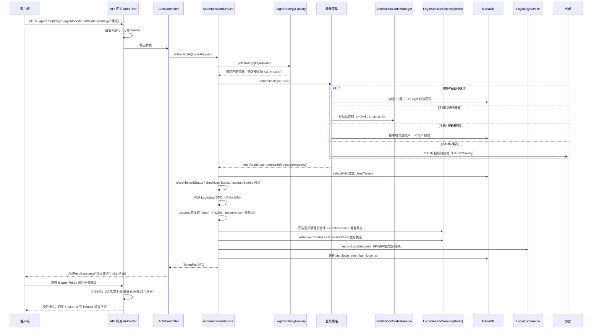
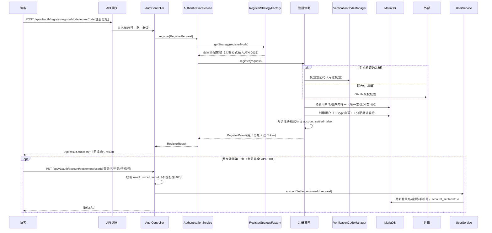
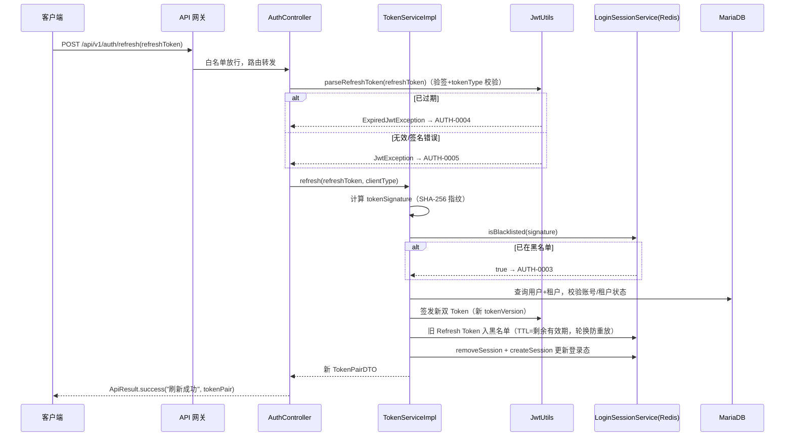
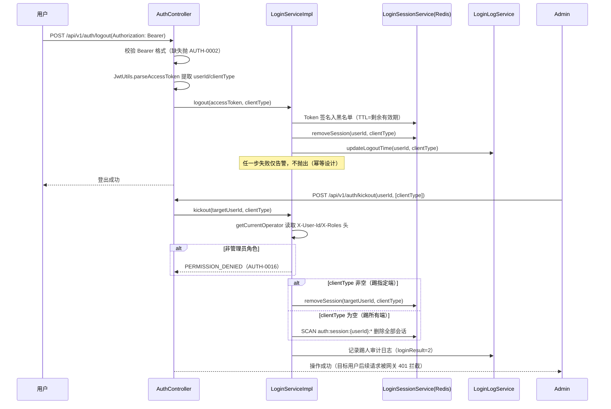
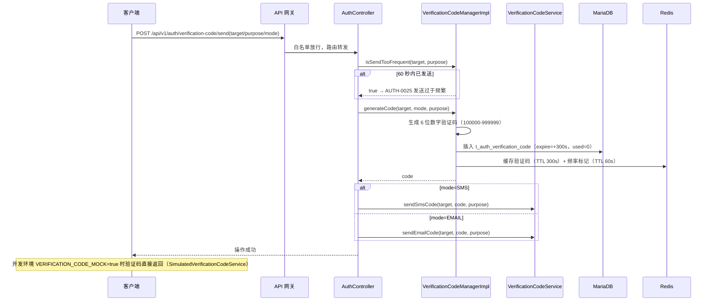
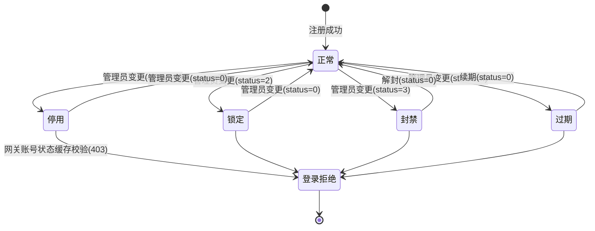
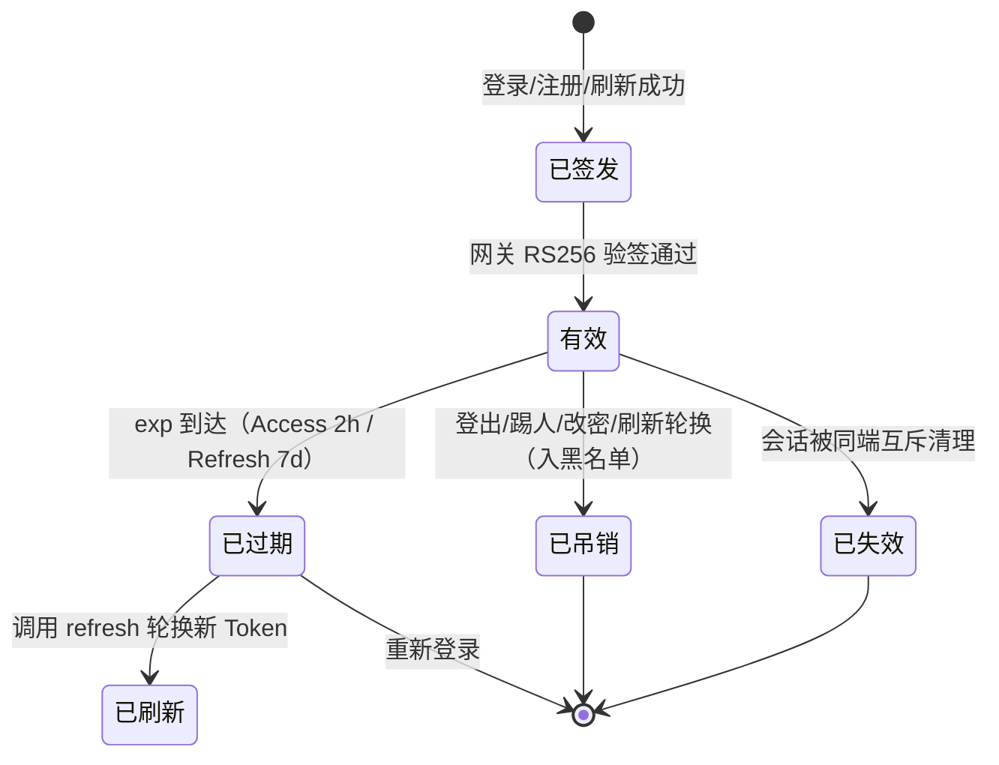
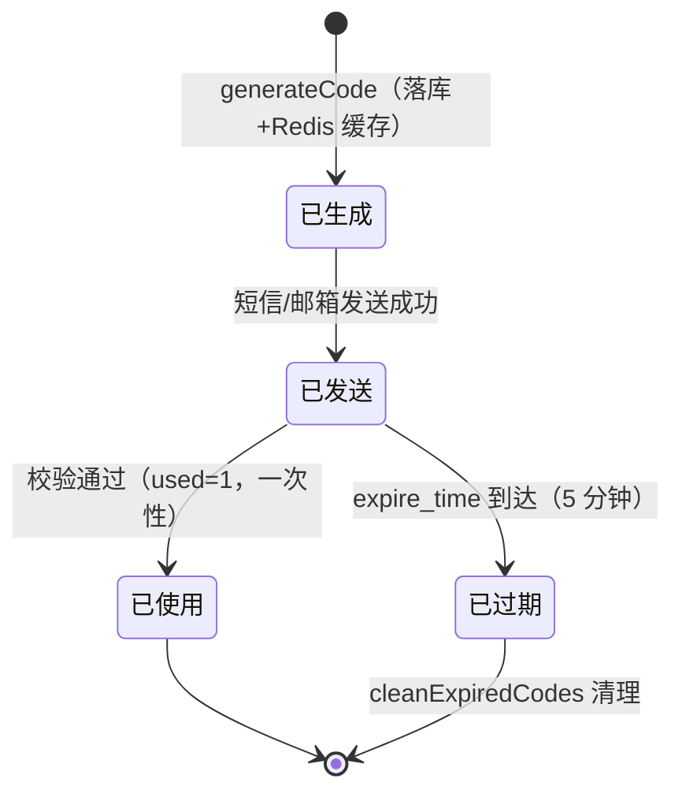

# 详细设计文档（LLD）
**项目名称**：云漫智企（CloudStrollOffice，英文缩写 cso）
**版本号**：v0.0.1（初始化归档版本，对应实际业务版本 v0.1.6）
**日期**：2026-08-05
**编写人**：TL

> 本文档为存量项目初始化归档（v0.0.1）的详细设计，完整反推业务版本 v0.1.6 已实现代码的模块划分、类结构、核心流程、接口实现细节、异常处理与测试策略，作为后续版本迭代的设计基线。本文档与 SAD/API/DBD 文档一一呼应，所有类与方法均以 `cloudoffice-auth-service`、`cloudoffice-common`、`cloudoffice-gateway`、`cloudoffice-flutter-app` 实际源码为准，不虚构设计。

## 1. 模块概述

本版本按服务与职责拆分为 5 个模块（含 2 个骨架服务），模块间通过网关统一认证 + 服务发现通信，认证与业务完全解耦。

### 1.1 API 网关认证模块（cloudoffice-gateway，端口 9000）

- **职责**：唯一对外入口，负责路由转发、CORS、Nacos 服务发现与全局统一认证拦截。
- **核心类**：`GatewayApplication`（启动类）、`AuthFilter`（全局认证过滤器，9 步校验）、`AuthProperties`（白名单与认证属性配置）、`RsaKeyConfig`（RS256 验签公钥）、`RedisConfig`（响应式 Redis 客户端）。
- **关键设计**：`AuthFilter` 实现 `GlobalFilter + Ordered`（`HIGHEST_PRECEDENCE + 10`），基于 WebFlux 响应式链路完成 白名单放行 → Bearer 格式校验 → RS256 公钥验签 → tokenType=access 校验 → Redis 黑名单 → 登录态 → 账号状态（403）→ 租户状态（403）→ 用户信息 Header 透传（X-User-Id / X-Tenant-Id / X-User-Name / X-Client-Type / X-Roles / X-Permissions）9 步校验；校验失败输出统一 `ApiResult` JSON 响应（401/403/500）。

### 1.2 认证服务业务模块（cloudoffice-auth-service，端口 9100）

- **职责**：统一承载认证全部业务能力：多模式登录/注册（策略工厂）、JWT RS256 双 Token、Redis 会话管理、密码管理（修改/找回/重置）、手机号变更、验证码管理、RBAC 多租户权限（用户/角色/权限 CRUD）、登录日志审计、健康检查。
- **核心类**：
  - 接口层：`AuthController`（11 个认证端点）、`UserController`（用户管理）、`RoleController`（角色管理）、`PermissionController`（权限管理）、`HealthController`（健康检查）。
  - 编排层：`AuthenticationService`（统一登录/注册编排）、`LoginService`（登录/登出/踢人）、`TokenService`（Token 刷新轮换）、`LoginSessionService`（Redis 会话/黑名单/状态缓存）、`PasswordService`（密码/手机号管理）、`LoginLogService`（登录日志审计）、`UserService`/`RoleService`/`PermissionService`（RBAC 管理）、`VerificationCodeManager`（验证码生成/校验/频率）、`VerificationCodeService`（验证码发送，支持模拟模式）。
  - 策略层：`LoginStrategy` 接口 + 4 策略实现、`RegisterStrategy` 接口 + 5 策略实现，及对应工厂 `LoginStrategyFactory`/`RegisterStrategyFactory`。
  - 基础设施：`JwtUtils`（RS256 双 Token 签发/解析/签名指纹）、`SecurityConfig`（BCrypt + 无状态会话 + 401/403 JSON）、`RsaKeyConfig`、`RedisConfig`、`MyBatisPlusConfig`、`OAuth2Config`、`PasswordProperties`、`VerificationCodeProperties`。
  - 数据访问：9 个 Entity（User/Tenant/Role/Permission/UserRole/RolePermission/LoginLog/OAuthAccount/VerificationCode）+ 9 个 Mapper。
- **关键设计**：登录/注册采用"策略接口 + 工厂注册表（ConcurrentHashMap）+ @PostConstruct 初始化注册"模式，新增模式仅需新增策略实现类并在工厂注册，不修改主流程代码。

### 1.3 公共支撑模块（cloudoffice-common，JAR）

- **职责**：被 gateway 与 auth-service 共同依赖，提供统一响应体、异常体系、错误码、Redis Key 常量、公共 DTO/枚举/工具类与公共配置。
- **核心类**：`ApiResult<T>`（统一响应体）、`PageResult<T>`（分页响应）、`BaseEntity`（公共字段基类）、`ErrorCode` 枚举（实现 `model.ErrorCode` 接口，基础 HTTP 码 10 个 + 认证业务码 AUTH-0001 ~ AUTH-0033）、`BaseException`/`BusinessException`/`AuthException`（异常体系）、`GlobalExceptionHandler`（全局异常处理器）、`RedisKeyConstants`（Redis Key 构建）、`LoginUserDTO`/`TokenPairDTO`、`ClientTypeEnum`/`LoginModeEnum`/`RegisterModeEnum`/`OAuthProviderEnum`、`JsonUtils`、`MyBatisPlusConfig`/`SpringDocConfig`。

### 1.4 Flutter 客户端认证模块（cloudoffice-flutter-app，Dart 3）

- **职责**：跨端（Android/iOS/H5/桌面）认证能力：登录/注册/找回密码页面、Token 注入与刷新拦截器、安全存储、输入校验。
- **核心文件**：`lib/features/auth/screens/`（login_screen.dart / register_screen.dart / forgot_password_screen.dart）、`lib/features/auth/providers/`（auth_provider.dart / forgot_password_provider.dart）、`lib/features/auth/repositories/auth_repository.dart`、`lib/features/auth/models/`（login_request / register_request / token_pair / register_result / user_info / send_verification_code_request / password_forgot_request）、`lib/core/http/`（api_client.dart / api_interceptor.dart / api_result.dart）、`lib/core/storage/secure_storage.dart`、`lib/core/utils/validators.dart`、`lib/shared/widgets/`（password_field / verification_code_field / loading_button / password_strength_indicator / custom_text_field）、`lib/shared/constants/app_constants.dart`。
- **关键设计**：`ApiInterceptor` 自动注入 `Authorization: Bearer` 头，收到 401 自动调用刷新接口轮换 Token 并重试原请求，刷新失败跳转登录页；Token 存于 `SecureStorage`，禁止明文落盘。

### 1.5 骨架服务模块（cloudoffice-biz-service 端口 9200 / cloudoffice-system-service 端口 9400）

- **职责**：企业服务（企业信息/人事管理）与系统服务（系统配置/日志/监控/定时任务）骨架预留，仅提供 `GET /api/v1/{module}/health` 健康检查，业务能力后续版本填充。

## 2. 类图

```mermaid
classDiagram
    direction LR

    %% ========== 接口层 ==========
    class AuthController {
        +login(LoginRequest) ApiResult~TokenPairDTO~
        +register(RegisterRequest) ApiResult~RegisterResult~
        +refresh(RefreshTokenRequest) ApiResult~TokenPairDTO~
        +logout(HttpServletRequest) ApiResult~Void~
        +kickout(KickoutRequest) ApiResult~Void~
        +changePassword(PasswordChangeRequest) ApiResult~Void~
        +forgotPasswordSendCode(SendVerificationCodeRequest) ApiResult~Void~
        +forgotPasswordReset(PasswordForgotRequest) ApiResult~Void~
        +changePhone(PhoneChangeRequest) ApiResult~Void~
        +accountSettlement(AccountSettlementRequest) ApiResult~Void~
        +sendVerificationCode(SendVerificationCodeRequest) ApiResult~Void~
    }
    class UserController
    class RoleController
    class PermissionController
    class HealthController

    %% ========== 编排/服务层 ==========
    class AuthenticationService {
        +authenticate(LoginRequest) TokenPairDTO
        +register(RegisterRequest) RegisterResult
    }
    class LoginService {
        <<interface>>
        +login(LoginRequest) TokenPairDTO
        +logout(String, String) void
        +kickout(Long, String) void
    }
    class LoginServiceImpl
    class TokenService {
        <<interface>>
        +refresh(String, String) TokenPairDTO
    }
    class TokenServiceImpl
    class LoginSessionService {
        <<interface>>
        +createSession() +getSession() +removeSession()
        +removeAllSessions() +addToBlacklist() +isBlacklisted()
        +setAccountStatus() +getAccountStatus() +removeAccountStatus()
        +setTenantStatus() +getTenantStatus() +removeTenantStatus()
    }
    class LoginSessionServiceImpl
    class PasswordService {
        +changePassword(Long, String, String) void
        +forgotPasswordSendCode(String, String) void
        +forgotPasswordReset(String, String, String, String) void
        +changePhone(Long, PhoneChangeRequest) void
    }
    class LoginLogService
    class LoginLogServiceImpl
    class UserService
    class UserServiceImpl
    class RoleService
    class RoleServiceImpl
    class PermissionService
    class PermissionServiceImpl
    class VerificationCodeManager {
        <<interface>>
        +generateCode() +verifyCode() +isSendTooFrequent() +cleanExpiredCodes()
    }
    class VerificationCodeManagerImpl
    class VerificationCodeService {
        <<interface>>
        +sendSmsCode() +sendEmailCode()
    }
    class SimulatedVerificationCodeService

    %% ========== 策略层 ==========
    class LoginStrategy {
        <<interface>>
        +authenticate(LoginRequest) AuthResult
    }
    class UsernamePasswordStrategy
    class PhoneCodeLoginStrategy
    class PhonePasswordLoginStrategy
    class OAuthLoginStrategy
    class LoginStrategyFactory {
        -strategyMap: Map~String, LoginStrategy~
        +init() void
        +getStrategy(String) LoginStrategy
    }
    class RegisterStrategy {
        <<interface>>
        +register(RegisterRequest) RegisterResult
    }
    class UsernamePwdRegisterStrategy
    class PhoneCodeRegisterStrategy
    class OAuthRegisterStrategy
    class PhoneSetUsernameStrategy
    class OAuthSetInfoStrategy
    class RegisterStrategyFactory {
        -strategyMap: Map~String, RegisterStrategy~
        +init() void
        +getStrategy(String) RegisterStrategy
    }

    %% ========== 基础设施 ==========
    class JwtUtils {
        +generateAccessToken(LoginUserDTO) String
        +generateRefreshToken(LoginUserDTO) String
        +parseAccessToken(String) Claims
        +parseRefreshToken(String) Claims
        +getTokenSignature(String) String
        +getAccessTokenExpiration() long
    }
    class SecurityConfig
    class RsaKeyConfig
    class RedisConfig
    class MyBatisPlusConfig

    %% ========== 网关 ==========
    class AuthFilter {
        +getOrder() int
        +filter(ServerWebExchange, GatewayFilterChain) Mono~Void~
    }
    class AuthProperties
    class GatewayApplication

    %% ========== 数据访问层 ==========
    class UserEntity
    class TenantEntity
    class RoleEntity
    class PermissionEntity
    class UserRoleEntity
    class RolePermissionEntity
    class LoginLogEntity
    class OAuthAccountEntity
    class VerificationCodeEntity
    class UserMapper
    class TenantMapper
    class RoleMapper
    class PermissionMapper
    class UserRoleMapper
    class RolePermissionMapper
    class LoginLogMapper
    class OAuthAccountMapper
    class VerificationCodeMapper

    %% ========== common 支撑 ==========
    class ApiResult~T~ {
        +code: Integer
        +message: String
        +data: T
        +timestamp: Long
        +success() +success(String, T) +error(Integer, String) +error(ErrorCode)
    }
    class PageResult~T~
    class BaseEntity {
        +id: Long
        +createdAt: LocalDateTime
        +updatedAt: LocalDateTime
        +deleted: Integer
    }
    class BaseException {
        <<abstract>>
        +code: Integer
        +message: String
    }
    class BusinessException
    class AuthException
    class ErrorCode {
        <<enum>>
        +getCode() Integer
        +getBizCode() String
        +getMessage() String
    }
    class LoginUserDTO {
        +userId: Long
        +tenantId: Long
        +userName: String
        +clientType: String
        +roles: List~String~
        +permissions: List~String~
    }
    class TokenPairDTO {
        +accessToken: String
        +refreshToken: String
        +accessTokenExpireIn: Long
        +refreshTokenExpireIn: Long
        +tokenType: String
    }
    class RedisKeyConstants
    class ClientTypeEnum
    class LoginModeEnum
    class RegisterModeEnum
    class OAuthProviderEnum

    %% ========== 关系 ==========
    AuthController --> AuthenticationService
    AuthController --> LoginService
    AuthController --> TokenService
    AuthController --> PasswordService
    AuthController --> UserService
    AuthController --> JwtUtils
    AuthController --> VerificationCodeManager
    AuthController --> VerificationCodeService
    UserController --> UserService
    RoleController --> RoleService
    PermissionController --> PermissionService

    AuthenticationService --> LoginStrategyFactory
    AuthenticationService --> RegisterStrategyFactory
    AuthenticationService --> LoginSessionService
    AuthenticationService --> LoginLogService
    AuthenticationService --> JwtUtils
    AuthenticationService --> UserMapper
    AuthenticationService --> TenantMapper

    LoginStrategyFactory --> LoginStrategy
    LoginStrategy <|.. UsernamePasswordStrategy
    LoginStrategy <|.. PhoneCodeLoginStrategy
    LoginStrategy <|.. PhonePasswordLoginStrategy
    LoginStrategy <|.. OAuthLoginStrategy
    RegisterStrategyFactory --> RegisterStrategy
    RegisterStrategy <|.. UsernamePwdRegisterStrategy
    RegisterStrategy <|.. PhoneCodeRegisterStrategy
    RegisterStrategy <|.. OAuthRegisterStrategy
    RegisterStrategy <|.. PhoneSetUsernameStrategy
    RegisterStrategy <|.. OAuthSetInfoStrategy

    LoginService <|.. LoginServiceImpl
    TokenService <|.. TokenServiceImpl
    LoginSessionService <|.. LoginSessionServiceImpl
    LoginLogService <|.. LoginLogServiceImpl
    UserService <|.. UserServiceImpl
    RoleService <|.. RoleServiceImpl
    PermissionService <|.. PermissionServiceImpl
    VerificationCodeManager <|.. VerificationCodeManagerImpl
    VerificationCodeService <|.. SimulatedVerificationCodeService

    LoginServiceImpl --> UserMapper
    LoginServiceImpl --> TenantMapper
    LoginServiceImpl --> LoginSessionService
    LoginServiceImpl --> LoginLogService
    LoginServiceImpl --> JwtUtils
    LoginServiceImpl --> PasswordEncoder
    TokenServiceImpl --> JwtUtils
    TokenServiceImpl --> LoginSessionService
    TokenServiceImpl --> UserMapper
    TokenServiceImpl --> TenantMapper
    PasswordService --> UserMapper
    PasswordService --> PasswordEncoder
    PasswordService --> LoginSessionService
    PasswordService --> VerificationCodeManager
    PasswordService --> VerificationCodeService
    VerificationCodeManagerImpl --> VerificationCodeMapper
    VerificationCodeManagerImpl --> RedisTemplate

    UserServiceImpl --> UserMapper
    UserServiceImpl --> UserRoleMapper
    RoleServiceImpl --> RoleMapper
    RoleServiceImpl --> RolePermissionMapper
    PermissionServiceImpl --> PermissionMapper

    JwtUtils --> RsaKeyConfig
    LoginSessionServiceImpl --> RedisTemplate
    AuthFilter --> AuthProperties
    AuthFilter --> RsaKeyConfig
    AuthFilter --> ReactiveRedisTemplate
    AuthFilter --> RedisKeyConstants
    AuthFilter --> ErrorCode
    AuthFilter --> ApiResult

    UserEntity --> BaseEntity
    TenantEntity --> BaseEntity
    RoleEntity --> BaseEntity
    PermissionEntity --> BaseEntity
    UserRoleEntity --> BaseEntity
    RolePermissionEntity --> BaseEntity
    LoginLogEntity --> BaseEntity
    OAuthAccountEntity --> BaseEntity
    VerificationCodeEntity --> BaseEntity

    UserMapper --> UserEntity
    TenantMapper --> TenantEntity
    RoleMapper --> RoleEntity
    PermissionMapper --> PermissionEntity
    UserRoleMapper --> UserRoleEntity
    RolePermissionMapper --> RolePermissionEntity
    LoginLogMapper --> LoginLogEntity
    OAuthAccountMapper --> OAuthAccountEntity
    VerificationCodeMapper --> VerificationCodeEntity

    BusinessException --|> BaseException
    AuthException --|> BaseException
    ErrorCode ..|> org.cloudstrolling.cloudoffice.common.model.ErrorCode
```



**类图说明**：
- **控制器**：`AuthController` 为认证核心入口，注入 8 个服务/工具依赖（构造器注入）；`UserController`/`RoleController`/`PermissionController` 为 RBAC 管理入口；`HealthController` 提供健康检查。
- **编排与服务**：`AuthenticationService` 是登录/注册编排核心（策略路由 + 状态校验 + 会话 + 日志 + 签发）；`LoginService` 接口与 `LoginServiceImpl` 实现登录/登出/踢人（管理员权限校验）；`TokenService` 实现刷新轮换；`LoginSessionService` 封装 Redis 会话/黑名单/账号/租户状态四类 Key 操作；`PasswordService` 为具体类（非接口）承载改密/找回/重置/换绑；`VerificationCodeManager` 管理验证码生命周期，`VerificationCodeService` 负责发送（`SimulatedVerificationCodeService` 实现模拟模式）。
- **策略层**：登录 4 策略 + 注册 5 策略全部实现统一接口，工厂在 `@PostConstruct` 时注册到 `ConcurrentHashMap`，`getStrategy` 按模式编码路由，无效模式抛 `LOGIN_MODE_INVALID`/`REGISTER_MODE_INVALID`。
- **基础设施**：`JwtUtils` 基于 JJWT 0.12.6 实现 RS256 双 Token；`AuthFilter` 在网关侧完成 9 步校验与 Header 透传。
- **数据访问**：9 Entity 均继承 `BaseEntity`（id/createdAt/updatedAt/deleted 公共字段，deleted 为 MyBatis-Plus 逻辑删除），9 Mapper 与之一一对应。

## 3. 时序图

### 3.1 登录流程（多模式登录，API-001）



### 3.2 注册流程（多模式注册，API-002）



### 3.3 Token 刷新流程（API-003）



### 3.4 登出 / 强制踢人流程（API-004 / API-005）



### 3.5 验证码发送流程（API-011 / API-007）



## 4. 状态图

### 4.1 账号状态（t_auth_user.status）



> 状态缓存写入 Redis（`auth:account:status:{userId}`），网关每次请求校验；改密/重置/封禁后调用 `removeAllSessions` 实时清除全部登录态。

### 4.2 Token 生命周期（双 Token）



> 黑名单 Key 为 `auth:blacklist:{tokenSignature}`（SHA-256 指纹），TTL 对齐 Token 剩余有效期；Refresh Token 刷新后旧值立即入黑名单防重放。

### 4.3 验证码生命周期（t_auth_verification_code）



## 5. 核心算法

### 5.1 网关 AuthFilter 9 步校验算法

```
输入: ServerWebExchange exchange
1. path = exchange.request.uri.path
2. if path 匹配任意白名单模式(AntPathMatcher):
       return chain.filter(exchange)          # 第 1 步 白名单放行
3. authHeader = request.headers.Authorization
4. if authHeader == null 或 不以 "Bearer " 开头:
       return 401(TOKEN_INVALID)              # 第 2 步 Bearer 格式校验
5. token = authHeader 去除 "Bearer " 前缀
6. try claims = Jwts.parser().verifyWith(公钥).parseSignedClaims(token)
   catch ExpiredJwtException: return 401(TOKEN_EXPIRED)
   catch JwtException:       return 401(TOKEN_INVALID)   # 第 3 步 RS256 验签
7. if claims.tokenType != "access": return 401(TOKEN_INVALID)  # 第 4 步 tokenType 校验
8. signature = Base64Url(SHA-256(token))
9. if redis 存在 auth:blacklist:{signature}: return 401(TOKEN_BLACKLISTED)   # 第 5 步黑名单
10. if redis 不存在 auth:session:{userId}:{clientType}: return 401(SESSION_KICKED_OUT) # 第 6 步登录态
11. status = redis.get(auth:account:status:{userId})      # 第 7 步账号状态
    if status ∈ {1,2,3}: return 403(ACCOUNT_DISABLED/LOCKED/BANNED)
12. status = redis.get(auth:tenant:status:{tenantId})     # 第 8 步租户状态
    if status ∈ {1,2}: return 403(TENANT_DISABLED/TENANT_EXPIRED)
13. 构造新请求，注入 X-User-Id/X-Tenant-Id/X-User-Name/X-Client-Type/X-Roles/X-Permissions
    return chain.filter(新请求)                            # 第 9 步 Header 透传
14. 任意异常: return 500(INTERNAL_ERROR)
```

### 5.2 统一登录认证算法（AuthenticationService.authenticate，13 步）

```
输入: LoginRequest(loginMode, tenantCode, clientType, 凭证)
1.  strategy = LoginStrategyFactory.getStrategy(loginMode)      # 无效模式 → AUTH-0033
2.  authResult = strategy.authenticate(request)                 # 策略内凭证校验（BCrypt/验证码/OAuth）
3.  user = UserMapper.selectById(authResult.userId); 为 null → USER_NOT_FOUND
4.  tenant = TenantMapper.selectById(authResult.tenantId); 为 null → 404 租户不存在
5.  checkTenantStatus(tenant): status==1 → TENANT_DISABLED; expireTime<now → TENANT_EXPIRED
6.  checkUserStatus(user): status 1/2/3/4 → ACCOUNT_DISABLED/LOCKED/BANNED/EXPIRED
7.  if accountSettled==0 → ACCOUNT_NOT_SETTLED（两步注册需先补全）
8.  roles/permissions = authResult 或 UserMapper 关联查询（角色编码/权限编码）
9.  构建 LoginUserDTO(userId/tenantId/userName/clientType/roles/permissions)
10. 签发双 Token：generateAccessToken（tokenType=access）+ generateRefreshToken（tokenType=refresh, tokenVersion=雪花 ID）
11. 同端互斥：遍历 ClientTypeEnum，isSameCategory 的旧会话 removeSession（失败仅告警）
12. Redis：createSession(userId, clientType, loginUser, refreshTokenExpiration)
          + setAccountStatus + setTenantStatus（失败仅告警，不阻断登录）
13. 记录登录成功日志 + 更新 last_login_time/last_login_ip（@Transactional 整体事务）
返回 TokenPairDTO(accessToken/refreshToken/expireIn/tokenType=Bearer)
```

### 5.3 同端互斥算法

```
输入: userId, 当前客户端类型枚举 clientTypeEnum
for each type in ClientTypeEnum.values():
    if type.isSameCategory(clientTypeEnum):      # 同一设备分类（如 WINDOWS/UBUNTU 同类、H5/微信小程序同类）
        oldSession = getSession(userId, type.code)
        if oldSession != null:
            removeSession(userId, type.code)     # 顶掉同端旧会话，实现同端互斥
# 不同设备分类会话保留，实现多端共存
```

### 5.4 Token 刷新轮换算法（TokenServiceImpl.refresh）

```
输入: refreshToken, clientType
1.  Assert.hasText(refreshToken)
2.  claims = parseAndValidateRefreshToken(refreshToken)
    catch ExpiredJwtException → REFRESH_TOKEN_EXPIRED; SignatureException/MalformedJwtException/JwtException → REFRESH_TOKEN_INVALID
3.  signature = JwtUtils.getTokenSignature(refreshToken)   # SHA-256 十六进制指纹
4.  if isBlacklisted(signature) → TOKEN_BLACKLISTED（防重放）
5.  userId = claims.subject; tenantId = claims.tenantId; tokenClientType = claims.clientType
6.  user = selectById; null/已删除 → USER_NOT_FOUND; checkUserStatus
7.  tenant = selectById; null/已删除 → TENANT_DISABLED; checkTenantStatus
8.  重新查询 roles/permissions（保证刷新后权限最新）
9.  签发新双 Token（新 tokenVersion）
10. addToBlacklist(旧 signature, TTL=旧 Token 剩余秒数, 最小 1s)   # 轮换核心：旧 Refresh 立即失效
11. removeSession(userId, tokenClientType) + createSession(更新登录态)
返回新 TokenPairDTO
```

### 5.5 验证码生命周期算法（VerificationCodeManagerImpl）

```
生成 generateCode(target, mode, purpose):
1. code = ThreadLocalRandom(100000, 999999)                    # 6 位数字，首位非 0
2. expireTime = now + 300s
3. 插入 t_auth_verification_code(target, code, mode, purpose, expireTime, used=0)
4. Redis SET auth:verification:{purpose}:{target} = code  EX 300s   # 缓存（失败仅告警）
5. Redis SET auth:verification:freq:{purpose}:{target} = "1" EX 60s # 频率标记（失败仅告警）
校验 verifyCode(target, code, purpose):
1. entity = selectLatestByTargetAndPurpose(target, purpose)
2. entity == null → false; expireTime < now → false（过期）; used==1 → false（已用）
3. code 不匹配 → false; 匹配 → updateUsedStatus(id, 1) 标记一次性使用 → true
频率控制 isSendTooFrequent: 存在频率 Key → true（Redis 异常时放行）
```

## 6. 接口实现细节

> 以下实现要点与 API 设计文档（cso-api.md）API-001 ~ API-011 一一对应，注明 Controller 端点、Service 调用链与关键错误码。

### 6.1 用户登录（API-001）—— AuthController#login

- **入参校验**：`LoginRequest` 经 `@Valid` 校验（loginName 4-64、password 8-64、tenantCode/clientType 必填）；`clientType` 通过 `ClientTypeEnum.fromCode` 校验，非法抛 `CLIENT_TYPE_INVALID`（AUTH-0012）。
- **调用链**：`authenticationService.authenticate(request)` → 登录策略工厂路由 → 凭证校验（BCrypt/验证码/OAuth）→ 租户/账号状态校验 → 签发双 Token → 会话管理。
- **实现要点**：登录编排整体 `@Transactional(rollbackFor = Exception.class)`；登录失败（密码错误）必须调用 `recordLoginFailure` 记录失败日志后抛 `LOGIN_FAILED`（AUTH-0010）；两步注册账号（accountSettled=0）登录时抛 `ACCOUNT_NOT_SETTLED`（AUTH-0031）；Redis 会话/状态缓存写入失败仅告警不阻断登录（保证登录主链路可用）。
- **成功响应**：`ApiResult.success("登录成功", TokenPairDTO)`。

### 6.2 用户注册（API-002）—— AuthController#register

- **入参校验**：`RegisterRequest` 经 `@Valid` 校验；注册模式经 `RegisterStrategyFactory` 路由，无效抛 `REGISTER_MODE_INVALID`（AUTH-0032）。
- **调用链**：`authenticationService.register(request)` → 注册策略实现（5 种模式）→ 用户名租户内唯一校验（409 冲突）→ 创建用户（BCrypt）→ 分配默认角色 → 返回 `RegisterResult`（用户信息 + 双 Token）。
- **实现要点**：两步注册模式（PHONE_SET_USERNAME/OAUTH_SET_INFO）注册时 `account_settled=false`，供 API-010 补全；手机验证码注册校验验证码用途一致性；OAuth 注册校验第三方账号未被其他用户绑定（AUTH-0029）。

### 6.3 刷新 Token（API-003）—— AuthController#refresh

- **入参校验**：`RefreshTokenRequest.refreshToken` 必填。
- **调用链**：先 `jwtUtils.parseRefreshToken` 验签并提取 clientType（异常由 `TokenServiceImpl.parseAndValidateRefreshToken` 转为 AUTH-0004/AUTH-0005）→ `tokenService.refresh(refreshToken, clientType)`。
- **实现要点**：旧 Refresh Token 黑名单轮换（AUTH-0003 防重放）；刷新时重新查询用户/租户状态与最新角色权限，账号/租户异常即时生效。

### 6.4 用户登出（API-004）—— AuthController#logout

- **入参**：`Authorization: Bearer <accessToken>` 头；缺失或非 Bearer 格式抛 `TOKEN_INVALID`（AUTH-0002）。
- **调用链**：`loginService.logout(accessToken, clientType)`。
- **实现要点**：Token 签名（SHA-256 指纹）入黑名单（TTL=剩余有效期，最小 1s）→ 删除登录态 → 更新日志登出时间；三步均 try-catch 仅告警，**幂等设计**（重复登出/Token 已失效不抛异常）。

### 6.5 强制踢人（API-005）—— AuthController#kickout

- **入参校验**：`KickoutRequest.userId` 必填，`clientType` 可选。
- **权限控制**：`getCurrentOperator()` 从网关透传头（X-User-Id/X-Roles）构建操作者信息，非 `admin` 角色抛 `PERMISSION_DENIED`（AUTH-0016）；目标用户不存在抛 `USER_NOT_FOUND`（AUTH-0018）。
- **调用链**：`loginService.kickout(targetUserId, clientType)`。
- **实现要点**：clientType 非空 → 仅删除指定端会话；为空 → `removeAllSessions`（Redis SCAN 匹配 `auth:session:{userId}:*` 批量删除）；踢人审计日志（loginResult=2，原因含操作者 ID）写入失败不影响主流程。

### 6.6 修改密码（API-006）—— AuthController#changePassword

- **入参校验**：`PasswordChangeRequest`（oldPassword/newPassword/confirmPassword，新密码 8-64 位策略由 DTO 校验，确认密码一致性校验）。
- **当前用户获取**：`getCurrentUserId()` 从请求头 `X-User-Id` 读取，缺失抛 `UNAUTHORIZED`。
- **调用链**：`passwordService.changePassword(userId, oldPassword, newPassword)`。
- **实现要点**：BCrypt 校验旧密码（不匹配抛 `OLD_PASSWORD_INCORRECT` AUTH-0022）→ 校验新旧密码不同 → BCrypt 加密新密码并更新 `last_password_change_time` → `removeAllSessions(userId)` 清除全部登录态（失败仅告警）；整体 `@Transactional`。

### 6.7 密码找回-发送验证码（API-007）—— AuthController#forgotPasswordSendCode

- **入参校验**：`SendVerificationCodeRequest`（target/mode 必填）。
- **调用链**：`passwordService.forgotPasswordSendCode(target, mode)`。
- **实现要点**：按 mode（SMS 查 phone / EMAIL 查 email）校验账号存在，不存在抛 `USER_NOT_FOUND`（AUTH-0018）；生成验证码用途固定 `RESET_PWD` 并发送；发送方式非法抛 400。

### 6.8 密码找回-重置密码（API-008）—— AuthController#forgotPasswordReset

- **入参校验**：`PasswordForgotRequest`（mode/target/code/newPassword 必填）。
- **调用链**：`passwordService.forgotPasswordReset(target, mode, code, newPassword)`。
- **实现要点**：`verifyCode(target, code, "RESET_PWD")` 校验失败抛 `SMS_CODE_INVALID`（AUTH-0023）；BCrypt 加密新密码更新；`removeAllSessions(userId)` 清除全部登录态；整体 `@Transactional`。

### 6.9 修改手机号（API-009）—— AuthController#changePhone

- **入参校验**：`PhoneChangeRequest`（newPhone/newPhoneCode 必填，oldPhoneCode/emailCode 条件必填）。
- **调用链**：`passwordService.changePhone(userId, request)`。
- **实现要点**：双场景判定——提供 `oldPhoneCode` 走旧手机验证（校验用户已绑定手机号，`CHANGE_PHONE` 用途），提供 `emailCode` 走邮箱验证（校验用户已绑定邮箱），均不提供抛 400；新手机号验证码校验 + 租户内唯一性校验（冲突抛 `PHONE_ALREADY_BOUND` AUTH-0028）；更新手机号；整体 `@Transactional`。

### 6.10 完善账号信息（API-010）—— AuthController#accountSettlement

- **权限校验**：请求 userId 与 `X-User-Id` 不一致抛 400 "用户 ID 不匹配"。
- **调用链**：`userService.accountSettlement(userId, request)`。
- **实现要点**：账号未完善（account_settled=false）时才可补全，补全登录名/密码/手机号并置 `account_settled=true`；手机号租户内唯一校验（AUTH-0028）。

### 6.11 发送验证码（API-011）—— AuthController#sendVerificationCode

- **入参校验**：`SendVerificationCodeRequest`（target/purpose/mode 必填）。
- **调用链**：`verificationCodeManager.isSendTooFrequent` → `generateCode` → `verificationCodeService.sendSmsCode/sendEmailCode`。
- **实现要点**：频率控制失败抛 `SMS_SEND_TOO_FREQUENT`（AUTH-0025）；purpose 支持 REGISTER/LOGIN/RESET_PASSWORD/CHANGE_PHONE 等；模拟模式（`VERIFICATION_CODE_MOCK=true`）由 `SimulatedVerificationCodeService` 直接返回验证码（仅限开发环境）。

### 6.12 RBAC 管理接口（API-012 ~ API-030）与健康检查（API-031 ~ API-033）

- **UserController**：分页列表（keyword 模糊搜索 login_name/user_name，创建时间倒序，PageResult 分页）、详情（含角色编码列表）、更新（不含密码）、逻辑删除（`@TableLogic` deleted=1）、分配角色（先删后插）、状态变更（0-3 范围校验，封禁/锁定同步 Redis 状态缓存，封禁清除全部会话）。
- **RoleController**：分页/全量列表、详情、创建（租户内 roleCode 唯一，409 冲突）、更新、删除（已分配用户时阻止，409）、分配权限（先删后插）。
- **PermissionController**：树形列表（parent_id 自关联组织 `PermissionVO` 树）、平铺列表、详情、创建（perm_code 全局唯一，201）、更新、删除（已被角色关联时阻止）。
- **HealthController**：`GET /api/v1/auth/health` 返回服务名/状态/版本/时间戳，网关白名单；biz/system 骨架同样提供健康检查端点。
- **权限模型**：用户-角色（t_auth_user_role）、角色-权限（t_auth_role_permission）多对多关联；用户角色/权限编码通过 `UserMapper.selectRoleCodesByUserId` / `selectPermissionCodesByUserId` 关联查询。

## 7. 数据结构定义

### 7.1 实体结构（9 张表，均继承 BaseEntity：id/created_at/updated_at/deleted）

| 实体类 | 表名 | 关键字段 |
| --- | --- | --- |
| TenantEntity | t_auth_tenant | tenantCode（唯一）、tenantName、status、expireTime |
| UserEntity | t_auth_user | tenantId、loginName（租户内唯一）、password（BCrypt）、userName、phone、email、status（0-4）、registerMode、accountSettled、phoneVerified、emailVerified、lastLoginTime、lastLoginIp、lastPasswordChangeTime |
| RoleEntity | t_auth_role | tenantId、roleCode（租户内唯一）、roleName、status |
| PermissionEntity | t_auth_permission | permCode（全局唯一）、permName、parentId、type、sort |
| UserRoleEntity | t_auth_user_role | userId、roleId |
| RolePermissionEntity | t_auth_role_permission | roleId、permissionId |
| LoginLogEntity | t_auth_login_log | userId、tenantId、loginIp、clientType、loginResult（0 成功/1 失败/2 登出踢人）、failReason、loginTime、logoutTime |
| OAuthAccountEntity | t_auth_oauth_account | userId、provider、openId（第三方唯一标识）、bindTime |
| VerificationCodeEntity | t_auth_verification_code | target、sendMode、purpose、code、expireTime、used（0/1）、usedTime |

### 7.2 核心 DTO

| DTO | 用途 | 关键字段 |
| --- | --- | --- |
| LoginRequest | 登录请求 | loginMode、loginName、password、phone、smsCode、oauthProvider、oauthCode、tenantCode、clientType |
| RegisterRequest | 注册请求 | registerMode、loginName、password、userName、phone、email、smsCode、oauthProvider、oauthCode、tenantCode |
| AuthResult | 策略认证结果 | userId、tenantId、loginName、userName、phone、roles、permissions |
| RegisterResult | 注册响应 | userId、loginName、userName、accountSettled、tokenPair |
| TokenPairDTO | 双 Token | accessToken、refreshToken、accessTokenExpireIn、refreshTokenExpireIn、tokenType |
| LoginUserDTO | 登录态/会话载体 | userId、tenantId、userName、clientType、roles、permissions |
| PermissionVO | 权限树形视图 | 权限字段 + children |

### 7.3 Redis Key 结构（RedisKeyConstants）

| Key 格式 | 用途 | TTL |
| --- | --- | --- |
| auth:session:{userId}:{clientType} | 登录态会话（LoginUserDTO JSON） | Refresh Token 有效期（7 天） |
| auth:blacklist:{tokenSignature} | Token 黑名单（SHA-256 指纹） | Token 剩余有效期（最小 1s） |
| auth:account:status:{userId} | 账号状态缓存 | 无（随变更刷新） |
| auth:tenant:status:{tenantId} | 租户状态缓存 | 无（随变更刷新） |
| auth:verification:{purpose}:{target} | 验证码缓存 | 300s |
| auth:verification:freq:{purpose}:{target} | 验证码发送频率标记 | 60s |

## 8. 异常处理策略

### 8.1 异常体系（BaseException 三级）

```
BaseException (abstract, extends RuntimeException, 持有 code + message)
├── BusinessException    # 通用业务异常（租户状态、参数、权限等）
└── AuthException        # 认证授权异常（令牌、登录失败、OAuth 等）
```

- `BaseException`：所有自定义异常的抽象基类，持有 `code`（HTTP 状态码）与 `message`（提示语），提供 ErrorCode 枚举与 (code, message) 两种构造方式。
- `BusinessException`：业务规则类异常（账号/租户状态、验证码、手机号冲突、权限等），多数由 `ErrorCode` 枚举构造。
- `AuthException`：认证鉴权类异常（Token 过期/无效/黑名单、登录失败、OAuth 失败等），HTTP 语义上多为 401/404。

### 8.2 错误码定义（ErrorCode 枚举）

- **基础 HTTP 错误码（10 个）**：200/400/401/403/404/405/409/429/500/503。
- **认证业务错误码（AUTH-0001 ~ AUTH-0033，33 个）**：令牌（过期/无效/吊销/刷新过期/刷新无效）、账号状态（禁用/锁定/封禁/过期/未完善）、登录失败、验证码（错误/过期/发送频繁/短信码无效过期）、客户端类型、会话踢出、租户（禁用/过期）、权限、角色/用户不存在、密码重置令牌、原密码错误、OAuth（登录失败/未绑定/已绑定）、手机号已绑定、邮箱验证要求、注册/登录模式无效。
- **枚举结构**：业务码常量含 `bizCode`（如 "AUTH-0020"）、`code`（HTTP 状态码）、`message`（中文描述），实现 `common.model.ErrorCode` 接口。

### 8.3 全局异常处理器（GlobalExceptionHandler，@RestControllerAdvice）

- 统一捕获并封装为标准 `ApiResult`：10+ 类异常（业务异常、认证异常、参数校验异常、方法参数错误、HTTP 消息不可读、数据完整性冲突、类型不匹配、兜底 Exception 等）。
- **兜底原则**：未知异常返回 500 "系统繁忙，请稍后重试"，不泄露堆栈与内部信息。
- **网关侧**：`AuthFilter` 自行输出 401/403/500 的统一 JSON 响应体（`ApiResult.error` 序列化），与业务侧响应格式完全一致。

## 9. 日志规范

| 场景 | 级别 | 内容要求 |
| --- | --- | --- |
| 登录成功 | INFO | loginName、tenantCode、clientType、ip、userId、tenantId |
| 登录失败（密码错误/状态异常） | WARN | 失败原因、userId/tenantId、错误码 |
| Token 刷新成功 | INFO | userId、clientType（不输出 Token 内容） |
| 登出/踢人 | INFO | userId、clientType、操作者 ID（踢人） |
| 密码修改/重置/手机号变更 | INFO | userId（不输出密码/验证码） |
| 验证码生成/发送/校验 | INFO | target 脱敏（手机号 138\*\*\*\*0000、邮箱 a\*\*\*@example.com）、mode、purpose |
| 会话/黑名单操作 | INFO/DEBUG | 签名指纹脱敏（前 8 位 + \*\*\*\*） |
| Redis 写入失败 | ERROR/WARN | 记录异常但不阻断主流程（会话/状态/黑名单降级） |
| 网关校验拦截 | WARN | 路径、错误码、userId |

**硬性要求**：密码、Token、验证码等敏感信息禁止输出日志；目标与签名输出必须脱敏。

## 10. 性能优化点

- **Redis 承载热点状态**：登录态会话、Token 黑名单、账号/租户状态、验证码与频率计数全部外置 Redis（TTL 按生命周期管理），网关校验为纯 Redis 高速查询，避免每次请求落库。
- **无状态会话**：服务不保存本地会话，认证状态全部外置 Redis，支持多实例水平伸缩；同端互斥、踢人、改密失效实时生效。
- **响应式网关**：`AuthFilter` 基于 WebFlux 响应式链路（ReactiveRedisTemplate），校验全程异步非阻塞，避免同步阻塞。
- **HikariCP 连接池**：默认高性能连接池支撑数据库并发读写；分页查询走 MyBatis-Plus 分页插件，避免全表扫描。
- **JWT 轻量携带**：用户角色/权限随 Token Claims 签发，网关直接透传，下游服务无需重复查库解析身份。
- **高效 ID 生成**：Refresh Token `tokenVersion` 使用 Hutool 雪花算法（Snowflake，数据中心 1/机器 1），分布式唯一。
- **Redis SCAN 批量清理**：`removeAllSessions` 使用 SCAN（count=100）匹配 `auth:session:{userId}:*` 游标遍历，避免 KEYS 阻塞。
- **可配置项**：Access/Refresh Token 过期时间、验证码过期/频率间隔、密码长度上下限等均通过配置项注入（`@Value` + Properties 类），支持按部署环境调优。

## 11. 单元测试策略

### 11.1 测试技术栈与规模

- **框架**：JUnit 5 + Mockito（Spring Boot Starter Test），auth-service 已有 **15 个测试类、206+ 个单元测试**，通过 `mvn test` 全量执行。
- **测试模式**：Service 层以 `@ExtendWith(MockitoExtension.class)` + `@Mock`/`@InjectMocks` 隔离数据库与 Redis；Controller 层使用 `MockMvc` + `@WebMvcTest`（mock 服务依赖）；工具/配置类直接实例化测试。

### 11.2 测试类与覆盖范围（15 个测试类）

| 测试类 | 覆盖范围 |
| --- | --- |
| AuthControllerTest | 11 个认证端点：登录/注册/刷新/登出/踢人/改密/找回/换绑/补全/验证码的正反例、X-User-Id 缺失、Bearer 格式错误 |
| UserControllerTest | 用户分页/详情/更新/删除/角色分配/状态变更接口 |
| RoleControllerTest | 角色 CRUD 与权限分配接口 |
| PermissionControllerTest | 权限树/列表/CRUD 接口 |
| HealthControllerTest | 健康检查响应结构 |
| LoginServiceImplTest | 登录 16 步流程、登出幂等、踢人权限（管理员/非管理员）、同端互斥、租户/账号状态异常 |
| TokenServiceImplTest | 刷新成功、Refresh Token 过期/无效/黑名单、用户/租户状态异常、轮换后旧 Token 入黑名单 |
| LoginSessionServiceImplTest | 会话创建/获取/删除/批量删除、黑名单增查、账号/租户状态缓存读写 |
| LoginLogServiceImplTest | 登录成功/失败日志记录、登出时间更新 |
| UserServiceImplTest | 账号补全、用户更新/状态变更/角色分配 |
| RoleServiceImplTest | 角色 CRUD、删除阻止、权限分配 |
| JwtUtilsTest | RS256 双 Token 生成/解析、tokenType 校验、过期校验、签名指纹 |
| RsaKeyConfigTest | RSA 密钥对加载与验签 |
| SecurityConfigTest | 安全配置装配、密码编码器 |
| AuthApplicationTest | 应用上下文加载 |

### 11.3 用例划分与边界设计

- **成功路径**：正常登录签发双 Token、注册返回 RegisterResult、刷新轮换成功、登出成功、改密成功并清除会话。
- **异常路径**：密码错误（AUTH-0010）、验证码错误/过期（AUTH-0011/0019）、Token 过期/无效/黑名单（AUTH-0001~0003）、账号/租户状态异常（AUTH-0006~0009、0014/0015）、权限不足（AUTH-0016）、用户/角色不存在（AUTH-0017/0018）。
- **边界用例**：密码长度 8/64 边界、验证码过期边界（expireTime=now）、黑名单 TTL 最小 1 秒、同端互斥时旧会话清理、登出幂等重复调用、clientType 非法值、分页 page/pageSize 默认值。
- **覆盖目标**：核心服务（AuthenticationService/LoginServiceImpl/TokenServiceImpl/LoginSessionServiceImpl/PasswordService）分支覆盖率 ≥ 85%；Controller 层端点全量覆盖；网关 `AuthFilter` 9 步校验以集成场景用例补充验证。

<!-- SPDX-License-Identifier: Apache-2.0 / Copyright 2026 jenemy8023 <jenemy8023@163.com> -->
