# 详细设计文档（LLD）
**项目名称**：云漫智企（CloudStrollOffice）
**版本号**：v0.0.1（初始化基线，对应已实现能力 v0.1.6）
**日期**：2026-08-06
**编写人**：TL

> 说明：LLD 聚焦整体业务逻辑的详细设计（模块划分、业务流程、核心业务逻辑、业务规则等）；接口（API）的详细设计由 API 设计文档单独负责，LLD 中不重复编写接口定义、请求/响应参数等内容。

## 1. 模块概述

本版本（v0.0.1）为初始化基线，聚焦"统一认证授权 + 办公套件基础服务"。系统按微服务架构划分为 5 个后端模块与 1 个客户端模块：

- **cloudoffice-common（公共模块）**：沉淀跨服务共享能力，包括统一响应体 ApiResult/PageResult、统一异常体系（BaseException/BusinessException/AuthException）、29 个统一错误码、全局异常处理器、Redis 键常量、通用工具类，是各服务的依赖底座，不包含独立业务逻辑。
- **cloudoffice-gateway（API 网关，端口 9000）**：对外唯一入口，基于 Spring Cloud Gateway 实现路由转发、CORS 配置与全局认证过滤。核心业务逻辑为 AuthFilter 9 步认证校验（白名单放行 → Bearer 格式 → RS256 公钥验签 → Token 类型 → Redis 黑名单 → Redis 登录态 → 账号状态 → 租户状态 → Header 透传），认证通过后向业务服务透传用户信息 Header。
- **cloudoffice-auth-service（认证服务，端口 9100）**：本版本业务核心，承载统一认证中心全部能力：4 种登录策略、5 种注册策略、两步注册、JWT RS256 双 Token 会话体系（签发/刷新轮换/黑名单/登出/踢人）、Redis 登录态与同端互斥管理、多租户 RBAC 权限模型（用户/角色/权限）、账号自服务（密码修改/找回、手机号变更）、验证码管理（生成/发送/校验/频率控制/模拟与真实双模式）、登录日志审计。
- **cloudoffice-biz-service（企业服务，端口 9200）**：办公业务骨架（企业信息、人事管理），本版本仅提供服务骨架与健康检查，业务逻辑后续版本演进。
- **cloudoffice-system-service（系统服务，端口 9400）**：系统能力骨架（系统配置/日志/监控/定时任务），本版本仅提供服务骨架与健康检查。
- **cloudoffice-flutter-app（Flutter 客户端）**：多端客户端（Android/iOS/H5/微信小程序），经网关访问 REST 接口，本版本为客户端工程骨架。

整体协作关系：客户端请求统一进入网关，网关完成全局认证后按 Nacos 服务发现路由至各业务服务；认证服务读写 MariaDB（认证库 9 张表）与 Redis（登录态/黑名单/状态缓存/验证码）；业务服务信任网关透传 Header 获取当前用户与租户，零重复认证逻辑；RSA 私钥仅认证服务持有，公钥分发网关用于验签。

## 2. 模块划分与职责

| 模块 | 职责 | 依赖 | 关键类 |
| --- | --- | --- | --- |
| cloudoffice-common | 统一响应体、统一异常与错误码、Redis 键常量、通用工具 | 无（底座） | ApiResult、PageResult、BaseException、BusinessException、AuthException、ErrorCode、RedisKeyConstants、GlobalExceptionHandler |
| cloudoffice-gateway | 全局认证过滤（9 步校验）、路由转发、CORS、白名单管理 | common、Redis、Nacos | AuthFilter、RsaKeyConfig、RedisConfig、AuthProperties |
| cloudoffice-auth-service | 认证编排、登录/注册策略、双 Token、会话管理、RBAC、账号自服务、验证码、登录日志 | common、MariaDB、Redis、Nacos | AuthenticationService、LoginService、TokenService、LoginSessionService、PasswordService、VerificationCodeManager/Service、UserService、RoleService、PermissionService、LoginLogService、JwtUtils、LoginStrategyFactory、RegisterStrategyFactory |
| cloudoffice-biz-service | 企业信息/人事管理骨架、健康检查 | common、Nacos | 骨架类 |
| cloudoffice-system-service | 系统配置/日志/监控/定时任务骨架、健康检查 | common、Nacos | 骨架类 |
| cloudoffice-flutter-app | 多端客户端工程骨架 | 网关（HTTP） | 客户端页面骨架 |

模块依赖关系（Mermaid）：

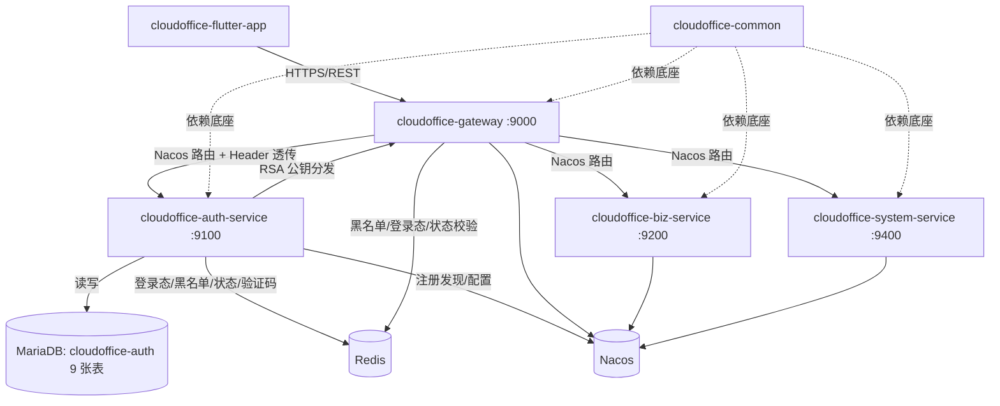

## 3. 类图

核心业务对象类图（认证服务为主，网关为辅）：

```mermaid
classDiagram
    class AuthenticationService {
        +login(LoginRequest) AuthResult
        +register(RegisterRequest) RegisterResult
        +completeAccountInfo(AccountSettlementRequest) void
    }
    class LoginService {
        +login(LoginRequest) AuthResult
        -validateRequest() void
        -validateTenant() void
        -validateUser() void
        -validateCredential() void
        -checkAccountStatus() void
        -checkClientMutex() void
        -issueToken() TokenPairDTO
        -createSession() void
        -writeLoginLog() void
    }
    class LoginStrategy {
        <<interface>>
        +support(String mode) boolean
        +login(LoginContext) LoginResult
    }
    class LoginStrategyFactory {
        +getStrategy(String mode) LoginStrategy
    }
    class UsernamePasswordStrategy
    class PhoneCodeLoginStrategy
    class PhonePasswordLoginStrategy
    class OAuthLoginStrategy
    class RegisterStrategy {
        <<interface>>
        +support(String mode) boolean
        +register(RegisterContext) RegisterResult
    }
    class RegisterStrategyFactory {
        +getStrategy(String mode) RegisterStrategy
    }
    class UsernamePwdRegisterStrategy
    class PhoneCodeRegisterStrategy
    class OAuthRegisterStrategy
    class PhoneSetUsernameStrategy
    class OAuthSetInfoStrategy
    class TokenService {
        +issueTokenPair(user, clientType) TokenPairDTO
        +refresh(refreshToken) TokenPairDTO
        +logout(accessToken, refreshToken) void
        +blacklist(token, ttl) void
        +validateBlacklist(token) boolean
    }
    class LoginSessionService {
        +createSession(user, clientType, sessionId) void
        +kickoutSameClient(userId, clientType) void
        +kickoutAll(userId) void
        +existsSession(sessionId) boolean
        +removeSession(sessionId) void
    }
    class PasswordService {
        +changePassword(userId, oldPwd, newPwd) void
        +forgotPassword(target, code, newPwd) void
        -clearAllSessions(userId) void
    }
    class VerificationCodeManager {
        +generateAndSend(target, purpose) void
        +verify(target, purpose, code) void
        +isFrequencyLimited(target) boolean
    }
    class VerificationCodeService {
        <<interface>>
        +send(target, code) void
    }
    class SimulatedVerificationCodeService
    class UserService {
        +pageQuery(tenantId, condition) PageResult
        +getDetail(userId) UserDTO
        +update(tenantId, request) void
        +changeStatus(tenantId, userId, status) void
        +delete(tenantId, userId) void
        +assignRoles(tenantId, userId, roleIds) void
        +findByUsername(tenantId, username) UserEntity
        +findByPhone(tenantId, phone) UserEntity
    }
    class RoleService {
        +create(tenantId, request) void
        +update(tenantId, roleId, request) void
        +delete(tenantId, roleId) void
        +list(tenantId) List
        +assignPermissions(tenantId, roleId, permissionIds) void
    }
    class PermissionService {
        +tree(tenantId) List
        +create(tenantId, request) void
        +update(tenantId, permissionId, request) void
        +delete(tenantId, permissionId) void
    }
    class LoginLogService {
        +record(loginLogEntity) void
        +pageQuery(tenantId, condition) PageResult
    }
    class JwtUtils {
        +generateToken(claims, expireMinutes) String
        +parseToken(token) Claims
        +verify(token) boolean
    }
    class UserEntity
    class TenantEntity
    class RoleEntity
    class PermissionEntity
    class UserRoleEntity
    class RolePermissionEntity
    class LoginLogEntity
    class OAuthAccountEntity
    class VerificationCodeEntity

    AuthenticationService --> LoginService : 编排
    AuthenticationService --> LoginStrategyFactory : 路由
    AuthenticationService --> RegisterStrategyFactory : 路由
    LoginService --> LoginStrategyFactory
    LoginService --> RegisterStrategyFactory
    LoginService --> TokenService
    LoginService --> LoginSessionService
    LoginService --> LoginLogService
    LoginService --> VerificationCodeManager
    LoginService --> PasswordService
    PasswordService --> VerificationCodeManager
    PasswordService --> LoginSessionService
    VerificationCodeManager --> VerificationCodeService
    LoginStrategyFactory --> LoginStrategy
    LoginStrategy <|.. UsernamePasswordStrategy
    LoginStrategy <|.. PhoneCodeLoginStrategy
    LoginStrategy <|.. PhonePasswordLoginStrategy
    LoginStrategy <|.. OAuthLoginStrategy
    RegisterStrategyFactory --> RegisterStrategy
    RegisterStrategy <|.. UsernamePwdRegisterStrategy
    RegisterStrategy <|.. PhoneCodeRegisterStrategy
    RegisterStrategy <|.. OAuthRegisterStrategy
    RegisterStrategy <|.. PhoneSetUsernameStrategy
    RegisterStrategy <|.. OAuthSetInfoStrategy
    TokenService --> JwtUtils : RS256 签发/解析
    TokenService --> LoginSessionService
    UserService ..> UserEntity
    UserService ..> TenantEntity
    UserService ..> UserRoleEntity
    RoleService ..> RoleEntity
    RoleService ..> RolePermissionEntity
    PermissionService ..> PermissionEntity
    LoginLogService ..> LoginLogEntity
    OAuthLoginStrategy ..> OAuthAccountEntity
    VerificationCodeManager ..> VerificationCodeEntity
```

网关侧核心类（认证辅助）：

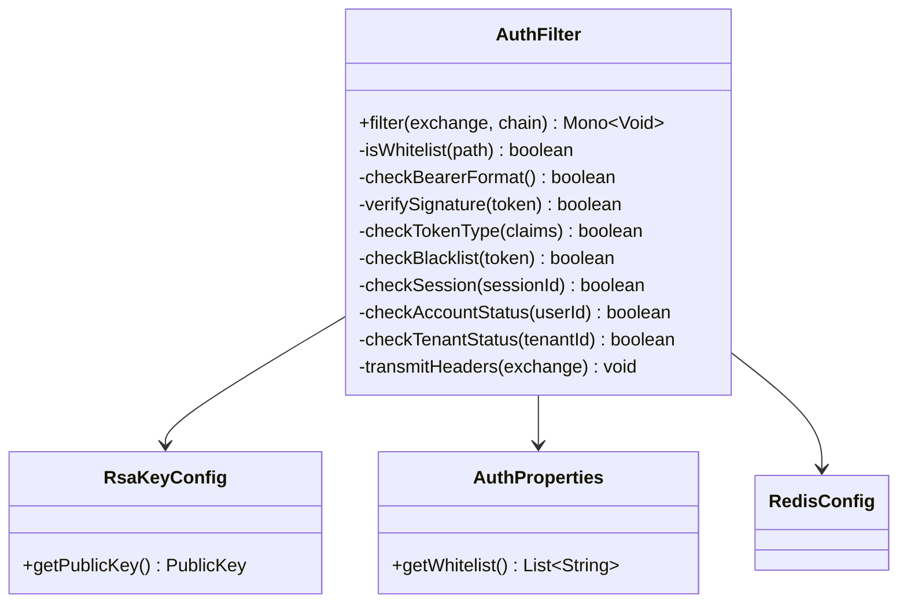

## 4. 核心业务流程时序图

### 4.1 登录流程（用户名密码示例，含同端互斥与双 Token 签发）

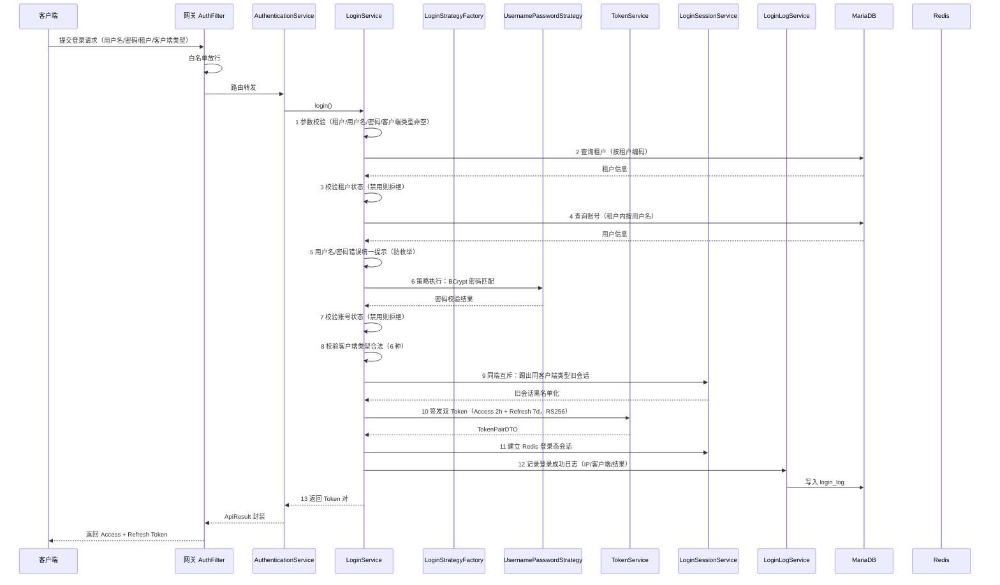

### 4.2 两步注册流程（OAuth 注册 → 账号补全）

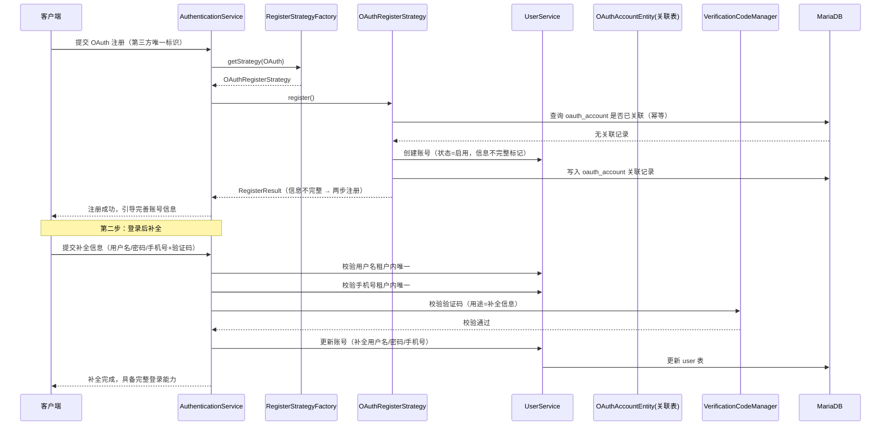

### 4.3 密码找回流程（验证码重置 + 清除全部登录态）

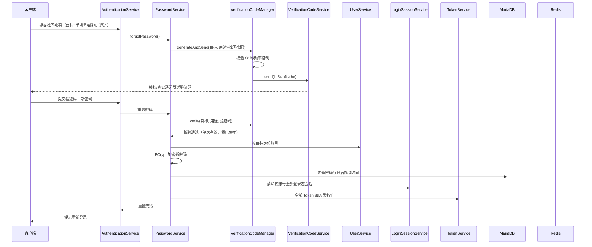

### 4.4 网关认证流程（9 步校验）

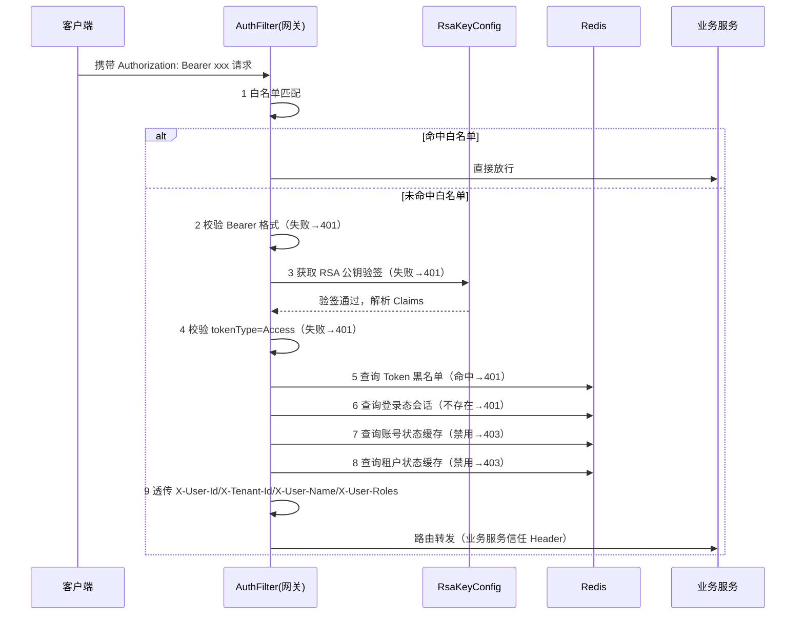

### 4.5 Token 刷新流程（轮换机制）

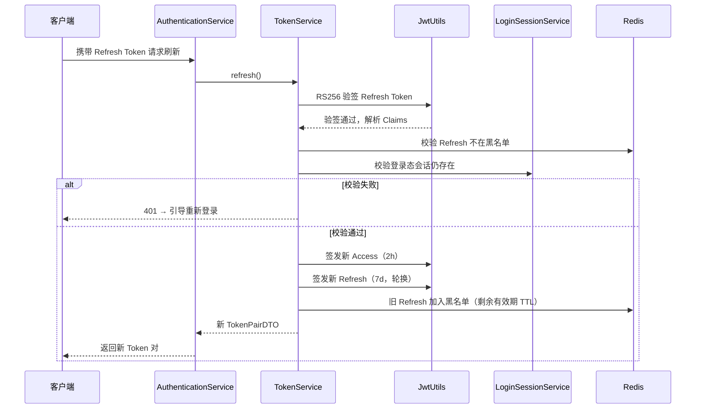

## 5. 状态图

### 5.1 账号状态流转

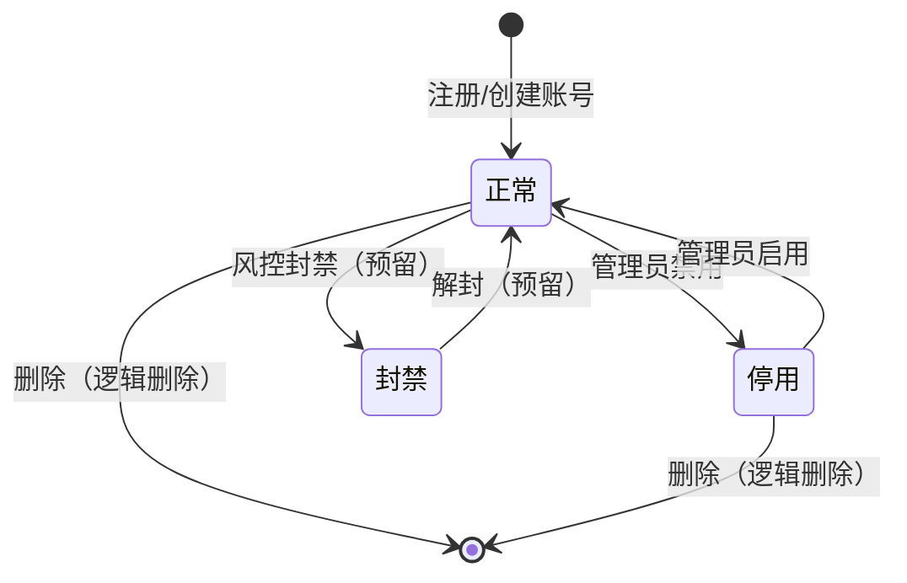

### 5.2 Token 生命周期

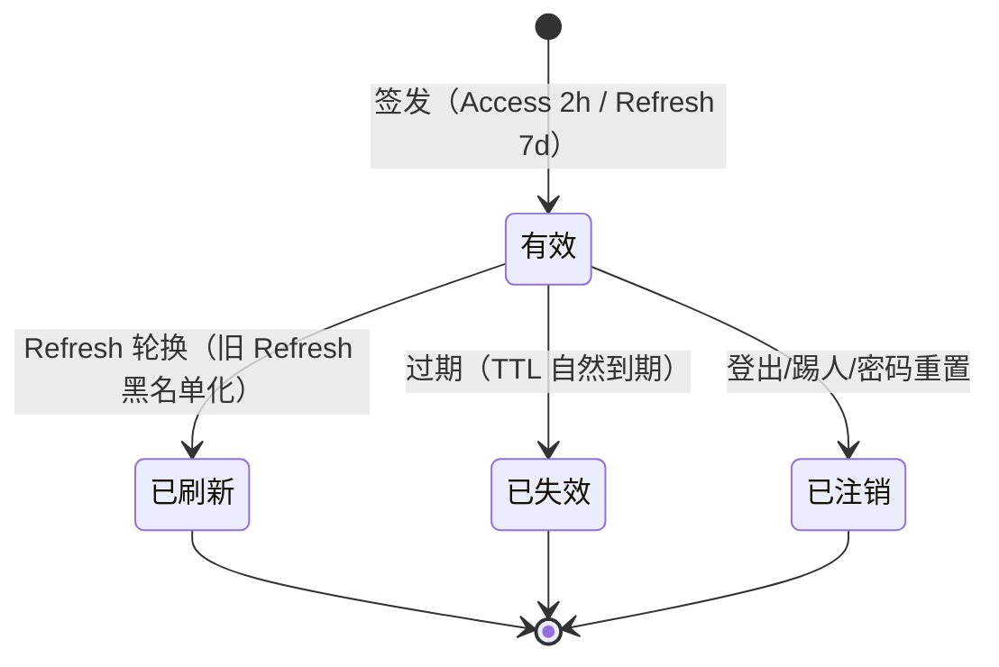

### 5.3 验证码生命周期

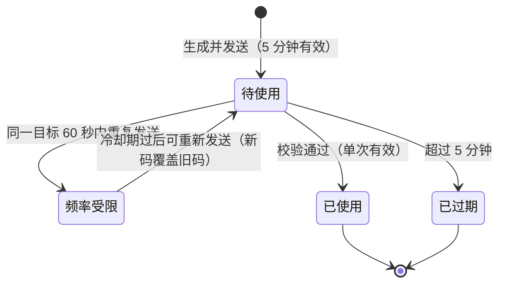

### 5.4 两步注册状态

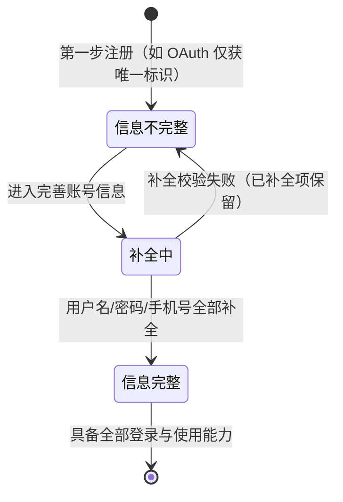

## 6. 核心业务逻辑

### 6.1 登录 13 步完整流程（LoginService.login）

```
function login(request):
    # 第 1 步：参数校验
    assert request.tenantCode/username/password/clientType 均非空，否则抛参数校验异常
    assert clientType ∈ {Windows, Ubuntu, H5, Android, iOS, WeChatMini}，否则抛参数校验异常

    # 第 2 步：租户校验
    tenant = tenantMapper.selectByCode(request.tenantCode)
    assert tenant != null，否则抛租户不存在异常

    # 第 3 步：租户状态校验
    assert tenant.status == 正常，否则抛租户禁用异常

    # 第 4 步：账号查询（租户内按用户名定位）
    user = userMapper.selectByTenantIdAndUsername(tenant.id, request.username)
    if user == null:
        writeLoginLog(失败, 原因=用户名或密码错误)   # 与密码错误同文案，防枚举
        throw 用户名或密码错误异常

    # 第 5 步：密码校验（按登录模式分发到策略）
    strategy = loginStrategyFactory.getStrategy(request.mode)
    strategy.login(user, request)   # BCrypt.matches 密码匹配；手机验证码模式校验验证码；OAuth 模式关联第三方账号

    # 第 6 步：账号状态校验
    assert user.status == 正常，否则抛账号禁用异常并记录失败日志

    # 第 7 步：同端互斥（同客户端类型新登录踢旧会话）
    loginSessionService.kickoutSameClient(user.id, request.clientType)   # 旧 Token 黑名单化 + 旧会话删除

    # 第 8 步：签发双 Token
    tokenPair = tokenService.issueTokenPair(user, request.clientType)
    # Access: claims(uid, tid, username, clientType, tokenType=access, jti) 有效期 2h
    # Refresh: claims(uid, tid, clientType, tokenType=refresh, jti) 有效期 7d

    # 第 9 步：建立 Redis 登录态会话
    sessionId = loginSessionService.createSession(user, request.clientType, tokenPair.jti)
    # Redis: session:{sessionId} → {userId, tenantId, userName, clientType, loginTime}
    # TTL 对齐 Refresh 7d

    # 第 10 步：记录登录成功日志
    loginLogService.record(user, clientType, IP, 成功)

    # 第 11 步：返回 Token 对
    return tokenPair
```

> 说明：上述为 11 项关键动作，结合任务编排（AuthenticationService 统一入口、失败分支均落失败日志、返回统一错误）构成完整的登录认证链路；其中"失败日志记录"覆盖第 3/4/5/6 步所有失败分支。

### 6.2 注册策略分发（AuthenticationService.register）

```
function register(request):
    tenant = validateTenant(request.tenantCode)          # 租户有效且启用
    strategy = registerStrategyFactory.getStrategy(request.mode)
    # 支持模式：用户名密码 / 手机验证码 / OAuth / 手机号设用户名 / OAuth 补全信息
    result = strategy.register(request)
    if result.accountIncomplete:                          # OAuth 信息不足 → 两步注册
        return RegisterResult(需要补全=true, 提示=完善账号信息)
    return RegisterResult(注册成功)
```

### 6.3 验证码生成与校验（VerificationCodeManager）

```
function generateAndSend(target, purpose):
    # 频率控制：同一 target 60 秒内不可重复发送
    if redis.exists(code:send:{purpose}:{target}):
        throw 发送过于频繁异常
    code = mock 模式 ? "123456" : random(6 位数字)        # VERIFICATION_CODE_MOCK 配置开关
    saveVerificationCode(target, purpose, code, expire=5min)
    redis.setex(code:send:{purpose}:{target}, 60s)        # 频率位
    verificationCodeService.send(target, code)            # 模拟/真实通道

function verify(target, purpose, code):
    record = queryVerificationCode(target, purpose, code)
    assert record != null，否则抛验证码错误异常
    assert record.expireAt > now，否则抛验证码过期异常
    assert record.used == false，否则抛验证码已使用异常（单次有效）
    record.used = true; updateVerificationCode(record)    # 置已使用
```

### 6.4 密码重置清会话（PasswordService.forgotPassword）

```
function forgotPassword(target, purpose=找回密码, code, newPassword):
    verify(target, purpose, code)                          # 验证码全量校验
    user = locateUserByTarget(target)                      # 手机号/邮箱定位账号
    assert user != null，否则抛账号不存在异常
    user.password = BCrypt.encode(newPassword)             # 策略校验 8~64 位
    user.lastPasswordChangeAt = now
    updateUser(user)
    # 清除该账号全部登录态：Token 黑名单化 + 会话删除
    loginSessionService.kickoutAll(user.id)
    writeAuditLog(密码重置, userId, target)
```

### 6.5 同端互斥与多端共存（LoginSessionService）

```
function createSession(user, clientType, sessionId):
    # 多端共存：会话 Key 含 userId + clientType + sessionId，不同 clientType 互不影响
    redis.setex(session:{userId}:{clientType}:{sessionId}, userInfo, 7d)

function kickoutSameClient(userId, clientType):
    # 同端互斥：枚举该用户同 clientType 的全部会话
    oldSessions = redis.scan(session:{userId}:{clientType}:*)
    for s in oldSessions:
        tokenService.blacklist(s.tokenJti, 剩余有效期)     # 旧 Token 立即失效
        redis.del(s)

function kickoutAll(userId):
    # 强制踢人/密码重置：枚举该用户全部客户端类型会话并全部清除
    sessions = redis.scan(session:{userId}:*)
    for s in sessions:
        tokenService.blacklist(s.tokenJti)
        redis.del(s)
```

### 6.6 网关 9 步校验（AuthFilter）

```
function filter(exchange):
    path = exchange.request.path
    if whitelist.contains(path): return chain.filter(exchange)        # 1 白名单放行
    auth = exchange.request.headers[Authorization]
    if auth == null or !auth.startsWith("Bearer "): return 401        # 2 Bearer 格式
    token = auth.substring(7)
    claims = jwtUtils.verify(token, publicKey)                        # 3 RS256 验签
    if claims == null: return 401
    if claims.tokenType != "access": return 401                       # 4 Token 类型
    if redis.exists(blacklist:{token.jti}): return 401                # 5 黑名单
    if !redis.exists(session:{claims.uid}:{claims.clientType}:{claims.jti}): return 401  # 6 登录态
    if redis.get(userStatus:{claims.uid}) == 禁用: return 403         # 7 账号状态
    if redis.get(tenantStatus:{claims.tid}) == 禁用: return 403       # 8 租户状态
    exchange.request.mutate().headers(
        X-User-Id, X-Tenant-Id, X-User-Name, X-User-Roles)            # 9 Header 透传
    return chain.filter(exchange)
```

## 7. 业务规则与约束

| 编号 | 规则 | 说明 |
| --- | --- | --- |
| R-001 | 多租户隔离 | 用户、角色、权限、关联关系、登录日志全部按租户 ID 隔离，租户间数据不可见，越权访问返回无权限 |
| R-002 | 用户名唯一性 | 用户名仅租户内唯一（唯一索引含租户 ID），手机号租户内不可重复绑定 |
| R-003 | 密码策略 | 8~64 位；BCrypt 单向加密存储；修改/找回时新密码不得与旧密码相同；任何接口与日志零明文 |
| R-004 | 防账号枚举 | 用户名不存在与密码错误统一返回"用户名或密码错误"，不区分提示 |
| R-005 | 登录模式 | 4 种：用户名密码 / 手机验证码 / 手机+密码 / OAuth，经 LoginStrategyFactory 分发 |
| R-006 | 注册模式 | 5 种：用户名密码 / 手机验证码 / OAuth / 手机号设用户名 / OAuth 补全信息，经 RegisterStrategyFactory 分发 |
| R-007 | 两步注册 | 仅信息不完整的账号可进入补全；补全校验失败回滚本次提交、已补全项保留 |
| R-008 | 双 Token | Access 2h + Refresh 7d；Refresh 轮换（旧 Refresh 立即失效）；RS256 非对称签名（RSA 2048，私钥仅认证服务持有） |
| R-009 | 会话管理 | 同端互斥（同客户端类型新登录踢旧会话）+ 多端共存（不同客户端类型可同时在线）；6 种客户端类型：Windows/Ubuntu/H5/Android/iOS/WeChatMini |
| R-010 | 实时失效 | 登出/踢人/密码重置/密码找回/用户禁用/租户禁用均实时生效（Redis 黑名单 + 会话 + 状态缓存联动） |
| R-011 | 验证码 | 6 位数字、5 分钟有效、用途绑定（登录/注册/找回密码/变更手机号/补全信息）、目标绑定、单次使用、60 秒发送频率控制 |
| R-012 | 验证码双模式 | VERIFICATION_CODE_MOCK=true 时返回固定码 123456（仅限开发/演示），真实模式对接短信/邮件服务商 |
| R-013 | RBAC 约束 | 角色编码租户内唯一；被用户引用的角色不可删除；权限编码全局唯一；父权限删除需先处理子权限 |
| R-014 | 网关信任链 | 业务服务仅信任网关透传 Header，不重复解析 Token；非白名单请求必须携带有效 Access Token |
| R-015 | 手机号变更 | 原手机可用→短信验证（发往原手机）；原手机停用→邮箱验证（发往绑定邮箱）；新手机号租户内唯一；变更后验证码登录/找回通道切换至新手机号 |
| R-016 | 审计规则 | 登录成功/失败日志记录率 100%，失败原因结构化存储；日志按租户隔离、分页查询 |
| R-017 | 响应规范 | 全部接口返回 ApiResult/PageResult；统一错误码（29 个）与全局异常处理；错误响应不泄露堆栈、SQL、密钥与敏感信息 |
| R-018 | 幂等 | OAuth 回调重复（同一授权码）幂等处理不重复创建账号；重复登出幂等不报错 |
| R-019 | 修改密码 | 修改密码保持登录态（与找回不同）；找回/重置密码后清除全部登录态 |
| R-020 | 默认租户 | 预置默认租户、SUPER_ADMIN 超级管理员角色与 admin 账号（全部权限） |

## 8. 业务数据流

### 8.1 登录数据流

```
客户端输入(用户名/密码/租户编码/客户端类型)
  → 网关 AuthFilter 白名单放行
  → AuthenticationService.login 编排
  → LoginStrategyFactory 分发到对应登录策略
  → LoginService 校验链路（租户状态 → 账号存在性 → 凭据 → 账号状态）
  → 校验通过：
      ├─ TokenService 签发双 Token（JwtUtils RS256）→ 返回客户端
      ├─ LoginSessionService 建立 Redis 登录态会话（同端互斥踢旧会话）→ Redis
      └─ LoginLogService 写入登录成功日志 → MariaDB login_log
  → 校验失败：
      ├─ LoginLogService 写入失败日志（结构化失败原因）→ MariaDB login_log
      └─ 返回统一错误码
```

### 8.2 注册数据流

```
访客选择注册模式
  → AuthenticationService.register 编排
  → RegisterStrategyFactory 分发注册策略
  → 校验（用户名租户内唯一 / 手机号验证码+租户内唯一 / OAuth 第三方标识幂等关联）
  → 创建账号（BCrypt 加密密码，状态=启用，默认分配租户默认角色）→ MariaDB user/user_role
  → OAuth 场景写入 oauth_account 关联记录 → MariaDB
  → 账号信息不完整 → 两步注册（登录后补全用户名/密码/手机号）
      → UserService 更新账号 + VerificationCodeManager 校验补全验证码
      → 补全完成 → 账号具备完整登录能力
```

### 8.3 网关认证数据流

```
客户端携带 Access Token 请求
  → AuthFilter 9 步校验（白名单 → Bearer → RS256 验签 → tokenType → 黑名单 → 登录态 → 账号状态 → 租户状态）
  → Redis：黑名单(hit)、登录态(session:{uid}:{clientType}:{jti})、账号状态(userStatus:{uid})、租户状态(tenantStatus:{tid})
  → 校验通过：透传 X-User-Id/X-Tenant-Id/X-User-Name/X-User-Roles Header
  → Nacos 路由至业务服务
  → 业务服务按 Header 执行资源级鉴权与业务处理
```

## 9. 数据结构定义

### 9.1 TokenPairDTO（Token 对）

| 字段 | 类型 | 说明 |
| --- | --- | --- |
| accessToken | String | Access Token（JWT RS256，有效期 2h） |
| refreshToken | String | Refresh Token（JWT RS256，有效期 7d） |
| expiresIn | Long | Access Token 剩余秒数 |
| tokenType | String | 固定 bearer |

### 9.2 Access Token Claims（载荷）

| 字段 | 类型 | 说明 |
| --- | --- | --- |
| uid | Long | 用户 ID |
| tid | Long | 租户 ID |
| username | String | 用户名 |
| clientType | String | 客户端类型（Windows/Ubuntu/H5/Android/iOS/WeChatMini） |
| tokenType | String | access / refresh |
| jti | String | Token 唯一 ID（会话关联键） |
| iat/exp | Long | 签发时间 / 过期时间 |

### 9.3 LoginUserDTO（登录用户信息）

| 字段 | 类型 | 说明 |
| --- | --- | --- |
| userId | Long | 用户 ID |
| tenantId | Long | 租户 ID |
| userName | String | 用户名 |
| phone | String | 手机号（脱敏处理） |
| email | String | 邮箱（脱敏处理） |
| roleCodes | List&lt;String&gt; | 角色编码集合（会话元数据，不落库） |

### 9.4 验证码记录（VerificationCodeRecord）

| 字段 | 类型 | 说明 |
| --- | --- | --- |
| target | String | 目标（手机号/邮箱） |
| purpose | String | 用途（登录/注册/找回密码/变更手机号/补全信息） |
| code | String | 6 位数字验证码 |
| expireAt | LocalDateTime | 过期时间（生成后 5 分钟） |
| used | Boolean | 是否已使用（单次有效） |
| sendAt | LocalDateTime | 发送时间（60 秒频率控制依据） |

### 9.5 登录日志记录（LoginLogEntity）

| 字段 | 类型 | 说明 |
| --- | --- | --- |
| id | Long | 主键 |
| tenantId | Long | 租户 ID |
| userId | Long | 用户 ID（失败时可空） |
| username | String | 用户名 |
| loginIp | String | 登录 IP |
| clientType | String | 客户端类型 |
| loginResult | Integer | 登录结果（0 成功 / 1 失败） |
| failReason | String | 结构化失败原因（密码错误/验证码错误/账号禁用/租户禁用等） |
| loginTime | LocalDateTime | 登录时间 |

### 9.6 会话元数据（Redis Session）

| 键 | 说明 |
| --- | --- |
| session:{userId}:{clientType}:{jti} | 登录态会话，值含用户/租户/客户端信息，TTL 对齐 Refresh 7d |
| blacklist:{jti} | Token 黑名单，TTL 对齐 Token 剩余有效期 |
| userStatus:{userId} | 账号状态缓存（正常/停用），TTL 短周期 + 变更即时更新 |
| tenantStatus:{tenantId} | 租户状态缓存（正常/禁用），TTL 短周期 + 变更即时更新 |
| code:send:{purpose}:{target} | 验证码发送频率位，TTL 60 秒 |

## 10. 异常处理策略

| 异常类别 | 代表异常 | 触发场景 | 处理方式 | 与错误码关系 |
| --- | --- | --- | --- | --- |
| 参数校验异常 | BusinessException(PARAM_INVALID) | 参数缺失/格式非法/客户端类型非法 | 全局异常处理器捕获，返回规范化错误 | 对应 29 个统一错误码之一 |
| 认证失败异常 | AuthException | 密码错误、验证码错误/过期/已使用、Token 无效/过期/黑名单、登录态不存在 | 返回 401 类错误码，不泄露内部细节 | 认证错误码组 |
| 业务冲突异常 | BusinessException | 用户名已存在、手机号已绑定、角色被引用不可删除、60 秒重复发送验证码、新密码与旧密码相同 | 返回业务冲突错误码 | 业务冲突错误码组 |
| 资源不存在异常 | BusinessException | 租户不存在、账号不存在、目标未绑定手机/邮箱 | 返回资源不存在错误码（用户名/密码错误场景合并提示防枚举） | 资源不存在错误码组 |
| 权限不足异常 | AuthException(FORBIDDEN) | 跨租户越权访问、无角色权限 | 返回 403 类错误码 | 权限错误码组 |
| 状态异常 | BusinessException | 账号禁用、租户禁用 | 返回状态异常错误码（网关侧映射 403） | 状态错误码组 |
| 系统异常 | Exception（兜底） | 未预期异常 | GlobalExceptionHandler 兜底，统一响应，日志记录堆栈、响应零堆栈 | 系统错误码 |

处理原则：
1. 全部异常经 GlobalExceptionHandler 统一转换为 ApiResult 错误响应，客户端契约一致。
2. 错误响应不泄露堆栈、SQL、密钥、Token、验证码等敏感信息。
3. 认证失败路径必须同步记录失败登录日志（失败原因结构化），支撑风控审计。
4. 网关 401（认证失败）/403（状态禁用）语义与认证服务错误码对齐，客户端按错误码跳转登录页或提示无权限。

## 11. 日志规范

| 路径 | 级别 | 日志内容 |
| --- | --- | --- |
| 登录成功 | INFO | 用户 ID、租户 ID、用户名、客户端类型、登录 IP、签发 Token 会话 ID（不含 Token 明文） |
| 登录失败 | WARN | 用户 ID/用户名（可解析时）、客户端类型、登录 IP、结构化失败原因、错误码 |
| 注册成功 | INFO | 租户 ID、用户名/手机号、注册模式、是否两步注册 |
| 两步注册补全 | INFO | 用户 ID、补全项清单（用户名/手机号/密码设置不落日志） |
| 修改密码 | INFO | 用户 ID、操作时间、最后修改密码时间（不落明文） |
| 密码找回/重置 | WARN | 用户 ID、目标通道（手机号脱敏/邮箱脱敏）、重置时间 |
| 登出 | INFO | 用户 ID、客户端类型、会话 ID |
| 强制踢人 | WARN | 操作人、被踢用户 ID、被踢会话数量 |
| 手机号变更 | WARN | 用户 ID、验证场景（短信/邮箱）、变更时间（新旧手机号脱敏） |
| 验证码发送 | INFO | 目标（脱敏）、用途、是否模拟模式（不落验证码明文） |
| Token 刷新 | INFO | 用户 ID、客户端类型、旧 jti 轮换为新 jti |
| 网关拦截 | WARN | 路径、校验步骤、拦截原因（验签失败/黑名单/无会话/禁用）、客户端 IP |

日志纪律：
1. 禁止输出密码明文、Token 明文、密钥、验证码明文、完整手机号/邮箱等敏感信息，一律脱敏。
2. 登录日志（业务审计数据）写入 login_log 表而非应用日志，供安全事件追溯。
3. 统一使用 SLF4J 日志门面，结合错误码输出便于检索。

## 12. 性能优化点

| 优化点 | 措施 |
| --- | --- |
| Redis 缓存分层 | 登录态会话/黑名单/账号状态/租户状态/验证码均设 TTL（7d/剩余有效期/短周期/5min），避免无界增长；Key 统一 RedisKeyConstants 管理防冲突 |
| Token 轮换降频 | Access 2h + Refresh 7d 减少重复登录与刷新频率；轮换防重放同时控制黑名单数据量（旧 Refresh 按剩余有效期 TTL） |
| 验证码频率控制 | 60 秒/目标频率位从源头削峰防滥用（防短信轰炸）；模拟模式发送零成本 |
| 登录日志解耦 | 日志写入独立事务路径，失败不影响登录主链路；后续可引入消息队列异步落库 |
| 数据库索引 | 用户表（tenant_id, username）租户内唯一索引、手机号索引；租户表编码索引；login_log 按 tenant_id + login_time 索引支撑分页检索 |
| 网关无状态校验 | 9 步校验全部基于 Redis 直接查询与本地验签，无远程调用链，单请求开销可控；预留 RequestRateLimiter 限流 |
| 同端互斥扫描 | 会话按 userId+clientType 组织 Key，互斥踢出用 SCAN 精准匹配，避免全库扫描 |
| RBAC 查询 | 角色-权限关联查询走批量与索引，权限树一次加载内存组装，避免 N+1 查询 |
| 状态缓存即时更新 | 账号/租户状态变更同步更新 Redis 缓存（写穿透），网关校验零延迟且避免频繁查库 |

## 13. 单元测试策略

### 13.1 测试范围

| 被测对象 | 测试重点 |
| --- | --- |
| LoginService | 13 步流程完整执行、各失败分支（租户禁用/账号不存在/密码错误/账号禁用）、同端互斥触发、Token 签发与会话建立 |
| AuthenticationService | 登录/注册编排正确性、策略工厂路由、两步注册判定 |
| LoginStrategyFactory / RegisterStrategyFactory | 各模式 support 匹配、未知模式异常 |
| 4 种登录策略 | 用户名密码 BCrypt 匹配、手机验证码调用验证码管理器、OAuth 关联/自动创建 |
| 5 种注册策略 | 用户名唯一校验、手机号唯一校验、OAuth 幂等、两步注册标记 |
| TokenService | 双 Token 签发（RS256 验签通过、声明正确）、刷新轮换（旧 Refresh 黑名单化）、登出黑名单化 |
| LoginSessionService | 同端互斥踢旧会话、多端共存保留、踢全部会话、会话 TTL |
| PasswordService | 修改密码旧密码校验、找回密码验证码校验、重置后清全部登录态、密码策略边界 |
| VerificationCodeManager | 生成（6 位数字/模拟固定码）、60 秒频率限制、5 分钟过期、单次使用、用途绑定 |
| UserService / RoleService / PermissionService | RBAC 三层关联、租户隔离查询、角色被引用不可删、权限树父子约束 |
| LoginLogService | 成功/失败日志写入、失败原因结构化、租户隔离分页查询 |
| JwtUtils | RS256 签发/解析/过期/篡改验签失败 |

### 13.2 用例划分与边界

1. **正常用例**：每种登录/注册模式各 1 条主路径用例；刷新轮换主路径；两步注册补全主路径。
2. **边界用例**：密码 8 位/64 位边界、验证码第 5 分钟过期边界、60 秒频率临界（59 秒拒绝/61 秒放行）、Token 到期临界。
3. **异常用例**：用户名不存在与密码错误同文案防枚举、验证码用途不匹配、验证码重复使用、租户禁用、账号禁用、非法客户端类型、角色被引用删除、父权限删除。
4. **会话用例**：同端互斥踢出后旧 Token 访问被拒、多端共存两 Token 均可用、密码重置后全部会话失效。
5. **幂等用例**：重复登出、OAuth 回调重复授权码。
6. **隔离用例**：跨租户查询用户/角色/日志返回空或拒绝。

### 13.3 覆盖目标

1. Service 层核心类（登录/注册/Token/会话/密码/验证码/日志）语句覆盖 ≥ 90%，分支覆盖 ≥ 85%。
2. 策略工厂与全部 9 种策略支持/不支持分支全覆盖。
3. 29 个错误码中认证与账号相关错误码触发路径全部覆盖。
4. 模拟验证码模式与真实模式接口抽象（Mock 实现）双路径覆盖。

<!-- SPDX-License-Identifier: Apache-2.0 / Copyright 2026 jenemy8023 <jenemy8023@163.com> -->
