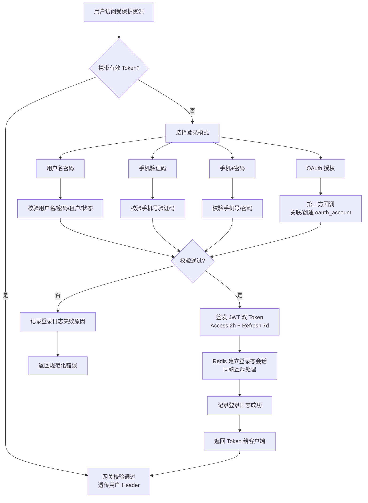
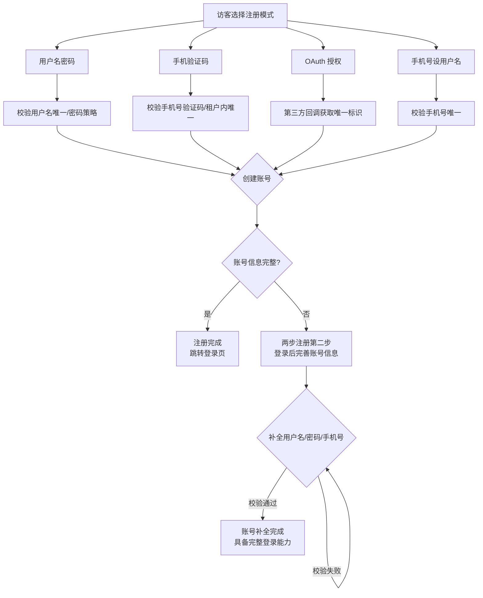
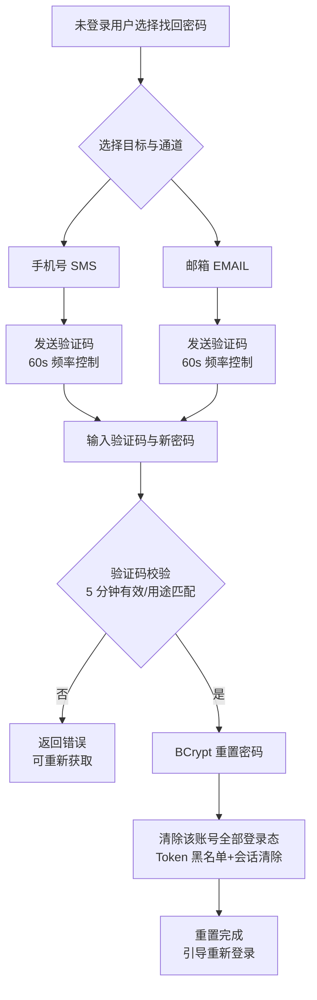
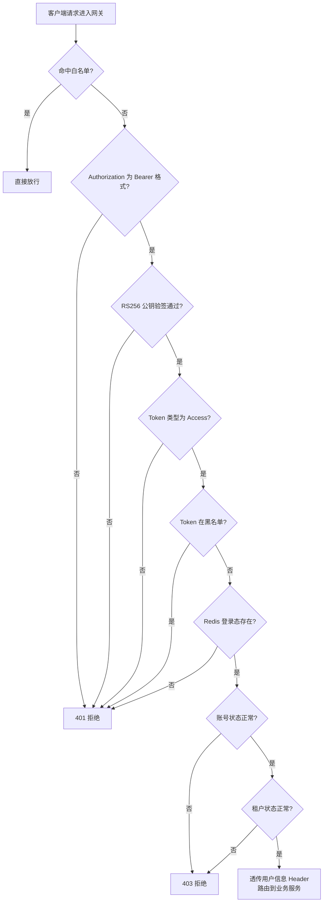

# 产品需求文档（PRD）
**项目名称**：云漫智企（CloudStrollOffice）
**版本号**：v0.0.1（初始化基线，对应已实现能力 v0.1.6）
**日期**：2026-08-06
**编写人**：BA

## 1. 产品背景
### 1.1 项目背景
云漫智企（CloudStrollOffice）是一套基于微服务架构的企业办公套件，面向多企业（多租户）共平台运营场景。在信息化与移动化办公趋势下，企业需要统一的账号体系、细粒度的权限控制与安全可靠的会话管理，作为办公业务（企业信息、人事管理、工作流、薪酬等）运转的基础底座。

项目采用 Java 21 + Spring Boot 3.2.5 + Spring Cloud 2023.0.1 微服务技术栈，以 Nacos 2.3.0 作为注册中心，MariaDB 10.6 作为关系型数据库，Redis 7.2.x 作为缓存中间件，并配套 Flutter 客户端。v0.0.1 为初始化基线版本，聚焦"统一认证授权 + 办公套件基础服务"，已完成统一认证中心、多租户 RBAC 权限模型、JWT 双 Token 会话体系、网关统一认证、账号自服务与安全审计等核心能力，为后续版本业务功能扩展奠定基础。

### 1.2 产品目标
1. **建立企业统一认证中心**：提供 4 种登录模式（用户名密码/手机验证码/手机+密码/OAuth）、5 种注册模式（用户名密码/手机验证码/OAuth/手机号设用户名/OAuth 补全信息）与两步注册机制，覆盖企业员工、外部用户、第三方账号等全部登录场景，认证策略采用工厂模式可持续扩展。
2. **实现多租户 RBAC 权限模型**：用户-角色-权限三层关联，权限树形组织，租户间数据完全隔离，用户名仅租户内唯一，支撑多企业共平台运营。
3. **构建安全可靠的会话认证体系**：JWT RS256 非对称签名双 Token（Access 2h + Refresh 7d + 轮换），结合 Redis 登录态、Token 黑名单与账号/租户状态缓存，实现主动登出、强制踢人、密码重置后登录态失效等实时控制。
4. **实现网关统一认证入口**：API 网关 9 步校验统一拦截全部请求，业务服务无需重复实现认证逻辑，认证通过后透传用户信息 Header。
5. **完善账号自服务能力**：密码修改/找回、手机号变更（双场景验证）、验证码管理（生成/发送/校验/频率控制）等自助功能，降低企业管理成本。
6. **建立安全审计能力**：全量记录登录日志（IP、客户端类型、登录结果、失败原因），支撑安全事件追溯与合规审计。
7. **搭建办公套件服务骨架**：企业服务（企业信息/人事管理骨架）、系统服务（系统配置/日志/监控/定时任务骨架）与健康检查链路，为 v0.2.0+ 业务功能奠定微服务基础。

### 1.3 核心设计理念
1. **微服务化**：公共/网关/认证/企业/系统 5 个模块低耦合拆分，服务间通过 Nacos 注册发现与 API 网关统一路由，各服务可独立部署、独立启停。
2. **多租户隔离**：所有业务数据按租户隔离，租户间数据不可见；RBAC 三层权限模型保证"最小权限"原则。
3. **安全优先**：JWT RS256 非对称签名、BCrypt 密码单向加密、验证码频率与有效期控制、敏感信息零落库零日志、Token 黑名单即时失效，全链路安全防护。
4. **统一规范**：REST 接口路径 /api/v1/{module}/{resource} 统一规范，全部接口统一返回 ApiResult 响应体，统一错误码（29 个）与全局异常处理，杜绝堆栈信息泄露。
5. **可扩展**：登录/注册策略工厂模式，新增认证方式不改动既有代码；服务骨架预留业务扩展点。

## 2. 目标用户
| 用户角色 | 使用场景 | 核心诉求 |
| --- | --- | --- |
| 企业管理员 | 管理本企业（租户）内用户、角色、权限，处理本租户账号安全事务 | 创建/禁用员工账号、分配角色与权限、查看登录日志、强制踢出在线用户、重置权限 |
| 系统管理员 | 平台级管理员（默认租户超级管理员 SUPER_ADMIN），负责租户、全局权限模型与平台运营 | 初始化默认租户与超级管理员、维护平台权限树、跨租户数据治理 |
| 普通员工 | 企业内部用户，通过多种登录模式访问办公套件，管理个人账号安全 | 多种方式登录、修改/找回密码、变更手机号、完善账号信息、安全登出 |
| OAuth 第三方用户 | 通过微信、钉钉、GitHub 等第三方平台授权登录的外部用户 | 第三方授权一键登录、首次登录自动创建账号、补全账号信息 |
| 访客/未登录用户 | 尚未注册或未登录的系统访问者 | 多种方式注册、密码找回发送验证码、查看认证服务健康状态 |

## 3. 功能清单
| 功能编号 | 功能名称 | 所属模块 | 优先级 | 版本范围 |
| --- | --- | --- | --- | --- |
| F-001 | 多模式登录（用户名密码/手机验证码/手机+密码/OAuth） | 认证服务 | 高 | v0.0.1 |
| F-002 | 多模式注册（用户名密码/手机验证码/OAuth/手机号设用户名/OAuth 补全信息） | 认证服务 | 高 | v0.0.1 |
| F-003 | 两步注册与账号补全 | 认证服务 | 中 | v0.0.1 |
| F-004 | JWT 双 Token 认证（RS256 签名、Access 2h + Refresh 7d + 轮换） | 认证服务 | 高 | v0.0.1 |
| F-005 | 网关全局认证（AuthFilter 9 步校验） | API 网关 | 高 | v0.0.1 |
| F-006 | 多端混合登录与会话管理（6 种客户端，同端互斥、多端共存） | 认证服务 | 中 | v0.0.1 |
| F-007 | Redis 登录态/黑名单/状态缓存管理 | 认证服务 | 高 | v0.0.1 |
| F-008 | 多租户隔离与租户状态管理 | 认证服务 | 高 | v0.0.1 |
| F-009 | RBAC 权限模型（用户-角色-权限三层关联） | 认证服务 | 高 | v0.0.1 |
| F-010 | 用户管理（分页/详情/更新/启禁用/删除/分配角色） | 认证服务 | 高 | v0.0.1 |
| F-011 | 角色管理（创建/更新/删除/列表/分配权限） | 认证服务 | 高 | v0.0.1 |
| F-012 | 权限管理（树形列表/创建/更新/删除） | 认证服务 | 中 | v0.0.1 |
| F-013 | 密码管理（修改密码/密码找回） | 认证服务 | 高 | v0.0.1 |
| F-014 | 手机号变更（原手机可用→短信验证 / 原手机停用→邮箱验证） | 认证服务 | 中 | v0.0.1 |
| F-015 | 验证码管理（生成/发送/校验/频率控制/用途绑定） | 认证服务 | 高 | v0.0.1 |
| F-016 | 登出与强制踢人 | 认证服务 | 中 | v0.0.1 |
| F-017 | 登录日志审计 | 认证服务 | 中 | v0.0.1 |
| F-018 | 统一响应体与异常体系（ApiResult / 29 错误码 / 全局异常处理） | 公共模块 | 高 | v0.0.1 |
| F-019 | API 文档（SpringDoc OpenAPI 3，模块分组） | 公共模块 | 低 | v0.0.1 |
| F-020 | 健康检查（网关/认证/企业/系统四服务探活） | 全部服务 | 中 | v0.0.1 |
| F-021 | 企业服务骨架（企业信息/人事管理） | 企业服务 | 中 | v0.0.1（骨架） |
| F-022 | 系统服务骨架（系统配置/日志/监控/定时任务） | 系统服务 | 中 | v0.0.1（骨架） |

## 4. 详细功能描述
### 4.1 多模式登录
#### 功能描述
用户可通过 4 种登录模式获取系统访问凭证：用户名密码、手机验证码、手机+密码、OAuth 第三方授权。认证服务按策略工厂模式统一编排各登录策略，支持 6 种客户端类型（Windows/Ubuntu/H5/Android/iOS/WeChatMini）与多租户环境。

#### 业务规则
1. 用户名密码登录：校验用户名在指定租户内存在、账号状态正常（未禁用）、密码经 BCrypt 匹配；同一租户下用户名唯一。
2. 手机验证码登录：先通过验证码管理器校验验证码（5 分钟有效、用途绑定登录、60 秒频率控制），再按手机号定位账号；支持该手机未关联账号时的自动注册（配置项控制）。
3. 手机+密码登录：手机号定位账号 + BCrypt 密码校验，适合已绑定手机的用户。
4. OAuth 登录：跳转第三方平台（微信/钉钉/GitHub 等）授权，回调后按第三方唯一标识关联 oauth_account 记录定位账号；未关联时自动创建账号并关联。
5. 登录成功统一签发 JWT 双 Token（Access 2h + Refresh 7d），建立 Redis 登录态会话，写入登录日志（IP/客户端/结果/失败原因）。
6. 登录失败（密码错误、验证码错误、账号禁用、租户禁用等）同样记录登录日志，失败原因结构化存储。

#### 页面原型说明
登录页提供模式切换 Tab（密码登录/验证码登录/OAuth 图标入口）；密码登录含用户名、密码、租户选择、客户端类型选择；验证码登录含手机号、获取验证码按钮、验证码输入框；OAuth 提供第三方图标快捷入口。登录成功后进入工作台首页；失败时页面内联展示规范化错误提示。

### 4.2 多模式注册
#### 功能描述
访客可通过 5 种注册模式创建账号：用户名密码注册、手机验证码注册、OAuth 注册（自动创建并关联）、手机号设用户名注册、OAuth 补全信息注册（注册后补全用户名/密码/手机号）。注册策略同样采用工厂模式扩展。

#### 业务规则
1. 用户名密码注册：用户名租户内唯一、满足用户名规则；密码满足 8~64 位策略并经 BCrypt 加密；注册后默认分配租户默认角色。
2. 手机验证码注册：校验手机号验证码（用途=注册）通过后创建账号并绑定手机号；手机号在租户内不可重复绑定。
3. OAuth 注册：第三方授权成功后自动创建账号并写入 oauth_account 关联记录，若第三方返回的信息不足以独立登录则进入两步注册。
4. 手机号设用户名注册：以手机号作为用户名创建账号，无需额外输入用户名。
5. OAuth 补全信息注册：OAuth 账号信息不完整时，注册后引导用户在"完善账号信息"步骤补全用户名/密码/手机号，补全完成后账号具备完整登录能力。
6. 所有注册路径均校验租户有效性与数据唯一性，创建成功后默认处于启用状态。

#### 页面原型说明
注册页提供注册方式切换；表单按模式动态展示（用户名/密码/手机号/验证码/第三方图标）；提交成功跳转登录页或两步注册第二步（完善账号信息页）。

### 4.3 两步注册与账号补全
#### 功能描述
针对注册时信息不完整的账号（如 OAuth 注册仅获得第三方唯一标识），提供"先注册后补全"的两步注册机制：第一步完成账号创建，第二步登录后在"完善账号信息"中补全用户名/密码/手机号。

#### 业务规则
1. 两步注册仅对信息不完整的账号开放，补全入口在登录后提示。
2. 补全项可包括：用户名（租户内唯一）、密码（符合策略）、手机号（验证码校验、租户内唯一）。
3. 补全过程中任一信息校验失败均回滚本次补全，已补全项保留。
4. 账号补全完成后即可使用全部登录方式与完整功能。

#### 页面原型说明
完善账号信息页展示待补全字段清单与必填标识；逐项填写并校验；提交成功后显示"账号信息已完善"并跳转工作台。

### 4.4 JWT 双 Token 认证与会话管理
#### 功能描述
认证成功后签发双 Token：Access Token（有效期 2 小时，携带用户/租户/客户端声明）与 Refresh Token（有效期 7 天），支持刷新轮换（旧 Refresh 作废、签发新 Refresh）。Token 使用 RSA 2048 位非对称密钥 RS256 签名，私钥仅认证服务持有，公钥供网关验签。

#### 业务规则
1. Access Token 过期后客户端使用 Refresh Token 调用刷新接口获取新 Token 对；Refresh Token 过期则需重新登录。
2. 刷新采用轮换机制：每次刷新签发新 Refresh Token 并使旧 Refresh Token 立即失效，防止重放。
3. Redis 维护登录态会话（会话 ID、客户端类型、用户/租户信息）、Token 黑名单（登出/踢人/密码重置后加入）与账号/租户状态缓存。
4. 同一客户端类型新登录踢掉旧会话（同端互斥），不同类型客户端可同时在线（多端共存）。
5. 主动登出将 Token 加入黑名单并清除会话；强制踢人清除指定用户全部登录态；密码重置后清除该账号全部登录态。

#### 页面原型说明
无独立页面，客户端 SDK 在收到 Access Token 过期响应（401）后自动调用刷新接口；登录态失效时提示重新登录。

### 4.5 网关全局认证
#### 功能描述
API 网关 AuthFilter 统一拦截全部请求，执行 9 步校验流程：白名单放行 → Bearer 格式校验 → RS256 公钥验签 → Token 类型校验 → 黑名单校验 → 登录态校验 → 账号状态校验 → 租户状态校验 → Header 透传。认证通过后将用户信息（userId/tenantId/userName/角色等）写入请求 Header 透传给下游业务服务。

#### 业务规则
1. 白名单接口（登录、注册、验证码发送、密码找回、健康检查等）直接放行，不要求携带 Token。
2. 任一校验步骤失败即返回 401/403 规范化错误，不泄露内部细节。
3. 黑名单、登录态、账号状态、租户状态校验依赖 Redis，保证登出/踢人/禁用实时生效。
4. 业务服务仅信任网关透传的 Header 获取当前用户与租户，不再重复解析 Token。
5. 未携带 Token 或 Token 非 Bearer 格式的请求直接拒绝。

#### 页面原型说明
无独立页面；客户端在收到 401/403 时根据错误码跳转登录页或提示无权限。

### 4.6 RBAC 权限管理（用户/角色/权限）
#### 功能描述
基于用户-角色-权限三层关联模型实现细粒度访问控制：权限按树形结构组织（权限树），角色在租户内编码唯一并可分配权限，用户分配角色后获得角色关联权限集合。

#### 业务规则
1. 用户管理：分页查询、详情、更新、启用/禁用、删除、分配角色；用户名租户内唯一。
2. 角色管理：创建、更新、删除、列表查询、分配权限；角色编码租户内唯一；被用户引用的角色不可删除。
3. 权限管理：树形列表、创建、更新、删除；权限编码全局唯一；父子层级关系清晰，父权限删除需先处理子权限。
4. 多租户隔离：用户、角色、权限、关联关系全部按租户隔离，租户间数据不可见。
5. 默认租户预置超级管理员角色 SUPER_ADMIN 与管理员账号 admin，拥有全部权限。
6. 用户禁用后其全部登录态实时失效（Redis 状态缓存 + 网关状态校验联动）。

#### 页面原型说明
用户管理页（列表/搜索/新建/编辑/启禁用/分配角色弹窗）；角色管理页（列表/新建/编辑/分配权限弹窗，权限按树形勾选）；权限管理页（树形表格/新建/编辑/删除）。

### 4.7 密码管理（修改/找回）
#### 功能描述
提供两类密码能力：修改密码（登录后，校验旧密码）与密码找回（未登录，验证码验证后重置）。密码经 BCrypt 单向加密存储，任何接口与日志不返回明文。

#### 业务规则
1. 修改密码：提交旧密码与新密码；旧密码 BCrypt 校验失败则拒绝；新密码符合 8~64 位策略且与旧密码不同。
2. 找回密码：选择目标（手机号/邮箱）与通道（SMS/EMAIL）→ 发送验证码 → 提交验证码与新密码 → 校验验证码（60 秒频率、5 分钟有效、用途=找回密码）→ 重置密码。
3. 密码重置成功后自动清除该账号全部登录态（Token 黑名单 + 会话清除），要求重新登录。
4. 记录最后修改密码时间，供安全审计追溯。

#### 页面原型说明
修改密码页（旧密码/新密码/确认新密码）；找回密码页（步骤条：选择目标 → 验证码 → 设置新密码 → 完成）。

### 4.8 手机号变更
#### 功能描述
员工更换手机号时更新账号绑定手机号。按场景区分验证方式：原手机可用时通过短信验证码验证，原手机停用时通过邮箱验证码验证。

#### 业务规则
1. 原手机可用场景：提交原手机号、新手机号与短信验证码（发往原手机号），校验通过后更新绑定手机。
2. 原手机停用场景：提交新手机号与邮箱验证码（发往绑定邮箱），校验通过后更新绑定手机。
3. 新手机号在租户内不可重复绑定；变更后验证码类登录/找回通道自动切换到新手机号。
4. 变更操作记录日志，可追溯。

#### 页面原型说明
手机号变更页提供两种场景入口；表单含原手机号/新手机号/验证码输入；变更成功后展示新手机号并提示相关通道已切换。

### 4.9 验证码管理
#### 功能描述
为登录、注册、找回密码、手机号变更等场景提供短信/邮箱验证码的统一生成、发送、校验能力，支持模拟与真实两种发送模式。

#### 业务规则
1. 生成：6 位数字验证码，有效期 5 分钟，绑定用途（登录/注册/找回密码/变更手机号）与目标（手机号/邮箱）。
2. 发送频率：同一目标 60 秒内不可重复发送，防止滥用。
3. 校验：验证码有效性、用途匹配、目标匹配、生命周期（未过期/未使用）全量校验，校验通过后置为已使用（单次有效）。
4. 模拟模式（VERIFICATION_CODE_MOCK=true）：开发/演示环境直接返回固定验证码 123456，便于联调；真实模式通过短信/邮件服务商发送。
5. 验证码校验错误返回规范化错误码，不泄露验证码本身。

#### 页面原型说明
验证码输入组件：获取验证码按钮带 60 秒倒计时；输入框限制 6 位数字；错误时内联提示并可重新获取。

### 4.10 登出、强制踢人与登录日志审计
#### 功能描述
用户主动登出使当前 Token 即时失效；管理员可强制踢出指定用户全部在线会话；系统全量记录登录日志支撑安全审计。

#### 业务规则
1. 主动登出：将 Access/Refresh Token 加入黑名单并清除 Redis 会话。
2. 强制踢人：管理员调用接口清除指定用户全部登录态，被踢用户下次请求即返回 401。
3. 登录日志：每次登录请求（成功/失败）自动写入，字段含登录 IP、客户端类型、登录结果、失败原因、时间戳、租户/用户信息。
4. 日志数据供安全事件追溯（异常登录、暴力破解分析）。

#### 页面原型说明
个人中心提供"退出登录"；企业管理员用户管理页提供"强制踢出"操作；登录日志在审计管理页以表格展示（支持按时间/结果/客户端筛选）。

## 5. 业务流程图
（使用 Mermaid 描述核心业务流程。）

### 5.1 登录流程（多模式登录 + 双 Token 签发）

### 5.2 注册流程（多模式注册 + 两步注册）

### 5.3 密码找回流程

### 5.4 网关认证流程（9 步校验）

## 6. 数据需求
本版本核心数据模型位于认证库（cloudoffice-auth），共 9 张业务表，对应数据实体如下：

| 数据实体 | 对应表 | 说明 | 关键字段 |
| --- | --- | --- | --- |
| 租户 | tenant | 企业/租户主体，登录与业务数据隔离边界 | 租户编码、名称、状态、类型 |
| 用户 | user | 系统用户，用户名租户内唯一 | 用户名、密码（BCrypt）、手机号、邮箱、状态、租户 ID |
| 角色 | role | 权限集合载体，租户内编码唯一 | 角色编码、名称、状态、租户 ID |
| 权限 | permission | 细粒度访问控制单元，树形组织 | 权限编码、名称、父 ID、类型、路径 |
| 用户-角色关联 | user_role | 用户与角色的多对多关联 | 用户 ID、角色 ID、租户 ID |
| 角色-权限关联 | role_permission | 角色与权限的多对多关联 | 角色 ID、权限 ID |
| 登录日志 | login_log | 登录成功/失败全量审计记录 | 用户 ID、登录 IP、客户端类型、结果、失败原因、时间 |
| OAuth 账号 | oauth_account | 第三方平台账号关联 | 用户 ID、提供商、第三方唯一标识 |
| 验证码 | verification_code | 短信/邮箱验证码生命周期管理 | 目标、用途、验证码、过期时间、已使用标记 |

企业服务（企业信息/人事管理）与系统服务（系统配置/日志/监控/定时任务）本版本仅提供骨架，数据库表预留，后续版本按需设计建表。

## 7. 验收标准
1. **认证能力**：4 种登录模式、5 种注册模式、两步注册全部可用；登录成功签发双 Token，Access 2h、Refresh 7d，刷新轮换生效。
2. **网关认证**：白名单接口免 Token 放行；非白名单接口未带 Token、伪造 Token、黑名单 Token、禁用账号、禁用租户均被拒绝（401/403），通过后 Header 正确透传。
3. **会话管理**：同一客户端类型新登录踢掉旧会话，不同客户端类型可同时在线；主动登出、强制踢人、密码重置后登录态实时失效。
4. **权限模型**：用户-角色-权限三层关联生效；租户间数据不可见；默认租户 SUPER_ADMIN/admin 可登录并具备全部权限。
5. **账号自服务**：修改密码校验旧密码；找回密码经验证码重置并清除全部登录态；手机号变更两种场景验证均可用，新手机号租户内唯一。
6. **验证码**：模拟模式返回固定验证码 123456；真实模式可配置发送；同一目标 60 秒内重复发送被拒绝；验证码 5 分钟有效、单次使用、用途绑定。
7. **审计**：登录成功/失败日志记录率 100%，失败原因结构化可查。
8. **统一规范**：全部 REST 接口返回 ApiResult 响应体；错误响应使用统一错误码；异常响应不泄露堆栈与敏感信息。
9. **非功能**：认证核心接口（登录/注册/刷新）响应时间 P95 ≤ 500ms；密码 BCrypt 加密率 100%；敏感信息日志泄露事件为 0；四服务健康检查端点可用。
10. **部署**：Docker Compose 一键编排（Nacos/MariaDB/Redis + 4 微服务共 8 容器）可启动，全部服务健康检查通过。

## 8. 用户故事（User Stories）
### US-001：用户名密码登录
#### 故事描述
作为普通员工，我想要使用用户名和密码登录系统，以便快速进入办公套件工作台。
#### 前置条件
默认租户 DEFAULT 存在；账号已创建且状态为启用；部署环境已配置 RSA 密钥与中间件。
#### 验收标准
- [ ] Given 我输入正确的用户名、密码、租户与客户端类型，When 我提交登录请求，Then 系统返回 Access Token（2h）与 Refresh Token（7d）并在 Redis 建立登录态会话
- [ ] Given 我输入错误的密码，When 我提交登录请求，Then 系统返回规范化错误码并记录失败登录日志（原因=密码错误）
- [ ] Given 我的账号已被禁用，When 我提交登录请求，Then 系统拒绝登录并返回账号禁用错误
- [ ] Given 我提交的租户已被禁用，When 我提交登录请求，Then 系统拒绝登录并返回租户禁用错误
#### 边界情况与错误处理
| 场景 | 预期处理 |
| --- | --- |
| 用户名不存在 | 返回用户名或密码错误（不区分提示，防枚举），记录失败日志 |
| 连续多次失败登录 | 记录全部失败日志，供管理员审计分析 |
| 密码为明文或长度不符 | 仅影响校验结果，日志与响应中零明文密码 |
#### 关联功能编号
F-001、F-004、F-007、F-008、F-017

### US-002：手机验证码登录
#### 故事描述
作为普通员工，我想要使用手机验证码登录，以便忘记密码时也能安全便捷地进入系统。
#### 前置条件
账号已绑定手机号；验证码发送通道可用（模拟或真实模式）。
#### 验收标准
- [ ] Given 我点击获取验证码并输入手机号，When 验证码发送成功且我输入正确验证码，Then 系统校验通过并完成登录
- [ ] Given 我输入错误或过期的验证码，When 我提交登录，Then 系统拒绝登录并提示验证码错误
- [ ] Given 我 60 秒内重复点击获取验证码，When 我再次请求发送，Then 系统拒绝并提示发送过于频繁
#### 边界情况与错误处理
| 场景 | 预期处理 |
| --- | --- |
| 手机号未绑定账号且未开启自动注册 | 提示手机号未注册，引导注册 |
| 验证码用途不匹配（如用注册验证码登录） | 校验失败，返回用途错误 |
| 验证码已使用 | 单次有效，重复使用被拒绝 |
#### 关联功能编号
F-001、F-015、F-017

### US-003：OAuth 第三方登录
#### 故事描述
作为 OAuth 第三方用户，我想要通过微信/钉钉/GitHub 授权一键登录，以便免去记忆用户名密码。
#### 前置条件
第三方平台应用凭证已配置；第三方授权服务可用。
#### 验收标准
- [ ] Given 我点击第三方图标并完成平台授权，When 系统回调认证服务，Then 系统定位或自动创建账号并完成登录
- [ ] Given 第三方账号首次登录且信息不完整，When 登录成功，Then 系统引导进入账号补全（两步注册第二步）
- [ ] Given 第三方平台拒绝授权，When 授权回调返回失败，Then 系统返回授权失败提示，不创建账号
#### 边界情况与错误处理
| 场景 | 预期处理 |
| --- | --- |
| 第三方回调重复（同一授权码） | 幂等处理，不重复创建账号 |
| 第三方唯一标识变更 | 以 oauth_account 关联记录为准重新关联 |
| 第三方服务不可用 | 登录失败并返回可重试提示 |
#### 关联功能编号
F-001、F-003、F-009

### US-004：多端会话管理
#### 故事描述
作为普通员工，我想要在不同设备上同时登录（不同客户端类型），以便手机和电脑都能访问办公套件。
#### 前置条件
账号有效；客户端类型参数正确（Windows/Ubuntu/H5/Android/iOS/WeChatMini）。
#### 验收标准
- [ ] Given 我已在 Windows 客户端登录，When 我在 Android 客户端登录同一账号，Then 两个会话共存均可访问
- [ ] Given 我已在 Android 客户端登录，When 我在另一个 Android 客户端登录同一账号，Then 旧 Android 会话被踢出（同端互斥）
- [ ] Given 我的会话被新登录踢出，When 我使用旧 Token 访问接口，Then 网关返回 401
#### 边界情况与错误处理
| 场景 | 预期处理 |
| --- | --- |
| 客户端类型缺失或非法 | 拒绝登录，返回参数错误 |
| 同端互斥踢出 | 旧会话 Token 即时失效（黑名单+会话清除） |
#### 关联功能编号
F-001、F-004、F-006、F-007

### US-005：用户名密码注册
#### 故事描述
作为访客，我想要使用用户名和密码注册账号，以便获得系统访问资格。
#### 前置条件
租户有效；注册功能开放。
#### 验收标准
- [ ] Given 我输入租户内唯一的用户名与符合策略的密码，When 我提交注册，Then 系统创建账号（BCrypt 加密密码）并返回成功
- [ ] Given 用户名在租户内已存在，When 我提交注册，Then 系统拒绝并提示用户名已被占用
- [ ] Given 密码长度不足 8 位，When 我提交注册，Then 系统拒绝并提示密码策略不满足
#### 边界情况与错误处理
| 场景 | 预期处理 |
| --- | --- |
| 用户名含非法字符 | 返回参数校验错误 |
| 租户不存在或已禁用 | 拒绝注册并返回租户错误 |
#### 关联功能编号
F-002、F-018

### US-006：手机验证码注册
#### 故事描述
作为访客，我想要通过手机验证码注册，以便用手机号快速创建账号。
#### 前置条件
验证码通道可用；手机号未被占用。
#### 验收标准
- [ ] Given 我获取验证码并输入正确验证码，When 我提交注册，Then 系统创建账号并绑定手机号
- [ ] Given 手机号已在租户内绑定其他账号，When 我提交注册，Then 系统拒绝并提示手机号已注册
- [ ] Given 验证码错误或过期，When 我提交注册，Then 系统拒绝注册
#### 边界情况与错误处理
| 场景 | 预期处理 |
| --- | --- |
| 验证码用途为登录而非注册 | 用途不匹配，校验失败 |
| 60 秒内重复发送 | 频率控制拒绝 |
#### 关联功能编号
F-002、F-015

### US-007：两步注册与账号补全
#### 故事描述
作为 OAuth 用户，我想要在账号信息不完整时补全用户名/密码/手机号，以便账号具备完整登录与使用能力。
#### 前置条件
账号已通过两步注册第一步创建，信息不完整。
#### 验收标准
- [ ] Given 我的账号缺少用户名，When 我提交唯一且合法的用户名，Then 补全成功
- [ ] Given 我的账号缺少密码，When 我设置符合策略的密码，Then 补全成功且密码 BCrypt 存储
- [ ] Given 补全项校验失败（用户名重复/验证码错误），When 我提交，Then 本次补全回滚，已补全项保留
- [ ] Given 账号补全完成，When 我再次登录，Then 可使用全部登录方式
#### 边界情况与错误处理
| 场景 | 预期处理 |
| --- | --- |
| 已完整的账号访问补全入口 | 拒绝并提示无需补全 |
| 补全过程中网络中断 | 已提交成功的字段不丢失 |
#### 关联功能编号
F-003、F-002

### US-008：修改密码
#### 故事描述
作为普通员工，我想要修改密码，以便定期更换密码保障账号安全。
#### 前置条件
已登录；新密码符合 8~64 位策略。
#### 验收标准
- [ ] Given 我提交正确的旧密码与新密码，When 我确认修改，Then 系统更新密码并记录最后修改时间
- [ ] Given 我提交错误的旧密码，When 我确认修改，Then 系统拒绝并提示旧密码错误
- [ ] Given 新密码与旧密码相同，When 我确认修改，Then 系统拒绝
#### 边界情况与错误处理
| 场景 | 预期处理 |
| --- | --- |
| 新密码强度不足 | 返回密码策略错误 |
| 修改密码后登录态 | 保持登录，不强制下线（与找回不同） |
#### 关联功能编号
F-013、F-009

### US-009：密码找回
#### 故事描述
作为忘记密码的用户，我想要通过手机/邮箱验证码重置密码，以便重新获得系统访问能力。
#### 前置条件
账号绑定了手机号或邮箱；验证码通道可用。
#### 验收标准
- [ ] Given 我选择手机号通道并输入正确验证码与新密码，When 我提交重置，Then 密码重置成功
- [ ] Given 密码重置成功后，When 我使用旧 Token 访问接口，Then 系统拒绝（全部登录态已清除）
- [ ] Given 验证码错误或过期，When 我提交重置，Then 系统拒绝并提示重新获取
#### 边界情况与错误处理
| 场景 | 预期处理 |
| --- | --- |
| 目标未绑定手机/邮箱 | 提示无法通过该通道找回 |
| 60 秒内重复发送 | 频率控制拒绝 |
| 重置后原会话 | 全部实时失效，需重新登录 |
#### 关联功能编号
F-013、F-015、F-007

### US-010：手机号变更（原手机可用）
#### 故事描述
作为换号员工，我想要在原手机可用时通过短信验证变更绑定手机号，以便继续使用账号。
#### 前置条件
已登录；原手机号可接收验证码；新手机号租户内未被占用。
#### 验收标准
- [ ] Given 我提交原手机号、新手机号与发送至原手机的验证码，When 验证码正确，Then 绑定手机号更新为新手机号
- [ ] Given 新手机号已被其他账号绑定，When 我提交变更，Then 系统拒绝并提示手机号已占用
- [ ] Given 验证码错误，When 我提交变更，Then 系统拒绝
#### 边界情况与错误处理
| 场景 | 预期处理 |
| --- | --- |
| 变更成功后 | 验证码登录/找回通道自动切换至新手机号 |
| 原手机号与绑定不一致 | 校验失败，拒绝变更 |
#### 关联功能编号
F-014、F-015

### US-011：手机号变更（原手机停用）
#### 故事描述
作为原手机号已停用的员工，我想要通过邮箱验证码变更绑定手机号，以便不因停号而失去账号。
#### 前置条件
账号已绑定邮箱；邮箱可接收验证码。
#### 验收标准
- [ ] Given 我提交新手机号与发送至绑定邮箱的验证码，When 验证码正确，Then 绑定手机号更新成功
- [ ] Given 邮箱验证码错误或过期，When 我提交变更，Then 系统拒绝
- [ ] Given 账号未绑定邮箱，When 我选择邮箱验证方式，Then 系统提示未绑定邮箱
#### 边界情况与错误处理
| 场景 | 预期处理 |
| --- | --- |
| 新手机号与旧手机号相同 | 校验拒绝，提示无变更 |
| 变更后登录通道 | 自动切换至新手机号 |
#### 关联功能编号
F-014、F-015

### US-012：验证码发送与校验
#### 故事描述
作为系统用户，我想要验证码具备频率控制、有效期与用途绑定，以便防止被爆破滥用。
#### 前置条件
验证码功能开放；发送通道可用。
#### 验收标准
- [ ] Given 同一目标 60 秒内已发送过验证码，When 我再次请求发送，Then 系统拒绝并提示频繁
- [ ] Given 验证码超过 5 分钟，When 我提交该验证码，Then 校验失败提示过期
- [ ] Given 模拟模式开启，When 我请求发送验证码，Then 系统返回固定验证码 123456 供调试
- [ ] Given 验证码校验通过一次后，When 我再次提交同一验证码，Then 校验失败（单次有效）
#### 边界情况与错误处理
| 场景 | 预期处理 |
| --- | --- |
| 用途不匹配 | 校验失败，提示用途不符 |
| 目标格式非法 | 参数校验拒绝发送 |
#### 关联功能编号
F-015、F-001、F-002、F-013、F-014

### US-013：RBAC 权限管理
#### 故事描述
作为企业管理员，我想要为本租户用户分配角色与权限，以便控制员工对系统资源的访问范围。
#### 前置条件
企业管理员角色存在；权限树已初始化。
#### 验收标准
- [ ] Given 我创建角色并勾选权限，When 我将角色分配给用户，Then 该用户登录后仅可访问角色权限范围内的资源
- [ ] Given 角色编码在租户内已存在，When 我创建同名角色，Then 系统拒绝
- [ ] Given 角色已被用户引用，When 我删除该角色，Then 系统拒绝并提示存在关联用户
- [ ] Given 我禁用某用户，When 该用户请求接口，Then 网关实时拒绝（登录态失效）
#### 边界情况与错误处理
| 场景 | 预期处理 |
| --- | --- |
| 跨租户访问 | 租户间数据不可见，越权访问返回无权限 |
| 权限树删除父节点 | 需先处理子权限，否则拒绝 |
#### 关联功能编号
F-009、F-010、F-011、F-012、F-008

### US-014：网关统一认证拦截
#### 故事描述
作为系统架构使用者，我想要网关统一完成认证校验，以便业务服务无需重复实现认证逻辑。
#### 前置条件
网关已配置白名单与路由规则；RSA 公钥已配置。
#### 验收标准
- [ ] Given 请求访问白名单接口（登录/注册/验证码/健康检查），When 请求进入网关，Then 直接放行无需 Token
- [ ] Given 请求未携带 Token 或非 Bearer 格式，When 请求非白名单接口，Then 网关返回 401
- [ ] Given 请求携带伪造或过期 Token，When 验签失败，Then 网关返回 401
- [ ] Given 请求 Token 在黑名单或登录态不存在，When 请求业务接口，Then 网关返回 401
- [ ] Given 认证通过，When 请求路由至业务服务，Then 网关透传 userId/tenantId 等 Header
#### 边界情况与错误处理
| 场景 | 预期处理 |
| --- | --- |
| 账号被禁用/租户被禁用 | 返回 403，登录态实时失效 |
| 非 Access Token（Refresh Token 误用） | Token 类型校验失败，拒绝访问 |
#### 关联功能编号
F-005、F-004、F-007、F-008

### US-015：登出与强制踢人
#### 故事描述
作为用户与管理员，我想要主动登出或强制下线会话，以便及时终止无效/可疑登录态。
#### 前置条件
用户已登录；管理员具备踢人权限。
#### 验收标准
- [ ] Given 我点击退出登录，When 提交登出请求，Then 我的 Token 加入黑名单且会话清除，再次访问返回 401
- [ ] Given 管理员对指定用户执行强制踢人，When 操作成功，Then 该用户全部登录态实时失效
- [ ] Given 我使用已登出的 Refresh Token 刷新，When 请求刷新接口，Then 系统拒绝并提示重新登录
#### 边界情况与错误处理
| 场景 | 预期处理 |
| --- | --- |
| 重复登出 | 幂等处理，不报错 |
| 踢人后该用户重新登录 | 可正常登录，重新建立会话 |
#### 关联功能编号
F-016、F-007、F-004

### US-016：登录日志审计
#### 故事描述
作为企业管理员，我想要查看登录日志（含失败原因），以便追溯异常登录与安全事件。
#### 前置条件
存在登录成功/失败记录；管理员具备日志查看权限。
#### 验收标准
- [ ] Given 任意用户登录成功，When 登录完成，Then 系统写入包含 IP、客户端类型、结果=成功的日志
- [ ] Given 任意用户登录失败（密码错误/验证码错误/账号禁用等），When 登录失败，Then 系统写入含结构化失败原因的日志
- [ ] Given 管理员查询本租户登录日志，When 按时间/结果/客户端筛选，Then 返回对应记录，且不包含其他租户数据
#### 边界情况与错误处理
| 场景 | 预期处理 |
| --- | --- |
| 日志查询跨租户 | 租户隔离，不可见 |
| 登录日志量大 | 支持分页查询 |
#### 关联功能编号
F-017、F-008

## 9. 版本规划
| 版本号 | 计划内容 | 状态 |
| --- | --- | --- |
| v0.0.1 | 初始化基线：统一认证中心（4 登录/5 注册/两步注册）、JWT 双 Token 会话、网关全局认证、多租户 RBAC 权限模型、账号自服务（密码/手机号/验证码）、登录日志审计、企业/系统服务骨架、Docker Compose 部署 | 已完成（对应已实现能力 v0.1.6） |
| v0.2.0 | 企业服务完善：企业信息管理、部门管理、员工档案管理、组织架构树 | 规划中 |
| v0.3.0 | 系统服务完善：系统配置管理、操作日志管理、服务监控、定时任务管理 | 规划中 |
| v0.4.0 | 业务功能扩展：工作流审批、考勤、薪酬管理等办公业务 | 规划中 |
| v0.5.0 | 客户端完善：Flutter 客户端功能补齐、消息通知、移动端专属能力 | 规划中 |

## 10. 附录
### 术语表
| 术语 | 说明 |
| --- | --- |
| 租户（Tenant） | 多租户体系中的企业/组织单元，数据隔离边界 |
| RBAC | 基于角色的访问控制（Role-Based Access Control） |
| Access Token | 访问令牌，有效期 2 小时，用于访问受保护资源 |
| Refresh Token | 刷新令牌，有效期 7 天，用于轮换签发新的 Token 对 |
| JWT | JSON Web Token，本项目使用 RS256 非对称签名 |
| RS256 | RSA 2048 位非对称签名算法 |
| BCrypt | 密码单向哈希算法，本项目密码存储方案 |
| OAuth | 开放授权协议，支持微信/钉钉/GitHub 等第三方登录 |
| ApiResult | 统一 REST 响应体封装 |
| 两步注册 | 先创建账号后补全信息的两阶段注册机制 |
| 同端互斥 | 同一客户端类型新登录踢掉旧会话 |
| 多端共存 | 不同客户端类型可同时在线 |
| SpringDoc | OpenAPI 3 接口文档自动生成框架 |
| Nacos | 阿里巴巴开源注册中心与配置中心 |
### 参考文档
1. 用户需求说明书（URS）：docs/cso-urs.md（v0.0.1）
2. 系统架构设计文档（SAD）：docs/cso-sad.md
3. 数据库设计文档（DBD）：docs/cso-dbd.md
4. 接口设计文档（API）：docs/cso-api.md
5. 详细设计文档（LLD）：docs/cso-lld.md
6. 项目主文档（project.md）：docs/project.md

<!-- SPDX-License-Identifier: Apache-2.0 / Copyright 2026 jenemy8023 <jenemy8023@163.com> -->
