# 产品需求文档（PRD）
**项目名称**：云漫智企（CloudStrollOffice）
**版本号**：0.0.1
**日期**：2026-08-07
**编写人**：BA

## 1. 产品背景
### 1.1 项目背景
云漫智企（CloudStrollOffice）是基于 Java 21 + Spring Boot 3.2.x + Spring Cloud 2023.x 技术栈构建的微服务企业办公套件，采用 Maven 多模块后端微服务集群（公共模块 common、API 网关 gateway、认证服务 auth-service、企业服务 biz-service、系统服务 system-service）+ Flutter 多端客户端（Web 与 Windows 双平台）的架构形态。企业办公软件普遍面临账号体系分散、登录方式单一、多端体验割裂、权限管理粗放等问题，本版本（v0.0.1 初始化基线，对应存量代码 v0.1.6 能力）聚焦"统一认证授权"这一平台底座，为后续企业信息管理、人事管理、工作流审批、薪酬管理等业务版本提供可扩展的微服务基础。

### 1.2 产品目标
- **G1 统一认证入口**：为企业员工、管理员及第三方系统提供统一身份认证能力，支持 6 种客户端类型（Windows/Ubuntu/H5/Android/iOS/微信小程序）通过同一套账号体系混合登录，实现"一次认证、多端通行"。
- **G2 多模式登录/注册**：支持用户名密码、手机验证码、手机+密码、OAuth 第三方共 4 种登录模式，以及用户名密码、手机验证码、OAuth 等共 5 种注册策略（含两步注册），降低用户进入门槛。
- **G3 多租户权限隔离**：基于 RBAC（用户-角色-权限）模型实现多租户数据隔离，租户内用户名唯一、租户间数据不可见，满足多企业共用一套系统的 SaaS 场景。
- **G4 安全会话与访问控制**：基于 JWT RS256 双 Token（Access Token 2 小时 + Refresh Token 7 天 + 轮换机制）与 Redis 会话管理，实现登录态实时可控（登出、强制踢人、密码重置后全端下线），网关统一 9 步认证拦截。
- **G5 账号安全自助能力**：提供密码修改、密码找回（短信/邮箱验证码）、手机号变更、账号信息补全等自助服务，减少管理员干预。
- **G6 业务骨架就绪**：认证服务完整可用（9 张数据表、12 个认证端点、8 个用户/角色/权限管理端点），企业服务与系统服务骨架搭建完成，为后续业务版本迭代提供可扩展底座。
- **G7 客户端多端可用**：Flutter 客户端支持 Web 与 Windows 双平台，提供登录、注册、忘记密码等核心认证页面，可直接对接后端认证服务。

### 1.3 核心设计理念
- **统一底座、渐进迭代**：以认证授权为平台底座先行交付，业务能力（企业信息、人事、工作流、薪酬）按版本渐进填充，模块间只依赖 common、禁止互相依赖，保证可独立部署与横向扩展。
- **策略化、可编排**：登录/注册采用策略工厂模式（LoginStrategy/RegisterStrategy），新增登录或注册方式只需新增策略实现，不影响既有流程；认证编排服务（AuthenticationService）统一编排登录注册主流程。
- **安全纵深、实时可控**：网关统一认证拦截 + 服务端双 Token 轮换 + Redis 会话/黑名单/状态缓存 + BCrypt 密码加密，登出/踢人/密码重置实时生效，安全事件可审计追溯。
- **多端一致、开箱即用**：客户端与后端共用同一套 API 契约（ApiResult 统一响应体、29 个统一错误码），Token 安全存储，网关地址可配置，Docker Compose 一键编排 8 个容器完成部署。

## 2. 目标用户
| 用户角色 | 使用场景 | 核心诉求 |
| --- | --- | --- |
| 终端用户（员工） | 注册账号、多模式登录、Token 自动续期、登出、修改密码、忘记密码找回、更换手机号、补全账号信息 | 多种方式快速登录、账号安全自助、多端无缝切换 |
| 系统管理员 | 用户分页查询与详情查看、创建/更新/删除用户、封禁/解封用户、分配角色、维护角色与权限树、分配角色权限、强制踢人下线 | 高效管理用户与权限、实时管控账号风险 |
| 租户管理员 | 在本租户数据空间内进行用户与权限管理 | 只能查看和操作本租户数据，保证租户隔离 |
| 第三方系统/OAuth 用户 | 通过微信等 OAuth 第三方账号或开放接口接入系统 | 免注册快速登录、授权后补全账号信息 |
| 运维人员 | 通过健康检查端点验证服务可用性，查看登录日志审计，通过 OpenAPI 文档在线调试接口 | 快速定位问题、在线验证接口 |
| 访客（未登录用户） | 发送验证码、注册账号、密码找回（发送验证码/重置密码）等白名单操作 | 无账号也能完成注册与找回流程 |

## 3. 功能清单
| 功能编号 | 功能名称 | 所属模块 | 优先级 | 版本范围 |
| --- | --- | --- | --- | --- |
| F-001 | 用户注册（5 种注册策略 + 两步注册） | auth-service | 高 | v0.0.1 |
| F-002 | 多模式登录（4 种登录策略） | auth-service | 高 | v0.0.1 |
| F-003 | 双 Token 签发与轮换 | auth-service | 高 | v0.0.1 |
| F-004 | 会话管理（登出/强制踢人/黑名单） | auth-service | 高 | v0.0.1 |
| F-005 | 网关全局认证（9 步校验） | gateway | 高 | v0.0.1 |
| F-006 | 密码管理（修改/找回） | auth-service | 高 | v0.0.1 |
| F-007 | 手机号变更 | auth-service | 高 | v0.0.1 |
| F-008 | 验证码管理（生成/发送/校验/频率控制） | auth-service | 高 | v0.0.1 |
| F-009 | RBAC 权限模型（用户-角色-权限） | auth-service | 高 | v0.0.1 |
| F-010 | 多租户隔离 | auth-service | 高 | v0.0.1 |
| F-011 | 用户管理（CRUD/封禁解封/角色分配） | auth-service | 高 | v0.0.1 |
| F-012 | 角色管理（CRUD/权限分配） | auth-service | 高 | v0.0.1 |
| F-013 | 权限管理（树形 CRUD） | auth-service | 高 | v0.0.1 |
| F-014 | 登录日志审计 | auth-service | 中 | v0.0.1 |
| F-015 | 客户端认证页面（Flutter Web/Windows） | cloudoffice-flutter-app | 高 | v0.0.1 |
| F-016 | 健康检查（auth/biz/system） | auth/biz/system | 中 | v0.0.1 |
| F-017 | API 文档（OpenAPI 3 在线调试） | common/auth | 中 | v0.0.1 |
| F-018 | 统一响应与异常体系 | common | 高 | v0.0.1 |
| F-019 | 企业/系统服务骨架 | biz/system | 中 | v0.0.1 |

## 4. 详细功能描述

### 4.1 用户注册（F-001）
#### 功能描述
支持 5 种注册策略（策略工厂模式）：用户名密码注册、手机验证码注册、OAuth 注册、手机号设用户名注册、OAuth 补全信息注册；支持两步注册机制（OAuth/手机号先注册，后续补全登录名、密码、手机号）。注册成功后返回用户信息与双 Token，用户自动登录。
#### 业务规则
- 注册参数校验：用户名密码模式校验登录名、密码（长度 8-64）、姓名、租户编码；手机验证码模式校验手机号与验证码。
- 唯一性校验：登录名/手机号在租户内唯一，重复注册返回 AUTH 类错误码。
- 注册模式由 registerMode 字段区分（USERNAME/PHONE_CODE/OAuth 等），由 RegisterStrategyFactory 分发至对应策略。
- 两步注册：第一步创建账号（状态为未完善），第二步通过"完善账号信息"接口补全登录名、密码、手机号；账号信息不完整（account_settled=false）的用户登录后进入补全环节。
- 新用户注册成功后分配默认角色（如普通用户角色），可正常登录系统。
- 手机验证码模式注册前需先调用验证码发送接口获取验证码，验证码校验后失效。
#### 页面原型说明（或原型图位置）
Flutter 客户端注册页（register_screen.dart）：提供用户名密码注册表单与手机验证码注册表单，含租户编码、登录名、密码、确认密码、手机号、验证码输入框及"发送验证码"按钮；原型图见客户端工程 lib/features/auth/screens/register_screen.dart。

### 4.2 多模式登录（F-002）
#### 功能描述
支持 4 种登录策略（策略工厂模式）：用户名密码登录、手机验证码登录、手机+密码登录、OAuth 第三方登录；支持 6 种客户端类型（Windows/Ubuntu/H5/Android/iOS/WeChatMini）混合登录，执行同端互斥（同一客户端类型只保留最新会话）与多端共存（不同端可同时在线）。
#### 业务规则
- 登录入参：loginMode（登录模式）、clientType（客户端类型）、tenantCode（租户编码）及对应凭据（密码/验证码/OAuth code）。
- 校验顺序：租户状态（启用）→ 账号状态（未封禁）→ 凭据（密码 BCrypt 比对/验证码校验/OAuth 回调）→ 登录成功。
- 同端互斥：同一 clientType 新会话登录后，旧会话 Token 入黑名单并移除登录态；不同 clientType 会话共存。
- 登录成功签发双 Token 并创建 Redis 登录态会话，记录登录日志（IP、客户端类型、登录结果、失败原因）。
- 登录失败不泄露具体原因（统一提示"用户名或密码错误"等），避免账号枚举。
#### 页面原型说明（或原型图位置）
Flutter 客户端登录页（login_screen.dart）：登录方式切换（用户名密码/手机验证码/手机+密码/OAuth），租户编码输入、客户端类型选择、验证码输入与发送按钮；原型图见客户端工程 lib/features/auth/screens/login_screen.dart。

### 4.3 双 Token 签发与轮换（F-003）
#### 功能描述
基于 JWT RS256（RSA 2048 位非对称签名）签发 Access Token（有效期 2 小时）与 Refresh Token（有效期 7 天）双 Token；提供 Token 刷新接口，Refresh Token 轮换后旧 Refresh Token 立即进入黑名单防重放。
#### 业务规则
- Access Token 有效期 2 小时，Refresh Token 有效期 7 天，过期时间由 TokenService 统一控制。
- 刷新流程：携带 Refresh Token 调用 /api/v1/auth/refresh，校验签名、有效期、黑名单与 tokenType 后签发新 Token 对。
- 轮换机制：每次刷新后旧 Refresh Token 签名加入 Redis 黑名单（防重放），新 Refresh Token 可继续使用。
- Token 载荷包含 userId、tenantCode、clientType、tokenType（access/refresh）等关键信息，用户信息经网关校验后通过 Header 透传下游。
- 私钥仅存在于 auth-service（签名），公钥存在于 gateway 与 auth-service（验签），密钥通过环境变量注入。
#### 页面原型说明（或原型图位置）
无页面，纯后端接口能力；客户端由 API 拦截器（api_interceptor.dart）自动处理 401 后刷新重试。

### 4.4 会话管理（F-004）
#### 功能描述
基于 Redis 管理登录态会话（createSession/getSession/removeSession）、Token 黑名单、账号状态与租户状态缓存；支持用户主动登出（幂等）、管理员强制踢人（指定客户端类型/所有端）实时生效。
#### 业务规则
- 登出：携带 Access Token 调用 /api/v1/auth/logout，Token 签名入 Redis 黑名单并清除会话；重复登出不报错（幂等）。
- 强制踢人：管理员调用 /api/v1/auth/kickout，可指定 clientType 只踢指定端，或不指定踢所有端；被踢用户下一次请求立即失效（黑名单/会话校验拦截）。
- 密码修改/找回重置成功后自动清除该用户全部客户端类型的登录态会话，用户需重新登录。
- 会话数据：登录态会话 Key 含 userId 与 clientType，黑名单按 Token 签名存储，状态缓存含账号状态与租户状态，均设合理 TTL。
#### 页面原型说明（或原型图位置）
无独立页面；客户端登出按钮触发登出接口，Token 本地清理。

### 4.5 网关全局认证（F-005）
#### 功能描述
网关 AuthFilter 对全部请求执行 9 步校验：白名单放行 → Bearer 格式校验 → RS256 公钥验签 → tokenType 校验 → Redis 黑名单校验 → 登录态校验 → 账号状态校验 → 租户状态校验 → 用户信息 Header 透传（X-User-Id 等）至下游服务。
#### 业务规则
- 白名单：登录、注册、刷新 Token、验证码发送、密码找回（发送验证码/重置密码）、健康检查等公开端点直接放行。
- 非白名单请求必须携带 Authorization: Bearer {accessToken}，格式错误返回 401。
- 验签失败、tokenType 非 access、黑名单命中、登录态不存在、账号封禁、租户停用均返回统一 401/403 错误响应。
- 校验通过后将用户信息（userId、tenantCode 等）写入 Header 透传至下游微服务，下游不再重复验签。
- 认证失败响应统一 ApiResult 结构，不泄露堆栈信息。
#### 页面原型说明（或原型图位置）
无页面，纯网关能力；客户端 API 拦截器统一携带 Authorization Header。

### 4.6 密码管理（F-006）
#### 功能描述
提供修改密码（登录用户）与忘记密码（未登录用户）两个能力：修改密码校验旧密码与新密码策略；忘记密码通过发送重置验证码（短信/邮箱）→ 校验验证码 → 重置密码完成；成功后自动清除该用户全部登录态。
#### 业务规则
- 修改密码：需登录，提交旧密码与新密码；旧密码 BCrypt 校验不通过返回错误；新密码长度 8-64 且不能与旧密码相同；成功后清除所有登录态会话，需重新登录。
- 忘记密码-发送验证码：输入手机号或邮箱，系统发送重置验证码（受 60 秒发送频率限制、5 分钟有效期）。
- 忘记密码-重置密码：校验目标（手机号/邮箱）与验证码后设置新密码；成功后清除该用户全部登录态。
- 密码存储一律 BCrypt 加密，禁止明文；日志禁止输出密码。
#### 页面原型说明（或原型图位置）
Flutter 客户端忘记密码页（forgot_password_screen.dart）：手机号/邮箱输入、发送验证码、验证码输入、新密码设置；修改密码入口在账号安全设置页（本版本以接口为主，页面后续版本补充）。

### 4.7 手机号变更（F-007）
#### 功能描述
当前用户更换手机号：原手机号可用时通过原手机短信验证码变更；原手机号停用时通过邮箱验证码变更；校验通过后更新手机号并置 phone_verified 状态。
#### 业务规则
- 需登录后调用 /api/v1/auth/phone/change，提交原手机号、新手机号、验证码。
- 校验验证码对应目标与原手机号匹配，校验成功后更新新手机号。
- 新手机号在租户内不可与其他用户重复。
- 变更成功后新手机号生效，可继续用于登录与找回。
#### 页面原型说明（或原型图位置）
账号安全设置页入口（页面后续版本补充，接口本版本可用）。

### 4.8 验证码管理（F-008）
#### 功能描述
验证码全生命周期管理：生成（默认 6 位数字）、发送（短信/邮箱双通道，支持模拟模式）、校验（成功后失效）、频率控制（60 秒发送间隔）、有效期管理（默认 5 分钟）、过期清理；用途覆盖注册/登录/重置密码/换绑手机等。
#### 业务规则
- 验证码配置：长度 VERIFICATION_CODE_LENGTH（默认 6）、有效期 VERIFICATION_CODE_EXPIRE_SECONDS（默认 300 秒）、发送间隔 VERIFICATION_CODE_SEND_INTERVAL（默认 60 秒）。
- 模拟模式（VERIFICATION_CODE_MOCK=true）：开发/测试环境直接返回固定验证码（如 123456），不真实发送；生产环境切换为真实短信/邮件通道。
- 发送频率：同一目标（手机号/邮箱）60 秒内不允许重复发送，超限返回错误码。
- 校验规则：验证码有效期校验、错误次数限制防暴力尝试，校验成功后即失效（一次性）。
- 发送用途（purpose）区分：REGISTER/LOGIN/RESET_PASSWORD/CHANGE_PHONE 等，不同用途验证码不通用。
- 过期验证码由后台定期清理。
#### 页面原型说明（或原型图位置）
客户端验证码输入组件（verification_code_field.dart）与"发送验证码"按钮（含 60 秒倒计时重发提示）。

### 4.9 RBAC 权限模型（F-009）
#### 功能描述
用户-角色-权限三层关联模型：用户与角色多对多（t_auth_user_role）、角色与权限多对多（t_auth_role_permission）、权限树形结构（t_auth_permission），支持租户内角色编码唯一。
#### 业务规则
- 用户可被分配多个角色，角色可拥有多个权限，用户权限 = 所分配角色权限的并集。
- 角色编码在租户内唯一；权限按树形结构组织（父权限-子权限）。
- 删除角色/权限前需处理关联关系，防止产生脏数据。
- 本版本提供模型与数据管理 API，接口级权限点校验（鉴权注解）随业务版本演进。
#### 页面原型说明（或原型图位置）
管理端用户/角色/权限管理页面（本版本以管理 API 为主，管理端页面后续版本补充）。

### 4.10 多租户隔离（F-010）
#### 功能描述
租户独立数据空间（t_auth_tenant），用户名/角色编码在租户内唯一，租户间数据不可见；登录与访问均校验租户状态。
#### 业务规则
- 登录/注册必须携带 tenantCode，租户不存在或停用（status 非启用）时拒绝登录与访问。
- 用户唯一性（登录名/手机号）按租户维度校验，租户间可存在相同用户名。
- 数据查询与操作均限定在当前租户数据空间内，租户间数据不可见。
- 初始数据含默认租户 DEFAULT。
#### 页面原型说明（或原型图位置）
登录/注册页含租户编码输入项；管理端按租户隔离展示数据。

### 4.11 用户管理（F-011）
#### 功能描述
管理员对租户内用户进行管理：用户分页列表、详情查询、创建/更新/删除、状态管理（封禁/解封，实时失效）、分配角色、账号信息补全。
#### 业务规则
- 分页列表：支持分页查询（page/size），返回 PageResult 分页结构。
- 创建/更新：校验登录名/手机号租户内唯一；创建时可指定初始密码（BCrypt 加密存储）。
- 状态管理：封禁后登录与访问立即失效（网关账号状态校验拦截）；解封后恢复正常。
- 角色分配：为用户分配一个或多个角色，用户即获得对应权限集合。
- 删除用户：需处理用户-角色关联与登录态清理。
#### 页面原型说明（或原型图位置）
管理端用户列表/详情/编辑页面（本版本以管理 API 为主）。

### 4.12 角色管理（F-012）
#### 功能描述
管理员维护角色：角色列表、创建/更新/删除、为角色分配权限；角色编码租户内唯一。
#### 业务规则
- 创建/更新角色校验角色编码在租户内唯一。
- 角色权限分配（角色-权限多对多）：分配后该角色下所有用户权限即时更新。
- 删除角色前处理用户-角色关联，避免脏数据。
#### 页面原型说明（或原型图位置）
管理端角色管理页面（本版本以管理 API 为主）。

### 4.13 权限管理（F-013）
#### 功能描述
权限树形列表、创建/更新/删除权限节点。
#### 业务规则
- 权限以树形结构组织，支持父权限节点与子权限节点。
- 创建/更新校验权限编码唯一；删除权限前处理角色-权限关联。
#### 页面原型说明（或原型图位置）
管理端权限树管理页面（本版本以管理 API 为主）。

### 4.14 登录日志审计（F-014）
#### 功能描述
记录每次登录的 IP、客户端类型、登录结果、失败原因，支持安全事件追溯。
#### 业务规则
- 登录成功/失败均记录登录日志（t_auth_login_log）。
- 日志包含：用户、租户、IP、客户端类型、登录模式、结果、失败原因、时间。
- 日志接口可按条件查询（本版本提供数据表与写入链路，查询接口随管理端演进）。
#### 页面原型说明（或原型图位置）
管理端登录日志查询页面（后续版本补充）。

### 4.15 客户端认证页面（F-015）
#### 功能描述
Flutter 客户端（Web + Windows 双平台）提供登录、注册、忘记密码核心认证页面及对应状态管理与 API 封装；Token 安全存储（flutter_secure_storage）；API 网关地址可配置。
#### 业务规则
- 页面：登录页（4 种登录模式）、注册页（用户名密码/手机验证码）、忘记密码页（发送验证码/重置密码）、首页（登录态展示）。
- 状态管理：provider 模式（AuthProvider/ForgotPasswordProvider/HomeProvider），页面状态与登录态全局管理。
- 网络层：dio 封装（ApiClient/ApiInterceptor），自动携带 Authorization Header，401 后尝试刷新 Token。
- Token 存储：Access/Refresh Token 经 flutter_secure_storage_x 安全存储，启动时自动恢复登录态。
- 网关地址通过配置（api_config.dart）设置，默认指向网关 9000 端口。
- 路由：go_router 统一路由，未登录访问受限页面自动跳转登录。
- 表单校验：登录名/密码/手机号/验证码格式本地校验（validators.dart），密码强度指示（password_strength_indicator.dart）。
#### 页面原型说明（或原型图位置）
客户端工程 lib/features/auth/screens/ 下 login_screen.dart、register_screen.dart、forgot_password_screen.dart、home_screen.dart。

### 4.16 健康检查（F-016）
#### 功能描述
auth/biz/system 各服务提供 /api/v1/{module}/health 健康检查端点，返回服务名、状态、版本与时间戳。
#### 业务规则
- 端点：/api/v1/auth/health、/api/v1/biz/health、/api/v1/system/health。
- 响应：ApiResult 结构，data 含 service（服务名）、status（UP）、version、timestamp。
- 网关可路由健康检查请求（白名单放行）。
#### 页面原型说明（或原型图位置）
无页面，供运维/部署验证脚本调用。

### 4.17 API 文档（F-017）
#### 功能描述
基于 SpringDoc（OpenAPI 3）自动生成在线 API 文档，按模块分组（auth/biz/system 等），支持在线调试。
#### 业务规则
- 各服务启动后可通过 /swagger-ui.html 访问在线文档。
- 文档按模块分组展示接口，标注认证要求（白名单/需认证）。
#### 页面原型说明（或原型图位置）
Swagger UI 在线页面（http://localhost:9100/swagger-ui.html）。

### 4.18 统一响应与异常体系（F-018）
#### 功能描述
全部接口统一 ApiResult 响应体（状态码/消息/数据/时间戳）；统一异常体系（BaseException → BusinessException/AuthException，29 个错误码），全局异常处理器兜底不泄露堆栈。
#### 业务规则
- 成功响应：code=200、message=操作成功、data=业务数据、timestamp=时间戳。
- 分页接口统一 PageResult 结构。
- 业务异常与认证异常分别映射 BusinessException/AuthException 与对应错误码（29 个，含 19 个认证授权错误码及 AUTH-0020~AUTH-0033 验证码/密码/手机号类错误码）。
- 全局异常处理器（@RestControllerAdvice）统一捕获 10+ 类异常（参数校验、类型转换、非法参数等），兜底响应不泄露堆栈。
#### 页面原型说明（或原型图位置）
无页面，客户端 ApiResult 模型与错误提示统一解析。

### 4.19 企业/系统服务骨架（F-019）
#### 功能描述
biz-service（9200）与 system-service（9400）搭建完成并可启动，提供健康检查，为后续企业信息管理、人事管理、工作流审批、薪酬管理、系统配置等业务预留扩展空间。
#### 业务规则
- 两服务均注册到 Nacos，提供 /api/v1/biz/health 与 /api/v1/system/health。
- 数据库（cloudstroll_office_biz / cloudstroll_office_system）仅建库预留。
- 遵循模块间只依赖 common 的架构约束，禁止互相依赖。
#### 页面原型说明（或原型图位置）
无页面。

## 5. 业务流程图

### 5.1 登录流程图
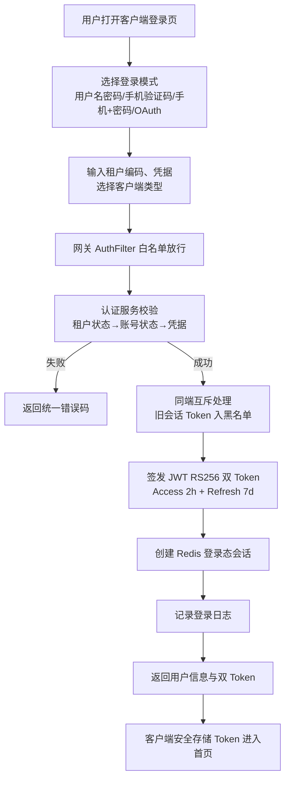

### 5.2 注册流程图（含两步注册）
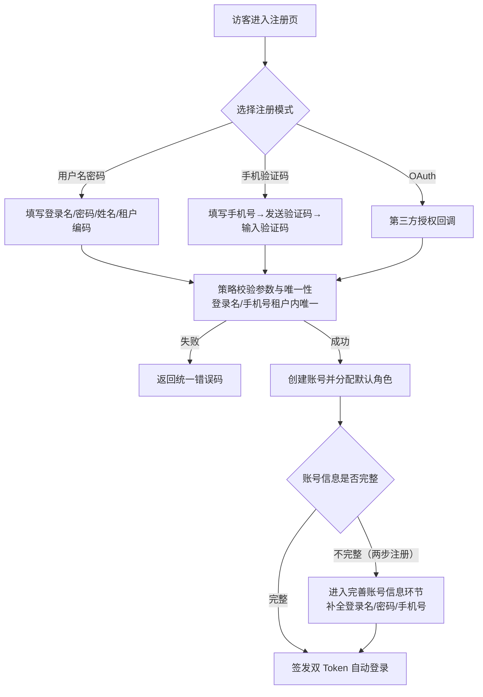

### 5.3 网关认证流程图（9 步校验）
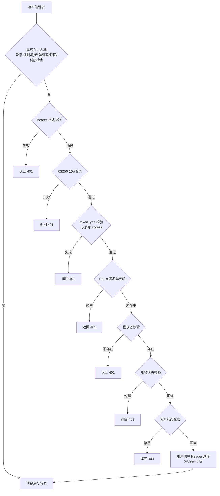

### 5.4 Token 刷新流程图
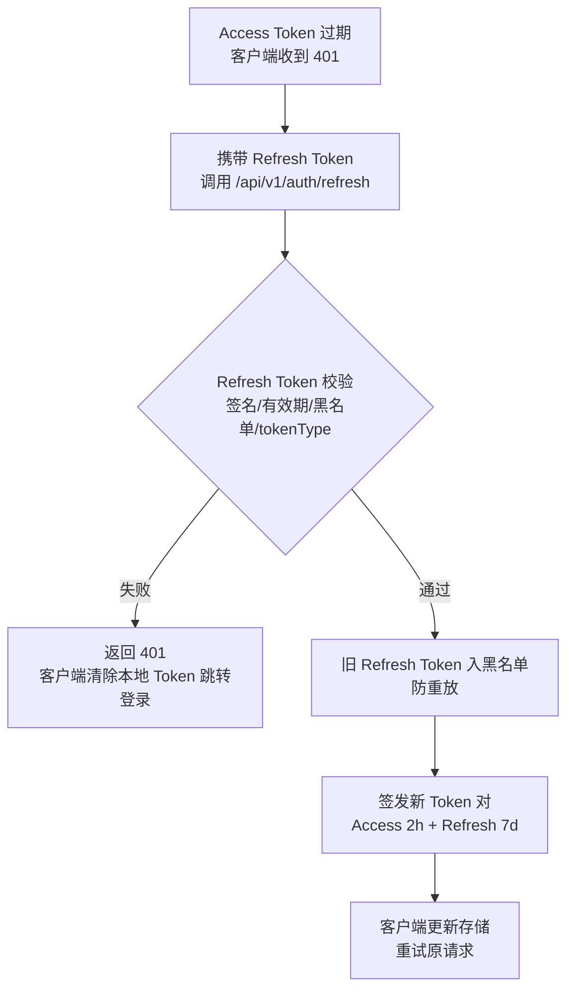

## 6. 数据需求
（说明功能涉及的数据实体与数据项。认证库 cloudstroll_office_auth 共 9 张表；biz/system 库仅建库预留。）

| 数据实体 | 表名 | 关键数据项 | 关联功能 |
| --- | --- | --- | --- |
| 租户 | t_auth_tenant | 租户编码、租户名称、状态、有效期 | F-010 |
| 用户 | t_auth_user | 登录名、密码（BCrypt）、姓名、手机号、邮箱、租户编码、状态、register_mode、account_settled、phone_verified、email_verified、last_password_change_time | F-001/F-002/F-011 |
| 角色 | t_auth_role | 角色编码（租户内唯一）、角色名称、租户编码 | F-012 |
| 权限 | t_auth_permission | 权限编码、权限名称、父权限（树形）、类型 | F-013 |
| 用户-角色关联 | t_auth_user_role | 用户 ID、角色 ID（多对多） | F-009/F-011 |
| 角色-权限关联 | t_auth_role_permission | 角色 ID、权限 ID（多对多） | F-009/F-012 |
| 登录日志 | t_auth_login_log | 用户、租户、IP、客户端类型、登录模式、结果、失败原因、时间 | F-014 |
| OAuth 账号关联 | t_auth_oauth_account | 用户 ID、OAuth 提供商、openId、unionId | F-001/F-002 |
| 验证码记录 | t_auth_verification_code | 目标（手机号/邮箱）、验证码、用途、发送时间、过期时间、使用状态 | F-008 |

Redis 缓存数据（非关系型）：登录态会话（userId+clientType）、Token 黑名单（Token 签名）、账号状态缓存、租户状态缓存、验证码临时缓存。

初始数据：默认租户 DEFAULT、超级管理员角色 SUPER_ADMIN、管理员账号 admin（admin123，部署后应立即修改）、基础权限数据。

## 7. 验收标准
（本版本整体验收标准，与用户故事验收标准呼应。）
1. 注册能力：5 种注册策略均可完成注册；登录名/手机号租户内唯一性校验生效；两步注册（先注册后补全）流程可完整走通；注册成功后自动登录并返回双 Token。
2. 登录能力：4 种登录策略均可完成登录；6 种客户端类型同端互斥、多端共存策略正确；登录失败返回统一错误码且不泄露敏感信息。
3. Token 与会话：Access Token 2h/Refresh Token 7d 有效期正确；刷新后旧 Refresh Token 入黑名单防重放；登出幂等；管理员强制踢人（指定端/所有端）实时生效；密码修改/找回后全端下线。
4. 网关认证：非白名单请求必须携带合法 Bearer Token 才能访问；9 步校验各失败场景返回统一 401/403；用户信息 Header 正确透传至下游。
5. 密码与手机号：修改密码校验旧密码与密码策略；忘记密码（短信/邮箱）全流程可走通；手机号变更（原手机可用短信验证/停用邮箱验证）成功更新。
6. 验证码：生成/发送/校验/频率控制（60 秒）/有效期（5 分钟）/一次性失效全部正确；模拟模式开发可用、真实模式配置可切换。
7. 管理能力：用户/角色/权限 CRUD、用户封禁解封实时生效、角色分配权限、用户分配角色全部可用；租户间数据隔离生效。
8. 审计与运维：登录日志完整记录成功/失败事件；三个健康检查端点正常返回；Swagger UI 可在线访问与调试。
9. 客户端：Flutter Web 与 Windows 双平台可构建运行；登录/注册/忘记密码页面可完成对应流程；Token 安全存储；网关地址可配置。
10. 质量指标：单元测试全量通过（认证服务 200+ 用例）；Docker Compose 一键编排 8 个容器部署成功。

## 8. 用户故事（User Stories）

### US-001：新用户注册并首次登录
#### 故事描述
作为（访客/新员工），我想要（注册账号并自动登录），以便（快速开始使用系统）。
#### 前置条件
系统已部署并存在默认租户（DEFAULT）；验证码通道可用（模拟或真实）。
#### 验收标准
- [ ] Given 访客进入注册页，When 选择用户名密码模式并填写合法信息（登录名唯一、密码 8-64），Then 注册成功并自动登录返回双 Token
- [ ] Given 访客选择手机验证码注册，When 填写手机号并输入正确验证码，Then 注册成功并自动登录
- [ ] Given 访客选择 OAuth 注册，When 授权回调成功，Then 创建账号并进入完善账号信息环节
- [ ] Given 注册时登录名/手机号在租户内已存在，When 提交注册，Then 返回唯一性冲突错误
- [ ] Given 两步注册用户信息不完整，When 首次登录，Then 提示补全登录名/密码/手机号
#### 边界情况与错误处理
| 场景 | 预期处理 |
| --- | --- |
| 租户编码不存在 | 返回租户错误码，注册失败 |
| 密码长度不足 8 或超过 64 | 返回参数校验错误 |
| 手机验证码错误/过期 | 返回验证码错误码，需重新获取 |
| 验证码发送过于频繁（60 秒内） | 返回频率限制错误码 |
#### 关联功能编号
F-001、F-008

### US-002：多模式登录与多端会话
#### 故事描述
作为（终端用户），我想要（用 4 种模式中的任意一种登录并多端保持会话），以便（按使用习惯快速进入系统并在多设备间无缝切换）。
#### 前置条件
用户已有有效账号。
#### 验收标准
- [ ] Given 用户使用用户名密码，When 凭据正确且账号/租户正常，Then 登录成功返回双 Token
- [ ] Given 用户使用手机验证码/手机+密码/OAuth，When 凭据校验通过，Then 登录成功
- [ ] Given 用户在 H5 已登录，When 同一客户端类型（H5）再次登录，Then 旧会话被踢下线（同端互斥）
- [ ] Given 用户在 H5 已登录，When Windows 客户端登录，Then 两端会话共存（多端共存）
- [ ] Given 账号被管理员封禁，When 尝试登录，Then 返回账号状态错误，禁止登录
#### 边界情况与错误处理
| 场景 | 预期处理 |
| --- | --- |
| 密码错误 | 统一提示凭据错误，记录失败日志 |
| 验证码错误 | 返回验证码错误码 |
| 租户停用 | 返回租户状态错误 |
| OAuth 授权失败/回调无效 | 返回 OAuth 错误码 |
#### 关联功能编号
F-002、F-003、F-004、F-010

### US-003：会话安全控制（登出/强制踢人/全端下线）
#### 故事描述
作为（用户/管理员），我想要（主动登出、强制踢人、密码重置后全端下线），以便（实时控制登录态，保障账号安全）。
#### 前置条件
用户已登录；管理员已登录并拥有管理权限。
#### 验收标准
- [ ] Given 登录用户点击登出，When 调用登出接口，Then Token 入黑名单、会话清除，重复登出不报错
- [ ] Given 管理员对指定用户执行强制踢人并指定客户端类型，When 该用户该端发起请求，Then 立即返回 401
- [ ] Given 管理员对指定用户执行强制踢人（所有端），When 该用户任意端发起请求，Then 全部失效
- [ ] Given 用户修改密码或找回密码成功，When 该用户任意端发起请求，Then 全部登录态失效需重新登录
#### 边界情况与错误处理
| 场景 | 预期处理 |
| --- | --- |
| 踢人时用户已离线 | 返回成功（幂等），不报错 |
| 登出时 Token 已过期 | 返回成功（幂等） |
| 非管理员调用踢人 | 返回 403 无权限 |
#### 关联功能编号
F-003、F-004、F-005

### US-004：密码管理与手机号变更
#### 故事描述
作为（终端用户），我想要（修改密码、忘记密码找回、更换手机号），以便（账号安全可控且联系方式保持有效）。
#### 前置条件
用户已登录（修改密码/手机号变更）；访客可执行忘记密码。
#### 验收标准
- [ ] Given 登录用户提交正确旧密码与合法新密码，When 提交修改，Then 修改成功并清除所有登录态
- [ ] Given 登录用户提交错误旧密码，When 提交修改，Then 返回旧密码错误
- [ ] Given 访客输入注册手机号并获取重置验证码，When 输入验证码与新密码提交，Then 密码重置成功并清除所有登录态
- [ ] Given 用户原手机可用，When 通过原手机验证码提交新手机号，Then 手机号变更成功
- [ ] Given 用户原手机停用，When 通过邮箱验证码提交新手机号，Then 手机号变更成功
#### 边界情况与错误处理
| 场景 | 预期处理 |
| --- | --- |
| 新密码与旧密码相同 | 返回密码未变更错误 |
| 重置验证码过期 | 返回验证码过期错误，需重新发送 |
| 新手机号已被租户内其他用户使用 | 返回手机号唯一性冲突错误 |
| 邮箱验证码目标与账号不匹配 | 返回验证码错误 |
#### 关联功能编号
F-006、F-007、F-008

### US-005：RBAC 权限管理与租户隔离
#### 故事描述
作为（系统管理员/租户管理员），我想要（管理用户、角色、权限并保证租户隔离），以便（精细化控制企业内人员权限且互不越权）。
#### 前置条件
管理员已登录；存在默认租户与基础权限数据。
#### 验收标准
- [ ] Given 管理员查看用户列表，When 分页查询，Then 返回当前租户内用户分页数据
- [ ] Given 管理员创建用户/角色/权限，When 提交，Then 数据创建成功且编码租户内唯一
- [ ] Given 管理员为用户分配角色、为角色分配权限，When 提交，Then 关联关系生效
- [ ] Given 管理员封禁用户，When 该用户登录或访问，Then 立即被拒绝
- [ ] Given 租户 A 管理员，When 查询数据，Then 只能看到租户 A 的数据，租户 B 数据不可见
#### 边界情况与错误处理
| 场景 | 预期处理 |
| --- | --- |
| 角色编码在租户内重复 | 返回唯一性冲突错误 |
| 删除被引用的角色/权限 | 提示存在关联需先解除 |
| 管理员操作其他租户用户 | 数据不可见/返回 403 |
#### 关联功能编号
F-009、F-010、F-011、F-012、F-013

### US-006：网关统一认证与健康检查
#### 故事描述
作为（运维人员/第三方系统），我想要（统一网关认证与健康检查），以便（保障 API 安全并快速确认服务可用性）。
#### 前置条件
网关、各微服务、Nacos、Redis 已启动并注册。
#### 验收标准
- [ ] Given 无 Token 请求非白名单接口，When 发起请求，Then 返回统一 401
- [ ] Given 携带合法 Access Token，When 请求业务接口，Then 通过认证并透传用户 Header
- [ ] Given Token 在黑名单/登录态失效/账号封禁/租户停用，When 发起请求，Then 返回对应 401/403
- [ ] Given 运维调用三个健康检查端点，When 发起请求，Then 返回服务名/状态/版本/时间戳
- [ ] Given 访问 Swagger UI，When 打开文档，Then 可按模块查看并在线调试接口
#### 边界情况与错误处理
| 场景 | 预期处理 |
| --- | --- |
| 白名单接口带错误 Token | 白名单直接放行，不做校验 |
| 服务未注册到 Nacos | 网关路由 503/无法转发 |
| Token 格式非 Bearer | 返回 401 |
#### 关联功能编号
F-005、F-016、F-017、F-018

### US-007：客户端认证页面
#### 故事描述
作为（终端用户），我想要（在 Flutter Web/Windows 客户端完成登录、注册、忘记密码），以便（跨平台一致地使用认证服务）。
#### 前置条件
客户端已构建，可访问网关地址。
#### 验收标准
- [ ] Given 客户端启动，When 打开应用，Then 展示登录页并可切换登录模式
- [ ] Given 用户填写合法注册信息，When 提交，Then 注册成功并自动登录进入首页
- [ ] Given 用户点击忘记密码，When 完成验证码重置，Then 可重新登录
- [ ] Given 登录成功后，When 重启应用，Then 通过安全存储恢复登录态
- [ ] Given Access Token 过期，When 继续操作，Then 自动刷新 Token 并重试原请求
#### 边界情况与错误处理
| 场景 | 预期处理 |
| --- | --- |
| 网关地址不可达 | 显示网络错误提示 |
| 刷新 Token 也过期 | 清除本地 Token 并跳转登录页 |
| 表单校验不通过 | 本地提示错误，不发起请求 |
#### 关联功能编号
F-015、F-003

### US-008：验证码管理
#### 故事描述
作为（访客/终端用户），我想要（发送并输入验证码完成注册/登录/找回/换绑），以便（安全快捷地完成认证操作）。
#### 前置条件
验证码配置可用（模拟或真实通道）。
#### 验收标准
- [ ] Given 用户点击发送验证码，When 距上次发送超过 60 秒，Then 发送成功并开始倒计时
- [ ] Given 用户 60 秒内重复点击发送，When 发起请求，Then 返回频率限制错误
- [ ] Given 用户输入错误验证码，When 校验，Then 返回验证码错误
- [ ] Given 用户输入正确验证码，When 校验，Then 校验通过且该验证码立即失效（一次性）
- [ ] Given 验证码超过 5 分钟，When 使用，Then 返回过期错误
#### 边界情况与错误处理
| 场景 | 预期处理 |
| --- | --- |
| 模拟模式下发送 | 返回固定验证码，方便联调 |
| 验证码用途不匹配 | 返回验证码错误 |
| 目标格式非法 | 返回参数校验错误 |
#### 关联功能编号
F-008

## 9. 版本规划
| 版本号 | 计划内容 | 状态 |
| --- | --- | --- |
| v0.0.1 | 初始化基线版本（反推存量代码 v0.1.6 能力）：统一认证授权底座，含 5 种注册策略/4 种登录策略/两步注册、JWT RS256 双 Token 轮换、Redis 会话管理、网关 9 步认证、密码管理、手机号变更、验证码管理、RBAC 多租户权限、用户/角色/权限管理、登录日志、健康检查、API 文档、Flutter 客户端认证页面、企业/系统服务骨架 | 规划中（初始化基线） |
| v0.1.0 | 基础功能：企业/部门/员工 CRUD、系统配置管理、消息通知 | 规划中 |
| v0.2.0 | 核心业务：工作流审批、考勤管理、云资源管理 | 规划中 |
| v0.3.0 | 高级功能：薪酬管理、报表统计、审计日志、定时任务 | 规划中 |

## 10. 附录

### 术语表
| 术语 | 说明 |
| --- | --- |
| RBAC | 基于角色的访问控制（Role-Based Access Control），用户-角色-权限三层关联模型 |
| JWT | JSON Web Token，本系统使用 RS256 非对称签名算法 |
| RS256 | RSA 签名 SHA-256 摘要的非对称签名算法，私钥签名、公钥验签 |
| Access Token | 访问令牌，有效期 2 小时，用于访问受保护 API |
| Refresh Token | 刷新令牌，有效期 7 天，用于换取新的 Token 对 |
| Token 轮换 | 刷新成功后旧 Refresh Token 立即失效（入黑名单）的机制，防重放 |
| 同端互斥 | 同一客户端类型仅保留最新登录会话，旧会话自动失效 |
| 多端共存 | 不同客户端类型可同时在线 |
| 白名单 | 无需认证即可访问的公开端点（登录/注册/刷新/验证码/找回/健康检查） |
| OAuth | 第三方授权登录协议（微信等），本版本提供 OAuthProvider 枚举与关联表 |
| 两步注册 | 先注册（OAuth/手机号）后补全账号信息（登录名/密码/手机号）的注册机制 |
| 租户 | 多租户 SaaS 场景下独立的数据空间（企业），租户间数据隔离 |
| 封禁/解封 | 管理员对用户账号状态的管理操作，封禁后登录与访问立即失效 |
| 网关 AuthFilter | Spring Cloud Gateway 全局认证过滤器，执行 9 步校验 |
| Flutter | Google 跨平台 UI 框架，本系统客户端采用 Flutter（Web + Windows） |

### 参考文档
- 《用户需求说明书（URS）》docs/cso-urs.md（19 条功能需求 FR-001~FR-019、6 类用户角色、6 个业务场景、12 条非功能需求）
- 《项目主文档》docs/project.md
- README.md（项目功能特性、API 接口列表、模块说明、版本规划）
- 数据库设计文档（DBD，后续步骤生成）

---

# 版本 v0.2.5：部署资产集中化（2026-08-09）

**版本号**：v0.2.5
**日期**：2026-08-09
**编写人**：BA

## 1. 产品背景
### 1.1 项目背景
云漫智企（CloudStrollOffice）为 Maven 多模块微服务架构（common、gateway、auth-service、biz-service、system-service）与 Flutter 多端客户端（cloudoffice-flutter-app，支持 Web 与 Windows）组成的微服务企业办公套件。当前版本的最终构建产物（后端 jar 包、客户端安装文件/exe 等）分散在各模块输出目录（如各模块 target 目录），环境配置（env.json、env.example.json）与部署运维脚本（scripts 下的 .sh/.ps1）位于项目根目录及根目录 scripts 目录中，发布、打包、交付人员需要多处查找产物与部署资产，目录结构不够集中清晰。

### 1.2 产品目标
- **G1 产物集中化**：建立统一的 `deploy` 目录，作为所有模块最终构建产物的唯一落盘位置，后端微服务 jar 包、客户端安装文件/exe 均输出到该目录。
- **G2 部署资产集中化**：将环境配置（env.json、env.example.json）与部署运维脚本（scripts 下全部 .sh/.ps1）统一收拢至 `deploy` 目录，实现"运行/部署相关资产集中在 deploy，源代码与构建配置保留在根目录及模块目录"的清晰划分。
- **G3 目录纯净性**：构建阶段的中间产物（编译临时文件、测试产物、过程文件等）不得进入 `deploy` 目录，确保该目录只包含可直接交付/运行的最终产物。

### 1.3 核心设计理念
- **唯一落盘**：`deploy` 目录是最终产物的唯一出口，杜绝产物分散。
- **纯净交付**：中间产物与最终产物严格隔离，交付人员打开 `deploy` 即可收集全部可交付资产。
- **迁移无损**：环境配置与部署脚本迁移后，原有部署运维流程功能不受影响，路径引用完整可用。

## 2. 目标用户
| 用户角色 | 使用场景 | 核心诉求 |
| --- | --- | --- |
| 后端开发工程师 | 对 Maven 多模块（auth-service、biz-service、system-service、gateway）执行编译打包 | 执行构建后，在 deploy 目录统一获取各服务最终 jar 包，无需在各模块 target 目录中查找 |
| 客户端开发工程师 | 构建 Flutter 客户端（Web/Windows） | 构建完成后，在 deploy 目录获取安装文件/exe 等最终产物 |
| 运维/部署工程师 | 环境配置管理、数据库初始化、RSA 密钥生成、服务启停 | 在 deploy 目录统一使用 env.json/env.example.json 与 deploy/scripts 下的 .sh/.ps1 脚本完成部署运维 |
| 发布/交付人员 | 整理并交付版本产物 | 直接从 deploy 目录收集全部最终产物，不受中间产物干扰 |

## 3. 功能清单
| 功能编号 | 功能名称 | 所属模块 | 优先级 | 版本范围 |
| --- | --- | --- | --- | --- |
| F-001 | 新建 deploy 目录 | 项目根目录结构 | 高 | v0.2.5 |
| F-002 | 后端 jar 产物输出到 deploy | 构建配置（Maven 各模块） | 高 | v0.2.5 |
| F-003 | 客户端安装产物输出到 deploy | 构建配置（Flutter 客户端） | 高 | v0.2.5 |
| F-004 | 中间产物不入 deploy | 构建配置（Maven/Flutter） | 高 | v0.2.5 |
| F-005 | env.json 与 env.example.json 迁移 | 环境配置 | 高 | v0.2.5 |
| F-006 | deploy/scripts 子目录建立 | 项目根目录结构 | 高 | v0.2.5 |
| F-007 | scripts 下 sh/ps1 脚本迁移 | 部署运维脚本 | 高 | v0.2.5 |

## 4. 详细功能描述
### 4.1 新建 deploy 目录
#### 功能描述
在项目根目录新建 `deploy` 目录，作为最终构建产物、环境配置与部署脚本的统一存放位置。目录创建后，`deploy` 下应包含后续步骤产生的环境配置文件与 `scripts` 子目录。
#### 业务规则
- `deploy` 目录位于项目根目录下，与 `src`（后端多模块根）、`cloudoffice-flutter-app`（客户端目录）、`scripts`、`docs` 等平级。
- `deploy` 目录只存放最终产物、环境配置与部署脚本，不得存放任何源代码与中间产物。
- 目录命名固定为小写 `deploy`。
#### 页面原型说明（或原型图位置）
无页面原型，属于工程目录结构调整。

### 4.2 后端 jar 产物输出到 deploy
#### 功能描述
修改 Maven 多模块（auth-service、biz-service、system-service、gateway）构建配置（pom.xml 或构建插件配置），使 `mvn package` 生成的最终可执行 jar 包统一输出到 `deploy` 目录。
#### 业务规则
- 四个后端模块的最终 jar 包均落盘至 `deploy` 目录。
- 各服务 jar 命名规则保持模块化可辨识（如 `*-auth-service.jar`、`*-biz-service.jar`、`*-system-service.jar`、`*-gateway.jar` 或保持原 artifactId 命名），避免同名覆盖。
- 生成方式可采用构建插件（如 maven-antrun-plugin、copy 插件等）在 package 阶段将最终 jar 复制/输出至 `deploy`，或直接配置构建输出目录；实现方式由编码阶段确定，但结果必须满足最终产物落位 `deploy`。
#### 页面原型说明（或原型图位置）
无页面原型，属于构建配置调整。

### 4.3 客户端安装产物输出到 deploy
#### 功能描述
修改 Flutter 客户端构建配置，使客户端构建生成的安装文件/exe 等最终产物（如 Windows 安装程序 exe、Web 部署包等）输出到 `deploy` 目录。
#### 业务规则
- 客户端构建成功后，最终可交付产物（安装文件/exe 等）必须出现在 `deploy` 目录。
- 若构建工具链默认输出到构建临时目录，则通过构建脚本/配置将最终产物复制到 `deploy`，中间构建过程文件不得随之进入。
#### 页面原型说明（或原型图位置）
无页面原型，属于构建配置调整。

### 4.4 中间产物不入 deploy
#### 功能描述
确保构建阶段产生的中间产物（如 Maven 各模块 target 目录、编译临时文件、测试产物、Flutter 构建缓存/过程文件等）不会进入 `deploy` 目录。
#### 业务规则
- `deploy` 目录内禁止出现 target 类中间目录、编译临时文件、测试报告等中间产物。
- 只允许最终产物（jar 包、安装文件/exe、环境配置、部署脚本）进入 `deploy` 目录。
- 若通过复制方式生成产物，复制动作必须仅针对最终产物文件，严禁整目录递归复制构建输出目录。
#### 页面原型说明（或原型图位置）
无页面原型，属于构建配置约束。

### 4.5 env.json 与 env.example.json 迁移
#### 功能描述
将项目根目录下的 `env.json` 与 `env.example.json` 迁移到 `deploy` 目录，并确保相关部署脚本仍能正确引用这两个文件。
#### 业务规则
- 迁移后文件位于 `deploy/env.json`、`deploy/env.example.json`。
- 项目根目录下不再保留这两个文件（或保留方式由编码阶段确认，但默认应完成迁移，根目录不残留）。
- 依赖这两个文件的部署脚本（迁移后的 deploy/scripts 下脚本）中的路径引用必须同步更新为 `deploy` 目录下的新路径，保证 env 加载功能可用。
#### 页面原型说明（或原型图位置）
无页面原型，属于配置文件迁移。

### 4.6 deploy/scripts 子目录建立
#### 功能描述
在 `deploy` 目录下新建 `scripts` 子目录，用于存放迁移后的部署运维脚本。
#### 业务规则
- 目录结构为 `deploy/scripts`。
- 该子目录只存放部署运维脚本（.sh/.ps1），不存放 sql、docker、API-TEST 等非脚本内容。
#### 页面原型说明（或原型图位置）
无页面原型，属于目录结构调整。

### 4.7 scripts 下 sh/ps1 脚本迁移
#### 功能描述
将项目根目录 `scripts` 目录下的全部 `.sh` 与 `.ps1` 文件迁移至 `deploy/scripts` 子目录，并同步调整脚本内部引用的路径，确保迁移后脚本可正常执行。
#### 业务规则
- 迁移范围：根目录 `scripts` 下的全部 `.sh` 与 `.ps1` 文件（如 deploy-check-env、deploy-db-init、deploy-env、deploy-rsa-keygen、deploy-start-auth/biz/gateway/system/services、load-env 等对应的 sh/ps1 脚本）。
- 非 .sh/.ps1 内容（如 scripts/docker、scripts/sql、scripts/API-TEST、deployment-guide.md 等）不在本次迁移范围内，不得随迁移移动。
- 脚本内部引用的相对/绝对路径（如 env.json、密钥文件 keys 目录、jar 包路径等）须随目录变化同步调整，保证脚本功能与迁移前一致。
- 迁移后根目录 `scripts` 下不再保留已迁移的 .sh/.ps1 文件。
#### 页面原型说明（或原型图位置）
无页面原型，属于脚本迁移与路径适配。

## 5. 业务流程图
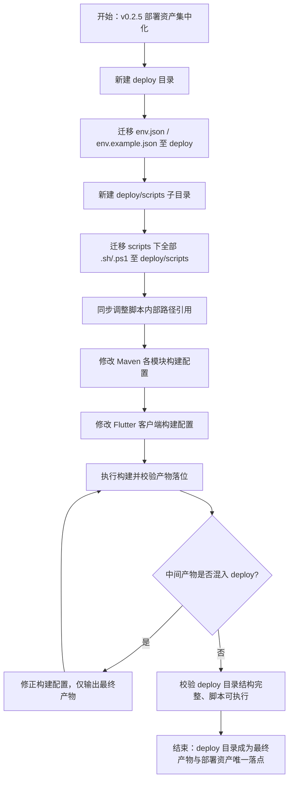

## 6. 数据需求
本版本不涉及业务数据实体变更，涉及以下工程资产项：
| 资产项 | 迁移前位置 | 迁移/输出后位置 | 说明 |
| --- | --- | --- | --- |
| env.json | 项目根目录 | deploy/env.json | 实际环境配置 |
| env.example.json | 项目根目录 | deploy/env.example.json | 环境配置模板 |
| .sh/.ps1 部署脚本 | scripts/ | deploy/scripts/ | 全部 sh/ps1 迁移，脚本内部路径同步适配 |
| 后端最终 jar 包 | 各模块 target/ | deploy/ | auth-service、biz-service、system-service、gateway 最终可执行包 |
| 客户端安装产物 | 客户端构建输出目录 | deploy/ | 安装文件/exe 等最终可交付产物 |
| 构建中间产物 | 各模块 target/、客户端构建临时目录 | 不进入 deploy | 编译临时文件、测试产物、过程文件等 |

## 7. 验收标准
- **AC-1**：项目根目录存在 `deploy` 目录，且 `deploy` 目录下包含 `env.json`、`env.example.json` 与 `scripts` 子目录。
- **AC-2**：执行 Maven 各模块 `package` 后，auth-service、biz-service、system-service、gateway 的最终 jar 包出现在 `deploy` 目录。
- **AC-3**：执行 Flutter 客户端构建后，安装文件/exe 等最终产物出现在 `deploy` 目录。
- **AC-4**：构建完成后，`deploy` 目录内不出现 target 类中间目录、编译临时文件、测试产物等中间产物。
- **AC-5**：项目根目录不再保留 `env.json`、`env.example.json`；两文件已在 `deploy` 目录中。
- **AC-6**：根目录 `scripts` 下的全部 .sh/.ps1 文件已迁移至 `deploy/scripts`，根目录 `scripts` 下不再保留已迁移的 .sh/.ps1 文件；scripts 下非 sh/ps1 内容（docker、sql、API-TEST 等）未被迁移。
- **AC-7**：迁移后 `deploy/scripts` 下的脚本可正常执行，脚本内 env.json 等路径引用已同步更新，部署运维功能不受影响。

## 8. 用户故事（User Stories）
### US-001：建立统一的部署资产目录
#### 故事描述
作为发布/交付人员，我想要项目根目录下有一个统一的 deploy 目录集中存放最终产物与部署资产，以便一次性收集全部可交付内容，无需在多个目录间查找。
#### 前置条件
项目已具备多模块构建能力与现有 scripts/env 资产。
#### 验收标准
- [ ] Given 项目根目录，When 版本 v0.2.5 落地，Then 根目录存在 deploy 目录
- [ ] Given deploy 目录，When 查看目录内容，Then 包含 env.json、env.example.json 与 scripts 子目录
- [ ] Given 构建完成后，When 检查 deploy 目录，Then 不出现任何中间产物
#### 边界情况与错误处理
| 场景 | 预期处理 |
| --- | --- |
| deploy 目录已存在 | 复用现有目录，不重复创建、不覆盖已有有效内容 |
| 构建失败 | 不产生最终产物，deploy 目录不落盘失败产物 |
#### 关联功能编号
F-001、F-004

### US-002：最终构建产物统一输出到 deploy
#### 故事描述
作为后端/客户端开发工程师，我想要构建后的最终产物（jar 包、安装文件/exe）自动输出到 deploy 目录，以便在统一位置获取可交付产物。
#### 前置条件
Maven 多模块构建配置与 Flutter 客户端构建配置可正常执行构建。
#### 验收标准
- [ ] Given 执行 Maven 各模块 package，When 构建成功，Then 四个后端服务的最终 jar 包出现在 deploy 目录
- [ ] Given 执行 Flutter 客户端构建，When 构建成功，Then 安装文件/exe 等最终产物出现在 deploy 目录
- [ ] Given 构建完成，When 检查 deploy 目录，Then 无中间产物混入（target 类目录、编译临时文件、测试产物均不在其中）
#### 边界情况与错误处理
| 场景 | 预期处理 |
| --- | --- |
| 同名 jar 产物 | 产物命名保持模块可辨识，不发生覆盖 |
| 中间产物误复制 | 构建配置仅复制最终产物文件，不整目录递归复制 |
#### 关联功能编号
F-002、F-003、F-004

### US-003：环境配置与部署脚本统一迁移到 deploy
#### 故事描述
作为运维/部署工程师，我想要 env.json/env.example.json 与全部 .sh/.ps1 脚本统一位于 deploy 目录下，以便在单一位置完成环境配置与部署运维操作。
#### 前置条件
现有 env.json、env.example.json 与 scripts 下 .sh/.ps1 脚本可正常工作。
#### 验收标准
- [ ] Given 迁移执行后，When 检查根目录，Then env.json、env.example.json 不再位于项目根目录，而位于 deploy 目录
- [ ] Given 迁移执行后，When 检查根目录 scripts 与 deploy/scripts，Then 全部 .sh/.ps1 已迁移至 deploy/scripts，根目录 scripts 下不再保留
- [ ] Given 迁移执行后，When 检查 scripts 非脚本内容，Then docker、sql、API-TEST、部署指南等未被移动
- [ ] Given 迁移执行后，When 执行部署脚本，Then 脚本可正常运行，env.json 加载正常
#### 边界情况与错误处理
| 场景 | 预期处理 |
| --- | --- |
| 脚本内路径引用旧位置 | 同步更新为 deploy 下新路径，脚本功能不受影响 |
| scripts 下存在非 sh/ps1 文件 | 保持原位置不迁移 |
#### 关联功能编号
F-005、F-006、F-007

## 9. 版本规划
| 版本号 | 计划内容 | 状态 |
| --- | --- | --- |
| v0.2.5 | 新建 deploy 目录；后端 jar/客户端安装产物统一输出到 deploy；env.json 与 env.example.json 迁移；deploy/scripts 子目录建立；scripts 下全部 sh/ps1 迁移并适配路径 | 需求分析中 |
| v0.2.4 | 上一版本已交付功能（如适用） | 已交付 |

## 10. 附录
### 术语表
| 术语 | 说明 |
| --- | --- |
| deploy 目录 | 项目根目录下统一的最终产物、环境配置与部署脚本存放目录 |
| 最终产物 | 可直接交付/运行的构建结果，如 jar 包、安装文件/exe |
| 中间产物 | 构建过程中的临时文件、测试产物、编译缓存等，禁止进入 deploy |
| env.json / env.example.json | 项目环境配置实际文件与模板文件 |
| deploy/scripts | deploy 目录下的部署运维脚本子目录，存放全部 .sh/.ps1 |
### 参考文档
- 用户需求说明书（URS）v0.2.5：docs/cso-v0.2.5/cso-urs-v0.2.5.md
- 用户需求说明书（URS）主文档：docs/cso-urs.md

---

# 版本 v0.2.6：服务启动修复与 API 回归闭环（2026-08-09）

**版本号**：v0.2.6
**日期**：2026-08-09
**编写人**：BA

## 1. 产品背景
### 1.1 项目背景
云漫智企（CloudStrollOffice）是基于 Java 21 + Spring Boot 3.2.5 + Spring Cloud 2023.0.1 的微服务企业办公套件，由 gateway（9000）、auth-service（9100）、biz-service（9200）、system-service（9400）4 个业务服务及 Nacos/MariaDB/Redis 基础设施构成。v0.2.5 回归测试（docs/cso-v0.2.5/regression-api-test.md）发现：4 个业务服务均无法启动，v0.0.1 基线接口回归（TC-001~045）持续处于"环境阻塞"状态，API 测试链路无法跑通。

经根因分析确认两项配置/依赖缺陷（v0.0.1 基线遗留，审核项 T-02）：
1. **bootstrap 依赖缺失**：全项目 pom 均未引入 `spring-cloud-starter-bootstrap`，Spring Boot 3.x 下 bootstrap.yml 默认不加载，auth/biz/system 启动报 `No spring.config.import property has been defined`，Nacos 配置引导链路断裂；
2. **RSA 密钥格式契约不匹配**：deploy/env.json 的 `RSA_PUBLIC_KEY`/`RSA_PRIVATE_KEY` 为 PEM 文件整体 Base64（多行、含 BEGIN/END 标记），而 Java 端 RsaKeyConfig 使用严格 `Base64.getDecoder()` + `X509EncodedKeySpec`（期望 DER 编码单行 Base64），网关启动即报 `RSA 公钥解析失败`。

本版本（v0.2.6）聚焦修复上述部署与配置缺陷，使 4 个服务全部正常启动，并完成 v0.0.1 基线接口动态回归闭环，确保 API 测试全部跑通。

### 1.2 产品目标
- **G-1**：4 个业务服务（gateway/auth/biz/system）在标准部署流程下全部成功启动，健康检查通过率 100%。
- **G-2**：v0.0.1 基线接口回归脚本（cso-api-test-v0.0.1.py，TC-001~045）全部动态执行通过，通过率 100%（PASS=45、FAIL=0）。
- **G-3**：v0.2.5 接口回归脚本（cso-api-test-v0.2.5.py，TC-046~051）保持通过，既有接口契约（API-001~API-033）不受影响（PASS=26、FAIL=0）。

### 1.3 核心设计理念
- **最小修复、契约不变**：仅修复依赖配置、密钥格式契约与服务启动链路，不扩展任何新业务功能，不改变对外接口契约（API-001~API-033）与客户端运行时代码。
- **契约统一、配置无歧义**：RSA 密钥的生成脚本（deploy-rsa-keygen.ps1）与 Java 端解码逻辑保持同一格式契约（DER 单行 Base64），env.json 注入即用，消除配置歧义。
- **验证闭环、以测代证**：修复后必须通过健康检查 + 全量接口回归（TC-001~051）双重验证，以自动化脚本执行结果作为验收依据。

## 2. 目标用户
| 用户角色 | 使用场景 | 核心诉求 |
| --- | --- | --- |
| 运维/部署人员 | 按部署文档准备密钥与环境变量、构建 jar、启动并验证服务健康 | 4 个服务一键启动成功、健康检查通过、密钥格式无歧义 |
| 测试工程师（TE） | 补跑 v0.0.1 基线接口回归（TC-001~045）及 v0.2.5 接口回归（TC-046~051） | 服务可用，脚本全部动态执行通过，回归报告闭环 |
| 企业用户（最终用户） | 通过 Web/Windows 客户端使用办公套件业务功能 | 登录认证、业务操作不受影响，服务持续可用 |

## 3. 功能清单
| 功能编号 | 功能名称 | 所属模块 | 优先级 | 版本范围 |
| --- | --- | --- | --- | --- |
| F-001 | 引入 bootstrap 配置引导依赖 | gateway/auth/biz/system（构建配置） | 高 | v0.2.6 |
| F-002 | 修复 RSA 密钥格式契约 | deploy（密钥生成脚本）/gateway/auth（密钥解析） | 高 | v0.2.6 |
| F-003 | 服务启动与健康检查验证 | gateway/auth/biz/system（部署链路） | 高 | v0.2.6 |
| F-004 | v0.0.1 基线接口回归闭环 | scripts/API-TEST（测试资产） | 高 | v0.2.6 |
| F-005 | 既有接口契约无回归保障 | 全项目（接口层） | 中 | v0.2.6 |

## 4. 详细功能描述
### 4.1 F-001 引入 bootstrap 配置引导依赖
#### 功能描述
在根 pom（dependencyManagement）或各服务模块 pom 引入 `spring-cloud-starter-bootstrap`，恢复 bootstrap.yml（含 nacos discovery/config server-addr）在 Spring Boot 3.x 下的加载机制，打通 Nacos 配置引导链路，消除 auth/biz/system 启动报错 `No spring.config.import property has been defined`。
#### 业务规则
- 引入方式二选一（须保证最终效果一致）：
  - 方案 A：各服务模块（gateway/auth/biz/system）pom 添加 `spring-cloud-starter-bootstrap` 依赖；
  - 方案 B：根 pom 统一声明依赖并在各模块引入，或改用 `spring.config.import=optional:nacos:` 并关闭 import-check；
- 引入后 bootstrap.yml 必须重新生效：Nacos 的 `spring.cloud.nacos.discovery.server-addr` 与 `spring.cloud.nacos.config.server-addr` 能被加载；
- 不得改变既有接口契约与业务代码逻辑，仅允许构建/依赖配置变更。
#### 页面原型说明（或原型图位置）
无页面原型（纯后端构建/依赖配置修复）。

### 4.2 F-002 修复 RSA 密钥格式契约
#### 功能描述
统一 RSA 密钥格式契约：deploy-rsa-keygen.ps1 生成/env.json 注入的 `RSA_PUBLIC_KEY`、`RSA_PRIVATE_KEY` 与 Java 端 RsaKeyConfig 解码契约（`Base64.getDecoder()` + `X509EncodedKeySpec`，DER 编码单行 Base64）保持一致，消除网关启动报错 `RSA 公钥解析失败（Unable to decode key / extra data at the end）`。
#### 业务规则
- 修复方向二选一（须保证两端契约一致）：
  - 方案 A（推荐）：修改 deploy-rsa-keygen.ps1，输出 DER 编码单行 Base64（无 PEM 头尾、无换行），env.json 直接注入该格式；
  - 方案 B：Java 端 RsaKeyConfig 改用 MIME 解码器并剥离 PEM 头尾（BEGIN/END 标记与 \\r\\n），兼容多行 PEM Base64；
- env.json 中的密钥值格式必须与代码实际解码逻辑严格一致，配置无歧义；
- 密钥仍通过环境变量/配置文件注入，私钥不得入库、不得写入日志。
#### 页面原型说明（或原型图位置）
无页面原型（纯配置/脚本/代码契约修复）。

### 4.3 F-003 服务启动与健康检查验证
#### 功能描述
修复后重新构建 gateway、auth、biz、system 4 个服务 jar，全部成功启动、注册到 Nacos，并通过健康检查接口验证服务可用。
#### 业务规则
- 4 个服务按部署文档标准流程（env.json 环境变量 + Nacos 注册 + MariaDB/Redis 依赖）启动；
- 每个服务启动后须注册到 Nacos（Nacos 控制台可见实例）；
- 健康检查接口 `/api/v1/{module}/health`（auth/biz/system）返回服务名、状态、版本与时间戳，状态为正常；
- 启动日志不得再出现 `No spring.config.import property has been defined` 与 `RSA 公钥解析失败`。
#### 页面原型说明（或原型图位置）
无页面原型（部署验证类需求）。

### 4.4 F-004 v0.0.1 基线接口回归闭环
#### 功能描述
在服务可用前提下，补跑 scripts/API-TEST/cso-api-test-v0.0.1.py，使 TC-001~045 全部动态执行通过，消除历史"待执行/环境阻塞"状态，完成 v0.0.1 基线接口契约（API-001~API-033）动态回归闭环。
#### 业务规则
- 执行前置条件：网关（9000）、auth-service（9100）可访问，MariaDB/Redis/Nacos 正常；
- 执行命令：`python cso-api-test-v0.0.1.py http://localhost:9000`（或项目约定参数）；
- TC-001~045 全部断言通过，PASS=45、FAIL=0；
- 回归结果须记录到 v0.2.6 接口回归报告（docs/cso-v0.2.6/regression-api-test.md）。
#### 页面原型说明（或原型图位置）
无页面原型（接口回归测试）。

### 4.5 F-005 既有接口契约无回归保障
#### 功能描述
本版本修复不得改变既有接口契约（API-001~API-033）与客户端运行时代码，v0.2.5 接口回归脚本（cso-api-test-v0.2.5.py，TC-046~051）保持通过。
#### 业务规则
- 修复范围严格限定在依赖配置、密钥格式契约与服务启动链路，不触碰接口层（Controller/DTO/响应体）与客户端 lib/ 运行时代码；
- 执行 `python cso-api-test-v0.2.5.py <项目根>`，TC-046~051 保持 PASS=26、FAIL=0（TC-046-3 健康检查为可选场景）；
- 若修复过程涉及接口层文件变更，须在回归报告中说明并经 PM 确认。
#### 页面原型说明（或原型图位置）
无页面原型（契约保障类需求）。

## 5. 业务流程图
（使用 Mermaid 描述 v0.2.6 修复验证主流程。）

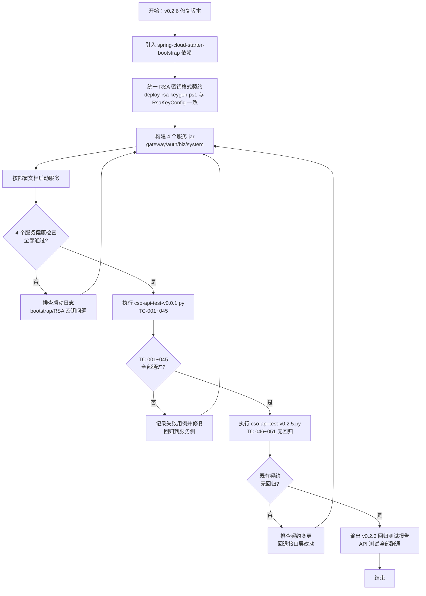

## 6. 数据需求
本版本为部署/配置修复版本，**不新增数据表、不修改表结构**，涉及的数据资产如下：
- **配置数据（env.json）**：`RSA_PUBLIC_KEY`、`RSA_PRIVATE_KEY`（格式由 PEM 整体 Base64 统一为 DER 单行 Base64，或 Java 端兼容 PEM 头尾）；数据库、Redis、Nacos 连接参数保持不变。
- **基础设施数据**：MariaDB（cloudstroll_office_auth 等 9 张表）、Redis（会话/黑名单/状态缓存）数据结构不变，仅依赖其可用性完成服务启动验证。
- **Nacos 注册数据**：gateway/auth/biz/system 4 个服务实例注册信息（服务启动后自动注册）。

## 7. 验收标准
本版本整体验收标准（与用户故事验收标准呼应）：
1. 根 pom 或 4 个服务模块 pom 已引入 `spring-cloud-starter-bootstrap`（或等价配置），构建通过，启动日志无 `No spring.config.import property has been defined`。
2. deploy-rsa-keygen.ps1 输出/env.json 注入的 RSA 密钥格式与 Java 端解码契约一致，网关启动无 `RSA 公钥解析失败`。
3. 重新构建后 gateway/auth/biz/system 4 个服务全部成功启动并注册到 Nacos，`/api/v1/{auth|biz|system}/health` 健康检查全部返回正常。
4. `python cso-api-test-v0.0.1.py http://localhost:9000` 执行通过：TC-001~045 全部 PASS（PASS=45、FAIL=0）。
5. `python cso-api-test-v0.2.5.py <项目根>` 执行通过：TC-046~051 保持 PASS=26、FAIL=0。
6. git 变更清单确认无接口层（Controller/DTO/响应体）与客户端 lib/ 运行时代码改动，既有接口契约 API-001~API-033 完整保留。
7. v0.2.6 接口回归报告（docs/cso-v0.2.6/regression-api-test.md）输出，记录 TC-001~051 全部动态执行结果，API 测试全部跑通。

## 8. 用户故事（User Stories）
### US-001：恢复服务配置引导，解决服务无法启动
#### 故事描述
作为（运维/部署人员），我想要（引入 bootstrap 配置引导依赖并恢复 bootstrap.yml 加载），以便（gateway/auth/biz/system 4 个服务能够正常启动并注册到 Nacos，打通 API 测试环境）。
#### 前置条件
- 具备 Maven 多模块项目源码与根 pom/模块 pom 修改权限；
- Nacos 2.3（8848）、MariaDB 10.6（3306）、Redis 7.2（6379）已启动且网络可达。
#### 验收标准
- [ ] Given 全项目 pom 未引入 bootstrap 相关依赖，When 在根 pom 或 4 个服务模块引入 `spring-cloud-starter-bootstrap`（或等价启用 `spring.config.import=optional:nacos:` 并关闭 import-check）并重新构建，Then 构建成功且 bootstrap.yml 生效，Nacos discovery/config server-addr 被正确加载
- [ ] Given 服务已具备 bootstrap 引导能力，When 按部署文档启动 auth/biz/system 服务，Then 启动日志不再出现 `No spring.config.import property has been defined`，服务成功注册到 Nacos
- [ ] Given 4 个服务启动完成，When 访问各服务健康检查接口，Then `/api/v1/{auth|biz|system}/health` 均返回正常状态
#### 边界情况与错误处理
| 场景 | 预期处理 |
| --- | --- |
| 仅根 pom 声明 dependencyManagement 而未在模块引入 | 启动仍报 import-check 错误，需在模块实际引入依赖 |
| 方案 B 使用 spring.config.import | 需同步关闭 import-check，否则仍报错 |
| 引入依赖后 Nacos 不可达 | 服务启动失败，报连接 Nacos 异常，需先保障基础设施可用 |
| 修复后仍有其他启动问题 | 纳入本版本继续排查或记录后续版本处理（URS 假设项） |
#### 关联功能编号
F-001、F-003

### US-002：统一 RSA 密钥格式契约，消除公钥解析失败
#### 故事描述
作为（运维/部署人员），我想要（deploy-rsa-keygen.ps1 生成的 RSA 密钥格式与 Java 端解码逻辑一致），以便（env.json 注入的密钥可被 gateway/auth 正确解析，服务不再因 `RSA 公钥解析失败` 而崩溃）。
#### 前置条件
- 已定位 deploy/env.json 中 `RSA_PUBLIC_KEY`/`RSA_PRIVATE_KEY` 为 PEM 整体 Base64（多行、含 BEGIN/END）与 Java 端严格 Base64 解码契约不一致的根因。
#### 验收标准
- [ ] Given 采用方案 A（脚本侧修复），When 重新执行 deploy-rsa-keygen.ps1 生成密钥，Then 输出为 DER 编码单行 Base64（无 PEM 头尾、无换行），env.json 注入后网关启动无 `RSA 公钥解析失败`
- [ ] Given 采用方案 B（代码侧兼容），When 修改 RsaKeyConfig 使用 MIME 解码并剥离 PEM 头尾，Then 原 env.json 的 PEM Base64 密钥可被正确解析，网关启动正常
- [ ] Given 网关与 auth 服务启动成功，When 使用签名密钥完成登录签发与网关验签，Then RS256 签名验签链路正常工作（Token 可签发、可验证）
- [ ] Given 密钥修复完成，When 检查日志与代码仓库，Then 私钥不写入日志、不进入代码仓库
#### 边界情况与错误处理
| 场景 | 预期处理 |
| --- | --- |
| 密钥为多行 Base64 且含 \\r\\n | 方案 A 下解码失败，需重新生成单行格式；方案 B 下自动剥离 |
| 公钥与私钥不配对 | 网关验签失败，请求返回 401，需成对生成密钥 |
| 密钥文件损坏/截断 | 解析抛异常，服务启动失败，需重新生成并注入 |
| 两端契约不一致的配置残留 | 部署文档同步说明格式要求，env.json 以统一契约为准 |
#### 关联功能编号
F-002、F-003

### US-003：完成 v0.0.1 基线接口动态回归闭环
#### 故事描述
作为（测试工程师），我想要（在服务可用的环境下补跑 v0.0.1 基线接口回归脚本），以便（TC-001~045 全部动态执行通过，消除"待执行/环境阻塞"历史状态，确认基线接口契约 API-001~API-033 真实可用）。
#### 前置条件
- 4 个服务（gateway/auth/biz/system）已全部启动且健康检查通过；
- Nacos、MariaDB、Redis 运行正常，admin 账号（admin/admin123）可用。
#### 验收标准
- [ ] Given 网关（9000）与认证服务（9100）可访问，When 执行 `python cso-api-test-v0.0.1.py http://localhost:9000`，Then 脚本正常跑完，退出码 0，不再因连接拒绝崩溃
- [ ] Given 基线回归脚本执行完成，When 核对 TC-001~045 执行结果，Then PASS=45、FAIL=0，登录、认证、网关鉴权、业务接口契约全部动态通过
- [ ] Given 回归结果汇总完成，When 输出 v0.2.6 接口回归报告，Then 记录 TC-001~045 执行结果与结论，闭环 v0.0.1 基线遗留项
#### 边界情况与错误处理
| 场景 | 预期处理 |
| --- | --- |
| 个别用例因测试数据冲突失败 | 记录失败用例，清理测试数据后重跑，直至全部通过 |
| 服务再次启动失败 | 回到 US-001/US-002 排查依赖与密钥配置 |
| 脚本参数与项目约定不一致 | 按脚本 README/项目文档约定传参（项目根或网关地址） |
| 回归环境数据残留（用户/验证码缓存） | 执行脚本前清理或按脚本约定重置测试数据 |
#### 关联功能编号
F-003、F-004

### US-004：保障既有接口契约无回归
#### 故事描述
作为（企业用户/最终用户），我想要（v0.2.6 修复不改变任何对外接口契约与客户端行为），以便（Web/Windows 客户端无需任何修改即可继续正常使用登录认证与业务功能）。
#### 前置条件
- v0.2.6 修复范围已完成并提交，git 变更清单可审计。
#### 验收标准
- [ ] Given v0.2.6 修复完成，When 检查 git 变更清单，Then 无接口层（Controller/DTO/响应体）与客户端 lib/ 运行时代码改动
- [ ] Given 既有接口契约（API-001~API-033）保持完整，When 执行 `python cso-api-test-v0.2.5.py <项目根>`，Then TC-046~051 保持 PASS=26、FAIL=0
- [ ] Given 本版本发布前，When 核对 API 文档与接口实现，Then 无新增/变更/删除接口，契约静态与动态双重确认无回归
#### 边界情况与错误处理
| 场景 | 预期处理 |
| --- | --- |
| 修复过程中意外改动接口层文件 | 回退改动，重新构建验证，回归报告中说明 |
| 既有脚本断言因环境（服务未启动）失败 | TC-046-3 健康检查为可选场景，按脚本约定 SKIP 不视为失败 |
| 客户端运行时代码被误改 | 回退，客户端构建产物与运行时代码保持原状 |
#### 关联功能编号
F-005

## 9. 版本规划
| 版本号 | 计划内容 | 状态 |
| --- | --- | --- |
| v0.0.1 | 统一认证授权与企业办公微服务化平台底座（基线版本，反推存量代码能力） | 已发布 |
| v0.2.5 | 部署资产集中化（deploy 目录、构建产物与脚本迁移） | 已发布 |
| v0.2.6 | 部署与配置缺陷修复：bootstrap 依赖引入、RSA 密钥格式契约统一、4 服务启动验证、v0.0.1 基线接口回归闭环（TC-001~045） | 本版本 |
| 后续版本 | 按产品规划迭代企业信息、人事管理、工作流审批、薪酬管理等业务能力 | 规划中 |

## 10. 附录
### 术语表
| 术语 | 说明 |
| --- | --- |
| bootstrap.yml | Spring Cloud 配置引导文件，Spring Boot 3.x 下需引入 spring-cloud-starter-bootstrap 才会默认加载，用于 Nacos 配置/注册引导 |
| import-check | spring-cloud-starter-alibaba-nacos-config 对 `spring.config.import` 的强校验，未配置时报 `No spring.config.import property has been defined` |
| DER 编码 | X.509 密钥二进制编码格式，经 Base64 后为单行文本，是 Java `X509EncodedKeySpec`/`PKCS8EncodedKeySpec` 的标准输入 |
| PEM 格式 | 带 `-----BEGIN/END ...-----` 头尾的 Base64 文本（可多行），OpenSSL 默认输出格式 |
| RSA_PUBLIC_KEY / RSA_PRIVATE_KEY | deploy/env.json 注入的 RSA 密钥对环境变量，供 gateway/auth 的 RsaKeyConfig 加载 |
| TC-001~045 | v0.0.1 基线接口回归用例编号（cso-api-test-v0.0.1.py） |
| TC-046~051 | v0.2.5 接口回归用例编号（cso-api-test-v0.2.5.py） |
| API-001~API-033 | 既有接口契约编号（API 设计文档） |

### 参考文档
- docs/cso-v0.2.5/regression-api-test.md（v0.2.5 回归测试报告，本版本需求来源：环境阻塞与根因分析）
- docs/cso-v0.2.6/cso-urs-v0.2.6.md（v0.2.6 用户需求说明书）
- docs/cso-urs.md（URS 主文档）
- docs/cso-prd.md（PRD 主文档）
- docs/cso-sad.md（系统架构设计文档，RsaKeyConfig/bootstrap 相关章节）
- docs/cso-api.md（API 设计文档，接口契约 API-001~API-033）
- scripts/API-TEST/cso-api-test-v0.0.1.py、cso-api-test-v0.2.5.py（接口回归脚本）
- deploy/env.json、deploy/scripts/deploy-rsa-keygen.ps1（密钥与环境配置资产）

<!-- SPDX-License-Identifier: Apache-2.0 / Copyright 2026 jenemy8023 <jenemy8023@163.com> -->

---

# 版本 v0.2.7：部署脚本体系重构与仓库清洁度治理（2026-08-10）

**版本号**：v0.2.7
**日期**：2026-08-10
**编写人**：BA

## 1. 产品背景
### 1.1 项目背景
云漫智企（CloudStrollOffice）是基于 Java 21 + Spring Boot 3.2.5 + Spring Cloud 2023.0.1 的微服务企业办公套件，由 gateway（9000）、auth-service（9100）、biz-service（9200）、system-service（9400）4 个业务服务及 Nacos 2.3（8848）/ MariaDB 10.6（3306）/ Redis 7.2（6379）基础设施构成。v0.2.5 起部署资产集中化到 `deploy` 目录，v0.2.6 修复了 bootstrap 依赖与 RSA 密钥格式契约，4 个服务已可正常启动。

当前 `deploy/scripts` 下脚本（.ps1/.sh 双版本）存在历史遗留问题：`deploy-check-env.ps1` 仍以硬编码默认地址（192.168.1.100 等）为主、参数化加载 env.json 为辅，且将 Nacos 可用性检查误放于"连通性检查"；`deploy-env.ps1`/`deploy-env-template.ps1` 为弃用残留脚本；`deploy-rsa-keygen.sh` 与 `.ps1` 的密钥输出契约不一致；各脚本对 JDK/MariaDB/Redis/Nacos 的"可用性检查"与"运行状态检查"能力分散、输出格式与退出码约定不统一；缺少"按部署顺序一键启动全部 Java 后台服务"的总入口脚本。

本版本（v0.2.7）聚焦 **部署脚本体系重构** 与 **仓库清洁度治理**：系统性检查并重构 `deploy/scripts` 全部脚本，实现基于 `deploy/env.json` 的环境可用性检查、基础设施运行状态检查与一键启动、后端服务按序一键启动三大能力，并在 `.gitignore` 中排除生成/测试/调试过程中的临时与中间文件，提升部署运维自动化水平与版本库健康度。

### 1.2 产品目标
- **G-1 环境可用性检查统一化**：运维人员可基于 `deploy/env.json` 一键检查 JDK、MariaDB、Redis、Nacos 四类运行环境的可用性（是否已安装），避免人工逐个验证、脚本与配置分离导致的检查遗漏。
- **G-2 基础设施一键启动**：运维人员可一键检查 JDK、MariaDB、Redis、Nacos 四类环境是否已启动，并对未启动的基础设施（MariaDB/Redis/Nacos）自动执行启动，减少部署准备阶段的重复操作与手工命令。
- **G-3 后端服务按序一键启动**：运维人员可按部署顺序一键启动全部 Java 后台服务（gateway → auth → biz → system），实现"一条命令完成整个后端环境拉起"。
- **G-4 脚本体系重构与双平台对齐**：对 `deploy/scripts` 目录下全部脚本（.ps1/.sh 双版本）进行系统性检查与重构，消除契约不一致（RSA 密钥格式契约、弃用脚本残留、硬编码默认参数），使 Windows 与 Linux 行为一致、输出清晰、可独立验证。
- **G-5 仓库临时/中间文件治理**：整体检查项目当前文件，将生成、测试、调试过程中产生的临时文件与中间文件在 `.gitignore` 中排除，避免误提交、保持 git 仓库整洁与可审计性。

**量化指标**：重构后 `deploy/scripts` 脚本全部通过双平台（Windows PowerShell / Linux Bash）语法与契约自校验；一键启动脚本可在未启动基础设施的环境下自动拉起 MariaDB/Redis/Nacos 并完成 4 个后端服务按序启动；`.gitignore` 覆盖新增识别的临时/中间文件类型后，`git status` 不再出现生成、测试、调试过程文件。

### 1.3 核心设计理念
- **配置驱动、脚本无感**：全部脚本统一通过 `load-env.ps1`/`load-env.sh` 从 `deploy/env.json` 加载环境配置（NACOS_ADDR/NACOS_HOME/DB_*/REDIS_*/RSA 密钥等），脚本内不硬编码环境地址与凭据，配置变更只改 env.json。
- **检查与启动分离、一键总入口**：可用性检查（deploy-check-env）、基础设施运行状态检查与一键启动（deploy-start-services）、后端服务按序一键启动（deploy-start-all）三种能力职责清晰、可独立执行，并可通过组合实现"一条命令完成整个后端环境拉起"。
- **契约统一、双平台对齐**：.sh 与 .ps1 行为保持一致，RSA 密钥格式契约（DER 编码单行 Base64，公钥 X.509 / 私钥 PKCS#8）与 Java 端解码逻辑严格一致（ADR-015，v0.2.6 确立）；脚本输出统一分级（通过/警告/失败）与退出码约定（失败非零）。
- **结果可确认、以测代证**：基础设施一键启动后再次探测确认；后端服务启动后通过端口/HTTP 探测确认健康，避免"命令已执行但服务未起来"的假成功；关键脚本提供契约自校验。
- **仓库整洁、临时文件不入库**：生成、测试、调试过程文件与临时/中间文件在 `.gitignore` 中排除，不误伤应入库的源码、文档、模板与配置模板（env.example.json）。

## 2. 目标用户
| 用户角色 | 使用场景 | 核心诉求 |
| --- | --- | --- |
| 运维/部署工程师 | 基于 env.json 检查 JDK/MariaDB/Redis/Nacos 可用性与运行状态、一键启动未运行的基础设施、按序一键启动全部 Java 后端服务 | 一条命令完成环境检查与拉起，输出清晰、失败可定位、双平台一致 |
| 后端开发工程师 | Maven 多模块（gateway/auth/biz/system）编译、调试与本地环境联调 | 本地环境准备与重建、环境异常时快速检查与拉起服务、脚本契约一致 |
| 测试工程师（TE） | 接口回归测试与部署验收 | 在干净环境按脚本完成部署前置检查与服务启动，验证一键脚本在测试环境可用 |
| 项目版本管理员 / 维护者 | 版本库整洁与仓库治理 | 审核 `.gitignore` 覆盖情况，确保生成、测试、调试临时/中间文件不入库 |

## 3. 功能清单
| 功能编号 | 功能名称 | 所属模块 | 优先级 | 版本范围 |
| --- | --- | --- | --- | --- |
| F-001 | env.json 配置加载统一 | deploy/scripts（load-env.ps1 / load-env.sh） | 高 | v0.2.7 |
| F-002 | JDK 可用性检查 | deploy/scripts（deploy-check-env.ps1 / .sh） | 高 | v0.2.7 |
| F-003 | MariaDB 可用性检查 | deploy/scripts（deploy-check-env.ps1 / .sh） | 高 | v0.2.7 |
| F-004 | Redis 可用性检查 | deploy/scripts（deploy-check-env.ps1 / .sh） | 高 | v0.2.7 |
| F-005 | Nacos 可用性检查 | deploy/scripts（deploy-check-env.ps1 / .sh） | 高 | v0.2.7 |
| F-006 | 运行状态检测 | deploy/scripts（deploy-check-env.ps1 / .sh、deploy-start-services.ps1 / .sh） | 高 | v0.2.7 |
| F-007 | 未启动基础设施一键启动 | deploy/scripts（deploy-start-services.ps1 / .sh） | 高 | v0.2.7 |
| F-008 | 后端服务按序一键启动 | deploy/scripts（deploy-start-all.ps1 / .sh） | 高 | v0.2.7 |
| F-009 | 单服务启动脚本保持可用 | deploy/scripts（deploy-start-gateway/auth/biz/system.ps1 / .sh） | 中 | v0.2.7 |
| F-010 | 前置检查脚本整合 | deploy/scripts（deploy-check-env.ps1 / .sh） | 高 | v0.2.7 |
| F-011 | 脚本契约与输出规范 | deploy/scripts（全部 .ps1 / .sh） | 高 | v0.2.7 |
| F-012 | .gitignore 临时/中间文件治理 | 项目根目录（.gitignore） | 高 | v0.2.7 |

## 4. 详细功能描述
### 4.1 F-001 env.json 配置加载统一
#### 功能描述
全部重构脚本统一通过 `load-env.ps1` / `load-env.sh` 从 `deploy/env.json` 加载环境配置（NACOS_ADDR、NACOS_HOME、DB_HOST/DB_PORT/DB_USERNAME/DB_PASSWORD/DB_SERVICE_NAME/DB_PROCESS_NAME、REDIS_HOST/REDIS_PORT/REDIS_PASSWORD/REDIS_DATABASE/REDIS_SERVICE_NAME/REDIS_PROCESS_NAME、RSA_PRIVATE_KEY/RSA_PUBLIC_KEY 等），避免脚本间重复/不一致的加载逻辑；缺失 env.json 或关键配置项时给出明确错误提示。
#### 业务规则
- load-env 脚本保持从 `deploy/env.json` 读取（`Join-Path $ProjectDir env.json` / `$PROJECT_DIR/env.json`），将 JSON 键值对设置为当前会话环境变量；
- env.json 不存在时输出错误提示（复制 env.example.json 为 env.json 并填写配置）并以非零码退出；
- 各脚本必须在加载后校验本脚本所需的关键配置项（至少含 NACOS_ADDR、NACOS_HOME、DB_HOST、DB_PORT、DB_USERNAME、DB_PASSWORD、REDIS_HOST、REDIS_PORT），缺失项逐个列出并退出；
- 脚本内不得硬编码环境地址与凭据，全部读取自 env.json（经 load-env 加载后的环境变量）。
#### 页面原型说明（或原型图位置）
无页面原型（命令行脚本）。

### 4.2 F-002 JDK 可用性检查
#### 功能描述
根据 env.json 检查 JDK 是否已安装：检测 java 命令可用性、`JAVA_HOME` 是否设置且目录有效、java 版本为 21；版本不符或缺失时输出失败并提示。
#### 业务规则
- 检测项：`java -version` 输出包含 `version "21`（或 `openjdk version "21`）且命令可执行；`JAVA_HOME` 环境变量已设置且 `Test-Path`/`-d` 目录有效；
- 任一检测项失败输出"失败"并给出处理建议（安装 JDK 21 或配置 JAVA_HOME），计入失败汇总；
- JDK 为运行时环境，仅检查可用性，不执行启动操作（业务假设：JDK 不存在"启动"概念）。
#### 页面原型说明（或原型图位置）
无页面原型（命令行脚本）。

### 4.3 F-003 MariaDB 可用性检查
#### 功能描述
根据 env.json（DB_HOST/DB_PORT/DB_USERNAME/DB_PASSWORD/DB_SERVICE_NAME/DB_PROCESS_NAME）检查 MariaDB/MySQL 是否已安装：命令/服务/进程三重检测，并通过数据库连接（SELECT 1）验证连通性。
#### 业务规则
- 安装检测：任一检测方式命中即视为已安装——命令（mariadb/mysql/mysqld/mariadbd 可执行）、系统服务（DB_SERVICE_NAME，逗号分隔多值）、进程（DB_PROCESS_NAME，逗号分隔多值）；
- 连通性检测：通过 `SELECT 1` 验证（PowerShell 用 mariadb/mysql 命令行，Linux 用 mariadb/mysql 或 mysqladmin ping）；连接失败输出"失败"并提示检查 DB_HOST/DB_PORT/DB_USERNAME/DB_PASSWORD；
- 密码不得明文打印：命令中的口令以掩码显示（如 `-p'****'`），日志不输出 DB_PASSWORD 明文；
- 本检查项定位为"可用性"（已安装 + 可连接），与运行状态检测（F-006）区分。
#### 页面原型说明（或原型图位置）
无页面原型（命令行脚本）。

### 4.4 F-004 Redis 可用性检查
#### 功能描述
根据 env.json（REDIS_HOST/REDIS_PORT/REDIS_SERVICE_NAME/REDIS_PROCESS_NAME）检查 Redis 是否已安装：命令/服务/进程三重检测，并通过 `redis-cli ping` 验证连通性。
#### 业务规则
- 安装检测：任一检测方式命中即视为已安装——命令（redis-cli/redis-server 可执行）、系统服务（REDIS_SERVICE_NAME）、进程（REDIS_PROCESS_NAME）；
- 连通性检测：`redis-cli -h REDIS_HOST -p REDIS_PORT ping` 返回 `PONG` 视为通过；若 env.json 配置 REDIS_PASSWORD 且客户端支持，按配置带口令验证（口令不打印明文）；
- 连接失败输出"失败"并提示检查 REDIS_HOST/REDIS_PORT/REDIS_PASSWORD；
- 本检查项定位为"可用性"（已安装 + 可连通），与运行状态检测（F-006）区分。
#### 页面原型说明（或原型图位置）
无页面原型（命令行脚本）。

### 4.5 F-005 Nacos 可用性检查
#### 功能描述
根据 env.json（NACOS_ADDR/NACOS_HOME）检查 Nacos 是否已安装：NACOS_HOME 目录与启动脚本（startup.cmd/startup.sh）存在性 + HTTP 探测（`http://NACOS_ADDR/nacos/`）。
#### 业务规则
- 安装检测：NACOS_HOME 目录存在且 `bin/startup.cmd`（Windows）/ `bin/startup.sh`（Linux）存在，即视为已安装；
- 可用性探测：HTTP 请求 `http://NACOS_ADDR/nacos/`，响应内容含 "Nacos" 视为连通（当前可用）；若 Nacos 尚未启动但安装存在，HTTP 探测失败应计为"警告（未运行）"而非"未安装"，与运行状态检测（F-006）衔接；
- NACOS_ADDR 未配置或格式非法（非 host:port）时输出失败并提示检查 env.json；
- 本检查项定位为"可用性"（已安装 + 可达），与运行状态检测（F-006）区分。
#### 页面原型说明（或原型图位置）
无页面原型（命令行脚本）。

### 4.6 F-006 运行状态检测
#### 功能描述
检查 JDK、MariaDB、Redis、Nacos 是否已启动：进程/系统服务/TCP 端口/HTTP 探测等方式，输出各服务运行状态。
#### 业务规则
- JDK：不执行"启动"检查，仅复用 F-002 可用性检查结论（可用即视为"就绪"）；
- MariaDB/Redis：进程（DB_PROCESS_NAME/REDIS_PROCESS_NAME）存在、系统服务（DB_SERVICE_NAME/REDIS_SERVICE_NAME）为 Running、或 TCP 端口（3306/6379）可达，任一命中即视为运行中；
- Nacos：HTTP 探测 `http://NACOS_ADDR/nacos/` 返回含 "Nacos" 内容视为运行中；探测失败时再检测 java 进程命令行含 nacos 关键字作为辅助判断；
- 运行状态与可用性状态分开输出：已安装但未运行 → 状态"未运行"（供 F-007 启动），已安装且运行 → "运行中"，未安装 → "未安装"（不可启动）；
- 输出汇总表格/分级行，格式与 F-011 输出规范一致。
#### 页面原型说明（或原型图位置）
无页面原型（命令行脚本）。

### 4.7 F-007 未启动基础设施一键启动
#### 功能描述
对检测为未运行的 MariaDB/Redis/Nacos 自动执行启动（优先系统服务，其次可执行文件/NACOS_HOME 启动脚本），启动后再次探测确认；JDK 不涉及"启动"，仅检查可用性并提示。
#### 业务规则
- 启动顺序：MariaDB → Redis → Nacos（数据库与缓存先于注册中心启动，避免服务注册时依赖缺失）；
- MariaDB/Redis 启动方式优先级：系统服务（Start-Service / systemctl start）→ 可执行文件（mysqld/mariadbd/redis-server，Start-Process / 后台启动）；
- Nacos 启动方式：执行 `NACOS_HOME/bin/startup.cmd`（Windows，standalone 模式）/ `bash NACOS_HOME/bin/startup.sh`（Linux）；
- 每次启动后必须再次探测确认（进程/TCP/HTTP），确认成功输出"通过"，启动超时或失败输出"警告/失败"并给出处理建议，不得报假成功；
- 启动过程输出口令掩码处理，不得泄露 DB_PASSWORD/REDIS_PASSWORD 明文；
- 未安装的服务不得尝试启动，输出"未安装，请先安装"并计入失败（若存在未安装项，按脚本约定决定是否继续执行后续服务）。
#### 页面原型说明（或原型图位置）
无页面原型（命令行脚本）。

### 4.8 F-008 后端服务按序一键启动
#### 功能描述
提供一键启动全部 Java 后台服务的脚本 `deploy-start-all.ps1` / `.sh`，按部署顺序（gateway → auth → biz → system）逐个启动 4 个后端服务，启动前校验 jar 包与关键环境变量就绪，并对每个服务做启动确认。
#### 业务规则
- 启动顺序固定为：gateway（9000）→ auth-service（9100）→ biz-service（9200）→ system-service（9400）；
- 启动前校验：4 个 jar 包存在（deploy/cloudoffice-gateway.jar、cloudoffice-auth-service.jar、cloudoffice-biz-service.jar、cloudoffice-system-service.jar）；关键环境变量就绪（NACOS_ADDR、RSA_PUBLIC_KEY（gateway/auth）、DB_PASSWORD（auth/biz/system）等）；
- 启动命令统一为 `java -Xms256m -Xmx512m -jar <jar>`，各服务独立后台运行（Windows 建议独立窗口或 Start-Process，Linux 建议 nohup/后台执行并记录 PID 或日志文件）；
- 每个服务启动后执行健康确认：HTTP 探测（如经网关 `http://localhost:9000/api/v1/{auth|biz|system}/health` 或各服务端口探测），确认成功后再启动下一个；不满足时可配置等待重试次数/超时；
- 任一步骤失败时输出明确错误提示并停止后续启动（可配置继续策略，默认失败即停）；
- 输出全部服务的启动结果与健康状态汇总。
#### 页面原型说明（或原型图位置）
无页面原型（命令行脚本）。

### 4.9 F-009 单服务启动脚本保持可用
#### 功能描述
保留并重构单个服务启动脚本（deploy-start-gateway/auth/biz/system），加载 env.json、校验必备变量与 jar 存在后启动对应服务，供按需单独启动使用。
#### 业务规则
- 4 个单服务脚本（gateway/auth/biz/system）各自独立可运行，行为与 F-008 中对应服务启动逻辑一致；
- 各脚本校验本服务所需变量：gateway/auth 校验 NACOS_ADDR、RSA_PUBLIC_KEY（auth 另需 RSA_PRIVATE_KEY）；biz/system 校验 NACOS_ADDR、DB_PASSWORD（biz 使用 DB_USER、auth 使用 DB_USERNAME 的差异保持与现状一致）；
- 校验 jar 存在后以 `java -Xms256m -Xmx512m -jar <jar>` 启动；
- 脚本输出与 F-011 输出规范一致。
#### 页面原型说明（或原型图位置）
无页面原型（命令行脚本）。

### 4.10 F-010 前置检查脚本整合
#### 功能描述
重构 deploy-check-env 脚本，将其能力与"可用性检查 + 运行状态检查"对齐，从 env.json 读取参数（去除硬编码默认地址），输出通过/失败/警告汇总。
#### 业务规则
- 删除脚本内硬编码默认地址（192.168.1.100/101/102 等），全部参数从 env.json（经 load-env 加载）读取；
- 检查范围对齐 F-002~F-005（JDK/MariaDB/Redis/Nacos 可用性）+ F-006（运行状态）：
  - JDK：java 命令、JAVA_HOME、版本 21；
  - MariaDB：命令/服务/进程 + SELECT 1；
  - Redis：命令/服务/进程 + redis-cli ping；
  - Nacos：NACOS_HOME 目录/startup 脚本 + HTTP 探测；
  - 运行状态：各服务是否已启动（进程/服务/TCP/HTTP）；
- 输出分级汇总（通过/失败/警告），存在失败项时给出处理提示并以非零码退出，全部通过退出码 0；
- 移除与"可用性检查 + 运行状态检查"无关的检查项（如 Maven/Git 版本检查、项目代码检查等）或将其降为可选信息输出（按 PM/BA 确认范围，本版本对齐 URS FR-010 描述）；
- 保留 .ps1/.sh 双版本且行为一致。
#### 页面原型说明（或原型图位置）
无页面原型（命令行脚本）。

### 4.11 F-011 脚本契约与输出规范
#### 功能描述
全部 .ps1/.sh 双版本脚本对齐：RSA 密钥生成脚本 .sh 与 .ps1 输出契约一致（DER 单行 Base64）；脚本输出统一分级（通过/警告/失败）与退出码约定（失败非零）；消除弃用脚本残留（deploy-env 等）。
#### 业务规则
- RSA 密钥契约（ADR-015）：deploy-rsa-keygen.ps1 / .sh 均输出 DER 编码单行 Base64（公钥 X.509 SubjectPublicKeyInfo / 私钥 PKCS#8 PrivateKeyInfo，无 PEM 头尾、无换行），与 Java 端 `Base64.getDecoder()` + `X509EncodedKeySpec`/`PKCS8EncodedKeySpec` 解码契约一致；.sh 修复为与 .ps1 相同的输出格式（当前 .sh 输出 PEM 文件整体 Base64，需修正为 DER 单行 Base64 或同步调整 Java 端兼容——按 v0.2.6 确立的契约，脚本侧对齐 DER 单行 Base64）；
- 输出分级约定：成功项前缀"通过"（绿色）、警告项"警告"（黄色）、失败项"失败"（红色）；汇总显示通过/警告/失败计数；
- 退出码约定：全部通过退出 0；存在失败项退出非零（1）；存在警告但无失败按脚本约定（建议退出 0 并提示警告，或退出码 2 由脚本约定统一）；
- 弃用脚本残留处理：删除 `deploy-env.ps1` / `deploy-env-template.ps1`（或按 BA 确认标注弃用并移除引用），避免与 load-env 双份配置逻辑混淆；
- 脚本文件保留 SPDX-License-Identifier 与版权声明（Apache License 2.0），简体中文注释；
- .ps1 与 .sh 同名脚本行为一致、可独立验证（语法校验 + 契约自校验）。
#### 页面原型说明（或原型图位置）
无页面原型（命令行脚本）。

### 4.12 F-012 .gitignore 临时/中间文件治理
#### 功能描述
整体检查项目当前文件，识别生成、测试、调试过程中的临时文件与中间文件，在 `.gitignore` 中补充排除规则，确保 `git status` 不再出现此类文件。
#### 业务规则
- 检查范围：项目根目录全部文件与子目录，重点识别——
  - JVM/应用调试产物：堆转储（*.hprof）、崩溃日志、dump 目录、调试临时文件；
  - 测试产物与缓存：*.pyc/__pycache__、.pytest_cache、测试生成的临时输出、接口测试中间文件（如 token 缓存、临时报告）、Maven surefire 报告（target 已排除但补充 surefire-reports 等独立产物）；
  - 构建过程中间产物：除已有 target/、build/、dist/ 外，补充构建工具残留（如 .flattened-pom.xml、*.class 已覆盖但补充 ide 编译缓存）；
  - 工具残留目录与文件：调试器/抓包工具输出、API 调试会话文件、编辑器/IDE 会话文件（补充 *.history、*.session 等）；
- 补充规则须带路径前缀或精确模式，**不得误伤**应入库的源码、文档、模板与配置模板（env.example.json、.gitkeep、pom.xml、bootstrap.yml 等）；
- 治理后执行 `git status` 验证：仅出现预期的源码/文档变更，临时与中间文件不再出现在待提交清单中；
- 补充规则按现有 .gitignore 分区风格归类（如"JVM/调试产物"、"测试缓存"、"工具残留"等分区）。
#### 页面原型说明（或原型图位置）
无页面原型（配置文件治理）。

## 5. 业务流程图
（使用 Mermaid 描述 v0.2.7 部署脚本体系主流程。）

### 5.1 环境可用性检查流程（deploy-check-env）
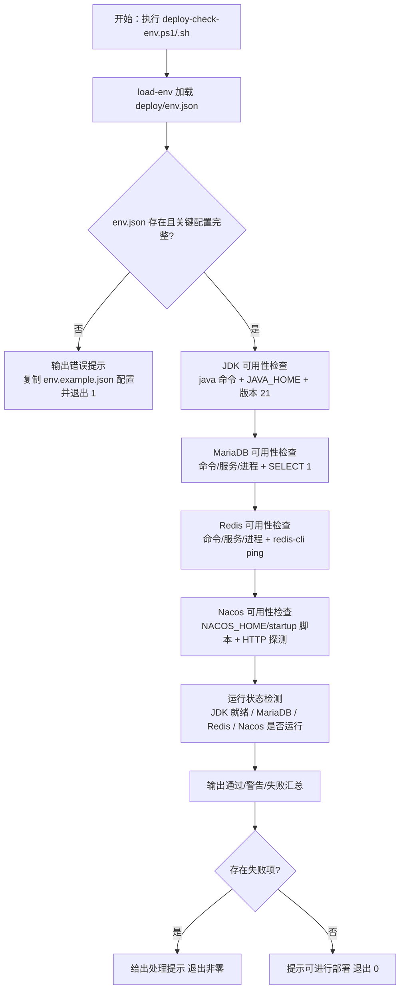

### 5.2 基础设施运行状态检查与一键启动流程（deploy-start-services）
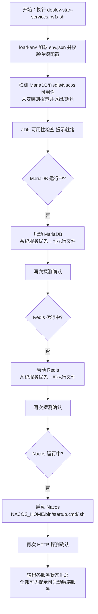

### 5.3 后端服务按序一键启动流程（deploy-start-all）
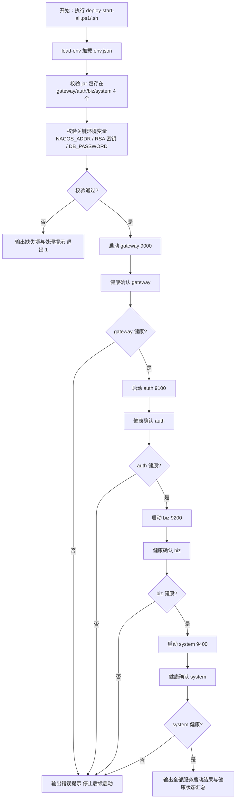

## 6. 数据需求
本版本为部署脚本重构与仓库治理版本，**不新增业务数据表、不修改既有表结构**，涉及的数据资产如下：
- **配置数据（deploy/env.json / env.example.json）**：全部脚本的唯一配置源，关键项包括——
  - Nacos：`NACOS_ADDR`（host:port）、`NACOS_HOME`（安装目录，检测/启动用）；
  - 数据库：`DB_HOST`、`DB_PORT`、`DB_USERNAME`、`DB_PASSWORD`、`DB_USER`（兼容项）、`DB_SERVICE_NAME`、`DB_PROCESS_NAME`；
  - Redis：`REDIS_HOST`、`REDIS_PORT`、`REDIS_PASSWORD`、`REDIS_DATABASE`、`REDIS_SERVICE_NAME`、`REDIS_PROCESS_NAME`；
  - 安全：`RSA_PRIVATE_KEY`、`RSA_PUBLIC_KEY`（DER 编码单行 Base64，契约 ADR-015）；
  - 应用参数：`VERIFICATION_CODE_*`、`PASSWORD_MIN_LENGTH`/`PASSWORD_MAX_LENGTH`、`MARIADB_ROOT_PASSWORD`、`TZ`（供应用使用，脚本不改写）。
- **基础设施数据**：MariaDB（cloudstroll_office_auth 等 9 张表）、Redis（会话/黑名单/状态缓存）数据结构不变，仅依赖其可用性与运行状态完成脚本验证。
- **Nacos 注册数据**：gateway/auth/biz/system 4 个服务实例注册信息（服务启动后自动注册）。
- **仓库治理数据（.gitignore）**：新增临时/中间文件排除规则（JVM 调试产物、测试缓存、构建中间产物、工具残留等），不涉及数据实体。

## 7. 验收标准
本版本整体验收标准（与用户故事验收标准呼应）：
1. 全部脚本（.ps1/.sh）均通过 `load-env.ps1`/`load-env.sh` 从 `deploy/env.json` 加载配置，脚本内无硬编码环境地址（192.168.1.100 等）与凭据；env.json 缺失或关键配置缺失时输出明确错误并以非零码退出。
2. `deploy-check-env.ps1`/`.sh` 基于 env.json 完成 JDK（命令 + JAVA_HOME + 版本 21）、MariaDB（命令/服务/进程 + SELECT 1）、Redis（命令/服务/进程 + ping）、Nacos（NACOS_HOME/startup 脚本 + HTTP 探测）可用性检查，并输出运行状态；存在失败项时给出处理提示并退出非零。
3. `deploy-start-services.ps1`/`.sh` 检测到未运行的 MariaDB/Redis/Nacos 时自动启动（系统服务优先，其次可执行文件/NACOS_HOME 启动脚本），启动后再次探测确认，无假成功；JDK 仅检查可用性不执行启动。
4. `deploy-start-all.ps1`/`.sh` 按 gateway → auth → biz → system 顺序一键启动 4 个后端服务，启动前校验 jar 包与关键环境变量，每服务启动后健康确认，任一步骤失败时停止并给出明确错误提示。
5. 单服务启动脚本（deploy-start-gateway/auth/biz/system）各自独立可用，行为与一键启动对应服务一致。
6. `deploy-rsa-keygen.sh` 与 `.ps1` 输出契约一致（DER 编码单行 Base64，公钥 X.509 / 私钥 PKCS#8），与 Java 端解码契约一致；弃用脚本（deploy-env.ps1 / deploy-env-template.ps1）已移除或明确弃用。
7. 脚本输出统一分级（通过/警告/失败）与退出码约定（失败非零）；.ps1 与 .sh 双平台行为一致，通过语法与契约自校验。
8. `.gitignore` 已补充生成、测试、调试过程中的临时/中间文件排除规则（JVM 调试产物、测试缓存、构建中间产物、工具残留等），`git status` 不再出现此类文件，且不误伤 env.example.json、.gitkeep、源码与文档等应入库文件。

## 8. 用户故事（User Stories）
### US-001：基于 env.json 一键检查环境可用性
#### 故事描述
作为（运维/部署工程师），我想要（基于 deploy/env.json 一键检查 JDK/MariaDB/Redis/Nacos 四类环境的可用性），以便（确认环境是否满足部署前置条件，避免人工逐个验证与配置遗漏）。
#### 前置条件
- 已按 deploy.md 完成 `deploy/env.json` 配置（至少含 NACOS_ADDR、NACOS_HOME、DB_*、REDIS_* 关键项）；
- 部署主机已安装（或未安装待检测）JDK 21、MariaDB/MySQL、Redis、Nacos。
#### 验收标准
- [ ] Given deploy/env.json 存在且配置完整，When 执行 `deploy-check-env.ps1`（Windows）或 `deploy-check-env.sh`（Linux），Then 脚本从 env.json 加载配置，逐项检查 JDK/MariaDB/Redis/Nacos 可用性并输出通过/失败/警告汇总
- [ ] Given 某环境缺失（如 JDK 未安装），When 执行检查脚本，Then 对应检查项输出"失败"并给出处理提示（安装 JDK 21 / 配置 JAVA_HOME），脚本以非零码退出
- [ ] Given env.json 缺失或关键配置不完整，When 执行检查脚本，Then 输出明确错误提示（复制 env.example.json 并填写配置）并以非零码退出
#### 边界情况与错误处理
| 场景 | 预期处理 |
| --- | --- |
| JDK 版本非 21 | 输出"失败"并提示安装 JDK 21 |
| MariaDB 已安装但不可连接 | 安装检测通过但 SELECT 1 失败，输出"失败"提示检查连接参数 |
| Redis 已安装但 ping 不通 | 输出"失败"提示检查 REDIS_HOST/REDIS_PORT/REDIS_PASSWORD |
| Nacos 已安装但未启动 | HTTP 探测失败计为"警告（未运行）"，与运行状态检查衔接，不误判为未安装 |
| 环境地址硬编码残留 | 检查脚本源码确认无 192.168.1.100 等硬编码地址 |
#### 关联功能编号
F-001、F-002、F-003、F-004、F-005、F-006、F-010

### US-002：基础设施未启动时一键拉起
#### 故事描述
作为（运维/部署工程师），我想要（检查 MariaDB/Redis/Nacos 是否已启动，并将未启动的服务一键启动），以便（在部署准备阶段用一条命令完成基础设施拉起，无需手工逐个启动）。
#### 前置条件
- 部署主机已安装 MariaDB/MySQL、Redis、Nacos（安装位置/服务名/进程名在 env.json 配置）；
- 具备启动系统服务的权限（Windows 管理员 / Linux sudo，按环境需要）。
#### 验收标准
- [ ] Given MariaDB 未运行，When 执行 `deploy-start-services.ps1`/`.sh`，Then 脚本自动启动 MariaDB（优先系统服务，其次可执行文件）并再次探测确认，输出"通过"
- [ ] Given Redis 未运行，When 执行 `deploy-start-services.ps1`/`.sh`，Then 脚本自动启动 Redis（优先系统服务，其次 redis-server）并 ping 确认，输出"通过"
- [ ] Given Nacos 未运行，When 执行 `deploy-start-services.ps1`/`.sh`，Then 脚本执行 `NACOS_HOME/bin/startup.cmd`（Windows）或 `startup.sh`（Linux）启动并 HTTP 探测确认，输出"通过"
- [ ] Given 某服务未安装，When 执行启动脚本，Then 脚本不尝试启动该服务，输出"未安装，请先安装"并计入失败/提示
#### 边界情况与错误处理
| 场景 | 预期处理 |
| --- | --- |
| 服务启动超时 | 输出"警告"并给出等待重试/手动检查建议，不报假成功 |
| 启动命令需要管理员权限 | 输出权限提示，指导以管理员身份执行 |
| 密码在启动命令中出现 | 日志以掩码（`****`）显示，不打印 DB_PASSWORD/REDIS_PASSWORD 明文 |
| JDK 被误认为需要启动 | 仅输出可用性结论（就绪/缺失），不执行启动操作 |
#### 关联功能编号
F-006、F-007

### US-003：按部署顺序一键启动全部后端服务
#### 故事描述
作为（运维/部署工程师），我想要（按部署顺序 gateway → auth → biz → system 一键启动全部 Java 后台服务），以便（一条命令完成整个后端环境拉起，避免按错顺序、遗漏服务、逐个开窗口的低效与出错风险）。
#### 前置条件
- 4 个服务 jar 包已构建并落位 deploy 目录（cloudoffice-gateway.jar 等）；
- `deploy/env.json` 已配置 NACOS_ADDR、RSA_PRIVATE_KEY/RSA_PUBLIC_KEY、DB_PASSWORD 等关键项；
- 基础设施（MariaDB/Redis/Nacos）已就绪（可由 US-002 脚本先行拉起）。
#### 验收标准
- [ ] Given 4 个 jar 与关键环境变量就绪，When 执行 `deploy-start-all.ps1`/`.sh`，Then 按 gateway → auth → biz → system 顺序逐个启动，每服务启动后健康确认成功后再启动下一个
- [ ] Given 某 jar 缺失或关键变量缺失，When 执行一键启动脚本，Then 输出缺失项与处理提示，以非零码退出，不启动任何服务
- [ ] Given 某服务启动失败，When 执行一键启动脚本，Then 输出明确错误提示并停止后续启动（默认失败即停策略）
- [ ] Given 全部服务启动成功，When 执行一键启动脚本，Then 输出 4 个服务的启动结果与健康状态汇总，退出码 0
#### 边界情况与错误处理
| 场景 | 预期处理 |
| --- | --- |
| gateway 启动失败 | 停止后续服务启动，提示检查 NACOS_ADDR/RSA_PUBLIC_KEY |
| 健康检查超时 | 按等待重试次数重试，仍失败则输出失败并停止 |
| 端口被占用 | 提示检查端口占用（9000/9100/9200/9400）并指导处理 |
| 需要只启动单个服务 | 使用单服务脚本 deploy-start-gateway/auth/biz/system |
#### 关联功能编号
F-001、F-008、F-009

### US-004：双平台脚本契约一致与输出规范
#### 故事描述
作为（运维/部署工程师），我想要（.ps1 与 .sh 双版本脚本行为一致、输出统一分级、密钥契约一致、无弃用脚本残留），以便（Windows 与 Linux 部署行为可预期、结果可核对、仓库整洁可审计）。
#### 前置条件
- 已完成 `deploy/scripts` 全量脚本重构（对应 F-001~F-011）。
#### 验收标准
- [ ] Given 重构完成，When 检查 `deploy-rsa-keygen.sh` 与 `.ps1` 输出，Then 两者输出契约一致（DER 编码单行 Base64，公钥 X.509 / 私钥 PKCS#8，无 PEM 头尾、无换行），与 Java 端解码契约一致
- [ ] Given 重构完成，When 检查 `deploy/scripts` 目录，Then 无弃用脚本残留（deploy-env.ps1 / deploy-env-template.ps1 已移除或明确弃用），无硬编码默认地址
- [ ] Given 双版本脚本存在，When 分别在 Windows PowerShell 与 Linux Bash 校验语法与执行契约自校验，Then 均通过且输出分级（通过/警告/失败）与退出码约定一致
- [ ] Given 脚本文件更新完成，When 检查文件头，Then 保留 SPDX-License-Identifier（Apache-2.0）与版权声明
#### 边界情况与错误处理
| 场景 | 预期处理 |
| --- | --- |
| .sh 与 .ps1 输出格式不一致 | 以 v0.2.6 确立的 DER 单行 Base64 契约为准对齐（ADR-015） |
| 移除弃用脚本后其他脚本引用 | 检查引用关系并同步更新，避免加载路径失效 |
| 退出码约定不统一 | 统一为：全部通过 0 / 失败非零（脚本约定） |
| 密码/密钥出现在日志 | 校验脚本输出不含 DB_PASSWORD、RSA_PRIVATE_KEY 明文 |
#### 关联功能编号
F-010、F-011

### US-005：仓库临时/中间文件治理
#### 故事描述
作为（项目版本管理员/维护者），我想要（将生成、测试、调试过程中的临时文件与中间文件在 .gitignore 中排除），以便（git 仓库保持整洁、可审计，不误提交过程产物）。
#### 前置条件
- 项目已初始化（docs/project.md 与 docs/sad.md 存在）；
- 已整体检查项目当前文件并识别生成、测试、调试过程文件。
#### 验收标准
- [ ] Given 项目当前存在生成、测试、调试临时/中间文件，When 更新 `.gitignore`，Then 新增规则覆盖 JVM 调试产物（*.hprof、dump 目录）、测试缓存（.pytest_cache、__pycache__）、构建中间产物、工具残留等类型
- [ ] Given 治理完成，When 执行 `git status`，Then 不再出现生成、测试、调试过程文件（仅出现预期源码/文档变更）
- [ ] Given 治理完成，When 核对忽略规则，Then 不误伤应入库文件（env.example.json、.gitkeep、pom.xml、bootstrap.yml、源码与文档等）
#### 边界情况与错误处理
| 场景 | 预期处理 |
| --- | --- |
| 新增规则误伤应入库文件 | 检查 `git status` 未出现应入库文件缺失；用精确路径/前缀规则避免误伤 |
| 同名目录在源码与产物中都有 | 带 `deploy/` 等路径前缀精确匹配，仅排除产物目录 |
| 已跟踪文件被新规则忽略 | 新规则只影响未跟踪文件；如需停止跟踪既有文件需 `git rm --cached` 并确认 |
| 临时文件类型持续新增 | 保持分区注释清晰，便于后续维护者补充 |
#### 关联功能编号
F-012

## 9. 版本规划
| 版本号 | 计划内容 | 状态 |
| --- | --- | --- |
| v0.0.1 | 统一认证授权与企业办公微服务化平台底座（基线版本，反推存量代码能力） | 已发布 |
| v0.2.5 | 部署资产集中化（deploy 目录、构建产物与脚本迁移） | 已发布 |
| v0.2.6 | 部署与配置缺陷修复：bootstrap 依赖引入、RSA 密钥格式契约统一、4 服务启动验证、v0.0.1 基线接口回归闭环（TC-001~045） | 已发布 |
| v0.2.7 | 部署脚本体系重构与仓库清洁度治理：基于 env.json 的环境可用性检查、基础设施运行状态检查与一键启动、后端服务按序一键启动、脚本双平台契约对齐与输出规范、.gitignore 临时/中间文件治理 | 本版本 |
| 后续版本 | 按产品规划迭代企业信息、人事管理、工作流审批、薪酬管理等业务能力 | 规划中 |

## 10. 附录
### 术语表
| 术语 | 说明 |
| --- | --- |
| env.json | 部署环境配置文件（deploy/env.json），全部脚本的唯一配置源；env.example.json 为配置模板 |
| load-env | 统一环境变量加载脚本（load-env.ps1 / load-env.sh），将 env.json 键值对设置为会话环境变量 |
| 可用性检查 | 检测目标软件是否已安装且可达（如 java 命令 + JAVA_HOME + 版本、SELECT 1、ping、HTTP 探测） |
| 运行状态检测 | 检测目标服务是否已启动（进程/系统服务/TCP 端口/HTTP 探测） |
| 三重检测 | 命令 + 系统服务 + 进程三种方式检测软件是否已安装，任一命中即通过 |
| DER 单行 Base64 | RSA 密钥格式契约：DER 编码（公钥 X.509 / 私钥 PKCS#8）转换为单行 Base64，无 PEM 头尾、无换行（ADR-015） |
| 部署顺序 | 后端服务按依赖顺序启动：gateway（9000）→ auth（9100）→ biz（9200）→ system（9400） |
| 退出码约定 | 脚本全部通过退出 0，存在失败项退出非零（1），便于脚本链与 CI 判断 |
### 参考文档
- 用户需求说明书 v0.2.7：docs/cso-v0.2.7/cso-urs-v0.2.7.md
- 主文档 PRD：docs/cso-prd.md（v0.0.1 基线 / v0.2.5 / v0.2.6 版本）
- 部署指南：deploy/deploy.md（服务端口映射、启动顺序、命令汇总）
- 构建方案：deploy/build.md（ADR-014 bootstrap 依赖 / ADR-015 RSA 密钥契约）
- 环境配置模板：deploy/env.example.json、deploy/env.json
- 现有脚本：deploy/scripts/（deploy-check-env、deploy-start-services、deploy-start-gateway/auth/biz/system、deploy-rsa-keygen、load-env 等）
- 系统架构设计：docs/sad.md（ADR-015 RSA 密钥格式契约）

<!-- SPDX-License-Identifier: Apache-2.0 / Copyright 2026 jenemy8023 <jenemy8023@163.com> -->

---

# 版本 v0.2.8：cloudoffice-common 服务化改造与通用配置管理接口先行（2026-08-13）

**版本号**：v0.2.8
**日期**：2026-08-13
**编写人**：BA

## 1. 产品背景
### 1.1 项目背景
云漫智企（CloudStrollOffice）是基于 Java 21 + Spring Boot 3.2.5 + Spring Cloud 2023.0.1 的微服务企业办公套件，由 gateway（9000）、auth-service（9100）、biz-service（9200）、system-service（9400）4 个业务服务及 Nacos 2.3（8848）/ MariaDB 10.6（3306）/ Redis 7.2（6379）基础设施构成。cloudoffice-common 作为公共模块，为上述 4 个业务服务提供公共函数、变量定义与公共接口能力，以 Maven 依赖方式被各服务引用。

当前 cloudoffice-common 仅为纯公共 jar 模块，不具备独立部署与服务注册能力，也未提供通用配置管理接口。各微服务的运行时配置分散在各自的 application.yml / Nacos 配置文件中，缺乏统一的配置查询入口，配置项变更难以追溯、配置一致性难以保障。

本版本（v0.2.8）聚焦 **cloudoffice-common 服务化改造** 与 **通用配置管理接口先行**：将 cloudoffice-common 从纯公共 jar 模块升级为可独立部署的 Spring Boot 微服务，使其具备 Nacos 服务注册、健康检查、API 接口服务、SpringDoc OpenAPI 文档等与其他微服务同等的能力；同时新增通用配置管理查询接口，统一管理不同微服务、不同业务场景下的所有运行时配置（启动环境变量除外）。此外，同步更新编译脚本、部署脚本（deploy-start-all / deploy-stop-all）、部署文档（deploy.md）与 readme.md，使 cloudoffice-common 作为独立服务纳入一键启动/停止流程，且在启动顺序中位于所有后端服务清单的第一位（最先启动）。

### 1.2 产品目标
- **G-1 common 服务化**：将 cloudoffice-common 从纯公共 jar 模块改造为可独立部署的 Spring Boot 微服务，增加启动类、bootstrap.yml（Nacos 注册/配置引导）、application.yml、健康检查端点等，使其可注册到 Nacos 并提供 API 服务，与其他微服务（gateway/auth/biz/system）具备同等的服务注册、健康检查与部署运维能力。
- **G-2 通用配置管理接口**：在 cloudoffice-common 中新增通用配置管理查询接口，统一管理不同微服务、不同业务场景下的所有运行时配置项；除启动所需的环境变量（NACOS_ADDR、DB_PASSWORD、RSA 密钥等）外，所有运行时配置均通过通用配置管理接口进行读取与查询。
- **G-3 部署体系适配**：同步更新编译脚本（build-backend）、部署启动脚本（deploy-start-all）、部署停止脚本（deploy-stop-all）、部署文档（deploy.md）与 readme.md，使 cloudoffice-common 作为独立服务纳入一键启动/停止流程，且在启动顺序中位于所有后端服务清单的第一位（common 最先启动、最后停止）。
- **G-4 配置接口先行、管理后置**：本版本仅交付通用配置管理的查询接口，配置的后端管理界面（增删改）在后续版本迭代增加。当前接口设计预留扩展能力，确保后续管理功能可平滑接入。

**量化指标**：cloudoffice-common 服务化后可独立启动并注册到 Nacos，健康检查端点 `/api/v1/common/health` 返回 200；通用配置查询接口支持按微服务名称、配置分组、配置键等维度查询运行时配置项，单次查询响应时间 ≤ 200ms（本地缓存命中时 ≤ 50ms）；deploy-start-all 脚本按 common → gateway → auth → biz → system 顺序启动，deploy-stop-all 按 system → biz → auth → gateway → common 逆序停止；编译脚本将 cloudoffice-common 纳入产物输出范围，生成可部署 jar 包到 deploy 目录。

### 1.3 核心设计理念
- **服务化对齐、能力一致**：cloudoffice-common 服务化后与其他微服务（gateway/auth/biz/system）具备同等能力——Nacos 服务注册、健康检查端点、统一 ApiResult 响应、SpringDoc OpenAPI 文档、网关路由转发，不引入与现有技术栈重复的框架。
- **配置统一、入口唯一**：通用配置管理作为全部微服务运行时配置的统一查询入口，替代分散在各自配置文件中的配置查询需求；启动环境变量（NACOS_ADDR、DB_PASSWORD、RSA 密钥等）仍由 env.json 注入，不纳入通用配置管理范围。
- **接口先行、扩展预留**：本版本仅实现配置查询接口，接口层与数据层预留增删改扩展点，确保后续管理功能与后端管理界面可平滑接入，避免接口重构。
- **部署优先、公共先行**：cloudoffice-common 作为所有微服务的公共依赖与配置提供方，在部署启动顺序中位于第一位（所有后端服务中最先启动），在停止顺序中位于最后一位（最后停止），确保后续服务启动时可通过 Nacos 服务发现获取 common 的配置接口。
- **双平台一致、脚本规范延续**：部署脚本更新遵循 v0.2.7 脚本体系约定（load-env 统一加载 env.json、输出分级通过/警告/失败、退出码失败非零、.ps1 与 .sh 双平台行为一致）。

## 2. 目标用户
| 用户角色 | 使用场景 | 核心诉求 |
| --- | --- | --- |
| 运维/部署工程师 | 通过部署脚本一键启动/停止全部服务（含 common）；通过通用配置管理接口查询各微服务运行时配置 | 一条命令完成全服务拉起，common 最先启动最后停止；配置查询入口统一 |
| 后端开发工程师 | 在业务代码中通过通用配置管理接口获取所需配置项，替代硬编码与分散的配置文件 | 统一配置查询接口，按服务名/分组/键获取配置值，接口清晰可调用 |
| 系统管理员 | 后续版本通过后端管理界面管理配置项（本版本仅接口先行） | 接口预留扩展能力，后续管理界面可平滑接入 |

## 3. 功能清单
| 功能编号 | 功能名称 | 所属模块 | 优先级 | 版本范围 |
| --- | --- | --- | --- | --- |
| F-001 | common 服务化改造 | cloudoffice-common（启动类、bootstrap.yml、application.yml） | 高 | v0.2.8 |
| F-002 | common API 接口服务 | cloudoffice-common（健康检查、ApiResult、SpringDoc） | 高 | v0.2.8 |
| F-003 | 通用配置管理-查询接口 | cloudoffice-common（配置管理 Controller/Service） | 高 | v0.2.8 |
| F-004 | 通用配置管理-配置范围 | cloudoffice-common（配置数据覆盖全部微服务运行时配置） | 高 | v0.2.8 |
| F-005 | 通用配置管理-扩展预留 | cloudoffice-common（接口层/数据层扩展点） | 中 | v0.2.8 |
| F-006 | 网关路由配置更新 | cloudoffice-gateway（新增 /api/v1/common/** 路由规则） | 高 | v0.2.8 |
| F-007 | 编译脚本更新 | deploy/scripts（build-backend.ps1 / .sh） | 高 | v0.2.8 |
| F-008 | 部署启动脚本更新 | deploy/scripts（deploy-start-all.ps1 / .sh） | 高 | v0.2.8 |
| F-009 | 部署停止脚本更新 | deploy/scripts（deploy-stop-all.ps1 / .sh） | 高 | v0.2.8 |
| F-010 | 部署文档更新 | deploy/deploy.md | 高 | v0.2.8 |
| F-011 | readme 更新 | readme.md | 中 | v0.2.8 |
| F-012 | env.json 配置更新 | deploy/env.json、deploy/env.example.json | 高 | v0.2.8 |

## 4. 详细功能描述
### 4.1 F-001 common 服务化改造
#### 功能描述
将 cloudoffice-common 从纯公共 jar 模块改造为可独立部署的 Spring Boot 微服务。新增 Spring Boot 启动类（含 `@SpringBootApplication` 注解），新增 `bootstrap.yml`（配置 Nacos discovery/config server-addr、应用名 cloudoffice-common），新增 `application.yml`（配置服务端口、SpringDoc 文档分组等），使 cloudoffice-common 可注册到 Nacos 并独立启动运行。

#### 业务规则
- 启动类位于 `org.cloudstrolling.cloudoffice.common` 包下，使用 `@SpringBootApplication` 注解，包含 `main` 方法；
- `bootstrap.yml` 配置 Spring Cloud Alibaba Nacos discovery 与 config server-addr（从环境变量 `NACOS_ADDR` 读取），应用名 `cloudoffice-common`，引入 spring-cloud-starter-bootstrap 依赖保证引导链路正常（与 v0.2.6 ADR-014 一致）；
- `application.yml` 配置服务端口（建议 9300 或其他未占用端口，具体由详细设计确定），SpringDoc OpenAPI 文档分组 `common`，健康检查端点路径 `/api/v1/common/health`；
- 服务化改造不得破坏现有 gateway/auth/biz/system 对 common 公共模块的 Maven 依赖关系——下游服务仍可依赖 common 的公共类与接口，common 作为 jar 被引用时不会因新增启动类而影响依赖方编译与运行；
- common 服务自身注册到 Nacos，服务名 `cloudoffice-common`，可通过 Nacos 服务发现被网关路由。

#### 页面原型说明（或原型图位置）
无页面原型（后端服务化改造）。

### 4.2 F-002 common API 接口服务
#### 功能描述
cloudoffice-common 提供与其他微服务一致的 API 服务能力，包括统一 ApiResult 响应、SpringDoc OpenAPI 文档、健康检查端点（`/api/v1/common/health`）等，使 common 服务具备与其他业务服务同等的接口规范与可观测性。

#### 业务规则
- 健康检查端点 `GET /api/v1/common/health` 返回统一 ApiResult 响应体（状态码 200、消息"healthy"、数据含服务名 `cloudoffice-common`、状态 `UP`、版本号与时间戳），格式与 auth/biz/system 健康检查端点一致；
- SpringDoc OpenAPI 文档自动生成，文档分组 `common`，可通过 Swagger UI 在线查看与调试 common 服务接口；
- 全部接口统一使用 ApiResult 响应体（状态码/消息/数据/时间戳），统一异常处理与全局异常处理器兜底，不泄露堆栈；
- API 路径统一规范 `/api/v1/common/{resource}`，与现有 `/api/v1/{auth|biz|system}/{resource}` 规范一致。

#### 页面原型说明（或原型图位置）
无页面原型（后端接口服务）。

### 4.3 F-003 通用配置管理-查询接口
#### 功能描述
提供通用配置管理的查询接口，支持按微服务名称、配置分组、配置键等维度查询运行时配置项。配置数据来源与存储方案由详细设计确定（可为数据库表、Nacos 配置中心或 Redis 缓存）。

#### 业务规则
- 查询接口路径：`GET /api/v1/common/config`（查询全部或按条件过滤）与 `GET /api/v1/common/config/{serviceName}`（按微服务名称查询）；
- 查询参数支持：
  - `serviceName`：微服务名称（gateway/auth/biz/system/common），可选，不传则返回全部微服务配置；
  - `group`：配置分组（业务场景分组），可选；
  - `key`：配置键，可选，支持精确匹配；
  - 分页参数（如 `pageNum`、`pageSize`），可选；
- 返回统一 ApiResult 响应体，数据为配置项列表，每项包含：微服务名称、配置分组、配置键、配置值、配置描述、数据类型、是否敏感标记等字段；
- 敏感配置项（如密码、密钥类配置）在查询接口返回时脱敏或排除，不在响应中暴露明文；
- 查询接口需经网关 AuthFilter 认证（非白名单端点），调用方需携带合法 Bearer Token；
- 配置数据存储方案（数据库表 / Nacos 配置中心 / Redis 缓存）由详细设计阶段确定，本 PRD 不限定存储方案，但接口层需与存储层解耦，便于后续切换或扩展。

#### 页面原型说明（或原型图位置）
无页面原型（后端接口服务）。

### 4.4 F-004 通用配置管理-配置范围
#### 功能描述
通用配置管理覆盖所有微服务（gateway/auth/biz/system/common）在不同业务场景下的运行时配置，启动环境变量不纳入通用配置管理范围。

#### 业务规则
- 配置覆盖范围：gateway、auth-service、biz-service、system-service、common 五个微服务的全部运行时配置；
- 运行时配置包括但不限于：业务参数（如验证码策略、密码策略、Token 有效期）、功能开关、限流参数、业务规则参数等；
- **不纳入通用配置管理的配置**：启动环境变量（NACOS_ADDR、DB_HOST、DB_PORT、DB_USERNAME、DB_PASSWORD、REDIS_HOST、REDIS_PORT、REDIS_PASSWORD、REDIS_DATABASE、RSA_PUBLIC_KEY、RSA_PRIVATE_KEY、NACOS_HOME 等），仍由 `deploy/env.json` 环境变量注入；
- 配置项按微服务名称与配置分组组织，支持同一配置键在不同微服务下有不同值；
- 配置项的数据类型支持字符串、数字、布尔值、JSON 等，由配置描述字段标注。

#### 页面原型说明（或原型图位置）
无页面原型（配置范围定义）。

### 4.5 F-005 通用配置管理-扩展预留
#### 功能描述
配置管理接口设计预留后续增删改管理能力，本版本仅实现查询接口，后端管理界面与写入接口在后续版本迭代。

#### 业务规则
- 接口层预留扩展点：Controller 设计遵循 RESTful 规范，查询接口路径与参数设计兼容后续 POST（新增）、PUT（更新）、DELETE（删除）接口的平滑接入；
- 数据层预留读写扩展：配置数据存储方案支持后续写入操作（如数据库表支持增删改、Nacos 配置中心支持配置发布），不因存储方案选择而限制后续管理功能；
- 响应体设计兼容后续管理操作的结果返回（如新增/修改/删除结果）；
- 本版本不实现任何写入接口，不提供后端管理界面。

#### 页面原型说明（或原型图位置）
无页面原型（扩展预留设计）。

### 4.6 F-006 网关路由配置更新
#### 功能描述
在 cloudoffice-gateway 的路由配置中新增 common 服务路由规则，使 `/api/v1/common/**` 请求经网关转发至 cloudoffice-common 服务。

#### 业务规则
- 网关路由配置新增 common 路由规则：`/api/v1/common/**` → `lb://cloudoffice-common`（Nacos 服务发现负载均衡）；
- common 服务的健康检查端点 `/api/v1/common/health` 需加入网关 AuthFilter 白名单（与 auth/biz/system 健康检查端点一致），允许无 Token 访问；
- 通用配置管理查询接口 `/api/v1/common/config` 与 `/api/v1/common/config/{serviceName}` 不在白名单中，需经 AuthFilter 认证；
- 路由配置更新不得影响现有 gateway/auth/biz/system 路由规则。

#### 页面原型说明（或原型图位置）
无页面原型（网关配置更新）。

### 4.7 F-007 编译脚本更新
#### 功能描述
更新 build-backend 编译脚本（.ps1 / .sh 双平台），将 cloudoffice-common 纳入编译产物输出范围，生成可部署的 jar 包到 deploy 目录。

#### 业务规则
- build-backend 脚本在编译目标中增加 cloudoffice-common 模块，执行 `mvn package` 后生成 `cloudoffice-common.jar`（或按现有命名规范 `cloudoffice-common-service.jar`）输出到 `deploy` 目录；
- 编译脚本遵循 v0.2.7 脚本体系约定（load-env 统一加载 env.json、输出分级通过/警告/失败、退出码失败非零、.ps1 与 .sh 双平台行为一致）；
- 编译产物为可执行 jar（含 Spring Boot 启动类），而非纯公共 jar 依赖包；
- 编译脚本更新不得影响现有 gateway/auth/biz/system 的编译产物输出。

#### 页面原型说明（或原型图位置）
无页面原型（编译脚本更新）。

### 4.8 F-008 部署启动脚本更新
#### 功能描述
更新 deploy-start-all 脚本（.ps1 / .sh 双平台），在服务清单中将 cloudoffice-common 置于第一位（gateway 之前），按 common → gateway → auth → biz → system 顺序启动并逐服务健康确认。

#### 业务规则
- 服务启动顺序固定为：**common → gateway → auth → biz → system**（common 在所有后端服务中最先启动）；
- 启动前校验：cloudoffice-common jar 包存在（deploy/cloudoffice-common.jar 或 cloudoffice-common-service.jar）；关键环境变量就绪（NACOS_ADDR 等）；
- 启动命令统一为 `java -Xms256m -Xmx512m -jar <jar>`，common 服务独立后台运行；
- common 服务启动后执行健康确认：HTTP 探测 `http://localhost:{common端口}/api/v1/common/health`（或经网关 `http://localhost:9000/api/v1/common/health`），确认成功后再启动 gateway；
- 任一步骤失败时输出明确错误提示并停止后续启动（默认失败即停策略）；
- 输出全部服务的启动结果与健康状态汇总；
- 脚本遵循 v0.2.7 脚本体系约定（load-env 统一加载 env.json、输出分级通过/警告/失败、退出码失败非零、.ps1 与 .sh 双平台行为一致）。

#### 页面原型说明（或原型图位置）
无页面原型（部署脚本更新）。

### 4.9 F-009 部署停止脚本更新
#### 功能描述
更新 deploy-stop-all 脚本（.ps1 / .sh 双平台），在服务清单中增加 cloudoffice-common，按 system → biz → auth → gateway → common 逆序停止全部后端服务。

#### 业务规则
- 服务停止顺序固定为：**system → biz → auth → gateway → common**（common 在所有后端服务中最后停止）；
- 停止方式：按 PID 或进程名终止对应 Java 进程（与现有单服务停止逻辑一致）；
- common 服务最后停止，确保其他服务在停止过程中仍可访问配置接口；
- 停止后输出各服务停止结果汇总；
- 脚本遵循 v0.2.7 脚本体系约定（load-env 统一加载 env.json、输出分级通过/警告/失败、退出码失败非零、.ps1 与 .sh 双平台行为一致）。

#### 页面原型说明（或原型图位置）
无页面原型（部署脚本更新）。

### 4.10 F-010 部署文档更新
#### 功能描述
更新 deploy.md 部署文档，补充 cloudoffice-common 服务的端口分配、启动顺序、健康检查端点、环境变量等信息。

#### 业务规则
- 服务端口映射表新增 cloudoffice-common（端口由详细设计确定，建议 9300）；
- 启动顺序说明更新为：common → gateway → auth → biz → system；
- 停止顺序说明更新为：system → biz → auth → gateway → common；
- 健康检查端点说明新增 `/api/v1/common/health`；
- 环境变量说明补充 cloudoffice-common 相关配置项（如端口、Nacos 配置组等）；
- 部署文档更新不得删除或覆盖现有 gateway/auth/biz/system 的部署说明。

#### 页面原型说明（或原型图位置）
无页面原型（文档更新）。

### 4.11 F-011 readme 更新
#### 功能描述
更新 readme.md，补充 cloudoffice-common 服务化说明与通用配置管理功能介绍。

#### 业务规则
- 项目介绍部分补充 cloudoffice-common 服务化说明（从纯公共 jar 模块升级为可独立部署的微服务）；
- 功能清单部分新增通用配置管理功能介绍（统一管理各微服务运行时配置，本版本仅查询接口）；
- 服务端口映射表新增 cloudoffice-common；
- 部署说明部分更新启动/停止顺序（含 common）；
- readme 更新不得删除或覆盖现有功能介绍与部署说明。

#### 页面原型说明（或原型图位置）
无页面原型（文档更新）。

### 4.12 F-012 env.json 配置更新
#### 功能描述
如需新增 cloudoffice-common 相关的环境配置项（如端口、Nacos 配置组等），同步更新 env.json 与 env.example.json。

#### 业务规则
- env.json 与 env.example.json 新增 cloudoffice-common 相关配置项（如 `COMMON_PORT` 或 `COMMON_SERVICE_PORT`，具体键名由详细设计确定）；
- env.example.json 作为配置模板，新增项需提供示例值与注释说明；
- env.json 为实际配置文件，新增项需填入实际值；
- 环境变量更新不得影响现有 gateway/auth/biz/system 的配置项；
- env.json 与 env.example.json 保持不入 git 仓库（env.json）与入 git 仓库（env.example.json）的现有策略。

#### 页面原型说明（或原型图位置）
无页面原型（配置文件更新）。

## 5. 业务流程图
（使用 Mermaid 描述 v0.2.8 common 服务化与通用配置管理主流程。）

### 5.1 全服务一键启动流程（deploy-start-all，含 common）
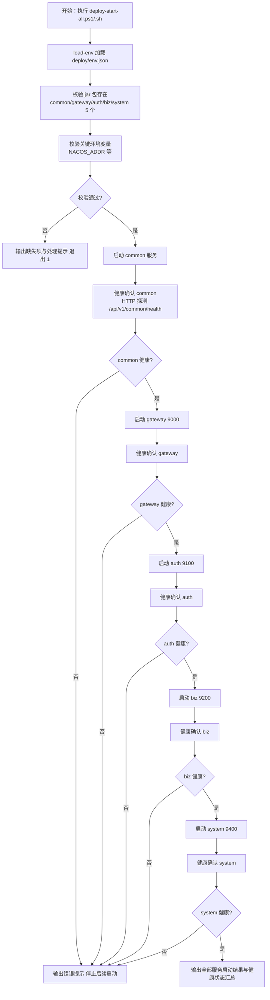

### 5.2 全服务一键停止流程（deploy-stop-all，含 common）
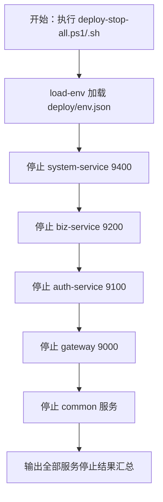

### 5.3 通用配置查询流程
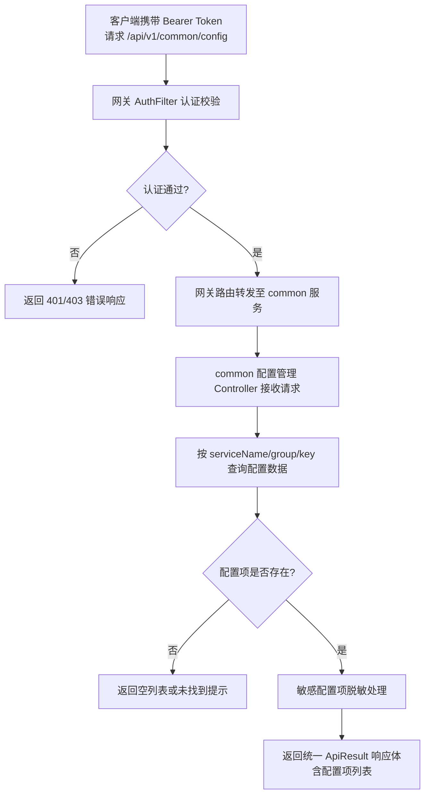

## 6. 数据需求
本版本涉及的数据资产如下：

- **通用配置管理数据**：通用配置管理的配置数据存储方案由详细设计阶段确定（可为数据库表、Nacos 配置中心或 Redis 缓存）。配置项数据结构建议包含以下字段：
  - `id`：配置项唯一标识
  - `serviceName`：微服务名称（gateway/auth/biz/system/common）
  - `group`：配置分组（业务场景分组）
  - `key`：配置键
  - `value`：配置值
  - `dataType`：数据类型（string/number/boolean/json）
  - `description`：配置描述
  - `sensitive`：是否敏感配置（敏感配置查询时脱敏）
  - `createTime` / `updateTime`：时间戳
- **配置数据覆盖范围**：gateway、auth-service、biz-service、system-service、common 五个微服务的全部运行时配置（启动环境变量除外）；
- **Nacos 注册数据**：cloudoffice-common 服务实例注册信息（服务启动后自动注册到 Nacos）；
- **env.json 配置数据**：新增 cloudoffice-common 相关环境配置项（如端口、Nacos 配置组等），具体键名由详细设计确定；
- **网关路由配置**：新增 `/api/v1/common/**` 路由规则与白名单配置。

## 7. 验收标准
本版本整体验收标准（与用户故事验收标准呼应）：
1. cloudoffice-common 可独立启动并注册到 Nacos，服务名 `cloudoffice-common`，健康检查端点 `GET /api/v1/common/health` 返回 200 与统一 ApiResult 响应体。
2. cloudoffice-common 提供 SpringDoc OpenAPI 文档（分组 `common`），可通过 Swagger UI 在线查看与调试接口。
3. 通用配置管理查询接口 `GET /api/v1/common/config` 与 `GET /api/v1/common/config/{serviceName}` 支持按微服务名称、配置分组、配置键等维度查询运行时配置项，返回统一 ApiResult 响应体；敏感配置项脱敏或排除。
4. 通用配置管理覆盖 gateway/auth/biz/system/common 五个微服务的运行时配置；启动环境变量（NACOS_ADDR、DB_PASSWORD、RSA 密钥等）不纳入通用配置管理范围。
5. 通用配置查询接口经网关 AuthFilter 认证（非白名单端点），需携带合法 Bearer Token；健康检查端点在白名单中，可无 Token 访问。
6. 网关路由配置新增 `/api/v1/common/**` 路由规则，请求可经网关转发至 common 服务；现有 gateway/auth/biz/system 路由规则不受影响。
7. 编译脚本（build-backend）将 cloudoffice-common 纳入编译产物输出范围，生成可部署 jar 包到 deploy 目录；现有服务编译产物输出不受影响。
8. deploy-start-all 脚本按 common → gateway → auth → biz → system 顺序一键启动 5 个后端服务，common 最先启动且健康确认后再启动 gateway；.ps1 与 .sh 双平台行为一致。
9. deploy-stop-all 脚本按 system → biz → auth → gateway → common 逆序停止 5 个后端服务，common 最后停止；.ps1 与 .sh 双平台行为一致。
10. deploy.md 部署文档与 readme.md 已更新，补充 cloudoffice-common 服务化说明、端口分配、启动/停止顺序、健康检查端点、通用配置管理功能介绍。
11. env.json 与 env.example.json 已更新，新增 cloudoffice-common 相关环境配置项；现有配置项不受影响。
12. common 服务化改造不影响现有 gateway/auth/biz/system 对 common 公共模块的 Maven 依赖关系，现有服务编译与运行不受影响。
13. 通用配置管理接口设计预留后续增删改管理能力，接口层与数据层支持平滑扩展。

## 8. 用户故事（User Stories）
### US-001：cloudoffice-common 服务化部署与健康检查
#### 故事描述
作为（运维/部署工程师），我想要（cloudoffice-common 作为独立微服务部署并注册到 Nacos，提供健康检查端点），以便（与其他微服务一样具备服务注册、健康检查与部署运维能力，可通过部署脚本统一管理）。
#### 前置条件
- Nacos 2.3 已启动且网络可达；
- cloudoffice-common jar 包已构建并落位 deploy 目录；
- deploy/env.json 已配置 NACOS_ADDR 等关键项。
#### 验收标准
- [ ] Given cloudoffice-common jar 与环境变量就绪，When 启动 common 服务，Then 服务成功启动并注册到 Nacos（服务名 `cloudoffice-common`）
- [ ] Given common 服务已启动，When 访问 `GET /api/v1/common/health`，Then 返回 200 与统一 ApiResult 响应体（含服务名、状态 UP、版本与时间戳）
- [ ] Given common 服务已启动，When 访问 SpringDoc Swagger UI，Then 可在线查看 common 服务接口文档（分组 `common`）
- [ ] Given common 服务化改造完成，When 编译 gateway/auth/biz/system，Then 现有服务对 common 公共模块的 Maven 依赖关系不受影响，编译与运行正常
#### 边界情况与错误处理
| 场景 | 预期处理 |
| --- | --- |
| Nacos 未启动 | common 服务启动失败，输出 Nacos 连接错误提示 |
| 端口被占用 | 启动失败，提示检查端口占用并指导处理 |
| common jar 缺失 | 部署脚本输出 jar 缺失提示，不启动服务 |
| 现有服务依赖 common 编译失败 | 检查 common 模块变更是否破坏公共类/接口兼容性 |
#### 关联功能编号
F-001、F-002

### US-002：通过通用配置管理接口查询运行时配置
#### 故事描述
作为（后端开发工程师），我想要（通过通用配置管理 API 接口按微服务名称、配置分组、配置键查询运行时配置项），以便（在业务代码中统一获取所需配置，替代硬编码与分散的配置文件查询）。
#### 前置条件
- cloudoffice-common 服务已启动并注册到 Nacos；
- 网关已配置 `/api/v1/common/**` 路由规则；
- 通用配置管理数据已初始化（配置项已录入）；
- 调用方持有合法 Bearer Token。
#### 验收标准
- [ ] Given 携带合法 Bearer Token，When 请求 `GET /api/v1/common/config`，Then 返回全部微服务的运行时配置项列表（统一 ApiResult 响应体）
- [ ] Given 携带合法 Bearer Token，When 请求 `GET /api/v1/common/config/auth-service`，Then 返回 auth-service 微服务的运行时配置项列表
- [ ] Given 携带合法 Bearer Token，When 请求 `GET /api/v1/common/config?serviceName=gateway&group=security`，Then 返回 gateway 微服务 security 分组下的配置项列表
- [ ] Given 配置项中含敏感配置（如密码、密钥类），When 查询返回，Then 敏感配置项脱敏或排除，不暴露明文
- [ ] Given 未携带 Bearer Token 或 Token 无效，When 请求配置查询接口，Then 网关 AuthFilter 返回 401/403 错误响应
- [ ] Given 查询的微服务名称不存在，When 请求 `GET /api/v1/common/config/non-existent`，Then 返回空列表或未找到提示（非 500 错误）
#### 边界情况与错误处理
| 场景 | 预期处理 |
| --- | --- |
| 配置数据为空 | 返回空列表，不报错 |
| 敏感配置项查询 | 脱敏处理（如返回 `****`）或排除不返回 |
| 微服务名称不存在 | 返回空列表或"未找到"提示，非 500 错误 |
| 网关未配置 common 路由 | 请求返回 404，需检查网关路由配置 |
| 配置数据存储不可用 | 返回 500 错误并提示配置存储异常 |
#### 关联功能编号
F-003、F-004、F-005、F-006

### US-003：deploy-start-all 一键启动含 common 的全服务
#### 故事描述
作为（运维/部署工程师），我想要（deploy-start-all 脚本按 common → gateway → auth → biz → system 顺序一键启动全部 5 个后端服务），以便（cloudoffice-common 作为公共依赖与配置提供方最先启动，确保后续服务启动时可通过 Nacos 服务发现获取 common 的配置接口）。
#### 前置条件
- 5 个服务 jar 包已构建并落位 deploy 目录；
- deploy/env.json 已配置 NACOS_ADDR 等关键项；
- 基础设施（MariaDB/Redis/Nacos）已就绪。
#### 验收标准
- [ ] Given 5 个 jar 与关键环境变量就绪，When 执行 `deploy-start-all.ps1`/`.sh`，Then 按 common → gateway → auth → biz → system 顺序逐个启动，common 最先启动且健康确认后再启动 gateway
- [ ] Given common 服务启动失败，When 执行一键启动脚本，Then 输出错误提示并停止后续启动（gateway 及之后服务不启动）
- [ ] Given 全部服务启动成功，When 执行一键启动脚本，Then 输出 5 个服务的启动结果与健康状态汇总，退出码 0
- [ ] Given 某 jar 缺失或关键变量缺失，When 执行一键启动脚本，Then 输出缺失项与处理提示，以非零码退出，不启动任何服务
#### 边界情况与错误处理
| 场景 | 预期处理 |
| --- | --- |
| common 启动失败 | 停止后续服务启动，提示检查 NACOS_ADDR / jar 包 |
| common 健康检查超时 | 按等待重试次数重试，仍失败则输出失败并停止 |
| common 端口被占用 | 提示检查端口占用并指导处理 |
| .ps1 与 .sh 行为不一致 | 以 v0.2.7 脚本体系约定为准对齐 |
#### 关联功能编号
F-001、F-002、F-008

### US-004：deploy-stop-all 一键停止含 common 的全服务
#### 故事描述
作为（运维/部署工程师），我想要（deploy-stop-all 脚本按 system → biz → auth → gateway → common 逆序停止全部 5 个后端服务），以便（cloudoffice-common 作为最后停止的服务，确保其他服务在停止过程中仍可访问配置接口）。
#### 前置条件
- 5 个后端服务正在运行；
- deploy/env.json 已配置。
#### 验收标准
- [ ] Given 5 个服务正在运行，When 执行 `deploy-stop-all.ps1`/`.sh`，Then 按 system → biz → auth → gateway → common 逆序停止，common 最后停止
- [ ] Given 全部服务停止成功，When 执行一键停止脚本，Then 输出 5 个服务的停止结果汇总，退出码 0
- [ ] Given 某服务已停止或不存在进程，When 执行一键停止脚本，Then 跳过该服务并输出提示，不影响其他服务停止
#### 边界情况与错误处理
| 场景 | 预期处理 |
| --- | --- |
| 某服务进程不存在 | 跳过并输出"未运行"提示，继续停止后续服务 |
| 停止命令需要管理员权限 | 输出权限提示，指导以管理员身份执行 |
| .ps1 与 .sh 行为不一致 | 以 v0.2.7 脚本体系约定为准对齐 |
#### 关联功能编号
F-009

### US-005：编译脚本纳入 common 产物输出
#### 故事描述
作为（后端开发工程师），我想要（build-backend 编译脚本将 cloudoffice-common 纳入编译产物输出范围，生成可部署 jar 包到 deploy 目录），以便（common 服务化后可通过编译脚本一键构建出可部署产物）。
#### 前置条件
- cloudoffice-common 模块已完成服务化改造（含启动类、bootstrap.yml、application.yml）；
- Maven 多模块项目结构正常。
#### 验收标准
- [ ] Given common 模块服务化改造完成，When 执行 build-backend 脚本，Then cloudoffice-common jar 包生成并输出到 deploy 目录
- [ ] Given 编译脚本执行完成，When 检查 deploy 目录，Then 存在 common 服务的可执行 jar 包
- [ ] Given 编译脚本执行完成，When 检查现有 gateway/auth/biz/system 产物，Then 现有服务编译产物输出不受影响
#### 边界情况与错误处理
| 场景 | 预期处理 |
| --- | --- |
| common 模块编译失败 | 输出编译错误信息，退出非零 |
| common jar 未输出到 deploy | 检查构建配置的产物输出路径 |
| 现有服务编译受影响 | 检查 common 模块变更是否影响公共依赖 |
#### 关联功能编号
F-007

### US-006：部署文档与 readme 更新
#### 故事描述
作为（运维/部署工程师），我想要（deploy.md 与 readme.md 已更新，补充 cloudoffice-common 服务化说明与通用配置管理功能介绍），以便（了解 common 服务的端口、启动顺序、健康检查端点等部署信息）。
#### 前置条件
- cloudoffice-common 服务化改造完成；
- 部署脚本更新完成。
#### 验收标准
- [ ] Given 文档更新完成，When 查看 deploy.md，Then 服务端口映射表含 cloudoffice-common，启动顺序为 common → gateway → auth → biz → system，停止顺序为 system → biz → auth → gateway → common
- [ ] Given 文档更新完成，When 查看 deploy.md，Then 健康检查端点说明含 `/api/v1/common/health`，环境变量说明含 common 相关配置项
- [ ] Given 文档更新完成，When 查看 readme.md，Then 项目介绍含 common 服务化说明，功能清单含通用配置管理功能介绍
- [ ] Given 文档更新完成，When 检查现有内容，Then 现有 gateway/auth/biz/system 的部署说明与功能介绍未被删除或覆盖
#### 边界情况与错误处理
| 场景 | 预期处理 |
| --- | --- |
| 端口信息遗漏 | 补充 common 服务端口到端口映射表 |
| 启动/停止顺序未更新 | 确保启动顺序含 common 在第一位，停止顺序含 common 在最后一位 |
| 现有内容被覆盖 | 保留现有内容，仅追加或更新 common 相关部分 |
#### 关联功能编号
F-010、F-011

## 9. 版本规划
| 版本号 | 计划内容 | 状态 |
| --- | --- | --- |
| v0.0.1 | 统一认证授权与企业办公微服务化平台底座（基线版本，反推存量代码能力） | 已发布 |
| v0.2.5 | 部署资产集中化（deploy 目录、构建产物与脚本迁移） | 已发布 |
| v0.2.6 | 部署与配置缺陷修复：bootstrap 依赖引入、RSA 密钥格式契约统一、4 服务启动验证、v0.0.1 基线接口回归闭环 | 已发布 |
| v0.2.7 | 部署脚本体系重构与仓库清洁度治理：环境可用性检查、基础设施一键启动、后端服务按序一键启动、脚本双平台契约对齐、.gitignore 治理 | 已发布 |
| v0.2.8 | cloudoffice-common 服务化改造与通用配置管理接口先行：common 独立部署、Nacos 注册、健康检查、配置查询接口、编译/部署脚本与文档更新 | 本版本 |
| 后续版本 | 通用配置管理增删改接口与后端管理界面；企业信息、人事管理、工作流审批、薪酬管理等业务能力 | 规划中 |

## 10. 附录
### 术语表
| 术语 | 说明 |
| --- | --- |
| common 服务化 | 将 cloudoffice-common 从纯公共 jar 模块改造为可独立部署的 Spring Boot 微服务 |
| 通用配置管理 | 统一管理不同微服务、不同业务场景下所有运行时配置的能力，本版本仅交付查询接口 |
| 运行时配置 | 微服务运行期间所需的业务参数、功能开关、限流参数等配置，不含启动环境变量 |
| 启动环境变量 | 由 deploy/env.json 注入的启动参数（NACOS_ADDR、DB_PASSWORD、RSA 密钥等），不纳入通用配置管理范围 |
| 配置分组 | 按业务场景对配置项进行分组管理的逻辑维度（如 security、business、rate-limit 等） |
| 敏感配置项 | 包含密码、密钥等敏感信息的配置项，查询接口返回时需脱敏或排除 |
| 部署顺序（含 common） | 后端服务按依赖顺序启动：common → gateway（9000）→ auth（9100）→ biz（9200）→ system（9400）；停止逆序 |
| 配置接口先行 | 本版本仅实现配置查询接口，增删改接口与后端管理界面在后续版本迭代 |

### 参考文档
- 用户需求说明书 v0.2.8：docs/cso-v0.2.8/cso-urs-v0.2.8.md
- 主文档 PRD：docs/cso-prd.md（v0.0.1 基线 / v0.2.5 / v0.2.6 / v0.2.7 版本）
- 系统架构设计：docs/sad.md（微服务架构、模块依赖关系、ADR 记录）
- 部署指南：deploy/deploy.md（服务端口映射、启动顺序、命令汇总）
- 构建方案：deploy/build.md（编译脚本、产物输出）
- 环境配置模板：deploy/env.example.json、deploy/env.json
- 现有脚本：deploy/scripts/（deploy-start-all、deploy-stop-all、build-backend、load-env 等）
- 项目说明：readme.md

<!-- SPDX-License-Identifier: Apache-2.0 / Copyright 2026 jenemy8023 <jenemy8023@163.com> -->