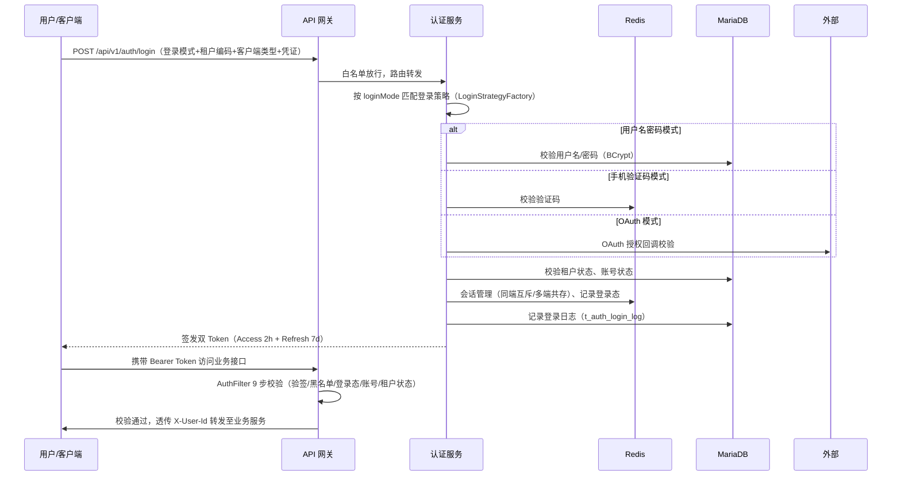
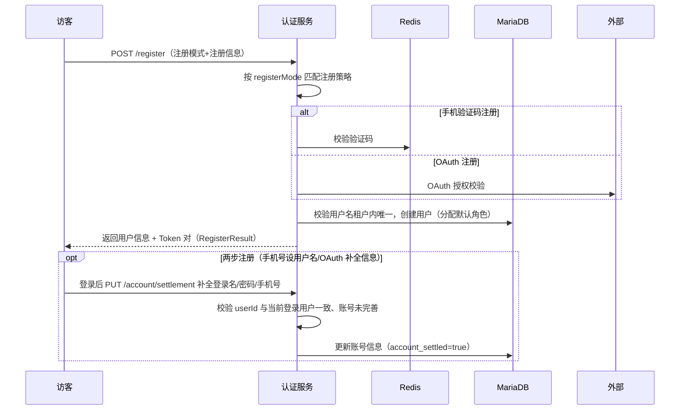
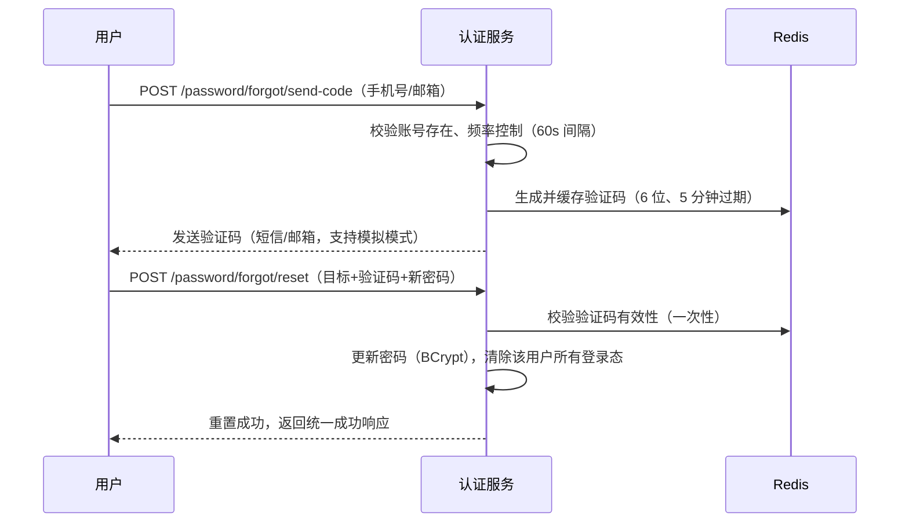
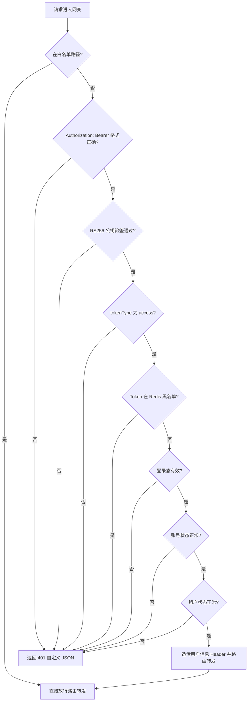

# 产品需求文档（PRD）
**项目名称**：云漫智企（CloudStrollOffice）
**版本号**：v0.0.1（初始化归档版本，对应实际业务版本 v0.1.6）
**日期**：2026-08-05
**编写人**：BA

## 1. 产品背景
### 1.1 项目背景
云漫智企（CloudStrollOffice）是基于 Java 21 + Spring Boot 3.2.x + Spring Cloud 2023.x 技术栈构建的微服务企业办公套件，采用 Maven 多模块架构，由公共模块（common）、API 网关（gateway）、认证服务（auth-service）、企业服务（biz-service）、系统服务（system-service）及 Flutter 客户端（flutter-app）组成，为中小型企业提供企业信息管理、人事管理、工作流审批、薪酬管理、统一认证授权等一站式综合服务能力。

本项目为**存量项目初始化归档**：业务版本 v0.1.6 已实现 RBAC 多租户权限模型、JWT RS256 双 Token 认证、网关全局认证拦截、多模式登录注册（策略工厂模式）、两步注册、密码管理、手机号变更、验证码管理、登录日志审计等核心能力。本次初始化（版本 v0.0.1）对存量代码与文档进行梳理归档，将"用户认证增强"版本（v0.1.6）的全部产品能力反推固化为标准 PRD 文档，作为后续版本迭代的需求基线。

### 1.2 产品目标
- **统一认证入口**：建设基于 API 网关 + 认证服务的统一认证体系，支持 PC 端、H5、Android、iOS、微信小程序等 6 种客户端类型经统一入口登录，实现一次登录、全端通行。
- **多模式登录注册**：支持 4 种登录模式（用户名密码、手机验证码、手机+密码、OAuth 第三方）与 5 种注册模式（用户名密码、手机验证码、OAuth、手机号设用户名、OAuth 补全信息），覆盖员工 PC 办公、移动端快捷登录、第三方账号接入等常见场景；注册流程支持两步注册（先注册后补全信息），降低首次使用门槛。
- **统一权限管理**：建立 RBAC 多租户权限模型（用户-角色-权限三层关联 + 租户隔离），管理员可通过 API 完成用户、角色、权限的维护与分配，用户名在租户内唯一、租户间数据不可见。
- **安全可信的账号生命周期管理**：支持密码修改与密码找回（验证码重置）、手机号变更（原手机可用走短信验证、原手机停用走邮箱验证）、验证码全生命周期管理（生成/发送/校验/频率控制）、登录日志审计，保障账号安全与事后追溯。
- **会话安全与实时管控**：采用 JWT RS256 双 Token（Access Token 2h + Refresh Token 7d，轮换机制）+ Redis 登录态会话管理，支持主动登出、管理员强制踢人实时生效、Token 黑名单防重放。
- **多租户隔离**：租户数据空间相互独立，支持多企业共用一套系统，为 SaaS 化运营奠定基础。

### 1.3 核心设计理念
- **认证与业务解耦**：认证服务独立部署，统一承载登录、注册、Token、会话、密码、验证码能力，业务服务（biz/system）只负责业务逻辑，通过网关透传的用户信息 Header（X-User-Id 等）识别当前用户。
- **策略工厂模式**：登录（4 种）与注册（5 种）均采用策略接口 + 工厂编排模式，新增登录/注册模式只需新增策略实现，不修改主流程代码，具备良好的可扩展性。
- **安全纵深防御**：网关 RS256 验签 + Redis 黑名单 + 登录态/账号/租户状态四重校验；双 Token 轮换防重放；改密/重置/踢人后登录态实时失效；敏感操作全量留痕。
- **统一规范约束**：所有 REST 接口统一返回 `ApiResult<T>`，分页返回 `PageResult<T>`；29 个错误码全覆盖；异常由全局处理器统一封装，不泄露堆栈与内部信息。

## 2. 目标用户
| 用户角色 | 使用场景 | 核心诉求 |
| --- | --- | --- |
| 系统管理员（SUPER_ADMIN） | 初始化系统、创建租户与管理员、维护权限树、全局安全管控 | 管理租户/用户/角色/权限，强制踢人，查看登录日志 |
| 企业管理员 | 员工入离职账号开通/停用、角色与权限分配、强制下线异常账号 | 高效维护本租户员工账号与权限，保障账号安全 |
| 普通员工 | 登录/注册、修改密码、找回密码、更换手机号、完善账号信息、日常办公 | 快捷登录、自主管理账号、账号异常时能自助找回 |
| 访客/未注册用户 | 注册账号（多种模式）、两步注册第二步补全账号信息 | 简单快捷地完成注册并进入系统 |
| OAuth 第三方用户 | 第三方授权登录、第三方账号关联、补全本地账号信息 | 使用微信/Gitee 等账号免密登录 |
| 系统运维人员 | 服务健康检查、查看登录日志、监控认证服务运行状态 | 快速定位服务异常，保障系统可用性 |

## 3. 功能清单
| 功能编号 | 功能名称 | 所属模块 | 优先级 | 版本范围 |
| --- | --- | --- | --- | --- |
| F-001 | 多模式登录 | 认证登录模块 | P0 | v0.0.1 |
| F-002 | 多模式注册 | 认证注册模块 | P0 | v0.0.1 |
| F-003 | 两步注册与账号补全 | 认证注册模块 | P0 | v0.0.1 |
| F-004 | RBAC 权限管理 | 权限管理模块 | P0 | v0.0.1 |
| F-005 | 多租户隔离 | 权限管理模块 | P0 | v0.0.1 |
| F-006 | 网关统一认证 | 网关认证模块 | P0 | v0.0.1 |
| F-007 | JWT RS256 双 Token | 会话安全模块 | P0 | v0.0.1 |
| F-008 | 会话管理 | 会话安全模块 | P0 | v0.0.1 |
| F-009 | 密码管理 | 账号安全模块 | P0 | v0.0.1 |
| F-010 | 手机号变更 | 账号安全模块 | P1 | v0.0.1 |
| F-011 | 验证码管理 | 验证码模块 | P0 | v0.0.1 |
| F-012 | 登录日志审计 | 安全审计模块 | P1 | v0.0.1 |
| F-013 | 统一响应与异常处理 | 公共支撑模块 | P0 | v0.0.1 |
| F-014 | 健康检查 | 运维支撑模块 | P1 | v0.0.1 |
| F-015 | 企业服务骨架 | 企业服务模块 | P2 | v0.0.1 |
| F-016 | 系统服务骨架 | 系统服务模块 | P2 | v0.0.1 |
| F-017 | Flutter 客户端认证模块 | 客户端模块 | P1 | v0.0.1 |

> 功能清单与 URS 需求一一映射：F-001~F-017 分别对应 URS 中 FR-001~FR-017。

## 4. 详细功能描述
### 4.1 多模式登录（F-001）
#### 功能描述
用户在客户端（PC/H5/App/小程序等）选择登录模式完成认证，登录成功签发双 Token（Access Token + Refresh Token）。支持 4 种登录模式：用户名密码（USERNAME_PASSWORD）、手机验证码（PHONE_CODE）、手机+密码（PHONE_PASSWORD）、OAuth 第三方授权（OAUTH）。登录请求必须携带租户编码（tenantCode）与客户端类型（clientType，6 种：Windows/Ubuntu/H5/Android/iOS/WeChatMini）。登录流程由 AuthenticationService 统一编排，按 loginMode 路由至 LoginStrategyFactory 匹配的登录策略执行。
#### 业务规则
- 登录执行 13 步完整流程：参数校验 → 按策略获取用户 → 密码/验证码/OAuth 校验 → 租户状态校验 → 账号状态校验 → 会话管理（同端互斥、多端共存）→ 签发双 Token。
- 同一客户端类型重复登录会顶掉旧会话（同端互斥）；不同客户端类型可多端共存。
- 登录失败（密码错误、账号封禁、租户停用、验证码错误）必须记录登录日志并返回明确错误提示（统一错误码）。
- 登录/刷新端点属于网关白名单，无需 Token 即可访问。
#### 页面原型说明（或原型图位置）
PC 端/移动端登录页面见 Flutter 客户端 `lib/features/auth/screens/login_screen.dart`（原型图位置后续版本补充，接口定义见 AuthController#login）。

### 4.2 多模式注册与两步注册（F-002 / F-003）
#### 功能描述
支持 5 种注册模式：用户名密码（USERNAME）、手机验证码（PHONE_CODE）、OAuth 第三方（OAUTH）、手机号设用户名（PHONE_SET_USERNAME）、OAuth 补全信息（OAUTH_SET_INFO）。注册成功分配默认角色并返回用户信息 + Token 对。两步注册机制：第一步先注册获取账号（账号状态为未完善 account_settled=false），用户首次登录后通过完善账号信息接口（PUT /api/v1/auth/account/settlement）补全登录名、密码、手机号，补全成功后账号状态转为已完善。
#### 业务规则
- 用户名在租户内唯一（唯一索引约束），重复注册返回业务错误。
- 手机验证码注册需校验验证码有效性（用途 PASSWORD_VERIFICATION 与注册用途校验）。
- 注册成功直接返回 Token 对（RegisterResult：用户信息 + 双 Token），登录后即可使用系统。
- 账号补全接口需登录态访问，且校验请求中的 userId 与当前登录用户一致，账号已完善时不可重复补全。
- 注册接口属于网关白名单。
#### 页面原型说明（或原型图位置）
注册页面与账号补全页面见 Flutter 客户端 `lib/features/auth/screens/register_screen.dart`（原型图位置后续版本补充，接口定义见 AuthController#register / accountSettlement）。

### 4.3 RBAC 权限管理（F-004 / F-005）
#### 功能描述
建立用户-角色-权限三层关联的多租户权限模型，租户数据空间相互独立、用户名在租户内唯一、租户间数据不可见。提供三类管理 API：
- **用户管理**（UserController）：用户分页列表（GET /users）、用户详情（GET /users/{id}）、更新用户信息（PUT /users/{id}）、更新用户状态-封禁/解封（PUT /users/{id}/status）、分配用户角色（PUT /users/{id}/roles）、删除用户（DELETE /users/{id}）。
- **角色管理**（RoleController）：角色列表（GET /roles）、创建（POST /roles）、更新（PUT /roles/{id}）、删除（DELETE /roles/{id}）、分配角色权限（PUT /roles/{id}/permissions）。
- **权限管理**（PermissionController）：权限树形列表（GET /permissions）、创建（POST /permissions）、更新（PUT /permissions/{id}）、删除（DELETE /permissions/{id}）。
#### 业务规则
- 用户-角色、角色-权限均为多对多关联，通过关联表维护。
- 权限以树形结构组织（PermissionVO 树形视图），便于分级管理。
- 账号封禁后所有登录态实时失效（网关校验账号状态缓存拦截）。
- 以上接口均需认证（网关校验 Token），由管理员角色操作。
#### 页面原型说明（或原型图位置）
管理端页面后续版本实现（本版本提供 REST API，Swagger 在线调试：/swagger-ui.html）。

### 4.4 网关统一认证（F-006）
#### 功能描述
API 网关（Spring Cloud Gateway，端口 9000）通过全局过滤器 AuthFilter 对所有转发请求执行统一认证拦截，共 9 步校验：白名单放行 → Bearer 格式校验 → RS256 公钥验签 → tokenType 校验 → Redis 黑名单检查 → 登录态校验 → 账号状态校验 → 租户状态校验 → 用户信息 Header 透传。
#### 业务规则
- 白名单路径（登录/注册/刷新/发送验证码/密码找回/健康检查等）直接放行，其余路径必须携带合法 Access Token。
- 请求头必须为 `Authorization: Bearer <token>` 格式，否则返回 401 自定义 JSON。
- 校验通过后将用户信息（X-User-Id 等 Header）透传给下游服务，下游服务据此识别当前用户。
- Token 过期、被踢、黑名单命中等情况由网关返回标准 401 JSON 响应，403 输出自定义 JSON。
- 网关通过 Nacos 服务发现路由转发至 auth/biz/system 服务。
#### 页面原型说明（或原型图位置）
网关为基础设施层，无页面。

### 4.5 JWT RS256 双 Token 与会话管理（F-007 / F-008）
#### 功能描述
采用 RSA 2048 位密钥对的 JWT RS256 非对称签名体系：Access Token 有效期 2 小时、Refresh Token 有效期 7 天。刷新接口（POST /refresh）使用 Refresh Token 换发新的双 Token 对（轮换机制），旧 Refresh Token 加入黑名单防止重放。会话管理基于 Redis：登录态会话、Token 黑名单、账号/租户状态缓存。支持主动登出（POST /logout，幂等）与管理员强制踢人（POST /kickout，可指定客户端类型踢指定端，或不指定踢所有端），实时生效。
#### 业务规则
- Access Token 携带用户 ID、登录名、租户编码、客户端类型、tokenType 等声明，签名使用私钥，验签使用公钥。
- 刷新后旧 Refresh Token 立即失效（黑名单），防止重放攻击。
- 踢人后目标用户的 Access Token 立即失效（黑名单实时校验生效）。
- 登出为幂等操作，重复登出返回成功。
#### 页面原型说明（或原型图位置）
无独立页面，由客户端拦截器自动处理 Token 注入与刷新（见 Flutter ApiInterceptor）。

### 4.6 密码管理（F-009）
#### 功能描述
- **修改密码**（PUT /password/change，需登录）：校验旧密码正确性，新密码满足 8-64 位策略，修改成功后清除该用户所有登录态会话（需重新登录）。
- **密码找回**（POST /password/forgot/send-code + /password/forgot/reset，白名单）：通过手机短信或邮箱发送重置验证码（60 秒频率限制、5 分钟过期），校验验证码后重置密码，重置后清除所有登录态。
#### 业务规则
- 密码使用 BCrypt 加密存储，禁止明文；日志禁止输出密码。
- 密码长度默认 8-64 位（PASSWORD_MIN_LENGTH/PASSWORD_MAX_LENGTH 可配置）。
- 密码修改/重置成功后强制清除全部登录态，保证账号安全。
- 找回密码的目标（手机号/邮箱）需对应用户存在，否则返回用户不存在错误。
#### 页面原型说明（或原型图位置）
修改密码与找回密码页面见 Flutter 客户端 `lib/features/auth/screens/forgot_password_screen.dart`（原型图位置后续版本补充）。

### 4.7 手机号变更（F-010）
#### 功能描述
当前登录用户更换绑定手机号（PUT /phone/change，需登录）：
- **原手机可用**：通过原手机短信验证码验证后变更（校验验证码与旧手机号匹配）。
- **原手机停用**：通过已绑定邮箱验证码验证后变更。
#### 业务规则
- 新手机号在租户内不可与其他用户重复。
- 验证码须校验用途与目标一致性，防止验证码滥用。
- 变更成功后更新用户手机号及手机验证状态（phone_verified）。
#### 页面原型说明（或原型图位置）
原型图位置后续版本补充。

### 4.8 验证码管理（F-011）
#### 功能描述
提供验证码生成、发送、校验、频率控制与生命周期管理（VerificationCodeManager + VerificationCodeService），支持短信（SMS）与邮箱（EMAIL）两种发送方式，支持注册、登录、重置密码、更换手机号等多种用途（purpose）。发送端点为白名单：POST /api/v1/auth/verification-code/send。
#### 业务规则
- 验证码默认 6 位数字，默认 5 分钟过期（VERIFICATION_CODE_EXPIRE_SECONDS 可配置）。
- 发送频率控制：同一目标同一用途默认 60 秒间隔（VERIFICATION_CODE_SEND_INTERVAL 可配置），超频返回 SMS_SEND_TOO_FREQUENT 错误。
- 开发环境支持模拟模式（VERIFICATION_CODE_MOCK=true，固定验证码直接返回），生产环境必须关闭。
- 校验通过后验证码即时失效（一次性使用）；验证码记录落库（t_auth_verification_code）便于追溯。
#### 页面原型说明（或原型图位置）
验证码输入组件见 Flutter 客户端 `lib/shared/widgets/`（验证码框组件）。

### 4.9 登录日志审计（F-012）
#### 功能描述
登录过程全量记录登录日志（t_auth_login_log）：登录 IP、客户端类型、登录结果（成功/失败）、失败原因，支持安全事件事后追溯。
#### 业务规则
- 登录失败（密码错误、账号封禁、租户停用、Token 失效）必须留痕。
- 验证码发送、改密、踢人等敏感操作记录 INFO 及以上日志，禁止输出密码、Token、验证码等敏感信息。
#### 页面原型说明（或原型图位置）
日志查询页面后续版本实现，本版本提供数据落库与接口查询基础。

### 4.10 统一响应、健康检查与服务骨架（F-013 ~ F-016）
#### 功能描述
- **统一响应**：所有 REST 接口统一返回 `ApiResult<T>`（code/message/data/timestamp），分页接口返回 `PageResult<T>`；全局异常处理器（@RestControllerAdvice）统一捕获 10+ 类异常，29 个错误码全覆盖，401/403 输出自定义 JSON。
- **健康检查**：auth/biz/system 服务提供 GET /api/v1/{module}/health，返回服务名、状态、版本、时间戳。
- **企业服务骨架**（biz-service，端口 9200）：企业信息管理、人事管理模块骨架预留，健康检查就绪。
- **系统服务骨架**（system-service，端口 9400）：系统配置、日志、监控、定时任务模块骨架预留，健康检查就绪。
#### 业务规则
- 异常响应 100% 封装为标准 ApiResult，兜底不泄露堆栈与内部信息。
- 骨架服务不承载业务功能，后续版本逐步填充。
#### 页面原型说明（或原型图位置）
无页面。

### 4.11 Flutter 客户端认证模块（F-017）
#### 功能描述
移动端认证能力：登录/注册/找回密码页面；HTTP 客户端 Token 注入与刷新拦截器（ApiInterceptor）；Token 安全存储（SecureStorage）；输入校验（密码强度、手机号、邮箱等，见 validators.dart）。
#### 业务规则
- 401 响应自动触发 Token 刷新重试；刷新失败跳转登录页。
- Token 存储于安全存储，禁止明文落盘。
- 密码强度校验对齐后端策略（8-64 位）。
#### 页面原型说明（或原型图位置）
Flutter 页面源码：`lib/features/auth/screens/`（login/register/forgot_password），通用组件在 `lib/shared/widgets/`。

## 5. 业务流程图

### 5.1 登录流程（多模式登录）

### 5.2 注册与账号补全流程（两步注册）

### 5.3 密码找回流程

### 5.4 网关认证校验流程（AuthFilter 9 步）

## 6. 数据需求
本版本涉及 MariaDB 认证库（cloudstroll_office_auth）9 张业务表与 Redis 缓存数据：

| 实体/表名 | 说明 | 关键数据项 |
| --- | --- | --- |
| t_auth_tenant | 租户表（多租户隔离） | 租户编码（唯一）、租户名称、状态 |
| t_auth_user | 用户表（租户内登录名唯一） | 登录名、密码（BCrypt）、用户名、手机号、邮箱、租户 ID、状态、注册模式（register_mode）、账号是否完善（account_settled）、手机/邮箱验证状态、最近密码修改时间 |
| t_auth_role | 角色表（租户内编码唯一） | 角色编码、角色名称、租户 ID、状态 |
| t_auth_permission | 权限表（树形结构组织） | 权限编码、权限名称、父权限 ID、类型、排序 |
| t_auth_user_role | 用户-角色关联表（多对多） | 用户 ID、角色 ID |
| t_auth_role_permission | 角色-权限关联表（多对多） | 角色 ID、权限 ID |
| t_auth_login_log | 登录日志审计表 | 用户 ID、登录 IP、客户端类型、登录结果、失败原因、时间 |
| t_auth_oauth_account | OAuth 第三方账号关联表（v0.1.6 新增） | 用户 ID、OAuth 提供商、第三方唯一标识、绑定时间 |
| t_auth_verification_code | 验证码记录表（v0.1.6 新增） | 目标（手机号/邮箱）、发送方式、用途、验证码、过期时间、是否已使用 |

Redis 缓存数据：登录态会话（用户 ID + 客户端类型）、Token 黑名单、账号状态缓存、租户状态缓存、验证码缓存（含发送频率计数）。初始数据：默认租户 DEFAULT、超级管理员角色 SUPER_ADMIN、管理员账号 admin/admin123（首次登录后应修改）、基础权限数据。

## 7. 验收标准
本版本（v0.0.1 初始化归档，业务版本 v0.1.6）整体验收标准如下：

| 编号 | 验收项 | 验收标准 |
| --- | --- | --- |
| AC-001 | 多模式登录 | 4 种登录模式（用户名密码/手机验证码/手机+密码/OAuth）均可成功登录并签发双 Token；指定 6 种客户端类型；同端互斥、多端共存；登录失败返回明确错误并留痕 |
| AC-002 | 多模式注册 | 5 种注册模式均可成功注册并分配默认角色、返回用户信息与 Token 对；用户名在租户内唯一；验证码注册校验验证码有效性 |
| AC-003 | 两步注册 | 两步注册用户首次登录后可调用账号补全接口完善登录名/密码/手机号，补全后账号状态转为已完善；重复补全与越权补全被拒绝 |
| AC-004 | RBAC 权限管理 | 用户/角色/权限 CRUD 与分配接口可用；用户-角色、角色-权限多对多关联正确；权限树形结构返回正确 |
| AC-005 | 多租户隔离 | 不同租户数据不可见；用户名在租户内唯一；账号/租户状态变更后网关校验实时生效 |
| AC-006 | 网关统一认证 | AuthFilter 9 步校验正确：白名单放行、非法/伪造/过期 Token 返回 401 JSON、用户信息 Header 正确透传 |
| AC-007 | 双 Token 与刷新 | Access Token 2h、Refresh Token 7d 生效；刷新轮换后旧 Refresh Token 失效（防重放） |
| AC-008 | 会话管理 | 主动登出幂等成功；管理员强制踢人后目标 Token 立即失效（指定端/所有端） |
| AC-009 | 密码管理 | 修改密码校验旧密码、成功后清除所有登录态；密码找回经验证码重置成功后清除所有登录态 |
| AC-010 | 手机号变更 | 原手机可用时短信验证变更、原手机停用时邮箱验证变更；新手机号不可与其他用户冲突 |
| AC-011 | 验证码管理 | 6 位数字、5 分钟过期、60 秒频率限制、一次性校验；模拟模式开发可用、生产关闭 |
| AC-012 | 统一响应与错误码 | 全部接口返回 ApiResult 标准结构；29 个错误码正确对应；401/403 输出自定义 JSON；异常不泄露堆栈 |
| AC-013 | 健康检查 | 3 个服务 /health 返回服务名、状态、版本、时间戳 |
| AC-014 | 测试与部署 | 认证服务单元测试 206+ 个全部通过；Docker Compose 一键编排 8 个容器启动成功 |
| AC-015 | 客户端认证 | Flutter 登录/注册/找回密码页面可用；Token 注入与刷新拦截正常；输入校验生效 |

## 8. 用户故事（User Stories）
### US-001：员工多模式登录
#### 故事描述
作为普通员工，我想要使用用户名密码、手机验证码、手机+密码或第三方账号等多种方式登录系统，以便我在不同场景下都能快捷安全地进入办公系统。
#### 前置条件
账号已注册且状态正常；租户状态正常；网关与认证服务已部署。
#### 验收标准
- [ ] Given 账号密码正确且租户/账号状态正常 When 提交用户名密码登录 Then 返回双 Token 并成功进入系统
- [ ] Given 手机号已绑定 When 提交手机验证码登录 Then 校验验证码通过后签发双 Token
- [ ] Given 同客户端类型已登录 When 再次登录 Then 旧会话被顶掉（同端互斥）
- [ ] Given 不同客户端类型已登录 When 再次登录 Then 新旧会话共存（多端共存）
- [ ] Given 密码错误/账号封禁/租户停用 When 提交登录 Then 返回明确错误提示并记录登录日志
#### 边界情况与错误处理
| 场景 | 预期处理 |
| --- | --- |
| 密码错误 | 返回 AUTH 错误码与提示，记录失败日志 |
| 账号被封禁 | 返回账号状态异常错误，禁止登录 |
| 租户停用 | 返回租户状态异常错误，禁止登录 |
| 验证码错误/过期 | 返回验证码校验失败错误 |
#### 关联功能编号
F-001、F-005、F-007、F-011、F-012

### US-002：新用户多模式注册与账号补全
#### 故事描述
作为访客/未注册用户，我想要通过用户名密码、手机验证码或第三方账号注册，并在两步注册场景下先进入系统再补全账号信息，以便降低首次使用门槛。
#### 前置条件
租户已创建；验证码服务可用（或开启模拟模式）。
#### 验收标准
- [ ] Given 用户名未占用 When 提交用户名密码注册 Then 创建账号、分配默认角色并返回 Token 对
- [ ] Given 手机验证码正确 When 提交手机验证码注册 Then 注册成功并返回 Token 对
- [ ] Given 两步注册用户首次登录 When 调用账号补全接口 Then 登录名/密码/手机号更新成功且账号状态转为已完善
- [ ] Given 账号已完善 When 再次调用账号补全接口 Then 拒绝重复补全
#### 边界情况与错误处理
| 场景 | 预期处理 |
| --- | --- |
| 用户名已被占用 | 返回用户名唯一性错误 |
| 验证码无效/过期 | 返回验证码校验失败错误 |
| 补全账号用户 ID 不匹配 | 返回"用户 ID 不匹配"业务错误 |
#### 关联功能编号
F-002、F-003、F-011

### US-003：管理员维护 RBAC 权限
#### 故事描述
作为企业管理员，我想要管理本租户的用户、角色与权限并为其分配关系，以便员工按职责获得合适的系统访问权限。
#### 前置条件
具有管理员角色；拥有合法 Access Token。
#### 验收标准
- [ ] Given 管理员已登录 When 分页查询用户/角色/权限列表 Then 返回分页或树形数据
- [ ] Given 管理员操作 When 创建/更新/删除用户、角色、权限 Then 操作生效且返回统一成功响应
- [ ] Given 管理员操作 When 为用户分配角色、为角色分配权限 Then 多对多关联正确保存
- [ ] Given 目标用户被封禁 When 其携带 Token 访问接口 Then 网关返回 401/403 拦截
#### 边界情况与错误处理
| 场景 | 预期处理 |
| --- | --- |
| 删除被引用角色/权限 | 返回业务冲突错误，阻止误删 |
| 非管理员调用管理接口 | 网关/服务层鉴权拦截 |
#### 关联功能编号
F-004、F-005、F-006

### US-004：密码修改与找回
#### 故事描述
作为普通员工，我想要在记得旧密码时修改密码、在忘记密码时通过验证码找回，以便保障账号安全与可用性。
#### 前置条件
账号已注册；验证码服务可用（或开启模拟模式）。
#### 验收标准
- [ ] Given 旧密码正确且新密码符合策略 When 提交修改密码 Then 更新密码并清除所有登录态
- [ ] Given 旧密码错误 When 提交修改密码 Then 返回旧密码错误提示
- [ ] Given 目标账号存在 When 申请找回密码验证码 Then 验证码发送成功（频率受控）
- [ ] Given 验证码正确 When 提交重置密码 Then 重置成功并清除所有登录态
#### 边界情况与错误处理
| 场景 | 预期处理 |
| --- | --- |
| 新密码不符合 8-64 位策略 | 返回密码策略错误 |
| 找回目标账号不存在 | 返回用户不存在错误 |
| 验证码发送超频 | 返回发送过于频繁错误 |
#### 关联功能编号
F-009、F-011

### US-005：管理员强制踢人
#### 故事描述
作为系统管理员/企业管理员，我想要强制指定用户下线（指定端或所有端），以便及时管控异常账号。
#### 前置条件
管理员已登录且具有踢人权限；目标用户在线。
#### 验收标准
- [ ] Given 管理员已登录 When 指定用户 ID 与客户端类型踢人 Then 目标用户该端会话立即失效
- [ ] Given 管理员已登录 When 指定用户 ID 不指定端踢人 Then 目标用户所有端会话立即失效
- [ ] Given 目标 Token 已被踢 When 其继续访问接口 Then 网关黑名单校验拦截返回 401
#### 边界情况与错误处理
| 场景 | 预期处理 |
| --- | --- |
| 目标用户不存在/未在线 | 操作仍成功（幂等语义）或返回明确提示 |
#### 关联功能编号
F-006、F-008

### US-006：验证码发送与校验
#### 故事描述
作为用户，我想要在注册、登录、找回密码、更换手机号等场景中获取并输入验证码，以便完成身份校验。
#### 前置条件
验证码服务配置正确（真实或模拟模式）。
#### 验收标准
- [ ] Given 未超频 When 请求发送验证码 Then 生成 6 位数字验证码并按短信/邮箱方式发送
- [ ] Given 同一目标同一用途 When 60 秒内再次请求发送 Then 返回发送过于频繁错误
- [ ] Given 验证码已发送且未过期 When 提交校验 Then 校验通过且验证码即时失效（一次性）
- [ ] Given 验证码错误或过期 When 提交校验 Then 返回校验失败错误
#### 边界情况与错误处理
| 场景 | 预期处理 |
| --- | --- |
| 验证码过期（>5 分钟） | 返回验证码已过期错误 |
| 验证码错误次数超限 | 按错误码返回，保障防爆破 |
#### 关联功能编号
F-011

## 9. 版本规划
| 版本号 | 计划内容 | 状态 |
| --- | --- | --- |
| v0.0.1 | 初始化归档版本：存量项目文档归档，反推固话 URS/PRD/SAD/DBD/API/LLD 需求基线，对应实际业务版本 v0.1.6（多模式登录注册、两步注册、RBAC 权限、密码管理、手机号变更、验证码管理、网关统一认证） | 本版本 |
| v0.2.0（规划） | 企业/部门/员工 CRUD、系统配置管理、消息通知 | 未开始 |
| v0.3.0（规划） | 工作流审批、考勤管理、云资源管理、消息队列集成 | 未开始 |
| v0.4.0（规划） | 薪酬管理、报表统计、审计日志、定时任务、缓存集成 | 未开始 |

## 10. 附录
### 术语表
| 术语 | 说明 |
| --- | --- |
| URS | 用户需求说明书（User Requirements Specification），本 PRD 的上游需求依据 |
| RBAC | 基于角色的访问控制（Role-Based Access Control），用户-角色-权限三层关联模型 |
| JWT RS256 | JSON Web Token 使用 RSA 非对称密钥的 SHA-256 签名算法 |
| Access Token | 访问令牌，有效期 2 小时，用于访问受保护资源 |
| Refresh Token | 刷新令牌，有效期 7 天，用于轮换换取新的双 Token 对 |
| 租户（Tenant） | 多租户模型中的独立数据空间，租户间数据隔离 |
| 白名单 | 网关无需 Token 即可访问的接口路径集合 |
| 同端互斥 | 同一客户端类型只保留最新会话，重复登录顶掉旧会话 |
| 多端共存 | 不同客户端类型可同时在线互不影响 |
| 两步注册 | 先注册获取账号、登录后补全登录名/密码/手机号的注册机制 |
| OAuth | 开放授权协议，本版本对接微信、Gitee 等第三方提供商 |
| BCrypt | 密码散列算法，用于密码加密存储，防彩虹表攻击 |
| 模拟验证码 | 开发环境开关（VERIFICATION_CODE_MOCK=true）下直接返回固定验证码 |

### 参考文档
- 用户需求说明书：docs/cso-urs.md（17 条功能需求 FR-001~FR-017、10 条非功能需求 NFR-001~NFR-010）
- 项目主文档：docs/project.md（项目基本信息、编码规范、项目地图）
- 项目 README：README.md（功能特性、接口列表、部署说明）
- 数据库设计文档：docs/cso-dbd.md（9 张业务表结构）
- 系统架构设计文档：docs/cso-sad.md
- API 接口文档：docs/cso-api.md
- 认证服务源码：cloudoffice-auth-service（AuthController/UserController/RoleController/PermissionController 等）

<!-- SPDX-License-Identifier: Apache-2.0 / Copyright 2026 jenemy8023 <jenemy8023@163.com> -->
