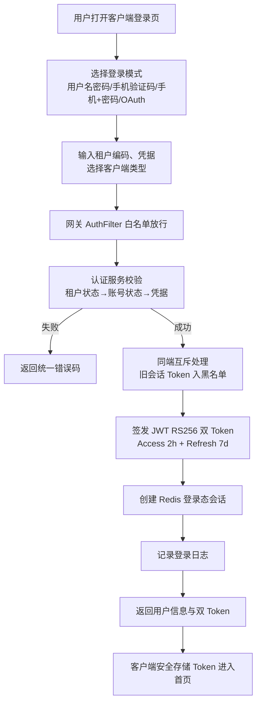
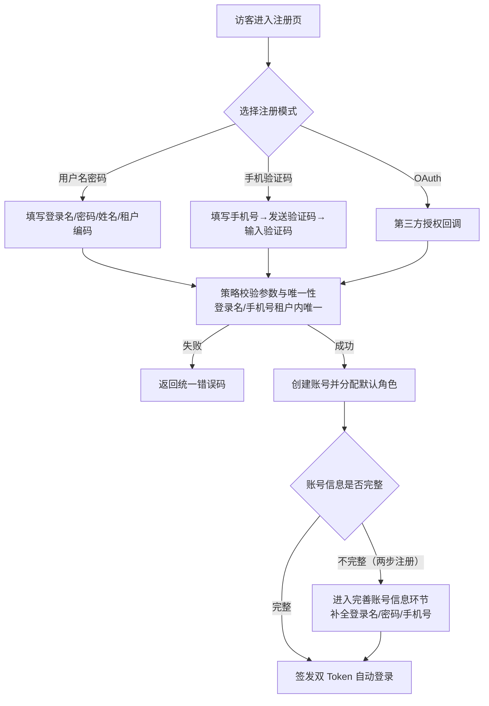
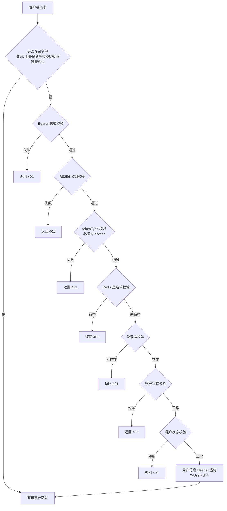
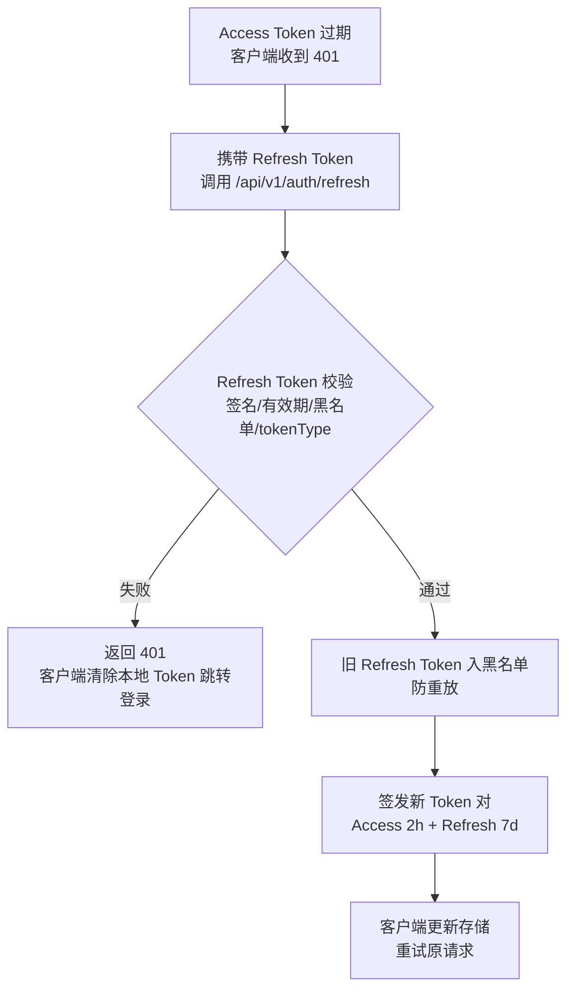
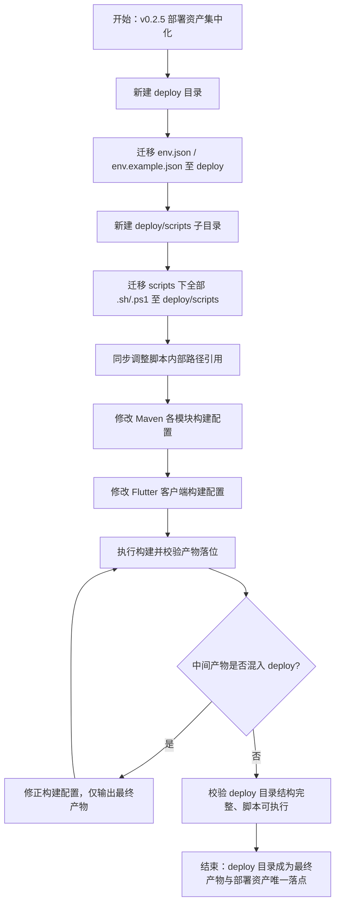
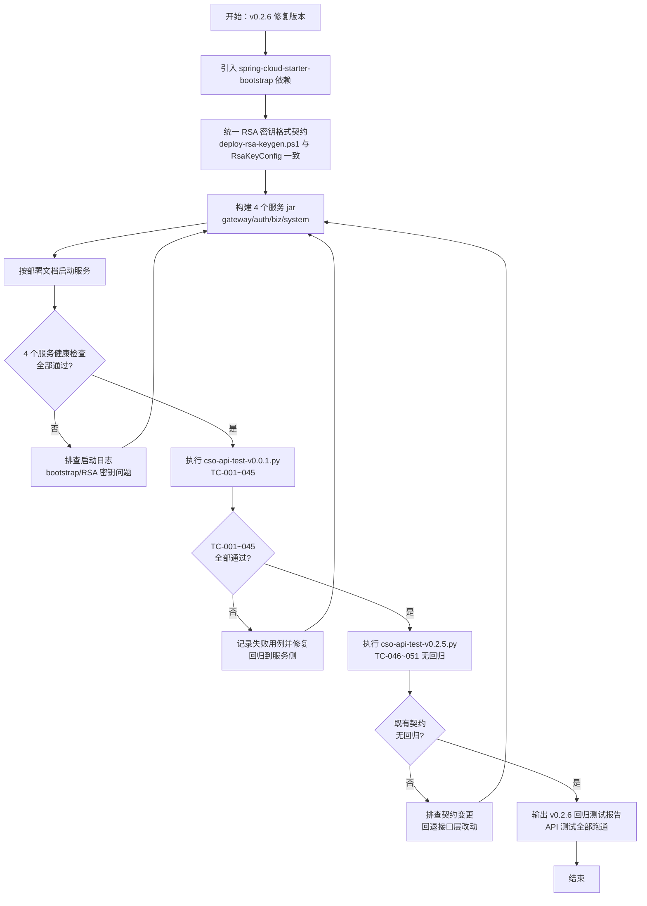

# 产品需求文档（PRD）
**项目名称**：云漫智企（CloudStrollOffice）
**版本号**：0.0.1
**日期**：2026-08-07
**编写人**：BA

## 1. 产品背景
### 1.1 项目背景
云漫智企（CloudStrollOffice）是基于 Java 21 + Spring Boot 3.2.x + Spring Cloud 2023.x 技术栈构建的微服务企业办公套件，采用 Maven 多模块后端微服务集群（公共模块 common、API 网关 gateway、认证服务 auth-service、企业服务 biz-service、系统服务 system-service）+ Flutter 多端客户端（Web 与 Windows 双平台）的架构形态。企业办公软件普遍面临账号体系分散、登录方式单一、多端体验割裂、权限管理粗放等问题，本版本（v0.0.1 初始化基线，对应存量代码 v0.1.6 能力）聚焦"统一认证授权"这一平台底座，为后续企业信息管理、人事管理、工作流审批、薪酬管理等业务版本提供可扩展的微服务基础。

### 1.2 产品目标
- **G1 统一认证入口**：为企业员工、管理员及第三方系统提供统一身份认证能力，支持 6 种客户端类型（Windows/Ubuntu/H5/Android/iOS/微信小程序）通过同一套账号体系混合登录，实现"一次认证、多端通行"。
- **G2 多模式登录/注册**：支持用户名密码、手机验证码、手机+密码、OAuth 第三方共 4 种登录模式，以及用户名密码、手机验证码、OAuth 等共 5 种注册策略（含两步注册），降低用户进入门槛。
- **G3 多租户权限隔离**：基于 RBAC（用户-角色-权限）模型实现多租户数据隔离，租户内用户名唯一、租户间数据不可见，满足多企业共用一套系统的 SaaS 场景。
- **G4 安全会话与访问控制**：基于 JWT RS256 双 Token（Access Token 2 小时 + Refresh Token 7 天 + 轮换机制）与 Redis 会话管理，实现登录态实时可控（登出、强制踢人、密码重置后全端下线），网关统一 9 步认证拦截。
- **G5 账号安全自助能力**：提供密码修改、密码找回（短信/邮箱验证码）、手机号变更、账号信息补全等自助服务，减少管理员干预。
- **G6 业务骨架就绪**：认证服务完整可用（9 张数据表、12 个认证端点、8 个用户/角色/权限管理端点），企业服务与系统服务骨架搭建完成，为后续业务版本迭代提供可扩展底座。
- **G7 客户端多端可用**：Flutter 客户端支持 Web 与 Windows 双平台，提供登录、注册、忘记密码等核心认证页面，可直接对接后端认证服务。

### 1.3 核心设计理念
- **统一底座、渐进迭代**：以认证授权为平台底座先行交付，业务能力（企业信息、人事、工作流、薪酬）按版本渐进填充，模块间只依赖 common、禁止互相依赖，保证可独立部署与横向扩展。
- **策略化、可编排**：登录/注册采用策略工厂模式（LoginStrategy/RegisterStrategy），新增登录或注册方式只需新增策略实现，不影响既有流程；认证编排服务（AuthenticationService）统一编排登录注册主流程。
- **安全纵深、实时可控**：网关统一认证拦截 + 服务端双 Token 轮换 + Redis 会话/黑名单/状态缓存 + BCrypt 密码加密，登出/踢人/密码重置实时生效，安全事件可审计追溯。
- **多端一致、开箱即用**：客户端与后端共用同一套 API 契约（ApiResult 统一响应体、29 个统一错误码），Token 安全存储，网关地址可配置，Docker Compose 一键编排 8 个容器完成部署。

## 2. 目标用户
| 用户角色 | 使用场景 | 核心诉求 |
| --- | --- | --- |
| 终端用户（员工） | 注册账号、多模式登录、Token 自动续期、登出、修改密码、忘记密码找回、更换手机号、补全账号信息 | 多种方式快速登录、账号安全自助、多端无缝切换 |
| 系统管理员 | 用户分页查询与详情查看、创建/更新/删除用户、封禁/解封用户、分配角色、维护角色与权限树、分配角色权限、强制踢人下线 | 高效管理用户与权限、实时管控账号风险 |
| 租户管理员 | 在本租户数据空间内进行用户与权限管理 | 只能查看和操作本租户数据，保证租户隔离 |
| 第三方系统/OAuth 用户 | 通过微信等 OAuth 第三方账号或开放接口接入系统 | 免注册快速登录、授权后补全账号信息 |
| 运维人员 | 通过健康检查端点验证服务可用性，查看登录日志审计，通过 OpenAPI 文档在线调试接口 | 快速定位问题、在线验证接口 |
| 访客（未登录用户） | 发送验证码、注册账号、密码找回（发送验证码/重置密码）等白名单操作 | 无账号也能完成注册与找回流程 |

## 3. 功能清单
| 功能编号 | 功能名称 | 所属模块 | 优先级 | 版本范围 |
| --- | --- | --- | --- | --- |
| F-001 | 用户注册（5 种注册策略 + 两步注册） | auth-service | 高 | v0.0.1 |
| F-002 | 多模式登录（4 种登录策略） | auth-service | 高 | v0.0.1 |
| F-003 | 双 Token 签发与轮换 | auth-service | 高 | v0.0.1 |
| F-004 | 会话管理（登出/强制踢人/黑名单） | auth-service | 高 | v0.0.1 |
| F-005 | 网关全局认证（9 步校验） | gateway | 高 | v0.0.1 |
| F-006 | 密码管理（修改/找回） | auth-service | 高 | v0.0.1 |
| F-007 | 手机号变更 | auth-service | 高 | v0.0.1 |
| F-008 | 验证码管理（生成/发送/校验/频率控制） | auth-service | 高 | v0.0.1 |
| F-009 | RBAC 权限模型（用户-角色-权限） | auth-service | 高 | v0.0.1 |
| F-010 | 多租户隔离 | auth-service | 高 | v0.0.1 |
| F-011 | 用户管理（CRUD/封禁解封/角色分配） | auth-service | 高 | v0.0.1 |
| F-012 | 角色管理（CRUD/权限分配） | auth-service | 高 | v0.0.1 |
| F-013 | 权限管理（树形 CRUD） | auth-service | 高 | v0.0.1 |
| F-014 | 登录日志审计 | auth-service | 中 | v0.0.1 |
| F-015 | 客户端认证页面（Flutter Web/Windows） | cloudoffice-flutter-app | 高 | v0.0.1 |
| F-016 | 健康检查（auth/biz/system） | auth/biz/system | 中 | v0.0.1 |
| F-017 | API 文档（OpenAPI 3 在线调试） | common/auth | 中 | v0.0.1 |
| F-018 | 统一响应与异常体系 | common | 高 | v0.0.1 |
| F-019 | 企业/系统服务骨架 | biz/system | 中 | v0.0.1 |

## 4. 详细功能描述

### 4.1 用户注册（F-001）
#### 功能描述
支持 5 种注册策略（策略工厂模式）：用户名密码注册、手机验证码注册、OAuth 注册、手机号设用户名注册、OAuth 补全信息注册；支持两步注册机制（OAuth/手机号先注册，后续补全登录名、密码、手机号）。注册成功后返回用户信息与双 Token，用户自动登录。
#### 业务规则
- 注册参数校验：用户名密码模式校验登录名、密码（长度 8-64）、姓名、租户编码；手机验证码模式校验手机号与验证码。
- 唯一性校验：登录名/手机号在租户内唯一，重复注册返回 AUTH 类错误码。
- 注册模式由 registerMode 字段区分（USERNAME/PHONE_CODE/OAuth 等），由 RegisterStrategyFactory 分发至对应策略。
- 两步注册：第一步创建账号（状态为未完善），第二步通过"完善账号信息"接口补全登录名、密码、手机号；账号信息不完整（account_settled=false）的用户登录后进入补全环节。
- 新用户注册成功后分配默认角色（如普通用户角色），可正常登录系统。
- 手机验证码模式注册前需先调用验证码发送接口获取验证码，验证码校验后失效。
#### 页面原型说明（或原型图位置）
Flutter 客户端注册页（register_screen.dart）：提供用户名密码注册表单与手机验证码注册表单，含租户编码、登录名、密码、确认密码、手机号、验证码输入框及"发送验证码"按钮；原型图见客户端工程 lib/features/auth/screens/register_screen.dart。

### 4.2 多模式登录（F-002）
#### 功能描述
支持 4 种登录策略（策略工厂模式）：用户名密码登录、手机验证码登录、手机+密码登录、OAuth 第三方登录；支持 6 种客户端类型（Windows/Ubuntu/H5/Android/iOS/WeChatMini）混合登录，执行同端互斥（同一客户端类型只保留最新会话）与多端共存（不同端可同时在线）。
#### 业务规则
- 登录入参：loginMode（登录模式）、clientType（客户端类型）、tenantCode（租户编码）及对应凭据（密码/验证码/OAuth code）。
- 校验顺序：租户状态（启用）→ 账号状态（未封禁）→ 凭据（密码 BCrypt 比对/验证码校验/OAuth 回调）→ 登录成功。
- 同端互斥：同一 clientType 新会话登录后，旧会话 Token 入黑名单并移除登录态；不同 clientType 会话共存。
- 登录成功签发双 Token 并创建 Redis 登录态会话，记录登录日志（IP、客户端类型、登录结果、失败原因）。
- 登录失败不泄露具体原因（统一提示"用户名或密码错误"等），避免账号枚举。
#### 页面原型说明（或原型图位置）
Flutter 客户端登录页（login_screen.dart）：登录方式切换（用户名密码/手机验证码/手机+密码/OAuth），租户编码输入、客户端类型选择、验证码输入与发送按钮；原型图见客户端工程 lib/features/auth/screens/login_screen.dart。

### 4.3 双 Token 签发与轮换（F-003）
#### 功能描述
基于 JWT RS256（RSA 2048 位非对称签名）签发 Access Token（有效期 2 小时）与 Refresh Token（有效期 7 天）双 Token；提供 Token 刷新接口，Refresh Token 轮换后旧 Refresh Token 立即进入黑名单防重放。
#### 业务规则
- Access Token 有效期 2 小时，Refresh Token 有效期 7 天，过期时间由 TokenService 统一控制。
- 刷新流程：携带 Refresh Token 调用 /api/v1/auth/refresh，校验签名、有效期、黑名单与 tokenType 后签发新 Token 对。
- 轮换机制：每次刷新后旧 Refresh Token 签名加入 Redis 黑名单（防重放），新 Refresh Token 可继续使用。
- Token 载荷包含 userId、tenantCode、clientType、tokenType（access/refresh）等关键信息，用户信息经网关校验后通过 Header 透传下游。
- 私钥仅存在于 auth-service（签名），公钥存在于 gateway 与 auth-service（验签），密钥通过环境变量注入。
#### 页面原型说明（或原型图位置）
无页面，纯后端接口能力；客户端由 API 拦截器（api_interceptor.dart）自动处理 401 后刷新重试。

### 4.4 会话管理（F-004）
#### 功能描述
基于 Redis 管理登录态会话（createSession/getSession/removeSession）、Token 黑名单、账号状态与租户状态缓存；支持用户主动登出（幂等）、管理员强制踢人（指定客户端类型/所有端）实时生效。
#### 业务规则
- 登出：携带 Access Token 调用 /api/v1/auth/logout，Token 签名入 Redis 黑名单并清除会话；重复登出不报错（幂等）。
- 强制踢人：管理员调用 /api/v1/auth/kickout，可指定 clientType 只踢指定端，或不指定踢所有端；被踢用户下一次请求立即失效（黑名单/会话校验拦截）。
- 密码修改/找回重置成功后自动清除该用户全部客户端类型的登录态会话，用户需重新登录。
- 会话数据：登录态会话 Key 含 userId 与 clientType，黑名单按 Token 签名存储，状态缓存含账号状态与租户状态，均设合理 TTL。
#### 页面原型说明（或原型图位置）
无独立页面；客户端登出按钮触发登出接口，Token 本地清理。

### 4.5 网关全局认证（F-005）
#### 功能描述
网关 AuthFilter 对全部请求执行 9 步校验：白名单放行 → Bearer 格式校验 → RS256 公钥验签 → tokenType 校验 → Redis 黑名单校验 → 登录态校验 → 账号状态校验 → 租户状态校验 → 用户信息 Header 透传（X-User-Id 等）至下游服务。
#### 业务规则
- 白名单：登录、注册、刷新 Token、验证码发送、密码找回（发送验证码/重置密码）、健康检查等公开端点直接放行。
- 非白名单请求必须携带 Authorization: Bearer {accessToken}，格式错误返回 401。
- 验签失败、tokenType 非 access、黑名单命中、登录态不存在、账号封禁、租户停用均返回统一 401/403 错误响应。
- 校验通过后将用户信息（userId、tenantCode 等）写入 Header 透传至下游微服务，下游不再重复验签。
- 认证失败响应统一 ApiResult 结构，不泄露堆栈信息。
#### 页面原型说明（或原型图位置）
无页面，纯网关能力；客户端 API 拦截器统一携带 Authorization Header。

### 4.6 密码管理（F-006）
#### 功能描述
提供修改密码（登录用户）与忘记密码（未登录用户）两个能力：修改密码校验旧密码与新密码策略；忘记密码通过发送重置验证码（短信/邮箱）→ 校验验证码 → 重置密码完成；成功后自动清除该用户全部登录态。
#### 业务规则
- 修改密码：需登录，提交旧密码与新密码；旧密码 BCrypt 校验不通过返回错误；新密码长度 8-64 且不能与旧密码相同；成功后清除所有登录态会话，需重新登录。
- 忘记密码-发送验证码：输入手机号或邮箱，系统发送重置验证码（受 60 秒发送频率限制、5 分钟有效期）。
- 忘记密码-重置密码：校验目标（手机号/邮箱）与验证码后设置新密码；成功后清除该用户全部登录态。
- 密码存储一律 BCrypt 加密，禁止明文；日志禁止输出密码。
#### 页面原型说明（或原型图位置）
Flutter 客户端忘记密码页（forgot_password_screen.dart）：手机号/邮箱输入、发送验证码、验证码输入、新密码设置；修改密码入口在账号安全设置页（本版本以接口为主，页面后续版本补充）。

### 4.7 手机号变更（F-007）
#### 功能描述
当前用户更换手机号：原手机号可用时通过原手机短信验证码变更；原手机号停用时通过邮箱验证码变更；校验通过后更新手机号并置 phone_verified 状态。
#### 业务规则
- 需登录后调用 /api/v1/auth/phone/change，提交原手机号、新手机号、验证码。
- 校验验证码对应目标与原手机号匹配，校验成功后更新新手机号。
- 新手机号在租户内不可与其他用户重复。
- 变更成功后新手机号生效，可继续用于登录与找回。
#### 页面原型说明（或原型图位置）
账号安全设置页入口（页面后续版本补充，接口本版本可用）。

### 4.8 验证码管理（F-008）
#### 功能描述
验证码全生命周期管理：生成（默认 6 位数字）、发送（短信/邮箱双通道，支持模拟模式）、校验（成功后失效）、频率控制（60 秒发送间隔）、有效期管理（默认 5 分钟）、过期清理；用途覆盖注册/登录/重置密码/换绑手机等。
#### 业务规则
- 验证码配置：长度 VERIFICATION_CODE_LENGTH（默认 6）、有效期 VERIFICATION_CODE_EXPIRE_SECONDS（默认 300 秒）、发送间隔 VERIFICATION_CODE_SEND_INTERVAL（默认 60 秒）。
- 模拟模式（VERIFICATION_CODE_MOCK=true）：开发/测试环境直接返回固定验证码（如 123456），不真实发送；生产环境切换为真实短信/邮件通道。
- 发送频率：同一目标（手机号/邮箱）60 秒内不允许重复发送，超限返回错误码。
- 校验规则：验证码有效期校验、错误次数限制防暴力尝试，校验成功后即失效（一次性）。
- 发送用途（purpose）区分：REGISTER/LOGIN/RESET_PASSWORD/CHANGE_PHONE 等，不同用途验证码不通用。
- 过期验证码由后台定期清理。
#### 页面原型说明（或原型图位置）
客户端验证码输入组件（verification_code_field.dart）与"发送验证码"按钮（含 60 秒倒计时重发提示）。

### 4.9 RBAC 权限模型（F-009）
#### 功能描述
用户-角色-权限三层关联模型：用户与角色多对多（t_auth_user_role）、角色与权限多对多（t_auth_role_permission）、权限树形结构（t_auth_permission），支持租户内角色编码唯一。
#### 业务规则
- 用户可被分配多个角色，角色可拥有多个权限，用户权限 = 所分配角色权限的并集。
- 角色编码在租户内唯一；权限按树形结构组织（父权限-子权限）。
- 删除角色/权限前需处理关联关系，防止产生脏数据。
- 本版本提供模型与数据管理 API，接口级权限点校验（鉴权注解）随业务版本演进。
#### 页面原型说明（或原型图位置）
管理端用户/角色/权限管理页面（本版本以管理 API 为主，管理端页面后续版本补充）。

### 4.10 多租户隔离（F-010）
#### 功能描述
租户独立数据空间（t_auth_tenant），用户名/角色编码在租户内唯一，租户间数据不可见；登录与访问均校验租户状态。
#### 业务规则
- 登录/注册必须携带 tenantCode，租户不存在或停用（status 非启用）时拒绝登录与访问。
- 用户唯一性（登录名/手机号）按租户维度校验，租户间可存在相同用户名。
- 数据查询与操作均限定在当前租户数据空间内，租户间数据不可见。
- 初始数据含默认租户 DEFAULT。
#### 页面原型说明（或原型图位置）
登录/注册页含租户编码输入项；管理端按租户隔离展示数据。

### 4.11 用户管理（F-011）
#### 功能描述
管理员对租户内用户进行管理：用户分页列表、详情查询、创建/更新/删除、状态管理（封禁/解封，实时失效）、分配角色、账号信息补全。
#### 业务规则
- 分页列表：支持分页查询（page/size），返回 PageResult 分页结构。
- 创建/更新：校验登录名/手机号租户内唯一；创建时可指定初始密码（BCrypt 加密存储）。
- 状态管理：封禁后登录与访问立即失效（网关账号状态校验拦截）；解封后恢复正常。
- 角色分配：为用户分配一个或多个角色，用户即获得对应权限集合。
- 删除用户：需处理用户-角色关联与登录态清理。
#### 页面原型说明（或原型图位置）
管理端用户列表/详情/编辑页面（本版本以管理 API 为主）。

### 4.12 角色管理（F-012）
#### 功能描述
管理员维护角色：角色列表、创建/更新/删除、为角色分配权限；角色编码租户内唯一。
#### 业务规则
- 创建/更新角色校验角色编码在租户内唯一。
- 角色权限分配（角色-权限多对多）：分配后该角色下所有用户权限即时更新。
- 删除角色前处理用户-角色关联，避免脏数据。
#### 页面原型说明（或原型图位置）
管理端角色管理页面（本版本以管理 API 为主）。

### 4.13 权限管理（F-013）
#### 功能描述
权限树形列表、创建/更新/删除权限节点。
#### 业务规则
- 权限以树形结构组织，支持父权限节点与子权限节点。
- 创建/更新校验权限编码唯一；删除权限前处理角色-权限关联。
#### 页面原型说明（或原型图位置）
管理端权限树管理页面（本版本以管理 API 为主）。

### 4.14 登录日志审计（F-014）
#### 功能描述
记录每次登录的 IP、客户端类型、登录结果、失败原因，支持安全事件追溯。
#### 业务规则
- 登录成功/失败均记录登录日志（t_auth_login_log）。
- 日志包含：用户、租户、IP、客户端类型、登录模式、结果、失败原因、时间。
- 日志接口可按条件查询（本版本提供数据表与写入链路，查询接口随管理端演进）。
#### 页面原型说明（或原型图位置）
管理端登录日志查询页面（后续版本补充）。

### 4.15 客户端认证页面（F-015）
#### 功能描述
Flutter 客户端（Web + Windows 双平台）提供登录、注册、忘记密码核心认证页面及对应状态管理与 API 封装；Token 安全存储（flutter_secure_storage）；API 网关地址可配置。
#### 业务规则
- 页面：登录页（4 种登录模式）、注册页（用户名密码/手机验证码）、忘记密码页（发送验证码/重置密码）、首页（登录态展示）。
- 状态管理：provider 模式（AuthProvider/ForgotPasswordProvider/HomeProvider），页面状态与登录态全局管理。
- 网络层：dio 封装（ApiClient/ApiInterceptor），自动携带 Authorization Header，401 后尝试刷新 Token。
- Token 存储：Access/Refresh Token 经 flutter_secure_storage_x 安全存储，启动时自动恢复登录态。
- 网关地址通过配置（api_config.dart）设置，默认指向网关 9000 端口。
- 路由：go_router 统一路由，未登录访问受限页面自动跳转登录。
- 表单校验：登录名/密码/手机号/验证码格式本地校验（validators.dart），密码强度指示（password_strength_indicator.dart）。
#### 页面原型说明（或原型图位置）
客户端工程 lib/features/auth/screens/ 下 login_screen.dart、register_screen.dart、forgot_password_screen.dart、home_screen.dart。

### 4.16 健康检查（F-016）
#### 功能描述
auth/biz/system 各服务提供 /api/v1/{module}/health 健康检查端点，返回服务名、状态、版本与时间戳。
#### 业务规则
- 端点：/api/v1/auth/health、/api/v1/biz/health、/api/v1/system/health。
- 响应：ApiResult 结构，data 含 service（服务名）、status（UP）、version、timestamp。
- 网关可路由健康检查请求（白名单放行）。
#### 页面原型说明（或原型图位置）
无页面，供运维/部署验证脚本调用。

### 4.17 API 文档（F-017）
#### 功能描述
基于 SpringDoc（OpenAPI 3）自动生成在线 API 文档，按模块分组（auth/biz/system 等），支持在线调试。
#### 业务规则
- 各服务启动后可通过 /swagger-ui.html 访问在线文档。
- 文档按模块分组展示接口，标注认证要求（白名单/需认证）。
#### 页面原型说明（或原型图位置）
Swagger UI 在线页面（http://localhost:9100/swagger-ui.html）。

### 4.18 统一响应与异常体系（F-018）
#### 功能描述
全部接口统一 ApiResult 响应体（状态码/消息/数据/时间戳）；统一异常体系（BaseException → BusinessException/AuthException，29 个错误码），全局异常处理器兜底不泄露堆栈。
#### 业务规则
- 成功响应：code=200、message=操作成功、data=业务数据、timestamp=时间戳。
- 分页接口统一 PageResult 结构。
- 业务异常与认证异常分别映射 BusinessException/AuthException 与对应错误码（29 个，含 19 个认证授权错误码及 AUTH-0020~AUTH-0033 验证码/密码/手机号类错误码）。
- 全局异常处理器（@RestControllerAdvice）统一捕获 10+ 类异常（参数校验、类型转换、非法参数等），兜底响应不泄露堆栈。
#### 页面原型说明（或原型图位置）
无页面，客户端 ApiResult 模型与错误提示统一解析。

### 4.19 企业/系统服务骨架（F-019）
#### 功能描述
biz-service（9200）与 system-service（9400）搭建完成并可启动，提供健康检查，为后续企业信息管理、人事管理、工作流审批、薪酬管理、系统配置等业务预留扩展空间。
#### 业务规则
- 两服务均注册到 Nacos，提供 /api/v1/biz/health 与 /api/v1/system/health。
- 数据库（cloudstroll_office_biz / cloudstroll_office_system）仅建库预留。
- 遵循模块间只依赖 common 的架构约束，禁止互相依赖。
#### 页面原型说明（或原型图位置）
无页面。

## 5. 业务流程图

### 5.1 登录流程图

### 5.2 注册流程图（含两步注册）

### 5.3 网关认证流程图（9 步校验）

### 5.4 Token 刷新流程图

## 6. 数据需求
（说明功能涉及的数据实体与数据项。认证库 cloudstroll_office_auth 共 9 张表；biz/system 库仅建库预留。）

| 数据实体 | 表名 | 关键数据项 | 关联功能 |
| --- | --- | --- | --- |
| 租户 | t_auth_tenant | 租户编码、租户名称、状态、有效期 | F-010 |
| 用户 | t_auth_user | 登录名、密码（BCrypt）、姓名、手机号、邮箱、租户编码、状态、register_mode、account_settled、phone_verified、email_verified、last_password_change_time | F-001/F-002/F-011 |
| 角色 | t_auth_role | 角色编码（租户内唯一）、角色名称、租户编码 | F-012 |
| 权限 | t_auth_permission | 权限编码、权限名称、父权限（树形）、类型 | F-013 |
| 用户-角色关联 | t_auth_user_role | 用户 ID、角色 ID（多对多） | F-009/F-011 |
| 角色-权限关联 | t_auth_role_permission | 角色 ID、权限 ID（多对多） | F-009/F-012 |
| 登录日志 | t_auth_login_log | 用户、租户、IP、客户端类型、登录模式、结果、失败原因、时间 | F-014 |
| OAuth 账号关联 | t_auth_oauth_account | 用户 ID、OAuth 提供商、openId、unionId | F-001/F-002 |
| 验证码记录 | t_auth_verification_code | 目标（手机号/邮箱）、验证码、用途、发送时间、过期时间、使用状态 | F-008 |

Redis 缓存数据（非关系型）：登录态会话（userId+clientType）、Token 黑名单（Token 签名）、账号状态缓存、租户状态缓存、验证码临时缓存。

初始数据：默认租户 DEFAULT、超级管理员角色 SUPER_ADMIN、管理员账号 admin（admin123，部署后应立即修改）、基础权限数据。

## 7. 验收标准
（本版本整体验收标准，与用户故事验收标准呼应。）
1. 注册能力：5 种注册策略均可完成注册；登录名/手机号租户内唯一性校验生效；两步注册（先注册后补全）流程可完整走通；注册成功后自动登录并返回双 Token。
2. 登录能力：4 种登录策略均可完成登录；6 种客户端类型同端互斥、多端共存策略正确；登录失败返回统一错误码且不泄露敏感信息。
3. Token 与会话：Access Token 2h/Refresh Token 7d 有效期正确；刷新后旧 Refresh Token 入黑名单防重放；登出幂等；管理员强制踢人（指定端/所有端）实时生效；密码修改/找回后全端下线。
4. 网关认证：非白名单请求必须携带合法 Bearer Token 才能访问；9 步校验各失败场景返回统一 401/403；用户信息 Header 正确透传至下游。
5. 密码与手机号：修改密码校验旧密码与密码策略；忘记密码（短信/邮箱）全流程可走通；手机号变更（原手机可用短信验证/停用邮箱验证）成功更新。
6. 验证码：生成/发送/校验/频率控制（60 秒）/有效期（5 分钟）/一次性失效全部正确；模拟模式开发可用、真实模式配置可切换。
7. 管理能力：用户/角色/权限 CRUD、用户封禁解封实时生效、角色分配权限、用户分配角色全部可用；租户间数据隔离生效。
8. 审计与运维：登录日志完整记录成功/失败事件；三个健康检查端点正常返回；Swagger UI 可在线访问与调试。
9. 客户端：Flutter Web 与 Windows 双平台可构建运行；登录/注册/忘记密码页面可完成对应流程；Token 安全存储；网关地址可配置。
10. 质量指标：单元测试全量通过（认证服务 200+ 用例）；Docker Compose 一键编排 8 个容器部署成功。

## 8. 用户故事（User Stories）

### US-001：新用户注册并首次登录
#### 故事描述
作为（访客/新员工），我想要（注册账号并自动登录），以便（快速开始使用系统）。
#### 前置条件
系统已部署并存在默认租户（DEFAULT）；验证码通道可用（模拟或真实）。
#### 验收标准
- [ ] Given 访客进入注册页，When 选择用户名密码模式并填写合法信息（登录名唯一、密码 8-64），Then 注册成功并自动登录返回双 Token
- [ ] Given 访客选择手机验证码注册，When 填写手机号并输入正确验证码，Then 注册成功并自动登录
- [ ] Given 访客选择 OAuth 注册，When 授权回调成功，Then 创建账号并进入完善账号信息环节
- [ ] Given 注册时登录名/手机号在租户内已存在，When 提交注册，Then 返回唯一性冲突错误
- [ ] Given 两步注册用户信息不完整，When 首次登录，Then 提示补全登录名/密码/手机号
#### 边界情况与错误处理
| 场景 | 预期处理 |
| --- | --- |
| 租户编码不存在 | 返回租户错误码，注册失败 |
| 密码长度不足 8 或超过 64 | 返回参数校验错误 |
| 手机验证码错误/过期 | 返回验证码错误码，需重新获取 |
| 验证码发送过于频繁（60 秒内） | 返回频率限制错误码 |
#### 关联功能编号
F-001、F-008

### US-002：多模式登录与多端会话
#### 故事描述
作为（终端用户），我想要（用 4 种模式中的任意一种登录并多端保持会话），以便（按使用习惯快速进入系统并在多设备间无缝切换）。
#### 前置条件
用户已有有效账号。
#### 验收标准
- [ ] Given 用户使用用户名密码，When 凭据正确且账号/租户正常，Then 登录成功返回双 Token
- [ ] Given 用户使用手机验证码/手机+密码/OAuth，When 凭据校验通过，Then 登录成功
- [ ] Given 用户在 H5 已登录，When 同一客户端类型（H5）再次登录，Then 旧会话被踢下线（同端互斥）
- [ ] Given 用户在 H5 已登录，When Windows 客户端登录，Then 两端会话共存（多端共存）
- [ ] Given 账号被管理员封禁，When 尝试登录，Then 返回账号状态错误，禁止登录
#### 边界情况与错误处理
| 场景 | 预期处理 |
| --- | --- |
| 密码错误 | 统一提示凭据错误，记录失败日志 |
| 验证码错误 | 返回验证码错误码 |
| 租户停用 | 返回租户状态错误 |
| OAuth 授权失败/回调无效 | 返回 OAuth 错误码 |
#### 关联功能编号
F-002、F-003、F-004、F-010

### US-003：会话安全控制（登出/强制踢人/全端下线）
#### 故事描述
作为（用户/管理员），我想要（主动登出、强制踢人、密码重置后全端下线），以便（实时控制登录态，保障账号安全）。
#### 前置条件
用户已登录；管理员已登录并拥有管理权限。
#### 验收标准
- [ ] Given 登录用户点击登出，When 调用登出接口，Then Token 入黑名单、会话清除，重复登出不报错
- [ ] Given 管理员对指定用户执行强制踢人并指定客户端类型，When 该用户该端发起请求，Then 立即返回 401
- [ ] Given 管理员对指定用户执行强制踢人（所有端），When 该用户任意端发起请求，Then 全部失效
- [ ] Given 用户修改密码或找回密码成功，When 该用户任意端发起请求，Then 全部登录态失效需重新登录
#### 边界情况与错误处理
| 场景 | 预期处理 |
| --- | --- |
| 踢人时用户已离线 | 返回成功（幂等），不报错 |
| 登出时 Token 已过期 | 返回成功（幂等） |
| 非管理员调用踢人 | 返回 403 无权限 |
#### 关联功能编号
F-003、F-004、F-005

### US-004：密码管理与手机号变更
#### 故事描述
作为（终端用户），我想要（修改密码、忘记密码找回、更换手机号），以便（账号安全可控且联系方式保持有效）。
#### 前置条件
用户已登录（修改密码/手机号变更）；访客可执行忘记密码。
#### 验收标准
- [ ] Given 登录用户提交正确旧密码与合法新密码，When 提交修改，Then 修改成功并清除所有登录态
- [ ] Given 登录用户提交错误旧密码，When 提交修改，Then 返回旧密码错误
- [ ] Given 访客输入注册手机号并获取重置验证码，When 输入验证码与新密码提交，Then 密码重置成功并清除所有登录态
- [ ] Given 用户原手机可用，When 通过原手机验证码提交新手机号，Then 手机号变更成功
- [ ] Given 用户原手机停用，When 通过邮箱验证码提交新手机号，Then 手机号变更成功
#### 边界情况与错误处理
| 场景 | 预期处理 |
| --- | --- |
| 新密码与旧密码相同 | 返回密码未变更错误 |
| 重置验证码过期 | 返回验证码过期错误，需重新发送 |
| 新手机号已被租户内其他用户使用 | 返回手机号唯一性冲突错误 |
| 邮箱验证码目标与账号不匹配 | 返回验证码错误 |
#### 关联功能编号
F-006、F-007、F-008

### US-005：RBAC 权限管理与租户隔离
#### 故事描述
作为（系统管理员/租户管理员），我想要（管理用户、角色、权限并保证租户隔离），以便（精细化控制企业内人员权限且互不越权）。
#### 前置条件
管理员已登录；存在默认租户与基础权限数据。
#### 验收标准
- [ ] Given 管理员查看用户列表，When 分页查询，Then 返回当前租户内用户分页数据
- [ ] Given 管理员创建用户/角色/权限，When 提交，Then 数据创建成功且编码租户内唯一
- [ ] Given 管理员为用户分配角色、为角色分配权限，When 提交，Then 关联关系生效
- [ ] Given 管理员封禁用户，When 该用户登录或访问，Then 立即被拒绝
- [ ] Given 租户 A 管理员，When 查询数据，Then 只能看到租户 A 的数据，租户 B 数据不可见
#### 边界情况与错误处理
| 场景 | 预期处理 |
| --- | --- |
| 角色编码在租户内重复 | 返回唯一性冲突错误 |
| 删除被引用的角色/权限 | 提示存在关联需先解除 |
| 管理员操作其他租户用户 | 数据不可见/返回 403 |
#### 关联功能编号
F-009、F-010、F-011、F-012、F-013

### US-006：网关统一认证与健康检查
#### 故事描述
作为（运维人员/第三方系统），我想要（统一网关认证与健康检查），以便（保障 API 安全并快速确认服务可用性）。
#### 前置条件
网关、各微服务、Nacos、Redis 已启动并注册。
#### 验收标准
- [ ] Given 无 Token 请求非白名单接口，When 发起请求，Then 返回统一 401
- [ ] Given 携带合法 Access Token，When 请求业务接口，Then 通过认证并透传用户 Header
- [ ] Given Token 在黑名单/登录态失效/账号封禁/租户停用，When 发起请求，Then 返回对应 401/403
- [ ] Given 运维调用三个健康检查端点，When 发起请求，Then 返回服务名/状态/版本/时间戳
- [ ] Given 访问 Swagger UI，When 打开文档，Then 可按模块查看并在线调试接口
#### 边界情况与错误处理
| 场景 | 预期处理 |
| --- | --- |
| 白名单接口带错误 Token | 白名单直接放行，不做校验 |
| 服务未注册到 Nacos | 网关路由 503/无法转发 |
| Token 格式非 Bearer | 返回 401 |
#### 关联功能编号
F-005、F-016、F-017、F-018

### US-007：客户端认证页面
#### 故事描述
作为（终端用户），我想要（在 Flutter Web/Windows 客户端完成登录、注册、忘记密码），以便（跨平台一致地使用认证服务）。
#### 前置条件
客户端已构建，可访问网关地址。
#### 验收标准
- [ ] Given 客户端启动，When 打开应用，Then 展示登录页并可切换登录模式
- [ ] Given 用户填写合法注册信息，When 提交，Then 注册成功并自动登录进入首页
- [ ] Given 用户点击忘记密码，When 完成验证码重置，Then 可重新登录
- [ ] Given 登录成功后，When 重启应用，Then 通过安全存储恢复登录态
- [ ] Given Access Token 过期，When 继续操作，Then 自动刷新 Token 并重试原请求
#### 边界情况与错误处理
| 场景 | 预期处理 |
| --- | --- |
| 网关地址不可达 | 显示网络错误提示 |
| 刷新 Token 也过期 | 清除本地 Token 并跳转登录页 |
| 表单校验不通过 | 本地提示错误，不发起请求 |
#### 关联功能编号
F-015、F-003

### US-008：验证码管理
#### 故事描述
作为（访客/终端用户），我想要（发送并输入验证码完成注册/登录/找回/换绑），以便（安全快捷地完成认证操作）。
#### 前置条件
验证码配置可用（模拟或真实通道）。
#### 验收标准
- [ ] Given 用户点击发送验证码，When 距上次发送超过 60 秒，Then 发送成功并开始倒计时
- [ ] Given 用户 60 秒内重复点击发送，When 发起请求，Then 返回频率限制错误
- [ ] Given 用户输入错误验证码，When 校验，Then 返回验证码错误
- [ ] Given 用户输入正确验证码，When 校验，Then 校验通过且该验证码立即失效（一次性）
- [ ] Given 验证码超过 5 分钟，When 使用，Then 返回过期错误
#### 边界情况与错误处理
| 场景 | 预期处理 |
| --- | --- |
| 模拟模式下发送 | 返回固定验证码，方便联调 |
| 验证码用途不匹配 | 返回验证码错误 |
| 目标格式非法 | 返回参数校验错误 |
#### 关联功能编号
F-008

## 9. 版本规划
| 版本号 | 计划内容 | 状态 |
| --- | --- | --- |
| v0.0.1 | 初始化基线版本（反推存量代码 v0.1.6 能力）：统一认证授权底座，含 5 种注册策略/4 种登录策略/两步注册、JWT RS256 双 Token 轮换、Redis 会话管理、网关 9 步认证、密码管理、手机号变更、验证码管理、RBAC 多租户权限、用户/角色/权限管理、登录日志、健康检查、API 文档、Flutter 客户端认证页面、企业/系统服务骨架 | 规划中（初始化基线） |
| v0.1.0 | 基础功能：企业/部门/员工 CRUD、系统配置管理、消息通知 | 规划中 |
| v0.2.0 | 核心业务：工作流审批、考勤管理、云资源管理 | 规划中 |
| v0.3.0 | 高级功能：薪酬管理、报表统计、审计日志、定时任务 | 规划中 |

## 10. 附录

### 术语表
| 术语 | 说明 |
| --- | --- |
| RBAC | 基于角色的访问控制（Role-Based Access Control），用户-角色-权限三层关联模型 |
| JWT | JSON Web Token，本系统使用 RS256 非对称签名算法 |
| RS256 | RSA 签名 SHA-256 摘要的非对称签名算法，私钥签名、公钥验签 |
| Access Token | 访问令牌，有效期 2 小时，用于访问受保护 API |
| Refresh Token | 刷新令牌，有效期 7 天，用于换取新的 Token 对 |
| Token 轮换 | 刷新成功后旧 Refresh Token 立即失效（入黑名单）的机制，防重放 |
| 同端互斥 | 同一客户端类型仅保留最新登录会话，旧会话自动失效 |
| 多端共存 | 不同客户端类型可同时在线 |
| 白名单 | 无需认证即可访问的公开端点（登录/注册/刷新/验证码/找回/健康检查） |
| OAuth | 第三方授权登录协议（微信等），本版本提供 OAuthProvider 枚举与关联表 |
| 两步注册 | 先注册（OAuth/手机号）后补全账号信息（登录名/密码/手机号）的注册机制 |
| 租户 | 多租户 SaaS 场景下独立的数据空间（企业），租户间数据隔离 |
| 封禁/解封 | 管理员对用户账号状态的管理操作，封禁后登录与访问立即失效 |
| 网关 AuthFilter | Spring Cloud Gateway 全局认证过滤器，执行 9 步校验 |
| Flutter | Google 跨平台 UI 框架，本系统客户端采用 Flutter（Web + Windows） |

### 参考文档
- 《用户需求说明书（URS）》docs/cso-urs.md（19 条功能需求 FR-001~FR-019、6 类用户角色、6 个业务场景、12 条非功能需求）
- 《项目主文档》docs/project.md
- README.md（项目功能特性、API 接口列表、模块说明、版本规划）
- 数据库设计文档（DBD，后续步骤生成）

---

# 版本 v0.2.5：部署资产集中化（2026-08-09）

**版本号**：v0.2.5
**日期**：2026-08-09
**编写人**：BA

## 1. 产品背景
### 1.1 项目背景
云漫智企（CloudStrollOffice）为 Maven 多模块微服务架构（common、gateway、auth-service、biz-service、system-service）与 Flutter 多端客户端（cloudoffice-flutter-app，支持 Web 与 Windows）组成的微服务企业办公套件。当前版本的最终构建产物（后端 jar 包、客户端安装文件/exe 等）分散在各模块输出目录（如各模块 target 目录），环境配置（env.json、env.example.json）与部署运维脚本（scripts 下的 .sh/.ps1）位于项目根目录及根目录 scripts 目录中，发布、打包、交付人员需要多处查找产物与部署资产，目录结构不够集中清晰。

### 1.2 产品目标
- **G1 产物集中化**：建立统一的 `deploy` 目录，作为所有模块最终构建产物的唯一落盘位置，后端微服务 jar 包、客户端安装文件/exe 均输出到该目录。
- **G2 部署资产集中化**：将环境配置（env.json、env.example.json）与部署运维脚本（scripts 下全部 .sh/.ps1）统一收拢至 `deploy` 目录，实现"运行/部署相关资产集中在 deploy，源代码与构建配置保留在根目录及模块目录"的清晰划分。
- **G3 目录纯净性**：构建阶段的中间产物（编译临时文件、测试产物、过程文件等）不得进入 `deploy` 目录，确保该目录只包含可直接交付/运行的最终产物。

### 1.3 核心设计理念
- **唯一落盘**：`deploy` 目录是最终产物的唯一出口，杜绝产物分散。
- **纯净交付**：中间产物与最终产物严格隔离，交付人员打开 `deploy` 即可收集全部可交付资产。
- **迁移无损**：环境配置与部署脚本迁移后，原有部署运维流程功能不受影响，路径引用完整可用。

## 2. 目标用户
| 用户角色 | 使用场景 | 核心诉求 |
| --- | --- | --- |
| 后端开发工程师 | 对 Maven 多模块（auth-service、biz-service、system-service、gateway）执行编译打包 | 执行构建后，在 deploy 目录统一获取各服务最终 jar 包，无需在各模块 target 目录中查找 |
| 客户端开发工程师 | 构建 Flutter 客户端（Web/Windows） | 构建完成后，在 deploy 目录获取安装文件/exe 等最终产物 |
| 运维/部署工程师 | 环境配置管理、数据库初始化、RSA 密钥生成、服务启停 | 在 deploy 目录统一使用 env.json/env.example.json 与 deploy/scripts 下的 .sh/.ps1 脚本完成部署运维 |
| 发布/交付人员 | 整理并交付版本产物 | 直接从 deploy 目录收集全部最终产物，不受中间产物干扰 |

## 3. 功能清单
| 功能编号 | 功能名称 | 所属模块 | 优先级 | 版本范围 |
| --- | --- | --- | --- | --- |
| F-001 | 新建 deploy 目录 | 项目根目录结构 | 高 | v0.2.5 |
| F-002 | 后端 jar 产物输出到 deploy | 构建配置（Maven 各模块） | 高 | v0.2.5 |
| F-003 | 客户端安装产物输出到 deploy | 构建配置（Flutter 客户端） | 高 | v0.2.5 |
| F-004 | 中间产物不入 deploy | 构建配置（Maven/Flutter） | 高 | v0.2.5 |
| F-005 | env.json 与 env.example.json 迁移 | 环境配置 | 高 | v0.2.5 |
| F-006 | deploy/scripts 子目录建立 | 项目根目录结构 | 高 | v0.2.5 |
| F-007 | scripts 下 sh/ps1 脚本迁移 | 部署运维脚本 | 高 | v0.2.5 |

## 4. 详细功能描述
### 4.1 新建 deploy 目录
#### 功能描述
在项目根目录新建 `deploy` 目录，作为最终构建产物、环境配置与部署脚本的统一存放位置。目录创建后，`deploy` 下应包含后续步骤产生的环境配置文件与 `scripts` 子目录。
#### 业务规则
- `deploy` 目录位于项目根目录下，与 `src`（后端多模块根）、`cloudoffice-flutter-app`（客户端目录）、`scripts`、`docs` 等平级。
- `deploy` 目录只存放最终产物、环境配置与部署脚本，不得存放任何源代码与中间产物。
- 目录命名固定为小写 `deploy`。
#### 页面原型说明（或原型图位置）
无页面原型，属于工程目录结构调整。

### 4.2 后端 jar 产物输出到 deploy
#### 功能描述
修改 Maven 多模块（auth-service、biz-service、system-service、gateway）构建配置（pom.xml 或构建插件配置），使 `mvn package` 生成的最终可执行 jar 包统一输出到 `deploy` 目录。
#### 业务规则
- 四个后端模块的最终 jar 包均落盘至 `deploy` 目录。
- 各服务 jar 命名规则保持模块化可辨识（如 `*-auth-service.jar`、`*-biz-service.jar`、`*-system-service.jar`、`*-gateway.jar` 或保持原 artifactId 命名），避免同名覆盖。
- 生成方式可采用构建插件（如 maven-antrun-plugin、copy 插件等）在 package 阶段将最终 jar 复制/输出至 `deploy`，或直接配置构建输出目录；实现方式由编码阶段确定，但结果必须满足最终产物落位 `deploy`。
#### 页面原型说明（或原型图位置）
无页面原型，属于构建配置调整。

### 4.3 客户端安装产物输出到 deploy
#### 功能描述
修改 Flutter 客户端构建配置，使客户端构建生成的安装文件/exe 等最终产物（如 Windows 安装程序 exe、Web 部署包等）输出到 `deploy` 目录。
#### 业务规则
- 客户端构建成功后，最终可交付产物（安装文件/exe 等）必须出现在 `deploy` 目录。
- 若构建工具链默认输出到构建临时目录，则通过构建脚本/配置将最终产物复制到 `deploy`，中间构建过程文件不得随之进入。
#### 页面原型说明（或原型图位置）
无页面原型，属于构建配置调整。

### 4.4 中间产物不入 deploy
#### 功能描述
确保构建阶段产生的中间产物（如 Maven 各模块 target 目录、编译临时文件、测试产物、Flutter 构建缓存/过程文件等）不会进入 `deploy` 目录。
#### 业务规则
- `deploy` 目录内禁止出现 target 类中间目录、编译临时文件、测试报告等中间产物。
- 只允许最终产物（jar 包、安装文件/exe、环境配置、部署脚本）进入 `deploy` 目录。
- 若通过复制方式生成产物，复制动作必须仅针对最终产物文件，严禁整目录递归复制构建输出目录。
#### 页面原型说明（或原型图位置）
无页面原型，属于构建配置约束。

### 4.5 env.json 与 env.example.json 迁移
#### 功能描述
将项目根目录下的 `env.json` 与 `env.example.json` 迁移到 `deploy` 目录，并确保相关部署脚本仍能正确引用这两个文件。
#### 业务规则
- 迁移后文件位于 `deploy/env.json`、`deploy/env.example.json`。
- 项目根目录下不再保留这两个文件（或保留方式由编码阶段确认，但默认应完成迁移，根目录不残留）。
- 依赖这两个文件的部署脚本（迁移后的 deploy/scripts 下脚本）中的路径引用必须同步更新为 `deploy` 目录下的新路径，保证 env 加载功能可用。
#### 页面原型说明（或原型图位置）
无页面原型，属于配置文件迁移。

### 4.6 deploy/scripts 子目录建立
#### 功能描述
在 `deploy` 目录下新建 `scripts` 子目录，用于存放迁移后的部署运维脚本。
#### 业务规则
- 目录结构为 `deploy/scripts`。
- 该子目录只存放部署运维脚本（.sh/.ps1），不存放 sql、docker、API-TEST 等非脚本内容。
#### 页面原型说明（或原型图位置）
无页面原型，属于目录结构调整。

### 4.7 scripts 下 sh/ps1 脚本迁移
#### 功能描述
将项目根目录 `scripts` 目录下的全部 `.sh` 与 `.ps1` 文件迁移至 `deploy/scripts` 子目录，并同步调整脚本内部引用的路径，确保迁移后脚本可正常执行。
#### 业务规则
- 迁移范围：根目录 `scripts` 下的全部 `.sh` 与 `.ps1` 文件（如 deploy-check-env、deploy-db-init、deploy-env、deploy-rsa-keygen、deploy-start-auth/biz/gateway/system/services、load-env 等对应的 sh/ps1 脚本）。
- 非 .sh/.ps1 内容（如 scripts/docker、scripts/sql、scripts/API-TEST、deployment-guide.md 等）不在本次迁移范围内，不得随迁移移动。
- 脚本内部引用的相对/绝对路径（如 env.json、密钥文件 keys 目录、jar 包路径等）须随目录变化同步调整，保证脚本功能与迁移前一致。
- 迁移后根目录 `scripts` 下不再保留已迁移的 .sh/.ps1 文件。
#### 页面原型说明（或原型图位置）
无页面原型，属于脚本迁移与路径适配。

## 5. 业务流程图

## 6. 数据需求
本版本不涉及业务数据实体变更，涉及以下工程资产项：
| 资产项 | 迁移前位置 | 迁移/输出后位置 | 说明 |
| --- | --- | --- | --- |
| env.json | 项目根目录 | deploy/env.json | 实际环境配置 |
| env.example.json | 项目根目录 | deploy/env.example.json | 环境配置模板 |
| .sh/.ps1 部署脚本 | scripts/ | deploy/scripts/ | 全部 sh/ps1 迁移，脚本内部路径同步适配 |
| 后端最终 jar 包 | 各模块 target/ | deploy/ | auth-service、biz-service、system-service、gateway 最终可执行包 |
| 客户端安装产物 | 客户端构建输出目录 | deploy/ | 安装文件/exe 等最终可交付产物 |
| 构建中间产物 | 各模块 target/、客户端构建临时目录 | 不进入 deploy | 编译临时文件、测试产物、过程文件等 |

## 7. 验收标准
- **AC-1**：项目根目录存在 `deploy` 目录，且 `deploy` 目录下包含 `env.json`、`env.example.json` 与 `scripts` 子目录。
- **AC-2**：执行 Maven 各模块 `package` 后，auth-service、biz-service、system-service、gateway 的最终 jar 包出现在 `deploy` 目录。
- **AC-3**：执行 Flutter 客户端构建后，安装文件/exe 等最终产物出现在 `deploy` 目录。
- **AC-4**：构建完成后，`deploy` 目录内不出现 target 类中间目录、编译临时文件、测试产物等中间产物。
- **AC-5**：项目根目录不再保留 `env.json`、`env.example.json`；两文件已在 `deploy` 目录中。
- **AC-6**：根目录 `scripts` 下的全部 .sh/.ps1 文件已迁移至 `deploy/scripts`，根目录 `scripts` 下不再保留已迁移的 .sh/.ps1 文件；scripts 下非 sh/ps1 内容（docker、sql、API-TEST 等）未被迁移。
- **AC-7**：迁移后 `deploy/scripts` 下的脚本可正常执行，脚本内 env.json 等路径引用已同步更新，部署运维功能不受影响。

## 8. 用户故事（User Stories）
### US-001：建立统一的部署资产目录
#### 故事描述
作为发布/交付人员，我想要项目根目录下有一个统一的 deploy 目录集中存放最终产物与部署资产，以便一次性收集全部可交付内容，无需在多个目录间查找。
#### 前置条件
项目已具备多模块构建能力与现有 scripts/env 资产。
#### 验收标准
- [ ] Given 项目根目录，When 版本 v0.2.5 落地，Then 根目录存在 deploy 目录
- [ ] Given deploy 目录，When 查看目录内容，Then 包含 env.json、env.example.json 与 scripts 子目录
- [ ] Given 构建完成后，When 检查 deploy 目录，Then 不出现任何中间产物
#### 边界情况与错误处理
| 场景 | 预期处理 |
| --- | --- |
| deploy 目录已存在 | 复用现有目录，不重复创建、不覆盖已有有效内容 |
| 构建失败 | 不产生最终产物，deploy 目录不落盘失败产物 |
#### 关联功能编号
F-001、F-004

### US-002：最终构建产物统一输出到 deploy
#### 故事描述
作为后端/客户端开发工程师，我想要构建后的最终产物（jar 包、安装文件/exe）自动输出到 deploy 目录，以便在统一位置获取可交付产物。
#### 前置条件
Maven 多模块构建配置与 Flutter 客户端构建配置可正常执行构建。
#### 验收标准
- [ ] Given 执行 Maven 各模块 package，When 构建成功，Then 四个后端服务的最终 jar 包出现在 deploy 目录
- [ ] Given 执行 Flutter 客户端构建，When 构建成功，Then 安装文件/exe 等最终产物出现在 deploy 目录
- [ ] Given 构建完成，When 检查 deploy 目录，Then 无中间产物混入（target 类目录、编译临时文件、测试产物均不在其中）
#### 边界情况与错误处理
| 场景 | 预期处理 |
| --- | --- |
| 同名 jar 产物 | 产物命名保持模块可辨识，不发生覆盖 |
| 中间产物误复制 | 构建配置仅复制最终产物文件，不整目录递归复制 |
#### 关联功能编号
F-002、F-003、F-004

### US-003：环境配置与部署脚本统一迁移到 deploy
#### 故事描述
作为运维/部署工程师，我想要 env.json/env.example.json 与全部 .sh/.ps1 脚本统一位于 deploy 目录下，以便在单一位置完成环境配置与部署运维操作。
#### 前置条件
现有 env.json、env.example.json 与 scripts 下 .sh/.ps1 脚本可正常工作。
#### 验收标准
- [ ] Given 迁移执行后，When 检查根目录，Then env.json、env.example.json 不再位于项目根目录，而位于 deploy 目录
- [ ] Given 迁移执行后，When 检查根目录 scripts 与 deploy/scripts，Then 全部 .sh/.ps1 已迁移至 deploy/scripts，根目录 scripts 下不再保留
- [ ] Given 迁移执行后，When 检查 scripts 非脚本内容，Then docker、sql、API-TEST、部署指南等未被移动
- [ ] Given 迁移执行后，When 执行部署脚本，Then 脚本可正常运行，env.json 加载正常
#### 边界情况与错误处理
| 场景 | 预期处理 |
| --- | --- |
| 脚本内路径引用旧位置 | 同步更新为 deploy 下新路径，脚本功能不受影响 |
| scripts 下存在非 sh/ps1 文件 | 保持原位置不迁移 |
#### 关联功能编号
F-005、F-006、F-007

## 9. 版本规划
| 版本号 | 计划内容 | 状态 |
| --- | --- | --- |
| v0.2.5 | 新建 deploy 目录；后端 jar/客户端安装产物统一输出到 deploy；env.json 与 env.example.json 迁移；deploy/scripts 子目录建立；scripts 下全部 sh/ps1 迁移并适配路径 | 需求分析中 |
| v0.2.4 | 上一版本已交付功能（如适用） | 已交付 |

## 10. 附录
### 术语表
| 术语 | 说明 |
| --- | --- |
| deploy 目录 | 项目根目录下统一的最终产物、环境配置与部署脚本存放目录 |
| 最终产物 | 可直接交付/运行的构建结果，如 jar 包、安装文件/exe |
| 中间产物 | 构建过程中的临时文件、测试产物、编译缓存等，禁止进入 deploy |
| env.json / env.example.json | 项目环境配置实际文件与模板文件 |
| deploy/scripts | deploy 目录下的部署运维脚本子目录，存放全部 .sh/.ps1 |
### 参考文档
- 用户需求说明书（URS）v0.2.5：docs/cso-v0.2.5/cso-urs-v0.2.5.md
- 用户需求说明书（URS）主文档：docs/cso-urs.md

---

# 版本 v0.2.6：服务启动修复与 API 回归闭环（2026-08-09）

**版本号**：v0.2.6
**日期**：2026-08-09
**编写人**：BA

## 1. 产品背景
### 1.1 项目背景
云漫智企（CloudStrollOffice）是基于 Java 21 + Spring Boot 3.2.5 + Spring Cloud 2023.0.1 的微服务企业办公套件，由 gateway（9000）、auth-service（9100）、biz-service（9200）、system-service（9400）4 个业务服务及 Nacos/MariaDB/Redis 基础设施构成。v0.2.5 回归测试（docs/cso-v0.2.5/regression-api-test.md）发现：4 个业务服务均无法启动，v0.0.1 基线接口回归（TC-001~045）持续处于"环境阻塞"状态，API 测试链路无法跑通。

经根因分析确认两项配置/依赖缺陷（v0.0.1 基线遗留，审核项 T-02）：
1. **bootstrap 依赖缺失**：全项目 pom 均未引入 `spring-cloud-starter-bootstrap`，Spring Boot 3.x 下 bootstrap.yml 默认不加载，auth/biz/system 启动报 `No spring.config.import property has been defined`，Nacos 配置引导链路断裂；
2. **RSA 密钥格式契约不匹配**：deploy/env.json 的 `RSA_PUBLIC_KEY`/`RSA_PRIVATE_KEY` 为 PEM 文件整体 Base64（多行、含 BEGIN/END 标记），而 Java 端 RsaKeyConfig 使用严格 `Base64.getDecoder()` + `X509EncodedKeySpec`（期望 DER 编码单行 Base64），网关启动即报 `RSA 公钥解析失败`。

本版本（v0.2.6）聚焦修复上述部署与配置缺陷，使 4 个服务全部正常启动，并完成 v0.0.1 基线接口动态回归闭环，确保 API 测试全部跑通。

### 1.2 产品目标
- **G-1**：4 个业务服务（gateway/auth/biz/system）在标准部署流程下全部成功启动，健康检查通过率 100%。
- **G-2**：v0.0.1 基线接口回归脚本（cso-api-test-v0.0.1.py，TC-001~045）全部动态执行通过，通过率 100%（PASS=45、FAIL=0）。
- **G-3**：v0.2.5 接口回归脚本（cso-api-test-v0.2.5.py，TC-046~051）保持通过，既有接口契约（API-001~API-033）不受影响（PASS=26、FAIL=0）。

### 1.3 核心设计理念
- **最小修复、契约不变**：仅修复依赖配置、密钥格式契约与服务启动链路，不扩展任何新业务功能，不改变对外接口契约（API-001~API-033）与客户端运行时代码。
- **契约统一、配置无歧义**：RSA 密钥的生成脚本（deploy-rsa-keygen.ps1）与 Java 端解码逻辑保持同一格式契约（DER 单行 Base64），env.json 注入即用，消除配置歧义。
- **验证闭环、以测代证**：修复后必须通过健康检查 + 全量接口回归（TC-001~051）双重验证，以自动化脚本执行结果作为验收依据。

## 2. 目标用户
| 用户角色 | 使用场景 | 核心诉求 |
| --- | --- | --- |
| 运维/部署人员 | 按部署文档准备密钥与环境变量、构建 jar、启动并验证服务健康 | 4 个服务一键启动成功、健康检查通过、密钥格式无歧义 |
| 测试工程师（TE） | 补跑 v0.0.1 基线接口回归（TC-001~045）及 v0.2.5 接口回归（TC-046~051） | 服务可用，脚本全部动态执行通过，回归报告闭环 |
| 企业用户（最终用户） | 通过 Web/Windows 客户端使用办公套件业务功能 | 登录认证、业务操作不受影响，服务持续可用 |

## 3. 功能清单
| 功能编号 | 功能名称 | 所属模块 | 优先级 | 版本范围 |
| --- | --- | --- | --- | --- |
| F-001 | 引入 bootstrap 配置引导依赖 | gateway/auth/biz/system（构建配置） | 高 | v0.2.6 |
| F-002 | 修复 RSA 密钥格式契约 | deploy（密钥生成脚本）/gateway/auth（密钥解析） | 高 | v0.2.6 |
| F-003 | 服务启动与健康检查验证 | gateway/auth/biz/system（部署链路） | 高 | v0.2.6 |
| F-004 | v0.0.1 基线接口回归闭环 | scripts/API-TEST（测试资产） | 高 | v0.2.6 |
| F-005 | 既有接口契约无回归保障 | 全项目（接口层） | 中 | v0.2.6 |

## 4. 详细功能描述
### 4.1 F-001 引入 bootstrap 配置引导依赖
#### 功能描述
在根 pom（dependencyManagement）或各服务模块 pom 引入 `spring-cloud-starter-bootstrap`，恢复 bootstrap.yml（含 nacos discovery/config server-addr）在 Spring Boot 3.x 下的加载机制，打通 Nacos 配置引导链路，消除 auth/biz/system 启动报错 `No spring.config.import property has been defined`。
#### 业务规则
- 引入方式二选一（须保证最终效果一致）：
  - 方案 A：各服务模块（gateway/auth/biz/system）pom 添加 `spring-cloud-starter-bootstrap` 依赖；
  - 方案 B：根 pom 统一声明依赖并在各模块引入，或改用 `spring.config.import=optional:nacos:` 并关闭 import-check；
- 引入后 bootstrap.yml 必须重新生效：Nacos 的 `spring.cloud.nacos.discovery.server-addr` 与 `spring.cloud.nacos.config.server-addr` 能被加载；
- 不得改变既有接口契约与业务代码逻辑，仅允许构建/依赖配置变更。
#### 页面原型说明（或原型图位置）
无页面原型（纯后端构建/依赖配置修复）。

### 4.2 F-002 修复 RSA 密钥格式契约
#### 功能描述
统一 RSA 密钥格式契约：deploy-rsa-keygen.ps1 生成/env.json 注入的 `RSA_PUBLIC_KEY`、`RSA_PRIVATE_KEY` 与 Java 端 RsaKeyConfig 解码契约（`Base64.getDecoder()` + `X509EncodedKeySpec`，DER 编码单行 Base64）保持一致，消除网关启动报错 `RSA 公钥解析失败（Unable to decode key / extra data at the end）`。
#### 业务规则
- 修复方向二选一（须保证两端契约一致）：
  - 方案 A（推荐）：修改 deploy-rsa-keygen.ps1，输出 DER 编码单行 Base64（无 PEM 头尾、无换行），env.json 直接注入该格式；
  - 方案 B：Java 端 RsaKeyConfig 改用 MIME 解码器并剥离 PEM 头尾（BEGIN/END 标记与 \\r\\n），兼容多行 PEM Base64；
- env.json 中的密钥值格式必须与代码实际解码逻辑严格一致，配置无歧义；
- 密钥仍通过环境变量/配置文件注入，私钥不得入库、不得写入日志。
#### 页面原型说明（或原型图位置）
无页面原型（纯配置/脚本/代码契约修复）。

### 4.3 F-003 服务启动与健康检查验证
#### 功能描述
修复后重新构建 gateway、auth、biz、system 4 个服务 jar，全部成功启动、注册到 Nacos，并通过健康检查接口验证服务可用。
#### 业务规则
- 4 个服务按部署文档标准流程（env.json 环境变量 + Nacos 注册 + MariaDB/Redis 依赖）启动；
- 每个服务启动后须注册到 Nacos（Nacos 控制台可见实例）；
- 健康检查接口 `/api/v1/{module}/health`（auth/biz/system）返回服务名、状态、版本与时间戳，状态为正常；
- 启动日志不得再出现 `No spring.config.import property has been defined` 与 `RSA 公钥解析失败`。
#### 页面原型说明（或原型图位置）
无页面原型（部署验证类需求）。

### 4.4 F-004 v0.0.1 基线接口回归闭环
#### 功能描述
在服务可用前提下，补跑 scripts/API-TEST/cso-api-test-v0.0.1.py，使 TC-001~045 全部动态执行通过，消除历史"待执行/环境阻塞"状态，完成 v0.0.1 基线接口契约（API-001~API-033）动态回归闭环。
#### 业务规则
- 执行前置条件：网关（9000）、auth-service（9100）可访问，MariaDB/Redis/Nacos 正常；
- 执行命令：`python cso-api-test-v0.0.1.py http://localhost:9000`（或项目约定参数）；
- TC-001~045 全部断言通过，PASS=45、FAIL=0；
- 回归结果须记录到 v0.2.6 接口回归报告（docs/cso-v0.2.6/regression-api-test.md）。
#### 页面原型说明（或原型图位置）
无页面原型（接口回归测试）。

### 4.5 F-005 既有接口契约无回归保障
#### 功能描述
本版本修复不得改变既有接口契约（API-001~API-033）与客户端运行时代码，v0.2.5 接口回归脚本（cso-api-test-v0.2.5.py，TC-046~051）保持通过。
#### 业务规则
- 修复范围严格限定在依赖配置、密钥格式契约与服务启动链路，不触碰接口层（Controller/DTO/响应体）与客户端 lib/ 运行时代码；
- 执行 `python cso-api-test-v0.2.5.py <项目根>`，TC-046~051 保持 PASS=26、FAIL=0（TC-046-3 健康检查为可选场景）；
- 若修复过程涉及接口层文件变更，须在回归报告中说明并经 PM 确认。
#### 页面原型说明（或原型图位置）
无页面原型（契约保障类需求）。

## 5. 业务流程图
（使用 Mermaid 描述 v0.2.6 修复验证主流程。）

## 6. 数据需求
本版本为部署/配置修复版本，**不新增数据表、不修改表结构**，涉及的数据资产如下：
- **配置数据（env.json）**：`RSA_PUBLIC_KEY`、`RSA_PRIVATE_KEY`（格式由 PEM 整体 Base64 统一为 DER 单行 Base64，或 Java 端兼容 PEM 头尾）；数据库、Redis、Nacos 连接参数保持不变。
- **基础设施数据**：MariaDB（cloudstroll_office_auth 等 9 张表）、Redis（会话/黑名单/状态缓存）数据结构不变，仅依赖其可用性完成服务启动验证。
- **Nacos 注册数据**：gateway/auth/biz/system 4 个服务实例注册信息（服务启动后自动注册）。

## 7. 验收标准
本版本整体验收标准（与用户故事验收标准呼应）：
1. 根 pom 或 4 个服务模块 pom 已引入 `spring-cloud-starter-bootstrap`（或等价配置），构建通过，启动日志无 `No spring.config.import property has been defined`。
2. deploy-rsa-keygen.ps1 输出/env.json 注入的 RSA 密钥格式与 Java 端解码契约一致，网关启动无 `RSA 公钥解析失败`。
3. 重新构建后 gateway/auth/biz/system 4 个服务全部成功启动并注册到 Nacos，`/api/v1/{auth|biz|system}/health` 健康检查全部返回正常。
4. `python cso-api-test-v0.0.1.py http://localhost:9000` 执行通过：TC-001~045 全部 PASS（PASS=45、FAIL=0）。
5. `python cso-api-test-v0.2.5.py <项目根>` 执行通过：TC-046~051 保持 PASS=26、FAIL=0。
6. git 变更清单确认无接口层（Controller/DTO/响应体）与客户端 lib/ 运行时代码改动，既有接口契约 API-001~API-033 完整保留。
7. v0.2.6 接口回归报告（docs/cso-v0.2.6/regression-api-test.md）输出，记录 TC-001~051 全部动态执行结果，API 测试全部跑通。

## 8. 用户故事（User Stories）
### US-001：恢复服务配置引导，解决服务无法启动
#### 故事描述
作为（运维/部署人员），我想要（引入 bootstrap 配置引导依赖并恢复 bootstrap.yml 加载），以便（gateway/auth/biz/system 4 个服务能够正常启动并注册到 Nacos，打通 API 测试环境）。
#### 前置条件
- 具备 Maven 多模块项目源码与根 pom/模块 pom 修改权限；
- Nacos 2.3（8848）、MariaDB 10.6（3306）、Redis 7.2（6379）已启动且网络可达。
#### 验收标准
- [ ] Given 全项目 pom 未引入 bootstrap 相关依赖，When 在根 pom 或 4 个服务模块引入 `spring-cloud-starter-bootstrap`（或等价启用 `spring.config.import=optional:nacos:` 并关闭 import-check）并重新构建，Then 构建成功且 bootstrap.yml 生效，Nacos discovery/config server-addr 被正确加载
- [ ] Given 服务已具备 bootstrap 引导能力，When 按部署文档启动 auth/biz/system 服务，Then 启动日志不再出现 `No spring.config.import property has been defined`，服务成功注册到 Nacos
- [ ] Given 4 个服务启动完成，When 访问各服务健康检查接口，Then `/api/v1/{auth|biz|system}/health` 均返回正常状态
#### 边界情况与错误处理
| 场景 | 预期处理 |
| --- | --- |
| 仅根 pom 声明 dependencyManagement 而未在模块引入 | 启动仍报 import-check 错误，需在模块实际引入依赖 |
| 方案 B 使用 spring.config.import | 需同步关闭 import-check，否则仍报错 |
| 引入依赖后 Nacos 不可达 | 服务启动失败，报连接 Nacos 异常，需先保障基础设施可用 |
| 修复后仍有其他启动问题 | 纳入本版本继续排查或记录后续版本处理（URS 假设项） |
#### 关联功能编号
F-001、F-003

### US-002：统一 RSA 密钥格式契约，消除公钥解析失败
#### 故事描述
作为（运维/部署人员），我想要（deploy-rsa-keygen.ps1 生成的 RSA 密钥格式与 Java 端解码逻辑一致），以便（env.json 注入的密钥可被 gateway/auth 正确解析，服务不再因 `RSA 公钥解析失败` 而崩溃）。
#### 前置条件
- 已定位 deploy/env.json 中 `RSA_PUBLIC_KEY`/`RSA_PRIVATE_KEY` 为 PEM 整体 Base64（多行、含 BEGIN/END）与 Java 端严格 Base64 解码契约不一致的根因。
#### 验收标准
- [ ] Given 采用方案 A（脚本侧修复），When 重新执行 deploy-rsa-keygen.ps1 生成密钥，Then 输出为 DER 编码单行 Base64（无 PEM 头尾、无换行），env.json 注入后网关启动无 `RSA 公钥解析失败`
- [ ] Given 采用方案 B（代码侧兼容），When 修改 RsaKeyConfig 使用 MIME 解码并剥离 PEM 头尾，Then 原 env.json 的 PEM Base64 密钥可被正确解析，网关启动正常
- [ ] Given 网关与 auth 服务启动成功，When 使用签名密钥完成登录签发与网关验签，Then RS256 签名验签链路正常工作（Token 可签发、可验证）
- [ ] Given 密钥修复完成，When 检查日志与代码仓库，Then 私钥不写入日志、不进入代码仓库
#### 边界情况与错误处理
| 场景 | 预期处理 |
| --- | --- |
| 密钥为多行 Base64 且含 \\r\\n | 方案 A 下解码失败，需重新生成单行格式；方案 B 下自动剥离 |
| 公钥与私钥不配对 | 网关验签失败，请求返回 401，需成对生成密钥 |
| 密钥文件损坏/截断 | 解析抛异常，服务启动失败，需重新生成并注入 |
| 两端契约不一致的配置残留 | 部署文档同步说明格式要求，env.json 以统一契约为准 |
#### 关联功能编号
F-002、F-003

### US-003：完成 v0.0.1 基线接口动态回归闭环
#### 故事描述
作为（测试工程师），我想要（在服务可用的环境下补跑 v0.0.1 基线接口回归脚本），以便（TC-001~045 全部动态执行通过，消除"待执行/环境阻塞"历史状态，确认基线接口契约 API-001~API-033 真实可用）。
#### 前置条件
- 4 个服务（gateway/auth/biz/system）已全部启动且健康检查通过；
- Nacos、MariaDB、Redis 运行正常，admin 账号（admin/admin123）可用。
#### 验收标准
- [ ] Given 网关（9000）与认证服务（9100）可访问，When 执行 `python cso-api-test-v0.0.1.py http://localhost:9000`，Then 脚本正常跑完，退出码 0，不再因连接拒绝崩溃
- [ ] Given 基线回归脚本执行完成，When 核对 TC-001~045 执行结果，Then PASS=45、FAIL=0，登录、认证、网关鉴权、业务接口契约全部动态通过
- [ ] Given 回归结果汇总完成，When 输出 v0.2.6 接口回归报告，Then 记录 TC-001~045 执行结果与结论，闭环 v0.0.1 基线遗留项
#### 边界情况与错误处理
| 场景 | 预期处理 |
| --- | --- |
| 个别用例因测试数据冲突失败 | 记录失败用例，清理测试数据后重跑，直至全部通过 |
| 服务再次启动失败 | 回到 US-001/US-002 排查依赖与密钥配置 |
| 脚本参数与项目约定不一致 | 按脚本 README/项目文档约定传参（项目根或网关地址） |
| 回归环境数据残留（用户/验证码缓存） | 执行脚本前清理或按脚本约定重置测试数据 |
#### 关联功能编号
F-003、F-004

### US-004：保障既有接口契约无回归
#### 故事描述
作为（企业用户/最终用户），我想要（v0.2.6 修复不改变任何对外接口契约与客户端行为），以便（Web/Windows 客户端无需任何修改即可继续正常使用登录认证与业务功能）。
#### 前置条件
- v0.2.6 修复范围已完成并提交，git 变更清单可审计。
#### 验收标准
- [ ] Given v0.2.6 修复完成，When 检查 git 变更清单，Then 无接口层（Controller/DTO/响应体）与客户端 lib/ 运行时代码改动
- [ ] Given 既有接口契约（API-001~API-033）保持完整，When 执行 `python cso-api-test-v0.2.5.py <项目根>`，Then TC-046~051 保持 PASS=26、FAIL=0
- [ ] Given 本版本发布前，When 核对 API 文档与接口实现，Then 无新增/变更/删除接口，契约静态与动态双重确认无回归
#### 边界情况与错误处理
| 场景 | 预期处理 |
| --- | --- |
| 修复过程中意外改动接口层文件 | 回退改动，重新构建验证，回归报告中说明 |
| 既有脚本断言因环境（服务未启动）失败 | TC-046-3 健康检查为可选场景，按脚本约定 SKIP 不视为失败 |
| 客户端运行时代码被误改 | 回退，客户端构建产物与运行时代码保持原状 |
#### 关联功能编号
F-005

## 9. 版本规划
| 版本号 | 计划内容 | 状态 |
| --- | --- | --- |
| v0.0.1 | 统一认证授权与企业办公微服务化平台底座（基线版本，反推存量代码能力） | 已发布 |
| v0.2.5 | 部署资产集中化（deploy 目录、构建产物与脚本迁移） | 已发布 |
| v0.2.6 | 部署与配置缺陷修复：bootstrap 依赖引入、RSA 密钥格式契约统一、4 服务启动验证、v0.0.1 基线接口回归闭环（TC-001~045） | 本版本 |
| 后续版本 | 按产品规划迭代企业信息、人事管理、工作流审批、薪酬管理等业务能力 | 规划中 |

## 10. 附录
### 术语表
| 术语 | 说明 |
| --- | --- |
| bootstrap.yml | Spring Cloud 配置引导文件，Spring Boot 3.x 下需引入 spring-cloud-starter-bootstrap 才会默认加载，用于 Nacos 配置/注册引导 |
| import-check | spring-cloud-starter-alibaba-nacos-config 对 `spring.config.import` 的强校验，未配置时报 `No spring.config.import property has been defined` |
| DER 编码 | X.509 密钥二进制编码格式，经 Base64 后为单行文本，是 Java `X509EncodedKeySpec`/`PKCS8EncodedKeySpec` 的标准输入 |
| PEM 格式 | 带 `-----BEGIN/END ...-----` 头尾的 Base64 文本（可多行），OpenSSL 默认输出格式 |
| RSA_PUBLIC_KEY / RSA_PRIVATE_KEY | deploy/env.json 注入的 RSA 密钥对环境变量，供 gateway/auth 的 RsaKeyConfig 加载 |
| TC-001~045 | v0.0.1 基线接口回归用例编号（cso-api-test-v0.0.1.py） |
| TC-046~051 | v0.2.5 接口回归用例编号（cso-api-test-v0.2.5.py） |
| API-001~API-033 | 既有接口契约编号（API 设计文档） |

### 参考文档
- docs/cso-v0.2.5/regression-api-test.md（v0.2.5 回归测试报告，本版本需求来源：环境阻塞与根因分析）
- docs/cso-v0.2.6/cso-urs-v0.2.6.md（v0.2.6 用户需求说明书）
- docs/cso-urs.md（URS 主文档）
- docs/cso-prd.md（PRD 主文档）
- docs/cso-sad.md（系统架构设计文档，RsaKeyConfig/bootstrap 相关章节）
- docs/cso-api.md（API 设计文档，接口契约 API-001~API-033）
- scripts/API-TEST/cso-api-test-v0.0.1.py、cso-api-test-v0.2.5.py（接口回归脚本）
- deploy/env.json、deploy/scripts/deploy-rsa-keygen.ps1（密钥与环境配置资产）

<!-- SPDX-License-Identifier: Apache-2.0 / Copyright 2026 jenemy8023 <jenemy8023@163.com> -->