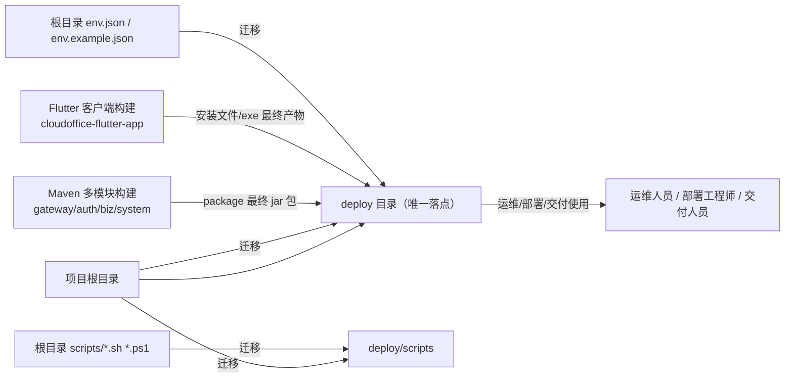
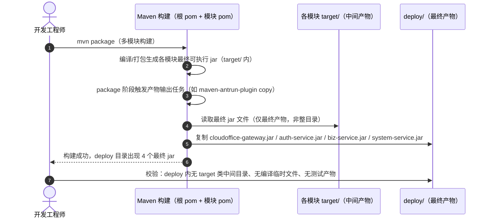
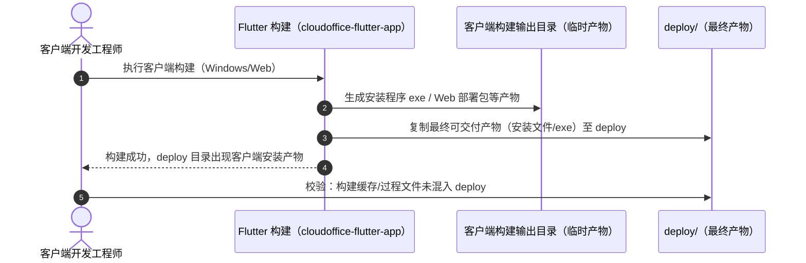
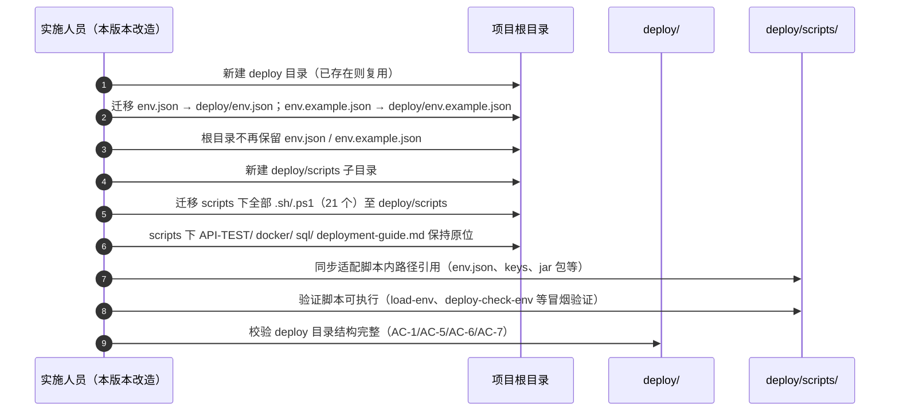
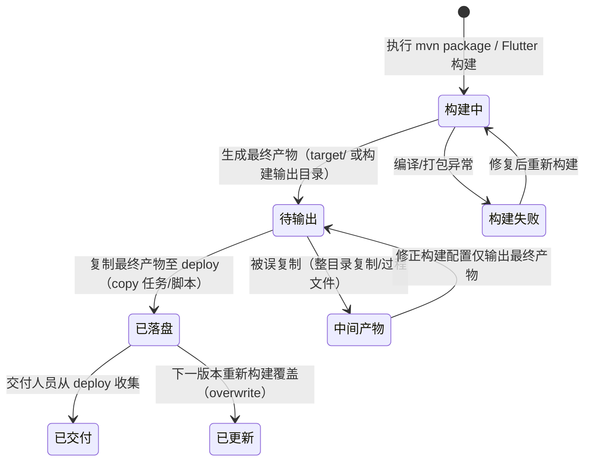
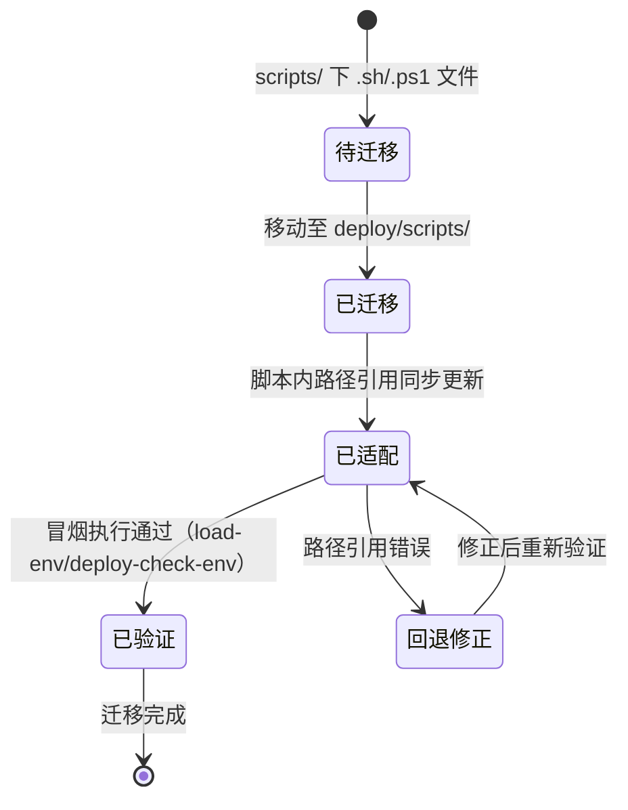

# 详细设计文档（LLD）
**项目名称**：云漫智企（CloudStrollOffice）
**版本号**：v0.2.5
**日期**：2026-08-09
**编写人**：TL

> 说明：LLD 聚焦整体业务逻辑的详细设计（模块划分、业务流程、核心业务逻辑、业务规则等）；接口（API）的详细设计由 API 设计文档单独负责，LLD 中不重复编写接口定义、请求/响应参数等内容。本版本（v0.2.5）为工程构建与部署资产集中化改造，不涉及任何接口变更，无新增 API。

## 1. 模块概述

本版本（v0.2.5）以**部署资产集中化**为目标（SAD G-A6、ADR-013），对现有工程的构建输出与部署资产布局进行整体重构，不新增业务功能模块，不改动任何运行时代码与接口契约。改造范围划分为五个工程级模块：

| 模块 | 类型 | 核心职责 |
| --- | --- | --- |
| deploy 目录 | 工程目录（根目录级） | 全部最终构建产物（后端 jar 包、客户端安装文件/exe）、环境配置（env.json/env.example.json）与部署运维脚本（deploy/scripts 下 .sh/.ps1）的唯一落点；禁止存放源代码与中间产物 |
| Maven 构建产物输出配置 | 构建配置（根 pom.xml + 各模块 pom.xml） | 使 auth-service、biz-service、system-service、gateway 四个可执行模块 `mvn package` 生成的最终可运行 jar 包输出到 `deploy` 目录；仅复制最终产物，隔离 target 中间产物 |
| Flutter 客户端构建产物输出配置 | 构建配置（cloudoffice-flutter-app） | 使客户端构建生成的安装文件/exe 等最终可交付产物输出到 `deploy` 目录；构建缓存与过程文件不进入 deploy |
| 环境配置迁移 | 文件迁移 | 将根目录 `env.json`、`env.example.json` 迁移至 `deploy` 目录，并保证部署脚本引用同步适配 |
| 部署脚本迁移与路径适配 | 文件迁移 | 将根目录 `scripts` 下全部 .sh/.ps1 迁移至 `deploy/scripts` 子目录，同步调整脚本内部路径引用，保证迁移后脚本功能与迁移前一致 |

**模块间协作关系**：构建配置模块产出最终产物 → 落盘 deploy；环境配置迁移与脚本迁移 → 落盘 deploy 与 deploy/scripts；deploy 目录作为唯一汇聚点，供运维/部署/交付人员单目录获取全部可交付资产。本版本完成后，deploy 目录成为"产物集中、纯净交付、迁移无损"的唯一出口（SAD 部署资产约束）。

## 2. 模块划分与职责

### 2.1 模块依赖关系



### 2.2 各模块内部职责

| 模块 | 内部构成 | 职责说明 |
| --- | --- | --- |
| deploy 目录 | deploy/ 根目录、deploy/scripts/ 子目录 | 根目录存放最终 jar 包、客户端安装文件/exe、env.json、env.example.json；scripts 子目录存放全部 .sh/.ps1 部署运维脚本；不放置任何源代码、target 目录、编译临时文件、测试产物 |
| Maven 构建产物输出配置 | 根 pom.xml（统一管理）、四个可执行模块 pom.xml（gateway/auth/biz/system） | 在 package 阶段将各模块最终可执行 jar 复制/输出至 `deploy` 目录（实现方式可由 maven-antrun-plugin、maven-copy 类插件或构建配置输出目录承担，由编码阶段确定）；产物命名保持模块可辨识（如 `cloudoffice-gateway.jar`、`cloudoffice-auth-service.jar` 等），避免同名覆盖；复制动作仅针对最终 jar 文件，禁止整目录递归复制 target |
| Flutter 客户端构建产物输出配置 | 客户端构建脚本/配置文件 | 构建成功后将安装文件/exe（Windows 安装程序、Web 部署包等）复制到 `deploy` 目录；构建缓存、编译过程文件不进入 deploy |
| 环境配置迁移 | deploy/env.json、deploy/env.example.json | 迁移后根目录不再保留两文件；所有依赖脚本的引用路径统一指向 deploy 下新位置 |
| 部署脚本迁移与路径适配 | deploy/scripts/ 下 21 个脚本（10 个 .sh + 11 个 .ps1） | 迁移根目录 scripts 下全部 sh/ps1；脚本内部引用的 env.json、keys 密钥目录、jar 包路径等同步适配为 deploy 相对路径；scripts 下非 sh/ps1 内容（API-TEST/、docker/、sql/、deployment-guide.md）保持原位不迁移 |

### 2.3 迁移资产清单（现状核对）

| 资产项 | 迁移前位置 | 迁移后位置 | 数量/说明 |
| --- | --- | --- | --- |
| 环境配置实际文件 | 根目录 env.json | deploy/env.json | 1 个 |
| 环境配置模板 | 根目录 env.example.json | deploy/env.example.json | 1 个 |
| 部署运维脚本（.sh） | scripts/ | deploy/scripts/ | 10 个：load-env.sh、deploy-check-env.sh、deploy-db-init.sh、deploy-env-template.sh、deploy-env.ps1（.ps1）、deploy-rsa-keygen.sh、deploy-start-auth.sh、deploy-start-biz.sh、deploy-start-gateway.sh、deploy-start-services.sh、deploy-start-system.sh |
| 部署运维脚本（.ps1） | scripts/ | deploy/scripts/ | 11 个：load-env.ps1、deploy-check-env.ps1、deploy-db-init.ps1、deploy-env-template.ps1、deploy-env.ps1、deploy-rsa-keygen.ps1、deploy-start-auth.ps1、deploy-start-biz.ps1、deploy-start-gateway.ps1、deploy-start-services.ps1、deploy-start-system.ps1 |
| 非脚本资产 | scripts/API-TEST/、scripts/docker/、scripts/sql/、scripts/deployment-guide.md | 不迁移 | 保持原位 |
| 后端最终 jar 包 | 各模块 target/ | deploy/ | gateway/auth/biz/system 四个最终可执行包 |
| 客户端安装产物 | 客户端构建输出目录 | deploy/ | 安装文件/exe 等最终可交付产物 |
| 构建中间产物 | 各模块 target/、客户端构建临时目录 | 不进入 deploy | 编译临时文件、测试产物、过程文件 |

## 3. 类图

本版本无新增运行时代码，核心"对象"为构建配置与目录结构。以下用 Mermaid classDiagram 描述构建配置逻辑对象及其关系（Maven 插件任务配置与 Flutter 构建脚本）：

```mermaid
classDiagram
    class MavenRootPom {
        +modules: common/gateway/auth/biz/system
        +deployDir: ${project.basedir}/../deploy
        +packagePhaseOutput() 统一产物输出配置
    }
    class ModulePom {
        +artifactId: cloudoffice-{module}
        +finalName: 最终 jar 命名
        +deployOutputTask() 复制最终 jar 至 deploy
        +executionPhase: package
    }
    class AntrunCopyTask {
        +targetDir: deploy/
        +source: target/cloudoffice-{module}.jar
        +overwrite: true
        +copySingleArtifact() 仅复制最终产物
    }
    class FlutterBuildScript {
        +windowsInstaller: 安装程序 exe
        +webBundle: Web 部署包
        +outputDir: deploy/
        +copyFinalArtifacts() 复制最终可交付产物
    }
    class DeployDirStructure {
        +deploy/env.json
        +deploy/env.example.json
        +deploy/scripts/*.sh
        +deploy/scripts/*.ps1
        +deploy/*.jar
        +deploy/*.exe
        +validatePurity() 中间产物检查
    }
    class DeployScript {
        +envPath: deploy/env.json 相对路径
        +keysPath: deploy/../keys 或 keys 相对路径
        +jarPath: deploy/*.jar 相对路径
        +resolvePaths() 路径解析适配
    }

    MavenRootPom --> ModulePom : 统一配置继承
    ModulePom --> AntrunCopyTask : package 阶段执行
    FlutterBuildScript --> DeployDirStructure : 输出最终产物
    AntrunCopyTask --> DeployDirStructure : 复制最终 jar
    DeployScript --> DeployDirStructure : 引用部署资产
```

## 4. 核心业务流程时序图

### 4.1 后端 Maven 构建产物输出流程（F-002/F-004）



### 4.2 Flutter 客户端构建产物输出流程（F-003/F-004）



### 4.3 环境配置与部署脚本迁移流程（F-001/F-005/F-006/F-007）



## 5. 状态图

### 5.1 构建产物生命周期（deploy 目录内资产）



### 5.2 脚本迁移状态流转



## 6. 核心业务逻辑

### 6.1 后端 Maven 产物输出（F-002/F-004）

```
功能：mvn package 后将最终可执行 jar 输出到 deploy，隔离中间产物
执行时机：package 阶段（模块构建完成后）
输入：各模块 target/ 下最终可执行 jar
输出：deploy/cloudoffice-{module}.jar

逻辑：
1. 确定输出目录 deployDir = ${project.parent.basedir}/deploy（根目录相对定位，模块构建不受工作目录影响）
2. 各可执行模块（gateway/auth-service/biz-service/system-service）在 package 阶段执行产物输出任务：
   a. 仅取 target/ 下的最终 jar 文件（与 finalName 一致的产物，如 cloudoffice-gateway.jar）
   b. 复制到 deployDir，overwrite=true（重复构建覆盖旧版本）
   c. 禁止整目录递归复制 target/（防止编译类、测试报告等中间产物混入）
3. common 模块为库依赖，不产生可执行产物，不参与输出
4. 构建产物命名保持 artifactId 可辨识，避免四个服务同名覆盖

校验（构建后）：
- deploy/ 下存在 4 个最终 jar（AC-2）
- deploy/ 下不存在 target 类目录、*.class、测试报告等中间产物（AC-4）
```

### 6.2 客户端 Flutter 产物输出（F-003/F-004）

```
功能：客户端构建后将最终可交付产物输出到 deploy
输入：Flutter 构建输出目录中的安装程序 exe / Web 部署包
输出：deploy/ 下客户端安装产物

逻辑：
1. 构建命令生成最终产物（如 Windows 安装程序 .exe、Web 构建包）
2. 构建脚本/配置将最终产物复制到 deploy/
3. 仅复制最终可交付产物文件，构建缓存（build/ 目录）、过程文件不进入 deploy

校验（构建后）：
- deploy/ 下存在客户端安装产物（AC-3）
- deploy/ 下无构建缓存与过程文件（AC-4）
```

### 6.3 环境配置与脚本迁移（F-005/F-006/F-007）

```
功能：env 配置与部署脚本集中迁移并保证功能无损
迁移清单：
- env.json / env.example.json → deploy/
- scripts/ 下全部 .sh/.ps1（21 个）→ deploy/scripts/
- scripts/ 下 API-TEST/、docker/、sql/、deployment-guide.md → 不迁移

路径适配规则（保证 AC-7）：
1. 脚本内对 env.json / env.example.json 的引用：由"根目录相对路径"改为"deploy 目录相对路径"
   例如：scripts 内引用 ../env.json → 新脚本内引用 ../env.json（deploy/scripts 上级即 deploy，语义一致），
   或采用"以脚本所在目录为基准向上解析"的定位方式，由编码阶段按脚本实际写法统一适配
2. 脚本内对 keys 密钥目录的引用：保持 keys 目录位于根目录（deploy 上级）的现状，路径同步换算
3. 脚本内对 jar 包的引用：jar 包统一位于 deploy/，脚本引用改为 deploy 相对路径
4. load-env.sh / load-env.ps1 作为共享环境加载入口，被其他脚本 source/调用，路径适配后必须保证全部调用方一致

验证：
- deploy/scripts 下脚本可执行（冒烟：load-env → deploy-check-env）（AC-7）
- 根目录 scripts 下不再保留 .sh/.ps1（AC-6）
- 根目录不再保留 env.json / env.example.json（AC-5）
```

## 7. 业务规则与约束

| 类别 | 规则 | 来源/落点 |
| --- | --- | --- |
| 目录唯一落点 | 根目录 `deploy` 为最终构建产物、环境配置、部署脚本的唯一落点；源代码与构建配置保留在根目录及模块目录 | SAD G-A6 / ADR-013 |
| 目录纯净性 | deploy 内禁止出现 target 类中间目录、编译临时文件、测试产物、构建缓存/过程文件；只允许最终产物（jar、安装文件/exe、env 配置、部署脚本）进入 | SAD 部署资产约束 / PRD F-004 / AC-4 |
| 复制粒度 | 产物生成必须"仅复制最终产物文件"，严禁整目录递归复制构建输出目录 | PRD F-004 / AC-4 |
| 产物命名 | 后端 jar 命名保持模块可辨识（artifact 命名，如 cloudoffice-auth-service.jar），避免四个服务同名覆盖；重复构建 overwrite 覆盖旧版本 | PRD F-002 / AC-2 |
| 目录复用 | deploy 目录已存在时复用现有目录，不重复创建、不覆盖已有有效内容 | PRD US-001 边界 |
| 构建失败 | 构建失败不产生最终产物，deploy 不落盘失败产物 | PRD US-001 边界 |
| 迁移范围 | 仅迁移 scripts 下 .sh/.ps1；API-TEST/、docker/、sql/、deployment-guide.md 等非脚本内容保持原位，不得迁移 | PRD F-007 / AC-6 |
| 迁移完整性 | 迁移后根目录 scripts 下不再保留已迁移的 .sh/.ps1；根目录不再保留 env.json、env.example.json | PRD F-005/F-007 / AC-5/AC-6 |
| 路径适配 | 迁移后脚本内对 env.json、keys 密钥目录、jar 包等路径引用必须同步适配，保证部署运维功能与迁移前一致 | SAD 部署资产约束 / PRD F-007 / AC-7 |
| 接口契约 | 本版本不新增/不修改任何接口定义，不改变运行时代码行为 | SAD v0.2.5 范围 |
| 架构约束 | 构建配置调整不改变模块依赖关系（服务间仍只依赖 common），不影响服务注册与路由 | ADR-001 |

## 8. 业务数据流

### 8.1 构建产物流向

```
Maven 各模块（gateway/auth/biz/system）
  → 编译 → target/（中间产物，停留原地）
  → package 最终可执行 jar（target/ 内）
  → 产物输出任务（仅复制最终 jar 文件）
  → deploy/  ← 唯一汇聚点

Flutter 客户端（cloudoffice-flutter-app）
  → 构建（build/ 缓存与过程文件，停留原地）
  → 安装文件/exe 等最终产物
  → deploy/  ← 唯一汇聚点

交付人员 → deploy/（单目录收集全部可交付资产）
```

### 8.2 部署资产流向（迁移后）

```
deploy/env.json、deploy/env.example.json  ← 根目录迁移
deploy/scripts/*.sh、*.ps1（21 个）      ← scripts/ 迁移 + 路径适配
deploy/scripts 脚本
  → 引用 deploy/env.json（环境变量加载）
  → 引用 keys/（RSA 密钥，位于 deploy 上级根目录）
  → 引用 deploy/*.jar（启动服务）
  → 执行部署运维（check-env / db-init / rsa-keygen / start-* / load-env）
```

### 8.3 中间产物隔离流

```
构建中间产物（target/、build/、编译临时文件、测试产物）
  → 一律停留在原构建输出位置
  → 禁止被复制/输出至 deploy（构建配置与复制动作双重约束）
  → 构建后校验（deploy 纯净性检查）作为兜底
```

## 9. 数据结构定义

### 9.1 deploy 目录结构（迁移/构建完成后目标形态）

| 路径 | 类型 | 内容说明 |
| --- | --- | --- |
| deploy/env.json | 文件 | 实际环境配置（迁移自根目录） |
| deploy/env.example.json | 文件 | 环境配置模板（迁移自根目录） |
| deploy/cloudoffice-gateway.jar | 文件 | 网关最终可执行包 |
| deploy/cloudoffice-auth-service.jar | 文件 | 认证服务最终可执行包 |
| deploy/cloudoffice-biz-service.jar | 文件 | 企业服务最终可执行包 |
| deploy/cloudoffice-system-service.jar | 文件 | 系统服务最终可执行包 |
| deploy/{客户端安装产物} | 文件 | Flutter 构建安装文件/exe 等 |
| deploy/scripts/*.sh | 文件 | 部署运维脚本（Linux/macOS） |
| deploy/scripts/*.ps1 | 文件 | 部署运维脚本（Windows） |
| deploy/（禁止项） | - | target 类目录、编译临时文件、测试产物、构建缓存/过程文件 |

### 9.2 脚本路径引用约定（迁移后）

| 引用对象 | 迁移前写法示例 | 迁移后定位约定 |
| --- | --- | --- |
| env.json | 根目录相对/绝对路径 | 以脚本自身位置（deploy/scripts）向上定位至 deploy/env.json |
| keys 密钥目录 | 根目录 keys/ | 由 deploy/scripts 向上两级定位至根目录 keys/（keys 目录保持在根目录） |
| jar 包 | 各模块 target/ 路径 | 统一定位至 deploy/ 下模块 jar |
| 数据库初始化 SQL | scripts/sql/ | 保持原 scripts/sql/ 位置，引用相应换算 |

## 10. 异常处理策略

| 异常类别 | 典型场景 | 处理方式 |
| --- | --- | --- |
| 构建失败 | Maven 编译/打包失败、Flutter 构建失败 | 构建进程报错退出，deploy 不落盘失败产物；开发人员修复后重新构建（US-001 边界） |
| 产物复制失败 | copy 任务目标目录不可写、磁盘空间不足 | 构建报错，明确输出失败原因与目标路径；不产生半成品产物（或产生后由校验发现并清理） |
| 中间产物误复制 | 构建配置误将整目录复制 | 构建后纯净性校验兜底发现，修正构建配置仅输出最终产物（PRD 流程图 J/K 分支） |
| 脚本路径引用失效 | 迁移后脚本找不到 env.json/jar/keys | 迁移阶段逐一适配路径；验证阶段冒烟执行（load-env → deploy-check-env）提前发现，修正后重新验证 |
| 迁移冲突 | deploy 目录已存在且内容与预期不符 | 复用现有目录，核对内容；不覆盖已有有效内容（US-001 边界） |
| 同名产物覆盖 | 多模块同名 jar | 命名规则规避（模块可辨识命名），构建配置保证不发生误覆盖 |

## 11. 日志规范

| 业务路径 | 日志级别 | 日志内容要求 |
| --- | --- | --- |
| Maven 产物输出 | info | 复制源文件、目标 deploy 路径、复制结果（成功/失败） |
| Flutter 产物输出 | info | 最终产物文件、目标 deploy 路径、复制结果 |
| 产物复制失败 | error | 失败原因、源/目标路径（供修复定位） |
| 中间产物过滤 | debug | 被排除的非最终产物清单（调试用） |
| 脚本迁移 | info | 迁移文件清单、路径适配前后对照（迁移执行阶段人工/脚本记录） |
| 脚本验证执行 | info / error | 冒烟执行结果（load-env、deploy-check-env 等），失败输出错误原因 |

## 12. 性能优化点

| 风险点 | 手段 |
| --- | --- |
| 全量构建产物重复复制 | 产物输出任务仅复制最终 jar 文件（小体积、数量固定 4 个），不复制整个 target 目录，复制开销恒定且极小 |
| 构建与产物输出耦合 | 产物输出绑定 package 阶段执行，构建链路清晰；中间产物留在 target 由 Maven 生命周期管理，deploy 无需清理逻辑 |
| 多模块重复构建 | 根 pom 统一配置产物输出，各模块继承，避免各模块各自实现造成差异与重复 |
| 脚本迁移人工适配易错 | 迁移清单与路径引用约定统一管理（见 9.2），验证阶段冒烟执行提前发现问题，降低回归成本 |

## 13. 单元测试策略

### 13.1 测试范围与工具

本版本为工程构建与目录迁移改造，测试以**构建验证与目录结构校验**为主（无新增运行时代码，不涉及 JUnit 业务单测）：

- Maven 构建验证：执行 `mvn package`，校验 deploy 目录产物落位与纯净性（AC-2/AC-4）
- Flutter 构建验证：执行客户端构建，校验安装产物落位与纯净性（AC-3/AC-4）
- 目录结构校验：检查 deploy 目录结构完整性（AC-1/AC-5/AC-6）
- 脚本冒烟验证：执行 deploy/scripts 下 load-env、deploy-check-env 等脚本，校验路径引用正确（AC-7）

### 13.2 用例划分

| 被测对象 | 用例方向 | 验收关联 |
| --- | --- | --- |
| deploy 目录结构 | 存在性、包含 env.json/env.example.json/scripts 子目录 | AC-1 |
| Maven 构建产物 | package 后 deploy 存在 4 个最终 jar（gateway/auth/biz/system） | AC-2 |
| Flutter 构建产物 | 构建后 deploy 存在安装文件/exe 最终产物 | AC-3 |
| deploy 纯净性 | 无 target 类目录、无编译临时文件、无测试产物、无构建缓存 | AC-4 |
| 环境配置迁移 | 根目录无 env.json/env.example.json，deploy 下存在 | AC-5 |
| 脚本迁移 | scripts 下 21 个 sh/ps1 全部位于 deploy/scripts；根目录 scripts 下不再保留；API-TEST/docker/sql/deployment-guide.md 未迁移 | AC-6 |
| 脚本路径适配 | 冒烟执行 load-env、deploy-check-env 等脚本成功，env.json 加载正常 | AC-7 |

### 13.3 边界与异常用例

- deploy 目录已存在 → 复用不覆盖（US-001 边界）
- 构建失败 → deploy 不产生失败产物（US-001 边界）
- 脚本引用旧路径 → 适配失败场景可被冒烟执行发现并修正（AC-7）
- 中间产物误复制 → 纯净性校验发现并修正构建配置（PRD 流程图 J/K 分支）

### 13.4 覆盖目标

- 全部 7 条验收标准（AC-1 ~ AC-7）均有对应校验用例
- 构建产物落位、目录纯净性、迁移完整性、脚本可执行性四条主线全部覆盖
- 校验结果记录至版本测试用例文档，全部通过方可交付

<!-- SPDX-License-Identifier: Apache-2.0 / Copyright 2026 jenemy8023 <jenemy8023@163.com> -->
