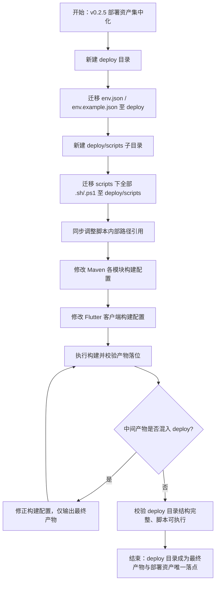

# 产品需求文档（PRD）
**项目名称**：云漫智企（CloudStrollOffice）
**版本号**：v0.2.5
**日期**：2026-08-09
**编写人**：BA

## 1. 产品背景
### 1.1 项目背景
云漫智企（CloudStrollOffice）为 Maven 多模块微服务架构（common、gateway、auth-service、biz-service、system-service）与 Flutter 多端客户端（cloudoffice-flutter-app，支持 Web 与 Windows）组成的微服务企业办公套件。当前版本的最终构建产物（后端 jar 包、客户端安装文件/exe 等）分散在各模块输出目录（如各模块 target 目录），环境配置（env.json、env.example.json）与部署运维脚本（scripts 下的 .sh/.ps1）位于项目根目录及根目录 scripts 目录中，发布、打包、交付人员需要多处查找产物与部署资产，目录结构不够集中清晰。

### 1.2 产品目标
- **G1 产物集中化**：建立统一的 `deploy` 目录，作为所有模块最终构建产物的唯一落盘位置，后端微服务 jar 包、客户端安装文件/exe 均输出到该目录。
- **G2 部署资产集中化**：将环境配置（env.json、env.example.json）与部署运维脚本（scripts 下全部 .sh/.ps1）统一收拢至 `deploy` 目录，实现"运行/部署相关资产集中在 deploy，源代码与构建配置保留在根目录及模块目录"的清晰划分。
- **G3 目录纯净性**：构建阶段的中间产物（编译临时文件、测试产物、过程文件等）不得进入 `deploy` 目录，确保该目录只包含可直接交付/运行的最终产物。

### 1.3 核心设计理念
- **唯一落盘**：`deploy` 目录是最终产物的唯一出口，杜绝产物分散。
- **纯净交付**：中间产物与最终产物严格隔离，交付人员打开 `deploy` 即可收集全部可交付资产。
- **迁移无损**：环境配置与部署脚本迁移后，原有部署运维流程功能不受影响，路径引用完整可用。

## 2. 目标用户
| 用户角色 | 使用场景 | 核心诉求 |
| --- | --- | --- |
| 后端开发工程师 | 对 Maven 多模块（auth-service、biz-service、system-service、gateway）执行编译打包 | 执行构建后，在 deploy 目录统一获取各服务最终 jar 包，无需在各模块 target 目录中查找 |
| 客户端开发工程师 | 构建 Flutter 客户端（Web/Windows） | 构建完成后，在 deploy 目录获取安装文件/exe 等最终产物 |
| 运维/部署工程师 | 环境配置管理、数据库初始化、RSA 密钥生成、服务启停 | 在 deploy 目录统一使用 env.json/env.example.json 与 deploy/scripts 下的 .sh/.ps1 脚本完成部署运维 |
| 发布/交付人员 | 整理并交付版本产物 | 直接从 deploy 目录收集全部最终产物，不受中间产物干扰 |

## 3. 功能清单
| 功能编号 | 功能名称 | 所属模块 | 优先级 | 版本范围 |
| --- | --- | --- | --- | --- |
| F-001 | 新建 deploy 目录 | 项目根目录结构 | 高 | v0.2.5 |
| F-002 | 后端 jar 产物输出到 deploy | 构建配置（Maven 各模块） | 高 | v0.2.5 |
| F-003 | 客户端安装产物输出到 deploy | 构建配置（Flutter 客户端） | 高 | v0.2.5 |
| F-004 | 中间产物不入 deploy | 构建配置（Maven/Flutter） | 高 | v0.2.5 |
| F-005 | env.json 与 env.example.json 迁移 | 环境配置 | 高 | v0.2.5 |
| F-006 | deploy/scripts 子目录建立 | 项目根目录结构 | 高 | v0.2.5 |
| F-007 | scripts 下 sh/ps1 脚本迁移 | 部署运维脚本 | 高 | v0.2.5 |

## 4. 详细功能描述
### 4.1 新建 deploy 目录
#### 功能描述
在项目根目录新建 `deploy` 目录，作为最终构建产物、环境配置与部署脚本的统一存放位置。目录创建后，`deploy` 下应包含后续步骤产生的环境配置文件与 `scripts` 子目录。
#### 业务规则
- `deploy` 目录位于项目根目录下，与 `src`（后端多模块根）、`cloudoffice-flutter-app`（客户端目录）、`scripts`、`docs` 等平级。
- `deploy` 目录只存放最终产物、环境配置与部署脚本，不得存放任何源代码与中间产物。
- 目录命名固定为小写 `deploy`。
#### 页面原型说明（或原型图位置）
无页面原型，属于工程目录结构调整。

### 4.2 后端 jar 产物输出到 deploy
#### 功能描述
修改 Maven 多模块（auth-service、biz-service、system-service、gateway）构建配置（pom.xml 或构建插件配置），使 `mvn package` 生成的最终可执行 jar 包统一输出到 `deploy` 目录。
#### 业务规则
- 四个后端模块的最终 jar 包均落盘至 `deploy` 目录。
- 各服务 jar 命名规则保持模块化可辨识（如 `*-auth-service.jar`、`*-biz-service.jar`、`*-system-service.jar`、`*-gateway.jar` 或保持原 artifactId 命名），避免同名覆盖。
- 生成方式可采用构建插件（如 maven-antrun-plugin、copy 插件等）在 package 阶段将最终 jar 复制/输出至 `deploy`，或直接配置构建输出目录；实现方式由编码阶段确定，但结果必须满足最终产物落位 `deploy`。
#### 页面原型说明（或原型图位置）
无页面原型，属于构建配置调整。

### 4.3 客户端安装产物输出到 deploy
#### 功能描述
修改 Flutter 客户端构建配置，使客户端构建生成的安装文件/exe 等最终产物（如 Windows 安装程序 exe、Web 部署包等）输出到 `deploy` 目录。
#### 业务规则
- 客户端构建成功后，最终可交付产物（安装文件/exe 等）必须出现在 `deploy` 目录。
- 若构建工具链默认输出到构建临时目录，则通过构建脚本/配置将最终产物复制到 `deploy`，中间构建过程文件不得随之进入。
#### 页面原型说明（或原型图位置）
无页面原型，属于构建配置调整。

### 4.4 中间产物不入 deploy
#### 功能描述
确保构建阶段产生的中间产物（如 Maven 各模块 target 目录、编译临时文件、测试产物、Flutter 构建缓存/过程文件等）不会进入 `deploy` 目录。
#### 业务规则
- `deploy` 目录内禁止出现 target 类中间目录、编译临时文件、测试报告等中间产物。
- 只允许最终产物（jar 包、安装文件/exe、环境配置、部署脚本）进入 `deploy` 目录。
- 若通过复制方式生成产物，复制动作必须仅针对最终产物文件，严禁整目录递归复制构建输出目录。
#### 页面原型说明（或原型图位置）
无页面原型，属于构建配置约束。

### 4.5 env.json 与 env.example.json 迁移
#### 功能描述
将项目根目录下的 `env.json` 与 `env.example.json` 迁移到 `deploy` 目录，并确保相关部署脚本仍能正确引用这两个文件。
#### 业务规则
- 迁移后文件位于 `deploy/env.json`、`deploy/env.example.json`。
- 项目根目录下不再保留这两个文件（或保留方式由编码阶段确认，但默认应完成迁移，根目录不残留）。
- 依赖这两个文件的部署脚本（迁移后的 deploy/scripts 下脚本）中的路径引用必须同步更新为 `deploy` 目录下的新路径，保证 env 加载功能可用。
#### 页面原型说明（或原型图位置）
无页面原型，属于配置文件迁移。

### 4.6 deploy/scripts 子目录建立
#### 功能描述
在 `deploy` 目录下新建 `scripts` 子目录，用于存放迁移后的部署运维脚本。
#### 业务规则
- 目录结构为 `deploy/scripts`。
- 该子目录只存放部署运维脚本（.sh/.ps1），不存放 sql、docker、API-TEST 等非脚本内容。
#### 页面原型说明（或原型图位置）
无页面原型，属于目录结构调整。

### 4.7 scripts 下 sh/ps1 脚本迁移
#### 功能描述
将项目根目录 `scripts` 目录下的全部 `.sh` 与 `.ps1` 文件迁移至 `deploy/scripts` 子目录，并同步调整脚本内部引用的路径，确保迁移后脚本可正常执行。
#### 业务规则
- 迁移范围：根目录 `scripts` 下的全部 `.sh` 与 `.ps1` 文件（如 deploy-check-env、deploy-db-init、deploy-env、deploy-rsa-keygen、deploy-start-auth/biz/gateway/system/services、load-env 等对应的 sh/ps1 脚本）。
- 非 .sh/.ps1 内容（如 scripts/docker、scripts/sql、scripts/API-TEST、deployment-guide.md 等）不在本次迁移范围内，不得随迁移移动。
- 脚本内部引用的相对/绝对路径（如 env.json、密钥文件 keys 目录、jar 包路径等）须随目录变化同步调整，保证脚本功能与迁移前一致。
- 迁移后根目录 `scripts` 下不再保留已迁移的 .sh/.ps1 文件。
#### 页面原型说明（或原型图位置）
无页面原型，属于脚本迁移与路径适配。

## 5. 业务流程图

## 6. 数据需求
本版本不涉及业务数据实体变更，涉及以下工程资产项：
| 资产项 | 迁移前位置 | 迁移/输出后位置 | 说明 |
| --- | --- | --- | --- |
| env.json | 项目根目录 | deploy/env.json | 实际环境配置 |
| env.example.json | 项目根目录 | deploy/env.example.json | 环境配置模板 |
| .sh/.ps1 部署脚本 | scripts/ | deploy/scripts/ | 全部 sh/ps1 迁移，脚本内部路径同步适配 |
| 后端最终 jar 包 | 各模块 target/ | deploy/ | auth-service、biz-service、system-service、gateway 最终可执行包 |
| 客户端安装产物 | 客户端构建输出目录 | deploy/ | 安装文件/exe 等最终可交付产物 |
| 构建中间产物 | 各模块 target/、客户端构建临时目录 | 不进入 deploy | 编译临时文件、测试产物、过程文件等 |

## 7. 验收标准
- **AC-1**：项目根目录存在 `deploy` 目录，且 `deploy` 目录下包含 `env.json`、`env.example.json` 与 `scripts` 子目录。
- **AC-2**：执行 Maven 各模块 `package` 后，auth-service、biz-service、system-service、gateway 的最终 jar 包出现在 `deploy` 目录。
- **AC-3**：执行 Flutter 客户端构建后，安装文件/exe 等最终产物出现在 `deploy` 目录。
- **AC-4**：构建完成后，`deploy` 目录内不出现 target 类中间目录、编译临时文件、测试产物等中间产物。
- **AC-5**：项目根目录不再保留 `env.json`、`env.example.json`；两文件已在 `deploy` 目录中。
- **AC-6**：根目录 `scripts` 下的全部 .sh/.ps1 文件已迁移至 `deploy/scripts`，根目录 `scripts` 下不再保留已迁移的 .sh/.ps1 文件；scripts 下非 sh/ps1 内容（docker、sql、API-TEST 等）未被迁移。
- **AC-7**：迁移后 `deploy/scripts` 下的脚本可正常执行，脚本内 env.json 等路径引用已同步更新，部署运维功能不受影响。

## 8. 用户故事（User Stories）
### US-001：建立统一的部署资产目录
#### 故事描述
作为发布/交付人员，我想要项目根目录下有一个统一的 deploy 目录集中存放最终产物与部署资产，以便一次性收集全部可交付内容，无需在多个目录间查找。
#### 前置条件
项目已具备多模块构建能力与现有 scripts/env 资产。
#### 验收标准
- [ ] Given 项目根目录，When 版本 v0.2.5 落地，Then 根目录存在 deploy 目录
- [ ] Given deploy 目录，When 查看目录内容，Then 包含 env.json、env.example.json 与 scripts 子目录
- [ ] Given 构建完成后，When 检查 deploy 目录，Then 不出现任何中间产物
#### 边界情况与错误处理
| 场景 | 预期处理 |
| --- | --- |
| deploy 目录已存在 | 复用现有目录，不重复创建、不覆盖已有有效内容 |
| 构建失败 | 不产生最终产物，deploy 目录不落盘失败产物 |
#### 关联功能编号
F-001、F-004

### US-002：最终构建产物统一输出到 deploy
#### 故事描述
作为后端/客户端开发工程师，我想要构建后的最终产物（jar 包、安装文件/exe）自动输出到 deploy 目录，以便在统一位置获取可交付产物。
#### 前置条件
Maven 多模块构建配置与 Flutter 客户端构建配置可正常执行构建。
#### 验收标准
- [ ] Given 执行 Maven 各模块 package，When 构建成功，Then 四个后端服务的最终 jar 包出现在 deploy 目录
- [ ] Given 执行 Flutter 客户端构建，When 构建成功，Then 安装文件/exe 等最终产物出现在 deploy 目录
- [ ] Given 构建完成，When 检查 deploy 目录，Then 无中间产物混入（target 类目录、编译临时文件、测试产物均不在其中）
#### 边界情况与错误处理
| 场景 | 预期处理 |
| --- | --- |
| 同名 jar 产物 | 产物命名保持模块可辨识，不发生覆盖 |
| 中间产物误复制 | 构建配置仅复制最终产物文件，不整目录递归复制 |
#### 关联功能编号
F-002、F-003、F-004

### US-003：环境配置与部署脚本统一迁移到 deploy
#### 故事描述
作为运维/部署工程师，我想要 env.json/env.example.json 与全部 .sh/.ps1 脚本统一位于 deploy 目录下，以便在单一位置完成环境配置与部署运维操作。
#### 前置条件
现有 env.json、env.example.json 与 scripts 下 .sh/.ps1 脚本可正常工作。
#### 验收标准
- [ ] Given 迁移执行后，When 检查根目录，Then env.json、env.example.json 不再位于项目根目录，而位于 deploy 目录
- [ ] Given 迁移执行后，When 检查根目录 scripts 与 deploy/scripts，Then 全部 .sh/.ps1 已迁移至 deploy/scripts，根目录 scripts 下不再保留
- [ ] Given 迁移执行后，When 检查 scripts 非脚本内容，Then docker、sql、API-TEST、部署指南等未被移动
- [ ] Given 迁移执行后，When 执行部署脚本，Then 脚本可正常运行，env.json 加载正常
#### 边界情况与错误处理
| 场景 | 预期处理 |
| --- | --- |
| 脚本内路径引用旧位置 | 同步更新为 deploy 下新路径，脚本功能不受影响 |
| scripts 下存在非 sh/ps1 文件 | 保持原位置不迁移 |
#### 关联功能编号
F-005、F-006、F-007

## 9. 版本规划
| 版本号 | 计划内容 | 状态 |
| --- | --- | --- |
| v0.2.5 | 新建 deploy 目录；后端 jar/客户端安装产物统一输出到 deploy；env.json 与 env.example.json 迁移；deploy/scripts 子目录建立；scripts 下全部 sh/ps1 迁移并适配路径 | 需求分析中 |
| v0.2.4 | 上一版本已交付功能（如适用） | 已交付 |

## 10. 附录
### 术语表
| 术语 | 说明 |
| --- | --- |
| deploy 目录 | 项目根目录下统一的最终产物、环境配置与部署脚本存放目录 |
| 最终产物 | 可直接交付/运行的构建结果，如 jar 包、安装文件/exe |
| 中间产物 | 构建过程中的临时文件、测试产物、编译缓存等，禁止进入 deploy |
| env.json / env.example.json | 项目环境配置实际文件与模板文件 |
| deploy/scripts | deploy 目录下的部署运维脚本子目录，存放全部 .sh/.ps1 |
### 参考文档
- 用户需求说明书（URS）v0.2.5：docs/cso-v0.2.5/cso-urs-v0.2.5.md
- 用户需求说明书（URS）主文档：docs/cso-urs.md

<!-- SPDX-License-Identifier: Apache-2.0 / Copyright 2026 jenemy8023 <jenemy8023@163.com> -->
