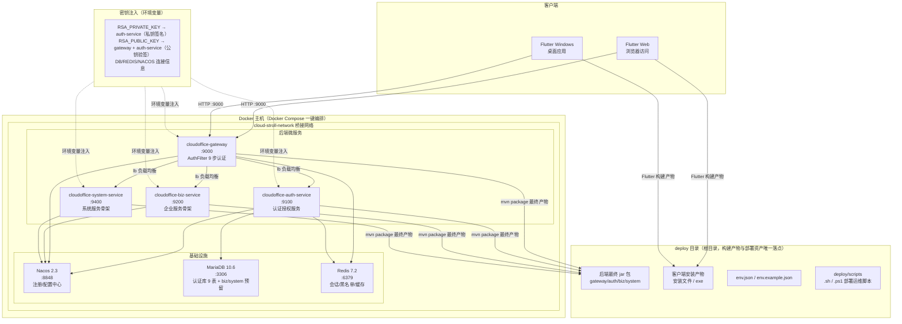
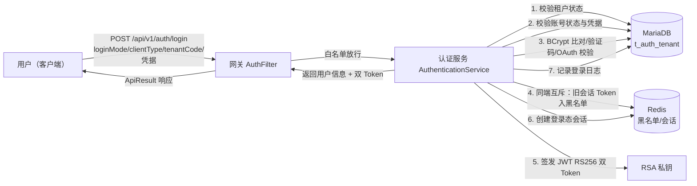
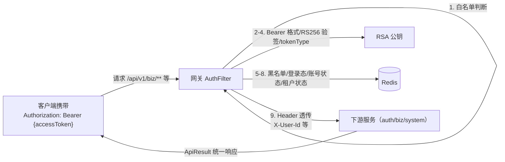
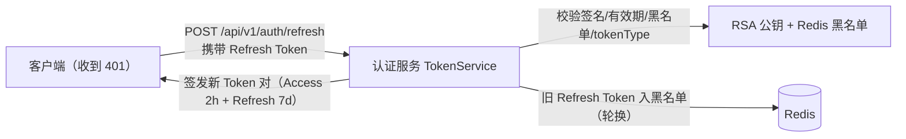

# 任务上下文（#TASK-003 迁移 scripts 下全部 .sh/.ps1 至 deploy/scripts 并适配路径）

## 1. 任务信息

```json
{
  "id": "TASK-003",
  "title": "迁移 scripts 下全部 .sh/.ps1 至 deploy/scripts 并适配路径",
  "description": "将项目根目录 scripts 下全部 10 个 .sh 与 11 个 .ps1（共 21 个：load-env、deploy-check-env、deploy-db-init、deploy-env、deploy-env-template、deploy-rsa-keygen、deploy-start-auth/biz/gateway/system/services）迁移至 deploy/scripts 子目录；scripts 下非 sh/ps1 内容（API-TEST/、docker/、sql/、deployment-guide.md）保持原位不迁移；同步适配脚本内部对 env.json、keys 密钥目录、jar 包等路径引用为 deploy 相对路径；冒烟验证 load-env → deploy-check-env 可正常执行。对应 PRD F-007。",
  "taskType": "common",
  "userStoryId": "US-003",
  "apiId": "",
  "upstreamTaskIds": [
    "TASK-001"
  ],
  "downstreamTaskIds": [
    "TASK-006"
  ],
  "priority": "P0",
  "status": "未完成",
  "testMethod": "脚本迁移清单校验（21 个 sh/ps1 全部位于 deploy/scripts）+ 脚本冒烟执行（load-env、deploy-check-env）",
  "acceptanceCriteria": "AC-6：根目录 scripts 下全部 .sh/.ps1 已迁移至 deploy/scripts，根目录不再保留；非 sh/ps1 内容未被迁移。AC-7：迁移后 deploy/scripts 下脚本可正常执行，脚本内 env.json 等路径引用已同步更新，部署运维功能不受影响"
}
```

## 2. 用户需求

### US-003：环境配置与部署脚本统一迁移到 deploy
#### 故事描述
作为运维/部署工程师，我想要 env.json/env.example.json 与全部 .sh/.ps1 脚本统一位于 deploy 目录下，以便在单一位置完成环境配置与部署运维操作。
#### 前置条件
现有 env.json、env.example.json 与 scripts 下 .sh/.ps1 脚本可正常工作。
#### 验收标准
- [ ] Given 迁移执行后，When 检查根目录，Then env.json、env.example.json 不再位于项目根目录，而位于 deploy 目录
- [ ] Given 迁移执行后，When 检查根目录 scripts 与 deploy/scripts，Then 全部 .sh/.ps1 已迁移至 deploy/scripts，根目录 scripts 下不再保留
- [ ] Given 迁移执行后，When 检查 scripts 非脚本内容，Then docker、sql、API-TEST、部署指南等未被移动
- [ ] Given 迁移执行后，When 执行部署脚本，Then 脚本可正常运行，env.json 加载正常
#### 边界情况与错误处理
| 场景 | 预期处理 |
| --- | --- |
| 脚本内路径引用旧位置 | 同步更新为 deploy 下新路径，脚本功能不受影响 |
| scripts 下存在非 sh/ps1 文件 | 保持原位置不迁移 |
#### 关联功能编号
F-005、F-006、F-007

## 3. 项目信息

# 项目基本信息
**项目中文名称**：云漫智企
**项目英文名称**：CloudStrollOffice
**项目英文缩写**：cso
**编程语言**：Java 21（后端，Spring Boot 3.2.5 / Spring Cloud 2023.0.1）；Dart 3（客户端，Flutter，SDK ^3.12.2）
**项目类型**：微服务企业办公套件（Maven 多模块后端微服务集群 + Flutter 多端客户端）
**本地化语言**：简体中文
**总体介绍**：云漫智企（CloudStrollOffice）是基于 Java 21 + Spring Boot 3.2.x + Spring Cloud 2023.x 技术栈构建的微服务企业办公套件。后端采用 Maven 多模块架构，由公共模块（common）、API 网关（gateway）、认证服务（auth-service）、企业服务（biz-service）、系统服务（system-service）组成，配套 Flutter 客户端（cloudoffice-flutter-app，支持 Web 与 Windows 双平台）。系统为企业提供企业信息管理、人事管理、工作流审批、薪酬管理、统一认证授权等综合服务能力：已实现 RBAC 多租户权限模型（用户-角色-权限三层关联 + 租户数据隔离）、6 种客户端类型混合登录、JWT RS256 双 Token（Access 2h + Refresh 7d + 轮换）、Redis 会话管理（登录态/黑名单/状态缓存）、网关 AuthFilter 全局认证（9 步校验 + 用户信息 Header 透传）、多模式登录/注册（策略工厂模式）、密码管理、手机号变更、验证码管理等能力。基础设施依赖 MariaDB 10.6（业务数据）、Redis 7.2（会话缓存）、Nacos 2.3（注册/配置中心），支持 Docker Compose 一键编排部署。

# 数据库信息
**是否使用数据库**：是
**数据库产品**：MariaDB（业务关系型数据库，认证库 `cloudstroll_office_auth` 9 张表；biz/system 库预留）
**数据库版本**：10.6 (LTS)
**缓存数据库**：Redis 7.2.x（登录态会话、Token 黑名单、账号/租户状态缓存、验证码存储）

# 编码规范
## 文件组织规范
- 后端按 Maven 多模块组织：公共代码统一放 `cloudoffice-common`，各业务模块（auth/biz/system）只依赖 common，禁止模块间互相依赖与循环依赖；包根为 `org.cloudstrolling.cloudoffice.{模块}`。
- 模块内按职责分层组织：`config/`（配置）、`controller/`（接口层）、`service/`（业务层，接口与 impl 分离）、`mapper/`（数据访问）、`entity/`（实体）、`dto/`（请求/响应）、`vo/`（视图对象）、`util/`（工具）。
- 客户端独立 Flutter 工程 `cloudoffice-flutter-app`，按 Flutter 标准目录组织（lib/、test/、web/、windows/）。
- 数据库脚本放 `scripts/sql/`，Docker 编排放 `scripts/docker/`，部署脚本放 `scripts/`。
## 命名规范
- 类名/接口名 UpperCamelCase，方法名/变量名 lowerCamelCase，常量 UPPER_SNAKE_CASE；遵循 Java 与 Dart 社区命名约定。
- 接口命名不带 I 前缀（如 `UserService` / `UserServiceImpl`），实体以 `Entity` 后缀（如 `UserEntity`），Mapper 以 `Mapper` 后缀。
- API 路径统一规范：`/api/v1/{module}/{resource}`。
## 代码风格
- 遵循《阿里巴巴 Java 开发手册》，已配置 `checkstyle.xml` 与 `.editorconfig` 强制执行。
- 缩进 4 个空格、禁止 Tab；文件编码统一 UTF-8；行宽不超过 120 字符；大括号采用 K&R 风格。
- 使用 Lombok（@Data、@Slf4j、@Builder 等）减少样板代码；统一使用构造器注入替代 @Autowired 字段注入。
## 注释规范
- 关键类、方法、复杂业务逻辑必须有简体中文注释；注释说明"为什么"而非"是什么"。
- 文件头保留 SPDX-License-Identifier 与版权声明。
## 日志规范
- 使用 Lombok @Slf4j 统一日志，级别规范（DEBUG/INFO/WARN/ERROR）；关键业务路径（登录、注册、鉴权、异常）必须记录日志。
- 禁止输出敏感信息（密码、Token、RSA 私钥等），Token 签名等敏感值记录时需脱敏。
## 测试规范
- 单元测试使用 JUnit 5 + Mockito（Spring Boot Starter Test），测试类位于各模块 `src/test/java`；客户端使用 flutter_test + mockito。
- 编码前先编写测试用例（测试先行），编码后测试必须全部通过。
## 统一错误处理规范
- 统一响应体 `ApiResult<T>`（状态码、消息、数据、时间戳）；分页响应统一 `PageResult<T>`。
- 异常体系统一：`BaseException` → `BusinessException` / `AuthException`，错误码统一在 `ErrorCode` 枚举（含 29 个错误码）；接口层由 `@RestControllerAdvice` 全局异常处理器统一兜底，禁止吞异常、禁止向客户端泄露堆栈信息。
## 其他规范
- 禁止提交密钥、密码等敏感信息：RSA 密钥对、数据库密码等通过环境变量注入（`env.json` / `env.example.json` 模板管理，密钥文件放 `keys/` 并加入 .gitignore）；不提交日志与临时文件。
- 提交信息遵循 Conventional Commits 规范（feat:/fix:/docs:/refactor:/test:/chore:）。

# 项目地图
（初始版本由 impm-init-project 根据源码扫描反推生成，后续由 impm-project-update 技能通过扫描源码目录自动维护；共扫描 119 个文件。）

## cloudoffice-common/ — 公共模块（JAR，无启动类）
- `config/MyBatisPlusConfig.java` — MyBatis-Plus 自动填充配置（insertFill/updateFill 元数据填充）
- `config/SpringDocConfig.java` — SpringDoc OpenAPI 3 配置，按模块分组（auth/biz/cloud/system）
- `constant/RedisKeyConstants.java` — Redis Key 常量与构建（会话/黑名单/状态/验证码）
- `dto/LoginUserDTO.java`、`dto/TokenPairDTO.java` — 登录用户信息、双 Token 传输对象
- `enums/ClientTypeEnum.java` — 6 种客户端类型枚举（Windows/Ubuntu/H5/Android/iOS/WeChatMini，同端互斥逻辑）
- `enums/LoginModeEnum.java`、`enums/RegisterModeEnum.java`、`enums/OAuthProviderEnum.java` — 登录/注册/OAuth 提供商枚举
- `exception/` — 异常体系：`ErrorCode`（29 个错误码）、`BaseException`、`BusinessException`、`AuthException`、`GlobalExceptionHandler`（@RestControllerAdvice 统一兜底 10+ 类异常）
- `model/ApiResult.java`（统一响应体）、`model/PageResult.java`（分页响应）、`model/BaseEntity.java`（实体基类）、`model/ErrorCode.java`
- `util/JsonUtils.java` — JSON 工具类

## cloudoffice-gateway/ — API 网关（端口 9000）
- `GatewayApplication.java` — 网关启动类
- `config/AuthProperties.java`（认证白名单等属性）、`config/RedisConfig.java`（ReactiveRedis）、`config/RsaKeyConfig.java`（RS256 公钥加载）
- `filter/AuthFilter.java` — 全局认证过滤器：getOrder/filter，9 步校验（白名单放行 → Bearer 格式校验 → RS256 公钥验签 → tokenType 校验 → Redis 黑名单 → 登录态 → 账号状态 → 租户状态 → Header 透传），writeErrorResponse 统一错误响应

## cloudoffice-auth-service/ — 认证服务（端口 9100，核心业务模块）
- `AuthApplication.java` — 启动类
- `config/` — `SecurityConfig`（Spring Security + BCrypt）、`RsaKeyConfig`（RS256 密钥对）、`RedisConfig`、`MyBatisPlusConfig`、`PasswordProperties`（密码策略）、`VerificationCodeProperties`（验证码配置）、`OAuth2Config`（OAuth2 授权服务器骨架）
- `controller/AuthController.java` — 认证端点：login/register/refresh/logout/kickout/changePassword/forgotPasswordSendCode/forgotPasswordReset/changePhone/accountSettlement/sendVerificationCode
- `controller/UserController.java` — 用户管理：getUserById/updateUser/deleteUser/assignRoles/updateStatus
- `controller/RoleController.java`、`controller/PermissionController.java`（tree/list/create）、`controller/HealthController.java`（health）
- `entity/` — 9 个实体：UserEntity、TenantEntity、RoleEntity、PermissionEntity、UserRoleEntity、RolePermissionEntity、LoginLogEntity、OAuthAccountEntity、VerificationCodeEntity
- `dto/` — 12 个请求 DTO：LoginRequest、RegisterRequest、RefreshTokenRequest、KickoutRequest、PasswordChangeRequest、PasswordForgotRequest、PhoneChangeRequest、AccountSettlementRequest、SendVerificationCodeRequest、UserStatusRequest、UserUpdateRequest、AssignRolesRequest；`dto/result/AuthResult.java`、`dto/result/RegisterResult.java`
- `mapper/` — 9 个 Mapper 接口（UserMapper/TenantMapper/RoleMapper/PermissionMapper/UserRoleMapper/RolePermissionMapper/LoginLogMapper/OAuthAccountMapper/VerificationCodeMapper）
- `service/`（接口 + impl）：
  - `AuthenticationService` — 认证编排服务：authenticate/register 统一编排登录注册，checkTenantStatus/checkUserStatus/processMutualExclusion
  - `LoginService` — 登录认证：login/logout/kickout 全流程
  - `LoginSessionService` — Redis 会话管理：createSession/getSession/removeSession/addToBlacklist/isBlacklisted/账号租户状态缓存
  - `TokenService` — 双 Token 签发与轮换：refresh/parseAndValidateRefreshToken
  - `PasswordService` — 密码管理：changePassword/forgotPasswordSendCode/forgotPasswordReset/changePhone
  - `VerificationCodeManager` — 验证码管理器：generateCode/verifyCode/isSendTooFrequent/cleanExpiredCodes
  - `VerificationCodeService` + `SimulatedVerificationCodeService` — 验证码发送（模拟模式 sendSmsCode/sendEmailCode）
  - `UserService` — 用户管理：register/banUser/unbanUser/lockUser/unlockUser/list/assignRoles/accountSettlement
  - `RoleService`、`PermissionService`、`LoginLogService` — 角色/权限/登录日志审计
- `service/strategy/` — 策略模式（工厂 + 策略实现）：
  - 登录 4 策略：UsernamePasswordStrategy、PhoneCodeLoginStrategy、PhonePasswordLoginStrategy、OAuthLoginStrategy（LoginStrategyFactory 装配）
  - 注册 5 策略：UsernamePwdRegisterStrategy、PhoneCodeRegisterStrategy、OAuthRegisterStrategy、PhoneSetUsernameStrategy、OAuthSetInfoStrategy（RegisterStrategyFactory 装配，含两步注册）
- `util/JwtUtils.java` — JWT RS256 双 Token 工具：generateAccessToken/generateRefreshToken/parseAccessToken/parseRefreshToken/getTokenSignature

## cloudoffice-biz-service/ — 企业服务（端口 9200，骨架）
- `BizApplication.java` — 启动类
- `controller/HealthController.java` — 健康检查（health）
- 企业信息管理、人事管理等业务功能待版本迭代填充

## cloudoffice-system-service/ — 系统服务（端口 9400，骨架）
- `SystemApplication.java` — 启动类
- `controller/HealthController.java` — 健康检查（health）
- 系统配置、日志、监控、定时任务等功能待版本迭代填充

## cloudoffice-flutter-app/ — Flutter 客户端（独立工程，Web + Windows 双平台）
- `pubspec.yaml` — 依赖：dio 5.4（网络）、provider 6.1（状态管理）、go_router 14.2（路由）、flutter_secure_storage_x 13.1（Token 安全存储）、shared_preferences 2.2（本地配置）；dev：flutter_lints 6.0、mockito 5.4
- `lib/` — 客户端主要源码目录（页面/服务/模型，待 impm-project-update 扫描补全明细）
- `test/` — 客户端测试目录

## 根目录关键文件与目录
- `pom.xml` — Maven 父 POM（groupId: org.cloudstrolling，统一依赖管理）
- `checkstyle.xml` / `.editorconfig` — 代码风格与规范配置
- `env.json` / `env.example.json` — 环境变量模板（数据库、Redis、RSA 密钥等）
- `keys/` — RSA 密钥对存放目录（敏感，不入库）
- `scripts/` — 部署脚本（deploy-*.ps1/sh）、SQL 脚本（sql/）、Docker 编排（docker/）、API 测试脚本（API-TEST/）
- `docs/` — 项目文档（project.md、sad.md、版本目录等）

<!-- SPDX-License-Identifier: Apache-2.0 / Copyright 2026 jenemy8023 <jenemy8023@163.com> -->

## 4. 系统架构相关

# 系统架构设计文档（SAD）
**项目名称**：云漫智企（CloudStrollOffice）
**版本号**：0.2.5
**日期**：2026-08-09
**编写人**：SA

## 1. 设计目标与约束

### 1.1 设计目标
- **G-A1 统一认证底座**：以"统一认证授权"为平台底座先行交付，为企业员工、管理员及第三方系统提供统一身份认证能力，支持 6 种客户端类型（Windows/Ubuntu/H5/Android/iOS/微信小程序）混合登录，实现"一次认证、多端通行"。
- **G-A2 微服务可扩展骨架**：采用 Maven 多模块微服务架构（common/gateway/auth-service/biz-service/system-service），模块间只依赖 common、禁止互相依赖，保证各服务可独立部署与横向扩展；biz/system 服务骨架就绪，为后续企业信息、人事、工作流、薪酬等业务版本提供扩展底座。
- **G-A3 安全纵深防御**：网关统一认证拦截（9 步校验）+ 服务端 JWT RS256 双 Token 轮换 + Redis 会话/黑名单/状态缓存 + BCrypt 密码加密，实现登出/踢人/密码重置实时生效、安全事件可审计追溯。
- **G-A4 多租户数据隔离**：基于 RBAC（用户-角色-权限）模型实现多租户数据空间隔离，租户内用户名唯一、租户间数据不可见。
- **G-A5 多端一致体验**：Flutter 客户端（Web + Windows 双平台）与后端共用同一套 API 契约（ApiResult 统一响应体、29 个统一错误码），Token 安全存储、网关地址可配置。
- **G-A6 部署资产集中化**：以根目录 `deploy` 为全部最终构建产物（后端微服务 jar 包、客户端安装文件/exe）与部署资产（env.json/env.example.json、deploy/scripts 下 .sh/.ps1 部署运维脚本）的唯一落点，实现"产物集中、纯净交付、迁移无损"；构建中间产物（target 目录、编译临时文件、测试产物）一律不进入 deploy。

### 1.2 设计约束
- **技术约束**：后端统一 Java 21 + Spring Boot 3.2.5 + Spring Cloud 2023.0.1 + Spring Cloud Alibaba 2023.0.1.0；客户端统一 Flutter（Dart 3，SDK ^3.12.2）；ORM 统一 MyBatis-Plus 3.5.6；禁止引入与现有技术栈重复的第三方框架。
- **架构约束**：模块间依赖单向（下游依赖 common），服务间禁止循环依赖；所有服务注册到 Nacos，网关统一路由 `/api/v1/{module}/**`。
- **安全约束**：密码一律 BCrypt 加密存储，日志禁止输出密码与 Token；JWT 私钥仅存在于 auth-service（签名），公钥存在于 gateway 与 auth-service（验签）；密钥通过环境变量注入，禁止硬编码。
- **资源约束**：基础中间件（MariaDB 10.6 / Redis 7.2 / Nacos 2.3）通过 Docker Compose 一键编排（8 个容器）；开发环境验证码采用模拟模式，生产切换真实通道。
- **部署资产约束**：最终构建产物（后端各服务 jar 包、客户端安装文件/exe）统一输出至根目录 `deploy` 目录；环境配置 `env.json`/`env.example.json` 与部署运维脚本（`deploy/scripts` 下的 .sh/.ps1）集中存放于 deploy 下；构建中间产物（target 目录、编译临时文件、测试产物）禁止进入 deploy；迁移后脚本内环境配置/密钥/产物路径引用必须同步适配，保证部署功能不因路径变化失效。
- **合规约束**：接口统一 ApiResult 响应结构，错误码统一 29 个，全局异常处理不泄露堆栈信息；登录失败不泄露具体原因，避免账号枚举。

## 2. 技术栈选型及理由
| 技术方向 | 选型 | 理由 |
| --- | --- | --- |
| 编程语言 | Java 21 | 长期支持版本，虚拟线程等新特性提升并发处理能力；与 Spring Boot 3.x 完全兼容 |
| 后端框架 | Spring Boot 3.2.5 | 快速构建微服务应用，生态成熟，内置 WebFlux/WebMVC 支持 |
| 微服务框架 | Spring Cloud 2023.0.1 | 提供网关、负载均衡、服务发现等微服务全套能力 |
| 微服务组件 | Spring Cloud Alibaba 2023.0.1.0（Nacos 2.3） | Nacos 承担注册中心与配置中心，服务发现/配置管理一体化，运维简单 |
| API 网关 | Spring Cloud Gateway（Reactive） | 响应式高性能网关；AuthFilter 全局过滤器实现 9 步统一认证；支持 CORS 与负载均衡路由 |
| ORM | MyBatis-Plus 3.5.6 | 无侵入增强 MyBatis，内置分页插件与逻辑删除，CRUD 开发效率高 |
| 数据库 | MariaDB 10.6 | 兼容 MySQL 生态，开源免费，稳定性与性能满足企业办公场景 |
| 缓存/会话 | Redis 7.2 | 登录态会话、Token 黑名单、状态缓存、验证码临时存储；网关用 ReactiveRedisTemplate 实现响应式校验 |
| JWT | JJWT 0.12.6 | JWT 标准实现库，支持 RS256 非对称签名算法（RSA 2048） |
| 密码加密 | Spring Security BCryptPasswordEncoder | BCrypt 加盐哈希，抗彩虹表攻击，业界标准 |
| API 文档 | SpringDoc OpenAPI 3（2.5.0） | 自动生成 Swagger UI 在线文档，按模块分组，支持在线调试 |
| 工具库 | Hutool 5.8.26 / Lombok 1.18.32 | Hutool 提供常用工具方法，Lombok 简化样板代码 |
| 客户端框架 | Flutter（Dart 3，SDK ^3.12.2） | 一套代码多端运行（Web + Windows + 移动端），UI 一致性好 |
| 客户端网络 | dio + provider + go_router + flutter_secure_storage | dio 封装 HTTP（ApiClient/ApiInterceptor 自动刷新 Token）、provider 状态管理、go_router 路由守卫、安全存储 Token |
| 部署编排 | Docker Compose | 一键编排 8 个容器（Nacos/MariaDB/Redis/gateway/auth/biz/system），开发与演示环境快速部署 |
| 构建产物管理 | Maven 构建插件（如 maven-antrun-plugin/copy 插件）+ Flutter 构建脚本 | 将各模块最终产物（后端 jar 包、客户端安装文件/exe）集中输出到根目录 `deploy`，仅复制最终产物、隔离中间产物，交付人员单目录获取全部可交付资产 |
| 代码规范 | Checkstyle（checkstyle.xml） | 统一代码风格与质量门禁 |

## 6. 部署架构图


部署说明：后端各服务以 Docker 容器部署于同一桥接网络，容器间通过服务名通信；端口映射：Nacos 8848、MariaDB 3306、Redis 6379、网关 9000、认证服务 9100、业务服务 9200、系统服务 9400；RSA 密钥与数据库/中间件连接信息通过 `.env` 环境变量注入，生产环境应使用密钥管理服务托管。

部署资产说明（v0.2.5 起）：根目录 `deploy` 为最终构建产物与部署资产的唯一落点——Maven 各模块 package 生成的最终 jar 包与 Flutter 客户端构建生成的安装文件/exe 均输出到 `deploy` 目录；`env.json`/`env.example.json` 环境配置与 `deploy/scripts` 下全部 .sh/.ps1 部署运维脚本集中存放；构建中间产物（target 目录、编译临时文件、测试产物等）禁止进入 deploy；`deploy/scripts` 脚本内部对 env.json、密钥文件（keys）、jar 包等路径引用随迁移同步适配。

## 7. 安全架构
- **认证机制**：
  - 网关 AuthFilter 全局 9 步校验：白名单放行 → Bearer 格式校验 → RS256 公钥验签 → tokenType 校验（必须为 access）→ Redis 黑名单校验 → 登录态校验 → 账号状态校验 → 租户状态校验 → 用户信息 Header 透传（X-User-Id/X-Tenant-Id/X-User-Name/X-Client-Type/X-Roles/X-Permissions）。
  - JWT RS256 双 Token：Access Token 2 小时 + Refresh Token 7 天；刷新后旧 Refresh Token 立即入黑名单（防重放）；私钥仅存 auth-service，公钥存 gateway 与 auth-service。
  - 白名单端点（登录/注册/刷新/验证码发送/密码找回/健康检查/OpenAPI）直接放行；其余请求必须携带合法 Bearer Token。
- **授权机制**：
  - RBAC 模型：用户-角色-权限三层关联（t_auth_user_role / t_auth_role_permission / t_auth_permission 树形），用户权限为所分配角色权限并集；本版本提供模型与数据管理 API，接口级鉴权注解随业务版本演进。
  - 多租户隔离：登录/注册必须携带 tenantCode；用户名/角色编码在租户内唯一；数据查询与操作限定当前租户空间。
- **传输安全**：生产环境网关前端应部署 TLS 终止（HTTPS）；开发环境 HTTP 直连网关 9000；网关配置 CORS（allowedOriginPatterns 支持多来源）。
- **数据安全**：
  - 密码 BCrypt 加密存储（min 8 / max 64 字符策略），禁止明文；日志禁止输出密码与 Token。
  - JWT 密钥、数据库密码、Redis 密码一律通过环境变量注入，代码与配置文件不含真实密钥。
  - 登录日志记录 IP/客户端类型/结果/失败原因，供安全审计追溯。
- **账号安全**：
  - 会话实时可控：登出幂等（Token 入黑名单 + 会话清除）；管理员强制踢人（指定端/所有端）即时生效；密码修改/找回成功后清除该用户全部登录态。
  - 验证码：60 秒发送频率限制、5 分钟有效期、错误次数限制防暴力尝试、一次性失效、按用途隔离。
  - 登录失败统一提示，不泄露具体原因（防账号枚举）。

## 8. 性能架构
- **容量估算**：本版本为认证底座，登录/刷新为高频接口；认证库 9 张表数据量可控（租户/用户/角色/权限/日志），日志表随使用增长，后续版本可规划归档策略。
- **缓存设计**：
  - Redis 承载全部热路径数据：登录态会话（userId+clientType）、Token 黑名单（Token 签名 SHA-256 指纹）、账号状态缓存、租户状态缓存、验证码缓存（5 分钟 TTL）。
  - 网关使用 ReactiveRedisTemplate 响应式非阻塞校验，避免阻塞事件循环线程，提升网关吞吐。
- **连接池**：auth-service HikariCP（maximum-pool-size 20、minimum-idle 5）；Redis Lettuce 连接池（auth max-active 16、gateway max-active 8）。
- **异步与限流**：本版本登录/注册流程为同步事务处理；网关依赖 Spring Cloud Gateway 路由与 CORS；后续版本可引入 Spring Cloud Gateway RequestRateLimiter 限流与消息队列异步化（登录日志写入等）。
- **监控指标**：各服务提供 `/api/v1/{module}/health` 健康检查端点（服务名/状态/版本/时间戳）；SpringDoc Swagger UI 在线调试；后续版本可接入 Actuator 指标与链路追踪。

## 9. 数据流图

### 9.1 登录认证数据流


### 9.2 业务请求数据流（网关认证）


### 9.3 Token 刷新数据流


## 10. 架构决策记录（ADR）
| 编号 | 决策主题 | 决策内容 | 理由 | 日期 |
| --- | --- | --- | --- | --- |
| ADR-001 | 微服务拆分边界 | 后端拆分为 common/gateway/auth-service/biz-service/system-service 五个 Maven 模块，服务间只依赖 common、禁止互相依赖 | 认证底座与业务解耦，各服务可独立部署、独立扩展；避免循环依赖与构建耦合 | 2026-08-07 |
| ADR-002 | 认证拦截位置 | 认证校验统一收敛到网关 AuthFilter（9 步校验），下游服务不重复验签，通过 Header 透传用户信息 | 单一认证入口、全局统一策略、下游服务无感；响应式过滤不阻塞网关线程 | 2026-08-07 |
| ADR-003 | Token 方案 | JWT RS256（RSA 2048）双 Token：Access 2h + Refresh 7d + 刷新轮换（旧 Refresh 入黑名单） | 非对称签名实现签名/验签分离，私钥仅存认证服务；短效 Access + 轮换 Refresh 平衡安全与体验 | 2026-08-07 |
| ADR-004 | 会话与实时控制 | 登录态会话、Token 黑名单、账号/租户状态缓存全部放 Redis，网关每次请求校验 | 登出/踢人/封禁/密码重置实时生效，无需等待 Token 自然过期 | 2026-08-07 |
| ADR-005 | 登录/注册扩展性 | 登录（4 策略）与注册（5 策略）采用策略工厂模式（LoginStrategy/RegisterStrategy + Factory），认证编排服务统一编排 | 新增登录/注册方式只需新增策略实现，不影响既有流程与核心代码 | 2026-08-07 |
| ADR-006 | 多租户模型 | 租户独立数据空间（t_auth_tenant），登录/注册必带 tenantCode，用户名/角色编码租户内唯一，数据操作限定租户空间 | 满足多企业共用一套系统的 SaaS 场景，租户间数据不可见 | 2026-08-07 |
| ADR-007 | ORM 选型 | 采用 MyBatis-Plus 3.5.6（分页插件、逻辑删除、自动填充） | 无侵入增强 MyBatis，开发效率高，生态成熟，满足多表关联与 RBAC 查询 | 2026-08-07 |
| ADR-008 | 注册中心 | 采用 Nacos 2.3（Spring Cloud Alibaba 2023.0.1.0）承担注册中心与配置中心 | 一体化注册+配置，中文生态完善，运维简单，支持 Docker 单机模式 | 2026-08-07 |
| ADR-009 | 验证码通道 | 验证码服务抽象发送通道，开发环境模拟模式（直接返回固定验证码），生产切换真实短信/邮件通道 | 开发联调零成本，生产可平滑切换，通道实现可替换 | 2026-08-07 |
| ADR-010 | 客户端技术栈 | Flutter（Dart 3）一套代码支持 Web + Windows 双平台，dio 网络层 + flutter_secure_storage 安全存储 + go_router 路由守卫 | 跨端 UI 一致、开发效率高；Token 安全存储防明文泄漏；路由守卫保证未登录跳转 | 2026-08-07 |
| ADR-011 | 统一响应与异常 | 全接口统一 ApiResult（code/message/data/timestamp）+ PageResult 分页 + 29 个统一错误码 + 全局异常处理器（@RestControllerAdvice） | 客户端统一解析、错误语义一致、兜底响应不泄露堆栈，降低联调与运维成本 | 2026-08-07 |
| ADR-012 | 部署方式 | Docker Compose 一键编排 8 个容器（Nacos/MariaDB/Redis/gateway/auth/biz/system），密钥与连接信息环境变量注入 | 开发与演示环境快速拉起，环境差异最小化；生产环境可平滑迁移至 K8s | 2026-08-07 |
| ADR-013 | 构建产物与部署资产集中化 | 新建根目录 `deploy` 作为全部最终构建产物唯一落点（后端 jar 包、客户端安装文件/exe）；`env.json`/`env.example.json` 迁移至 deploy；scripts 下全部 .sh/.ps1 迁移至 `deploy/scripts` 并同步适配路径引用；构建中间产物禁止进入 deploy | 产物集中、纯净交付、迁移无损；发布/交付人员单目录收集全部可交付资产；源代码与运行/部署资产清晰分离，部署运维入口统一 | 2026-08-09 |

<!-- SPDX-License-Identifier: Apache-2.0 / Copyright 2026 jenemy8023 <jenemy8023@163.com> -->
