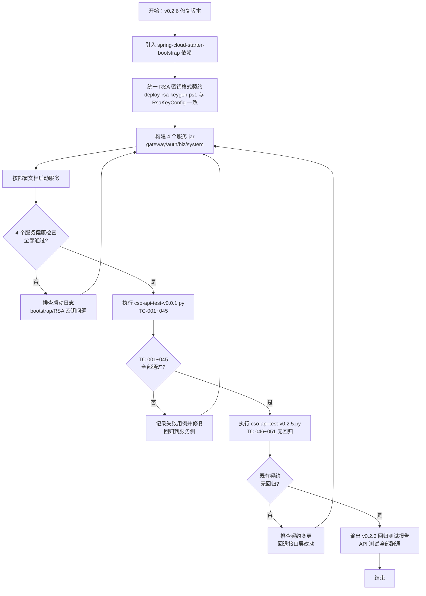

# 产品需求文档（PRD）
**项目名称**：云漫智企（CloudStrollOffice）
**版本号**：v0.2.6
**日期**：2026-08-09
**编写人**：BA

## 1. 产品背景
### 1.1 项目背景
云漫智企（CloudStrollOffice）是基于 Java 21 + Spring Boot 3.2.5 + Spring Cloud 2023.0.1 的微服务企业办公套件，由 gateway（9000）、auth-service（9100）、biz-service（9200）、system-service（9400）4 个业务服务及 Nacos/MariaDB/Redis 基础设施构成。v0.2.5 回归测试（docs/cso-v0.2.5/regression-api-test.md）发现：4 个业务服务均无法启动，v0.0.1 基线接口回归（TC-001~045）持续处于"环境阻塞"状态，API 测试链路无法跑通。

经根因分析确认两项配置/依赖缺陷（v0.0.1 基线遗留，审核项 T-02）：
1. **bootstrap 依赖缺失**：全项目 pom 均未引入 `spring-cloud-starter-bootstrap`，Spring Boot 3.x 下 bootstrap.yml 默认不加载，auth/biz/system 启动报 `No spring.config.import property has been defined`，Nacos 配置引导链路断裂；
2. **RSA 密钥格式契约不匹配**：deploy/env.json 的 `RSA_PUBLIC_KEY`/`RSA_PRIVATE_KEY` 为 PEM 文件整体 Base64（多行、含 BEGIN/END 标记），而 Java 端 RsaKeyConfig 使用严格 `Base64.getDecoder()` + `X509EncodedKeySpec`（期望 DER 编码单行 Base64），网关启动即报 `RSA 公钥解析失败`。

本版本（v0.2.6）聚焦修复上述部署与配置缺陷，使 4 个服务全部正常启动，并完成 v0.0.1 基线接口动态回归闭环，确保 API 测试全部跑通。

### 1.2 产品目标
- **G-1**：4 个业务服务（gateway/auth/biz/system）在标准部署流程下全部成功启动，健康检查通过率 100%。
- **G-2**：v0.0.1 基线接口回归脚本（cso-api-test-v0.0.1.py，TC-001~045）全部动态执行通过，通过率 100%（PASS=45、FAIL=0）。
- **G-3**：v0.2.5 接口回归脚本（cso-api-test-v0.2.5.py，TC-046~051）保持通过，既有接口契约（API-001~API-033）不受影响（PASS=26、FAIL=0）。

### 1.3 核心设计理念
- **最小修复、契约不变**：仅修复依赖配置、密钥格式契约与服务启动链路，不扩展任何新业务功能，不改变对外接口契约（API-001~API-033）与客户端运行时代码。
- **契约统一、配置无歧义**：RSA 密钥的生成脚本（deploy-rsa-keygen.ps1）与 Java 端解码逻辑保持同一格式契约（DER 单行 Base64），env.json 注入即用，消除配置歧义。
- **验证闭环、以测代证**：修复后必须通过健康检查 + 全量接口回归（TC-001~051）双重验证，以自动化脚本执行结果作为验收依据。

## 2. 目标用户
| 用户角色 | 使用场景 | 核心诉求 |
| --- | --- | --- |
| 运维/部署人员 | 按部署文档准备密钥与环境变量、构建 jar、启动并验证服务健康 | 4 个服务一键启动成功、健康检查通过、密钥格式无歧义 |
| 测试工程师（TE） | 补跑 v0.0.1 基线接口回归（TC-001~045）及 v0.2.5 接口回归（TC-046~051） | 服务可用，脚本全部动态执行通过，回归报告闭环 |
| 企业用户（最终用户） | 通过 Web/Windows 客户端使用办公套件业务功能 | 登录认证、业务操作不受影响，服务持续可用 |

## 3. 功能清单
| 功能编号 | 功能名称 | 所属模块 | 优先级 | 版本范围 |
| --- | --- | --- | --- | --- |
| F-001 | 引入 bootstrap 配置引导依赖 | gateway/auth/biz/system（构建配置） | 高 | v0.2.6 |
| F-002 | 修复 RSA 密钥格式契约 | deploy（密钥生成脚本）/gateway/auth（密钥解析） | 高 | v0.2.6 |
| F-003 | 服务启动与健康检查验证 | gateway/auth/biz/system（部署链路） | 高 | v0.2.6 |
| F-004 | v0.0.1 基线接口回归闭环 | scripts/API-TEST（测试资产） | 高 | v0.2.6 |
| F-005 | 既有接口契约无回归保障 | 全项目（接口层） | 中 | v0.2.6 |

## 4. 详细功能描述
### 4.1 F-001 引入 bootstrap 配置引导依赖
#### 功能描述
在根 pom（dependencyManagement）或各服务模块 pom 引入 `spring-cloud-starter-bootstrap`，恢复 bootstrap.yml（含 nacos discovery/config server-addr）在 Spring Boot 3.x 下的加载机制，打通 Nacos 配置引导链路，消除 auth/biz/system 启动报错 `No spring.config.import property has been defined`。
#### 业务规则
- 引入方式二选一（须保证最终效果一致）：
  - 方案 A：各服务模块（gateway/auth/biz/system）pom 添加 `spring-cloud-starter-bootstrap` 依赖；
  - 方案 B：根 pom 统一声明依赖并在各模块引入，或改用 `spring.config.import=optional:nacos:` 并关闭 import-check；
- 引入后 bootstrap.yml 必须重新生效：Nacos 的 `spring.cloud.nacos.discovery.server-addr` 与 `spring.cloud.nacos.config.server-addr` 能被加载；
- 不得改变既有接口契约与业务代码逻辑，仅允许构建/依赖配置变更。
#### 页面原型说明（或原型图位置）
无页面原型（纯后端构建/依赖配置修复）。

### 4.2 F-002 修复 RSA 密钥格式契约
#### 功能描述
统一 RSA 密钥格式契约：deploy-rsa-keygen.ps1 生成/env.json 注入的 `RSA_PUBLIC_KEY`、`RSA_PRIVATE_KEY` 与 Java 端 RsaKeyConfig 解码契约（`Base64.getDecoder()` + `X509EncodedKeySpec`，DER 编码单行 Base64）保持一致，消除网关启动报错 `RSA 公钥解析失败（Unable to decode key / extra data at the end）`。
#### 业务规则
- 修复方向二选一（须保证两端契约一致）：
  - 方案 A（推荐）：修改 deploy-rsa-keygen.ps1，输出 DER 编码单行 Base64（无 PEM 头尾、无换行），env.json 直接注入该格式；
  - 方案 B：Java 端 RsaKeyConfig 改用 MIME 解码器并剥离 PEM 头尾（BEGIN/END 标记与 \\r\\n），兼容多行 PEM Base64；
- env.json 中的密钥值格式必须与代码实际解码逻辑严格一致，配置无歧义；
- 密钥仍通过环境变量/配置文件注入，私钥不得入库、不得写入日志。
#### 页面原型说明（或原型图位置）
无页面原型（纯配置/脚本/代码契约修复）。

### 4.3 F-003 服务启动与健康检查验证
#### 功能描述
修复后重新构建 gateway、auth、biz、system 4 个服务 jar，全部成功启动、注册到 Nacos，并通过健康检查接口验证服务可用。
#### 业务规则
- 4 个服务按部署文档标准流程（env.json 环境变量 + Nacos 注册 + MariaDB/Redis 依赖）启动；
- 每个服务启动后须注册到 Nacos（Nacos 控制台可见实例）；
- 健康检查接口 `/api/v1/{module}/health`（auth/biz/system）返回服务名、状态、版本与时间戳，状态为正常；
- 启动日志不得再出现 `No spring.config.import property has been defined` 与 `RSA 公钥解析失败`。
#### 页面原型说明（或原型图位置）
无页面原型（部署验证类需求）。

### 4.4 F-004 v0.0.1 基线接口回归闭环
#### 功能描述
在服务可用前提下，补跑 scripts/API-TEST/cso-api-test-v0.0.1.py，使 TC-001~045 全部动态执行通过，消除历史"待执行/环境阻塞"状态，完成 v0.0.1 基线接口契约（API-001~API-033）动态回归闭环。
#### 业务规则
- 执行前置条件：网关（9000）、auth-service（9100）可访问，MariaDB/Redis/Nacos 正常；
- 执行命令：`python cso-api-test-v0.0.1.py http://localhost:9000`（或项目约定参数）；
- TC-001~045 全部断言通过，PASS=45、FAIL=0；
- 回归结果须记录到 v0.2.6 接口回归报告（docs/cso-v0.2.6/regression-api-test.md）。
#### 页面原型说明（或原型图位置）
无页面原型（接口回归测试）。

### 4.5 F-005 既有接口契约无回归保障
#### 功能描述
本版本修复不得改变既有接口契约（API-001~API-033）与客户端运行时代码，v0.2.5 接口回归脚本（cso-api-test-v0.2.5.py，TC-046~051）保持通过。
#### 业务规则
- 修复范围严格限定在依赖配置、密钥格式契约与服务启动链路，不触碰接口层（Controller/DTO/响应体）与客户端 lib/ 运行时代码；
- 执行 `python cso-api-test-v0.2.5.py <项目根>`，TC-046~051 保持 PASS=26、FAIL=0（TC-046-3 健康检查为可选场景）；
- 若修复过程涉及接口层文件变更，须在回归报告中说明并经 PM 确认。
#### 页面原型说明（或原型图位置）
无页面原型（契约保障类需求）。

## 5. 业务流程图
（使用 Mermaid 描述 v0.2.6 修复验证主流程。）

## 6. 数据需求
本版本为部署/配置修复版本，**不新增数据表、不修改表结构**，涉及的数据资产如下：
- **配置数据（env.json）**：`RSA_PUBLIC_KEY`、`RSA_PRIVATE_KEY`（格式由 PEM 整体 Base64 统一为 DER 单行 Base64，或 Java 端兼容 PEM 头尾）；数据库、Redis、Nacos 连接参数保持不变。
- **基础设施数据**：MariaDB（cloudstroll_office_auth 等 9 张表）、Redis（会话/黑名单/状态缓存）数据结构不变，仅依赖其可用性完成服务启动验证。
- **Nacos 注册数据**：gateway/auth/biz/system 4 个服务实例注册信息（服务启动后自动注册）。

## 7. 验收标准
本版本整体验收标准（与用户故事验收标准呼应）：
1. 根 pom 或 4 个服务模块 pom 已引入 `spring-cloud-starter-bootstrap`（或等价配置），构建通过，启动日志无 `No spring.config.import property has been defined`。
2. deploy-rsa-keygen.ps1 输出/env.json 注入的 RSA 密钥格式与 Java 端解码契约一致，网关启动无 `RSA 公钥解析失败`。
3. 重新构建后 gateway/auth/biz/system 4 个服务全部成功启动并注册到 Nacos，`/api/v1/{auth|biz|system}/health` 健康检查全部返回正常。
4. `python cso-api-test-v0.0.1.py http://localhost:9000` 执行通过：TC-001~045 全部 PASS（PASS=45、FAIL=0）。
5. `python cso-api-test-v0.2.5.py <项目根>` 执行通过：TC-046~051 保持 PASS=26、FAIL=0。
6. git 变更清单确认无接口层（Controller/DTO/响应体）与客户端 lib/ 运行时代码改动，既有接口契约 API-001~API-033 完整保留。
7. v0.2.6 接口回归报告（docs/cso-v0.2.6/regression-api-test.md）输出，记录 TC-001~051 全部动态执行结果，API 测试全部跑通。

## 8. 用户故事（User Stories）
### US-001：恢复服务配置引导，解决服务无法启动
#### 故事描述
作为（运维/部署人员），我想要（引入 bootstrap 配置引导依赖并恢复 bootstrap.yml 加载），以便（gateway/auth/biz/system 4 个服务能够正常启动并注册到 Nacos，打通 API 测试环境）。
#### 前置条件
- 具备 Maven 多模块项目源码与根 pom/模块 pom 修改权限；
- Nacos 2.3（8848）、MariaDB 10.6（3306）、Redis 7.2（6379）已启动且网络可达。
#### 验收标准
- [ ] Given 全项目 pom 未引入 bootstrap 相关依赖，When 在根 pom 或 4 个服务模块引入 `spring-cloud-starter-bootstrap`（或等价启用 `spring.config.import=optional:nacos:` 并关闭 import-check）并重新构建，Then 构建成功且 bootstrap.yml 生效，Nacos discovery/config server-addr 被正确加载
- [ ] Given 服务已具备 bootstrap 引导能力，When 按部署文档启动 auth/biz/system 服务，Then 启动日志不再出现 `No spring.config.import property has been defined`，服务成功注册到 Nacos
- [ ] Given 4 个服务启动完成，When 访问各服务健康检查接口，Then `/api/v1/{auth|biz|system}/health` 均返回正常状态
#### 边界情况与错误处理
| 场景 | 预期处理 |
| --- | --- |
| 仅根 pom 声明 dependencyManagement 而未在模块引入 | 启动仍报 import-check 错误，需在模块实际引入依赖 |
| 方案 B 使用 spring.config.import | 需同步关闭 import-check，否则仍报错 |
| 引入依赖后 Nacos 不可达 | 服务启动失败，报连接 Nacos 异常，需先保障基础设施可用 |
| 修复后仍有其他启动问题 | 纳入本版本继续排查或记录后续版本处理（URS 假设项） |
#### 关联功能编号
F-001、F-003

### US-002：统一 RSA 密钥格式契约，消除公钥解析失败
#### 故事描述
作为（运维/部署人员），我想要（deploy-rsa-keygen.ps1 生成的 RSA 密钥格式与 Java 端解码逻辑一致），以便（env.json 注入的密钥可被 gateway/auth 正确解析，服务不再因 `RSA 公钥解析失败` 而崩溃）。
#### 前置条件
- 已定位 deploy/env.json 中 `RSA_PUBLIC_KEY`/`RSA_PRIVATE_KEY` 为 PEM 整体 Base64（多行、含 BEGIN/END）与 Java 端严格 Base64 解码契约不一致的根因。
#### 验收标准
- [ ] Given 采用方案 A（脚本侧修复），When 重新执行 deploy-rsa-keygen.ps1 生成密钥，Then 输出为 DER 编码单行 Base64（无 PEM 头尾、无换行），env.json 注入后网关启动无 `RSA 公钥解析失败`
- [ ] Given 采用方案 B（代码侧兼容），When 修改 RsaKeyConfig 使用 MIME 解码并剥离 PEM 头尾，Then 原 env.json 的 PEM Base64 密钥可被正确解析，网关启动正常
- [ ] Given 网关与 auth 服务启动成功，When 使用签名密钥完成登录签发与网关验签，Then RS256 签名验签链路正常工作（Token 可签发、可验证）
- [ ] Given 密钥修复完成，When 检查日志与代码仓库，Then 私钥不写入日志、不进入代码仓库
#### 边界情况与错误处理
| 场景 | 预期处理 |
| --- | --- |
| 密钥为多行 Base64 且含 \\r\\n | 方案 A 下解码失败，需重新生成单行格式；方案 B 下自动剥离 |
| 公钥与私钥不配对 | 网关验签失败，请求返回 401，需成对生成密钥 |
| 密钥文件损坏/截断 | 解析抛异常，服务启动失败，需重新生成并注入 |
| 两端契约不一致的配置残留 | 部署文档同步说明格式要求，env.json 以统一契约为准 |
#### 关联功能编号
F-002、F-003

### US-003：完成 v0.0.1 基线接口动态回归闭环
#### 故事描述
作为（测试工程师），我想要（在服务可用的环境下补跑 v0.0.1 基线接口回归脚本），以便（TC-001~045 全部动态执行通过，消除"待执行/环境阻塞"历史状态，确认基线接口契约 API-001~API-033 真实可用）。
#### 前置条件
- 4 个服务（gateway/auth/biz/system）已全部启动且健康检查通过；
- Nacos、MariaDB、Redis 运行正常，admin 账号（admin/admin123）可用。
#### 验收标准
- [ ] Given 网关（9000）与认证服务（9100）可访问，When 执行 `python cso-api-test-v0.0.1.py http://localhost:9000`，Then 脚本正常跑完，退出码 0，不再因连接拒绝崩溃
- [ ] Given 基线回归脚本执行完成，When 核对 TC-001~045 执行结果，Then PASS=45、FAIL=0，登录、认证、网关鉴权、业务接口契约全部动态通过
- [ ] Given 回归结果汇总完成，When 输出 v0.2.6 接口回归报告，Then 记录 TC-001~045 执行结果与结论，闭环 v0.0.1 基线遗留项
#### 边界情况与错误处理
| 场景 | 预期处理 |
| --- | --- |
| 个别用例因测试数据冲突失败 | 记录失败用例，清理测试数据后重跑，直至全部通过 |
| 服务再次启动失败 | 回到 US-001/US-002 排查依赖与密钥配置 |
| 脚本参数与项目约定不一致 | 按脚本 README/项目文档约定传参（项目根或网关地址） |
| 回归环境数据残留（用户/验证码缓存） | 执行脚本前清理或按脚本约定重置测试数据 |
#### 关联功能编号
F-003、F-004

### US-004：保障既有接口契约无回归
#### 故事描述
作为（企业用户/最终用户），我想要（v0.2.6 修复不改变任何对外接口契约与客户端行为），以便（Web/Windows 客户端无需任何修改即可继续正常使用登录认证与业务功能）。
#### 前置条件
- v0.2.6 修复范围已完成并提交，git 变更清单可审计。
#### 验收标准
- [ ] Given v0.2.6 修复完成，When 检查 git 变更清单，Then 无接口层（Controller/DTO/响应体）与客户端 lib/ 运行时代码改动
- [ ] Given 既有接口契约（API-001~API-033）保持完整，When 执行 `python cso-api-test-v0.2.5.py <项目根>`，Then TC-046~051 保持 PASS=26、FAIL=0
- [ ] Given 本版本发布前，When 核对 API 文档与接口实现，Then 无新增/变更/删除接口，契约静态与动态双重确认无回归
#### 边界情况与错误处理
| 场景 | 预期处理 |
| --- | --- |
| 修复过程中意外改动接口层文件 | 回退改动，重新构建验证，回归报告中说明 |
| 既有脚本断言因环境（服务未启动）失败 | TC-046-3 健康检查为可选场景，按脚本约定 SKIP 不视为失败 |
| 客户端运行时代码被误改 | 回退，客户端构建产物与运行时代码保持原状 |
#### 关联功能编号
F-005

## 9. 版本规划
| 版本号 | 计划内容 | 状态 |
| --- | --- | --- |
| v0.0.1 | 统一认证授权与企业办公微服务化平台底座（基线版本，反推存量代码能力） | 已发布 |
| v0.2.5 | 部署资产集中化（deploy 目录、构建产物与脚本迁移） | 已发布 |
| v0.2.6 | 部署与配置缺陷修复：bootstrap 依赖引入、RSA 密钥格式契约统一、4 服务启动验证、v0.0.1 基线接口回归闭环（TC-001~045） | 本版本 |
| 后续版本 | 按产品规划迭代企业信息、人事管理、工作流审批、薪酬管理等业务能力 | 规划中 |

## 10. 附录
### 术语表
| 术语 | 说明 |
| --- | --- |
| bootstrap.yml | Spring Cloud 配置引导文件，Spring Boot 3.x 下需引入 spring-cloud-starter-bootstrap 才会默认加载，用于 Nacos 配置/注册引导 |
| import-check | spring-cloud-starter-alibaba-nacos-config 对 `spring.config.import` 的强校验，未配置时报 `No spring.config.import property has been defined` |
| DER 编码 | X.509 密钥二进制编码格式，经 Base64 后为单行文本，是 Java `X509EncodedKeySpec`/`PKCS8EncodedKeySpec` 的标准输入 |
| PEM 格式 | 带 `-----BEGIN/END ...-----` 头尾的 Base64 文本（可多行），OpenSSL 默认输出格式 |
| RSA_PUBLIC_KEY / RSA_PRIVATE_KEY | deploy/env.json 注入的 RSA 密钥对环境变量，供 gateway/auth 的 RsaKeyConfig 加载 |
| TC-001~045 | v0.0.1 基线接口回归用例编号（cso-api-test-v0.0.1.py） |
| TC-046~051 | v0.2.5 接口回归用例编号（cso-api-test-v0.2.5.py） |
| API-001~API-033 | 既有接口契约编号（API 设计文档） |

### 参考文档
- docs/cso-v0.2.5/regression-api-test.md（v0.2.5 回归测试报告，本版本需求来源：环境阻塞与根因分析）
- docs/cso-v0.2.6/cso-urs-v0.2.6.md（v0.2.6 用户需求说明书）
- docs/cso-urs.md（URS 主文档）
- docs/cso-prd.md（PRD 主文档）
- docs/cso-sad.md（系统架构设计文档，RsaKeyConfig/bootstrap 相关章节）
- docs/cso-api.md（API 设计文档，接口契约 API-001~API-033）
- scripts/API-TEST/cso-api-test-v0.0.1.py、cso-api-test-v0.2.5.py（接口回归脚本）
- deploy/env.json、deploy/scripts/deploy-rsa-keygen.ps1（密钥与环境配置资产）

<!-- SPDX-License-Identifier: Apache-2.0 / Copyright 2026 jenemy8023 <jenemy8023@163.com> -->
