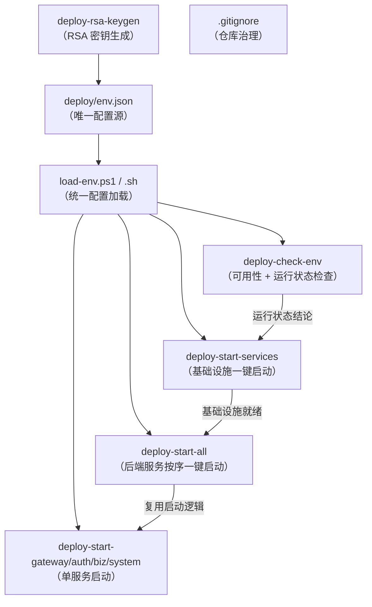
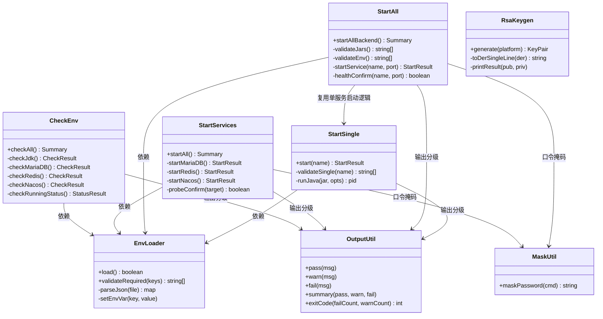
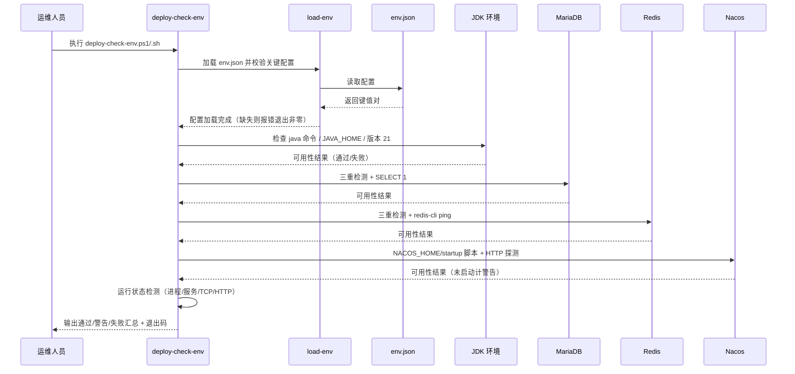
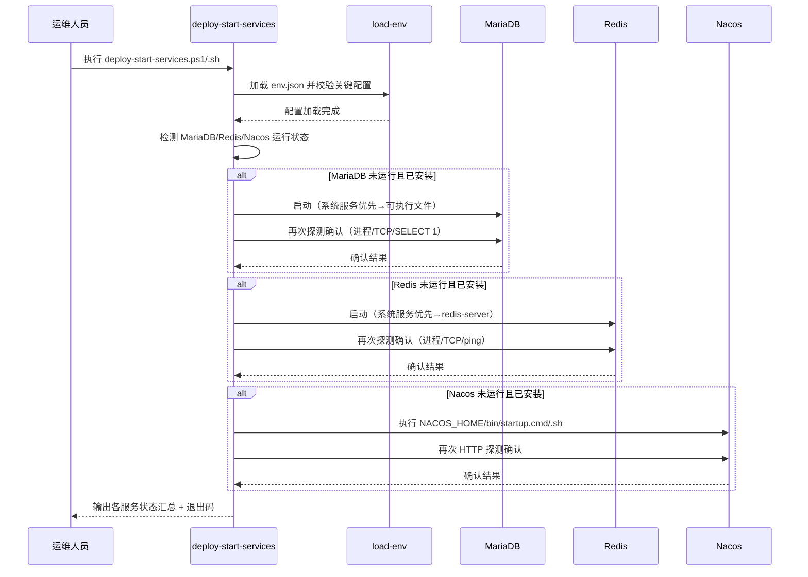
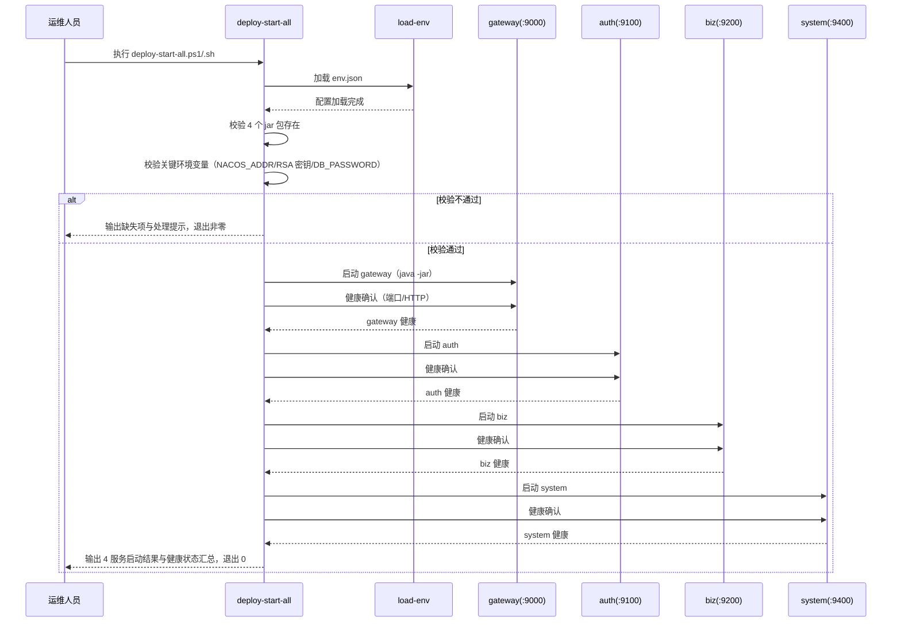
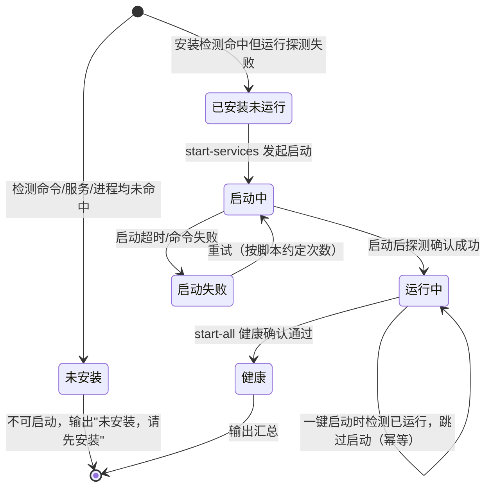
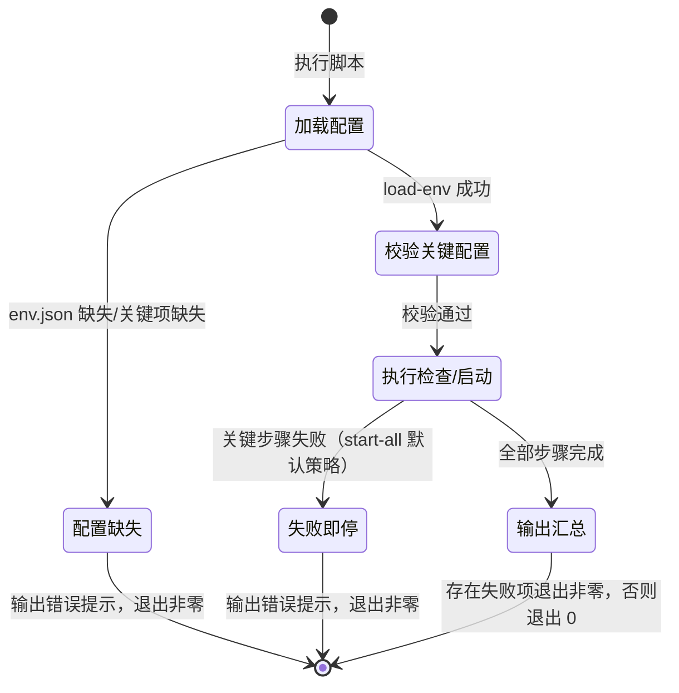
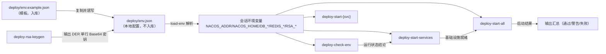

# 详细设计文档（LLD）
**项目名称**：云漫智企（CloudStrollOffice）
**版本号**：0.2.7
**日期**：2026-08-10
**编写人**：TL

> 说明：LLD 聚焦整体业务逻辑的详细设计（模块划分、业务流程、核心业务逻辑、业务规则等）；接口（API）的详细设计由 API 设计文档单独负责，LLD 中不重复编写接口定义、请求/响应参数等内容。本版本为部署脚本体系重构与仓库清洁度治理版本，不新增后端业务接口，设计对象为 `deploy/scripts` 脚本体系（.ps1/.sh 双平台）与 `.gitignore` 治理方案。

## 1. 模块概述

v0.2.7 聚焦**部署运维自动化**与**仓库整洁度治理**两大目标，全部改动集中在部署资产层（deploy/scripts 与项目根目录 .gitignore），不涉及后端架构、接口契约与数据库结构变更。

本版本模块划分如下：

| 模块 | 脚本/文件 | 职责 |
| --- | --- | --- |
| 配置加载模块 | load-env.ps1 / load-env.sh | 从 `deploy/env.json` 统一加载环境配置为会话环境变量，是所有脚本的前置依赖 |
| 环境可用性检查模块 | deploy-check-env.ps1 / deploy-check-env.sh | 检查 JDK/MariaDB/Redis/Nacos 四类环境是否已安装且可达，并输出运行状态 |
| 基础设施运行状态检查与一键启动模块 | deploy-start-services.ps1 / deploy-start-services.sh | 检测 MariaDB/Redis/Nacos 是否运行，对未运行的服务按序自动启动并探测确认 |
| 后端服务按序一键启动模块 | deploy-start-all.ps1 / deploy-start-all.sh | 校验 jar 包与关键环境变量后，按 gateway→auth→biz→system 顺序一键启动全部 Java 后台服务 |
| 单服务启动模块 | deploy-start-gateway.ps1/.sh、deploy-start-auth.ps1/.sh、deploy-start-biz.ps1/.sh、deploy-start-system.ps1/.sh | 单独启动某一个后端服务，行为与一键启动对应服务逻辑一致 |
| RSA 密钥生成模块 | deploy-rsa-keygen.ps1 / deploy-rsa-keygen.sh | 生成 RSA 2048 密钥对，输出 DER 编码单行 Base64（公钥 X.509 / 私钥 PKCS#8，契约 ADR-015） |
| 仓库治理模块 | 项目根目录 .gitignore | 排除生成、测试、调试过程中的临时文件与中间文件，保持仓库整洁可审计 |

模块协作关系：`load-env` 是全部脚本的统一入口前置；`deploy-check-env` 给出可用性与运行状态结论；`deploy-start-services` 依据运行状态拉起基础设施；`deploy-start-all` 在基础设施就绪后按序拉起后端服务；单服务启动脚本与 `deploy-start-all` 中对应服务启动逻辑复用同一套契约。

## 2. 模块划分与职责

### 2.1 模块依赖关系



### 2.2 各模块职责边界

| 模块 | 输入 | 处理 | 输出 | 边界说明 |
| --- | --- | --- | --- | --- |
| load-env | deploy/env.json | 解析 JSON 键值对 → 设置会话环境变量；缺失/关键项缺失时报错 | 环境变量集合 | 只负责加载，不执行检测与启动；不得硬编码任何地址/凭据 |
| deploy-check-env | load-env 后的环境变量 | 四类环境可用性检测 + 运行状态检测 | 通过/警告/失败分级汇总 + 退出码 | 只检查不启动；运行状态供 start-services 使用 |
| deploy-start-services | load-env 后的环境变量 | 检测运行状态 → 按序启动未运行的基础设施 → 探测确认 | 各服务状态汇总 + 退出码 | 只启动基础设施（MariaDB/Redis/Nacos），不启动后端服务；JDK 不启动 |
| deploy-start-all | load-env 后的环境变量 + 4 个 jar 包 | 前置校验 → 按序启动 4 个服务 → 逐个健康确认 | 启动结果与健康状态汇总 + 退出码 | 假设基础设施已就绪（可由 start-services 先行拉起）；失败即停 |
| deploy-start-{svc} | load-env 后的环境变量 + 对应 jar 包 | 校验本服务关键变量与 jar → 启动 | 单服务启动结果 + 退出码 | 与 start-all 对应服务逻辑一致，供按需单独启动 |
| deploy-rsa-keygen | openssl / .NET 加密库（平台自带） | 生成 RSA 2048 → 输出 DER 单行 Base64 | RSA_PUBLIC_KEY / RSA_PRIVATE_KEY | 不读取 env.json，输出供手工注入 env.json（配置驱动由 load-env 侧保障） |
| .gitignore | 项目文件清单 | 识别临时/中间文件 → 分区补充规则 → git status 验证 | 忽略规则 | 不得误伤源码、文档、模板与配置模板（env.example.json、.gitkeep） |

## 3. 类图

脚本体系非面向对象实现，此处以类图表达各脚本模块的职责对象及其交互关系（脚本视为"执行对象"，方法视为关键处理函数）。



## 4. 核心业务流程时序图

### 4.1 环境可用性检查流程（deploy-check-env）



### 4.2 基础设施一键启动流程（deploy-start-services）



### 4.3 后端服务按序一键启动流程（deploy-start-all）



## 5. 状态图

### 5.1 基础设施/服务运行状态机



### 5.2 脚本执行状态机



## 6. 核心业务逻辑

### 6.1 配置加载逻辑（load-env）

```text
function load-env():
    envJsonPath = $ProjectDir/env.json 或 $PROJECT_DIR/env.json
    if envJsonPath 不存在:
        输出错误："未找到 env.json，请复制 env.example.json 为 env.json 并填写配置"
        exit 1
    envMap = 解析 envJsonPath（PowerShell: ConvertFrom-Json；Bash: python/jq 或 grep 解析）
    for key, value in envMap:
        设置会话环境变量 key = value
    validateRequired(["NACOS_ADDR", "NACOS_HOME", "DB_HOST", "DB_PORT",
                      "DB_USERNAME", "DB_PASSWORD", "REDIS_HOST", "REDIS_PORT"])
    if 缺失项 nonEmpty:
        逐个列出缺失项，输出错误提示
        exit 1
    return 0
```

### 6.2 可用性检查逻辑（deploy-check-env）

```text
function checkAll():
    results = []
    results.append(checkJdk())      # java 命令可执行 && JAVA_HOME 有效 && 版本包含 "21"
    results.append(checkMariaDB())  # 三重检测命中任一 → 已安装；SELECT 1 验证连通
    results.append(checkRedis())    # 三重检测命中任一 → 已安装；redis-cli ping = PONG
    results.append(checkNacos())    # NACOS_HOME/bin/startup.cmd|sh 存在 → 已安装；HTTP 探测含 "Nacos"
    running = checkRunningStatus()  # 进程/系统服务/TCP/HTTP 运行状态
    汇总输出：通过/警告/失败分级 + 运行状态列
    按 6.5 退出码约定返回
```

三重检测（MariaDB/Redis）命中规则：命令可执行（mariadb/mysql/mysqld/mariadbd 或 redis-cli/redis-server）→ 已安装；系统服务（DB_SERVICE_NAME/REDIS_SERVICE_NAME，逗号分隔多值）存在 → 已安装；进程（DB_PROCESS_NAME/REDIS_PROCESS_NAME，逗号分隔多值）存在 → 已安装；任一命中即通过安装检测。

Nacos 可用性特例：已安装但 HTTP 探测失败 → 计"警告（未运行）"，不误判为未安装，与运行状态检测衔接。

### 6.3 运行状态检测逻辑

```text
function checkRunningStatus():
    JDK: 复用 checkJdk 结论，可用即视为就绪（无启动概念）
    MariaDB: DB_PROCESS_NAME 进程存在 || DB_SERVICE_NAME 服务 Running || TCP:3306 可达 → 运行中
    Redis:   REDIS_PROCESS_NAME 进程存在 || REDIS_SERVICE_NAME 服务 Running || TCP:6379 可达 → 运行中
    Nacos:   HTTP http://NACOS_ADDR/nacos/ 返回含 "Nacos" → 运行中
             否则检测 java 进程命令行含 nacos 关键字 → 运行中（辅助）
    return 各服务状态：运行中 / 未运行 / 未安装
```

### 6.4 基础设施一键启动逻辑（deploy-start-services）

```text
function startAll():
    load-env()
    对 MariaDB/Redis/Nacos 分别检测运行状态
    未安装 → 输出"未安装，请先安装"，计入失败，不尝试启动
    运行中 → 跳过（幂等），输出"已运行"
    未运行 → 按启动顺序执行：
        MariaDB: Start-Service $DB_SERVICE_NAME（Windows）优先，
                 systemctl start（Linux）优先，否则 Start-Process mysqld/mariadbd / 后台启动
        Redis:   Start-Service / systemctl 优先，否则 redis-server（后台）
        Nacos:   执行 NACOS_HOME/bin/startup.cmd（Windows，standalone）
                 或 bash NACOS_HOME/bin/startup.sh（Linux）
    每次启动后再次探测确认（进程/TCP/ping/HTTP），确认成功输出"通过"
    启动超时或失败输出"警告/失败"并给出处理建议，不得报假成功
    输出各服务状态汇总，按退出码约定返回
```

启动顺序固定：MariaDB → Redis → Nacos（数据库与缓存先于注册中心，避免服务注册依赖缺失）。

### 6.5 后端服务按序一键启动逻辑（deploy-start-all）

```text
function startAllBackend():
    load-env()
    missingJars = 校验 4 个 jar 存在（deploy/cloudoffice-gateway.jar 等）
    missingVars = 校验关键变量（NACOS_ADDR、RSA_PUBLIC_KEY、RSA_PRIVATE_KEY、DB_PASSWORD 等）
    if missingJars 或 missingVars 非空:
        输出缺失项与处理提示，exit 1（不启动任何服务）
    for svc in [gateway(9000), auth(9100), biz(9200), system(9400)]:
        startService(svc): java -Xms256m -Xmx512m -jar <jar>
            Windows: Start-Process 独立窗口/后台；Linux: nohup/后台，记录 PID 或日志文件
        if not healthConfirm(svc, port):
            输出错误提示，停止后续启动，exit 1
    if 全部健康: 输出 4 服务启动结果与健康状态汇总，exit 0
```

健康确认方式：HTTP 探测（如经网关 `http://localhost:9000/api/v1/{auth|biz|system}/health`）或各服务端口探测；按等待重试次数/超时重试，仍失败则失败即停。

### 6.6 RSA 密钥生成逻辑（deploy-rsa-keygen）

```text
function generate():
    keyPair = 生成 RSA 2048（Windows: System.Security.Cryptography.RSA；Linux: openssl genrsa 2048）
    公钥 = DER 编码 X.509 SubjectPublicKeyInfo，转单行 Base64（无 PEM 头尾、无换行）
    私钥 = DER 编码 PKCS#8 PrivateKeyInfo，转单行 Base64（无 PEM 头尾、无换行）
    输出：
        RSA_PUBLIC_KEY=<单行 Base64>
        RSA_PRIVATE_KEY=<单行 Base64>
    契约自校验：输出不含 "-----BEGIN"，不含换行，可被严格 Base64 解码
    （.sh 与 .ps1 输出格式完全一致，符合 ADR-015）
```

### 6.7 输出分级与退出码约定

```text
输出分级：
    [通过] <信息>   （绿色，成功）
    [警告] <信息>   （黄色，可继续，如 Nacos 已安装未运行）
    [失败] <信息>   （红色，处理建议 + 计入失败汇总）
    汇总行：通过 N 项 / 警告 M 项 / 失败 K 项

退出码约定：
    failCount == 0 → exit 0（全部通过；存在警告但无失败按约定 exit 0 并提示警告）
    failCount > 0  → exit 1（存在失败项）
    关键步骤失败（env.json 缺失、校验不通过、启动失败即停）→ exit 1
```

### 6.8 .gitignore 治理逻辑

```text
1. 整体检查项目根目录文件与子目录，识别生成、测试、调试过程文件：
   - JVM/应用调试产物：*.hprof、堆转储、hs_err_pid*.log、dump 目录
   - 测试产物与缓存：__pycache__/.pytest_cache（已有）、surefire-reports、
     接口测试中间文件（token 缓存、临时报告）
   - 构建过程中间产物：.flattened-pom.xml、*.lastUpdated、maven-status/、
     dependency-reduced-pom.xml 等
   - 工具残留：抓包/API 调试会话文件（*.saz、*.chls、*.har、会话缓存等）
2. 按现有 .gitignore 分区风格新增规则（带路径前缀或精确模式）
3. 治理后执行 git status 验证：临时/中间文件不再出现在待提交清单
4. 复核：不误伤 env.example.json、.gitkeep、pom.xml、bootstrap.yml、源码与文档
```

## 7. 业务规则与约束

| 编号 | 规则/约束 | 说明 |
| --- | --- | --- |
| R-01 | 配置驱动 | 全部脚本统一经 load-env 从 deploy/env.json 加载配置；脚本内不得硬编码环境地址（如 192.168.1.100）与凭据 |
| R-02 | 退出码约定 | 全部通过退出 0；存在失败项退出非零（1）；关键步骤失败退出 1 |
| R-03 | 输出分级 | 通过（绿）/警告（黄）/失败（红）三级前缀；汇总显示通过/警告/失败计数 |
| R-04 | 双平台对齐 | .ps1 与 .sh 同名脚本行为一致，可通过语法与契约自校验 |
| R-05 | RSA 密钥契约（ADR-015） | 密钥为 DER 编码单行 Base64（公钥 X.509 / 私钥 PKCS#8），无 PEM 头尾、无换行，与 Java 端 `Base64.getDecoder()` + `X509EncodedKeySpec`/`PKCS8EncodedKeySpec` 解码契约一致 |
| R-06 | 口令掩码 | DB_PASSWORD/REDIS_PASSWORD 不得明文打印，命令中口令以掩码（`****`）显示 |
| R-07 | 部署顺序 | 基础设施：MariaDB → Redis → Nacos；后端服务：gateway(9000) → auth(9100) → biz(9200) → system(9400) |
| R-08 | 结果可确认 | 基础设施启动后再次探测确认；后端服务启动后健康确认，不得报假成功 |
| R-09 | 失败即停 | start-all 默认策略：任一服务启动/健康失败即停止后续启动，输出明确错误提示 |
| R-10 | 幂等启动 | 已运行的服务跳过启动，直接确认并输出"已运行" |
| R-11 | JDK 无启动概念 | JDK 仅检查可用性（命令 + JAVA_HOME + 版本 21），不执行启动操作 |
| R-12 | 未安装不可启动 | 未安装的服务不得尝试启动，输出"未安装，请先安装"并计入失败 |
| R-13 | 弃用脚本清理 | 删除/弃用 deploy-env.ps1、deploy-env-template.ps1/.sh 等残留脚本，避免与 load-env 双份配置逻辑混淆；移除后同步检查引用关系 |
| R-14 | 前置检查对齐 | deploy-check-env 检查范围与"可用性检查 + 运行状态检查"对齐（F-002~F-006），移除无关检查项（如 Maven/Git 版本检查）或降为可选信息 |
| R-15 | 仓库治理不误伤 | .gitignore 新增规则不得误伤应入库文件（env.example.json、.gitkeep、pom.xml、bootstrap.yml、源码与文档） |
| R-16 | 版权头 | 脚本文件保留 SPDX-License-Identifier（Apache-2.0）与版权声明，简体中文注释 |

## 8. 业务数据流

### 8.1 脚本配置数据流



### 8.2 .gitignore 治理数据流

```text
项目文件清单 → 识别生成/测试/调试过程文件（JVM 调试产物、测试缓存、构建中间产物、工具残留）
           → 按分区新增忽略规则（带路径前缀/精确模式）
           → git status 验证（临时/中间文件消失）
           → 复核应入库文件未被误伤
```

## 9. 数据结构定义

### 9.1 env.json 关键配置项

| 配置项 | 类型 | 说明 | 使用脚本 |
| --- | --- | --- | --- |
| NACOS_ADDR | string | Nacos 地址 host:port | check-env / start-services / start-all / start-{svc} |
| NACOS_HOME | string | Nacos 安装目录（检测/启动脚本定位） | check-env / start-services |
| DB_HOST / DB_PORT | string / number | 数据库地址与端口 | check-env / start-all / start-{svc} |
| DB_USERNAME / DB_PASSWORD | string | 数据库账号口令（口令掩码） | check-env / start-all / start-{svc} |
| DB_USER | string | 数据库兼容账号项（biz 服务使用，与 DB_USERNAME 差异保持现状） | start-biz |
| DB_SERVICE_NAME / DB_PROCESS_NAME | string | 数据库系统服务/进程名（逗号分隔多值） | check-env / start-services |
| REDIS_HOST / REDIS_PORT | string / number | Redis 地址与端口 | check-env / start-services |
| REDIS_PASSWORD | string | Redis 口令（掩码，客户端支持时使用） | check-env / start-services |
| REDIS_DATABASE | number | Redis 数据库索引 | check-env |
| REDIS_SERVICE_NAME / REDIS_PROCESS_NAME | string | Redis 系统服务/进程名（逗号分隔多值） | check-env / start-services |
| RSA_PRIVATE_KEY / RSA_PUBLIC_KEY | string | DER 编码单行 Base64 密钥（ADR-015） | start-all / start-{gateway,auth} |
| VERIFICATION_CODE_* / PASSWORD_MIN_LENGTH 等 | string/number | 应用参数（脚本不改写） | 不直接使用 |

### 9.2 脚本内部结构

| 结构 | 字段 | 说明 |
| --- | --- | --- |
| CheckResult | name / installed / reachable / detail | 单项可用性检查结果（名称、是否安装、是否可达、明细） |
| StatusResult | name / status | 运行状态结果（运行中/未运行/未安装） |
| StartResult | name / started / confirmed / detail | 启动结果（服务名、是否启动、是否确认、明细） |
| Summary | pass / warn / fail / items | 汇总（通过/警告/失败计数与明细项） |

## 10. 异常处理策略

| 异常场景 | 分类 | 处理方式 | 退出码 |
| --- | --- | --- | --- |
| env.json 不存在 | 配置异常 | 输出错误提示（复制 env.example.json 并填写配置） | 1 |
| 关键配置项缺失 | 配置异常 | 逐个列出缺失项，输出处理提示 | 1 |
| 命令不存在（java/mysql/redis-cli 等） | 环境缺失 | 输出"失败"并给出安装/配置建议（如安装 JDK 21） | 1 |
| JDK 版本非 21 | 环境不符 | 输出"失败"并提示安装 JDK 21 | 1 |
| MariaDB 已安装但 SELECT 1 失败 | 连通异常 | 输出"失败"提示检查 DB_HOST/DB_PORT/DB_USERNAME/DB_PASSWORD | 1 |
| Redis 已安装但 ping 不通 | 连通异常 | 输出"失败"提示检查 REDIS_HOST/REDIS_PORT/REDIS_PASSWORD | 1 |
| Nacos 已安装但 HTTP 探测失败 | 未运行 | 输出"警告（未运行）"，与运行状态检测衔接 | 0（提示警告） |
| 服务启动超时/失败 | 启动异常 | 输出"警告/失败"并给出等待重试/手动检查建议，不报假成功 | 1 |
| 启动需要管理员权限 | 权限异常 | 输出权限提示，指导以管理员身份执行 | 1 |
| 端口被占用（9000/9100/9200/9400） | 运行冲突 | 提示检查端口占用并指导处理 | 1 |
| 服务未安装 | 环境缺失 | 不尝试启动，输出"未安装，请先安装"并计入失败 | 1 |
| jar 包缺失 / 关键变量缺失 | 前置校验失败 | 输出缺失项与处理提示，不启动任何服务 | 1 |
| 后端服务健康确认失败 | 启动异常 | 重试（约定次数/超时）后仍失败 → 失败即停，输出错误提示 | 1 |

## 11. 日志规范

| 输出类型 | 格式 | 级别说明 |
| --- | --- | --- |
| 成功 | `[通过] <信息>`（绿色） | 检查/启动/确认成功 |
| 警告 | `[警告] <信息>`（黄色） | 可继续但需关注（如 Nacos 已安装未运行、启动超时） |
| 失败 | `[失败] <信息>`（红色，含处理建议） | 检查失败/启动失败/校验失败 |
| 汇总 | `通过 N 项 / 警告 M 项 / 失败 K 项` | 脚本末尾统一输出 |
| 启动确认 | `[启动] <服务名> :<端口> ...` | start-all 每服务启动与健康确认路径 |

日志纪律：口令与私钥一律掩码/不输出（DB_PASSWORD、REDIS_PASSWORD、RSA_PRIVATE_KEY 明文禁止出现在输出）；关键路径（load-env 加载、每项检查、每服务启动与健康确认、退出码）必须有输出；颜色输出在非交互终端自动降级为纯文本（可配置开关）。

## 12. 性能优化点

| 优化点 | 措施 |
| --- | --- |
| 健康确认等待 | 设置等待重试次数与单次等待超时（如 3 次 × 5 秒），避免无限等待；超时后失败即停 |
| 幂等启动 | 已运行的服务跳过启动直接确认，避免重复启动开销与端口冲突 |
| 检查顺序 | 先轻量命令检测（命令存在性）再重量级探测（SELECT 1/ping/HTTP），失败项及时短路 |
| 探测频率 | 探测间隔（如 1~2 秒）适度，避免启动等待期间高频空转 |
| 脚本开销 | 脚本仅做编排与探测，无额外进程驻留；启动的后台服务由系统管理（服务/进程），脚本退出不误杀 |
| 双平台复用 | 同一契约逻辑在 .ps1/.sh 内最小重复实现，避免维护两套不一致逻辑 |

## 13. 单元测试策略

### 13.1 测试范围与工具

本版本为部署脚本重构与仓库治理版本，测试以**脚本语法校验、契约自校验与行为验证**为主：

- 语法校验：全部 .ps1 通过 PowerShell 语法解析（`[System.Management.Automation.PSParser]` 或 `powershell -NoProfile -Command` 预检）；全部 .sh 通过 `bash -n` 校验；
- 契约自校验：deploy-rsa-keygen.ps1/.sh 输出满足 DER 单行 Base64 契约（无 BEGIN/END、无换行、可严格 Base64 解码、公钥私钥配对）；
- 行为验证：在部署环境依次执行 deploy-check-env → deploy-start-services → deploy-start-all，核对输出分级与退出码；
- 仓库治理验证：更新 .gitignore 后执行 `git status`，确认无临时/中间文件，且应入库文件未缺失。

### 13.2 用例划分

| 被测对象 | 用例方向 | 验收关联 |
| --- | --- | --- |
| load-env | env.json 存在时正确加载全部键值对；缺失时退出非零并提示 | 验收标准 1 / US-001 |
| load-env | 关键配置缺失时逐个列出缺失项并退出非零 | 验收标准 1 / US-001 |
| deploy-check-env | JDK 命令/JAVA_HOME/版本 21 检测；版本不符输出失败并提示 | 验收标准 2 / US-001 |
| deploy-check-env | MariaDB 三重检测 + SELECT 1；已安装不可连接输出失败 | 验收标准 2 / US-001 |
| deploy-check-env | Redis 三重检测 + ping；Nacos NACOS_HOME/startup + HTTP 探测 | 验收标准 2 / US-001 |
| deploy-check-env | Nacos 已安装未启动计警告（非未安装）；存在失败项退出非零 | 验收标准 2 / US-001 |
| deploy-start-services | MariaDB/Redis/Nacos 未运行时自动启动并探测确认，无假成功 | 验收标准 3 / US-002 |
| deploy-start-services | 启动方式优先级（系统服务→可执行文件）；未安装不尝试启动 | 验收标准 3 / US-002 |
| deploy-start-services | JDK 仅输出可用性结论，不执行启动 | 验收标准 3 / US-002 |
| deploy-start-all | 前置校验（jar 包 + 关键变量）失败时输出缺失项退出非零 | 验收标准 4 / US-003 |
| deploy-start-all | 按 gateway→auth→biz→system 顺序启动，逐服务健康确认后继续 | 验收标准 4 / US-003 |
| deploy-start-all | 任一步骤失败失败即停，输出错误提示；全部成功输出汇总退出 0 | 验收标准 4 / US-003 |
| 单服务启动 | deploy-start-gateway/auth/biz/system 各自独立可用，行为与一键一致 | 验收标准 5 / US-003 |
| deploy-rsa-keygen | .ps1/.sh 输出契约一致（DER 单行 Base64），与 Java 端解码契约一致 | 验收标准 6 / US-004 |
| 弃用脚本清理 | deploy-env.ps1/deploy-env-template.ps1/.sh 已移除或明确弃用，引用关系同步更新 | 验收标准 6 / US-004 |
| 输出与退出码 | 双平台输出分级（通过/警告/失败）与退出码约定一致 | 验收标准 7 / US-004 |
| .gitignore | JVM 调试产物/测试缓存/构建中间产物/工具残留规则覆盖，git status 无过程文件 | 验收标准 8 / US-005 |
| .gitignore | 不误伤 env.example.json、.gitkeep、pom.xml、bootstrap.yml、源码与文档 | 验收标准 8 / US-005 |

### 13.3 边界与异常用例

- env.json 为非法 JSON → load-env 解析失败退出非零并提示；
- 密码出现在命令中 → 日志以掩码显示，输出不含 DB_PASSWORD/REDIS_PASSWORD 明文；
- 密钥含 PEM 头尾/多行 → 契约自校验失败，重新生成单行格式（US-004 边界）；
- 公钥私钥不配对 → RSA 校验失败，成对重新生成；
- 服务启动超时 → 输出警告并给出重试/手动检查建议，不报假成功（US-002 边界）；
- 端口被占用 → 提示检查端口占用并指导处理（US-003 边界）；
- .gitignore 新增规则误伤应入库文件 → git status 复核发现后修正为路径前缀/精确模式（US-005 边界）；
- 已跟踪文件被新规则忽略 → 新规则只影响未跟踪文件；如需停止跟踪既有文件需 `git rm --cached` 并确认（US-005 边界）。

### 13.4 覆盖目标

- PRD 第 7 章 8 条验收标准均有对应校验用例；
- 5 个用户故事（US-001~US-005）的验收标准全覆盖；
- 双平台（Windows PowerShell / Linux Bash）脚本语法与契约自校验全部通过；
- `git status` 治理验证通过后方可交付。

<!-- SPDX-License-Identifier: Apache-2.0 / Copyright 2026 jenemy8023 <jenemy8023@163.com> -->
