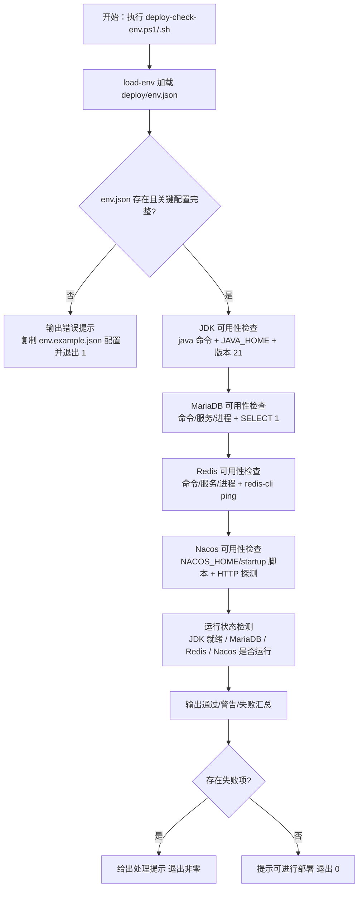
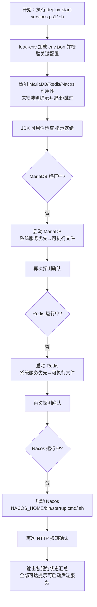
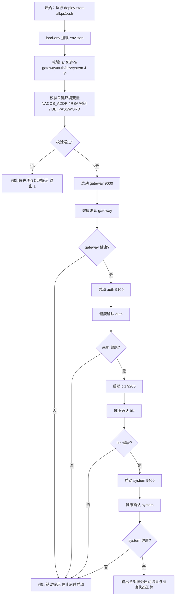

# 产品需求文档（PRD）
**项目名称**：云漫智企（CloudStrollOffice）
**版本号**：0.2.7
**日期**：2026-08-10
**编写人**：BA

## 1. 产品背景
### 1.1 项目背景
云漫智企（CloudStrollOffice）是基于 Java 21 + Spring Boot 3.2.5 + Spring Cloud 2023.0.1 的微服务企业办公套件，由 gateway（9000）、auth-service（9100）、biz-service（9200）、system-service（9400）4 个业务服务及 Nacos 2.3（8848）/ MariaDB 10.6（3306）/ Redis 7.2（6379）基础设施构成。v0.2.5 起部署资产集中化到 `deploy` 目录，v0.2.6 修复了 bootstrap 依赖与 RSA 密钥格式契约，4 个服务已可正常启动。

当前 `deploy/scripts` 下脚本（.ps1/.sh 双版本）存在历史遗留问题：`deploy-check-env.ps1` 仍以硬编码默认地址（192.168.1.100 等）为主、参数化加载 env.json 为辅，且将 Nacos 可用性检查误放于"连通性检查"；`deploy-env.ps1`/`deploy-env-template.ps1` 为弃用残留脚本；`deploy-rsa-keygen.sh` 与 `.ps1` 的密钥输出契约不一致；各脚本对 JDK/MariaDB/Redis/Nacos 的"可用性检查"与"运行状态检查"能力分散、输出格式与退出码约定不统一；缺少"按部署顺序一键启动全部 Java 后台服务"的总入口脚本。

本版本（v0.2.7）聚焦 **部署脚本体系重构** 与 **仓库清洁度治理**：系统性检查并重构 `deploy/scripts` 全部脚本，实现基于 `deploy/env.json` 的环境可用性检查、基础设施运行状态检查与一键启动、后端服务按序一键启动三大能力，并在 `.gitignore` 中排除生成/测试/调试过程中的临时与中间文件，提升部署运维自动化水平与版本库健康度。

### 1.2 产品目标
- **G-1 环境可用性检查统一化**：运维人员可基于 `deploy/env.json` 一键检查 JDK、MariaDB、Redis、Nacos 四类运行环境的可用性（是否已安装），避免人工逐个验证、脚本与配置分离导致的检查遗漏。
- **G-2 基础设施一键启动**：运维人员可一键检查 JDK、MariaDB、Redis、Nacos 四类环境是否已启动，并对未启动的基础设施（MariaDB/Redis/Nacos）自动执行启动，减少部署准备阶段的重复操作与手工命令。
- **G-3 后端服务按序一键启动**：运维人员可按部署顺序一键启动全部 Java 后台服务（gateway → auth → biz → system），实现"一条命令完成整个后端环境拉起"。
- **G-4 脚本体系重构与双平台对齐**：对 `deploy/scripts` 目录下全部脚本（.ps1/.sh 双版本）进行系统性检查与重构，消除契约不一致（RSA 密钥格式契约、弃用脚本残留、硬编码默认参数），使 Windows 与 Linux 行为一致、输出清晰、可独立验证。
- **G-5 仓库临时/中间文件治理**：整体检查项目当前文件，将生成、测试、调试过程中产生的临时文件与中间文件在 `.gitignore` 中排除，避免误提交、保持 git 仓库整洁与可审计性。

**量化指标**：重构后 `deploy/scripts` 脚本全部通过双平台（Windows PowerShell / Linux Bash）语法与契约自校验；一键启动脚本可在未启动基础设施的环境下自动拉起 MariaDB/Redis/Nacos 并完成 4 个后端服务按序启动；`.gitignore` 覆盖新增识别的临时/中间文件类型后，`git status` 不再出现生成、测试、调试过程文件。

### 1.3 核心设计理念
- **配置驱动、脚本无感**：全部脚本统一通过 `load-env.ps1`/`load-env.sh` 从 `deploy/env.json` 加载环境配置（NACOS_ADDR/NACOS_HOME/DB_*/REDIS_*/RSA 密钥等），脚本内不硬编码环境地址与凭据，配置变更只改 env.json。
- **检查与启动分离、一键总入口**：可用性检查（deploy-check-env）、基础设施运行状态检查与一键启动（deploy-start-services）、后端服务按序一键启动（deploy-start-all）三种能力职责清晰、可独立执行，并可通过组合实现"一条命令完成整个后端环境拉起"。
- **契约统一、双平台对齐**：.sh 与 .ps1 行为保持一致，RSA 密钥格式契约（DER 编码单行 Base64，公钥 X.509 / 私钥 PKCS#8）与 Java 端解码逻辑严格一致（ADR-015，v0.2.6 确立）；脚本输出统一分级（通过/警告/失败）与退出码约定（失败非零）。
- **结果可确认、以测代证**：基础设施一键启动后再次探测确认；后端服务启动后通过端口/HTTP 探测确认健康，避免"命令已执行但服务未起来"的假成功；关键脚本提供契约自校验。
- **仓库整洁、临时文件不入库**：生成、测试、调试过程文件与临时/中间文件在 `.gitignore` 中排除，不误伤应入库的源码、文档、模板与配置模板（env.example.json）。

## 2. 目标用户
| 用户角色 | 使用场景 | 核心诉求 |
| --- | --- | --- |
| 运维/部署工程师 | 基于 env.json 检查 JDK/MariaDB/Redis/Nacos 可用性与运行状态、一键启动未运行的基础设施、按序一键启动全部 Java 后端服务 | 一条命令完成环境检查与拉起，输出清晰、失败可定位、双平台一致 |
| 后端开发工程师 | Maven 多模块（gateway/auth/biz/system）编译、调试与本地环境联调 | 本地环境准备与重建、环境异常时快速检查与拉起服务、脚本契约一致 |
| 测试工程师（TE） | 接口回归测试与部署验收 | 在干净环境按脚本完成部署前置检查与服务启动，验证一键脚本在测试环境可用 |
| 项目版本管理员 / 维护者 | 版本库整洁与仓库治理 | 审核 `.gitignore` 覆盖情况，确保生成、测试、调试临时/中间文件不入库 |

## 3. 功能清单
| 功能编号 | 功能名称 | 所属模块 | 优先级 | 版本范围 |
| --- | --- | --- | --- | --- |
| F-001 | env.json 配置加载统一 | deploy/scripts（load-env.ps1 / load-env.sh） | 高 | v0.2.7 |
| F-002 | JDK 可用性检查 | deploy/scripts（deploy-check-env.ps1 / .sh） | 高 | v0.2.7 |
| F-003 | MariaDB 可用性检查 | deploy/scripts（deploy-check-env.ps1 / .sh） | 高 | v0.2.7 |
| F-004 | Redis 可用性检查 | deploy/scripts（deploy-check-env.ps1 / .sh） | 高 | v0.2.7 |
| F-005 | Nacos 可用性检查 | deploy/scripts（deploy-check-env.ps1 / .sh） | 高 | v0.2.7 |
| F-006 | 运行状态检测 | deploy/scripts（deploy-check-env.ps1 / .sh、deploy-start-services.ps1 / .sh） | 高 | v0.2.7 |
| F-007 | 未启动基础设施一键启动 | deploy/scripts（deploy-start-services.ps1 / .sh） | 高 | v0.2.7 |
| F-008 | 后端服务按序一键启动 | deploy/scripts（deploy-start-all.ps1 / .sh） | 高 | v0.2.7 |
| F-009 | 单服务启动脚本保持可用 | deploy/scripts（deploy-start-gateway/auth/biz/system.ps1 / .sh） | 中 | v0.2.7 |
| F-010 | 前置检查脚本整合 | deploy/scripts（deploy-check-env.ps1 / .sh） | 高 | v0.2.7 |
| F-011 | 脚本契约与输出规范 | deploy/scripts（全部 .ps1 / .sh） | 高 | v0.2.7 |
| F-012 | .gitignore 临时/中间文件治理 | 项目根目录（.gitignore） | 高 | v0.2.7 |

## 4. 详细功能描述
### 4.1 F-001 env.json 配置加载统一
#### 功能描述
全部重构脚本统一通过 `load-env.ps1` / `load-env.sh` 从 `deploy/env.json` 加载环境配置（NACOS_ADDR、NACOS_HOME、DB_HOST/DB_PORT/DB_USERNAME/DB_PASSWORD/DB_SERVICE_NAME/DB_PROCESS_NAME、REDIS_HOST/REDIS_PORT/REDIS_PASSWORD/REDIS_DATABASE/REDIS_SERVICE_NAME/REDIS_PROCESS_NAME、RSA_PRIVATE_KEY/RSA_PUBLIC_KEY 等），避免脚本间重复/不一致的加载逻辑；缺失 env.json 或关键配置项时给出明确错误提示。
#### 业务规则
- load-env 脚本保持从 `deploy/env.json` 读取（`Join-Path $ProjectDir env.json` / `$PROJECT_DIR/env.json`），将 JSON 键值对设置为当前会话环境变量；
- env.json 不存在时输出错误提示（复制 env.example.json 为 env.json 并填写配置）并以非零码退出；
- 各脚本必须在加载后校验本脚本所需的关键配置项（至少含 NACOS_ADDR、NACOS_HOME、DB_HOST、DB_PORT、DB_USERNAME、DB_PASSWORD、REDIS_HOST、REDIS_PORT），缺失项逐个列出并退出；
- 脚本内不得硬编码环境地址与凭据，全部读取自 env.json（经 load-env 加载后的环境变量）。
#### 页面原型说明（或原型图位置）
无页面原型（命令行脚本）。

### 4.2 F-002 JDK 可用性检查
#### 功能描述
根据 env.json 检查 JDK 是否已安装：检测 java 命令可用性、`JAVA_HOME` 是否设置且目录有效、java 版本为 21；版本不符或缺失时输出失败并提示。
#### 业务规则
- 检测项：`java -version` 输出包含 `version "21`（或 `openjdk version "21`）且命令可执行；`JAVA_HOME` 环境变量已设置且 `Test-Path`/`-d` 目录有效；
- 任一检测项失败输出"失败"并给出处理建议（安装 JDK 21 或配置 JAVA_HOME），计入失败汇总；
- JDK 为运行时环境，仅检查可用性，不执行启动操作（业务假设：JDK 不存在"启动"概念）。
#### 页面原型说明（或原型图位置）
无页面原型（命令行脚本）。

### 4.3 F-003 MariaDB 可用性检查
#### 功能描述
根据 env.json（DB_HOST/DB_PORT/DB_USERNAME/DB_PASSWORD/DB_SERVICE_NAME/DB_PROCESS_NAME）检查 MariaDB/MySQL 是否已安装：命令/服务/进程三重检测，并通过数据库连接（SELECT 1）验证连通性。
#### 业务规则
- 安装检测：任一检测方式命中即视为已安装——命令（mariadb/mysql/mysqld/mariadbd 可执行）、系统服务（DB_SERVICE_NAME，逗号分隔多值）、进程（DB_PROCESS_NAME，逗号分隔多值）；
- 连通性检测：通过 `SELECT 1` 验证（PowerShell 用 mariadb/mysql 命令行，Linux 用 mariadb/mysql 或 mysqladmin ping）；连接失败输出"失败"并提示检查 DB_HOST/DB_PORT/DB_USERNAME/DB_PASSWORD；
- 密码不得明文打印：命令中的口令以掩码显示（如 `-p'****'`），日志不输出 DB_PASSWORD 明文；
- 本检查项定位为"可用性"（已安装 + 可连接），与运行状态检测（F-006）区分。
#### 页面原型说明（或原型图位置）
无页面原型（命令行脚本）。

### 4.4 F-004 Redis 可用性检查
#### 功能描述
根据 env.json（REDIS_HOST/REDIS_PORT/REDIS_SERVICE_NAME/REDIS_PROCESS_NAME）检查 Redis 是否已安装：命令/服务/进程三重检测，并通过 `redis-cli ping` 验证连通性。
#### 业务规则
- 安装检测：任一检测方式命中即视为已安装——命令（redis-cli/redis-server 可执行）、系统服务（REDIS_SERVICE_NAME）、进程（REDIS_PROCESS_NAME）；
- 连通性检测：`redis-cli -h REDIS_HOST -p REDIS_PORT ping` 返回 `PONG` 视为通过；若 env.json 配置 REDIS_PASSWORD 且客户端支持，按配置带口令验证（口令不打印明文）；
- 连接失败输出"失败"并提示检查 REDIS_HOST/REDIS_PORT/REDIS_PASSWORD；
- 本检查项定位为"可用性"（已安装 + 可连通），与运行状态检测（F-006）区分。
#### 页面原型说明（或原型图位置）
无页面原型（命令行脚本）。

### 4.5 F-005 Nacos 可用性检查
#### 功能描述
根据 env.json（NACOS_ADDR/NACOS_HOME）检查 Nacos 是否已安装：NACOS_HOME 目录与启动脚本（startup.cmd/startup.sh）存在性 + HTTP 探测（`http://NACOS_ADDR/nacos/`）。
#### 业务规则
- 安装检测：NACOS_HOME 目录存在且 `bin/startup.cmd`（Windows）/ `bin/startup.sh`（Linux）存在，即视为已安装；
- 可用性探测：HTTP 请求 `http://NACOS_ADDR/nacos/`，响应内容含 "Nacos" 视为连通（当前可用）；若 Nacos 尚未启动但安装存在，HTTP 探测失败应计为"警告（未运行）"而非"未安装"，与运行状态检测（F-006）衔接；
- NACOS_ADDR 未配置或格式非法（非 host:port）时输出失败并提示检查 env.json；
- 本检查项定位为"可用性"（已安装 + 可达），与运行状态检测（F-006）区分。
#### 页面原型说明（或原型图位置）
无页面原型（命令行脚本）。

### 4.6 F-006 运行状态检测
#### 功能描述
检查 JDK、MariaDB、Redis、Nacos 是否已启动：进程/系统服务/TCP 端口/HTTP 探测等方式，输出各服务运行状态。
#### 业务规则
- JDK：不执行"启动"检查，仅复用 F-002 可用性检查结论（可用即视为"就绪"）；
- MariaDB/Redis：进程（DB_PROCESS_NAME/REDIS_PROCESS_NAME）存在、系统服务（DB_SERVICE_NAME/REDIS_SERVICE_NAME）为 Running、或 TCP 端口（3306/6379）可达，任一命中即视为运行中；
- Nacos：HTTP 探测 `http://NACOS_ADDR/nacos/` 返回含 "Nacos" 内容视为运行中；探测失败时再检测 java 进程命令行含 nacos 关键字作为辅助判断；
- 运行状态与可用性状态分开输出：已安装但未运行 → 状态"未运行"（供 F-007 启动），已安装且运行 → "运行中"，未安装 → "未安装"（不可启动）；
- 输出汇总表格/分级行，格式与 F-011 输出规范一致。
#### 页面原型说明（或原型图位置）
无页面原型（命令行脚本）。

### 4.7 F-007 未启动基础设施一键启动
#### 功能描述
对检测为未运行的 MariaDB/Redis/Nacos 自动执行启动（优先系统服务，其次可执行文件/NACOS_HOME 启动脚本），启动后再次探测确认；JDK 不涉及"启动"，仅检查可用性并提示。
#### 业务规则
- 启动顺序：MariaDB → Redis → Nacos（数据库与缓存先于注册中心启动，避免服务注册时依赖缺失）；
- MariaDB/Redis 启动方式优先级：系统服务（Start-Service / systemctl start）→ 可执行文件（mysqld/mariadbd/redis-server，Start-Process / 后台启动）；
- Nacos 启动方式：执行 `NACOS_HOME/bin/startup.cmd`（Windows，standalone 模式）/ `bash NACOS_HOME/bin/startup.sh`（Linux）；
- 每次启动后必须再次探测确认（进程/TCP/HTTP），确认成功输出"通过"，启动超时或失败输出"警告/失败"并给出处理建议，不得报假成功；
- 启动过程输出口令掩码处理，不得泄露 DB_PASSWORD/REDIS_PASSWORD 明文；
- 未安装的服务不得尝试启动，输出"未安装，请先安装"并计入失败（若存在未安装项，按脚本约定决定是否继续执行后续服务）。
#### 页面原型说明（或原型图位置）
无页面原型（命令行脚本）。

### 4.8 F-008 后端服务按序一键启动
#### 功能描述
提供一键启动全部 Java 后台服务的脚本 `deploy-start-all.ps1` / `.sh`，按部署顺序（gateway → auth → biz → system）逐个启动 4 个后端服务，启动前校验 jar 包与关键环境变量就绪，并对每个服务做启动确认。
#### 业务规则
- 启动顺序固定为：gateway（9000）→ auth-service（9100）→ biz-service（9200）→ system-service（9400）；
- 启动前校验：4 个 jar 包存在（deploy/cloudoffice-gateway.jar、cloudoffice-auth-service.jar、cloudoffice-biz-service.jar、cloudoffice-system-service.jar）；关键环境变量就绪（NACOS_ADDR、RSA_PUBLIC_KEY（gateway/auth）、DB_PASSWORD（auth/biz/system）等）；
- 启动命令统一为 `java -Xms256m -Xmx512m -jar <jar>`，各服务独立后台运行（Windows 建议独立窗口或 Start-Process，Linux 建议 nohup/后台执行并记录 PID 或日志文件）；
- 每个服务启动后执行健康确认：HTTP 探测（如经网关 `http://localhost:9000/api/v1/{auth|biz|system}/health` 或各服务端口探测），确认成功后再启动下一个；不满足时可配置等待重试次数/超时；
- 任一步骤失败时输出明确错误提示并停止后续启动（可配置继续策略，默认失败即停）；
- 输出全部服务的启动结果与健康状态汇总。
#### 页面原型说明（或原型图位置）
无页面原型（命令行脚本）。

### 4.9 F-009 单服务启动脚本保持可用
#### 功能描述
保留并重构单个服务启动脚本（deploy-start-gateway/auth/biz/system），加载 env.json、校验必备变量与 jar 存在后启动对应服务，供按需单独启动使用。
#### 业务规则
- 4 个单服务脚本（gateway/auth/biz/system）各自独立可运行，行为与 F-008 中对应服务启动逻辑一致；
- 各脚本校验本服务所需变量：gateway/auth 校验 NACOS_ADDR、RSA_PUBLIC_KEY（auth 另需 RSA_PRIVATE_KEY）；biz/system 校验 NACOS_ADDR、DB_PASSWORD（biz 使用 DB_USER、auth 使用 DB_USERNAME 的差异保持与现状一致）；
- 校验 jar 存在后以 `java -Xms256m -Xmx512m -jar <jar>` 启动；
- 脚本输出与 F-011 输出规范一致。
#### 页面原型说明（或原型图位置）
无页面原型（命令行脚本）。

### 4.10 F-010 前置检查脚本整合
#### 功能描述
重构 deploy-check-env 脚本，将其能力与"可用性检查 + 运行状态检查"对齐，从 env.json 读取参数（去除硬编码默认地址），输出通过/失败/警告汇总。
#### 业务规则
- 删除脚本内硬编码默认地址（192.168.1.100/101/102 等），全部参数从 env.json（经 load-env 加载）读取；
- 检查范围对齐 F-002~F-005（JDK/MariaDB/Redis/Nacos 可用性）+ F-006（运行状态）：
  - JDK：java 命令、JAVA_HOME、版本 21；
  - MariaDB：命令/服务/进程 + SELECT 1；
  - Redis：命令/服务/进程 + redis-cli ping；
  - Nacos：NACOS_HOME 目录/startup 脚本 + HTTP 探测；
  - 运行状态：各服务是否已启动（进程/服务/TCP/HTTP）；
- 输出分级汇总（通过/失败/警告），存在失败项时给出处理提示并以非零码退出，全部通过退出码 0；
- 移除与"可用性检查 + 运行状态检查"无关的检查项（如 Maven/Git 版本检查、项目代码检查等）或将其降为可选信息输出（按 PM/BA 确认范围，本版本对齐 URS FR-010 描述）；
- 保留 .ps1/.sh 双版本且行为一致。
#### 页面原型说明（或原型图位置）
无页面原型（命令行脚本）。

### 4.11 F-011 脚本契约与输出规范
#### 功能描述
全部 .ps1/.sh 双版本脚本对齐：RSA 密钥生成脚本 .sh 与 .ps1 输出契约一致（DER 单行 Base64）；脚本输出统一分级（通过/警告/失败）与退出码约定（失败非零）；消除弃用脚本残留（deploy-env 等）。
#### 业务规则
- RSA 密钥契约（ADR-015）：deploy-rsa-keygen.ps1 / .sh 均输出 DER 编码单行 Base64（公钥 X.509 SubjectPublicKeyInfo / 私钥 PKCS#8 PrivateKeyInfo，无 PEM 头尾、无换行），与 Java 端 `Base64.getDecoder()` + `X509EncodedKeySpec`/`PKCS8EncodedKeySpec` 解码契约一致；.sh 修复为与 .ps1 相同的输出格式（当前 .sh 输出 PEM 文件整体 Base64，需修正为 DER 单行 Base64 或同步调整 Java 端兼容——按 v0.2.6 确立的契约，脚本侧对齐 DER 单行 Base64）；
- 输出分级约定：成功项前缀"通过"（绿色）、警告项"警告"（黄色）、失败项"失败"（红色）；汇总显示通过/警告/失败计数；
- 退出码约定：全部通过退出 0；存在失败项退出非零（1）；存在警告但无失败按脚本约定（建议退出 0 并提示警告，或退出码 2 由脚本约定统一）；
- 弃用脚本残留处理：删除 `deploy-env.ps1` / `deploy-env-template.ps1`（或按 BA 确认标注弃用并移除引用），避免与 load-env 双份配置逻辑混淆；
- 脚本文件保留 SPDX-License-Identifier 与版权声明（Apache License 2.0），简体中文注释；
- .ps1 与 .sh 同名脚本行为一致、可独立验证（语法校验 + 契约自校验）。
#### 页面原型说明（或原型图位置）
无页面原型（命令行脚本）。

### 4.12 F-012 .gitignore 临时/中间文件治理
#### 功能描述
整体检查项目当前文件，识别生成、测试、调试过程中的临时文件与中间文件，在 `.gitignore` 中补充排除规则，确保 `git status` 不再出现此类文件。
#### 业务规则
- 检查范围：项目根目录全部文件与子目录，重点识别——
  - JVM/应用调试产物：堆转储（*.hprof）、崩溃日志、dump 目录、调试临时文件；
  - 测试产物与缓存：*.pyc/__pycache__、.pytest_cache、测试生成的临时输出、接口测试中间文件（如 token 缓存、临时报告）、Maven surefire 报告（target 已排除但补充 surefire-reports 等独立产物）；
  - 构建过程中间产物：除已有 target/、build/、dist/ 外，补充构建工具残留（如 .flattened-pom.xml、*.class 已覆盖但补充 ide 编译缓存）；
  - 工具残留目录与文件：调试器/抓包工具输出、API 调试会话文件、编辑器/IDE 会话文件（补充 *.history、*.session 等）；
- 补充规则须带路径前缀或精确模式，**不得误伤**应入库的源码、文档、模板与配置模板（env.example.json、.gitkeep、pom.xml、bootstrap.yml 等）；
- 治理后执行 `git status` 验证：仅出现预期的源码/文档变更，临时与中间文件不再出现在待提交清单中；
- 补充规则按现有 .gitignore 分区风格归类（如"JVM/调试产物"、"测试缓存"、"工具残留"等分区）。
#### 页面原型说明（或原型图位置）
无页面原型（配置文件治理）。

## 5. 业务流程图
（使用 Mermaid 描述 v0.2.7 部署脚本体系主流程。）

### 5.1 环境可用性检查流程（deploy-check-env）

### 5.2 基础设施运行状态检查与一键启动流程（deploy-start-services）

### 5.3 后端服务按序一键启动流程（deploy-start-all）

## 6. 数据需求
本版本为部署脚本重构与仓库治理版本，**不新增业务数据表、不修改既有表结构**，涉及的数据资产如下：
- **配置数据（deploy/env.json / env.example.json）**：全部脚本的唯一配置源，关键项包括——
  - Nacos：`NACOS_ADDR`（host:port）、`NACOS_HOME`（安装目录，检测/启动用）；
  - 数据库：`DB_HOST`、`DB_PORT`、`DB_USERNAME`、`DB_PASSWORD`、`DB_USER`（兼容项）、`DB_SERVICE_NAME`、`DB_PROCESS_NAME`；
  - Redis：`REDIS_HOST`、`REDIS_PORT`、`REDIS_PASSWORD`、`REDIS_DATABASE`、`REDIS_SERVICE_NAME`、`REDIS_PROCESS_NAME`；
  - 安全：`RSA_PRIVATE_KEY`、`RSA_PUBLIC_KEY`（DER 编码单行 Base64，契约 ADR-015）；
  - 应用参数：`VERIFICATION_CODE_*`、`PASSWORD_MIN_LENGTH`/`PASSWORD_MAX_LENGTH`、`MARIADB_ROOT_PASSWORD`、`TZ`（供应用使用，脚本不改写）。
- **基础设施数据**：MariaDB（cloudstroll_office_auth 等 9 张表）、Redis（会话/黑名单/状态缓存）数据结构不变，仅依赖其可用性与运行状态完成脚本验证。
- **Nacos 注册数据**：gateway/auth/biz/system 4 个服务实例注册信息（服务启动后自动注册）。
- **仓库治理数据（.gitignore）**：新增临时/中间文件排除规则（JVM 调试产物、测试缓存、构建中间产物、工具残留等），不涉及数据实体。

## 7. 验收标准
本版本整体验收标准（与用户故事验收标准呼应）：
1. 全部脚本（.ps1/.sh）均通过 `load-env.ps1`/`load-env.sh` 从 `deploy/env.json` 加载配置，脚本内无硬编码环境地址（192.168.1.100 等）与凭据；env.json 缺失或关键配置缺失时输出明确错误并以非零码退出。
2. `deploy-check-env.ps1`/`.sh` 基于 env.json 完成 JDK（命令 + JAVA_HOME + 版本 21）、MariaDB（命令/服务/进程 + SELECT 1）、Redis（命令/服务/进程 + ping）、Nacos（NACOS_HOME/startup 脚本 + HTTP 探测）可用性检查，并输出运行状态；存在失败项时给出处理提示并退出非零。
3. `deploy-start-services.ps1`/`.sh` 检测到未运行的 MariaDB/Redis/Nacos 时自动启动（系统服务优先，其次可执行文件/NACOS_HOME 启动脚本），启动后再次探测确认，无假成功；JDK 仅检查可用性不执行启动。
4. `deploy-start-all.ps1`/`.sh` 按 gateway → auth → biz → system 顺序一键启动 4 个后端服务，启动前校验 jar 包与关键环境变量，每服务启动后健康确认，任一步骤失败时停止并给出明确错误提示。
5. 单服务启动脚本（deploy-start-gateway/auth/biz/system）各自独立可用，行为与一键启动对应服务一致。
6. `deploy-rsa-keygen.sh` 与 `.ps1` 输出契约一致（DER 编码单行 Base64，公钥 X.509 / 私钥 PKCS#8），与 Java 端解码契约一致；弃用脚本（deploy-env.ps1 / deploy-env-template.ps1）已移除或明确弃用。
7. 脚本输出统一分级（通过/警告/失败）与退出码约定（失败非零）；.ps1 与 .sh 双平台行为一致，通过语法与契约自校验。
8. `.gitignore` 已补充生成、测试、调试过程中的临时/中间文件排除规则（JVM 调试产物、测试缓存、构建中间产物、工具残留等），`git status` 不再出现此类文件，且不误伤 env.example.json、.gitkeep、源码与文档等应入库文件。

## 8. 用户故事（User Stories）
### US-001：基于 env.json 一键检查环境可用性
#### 故事描述
作为（运维/部署工程师），我想要（基于 deploy/env.json 一键检查 JDK/MariaDB/Redis/Nacos 四类环境的可用性），以便（确认环境是否满足部署前置条件，避免人工逐个验证与配置遗漏）。
#### 前置条件
- 已按 deploy.md 完成 `deploy/env.json` 配置（至少含 NACOS_ADDR、NACOS_HOME、DB_*、REDIS_* 关键项）；
- 部署主机已安装（或未安装待检测）JDK 21、MariaDB/MySQL、Redis、Nacos。
#### 验收标准
- [ ] Given deploy/env.json 存在且配置完整，When 执行 `deploy-check-env.ps1`（Windows）或 `deploy-check-env.sh`（Linux），Then 脚本从 env.json 加载配置，逐项检查 JDK/MariaDB/Redis/Nacos 可用性并输出通过/失败/警告汇总
- [ ] Given 某环境缺失（如 JDK 未安装），When 执行检查脚本，Then 对应检查项输出"失败"并给出处理提示（安装 JDK 21 / 配置 JAVA_HOME），脚本以非零码退出
- [ ] Given env.json 缺失或关键配置不完整，When 执行检查脚本，Then 输出明确错误提示（复制 env.example.json 并填写配置）并以非零码退出
#### 边界情况与错误处理
| 场景 | 预期处理 |
| --- | --- |
| JDK 版本非 21 | 输出"失败"并提示安装 JDK 21 |
| MariaDB 已安装但不可连接 | 安装检测通过但 SELECT 1 失败，输出"失败"提示检查连接参数 |
| Redis 已安装但 ping 不通 | 输出"失败"提示检查 REDIS_HOST/REDIS_PORT/REDIS_PASSWORD |
| Nacos 已安装但未启动 | HTTP 探测失败计为"警告（未运行）"，与运行状态检查衔接，不误判为未安装 |
| 环境地址硬编码残留 | 检查脚本源码确认无 192.168.1.100 等硬编码地址 |
#### 关联功能编号
F-001、F-002、F-003、F-004、F-005、F-006、F-010

### US-002：基础设施未启动时一键拉起
#### 故事描述
作为（运维/部署工程师），我想要（检查 MariaDB/Redis/Nacos 是否已启动，并将未启动的服务一键启动），以便（在部署准备阶段用一条命令完成基础设施拉起，无需手工逐个启动）。
#### 前置条件
- 部署主机已安装 MariaDB/MySQL、Redis、Nacos（安装位置/服务名/进程名在 env.json 配置）；
- 具备启动系统服务的权限（Windows 管理员 / Linux sudo，按环境需要）。
#### 验收标准
- [ ] Given MariaDB 未运行，When 执行 `deploy-start-services.ps1`/`.sh`，Then 脚本自动启动 MariaDB（优先系统服务，其次可执行文件）并再次探测确认，输出"通过"
- [ ] Given Redis 未运行，When 执行 `deploy-start-services.ps1`/`.sh`，Then 脚本自动启动 Redis（优先系统服务，其次 redis-server）并 ping 确认，输出"通过"
- [ ] Given Nacos 未运行，When 执行 `deploy-start-services.ps1`/`.sh`，Then 脚本执行 `NACOS_HOME/bin/startup.cmd`（Windows）或 `startup.sh`（Linux）启动并 HTTP 探测确认，输出"通过"
- [ ] Given 某服务未安装，When 执行启动脚本，Then 脚本不尝试启动该服务，输出"未安装，请先安装"并计入失败/提示
#### 边界情况与错误处理
| 场景 | 预期处理 |
| --- | --- |
| 服务启动超时 | 输出"警告"并给出等待重试/手动检查建议，不报假成功 |
| 启动命令需要管理员权限 | 输出权限提示，指导以管理员身份执行 |
| 密码在启动命令中出现 | 日志以掩码（`****`）显示，不打印 DB_PASSWORD/REDIS_PASSWORD 明文 |
| JDK 被误认为需要启动 | 仅输出可用性结论（就绪/缺失），不执行启动操作 |
#### 关联功能编号
F-006、F-007

### US-003：按部署顺序一键启动全部后端服务
#### 故事描述
作为（运维/部署工程师），我想要（按部署顺序 gateway → auth → biz → system 一键启动全部 Java 后台服务），以便（一条命令完成整个后端环境拉起，避免按错顺序、遗漏服务、逐个开窗口的低效与出错风险）。
#### 前置条件
- 4 个服务 jar 包已构建并落位 deploy 目录（cloudoffice-gateway.jar 等）；
- `deploy/env.json` 已配置 NACOS_ADDR、RSA_PRIVATE_KEY/RSA_PUBLIC_KEY、DB_PASSWORD 等关键项；
- 基础设施（MariaDB/Redis/Nacos）已就绪（可由 US-002 脚本先行拉起）。
#### 验收标准
- [ ] Given 4 个 jar 与关键环境变量就绪，When 执行 `deploy-start-all.ps1`/`.sh`，Then 按 gateway → auth → biz → system 顺序逐个启动，每服务启动后健康确认成功后再启动下一个
- [ ] Given 某 jar 缺失或关键变量缺失，When 执行一键启动脚本，Then 输出缺失项与处理提示，以非零码退出，不启动任何服务
- [ ] Given 某服务启动失败，When 执行一键启动脚本，Then 输出明确错误提示并停止后续启动（默认失败即停策略）
- [ ] Given 全部服务启动成功，When 执行一键启动脚本，Then 输出 4 个服务的启动结果与健康状态汇总，退出码 0
#### 边界情况与错误处理
| 场景 | 预期处理 |
| --- | --- |
| gateway 启动失败 | 停止后续服务启动，提示检查 NACOS_ADDR/RSA_PUBLIC_KEY |
| 健康检查超时 | 按等待重试次数重试，仍失败则输出失败并停止 |
| 端口被占用 | 提示检查端口占用（9000/9100/9200/9400）并指导处理 |
| 需要只启动单个服务 | 使用单服务脚本 deploy-start-gateway/auth/biz/system |
#### 关联功能编号
F-001、F-008、F-009

### US-004：双平台脚本契约一致与输出规范
#### 故事描述
作为（运维/部署工程师），我想要（.ps1 与 .sh 双版本脚本行为一致、输出统一分级、密钥契约一致、无弃用脚本残留），以便（Windows 与 Linux 部署行为可预期、结果可核对、仓库整洁可审计）。
#### 前置条件
- 已完成 `deploy/scripts` 全量脚本重构（对应 F-001~F-011）。
#### 验收标准
- [ ] Given 重构完成，When 检查 `deploy-rsa-keygen.sh` 与 `.ps1` 输出，Then 两者输出契约一致（DER 编码单行 Base64，公钥 X.509 / 私钥 PKCS#8，无 PEM 头尾、无换行），与 Java 端解码契约一致
- [ ] Given 重构完成，When 检查 `deploy/scripts` 目录，Then 无弃用脚本残留（deploy-env.ps1 / deploy-env-template.ps1 已移除或明确弃用），无硬编码默认地址
- [ ] Given 双版本脚本存在，When 分别在 Windows PowerShell 与 Linux Bash 校验语法与执行契约自校验，Then 均通过且输出分级（通过/警告/失败）与退出码约定一致
- [ ] Given 脚本文件更新完成，When 检查文件头，Then 保留 SPDX-License-Identifier（Apache-2.0）与版权声明
#### 边界情况与错误处理
| 场景 | 预期处理 |
| --- | --- |
| .sh 与 .ps1 输出格式不一致 | 以 v0.2.6 确立的 DER 单行 Base64 契约为准对齐（ADR-015） |
| 移除弃用脚本后其他脚本引用 | 检查引用关系并同步更新，避免加载路径失效 |
| 退出码约定不统一 | 统一为：全部通过 0 / 失败非零（脚本约定） |
| 密码/密钥出现在日志 | 校验脚本输出不含 DB_PASSWORD、RSA_PRIVATE_KEY 明文 |
#### 关联功能编号
F-010、F-011

### US-005：仓库临时/中间文件治理
#### 故事描述
作为（项目版本管理员/维护者），我想要（将生成、测试、调试过程中的临时文件与中间文件在 .gitignore 中排除），以便（git 仓库保持整洁、可审计，不误提交过程产物）。
#### 前置条件
- 项目已初始化（docs/project.md 与 docs/sad.md 存在）；
- 已整体检查项目当前文件并识别生成、测试、调试过程文件。
#### 验收标准
- [ ] Given 项目当前存在生成、测试、调试临时/中间文件，When 更新 `.gitignore`，Then 新增规则覆盖 JVM 调试产物（*.hprof、dump 目录）、测试缓存（.pytest_cache、__pycache__）、构建中间产物、工具残留等类型
- [ ] Given 治理完成，When 执行 `git status`，Then 不再出现生成、测试、调试过程文件（仅出现预期源码/文档变更）
- [ ] Given 治理完成，When 核对忽略规则，Then 不误伤应入库文件（env.example.json、.gitkeep、pom.xml、bootstrap.yml、源码与文档等）
#### 边界情况与错误处理
| 场景 | 预期处理 |
| --- | --- |
| 新增规则误伤应入库文件 | 检查 `git status` 未出现应入库文件缺失；用精确路径/前缀规则避免误伤 |
| 同名目录在源码与产物中都有 | 带 `deploy/` 等路径前缀精确匹配，仅排除产物目录 |
| 已跟踪文件被新规则忽略 | 新规则只影响未跟踪文件；如需停止跟踪既有文件需 `git rm --cached` 并确认 |
| 临时文件类型持续新增 | 保持分区注释清晰，便于后续维护者补充 |
#### 关联功能编号
F-012

## 9. 版本规划
| 版本号 | 计划内容 | 状态 |
| --- | --- | --- |
| v0.0.1 | 统一认证授权与企业办公微服务化平台底座（基线版本，反推存量代码能力） | 已发布 |
| v0.2.5 | 部署资产集中化（deploy 目录、构建产物与脚本迁移） | 已发布 |
| v0.2.6 | 部署与配置缺陷修复：bootstrap 依赖引入、RSA 密钥格式契约统一、4 服务启动验证、v0.0.1 基线接口回归闭环（TC-001~045） | 已发布 |
| v0.2.7 | 部署脚本体系重构与仓库清洁度治理：基于 env.json 的环境可用性检查、基础设施运行状态检查与一键启动、后端服务按序一键启动、脚本双平台契约对齐与输出规范、.gitignore 临时/中间文件治理 | 本版本 |
| 后续版本 | 按产品规划迭代企业信息、人事管理、工作流审批、薪酬管理等业务能力 | 规划中 |

## 10. 附录
### 术语表
| 术语 | 说明 |
| --- | --- |
| env.json | 部署环境配置文件（deploy/env.json），全部脚本的唯一配置源；env.example.json 为配置模板 |
| load-env | 统一环境变量加载脚本（load-env.ps1 / load-env.sh），将 env.json 键值对设置为会话环境变量 |
| 可用性检查 | 检测目标软件是否已安装且可达（如 java 命令 + JAVA_HOME + 版本、SELECT 1、ping、HTTP 探测） |
| 运行状态检测 | 检测目标服务是否已启动（进程/系统服务/TCP 端口/HTTP 探测） |
| 三重检测 | 命令 + 系统服务 + 进程三种方式检测软件是否已安装，任一命中即通过 |
| DER 单行 Base64 | RSA 密钥格式契约：DER 编码（公钥 X.509 / 私钥 PKCS#8）转换为单行 Base64，无 PEM 头尾、无换行（ADR-015） |
| 部署顺序 | 后端服务按依赖顺序启动：gateway（9000）→ auth（9100）→ biz（9200）→ system（9400） |
| 退出码约定 | 脚本全部通过退出 0，存在失败项退出非零（1），便于脚本链与 CI 判断 |
### 参考文档
- 用户需求说明书 v0.2.7：docs/cso-v0.2.7/cso-urs-v0.2.7.md
- 主文档 PRD：docs/cso-prd.md（v0.0.1 基线 / v0.2.5 / v0.2.6 版本）
- 部署指南：deploy/deploy.md（服务端口映射、启动顺序、命令汇总）
- 构建方案：deploy/build.md（ADR-014 bootstrap 依赖 / ADR-015 RSA 密钥契约）
- 环境配置模板：deploy/env.example.json、deploy/env.json
- 现有脚本：deploy/scripts/（deploy-check-env、deploy-start-services、deploy-start-gateway/auth/biz/system、deploy-rsa-keygen、load-env 等）
- 系统架构设计：docs/sad.md（ADR-015 RSA 密钥格式契约）

<!-- SPDX-License-Identifier: Apache-2.0 / Copyright 2026 jenemy8023 <jenemy8023@163.com> -->
