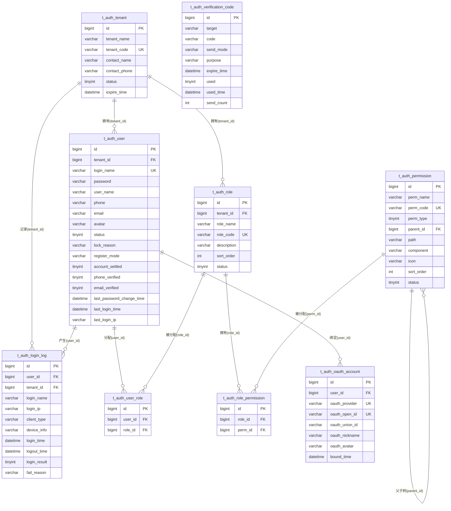
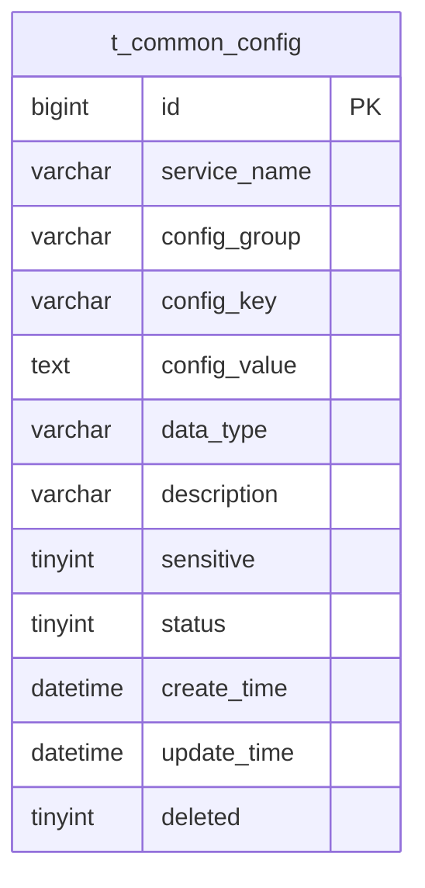

# 数据库设计文档（DBD）

**项目名称**：云漫智企（CloudStrollOffice）
**版本号**：v0.2.8
**日期**：2026-08-13
**编写人**：DBA

## 0. 版本变更说明

**本版本（v0.2.8）涉及数据库结构变更。**

v0.2.8 为"cloudoffice-common 服务化改造与通用配置管理接口先行"版本（详见 PRD v0.2.8 与 SAD v0.2.8 ADR-017/ADR-018/ADR-019），数据库变更范围如下：

1. **新建数据库 `cloudstroll_office_common`**：为 cloudoffice-common 服务化后提供独立的数据存储空间，与 `cloudstroll_office_auth`/`cloudstroll_office_biz`/`cloudstroll_office_system` 并列，遵循"每服务一库"的微服务数据隔离原则。

2. **新建通用配置表 `t_common_config`**：存储 gateway/auth-service/biz-service/system-service/common 五个微服务在不同业务场景下的所有运行时配置项（启动环境变量除外）。配置查询接口（GET /api/v1/common/config、GET /api/v1/common/config/{serviceName}）优先命中 Redis 本地缓存，缓存未命中时回源本表查询并回填缓存。

3. **初始化配置种子数据**：为五个微服务插入基础运行时配置项的初始数据（验证码策略、密码策略、Token 有效期、功能开关等），使用 INSERT IGNORE 幂等保证可重复执行。

以上变更**仅新增**数据库与表，**不修改**既有 `cloudstroll_office_auth` 的 9 张认证业务表结构与数据，**不影响** `cloudstroll_office_biz`/`cloudstroll_office_system` 预留库。

## 1. 设计目标

### 1.1 沿用基线设计目标（v0.0.1）
- **支持认证底座业务**：为统一认证授权底座（注册 5 策略、登录 4 策略、双 Token 轮换、密码/手机号管理、验证码、RBAC 权限、登录日志）提供持久化数据支撑。
- **多租户数据隔离**：基于 RBAC（用户-角色-权限）模型实现多租户数据空间隔离，登录名/手机号/角色编码在租户内唯一，租户间数据不可见。
- **数据规模预估**：认证库数据量可控（万级以内）；登录日志表随使用增长，后续版本规划归档策略。
- **一致性要求**：密码一律 BCrypt 加密存储（禁止明文）；逻辑删除统一（deleted 0-正常 1-删除）；所有表统一雪花算法主键与 create_time/update_time 自动填充。
- **热路径性能**：登录名（租户内唯一）、手机号、角色编码、权限编码等高频查询字段建立唯一索引/普通索引；验证码表按目标+用途、过期时间建立索引支撑过期清理。

### 1.2 本版本新增设计目标（v0.2.8）
- **支持通用配置管理**：为 cloudoffice-common 服务的通用配置管理查询接口提供持久化数据支撑，存储五个微服务的运行时配置项（业务参数、功能开关、限流参数、业务规则参数等），启动环境变量不纳入。
- **配置数据隔离**：按微服务名称（service_name）与配置分组（config_group）组织配置项，支持同一配置键在不同微服务下有不同值；同一微服务同一分组下配置键唯一。
- **配置数据规模预估**：五个微服务的运行时配置项预计百级至千级，数据量可控；查询以 Redis 本地缓存命中为主（≤ 50ms），缓存未命中回源数据库查询并回填缓存。
- **敏感配置安全**：标记为敏感的配置项（如密码、密钥类）在查询接口返回时脱敏或排除，不在响应中暴露明文；数据库中敏感配置值可加密存储（后续版本迭代），本版本仅标记 sensitive 字段。
- **扩展预留**：表结构设计支持后续增删改管理接口与后端管理界面的平滑接入，不因本版本仅实现查询接口而限制后续写入操作。

## 2. 数据库选型

**数据库产品**：MariaDB（业务关系型数据库）+ Redis（缓存数据库，非关系型，不在本 DBD 表结构范围内）
**版本**：MariaDB 10.6 (LTS) / Redis 7.2.x
**选型理由**：
- 兼容 MySQL 生态，JDBC 驱动 `org.mariadb.jdbc.Driver`，与 MyBatis-Plus 3.5.6 无缝集成。
- 开源免费、稳定性与性能满足企业办公场景，Docker Compose 一键编排部署简单。
- 认证库 `cloudstroll_office_auth` 承载 9 张业务表（v0.0.1 基线，本版本无变更）；通用配置库 `cloudstroll_office_common` 承载 1 张配置表（v0.2.8 新增）；`cloudstroll_office_biz` / `cloudstroll_office_system` 库仅建库预留。
- Redis 承载通用配置管理的本地缓存（配置查询优先命中缓存，缓存未命中回源数据库），以及登录态会话、Token 黑名单、状态缓存、验证码缓存等（沿用 v0.0.1 基线）。

## 3. ER 图

### 3.1 认证库 ER 图（沿用 v0.0.1 基线，本版本无变更）

### 3.2 通用配置库 ER 图（v0.2.8 新增）

说明：`t_common_config` 为独立配置表，不与认证库业务表产生外键关联。配置项按 `service_name`（微服务名称）+ `config_group`（配置分组）+ `config_key`（配置键）三维定位，三者组合唯一。

## 4. 逻辑模型

### 4.1 认证库逻辑模型（沿用 v0.0.1 基线，本版本无变更）

| 实体 | 表名 | 说明 | 关键属性 | 关系 |
| --- | --- | --- | --- | --- |
| 租户 | t_auth_tenant | SaaS 平台企业租户，状态控制与过期管理 | 租户编码（唯一）、租户名称、联系人、状态、过期时间 | 1 对 N：用户/角色/登录日志 |
| 用户 | t_auth_user | 平台用户账号，多租户隔离 | 登录名（租户内唯一）、BCrypt 密码、姓名、手机号、邮箱、状态、注册模式、账号完善/验证标记 | N 对 1：租户；N 对 N：角色（经 t_auth_user_role）；1 对 N：OAuth 账号/登录日志 |
| 角色 | t_auth_role | 角色定义，租户内隔离 | 角色编码（租户内唯一）、角色名称、描述、排序、状态 | N 对 1：租户；N 对 N：用户/权限 |
| 权限 | t_auth_permission | 权限点定义，树形结构（菜单/按钮/API） | 权限编码（全局唯一）、权限名称、类型、父权限 ID | 自关联树（parent_id）；N 对 N：角色 |
| 用户-角色关联 | t_auth_user_role | 用户与角色多对多 | 用户 ID、角色 ID | 多对多中间表 |
| 角色-权限关联 | t_auth_role_permission | 角色与权限多对多 | 角色 ID、权限 ID | 多对多中间表 |
| 登录日志 | t_auth_login_log | 登录认证审计记录 | 用户/租户/登录名/IP/客户端类型/设备/时间/结果/失败原因 | N 对 1：用户/租户 |
| OAuth 账号关联 | t_auth_oauth_account | 用户与第三方 OAuth 账号绑定 | OAuth 提供商（openId 组合唯一）、unionId、昵称、头像、绑定时间 | N 对 1：用户 |
| 验证码记录 | t_auth_verification_code | 验证码生命周期管理（生成→校验→过期→使用） | 发送目标、验证码、发送方式、用途、过期时间、使用状态、发送次数 | 独立表（目标+用途查询） |

### 4.2 通用配置库逻辑模型（v0.2.8 新增）

| 实体 | 表名 | 说明 | 关键属性 | 关系 |
| --- | --- | --- | --- | --- |
| 通用配置项 | t_common_config | 五个微服务（gateway/auth-service/biz-service/system-service/common）的运行时配置项持久化存储 | 微服务名称、配置分组、配置键、配置值、数据类型、配置描述、是否敏感、状态 | 独立表（按 service_name + config_group + config_key 三维定位） |

## 5. 物理模型

### 5.1 认证库物理模型（沿用 v0.0.1 基线，共 9 张表，本版本无变更）

公共字段说明（除 t_auth_user_role / t_auth_role_permission / t_auth_login_log 外均继承 BaseEntity 全部字段；关联表与日志表由 DBA 补齐 update_time/deleted 与实体一致）：
- `id` BIGINT(20) 主键（MyBatis-Plus 雪花算法 ASSIGN_ID）
- `create_time` DATETIME 创建时间，默认 CURRENT_TIMESTAMP，插入自动填充
- `update_time` DATETIME 更新时间，默认 CURRENT_TIMESTAMP ON UPDATE CURRENT_TIMESTAMP，插入/更新自动填充
- `deleted` TINYINT(1) 逻辑删除：0-正常 1-删除（@TableLogic）

| 表名 | 说明 | 版本 |
| --- | --- | --- |
| t_auth_tenant | 租户表 | v0.0.1 |
| t_auth_user | 用户表 | v0.0.1 |
| t_auth_role | 角色表 | v0.0.1 |
| t_auth_permission | 权限表 | v0.0.1 |
| t_auth_user_role | 用户角色关联表 | v0.0.1 |
| t_auth_role_permission | 角色权限关联表 | v0.0.1 |
| t_auth_login_log | 登录日志表 | v0.0.1 |
| t_auth_oauth_account | OAuth 第三方账号关联表 | v0.0.1 |
| t_auth_verification_code | 验证码记录表 | v0.0.1 |

> 以上 9 张表的详细字段定义沿用 v0.0.1 基线（详见主文档 docs/cso-dbd.md 第 5 章），本版本无变更。

### 5.2 通用配置库物理模型（v0.2.8 新增，1 张表）

公共字段说明（与认证库 BaseEntity 一一致）：
- `id` BIGINT(20) 主键（MyBatis-Plus 雪花算法 ASSIGN_ID）
- `create_time` DATETIME 创建时间，默认 CURRENT_TIMESTAMP，插入自动填充
- `update_time` DATETIME 更新时间，默认 CURRENT_TIMESTAMP ON UPDATE CURRENT_TIMESTAMP，插入/更新自动填充
- `deleted` TINYINT(1) 逻辑删除：0-正常 1-删除（@TableLogic）

#### 5.2.1 t_common_config（通用配置表）

| 字段名 | 类型 | 长度 | 允许空 | 默认值 | 主键/外键 | 说明 |
| --- | --- | --- | --- | --- | --- | --- |
| id | BIGINT | 20 | 否 | - | 主键 | 配置项 ID（雪花算法） |
| service_name | VARCHAR | 50 | 否 | - | 唯一组合 | 微服务名称（gateway/auth-service/biz-service/system-service/common） |
| config_group | VARCHAR | 50 | 否 | - | 唯一组合 | 配置分组（业务场景分组，如 security/business/rate-limit 等） |
| config_key | VARCHAR | 100 | 否 | - | 唯一组合 | 配置键（同一微服务同一分组下唯一） |
| config_value | TEXT | - | 是 | NULL | - | 配置值（支持字符串、数字、布尔值、JSON 等，由 data_type 标注类型） |
| data_type | VARCHAR | 20 | 否 | string | - | 数据类型：string/number/boolean/json |
| description | VARCHAR | 500 | 是 | NULL | - | 配置描述（说明配置项用途与取值范围） |
| sensitive | TINYINT | 1 | 否 | 0 | - | 是否敏感配置：0-非敏感 1-敏感（敏感配置查询时脱敏或排除） |
| status | TINYINT | 4 | 否 | 0 | - | 状态：0-启用 1-禁用 |
| create_time | DATETIME | - | 否 | CURRENT_TIMESTAMP | - | 创建时间 |
| update_time | DATETIME | - | 否 | CURRENT_TIMESTAMP | - | 更新时间 |
| deleted | TINYINT | 1 | 否 | 0 | - | 逻辑删除：0-正常 1-删除 |

## 6. 索引设计

### 6.1 认证库索引设计（沿用 v0.0.1 基线，本版本无变更）

| 索引名称 | 表名 | 字段 | 类型 | 说明 |
| --- | --- | --- | --- | --- |
| PRIMARY | t_auth_tenant | id | 主键索引（BTREE） | 主键 |
| uk_tenant_code | t_auth_tenant | tenant_code | 唯一索引 | 租户编码全局唯一，登录时按 tenant_code 查询 |
| PRIMARY | t_auth_user | id | 主键索引（BTREE） | 主键 |
| uk_user_login_name | t_auth_user | tenant_id, login_name | 唯一索引 | 租户内登录名唯一，登录认证热路径查询 |
| idx_register_mode | t_auth_user | register_mode | 普通索引 | 按注册模式筛选统计 |
| idx_status | t_auth_user | status | 普通索引 | 按账号状态筛选（封禁/锁定批量操作） |
| PRIMARY | t_auth_role | id | 主键索引（BTREE） | 主键 |
| uk_role_code | t_auth_role | tenant_id, role_code | 唯一索引 | 租户内角色编码唯一 |
| PRIMARY | t_auth_permission | id | 主键索引（BTREE） | 主键 |
| uk_perm_code | t_auth_permission | perm_code | 唯一索引 | 权限编码全局唯一 |
| idx_parent_id | t_auth_permission | parent_id | 普通索引 | 权限树父子查询 |
| PRIMARY | t_auth_user_role | id | 主键索引（BTREE） | 主键 |
| uk_user_role | t_auth_user_role | user_id, role_id | 唯一索引 | 同一用户-角色关系唯一，防重复分配 |
| idx_role_id | t_auth_user_role | role_id | 普通索引 | 按角色反查用户 |
| PRIMARY | t_auth_role_permission | id | 主键索引（BTREE） | 主键 |
| uk_role_perm | t_auth_role_permission | role_id, perm_id | 唯一索引 | 同一角色-权限关系唯一 |
| idx_perm_id | t_auth_role_permission | perm_id | 普通索引 | 按权限反查角色 |
| PRIMARY | t_auth_login_log | id | 主键索引（BTREE） | 主键 |
| idx_log_user_time | t_auth_login_log | user_id, login_time | 普通索引 | 按用户+时间查登录历史 |
| idx_log_tenant_time | t_auth_login_log | tenant_id, login_time | 普通索引 | 按租户+时间查登录历史（审计） |
| PRIMARY | t_auth_oauth_account | id | 主键索引（BTREE） | 主键 |
| uk_provider_openid | t_auth_oauth_account | oauth_provider, oauth_open_id | 唯一索引 | 同一提供商下 openId 唯一，OAuth 登录匹配 |
| idx_user_id | t_auth_oauth_account | user_id | 普通索引 | 按平台用户 ID 查询绑定账号 |
| PRIMARY | t_auth_verification_code | id | 主键索引（BTREE） | 主键 |
| idx_target_purpose | t_auth_verification_code | target, purpose | 普通索引 | 按发送目标和用途查询最新验证码 |
| idx_expire_time | t_auth_verification_code | expire_time | 普通索引 | 按过期时间清理过期记录 |

### 6.2 通用配置库索引设计（v0.2.8 新增）

| 索引名称 | 表名 | 字段 | 类型 | 说明 |
| --- | --- | --- | --- | --- |
| PRIMARY | t_common_config | id | 主键索引（BTREE） | 主键 |
| uk_service_group_key | t_common_config | service_name, config_group, config_key | 唯一索引 | 同一微服务同一分组下配置键唯一，防止重复配置；查询接口按三维定位 |
| idx_service_name | t_common_config | service_name | 普通索引 | 按微服务名称查询配置项（GET /api/v1/common/config/{serviceName} 热路径） |
| idx_config_group | t_common_config | service_name, config_group | 普通索引 | 按微服务名称+配置分组查询配置项（分组过滤查询） |

## 7. 视图 / 存储过程 / 触发器设计

### 7.1 视图
无。用户权限查询（角色编码/权限编码）由 Mapper XML 联表 SQL 实现（selectRoleCodesByUserId / selectPermissionCodesByUserId），不建视图。通用配置查询由 ConfigMapper 直接查询 t_common_config 表，不建视图。

### 7.2 存储过程
无。验证码过期清理由服务层定时调用（VerificationCodeManager.cleanExpiredCodes → deleteExpired），不建存储过程。通用配置缓存失效由服务层 ConfigCacheManager 管理（配置变更触发或 TTL 过期自动失效），不建存储过程。

### 7.3 触发器
无。审计字段（create_time/update_time）由 MyBatis-Plus 自动填充实现，不建触发器。

## 8. 数据字典

### 8.1 认证库枚举值汇总（沿用 v0.0.1 基线，本版本无变更）

| 字段路径 | 取值 | 说明 |
| --- | --- | --- |
| t_auth_tenant.status | 0 / 1 / 2 | 0-正常 1-禁用 2-过期 |
| t_auth_user.status | 0 / 1 / 2 / 3 | 0-正常 1-锁定 2-禁用 3-封禁（封禁后登录与访问实时失效） |
| t_auth_user.register_mode | USERNAME / PHONE_CODE / OAUTH / PHONE_SET_USERNAME / OAUTH_SET_INFO | 用户名密码 / 手机验证码 / OAuth 注册 / 手机号设用户名 / OAuth 补全信息（对应 RegisterModeEnum 5 策略） |
| t_auth_user.account_settled | 0 / 1 | 0-未完善（两步注册待补全） 1-已完善 |
| t_auth_user.phone_verified / email_verified | 0 / 1 | 0-未验证 1-已验证 |
| t_auth_role.status | 0 / 1 | 0-正常 1-禁用 |
| t_auth_permission.perm_type | 1 / 2 / 3 | 1-菜单 2-按钮 3-API |
| t_auth_permission.status | 0 / 1 | 0-正常 1-禁用 |
| t_auth_login_log.client_type | WINDOWS / UBUNTU / H5 / ANDROID / IOS / WECHAT_MINI | 6 种客户端类型（ClientTypeEnum，同端互斥/多端共存） |
| t_auth_login_log.login_result | 0 / 1 | 0-成功 1-失败 |
| t_auth_oauth_account.oauth_provider | WECHAT / DINGTALK / WECHAT_WORK / ALIPAY | OAuth 提供商（OAuthProviderEnum，可扩展） |
| t_auth_verification_code.send_mode | SMS / EMAIL | 短信 / 邮件通道 |
| t_auth_verification_code.purpose | REGISTER / LOGIN / RESET_PASSWORD / CHANGE_PHONE | 验证码用途（按用途隔离，不同用途不通用） |
| t_auth_verification_code.used | 0 / 1 | 0-未使用 1-已使用（校验成功后立即失效） |
| 公共字段 deleted | 0 / 1 | 0-正常 1-逻辑删除（MyBatis-Plus @TableLogic） |
| 登录模式（非表字段） | USERNAME_PASSWORD / PHONE_CODE / PHONE_PASSWORD / OAUTH | LoginModeEnum 4 种登录策略（请求参数） |

### 8.2 通用配置库枚举值汇总（v0.2.8 新增）

| 字段路径 | 取值 | 说明 |
| --- | --- | --- |
| t_common_config.service_name | gateway / auth-service / biz-service / system-service / common | 微服务名称（对应五个后端微服务） |
| t_common_config.data_type | string / number / boolean / json | 配置值数据类型（string-字符串 / number-数字 / boolean-布尔 / json-JSON 对象） |
| t_common_config.sensitive | 0 / 1 | 0-非敏感（查询接口返回明文） 1-敏感（查询接口脱敏或排除，不暴露明文） |
| t_common_config.status | 0 / 1 | 0-启用 1-禁用 |
| t_common_config.deleted | 0 / 1 | 0-正常 1-逻辑删除（MyBatis-Plus @TableLogic） |

### 8.3 通用配置初始数据说明（v0.2.8 种子数据）

以下为 t_common_config 表的初始配置项（INSERT IGNORE 幂等插入），覆盖五个微服务的基础运行时配置：

| service_name | config_group | config_key | config_value | data_type | description | sensitive |
| --- | --- | --- | --- | --- | --- | --- |
| auth-service | verification | code-length | 6 | number | 验证码长度（位数） | 0 |
| auth-service | verification | code-expire-minutes | 5 | number | 验证码有效期（分钟） | 0 |
| auth-service | verification | send-interval-seconds | 60 | number | 验证码发送频率限制（秒） | 0 |
| auth-service | verification | max-send-count | 5 | number | 验证码最大发送次数 | 0 |
| auth-service | verification | mock-mode | true | boolean | 验证码模拟模式（开发环境直接返回固定验证码） | 0 |
| auth-service | password | min-length | 8 | number | 密码最小长度 | 0 |
| auth-service | password | max-length | 64 | number | 密码最大长度 | 0 |
| auth-service | token | access-token-expire-hours | 2 | number | Access Token 有效期（小时） | 0 |
| auth-service | token | refresh-token-expire-days | 7 | number | Refresh Token 有效期（天） | 0 |
| auth-service | session | same-client-mutex | true | boolean | 同端互斥登录（同客户端类型新登录踢旧登录） | 0 |
| gateway | security | whitelist-paths | /api/v1/auth/login,/api/v1/auth/register,/api/v1/auth/refresh,/api/v1/auth/send-code,/api/v1/auth/forgot-password,/api/v1/*/health | string | 网关白名单路径（逗号分隔，无需 Token 访问） | 0 |
| gateway | cors | allowed-origins | * | string | CORS 允许来源 | 0 |
| gateway | rate-limit | enabled | false | boolean | 网关限流开关（后续版本启用） | 0 |
| common | config | cache-ttl-seconds | 300 | number | 通用配置本地缓存 TTL（秒） | 0 |
| common | config | sensitive-mask | **** | string | 敏感配置脱敏掩码 | 0 |
| biz-service | business | enabled | true | boolean | 业务服务功能开关 | 0 |
| system-service | business | enabled | true | boolean | 系统服务功能开关 | 0 |

## 9. 备份恢复策略

沿用 v0.0.1 基线策略，v0.2.8 扩展备份范围：
- **备份频率**：每日全量备份（mysqldump，UTC 凌晨低峰期执行）；登录日志等增长型数据后续版本规划归档。
- **备份方式**：`mysqldump -u root -p --single-transaction --routines --events cloudstroll_office_auth cloudstroll_office_common`，备份文件按日期命名，保留最近 7 天；Docker 环境使用 `docker exec mariadb mysqldump` 执行。
- **恢复演练**：每季度执行一次恢复演练，在隔离环境验证备份可恢复性。
- **初始脚本**：`docs/cso-dbd.sql` 为全量可重复执行脚本（INSERT IGNORE 幂等），开发/测试环境可随时重建；v0.2.8 新增 `cloudstroll_office_common` 库与 `t_common_config` 表的建库建表与种子数据语句。

## 10. 安全策略

沿用 v0.0.1 基线策略，v0.2.8 扩展：
- **账号权限**：应用连接使用最小权限账号（仅 DML + 认证库 + 通用配置库），DDL 由 DBA 通过管理账号执行；生产环境禁止使用 root 连接应用。
- **敏感数据**：密码一律 BCrypt 加密存储（成本因子 10），禁止明文；日志禁止输出密码与 Token；登录失败统一提示不泄露具体原因（防账号枚举）。通用配置中标记为敏感的配置项（sensitive=1）在查询接口返回时脱敏（如返回 `****`）或排除不返回，不在响应中暴露明文。
- **数据隔离**：多租户隔离——所有认证业务查询限定当前租户（tenant_id 条件），租户间数据不可见；逻辑删除保证误删可恢复。通用配置表为全局配置，不按租户隔离（配置项为平台级运行时参数）。
- **审计**：登录日志表（t_auth_login_log）记录每次登录的 IP/客户端类型/结果/失败原因，供安全审计追溯；管理员封禁/踢人等操作通过登录日志与状态字段留痕。后续版本通用配置增删改接口迭代时将增加配置变更审计日志。
- **密钥管理**：数据库密码通过环境变量注入（env.json / env.example.json 模板，存放于 `deploy` 目录），禁止硬编码与提交仓库；生产环境建议使用密钥管理服务。
- **传输安全**：生产环境网关前端 TLS 终止（HTTPS），数据库与中间件处于 Docker 桥接网络内不对外暴露。

<!-- SPDX-License-Identifier: Apache-2.0 / Copyright 2026 jenemy8023 <jenemy8023@163.com> -->