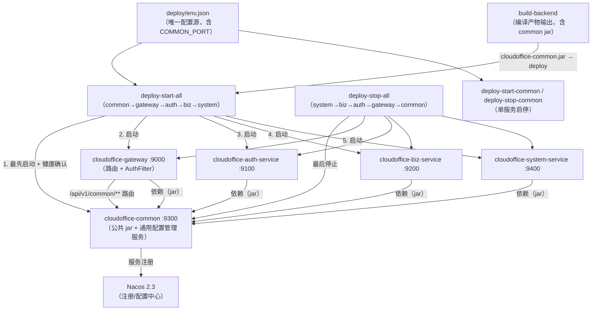
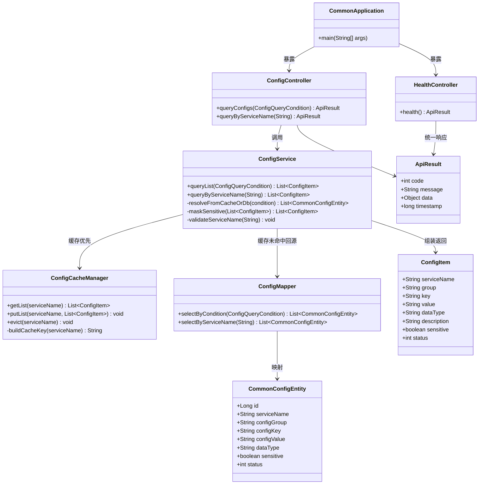
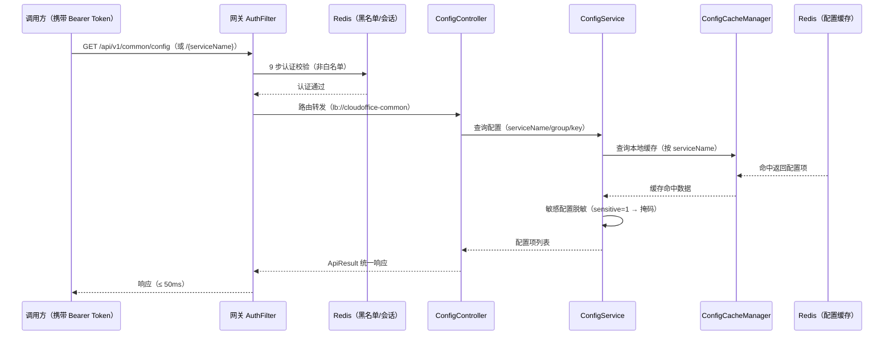
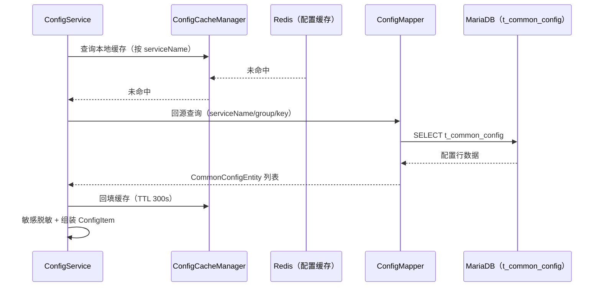
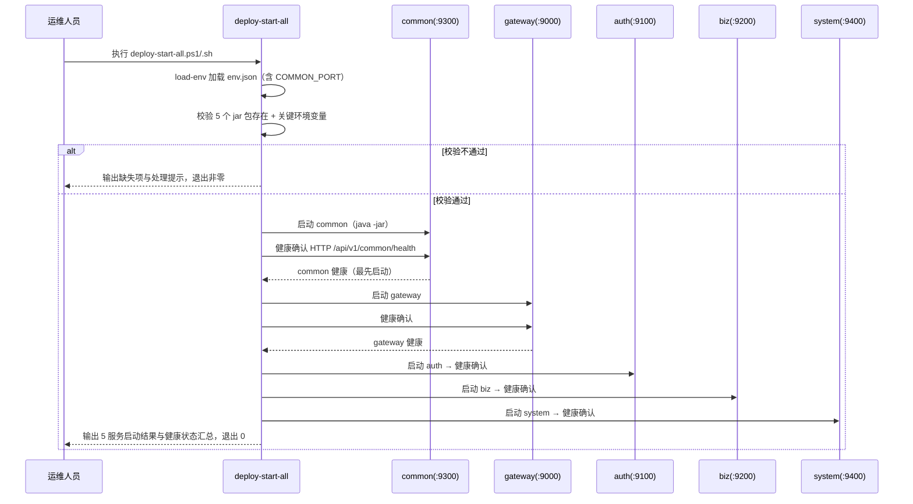
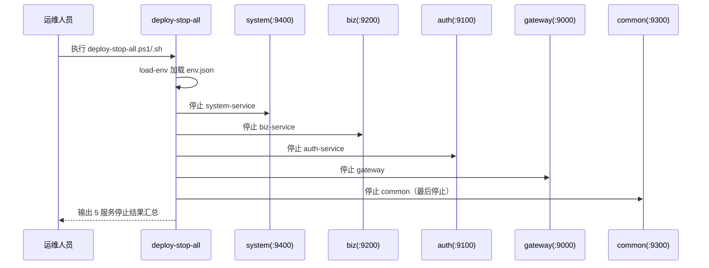
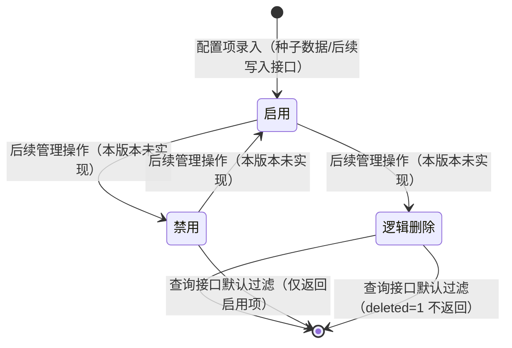
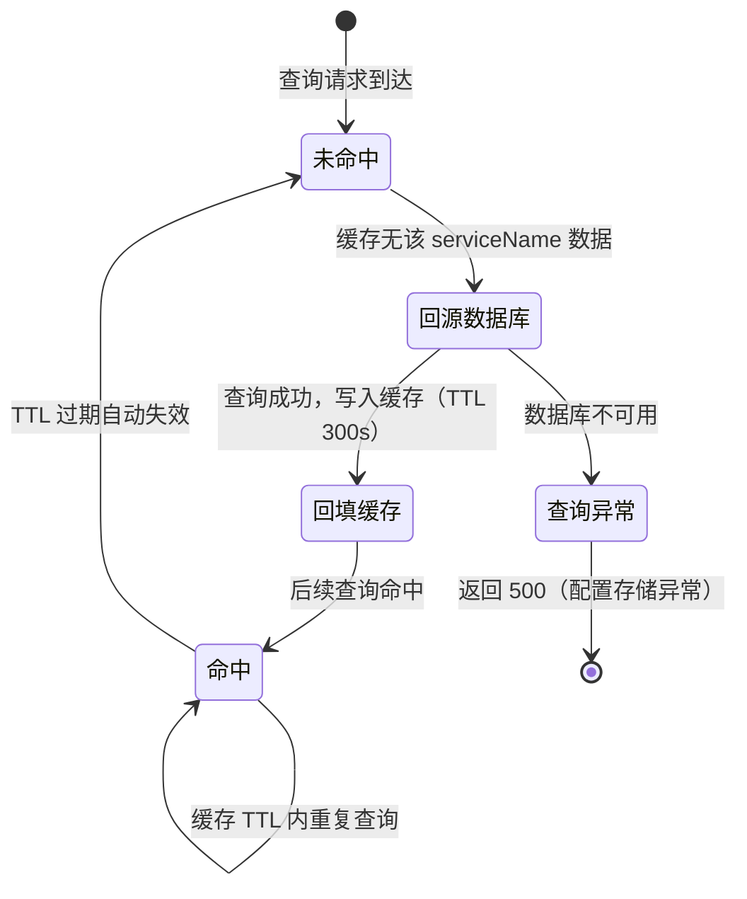
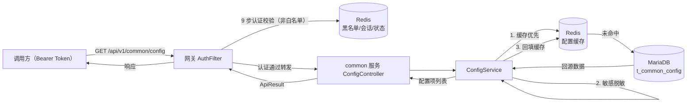
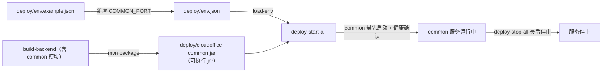

# 详细设计文档（LLD）
**项目名称**：云漫智企（CloudStrollOffice）
**版本号**：0.2.8
**日期**：2026-08-13
**编写人**：TL

> 说明：LLD 聚焦整体业务逻辑的详细设计（模块划分、业务流程、核心业务逻辑、业务规则等）；接口（API）的详细设计由 API 设计文档单独负责，LLD 中不重复编写接口定义、请求/响应参数等内容。本版本为"cloudoffice-common 服务化改造与通用配置管理接口先行"版本，设计对象为 cloudoffice-common 服务内部组件（服务化改造 + 通用配置管理查询）与部署脚本体系扩展（build-backend / deploy-start-all / deploy-stop-all / deploy-start-common / deploy-stop-common）。接口定义、请求/响应参数详见 `cso-api-v0.2.8.md`，数据库表结构详见 `cso-dbd-v0.2.8.md`。

## 1. 模块概述

v0.2.8 聚焦三大目标：**cloudoffice-common 服务化改造**（从纯公共 jar 模块升级为可独立部署的 Spring Boot 微服务）、**通用配置管理接口先行**（统一管理五个微服务的运行时配置，本版本仅交付查询接口）、**部署体系适配**（编译/启动/停止脚本纳入 common，启动顺序中 common 居首位）。

本版本模块划分如下：

| 模块 | 组件/文件 | 职责 |
| --- | --- | --- |
| common 服务化改造模块 | cloudoffice-common（CommonApplication 启动类、bootstrap.yml、application.yml、spring-cloud-starter-bootstrap 依赖） | 将 common 从纯 jar 模块升级为 Spring Boot 微服务，注册到 Nacos（服务名 `cloudoffice-common`，端口 9300），保留公共 jar 模块能力（ApiResult/PageResult/异常体系/枚举常量），供下游服务继续 Maven 依赖引用 |
| common API 接口服务模块 | HealthController、SpringDoc 配置 | 提供与其他微服务一致的健康检查端点（/api/v1/common/health）与 SpringDoc OpenAPI 文档（分组 common） |
| 通用配置管理模块 | ConfigController、ConfigService、ConfigCacheManager、ConfigMapper | 提供通用配置查询能力（按微服务名称/配置分组/配置键过滤查询），配置数据优先命中 Redis 本地缓存、缓存未命中回源数据库、敏感配置脱敏 |
| 网关路由扩展模块 | cloudoffice-gateway 路由配置、白名单配置 | 新增 `/api/v1/common/**` 路由规则转发至 common 服务；`/api/v1/common/health` 加入白名单，配置查询接口经 AuthFilter 认证 |
| 部署脚本适配模块 | build-backend、deploy-start-all、deploy-stop-all、deploy-start-common、deploy-stop-common | 编译脚本纳入 common 产物；一键启动脚本 common 居首、一键停止脚本 common 居末 |
| 文档与配置适配模块 | deploy/deploy.md、readme.md、deploy/env.json、deploy/env.example.json | 补充 common 端口/启动顺序/健康检查端点/通用配置管理说明；新增 COMMON_PORT 等环境配置项 |

模块协作关系：common 服务化后既是公共 jar（被 gateway/auth/biz/system 依赖），又是独立微服务（注册 Nacos、提供 API）；网关将 `/api/v1/common/**` 转发至 common 服务；部署脚本将 common 作为首位服务最先启动、健康确认后再启动 gateway，最后停止。

## 2. 模块划分与职责

### 2.1 模块依赖关系



### 2.2 各模块职责边界

| 模块 | 输入 | 处理 | 输出 | 边界说明 |
| --- | --- | --- | --- | --- |
| common 服务化改造 | 无（启动依赖 Nacos 地址环境变量） | 启动 Spring Boot 应用 → 引导 Nacos 注册/配置 → 暴露健康检查与配置查询端点 | 注册到 Nacos 的 `cloudoffice-common` 服务实例 | 仅新增启动类与引导配置，不得破坏下游服务对公共 jar 的依赖；公共类与接口保持不变 |
| 通用配置管理（查询） | 网关转发的配置查询请求（经 AuthFilter 认证） | 缓存优先查询 → 缓存未命中回源数据库 → 敏感脱敏 → 组装返回 | 配置项列表（统一 ApiResult） | 仅实现查询，不实现增删改；接口层/数据层预留扩展点；不返回敏感明文 |
| 网关路由扩展 | `/api/v1/common/**` 请求 | 白名单判断（health 放行）→ 认证（config 需认证）→ 转发至 common | 转发请求与响应 | 只新增 common 路由与白名单，不影响既有 auth/biz/system 路由 |
| 部署脚本适配 | env.json + 5 个 jar 包 | 编译纳入 common 产物；启动 common 居首、停止 common 居末；逐服务健康确认 | 启动/停止结果汇总 + 退出码 | 遵循 v0.2.7 脚本体系约定（load-env、输出分级、退出码、双平台一致） |
| 文档与配置适配 | 既有 deploy.md/readme.md/env.json | 补充 common 相关说明与 COMMON_PORT 配置 | 更新后的文档与配置 | 仅追加/更新 common 相关部分，不删除既有内容 |

## 3. 类图

common 服务内部核心业务对象及关系如下（接口请求/响应参数细节不在此展开，详见 API 文档）：



说明：`CommonConfigEntity` 为 `t_common_config` 表的 ORM 实体（字段与 DBD 5.2.1 对应），`ConfigItem` 为查询接口返回的业务视图对象（含敏感脱敏后的 value）。`ConfigService` 内部封装"缓存优先 → 回源数据库 → 脱敏"的核心业务编排，`ConfigCacheManager` 负责 Redis 本地缓存读写与失效管理，两者解耦以支持后续写入接口扩展。

## 4. 核心业务流程时序图

### 4.1 通用配置查询流程（缓存命中）



### 4.2 通用配置查询流程（缓存未命中回源）



### 4.3 部署一键启动流程（deploy-start-all，含 common）



### 4.4 部署一键停止流程（deploy-stop-all，含 common）



## 5. 状态图

### 5.1 配置项生命周期状态（本版本只读，预留扩展）



说明：本版本通用配置管理仅交付查询接口，配置项状态字段（status：0-启用/1-禁用、deleted 逻辑删除）在数据层已就位；查询接口默认仅返回启用且未逻辑删除的配置项，为后续增删改接口与后端管理界面预留状态流转能力。

### 5.2 配置缓存状态机（ConfigCacheManager）



## 6. 核心业务逻辑

### 6.1 通用配置查询逻辑（ConfigService）

```text
function queryList(condition):
    validateServiceName(condition.serviceName)   # 校验合法取值，非法则抛参数异常（400）
    cacheList = ConfigCacheManager.getList(condition.serviceName)
    if cacheList == null:                        # 缓存未命中
        entities = ConfigMapper.selectByCondition(condition)  # 回源数据库
        items = 实体转 ConfigItem 并脱敏(entities)
        ConfigCacheManager.putList(condition.serviceName, items)  # 回填缓存 TTL 300s
        return 分页截取(items, condition.page, condition.pageSize)
    else:                                        # 缓存命中
        items = 按 group/key 过滤 + 脱敏(cacheList)
        return 分页截取(items, condition.page, condition.pageSize)

function maskSensitive(items):
    mask = ConfigCacheManager 读取 common 配置 sensitive-mask（默认 "****"）
    for item in items:
        if item.sensitive == true:
            item.value = mask                   # 敏感配置值替换为掩码，不返回明文
    return items
```

### 6.2 按微服务查询逻辑（queryByServiceName）

```text
function queryByServiceName(serviceName):
    validateServiceName(serviceName)
    cacheList = ConfigCacheManager.getList(serviceName)
    if cacheList == null:
        entities = ConfigMapper.selectByServiceName(serviceName)
        items = 实体转 ConfigItem 并脱敏(entities)
        ConfigCacheManager.putList(serviceName, items)
    else:
        items = 脱敏(cacheList)
    return items   # 不分页，指定微服务无配置时返回空列表（code=200，非 500）
```

### 6.3 服务名合法性校验逻辑

```text
function validateServiceName(serviceName):
    if serviceName == null or 空:
        return  # 不传表示查询全部微服务，合法
    legal = ["gateway", "auth-service", "biz-service", "system-service", "common"]
    if serviceName not in legal:
        抛出参数校验异常（400，serviceName 取值非法）
```

### 6.4 common 服务注册与启动引导逻辑

```text
function main():
    SpringApplication.run(CommonApplication.class)
    # bootstrap.yml（spring-cloud-starter-bootstrap 引导）：
    #   spring.application.name = cloudoffice-common
    #   spring.cloud.nacos.discovery.server-addr = ${NACOS_ADDR}
    #   spring.cloud.nacos.config.server-addr = ${NACOS_ADDR}
    # application.yml：server.port = ${COMMON_PORT:9300}；springdoc 分组 common
    # 启动成功后注册到 Nacos，可被网关通过 lb://cloudoffice-common 路由
```

### 6.5 部署启动顺序逻辑（deploy-start-all 扩展）

```text
function startAllBackend():
    load-env()
    missingJars = 校验 5 个 jar 存在（含 deploy/cloudoffice-common.jar）
    missingVars = 校验关键变量（NACOS_ADDR、COMMON_PORT、RSA_PUBLIC_KEY、RSA_PRIVATE_KEY、DB_PASSWORD 等）
    if missingJars 或 missingVars 非空:
        输出缺失项与处理提示，exit 1（不启动任何服务）
    for svc in [common(9300), gateway(9000), auth(9100), biz(9200), system(9400)]:
        startService(svc): java -Xms256m -Xmx512m -jar <jar>
        if not healthConfirm(svc, port):         # common 经 /api/v1/common/health 探测
            输出错误提示，停止后续启动，exit 1
    输出 5 服务启动结果与健康状态汇总，exit 0
```

### 6.6 部署停止顺序逻辑（deploy-stop-all 扩展）

```text
function stopAllBackend():
    load-env()
    for svc in [system(9400), biz(9200), auth(9100), gateway(9000), common(9300)]:
        stopService(svc): 按 PID/进程名终止对应 Java 进程
        # 服务进程不存在时跳过并输出"未运行"提示，不影响其他服务停止
    输出 5 服务停止结果汇总
```

## 7. 业务规则与约束

| 编号 | 规则/约束 | 说明 |
| --- | --- | --- |
| R-01 | 服务化不破坏依赖 | common 服务化后保留公共 jar 模块能力，gateway/auth/biz/system 仍以 Maven 依赖引用 common 公共类与接口；新增启动类不影响依赖方编译运行 |
| R-02 | 配置范围界定 | 通用配置管理仅管理运行时配置（业务参数、功能开关、限流参数、业务规则参数）；启动环境变量（NACOS_ADDR、DB_HOST/DB_PORT/DB_USERNAME/DB_PASSWORD、REDIS_*、RSA_PUBLIC_KEY、RSA_PRIVATE_KEY、NACOS_HOME 等）不纳入管理范围，仍由 env.json 注入 |
| R-03 | 配置三维定位唯一 | 同一微服务（service_name）+ 同一分组（config_group）下配置键（config_key）唯一，防止重复配置 |
| R-04 | 敏感配置脱敏 | 标记 sensitive=1 的配置项查询返回时脱敏（替换为掩码，默认 `****`），不暴露明文；脱敏掩码本身可配置（common 配置 sensitive-mask） |
| R-05 | 查询接口需认证 | /api/v1/common/config 与 /api/v1/common/config/{serviceName} 非白名单，需经网关 AuthFilter 认证（合法 Bearer Token）；健康检查 /api/v1/common/health 白名单放行 |
| R-06 | 缓存优先 | 配置查询优先命中 Redis 本地缓存（命中响应 ≤ 50ms），未命中回源数据库并回填缓存（TTL 300s） |
| R-07 | 查询空结果语义 | 查询结果为空返回 code=200 空列表（非 500）；serviceName 非法返回 400；配置存储异常返回 500 |
| R-08 | 启动顺序（含 common） | 部署启动顺序固定 common → gateway → auth → biz → system，common 最先启动且健康确认后再启动 gateway |
| R-09 | 停止顺序（含 common） | 部署停止顺序固定 system → biz → auth → gateway → common，common 最后停止，确保其他服务停止过程中仍可访问配置接口 |
| R-10 | 接口先行扩展预留 | 本版本仅实现查询接口；接口层遵循 RESTful 规范、数据层支持后续写入，预留 POST/PUT/DELETE 与后端管理界面平滑接入，不实现任何写入接口 |
| R-11 | 脚本体系约定延续 | 部署脚本遵循 v0.2.7 约定：load-env 统一加载 env.json、输出分级（通过/警告/失败）、退出码失败非零、.ps1 与 .sh 双平台行为一致 |
| R-12 | 不修改既有接口契约 | 仅新增 common 服务接口与网关路由/白名单，不改动 API-001~API-033 契约，不影响既有服务编译与运行 |

## 8. 业务数据流

### 8.1 通用配置查询数据流



### 8.2 配置数据初始化数据流

```text
docs/cso-dbd-v0.2.8.sql（INSERT IGNORE 幂等种子数据）
    → cloudstroll_office_common.t_common_config（五个微服务运行时配置）
    → common 服务启动后首查回源数据库 → 回填 Redis 缓存（TTL 300s）
    → 后续查询缓存命中
```

### 8.3 部署资产数据流（v0.2.8 扩展）



## 9. 数据结构定义

本版本模块内部使用的业务数据结构如下（数据库表结构详见 DBD 5.2.1，接口请求/响应参数详见 API 文档，此处不重复）：

| 结构 | 字段 | 类型 | 说明 |
| --- | --- | --- | --- |
| CommonConfigEntity | id | Long | 配置项 ID（雪花算法主键） |
| CommonConfigEntity | serviceName | String | 微服务名称（gateway/auth-service/biz-service/system-service/common） |
| CommonConfigEntity | configGroup | String | 配置分组（如 verification/password/token/security/cors 等） |
| CommonConfigEntity | configKey | String | 配置键（同一微服务同一分组下唯一） |
| CommonConfigEntity | configValue | String | 配置值（字符串/数字/布尔/JSON，由 dataType 标注） |
| CommonConfigEntity | dataType | String | 数据类型：string/number/boolean/json |
| CommonConfigEntity | description | String | 配置描述（说明用途与取值范围） |
| CommonConfigEntity | sensitive | boolean | 是否敏感配置（true 时查询脱敏） |
| CommonConfigEntity | status | int | 状态：0-启用 1-禁用 |
| ConfigItem | serviceName/group/key | String | 视图对象字段（与实体同义） |
| ConfigItem | value | String | 配置值（敏感配置脱敏后为掩码） |
| ConfigItem | dataType/description/sensitive/status | - | 视图对象字段（与实体同义） |
| ConfigQueryCondition | serviceName/group/key | String | 查询条件（可选，精确匹配） |
| ConfigQueryCondition | page/pageSize | int | 分页参数（可选，默认 1/10） |

缓存键设计：配置缓存以 `serviceName` 为粒度组织（缓存键前缀 `cso:common:config:` + serviceName），缓存值为该微服务全部启用配置项的 ConfigItem 列表；缓存 TTL 由 common 配置项 `config/cache-ttl-seconds`（默认 300 秒）控制，配置变更时由 ConfigCacheManager.evict 触发失效。

## 10. 异常处理策略

| 异常场景 | 分类 | 处理方式 | 错误码/退出码 |
| --- | --- | --- | --- |
| serviceName 取值非法（非五服务之一） | 参数异常 | 参数校验失败，返回 400 提示 serviceName 非法 | 400 |
| 配置查询结果为空 | 正常语义 | 返回 code=200 空列表，不报错 | 200 |
| 敏感配置项查询 | 安全脱敏 | value 替换为掩码（`****`）或排除不返回 | 正常返回 |
| 配置数据存储不可用（数据库异常） | 系统异常 | 全局异常处理器兜底，返回 500"配置存储异常"，不泄露堆栈 | 500 |
| 未携带 Token / Token 无效 | 认证异常 | 网关 AuthFilter 拦截，返回 401/403 | 401/403 |
| 网关未配置 common 路由 | 路由异常 | 请求返回 404，需检查网关路由配置 | 404 |
| Nacos 未启动 | 启动异常 | common 服务启动失败，输出 Nacos 连接错误提示 | 启动失败非零 |
| common 端口被占用 | 运行冲突 | 启动失败，提示检查端口占用并指导处理 | 启动失败非零 |
| common jar 缺失 | 前置校验失败 | 部署脚本输出 jar 缺失提示，不启动服务 | 1 |
| common 健康确认失败/超时 | 启动异常 | 按等待重试次数重试，仍失败则失败即停，输出错误提示 | 1 |
| 停止时某服务进程不存在 | 幂等语义 | 跳过并输出"未运行"提示，不影响其他服务停止 | 0 |

## 11. 日志规范

| 日志类型 | 级别 | 格式/内容要求 |
| --- | --- | --- |
| 服务启动日志 | INFO | common 启动成功，记录服务名 cloudoffice-common、端口 9300、Nacos 注册结果 |
| 健康检查日志 | INFO | 记录健康检查端点访问与服务状态（UP） |
| 配置查询日志 | INFO | 记录查询条件（serviceName/group/key）与缓存命中/回源结果，不含敏感值明文 |
| 缓存回填/失效日志 | INFO/DEBUG | 记录缓存回填（serviceName、TTL）与失效触发 |
| 敏感脱敏日志 | DEBUG | 记录脱敏动作（配置键 + 脱敏标记），不得输出脱敏前的明文值 |
| 异常日志 | ERROR | 记录异常类型与业务上下文，不输出堆栈中的敏感信息、密码、Token、密钥 |

日志纪律：敏感配置值（sensitive=1）在任何日志中不得输出明文；JWT Token、密码、RSA 密钥禁止写入日志；日志内容不含接口请求体中的凭据信息。

## 12. 性能优化点

| 优化点 | 措施 |
| --- | --- |
| 缓存命中优先 | 配置查询优先命中 Redis 本地缓存（命中响应 ≤ 50ms），避免每次回源数据库；未命中回源后回填缓存（TTL 300s） |
| 缓存粒度 | 以 serviceName 为缓存粒度（非逐 key 缓存），一次回源覆盖该微服务全部配置，减少缓存键数量与回源次数 |
| 连接池适配 | common-service HikariCP（maximum-pool-size 10、minimum-idle 2），配置查询为低频读操作；Redis Lettuce 连接池 max-active 8 |
| 索引支撑 | t_common_config 建立 uk_service_group_key 唯一索引 + idx_service_name 普通索引 + idx_config_group 组合索引，支撑按服务名/分组查询 |
| 数据量控制 | 五个微服务运行时配置预计百级至千级，数据量可控；查询以缓存命中为主 |
| 启动顺序保障 | common 最先启动并健康确认，确保 gateway 等后续服务启动时可通过 Nacos 服务发现获取配置接口 |
| 查询接口限流 | 本版本配置查询为低频读操作，不设接口级独立限流；后续版本接入网关 RequestRateLimiter |

## 13. 单元测试策略

### 13.1 测试范围与工具

- 后端单元测试：JUnit 5 + Mockito，覆盖 common 服务的 ConfigService（查询编排、脱敏）、ConfigCacheManager（缓存命中/回填/失效）、serviceName 合法性校验；
- 接口测试：脚本发起 GET /api/v1/common/health 与 /api/v1/common/config（携带 Token）验证契约；
- 部署脚本验证：deploy-start-all 按 common→gateway→auth→biz→system 顺序启动、deploy-stop-all 逆序停止，核对输出分级与退出码；
- 编译脚本验证：build-backend 输出 cloudoffice-common.jar 到 deploy 目录。

### 13.2 用例划分

| 被测对象 | 用例方向 | 验收关联 |
| --- | --- | --- |
| CommonApplication | common 可独立启动并注册 Nacos，/api/v1/common/health 返回 200 | US-001 |
| ConfigService.queryList | 携带 serviceName/group/key 过滤查询，返回正确配置项列表 | US-002 |
| ConfigService.queryByServiceName | 按微服务名称查询全部配置；不存在返回空列表非 500 | US-002 |
| ConfigService.maskSensitive | sensitive=1 配置项脱敏为掩码，不暴露明文 | US-002 |
| ConfigCacheManager | 缓存命中直接返回；未命中回源并回填；TTL 过期失效 | US-002 |
| 参数校验 | serviceName 非法返回 400；不传返回全部微服务配置 | US-002 |
| 网关路由 | /api/v1/common/health 白名单放行；/api/v1/common/config 需认证 | US-002 / US-001 |
| build-backend | 编译产物含 cloudoffice-common.jar，输出到 deploy 目录 | US-005 |
| deploy-start-all | 按 common→gateway→auth→biz→system 顺序启动，common 最先健康确认 | US-003 |
| deploy-start-all | common 启动失败时失败即停，gateway 及之后服务不启动 | US-003 |
| deploy-stop-all | 按 system→biz→auth→gateway→common 逆序停止，common 最后停止 | US-004 |
| 文档/配置 | deploy.md/readme.md 含 common 端口/顺序/健康检查端点；env.json 含 COMMON_PORT | US-006 |

### 13.3 边界与异常用例

- 配置数据为空 → 返回空列表，不报错（US-002 边界）；
- 敏感配置项 → 脱敏为掩码，不暴露明文（US-002 边界）；
- 微服务名称不存在 → 返回空列表或未找到提示，非 500（US-002 边界）；
- 配置存储不可用 → 返回 500"配置存储异常"（US-002 边界）；
- common 启动失败/健康检查超时 → 失败即停，输出错误提示（US-003 边界）；
- 某服务进程不存在 → 跳过并输出"未运行"，不影响其他服务停止（US-004 边界）；
- common 端口被占用 → 提示检查端口占用并指导处理（US-001 边界）。

### 13.4 覆盖目标

- PRD 第 7 章 13 条验收标准均有对应校验用例；
- 6 个用户故事（US-001~US-006）的验收标准全覆盖；
- ConfigService / ConfigCacheManager 核心逻辑单测覆盖率达到较高水平（脱敏、缓存命中/回填、参数校验为必测路径）；
- 双平台（Windows PowerShell / Linux Bash）部署脚本顺序与退出码验证通过后方可交付。

<!-- SPDX-License-Identifier: Apache-2.0 / Copyright 2026 jenemy8023 <jenemy8023@163.com> -->
