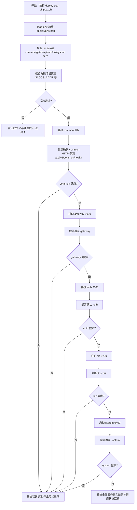
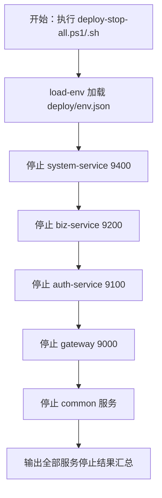
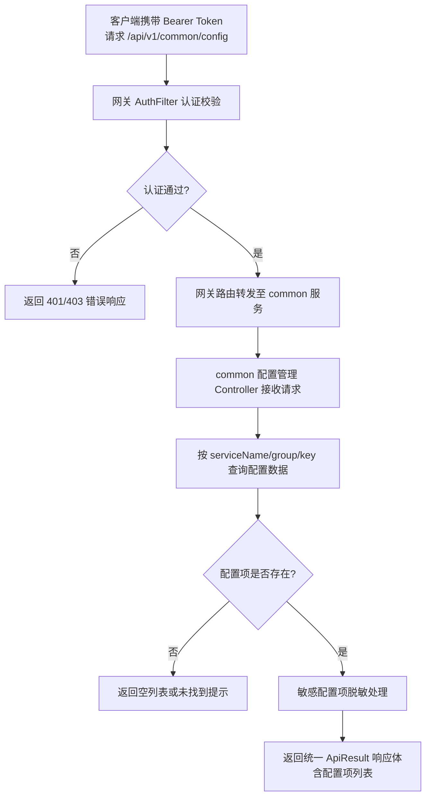

# 产品需求文档（PRD）
**项目名称**：云漫智企（CloudStrollOffice）
**版本号**：v0.2.8
**日期**：2026-08-13
**编写人**：BA

## 1. 产品背景
### 1.1 项目背景
云漫智企（CloudStrollOffice）是基于 Java 21 + Spring Boot 3.2.5 + Spring Cloud 2023.0.1 的微服务企业办公套件，由 gateway（9000）、auth-service（9100）、biz-service（9200）、system-service（9400）4 个业务服务及 Nacos 2.3（8848）/ MariaDB 10.6（3306）/ Redis 7.2（6379）基础设施构成。cloudoffice-common 作为公共模块，为上述 4 个业务服务提供公共函数、变量定义与公共接口能力，以 Maven 依赖方式被各服务引用。

当前 cloudoffice-common 仅为纯公共 jar 模块，不具备独立部署与服务注册能力，也未提供通用配置管理接口。各微服务的运行时配置分散在各自的 application.yml / Nacos 配置文件中，缺乏统一的配置查询入口，配置项变更难以追溯、配置一致性难以保障。

本版本（v0.2.8）聚焦 **cloudoffice-common 服务化改造** 与 **通用配置管理接口先行**：将 cloudoffice-common 从纯公共 jar 模块升级为可独立部署的 Spring Boot 微服务，使其具备 Nacos 服务注册、健康检查、API 接口服务、SpringDoc OpenAPI 文档等与其他微服务同等的能力；同时新增通用配置管理查询接口，统一管理不同微服务、不同业务场景下的所有运行时配置（启动环境变量除外）。此外，同步更新编译脚本、部署脚本（deploy-start-all / deploy-stop-all）、部署文档（deploy.md）与 readme.md，使 cloudoffice-common 作为独立服务纳入一键启动/停止流程，且在启动顺序中位于所有后端服务清单的第一位（最先启动）。

### 1.2 产品目标
- **G-1 common 服务化**：将 cloudoffice-common 从纯公共 jar 模块改造为可独立部署的 Spring Boot 微服务，增加启动类、bootstrap.yml（Nacos 注册/配置引导）、application.yml、健康检查端点等，使其可注册到 Nacos 并提供 API 服务，与其他微服务（gateway/auth/biz/system）具备同等的服务注册、健康检查与部署运维能力。
- **G-2 通用配置管理接口**：在 cloudoffice-common 中新增通用配置管理查询接口，统一管理不同微服务、不同业务场景下的所有运行时配置项；除启动所需的环境变量（NACOS_ADDR、DB_PASSWORD、RSA 密钥等）外，所有运行时配置均通过通用配置管理接口进行读取与查询。
- **G-3 部署体系适配**：同步更新编译脚本（build-backend）、部署启动脚本（deploy-start-all）、部署停止脚本（deploy-stop-all）、部署文档（deploy.md）与 readme.md，使 cloudoffice-common 作为独立服务纳入一键启动/停止流程，且在启动顺序中位于所有后端服务清单的第一位（common 最先启动、最后停止）。
- **G-4 配置接口先行、管理后置**：本版本仅交付通用配置管理的查询接口，配置的后端管理界面（增删改）在后续版本迭代增加。当前接口设计预留扩展能力，确保后续管理功能可平滑接入。

**量化指标**：cloudoffice-common 服务化后可独立启动并注册到 Nacos，健康检查端点 `/api/v1/common/health` 返回 200；通用配置查询接口支持按微服务名称、配置分组、配置键等维度查询运行时配置项，单次查询响应时间 ≤ 200ms（本地缓存命中时 ≤ 50ms）；deploy-start-all 脚本按 common → gateway → auth → biz → system 顺序启动，deploy-stop-all 按 system → biz → auth → gateway → common 逆序停止；编译脚本将 cloudoffice-common 纳入产物输出范围，生成可部署 jar 包到 deploy 目录。

### 1.3 核心设计理念
- **服务化对齐、能力一致**：cloudoffice-common 服务化后与其他微服务（gateway/auth/biz/system）具备同等能力——Nacos 服务注册、健康检查端点、统一 ApiResult 响应、SpringDoc OpenAPI 文档、网关路由转发，不引入与现有技术栈重复的框架。
- **配置统一、入口唯一**：通用配置管理作为全部微服务运行时配置的统一查询入口，替代分散在各自配置文件中的配置查询需求；启动环境变量（NACOS_ADDR、DB_PASSWORD、RSA 密钥等）仍由 env.json 注入，不纳入通用配置管理范围。
- **接口先行、扩展预留**：本版本仅实现配置查询接口，接口层与数据层预留增删改扩展点，确保后续管理功能与后端管理界面可平滑接入，避免接口重构。
- **部署优先、公共先行**：cloudoffice-common 作为所有微服务的公共依赖与配置提供方，在部署启动顺序中位于第一位（所有后端服务中最先启动），在停止顺序中位于最后一位（最后停止），确保后续服务启动时可通过 Nacos 服务发现获取 common 的配置接口。
- **双平台一致、脚本规范延续**：部署脚本更新遵循 v0.2.7 脚本体系约定（load-env 统一加载 env.json、输出分级通过/警告/失败、退出码失败非零、.ps1 与 .sh 双平台行为一致）。

## 2. 目标用户
| 用户角色 | 使用场景 | 核心诉求 |
| --- | --- | --- |
| 运维/部署工程师 | 通过部署脚本一键启动/停止全部服务（含 common）；通过通用配置管理接口查询各微服务运行时配置 | 一条命令完成全服务拉起，common 最先启动最后停止；配置查询入口统一 |
| 后端开发工程师 | 在业务代码中通过通用配置管理接口获取所需配置项，替代硬编码与分散的配置文件 | 统一配置查询接口，按服务名/分组/键获取配置值，接口清晰可调用 |
| 系统管理员 | 后续版本通过后端管理界面管理配置项（本版本仅接口先行） | 接口预留扩展能力，后续管理界面可平滑接入 |

## 3. 功能清单
| 功能编号 | 功能名称 | 所属模块 | 优先级 | 版本范围 |
| --- | --- | --- | --- | --- |
| F-001 | common 服务化改造 | cloudoffice-common（启动类、bootstrap.yml、application.yml） | 高 | v0.2.8 |
| F-002 | common API 接口服务 | cloudoffice-common（健康检查、ApiResult、SpringDoc） | 高 | v0.2.8 |
| F-003 | 通用配置管理-查询接口 | cloudoffice-common（配置管理 Controller/Service） | 高 | v0.2.8 |
| F-004 | 通用配置管理-配置范围 | cloudoffice-common（配置数据覆盖全部微服务运行时配置） | 高 | v0.2.8 |
| F-005 | 通用配置管理-扩展预留 | cloudoffice-common（接口层/数据层扩展点） | 中 | v0.2.8 |
| F-006 | 网关路由配置更新 | cloudoffice-gateway（新增 /api/v1/common/** 路由规则） | 高 | v0.2.8 |
| F-007 | 编译脚本更新 | deploy/scripts（build-backend.ps1 / .sh） | 高 | v0.2.8 |
| F-008 | 部署启动脚本更新 | deploy/scripts（deploy-start-all.ps1 / .sh） | 高 | v0.2.8 |
| F-009 | 部署停止脚本更新 | deploy/scripts（deploy-stop-all.ps1 / .sh） | 高 | v0.2.8 |
| F-010 | 部署文档更新 | deploy/deploy.md | 高 | v0.2.8 |
| F-011 | readme 更新 | readme.md | 中 | v0.2.8 |
| F-012 | env.json 配置更新 | deploy/env.json、deploy/env.example.json | 高 | v0.2.8 |

## 4. 详细功能描述
### 4.1 F-001 common 服务化改造
#### 功能描述
将 cloudoffice-common 从纯公共 jar 模块改造为可独立部署的 Spring Boot 微服务。新增 Spring Boot 启动类（含 `@SpringBootApplication` 注解），新增 `bootstrap.yml`（配置 Nacos discovery/config server-addr、应用名 cloudoffice-common），新增 `application.yml`（配置服务端口、SpringDoc 文档分组等），使 cloudoffice-common 可注册到 Nacos 并独立启动运行。

#### 业务规则
- 启动类位于 `org.cloudstrolling.cloudoffice.common` 包下，使用 `@SpringBootApplication` 注解，包含 `main` 方法；
- `bootstrap.yml` 配置 Spring Cloud Alibaba Nacos discovery 与 config server-addr（从环境变量 `NACOS_ADDR` 读取），应用名 `cloudoffice-common`，引入 spring-cloud-starter-bootstrap 依赖保证引导链路正常（与 v0.2.6 ADR-014 一致）；
- `application.yml` 配置服务端口（建议 9300 或其他未占用端口，具体由详细设计确定），SpringDoc OpenAPI 文档分组 `common`，健康检查端点路径 `/api/v1/common/health`；
- 服务化改造不得破坏现有 gateway/auth/biz/system 对 common 公共模块的 Maven 依赖关系——下游服务仍可依赖 common 的公共类与接口，common 作为 jar 被引用时不会因新增启动类而影响依赖方编译与运行；
- common 服务自身注册到 Nacos，服务名 `cloudoffice-common`，可通过 Nacos 服务发现被网关路由。

#### 页面原型说明（或原型图位置）
无页面原型（后端服务化改造）。

### 4.2 F-002 common API 接口服务
#### 功能描述
cloudoffice-common 提供与其他微服务一致的 API 服务能力，包括统一 ApiResult 响应、SpringDoc OpenAPI 文档、健康检查端点（`/api/v1/common/health`）等，使 common 服务具备与其他业务服务同等的接口规范与可观测性。

#### 业务规则
- 健康检查端点 `GET /api/v1/common/health` 返回统一 ApiResult 响应体（状态码 200、消息"healthy"、数据含服务名 `cloudoffice-common`、状态 `UP`、版本号与时间戳），格式与 auth/biz/system 健康检查端点一致；
- SpringDoc OpenAPI 文档自动生成，文档分组 `common`，可通过 Swagger UI 在线查看与调试 common 服务接口；
- 全部接口统一使用 ApiResult 响应体（状态码/消息/数据/时间戳），统一异常处理与全局异常处理器兜底，不泄露堆栈；
- API 路径统一规范 `/api/v1/common/{resource}`，与现有 `/api/v1/{auth|biz|system}/{resource}` 规范一致。

#### 页面原型说明（或原型图位置）
无页面原型（后端接口服务）。

### 4.3 F-003 通用配置管理-查询接口
#### 功能描述
提供通用配置管理的查询接口，支持按微服务名称、配置分组、配置键等维度查询运行时配置项。配置数据来源与存储方案由详细设计确定（可为数据库表、Nacos 配置中心或 Redis 缓存）。

#### 业务规则
- 查询接口路径：`GET /api/v1/common/config`（查询全部或按条件过滤）与 `GET /api/v1/common/config/{serviceName}`（按微服务名称查询）；
- 查询参数支持：
  - `serviceName`：微服务名称（gateway/auth/biz/system/common），可选，不传则返回全部微服务配置；
  - `group`：配置分组（业务场景分组），可选；
  - `key`：配置键，可选，支持精确匹配；
  - 分页参数（如 `pageNum`、`pageSize`），可选；
- 返回统一 ApiResult 响应体，数据为配置项列表，每项包含：微服务名称、配置分组、配置键、配置值、配置描述、数据类型、是否敏感标记等字段；
- 敏感配置项（如密码、密钥类配置）在查询接口返回时脱敏或排除，不在响应中暴露明文；
- 查询接口需经网关 AuthFilter 认证（非白名单端点），调用方需携带合法 Bearer Token；
- 配置数据存储方案（数据库表 / Nacos 配置中心 / Redis 缓存）由详细设计阶段确定，本 PRD 不限定存储方案，但接口层需与存储层解耦，便于后续切换或扩展。

#### 页面原型说明（或原型图位置）
无页面原型（后端接口服务）。

### 4.4 F-004 通用配置管理-配置范围
#### 功能描述
通用配置管理覆盖所有微服务（gateway/auth/biz/system/common）在不同业务场景下的运行时配置，启动环境变量不纳入通用配置管理范围。

#### 业务规则
- 配置覆盖范围：gateway、auth-service、biz-service、system-service、common 五个微服务的全部运行时配置；
- 运行时配置包括但不限于：业务参数（如验证码策略、密码策略、Token 有效期）、功能开关、限流参数、业务规则参数等；
- **不纳入通用配置管理的配置**：启动环境变量（NACOS_ADDR、DB_HOST、DB_PORT、DB_USERNAME、DB_PASSWORD、REDIS_HOST、REDIS_PORT、REDIS_PASSWORD、REDIS_DATABASE、RSA_PUBLIC_KEY、RSA_PRIVATE_KEY、NACOS_HOME 等），仍由 `deploy/env.json` 环境变量注入；
- 配置项按微服务名称与配置分组组织，支持同一配置键在不同微服务下有不同值；
- 配置项的数据类型支持字符串、数字、布尔值、JSON 等，由配置描述字段标注。

#### 页面原型说明（或原型图位置）
无页面原型（配置范围定义）。

### 4.5 F-005 通用配置管理-扩展预留
#### 功能描述
配置管理接口设计预留后续增删改管理能力，本版本仅实现查询接口，后端管理界面与写入接口在后续版本迭代。

#### 业务规则
- 接口层预留扩展点：Controller 设计遵循 RESTful 规范，查询接口路径与参数设计兼容后续 POST（新增）、PUT（更新）、DELETE（删除）接口的平滑接入；
- 数据层预留读写扩展：配置数据存储方案支持后续写入操作（如数据库表支持增删改、Nacos 配置中心支持配置发布），不因存储方案选择而限制后续管理功能；
- 响应体设计兼容后续管理操作的结果返回（如新增/修改/删除结果）；
- 本版本不实现任何写入接口，不提供后端管理界面。

#### 页面原型说明（或原型图位置）
无页面原型（扩展预留设计）。

### 4.6 F-006 网关路由配置更新
#### 功能描述
在 cloudoffice-gateway 的路由配置中新增 common 服务路由规则，使 `/api/v1/common/**` 请求经网关转发至 cloudoffice-common 服务。

#### 业务规则
- 网关路由配置新增 common 路由规则：`/api/v1/common/**` → `lb://cloudoffice-common`（Nacos 服务发现负载均衡）；
- common 服务的健康检查端点 `/api/v1/common/health` 需加入网关 AuthFilter 白名单（与 auth/biz/system 健康检查端点一致），允许无 Token 访问；
- 通用配置管理查询接口 `/api/v1/common/config` 与 `/api/v1/common/config/{serviceName}` 不在白名单中，需经 AuthFilter 认证；
- 路由配置更新不得影响现有 gateway/auth/biz/system 路由规则。

#### 页面原型说明（或原型图位置）
无页面原型（网关配置更新）。

### 4.7 F-007 编译脚本更新
#### 功能描述
更新 build-backend 编译脚本（.ps1 / .sh 双平台），将 cloudoffice-common 纳入编译产物输出范围，生成可部署的 jar 包到 deploy 目录。

#### 业务规则
- build-backend 脚本在编译目标中增加 cloudoffice-common 模块，执行 `mvn package` 后生成 `cloudoffice-common.jar`（或按现有命名规范 `cloudoffice-common-service.jar`）输出到 `deploy` 目录；
- 编译脚本遵循 v0.2.7 脚本体系约定（load-env 统一加载 env.json、输出分级通过/警告/失败、退出码失败非零、.ps1 与 .sh 双平台行为一致）；
- 编译产物为可执行 jar（含 Spring Boot 启动类），而非纯公共 jar 依赖包；
- 编译脚本更新不得影响现有 gateway/auth/biz/system 的编译产物输出。

#### 页面原型说明（或原型图位置）
无页面原型（编译脚本更新）。

### 4.8 F-008 部署启动脚本更新
#### 功能描述
更新 deploy-start-all 脚本（.ps1 / .sh 双平台），在服务清单中将 cloudoffice-common 置于第一位（gateway 之前），按 common → gateway → auth → biz → system 顺序启动并逐服务健康确认。

#### 业务规则
- 服务启动顺序固定为：**common → gateway → auth → biz → system**（common 在所有后端服务中最先启动）；
- 启动前校验：cloudoffice-common jar 包存在（deploy/cloudoffice-common.jar 或 cloudoffice-common-service.jar）；关键环境变量就绪（NACOS_ADDR 等）；
- 启动命令统一为 `java -Xms256m -Xmx512m -jar <jar>`，common 服务独立后台运行；
- common 服务启动后执行健康确认：HTTP 探测 `http://localhost:{common端口}/api/v1/common/health`（或经网关 `http://localhost:9000/api/v1/common/health`），确认成功后再启动 gateway；
- 任一步骤失败时输出明确错误提示并停止后续启动（默认失败即停策略）；
- 输出全部服务的启动结果与健康状态汇总；
- 脚本遵循 v0.2.7 脚本体系约定（load-env 统一加载 env.json、输出分级通过/警告/失败、退出码失败非零、.ps1 与 .sh 双平台行为一致）。

#### 页面原型说明（或原型图位置）
无页面原型（部署脚本更新）。

### 4.9 F-009 部署停止脚本更新
#### 功能描述
更新 deploy-stop-all 脚本（.ps1 / .sh 双平台），在服务清单中增加 cloudoffice-common，按 system → biz → auth → gateway → common 逆序停止全部后端服务。

#### 业务规则
- 服务停止顺序固定为：**system → biz → auth → gateway → common**（common 在所有后端服务中最后停止）；
- 停止方式：按 PID 或进程名终止对应 Java 进程（与现有单服务停止逻辑一致）；
- common 服务最后停止，确保其他服务在停止过程中仍可访问配置接口；
- 停止后输出各服务停止结果汇总；
- 脚本遵循 v0.2.7 脚本体系约定（load-env 统一加载 env.json、输出分级通过/警告/失败、退出码失败非零、.ps1 与 .sh 双平台行为一致）。

#### 页面原型说明（或原型图位置）
无页面原型（部署脚本更新）。

### 4.10 F-010 部署文档更新
#### 功能描述
更新 deploy.md 部署文档，补充 cloudoffice-common 服务的端口分配、启动顺序、健康检查端点、环境变量等信息。

#### 业务规则
- 服务端口映射表新增 cloudoffice-common（端口由详细设计确定，建议 9300）；
- 启动顺序说明更新为：common → gateway → auth → biz → system；
- 停止顺序说明更新为：system → biz → auth → gateway → common；
- 健康检查端点说明新增 `/api/v1/common/health`；
- 环境变量说明补充 cloudoffice-common 相关配置项（如端口、Nacos 配置组等）；
- 部署文档更新不得删除或覆盖现有 gateway/auth/biz/system 的部署说明。

#### 页面原型说明（或原型图位置）
无页面原型（文档更新）。

### 4.11 F-011 readme 更新
#### 功能描述
更新 readme.md，补充 cloudoffice-common 服务化说明与通用配置管理功能介绍。

#### 业务规则
- 项目介绍部分补充 cloudoffice-common 服务化说明（从纯公共 jar 模块升级为可独立部署的微服务）；
- 功能清单部分新增通用配置管理功能介绍（统一管理各微服务运行时配置，本版本仅查询接口）；
- 服务端口映射表新增 cloudoffice-common；
- 部署说明部分更新启动/停止顺序（含 common）；
- readme 更新不得删除或覆盖现有功能介绍与部署说明。

#### 页面原型说明（或原型图位置）
无页面原型（文档更新）。

### 4.12 F-012 env.json 配置更新
#### 功能描述
如需新增 cloudoffice-common 相关的环境配置项（如端口、Nacos 配置组等），同步更新 env.json 与 env.example.json。

#### 业务规则
- env.json 与 env.example.json 新增 cloudoffice-common 相关配置项（如 `COMMON_PORT` 或 `COMMON_SERVICE_PORT`，具体键名由详细设计确定）；
- env.example.json 作为配置模板，新增项需提供示例值与注释说明；
- env.json 为实际配置文件，新增项需填入实际值；
- 环境变量更新不得影响现有 gateway/auth/biz/system 的配置项；
- env.json 与 env.example.json 保持不入 git 仓库（env.json）与入 git 仓库（env.example.json）的现有策略。

#### 页面原型说明（或原型图位置）
无页面原型（配置文件更新）。

## 5. 业务流程图
（使用 Mermaid 描述 v0.2.8 common 服务化与通用配置管理主流程。）

### 5.1 全服务一键启动流程（deploy-start-all，含 common）

### 5.2 全服务一键停止流程（deploy-stop-all，含 common）

### 5.3 通用配置查询流程

## 6. 数据需求
本版本涉及的数据资产如下：

- **通用配置管理数据**：通用配置管理的配置数据存储方案由详细设计阶段确定（可为数据库表、Nacos 配置中心或 Redis 缓存）。配置项数据结构建议包含以下字段：
  - `id`：配置项唯一标识
  - `serviceName`：微服务名称（gateway/auth/biz/system/common）
  - `group`：配置分组（业务场景分组）
  - `key`：配置键
  - `value`：配置值
  - `dataType`：数据类型（string/number/boolean/json）
  - `description`：配置描述
  - `sensitive`：是否敏感配置（敏感配置查询时脱敏）
  - `createTime` / `updateTime`：时间戳
- **配置数据覆盖范围**：gateway、auth-service、biz-service、system-service、common 五个微服务的全部运行时配置（启动环境变量除外）；
- **Nacos 注册数据**：cloudoffice-common 服务实例注册信息（服务启动后自动注册到 Nacos）；
- **env.json 配置数据**：新增 cloudoffice-common 相关环境配置项（如端口、Nacos 配置组等），具体键名由详细设计确定；
- **网关路由配置**：新增 `/api/v1/common/**` 路由规则与白名单配置。

## 7. 验收标准
本版本整体验收标准（与用户故事验收标准呼应）：
1. cloudoffice-common 可独立启动并注册到 Nacos，服务名 `cloudoffice-common`，健康检查端点 `GET /api/v1/common/health` 返回 200 与统一 ApiResult 响应体。
2. cloudoffice-common 提供 SpringDoc OpenAPI 文档（分组 `common`），可通过 Swagger UI 在线查看与调试接口。
3. 通用配置管理查询接口 `GET /api/v1/common/config` 与 `GET /api/v1/common/config/{serviceName}` 支持按微服务名称、配置分组、配置键等维度查询运行时配置项，返回统一 ApiResult 响应体；敏感配置项脱敏或排除。
4. 通用配置管理覆盖 gateway/auth/biz/system/common 五个微服务的运行时配置；启动环境变量（NACOS_ADDR、DB_PASSWORD、RSA 密钥等）不纳入通用配置管理范围。
5. 通用配置查询接口经网关 AuthFilter 认证（非白名单端点），需携带合法 Bearer Token；健康检查端点在白名单中，可无 Token 访问。
6. 网关路由配置新增 `/api/v1/common/**` 路由规则，请求可经网关转发至 common 服务；现有 gateway/auth/biz/system 路由规则不受影响。
7. 编译脚本（build-backend）将 cloudoffice-common 纳入编译产物输出范围，生成可部署 jar 包到 deploy 目录；现有服务编译产物输出不受影响。
8. deploy-start-all 脚本按 common → gateway → auth → biz → system 顺序一键启动 5 个后端服务，common 最先启动且健康确认后再启动 gateway；.ps1 与 .sh 双平台行为一致。
9. deploy-stop-all 脚本按 system → biz → auth → gateway → common 逆序停止 5 个后端服务，common 最后停止；.ps1 与 .sh 双平台行为一致。
10. deploy.md 部署文档与 readme.md 已更新，补充 cloudoffice-common 服务化说明、端口分配、启动/停止顺序、健康检查端点、通用配置管理功能介绍。
11. env.json 与 env.example.json 已更新，新增 cloudoffice-common 相关环境配置项；现有配置项不受影响。
12. common 服务化改造不影响现有 gateway/auth/biz/system 对 common 公共模块的 Maven 依赖关系，现有服务编译与运行不受影响。
13. 通用配置管理接口设计预留后续增删改管理能力，接口层与数据层支持平滑扩展。

## 8. 用户故事（User Stories）
### US-001：cloudoffice-common 服务化部署与健康检查
#### 故事描述
作为（运维/部署工程师），我想要（cloudoffice-common 作为独立微服务部署并注册到 Nacos，提供健康检查端点），以便（与其他微服务一样具备服务注册、健康检查与部署运维能力，可通过部署脚本统一管理）。
#### 前置条件
- Nacos 2.3 已启动且网络可达；
- cloudoffice-common jar 包已构建并落位 deploy 目录；
- deploy/env.json 已配置 NACOS_ADDR 等关键项。
#### 验收标准
- [ ] Given cloudoffice-common jar 与环境变量就绪，When 启动 common 服务，Then 服务成功启动并注册到 Nacos（服务名 `cloudoffice-common`）
- [ ] Given common 服务已启动，When 访问 `GET /api/v1/common/health`，Then 返回 200 与统一 ApiResult 响应体（含服务名、状态 UP、版本与时间戳）
- [ ] Given common 服务已启动，When 访问 SpringDoc Swagger UI，Then 可在线查看 common 服务接口文档（分组 `common`）
- [ ] Given common 服务化改造完成，When 编译 gateway/auth/biz/system，Then 现有服务对 common 公共模块的 Maven 依赖关系不受影响，编译与运行正常
#### 边界情况与错误处理
| 场景 | 预期处理 |
| --- | --- |
| Nacos 未启动 | common 服务启动失败，输出 Nacos 连接错误提示 |
| 端口被占用 | 启动失败，提示检查端口占用并指导处理 |
| common jar 缺失 | 部署脚本输出 jar 缺失提示，不启动服务 |
| 现有服务依赖 common 编译失败 | 检查 common 模块变更是否破坏公共类/接口兼容性 |
#### 关联功能编号
F-001、F-002

### US-002：通过通用配置管理接口查询运行时配置
#### 故事描述
作为（后端开发工程师），我想要（通过通用配置管理 API 接口按微服务名称、配置分组、配置键查询运行时配置项），以便（在业务代码中统一获取所需配置，替代硬编码与分散的配置文件查询）。
#### 前置条件
- cloudoffice-common 服务已启动并注册到 Nacos；
- 网关已配置 `/api/v1/common/**` 路由规则；
- 通用配置管理数据已初始化（配置项已录入）；
- 调用方持有合法 Bearer Token。
#### 验收标准
- [ ] Given 携带合法 Bearer Token，When 请求 `GET /api/v1/common/config`，Then 返回全部微服务的运行时配置项列表（统一 ApiResult 响应体）
- [ ] Given 携带合法 Bearer Token，When 请求 `GET /api/v1/common/config/auth-service`，Then 返回 auth-service 微服务的运行时配置项列表
- [ ] Given 携带合法 Bearer Token，When 请求 `GET /api/v1/common/config?serviceName=gateway&group=security`，Then 返回 gateway 微服务 security 分组下的配置项列表
- [ ] Given 配置项中含敏感配置（如密码、密钥类），When 查询返回，Then 敏感配置项脱敏或排除，不暴露明文
- [ ] Given 未携带 Bearer Token 或 Token 无效，When 请求配置查询接口，Then 网关 AuthFilter 返回 401/403 错误响应
- [ ] Given 查询的微服务名称不存在，When 请求 `GET /api/v1/common/config/non-existent`，Then 返回空列表或未找到提示（非 500 错误）
#### 边界情况与错误处理
| 场景 | 预期处理 |
| --- | --- |
| 配置数据为空 | 返回空列表，不报错 |
| 敏感配置项查询 | 脱敏处理（如返回 `****`）或排除不返回 |
| 微服务名称不存在 | 返回空列表或"未找到"提示，非 500 错误 |
| 网关未配置 common 路由 | 请求返回 404，需检查网关路由配置 |
| 配置数据存储不可用 | 返回 500 错误并提示配置存储异常 |
#### 关联功能编号
F-003、F-004、F-005、F-006

### US-003：deploy-start-all 一键启动含 common 的全服务
#### 故事描述
作为（运维/部署工程师），我想要（deploy-start-all 脚本按 common → gateway → auth → biz → system 顺序一键启动全部 5 个后端服务），以便（cloudoffice-common 作为公共依赖与配置提供方最先启动，确保后续服务启动时可通过 Nacos 服务发现获取 common 的配置接口）。
#### 前置条件
- 5 个服务 jar 包已构建并落位 deploy 目录；
- deploy/env.json 已配置 NACOS_ADDR 等关键项；
- 基础设施（MariaDB/Redis/Nacos）已就绪。
#### 验收标准
- [ ] Given 5 个 jar 与关键环境变量就绪，When 执行 `deploy-start-all.ps1`/`.sh`，Then 按 common → gateway → auth → biz → system 顺序逐个启动，common 最先启动且健康确认后再启动 gateway
- [ ] Given common 服务启动失败，When 执行一键启动脚本，Then 输出错误提示并停止后续启动（gateway 及之后服务不启动）
- [ ] Given 全部服务启动成功，When 执行一键启动脚本，Then 输出 5 个服务的启动结果与健康状态汇总，退出码 0
- [ ] Given 某 jar 缺失或关键变量缺失，When 执行一键启动脚本，Then 输出缺失项与处理提示，以非零码退出，不启动任何服务
#### 边界情况与错误处理
| 场景 | 预期处理 |
| --- | --- |
| common 启动失败 | 停止后续服务启动，提示检查 NACOS_ADDR / jar 包 |
| common 健康检查超时 | 按等待重试次数重试，仍失败则输出失败并停止 |
| common 端口被占用 | 提示检查端口占用并指导处理 |
| .ps1 与 .sh 行为不一致 | 以 v0.2.7 脚本体系约定为准对齐 |
#### 关联功能编号
F-001、F-002、F-008

### US-004：deploy-stop-all 一键停止含 common 的全服务
#### 故事描述
作为（运维/部署工程师），我想要（deploy-stop-all 脚本按 system → biz → auth → gateway → common 逆序停止全部 5 个后端服务），以便（cloudoffice-common 作为最后停止的服务，确保其他服务在停止过程中仍可访问配置接口）。
#### 前置条件
- 5 个后端服务正在运行；
- deploy/env.json 已配置。
#### 验收标准
- [ ] Given 5 个服务正在运行，When 执行 `deploy-stop-all.ps1`/`.sh`，Then 按 system → biz → auth → gateway → common 逆序停止，common 最后停止
- [ ] Given 全部服务停止成功，When 执行一键停止脚本，Then 输出 5 个服务的停止结果汇总，退出码 0
- [ ] Given 某服务已停止或不存在进程，When 执行一键停止脚本，Then 跳过该服务并输出提示，不影响其他服务停止
#### 边界情况与错误处理
| 场景 | 预期处理 |
| --- | --- |
| 某服务进程不存在 | 跳过并输出"未运行"提示，继续停止后续服务 |
| 停止命令需要管理员权限 | 输出权限提示，指导以管理员身份执行 |
| .ps1 与 .sh 行为不一致 | 以 v0.2.7 脚本体系约定为准对齐 |
#### 关联功能编号
F-009

### US-005：编译脚本纳入 common 产物输出
#### 故事描述
作为（后端开发工程师），我想要（build-backend 编译脚本将 cloudoffice-common 纳入编译产物输出范围，生成可部署 jar 包到 deploy 目录），以便（common 服务化后可通过编译脚本一键构建出可部署产物）。
#### 前置条件
- cloudoffice-common 模块已完成服务化改造（含启动类、bootstrap.yml、application.yml）；
- Maven 多模块项目结构正常。
#### 验收标准
- [ ] Given common 模块服务化改造完成，When 执行 build-backend 脚本，Then cloudoffice-common jar 包生成并输出到 deploy 目录
- [ ] Given 编译脚本执行完成，When 检查 deploy 目录，Then 存在 common 服务的可执行 jar 包
- [ ] Given 编译脚本执行完成，When 检查现有 gateway/auth/biz/system 产物，Then 现有服务编译产物输出不受影响
#### 边界情况与错误处理
| 场景 | 预期处理 |
| --- | --- |
| common 模块编译失败 | 输出编译错误信息，退出非零 |
| common jar 未输出到 deploy | 检查构建配置的产物输出路径 |
| 现有服务编译受影响 | 检查 common 模块变更是否影响公共依赖 |
#### 关联功能编号
F-007

### US-006：部署文档与 readme 更新
#### 故事描述
作为（运维/部署工程师），我想要（deploy.md 与 readme.md 已更新，补充 cloudoffice-common 服务化说明与通用配置管理功能介绍），以便（了解 common 服务的端口、启动顺序、健康检查端点等部署信息）。
#### 前置条件
- cloudoffice-common 服务化改造完成；
- 部署脚本更新完成。
#### 验收标准
- [ ] Given 文档更新完成，When 查看 deploy.md，Then 服务端口映射表含 cloudoffice-common，启动顺序为 common → gateway → auth → biz → system，停止顺序为 system → biz → auth → gateway → common
- [ ] Given 文档更新完成，When 查看 deploy.md，Then 健康检查端点说明含 `/api/v1/common/health`，环境变量说明含 common 相关配置项
- [ ] Given 文档更新完成，When 查看 readme.md，Then 项目介绍含 common 服务化说明，功能清单含通用配置管理功能介绍
- [ ] Given 文档更新完成，When 检查现有内容，Then 现有 gateway/auth/biz/system 的部署说明与功能介绍未被删除或覆盖
#### 边界情况与错误处理
| 场景 | 预期处理 |
| --- | --- |
| 端口信息遗漏 | 补充 common 服务端口到端口映射表 |
| 启动/停止顺序未更新 | 确保启动顺序含 common 在第一位，停止顺序含 common 在最后一位 |
| 现有内容被覆盖 | 保留现有内容，仅追加或更新 common 相关部分 |
#### 关联功能编号
F-010、F-011

## 9. 版本规划
| 版本号 | 计划内容 | 状态 |
| --- | --- | --- |
| v0.0.1 | 统一认证授权与企业办公微服务化平台底座（基线版本，反推存量代码能力） | 已发布 |
| v0.2.5 | 部署资产集中化（deploy 目录、构建产物与脚本迁移） | 已发布 |
| v0.2.6 | 部署与配置缺陷修复：bootstrap 依赖引入、RSA 密钥格式契约统一、4 服务启动验证、v0.0.1 基线接口回归闭环 | 已发布 |
| v0.2.7 | 部署脚本体系重构与仓库清洁度治理：环境可用性检查、基础设施一键启动、后端服务按序一键启动、脚本双平台契约对齐、.gitignore 治理 | 已发布 |
| v0.2.8 | cloudoffice-common 服务化改造与通用配置管理接口先行：common 独立部署、Nacos 注册、健康检查、配置查询接口、编译/部署脚本与文档更新 | 本版本 |
| 后续版本 | 通用配置管理增删改接口与后端管理界面；企业信息、人事管理、工作流审批、薪酬管理等业务能力 | 规划中 |

## 10. 附录
### 术语表
| 术语 | 说明 |
| --- | --- |
| common 服务化 | 将 cloudoffice-common 从纯公共 jar 模块改造为可独立部署的 Spring Boot 微服务 |
| 通用配置管理 | 统一管理不同微服务、不同业务场景下所有运行时配置的能力，本版本仅交付查询接口 |
| 运行时配置 | 微服务运行期间所需的业务参数、功能开关、限流参数等配置，不含启动环境变量 |
| 启动环境变量 | 由 deploy/env.json 注入的启动参数（NACOS_ADDR、DB_PASSWORD、RSA 密钥等），不纳入通用配置管理范围 |
| 配置分组 | 按业务场景对配置项进行分组管理的逻辑维度（如 security、business、rate-limit 等） |
| 敏感配置项 | 包含密码、密钥等敏感信息的配置项，查询接口返回时需脱敏或排除 |
| 部署顺序（含 common） | 后端服务按依赖顺序启动：common → gateway（9000）→ auth（9100）→ biz（9200）→ system（9400）；停止逆序 |
| 配置接口先行 | 本版本仅实现配置查询接口，增删改接口与后端管理界面在后续版本迭代 |

### 参考文档
- 用户需求说明书 v0.2.8：docs/cso-v0.2.8/cso-urs-v0.2.8.md
- 主文档 PRD：docs/cso-prd.md（v0.0.1 基线 / v0.2.5 / v0.2.6 / v0.2.7 版本）
- 系统架构设计：docs/sad.md（微服务架构、模块依赖关系、ADR 记录）
- 部署指南：deploy/deploy.md（服务端口映射、启动顺序、命令汇总）
- 构建方案：deploy/build.md（编译脚本、产物输出）
- 环境配置模板：deploy/env.example.json、deploy/env.json
- 现有脚本：deploy/scripts/（deploy-start-all、deploy-stop-all、build-backend、load-env 等）
- 项目说明：readme.md

<!-- SPDX-License-Identifier: Apache-2.0 / Copyright 2026 jenemy8023 <jenemy8023@163.com> -->