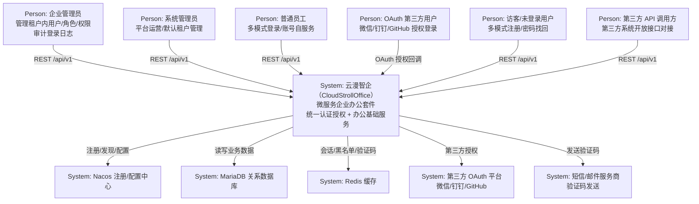
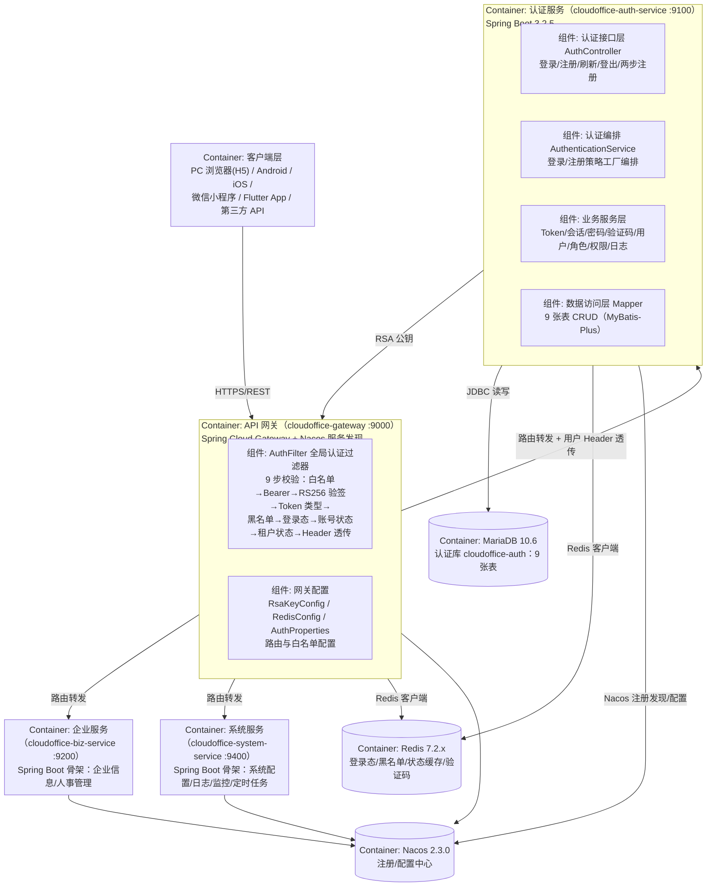
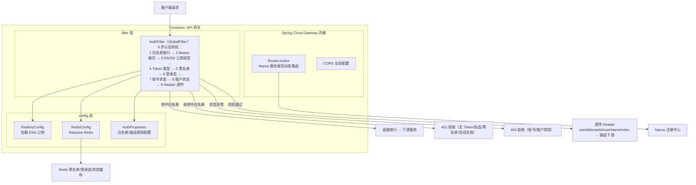
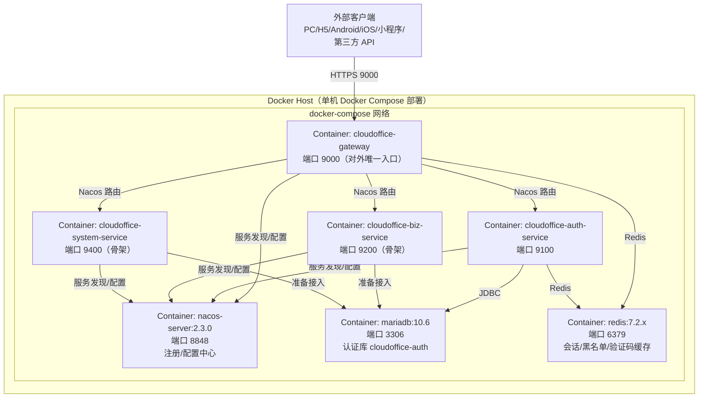
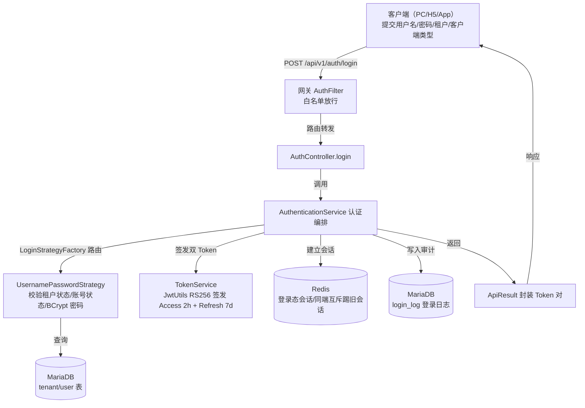
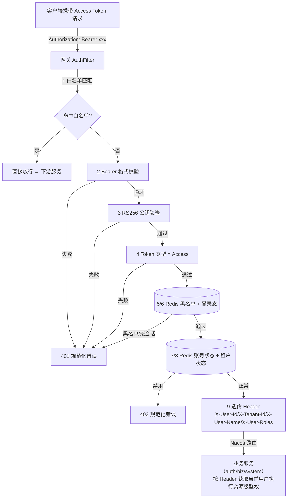
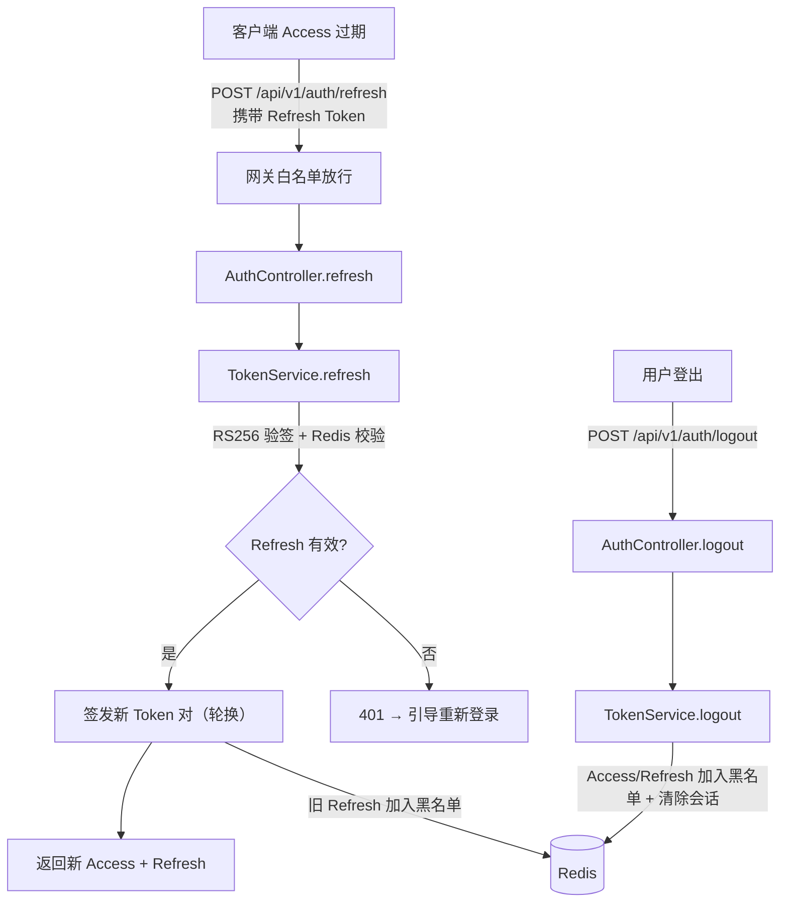

# 系统架构设计文档（SAD）
**项目名称**：云漫智企（CloudStrollOffice）
**版本号**：v0.0.1（初始化基线，对应已实现能力 v0.1.6）
**日期**：2026-08-06
**编写人**：SA

## 1. 设计目标与约束
### 1.1 设计目标
1. **微服务化低耦合**：公共/网关/认证/企业/系统 5 个模块独立开发、独立部署、独立启停，服务间通过 Nacos 注册发现与 API 网关统一路由，为后续业务（企业信息、人事、工作流、薪酬）按域扩展奠定基础。
2. **统一认证授权底座**：以认证服务为核心构建统一认证中心，支持 4 种登录模式、5 种注册模式、两步注册、多租户 RBAC 权限模型与 JWT 双 Token 会话体系，业务服务零重复认证逻辑。
3. **安全优先**：JWT RS256 非对称签名、BCrypt 密码单向加密、Redis 黑名单/登录态实时控制（登出、踢人、禁用即时效）、敏感信息零落库零日志、统一错误码防信息泄露。
4. **统一规范**：REST 接口路径 /api/v1/{module}/{resource} 统一规范；全部接口统一返回 ApiResult 响应体；统一错误码（29 个）与全局异常处理；统一健康检查链路。
5. **可扩展性**：登录/注册策略工厂模式，新增认证方式不改动既有代码；企业服务与系统服务预留业务骨架与扩展点。
6. **部署标准化**：Docker Compose 一键编排（Nacos/MariaDB/Redis + 4 微服务共 8 容器），本地开发与生产部署同构。

### 1.2 设计约束
1. **技术约束**：后端限定 Java 21 + Spring Boot 3.2.5 + Spring Cloud 2023.0.1 + Spring Cloud Alibaba（Nacos 2.3.0）；ORM 限定 MyBatis-Plus 3.5.6；数据库限定 MariaDB 10.6（LTS）与 Redis 7.2.x；客户端限定 Flutter。
2. **部署约束**：Docker Compose 单机编排部署，网关 9000、认证 9100、企业 9200、系统 9400，外部组件 Nacos 8848、MariaDB 3306、Redis 6379；密钥文件存放于 keys/ 目录且 gitignore，环境配置经 env.json/env.example.json 管理。
3. **合规约束**：密码必须 BCrypt 单向加密，禁止明文落库/落日志；JWT 私钥仅认证服务持有，公钥分发网关验签；敏感信息（密码、Token、密钥）日志泄露事件为 0。
4. **非功能约束**：认证核心接口（登录/注册/刷新）P95 响应 ≤ 500ms；验证码同一目标 60 秒频率控制、5 分钟有效、单次使用、用途绑定。
5. **资源约束**：认证库单库 9 张表承载 RBAC 与认证审计数据；Redis 单实例承载登录态、黑名单、状态缓存与验证码。
6. **时间约束**：v0.0.1 为初始化基线版本，仅交付认证底座 + 服务骨架，业务功能按 v0.2.0+ 逐步演进。

## 2. 技术栈选型及理由
| 技术方向 | 选型 | 理由 |
| --- | --- | --- |
| 编程语言 | Java 21（LTS） | 长期支持、虚拟线程/新特性提升并发能力，与 Spring Boot 3.x 兼容 |
| 微服务框架 | Spring Boot 3.2.5 + Spring Cloud 2023.0.1 | 生态成熟、版本兼容官方验证，支持响应式网关与声明式服务调用 |
| 注册/配置中心 | Spring Cloud Alibaba / Nacos 2.3.0 | 服务注册发现 + 配置管理一体化，中文社区活跃，支持多环境配置 |
| API 网关 | Spring Cloud Gateway（9000） | 响应式非阻塞网关，路由/过滤器链/CORS 原生支持，配合 Nacos 服务发现动态路由 |
| ORM | MyBatis-Plus 3.5.6 | 单表 CRUD 零 SQL、分页插件、乐观锁与逻辑删除内置，兼顾灵活 SQL |
| 数据库 | MariaDB 10.6（LTS） | 开源免费、兼容 MySQL 协议、性能稳定，适合企业应用 |
| 缓存/会话 | Redis 7.2.x | 高性能内存存储，承载登录态、Token 黑名单、账号/租户状态缓存与验证码 |
| 安全框架 | Spring Security | 与 Spring Boot 深度集成，无状态会话配置，为认证服务提供安全基础 |
| JWT | JJWT 0.12.6（RS256，RSA 2048） | 非对称签名保证令牌防伪造，私钥仅认证服务持有，公钥分发网关验签 |
| 密码加密 | BCrypt（Spring Security） | 自带盐值单向哈希，抗彩虹表攻击，业界标准密码存储方案 |
| API 文档 | SpringDoc 2.5.0（OpenAPI 3，模块分组） | 自动生成接口文档，按模块分组便于联调 |
| 工具库 | Hutool 5.8.26 | 常用工具（JSON/加密/集合）开箱即用，减少重复代码 |
| 代码简化 | Lombok | 消除样板代码（getter/setter/构造器），提升开发效率 |
| 构建工具 | Maven 多模块 | 模块依赖清晰（common → 各服务），统一依赖版本管理 |
| 客户端 | Flutter（cloudoffice-flutter-app） | 一套代码多端（Android/iOS/H5/小程序），与后端 REST 对接 |
| 部署 | Docker Compose | 一键编排 8 容器（Nacos/MariaDB/Redis/4 服务），环境一致性 |

## 3. 系统上下文图

## 4. 容器图

## 5. 组件图
### 5.1 认证服务组件图（cloudoffice-auth-service :9100）

```mermaid
flowchart TD
    subgraph AUTH["Container: 认证服务"]
        subgraph CTL["controller 层"]
            AC["AuthController<br/>登录/注册/刷新/登出/补全/密码/手机号/验证码"]
            UC["UserController<br/>用户管理（分页/启禁用/分配角色）"]
            RC["RoleController<br/>角色管理（创建/分配权限）"]
            PC["PermissionController<br/>权限树管理"]
            HC["HealthController<br/>健康检查"]
        end

        subgraph SVC["service 层"]
            AS["AuthenticationService<br/>认证编排总入口"]
            LS["LoginService<br/>登录流程编排"]
            TS["TokenService<br/>双 Token 签发/刷新/黑名单"]
            SS["LoginSessionService<br/>Redis 会话管理/同端互斥"]
            PS["PasswordService<br/>修改/找回密码"]
            VCM["VerificationCodeManager<br/>验证码生成/发送/校验/频率控制"]
            VCS["VerificationCodeService<br/>验证码发送实现"]
            US["UserService<br/>用户 CRUD"]
            RS["RoleService<br/>角色 CRUD/分配权限"]
            PMS["PermissionService<br/>权限树 CRUD"]
            LLS["LoginLogService<br/>登录日志审计"]
        end

        subgraph STG["strategy 策略层（工厂模式）"]
            LF["LoginStrategyFactory"]
            LS1["UsernamePasswordStrategy"]
            LS2["PhoneCodeLoginStrategy"]
            LS3["PhonePasswordLoginStrategy"]
            LS4["OAuthLoginStrategy"]
            RF["RegisterStrategyFactory"]
            RS1["UsernamePwdRegisterStrategy"]
            RS2["PhoneCodeRegisterStrategy"]
            RS3["OAuthRegisterStrategy"]
            RS4["PhoneSetUsernameStrategy"]
            RS5["OAuthSetInfoStrategy"]
        end

        subgraph MAP["mapper 层（MyBatis-Plus）"]
            M1["UserMapper"]
            M2["TenantMapper"]
            M3["RoleMapper"]
            M4["PermissionMapper"]
            M5["UserRoleMapper"]
            M6["RolePermissionMapper"]
            M7["LoginLogMapper"]
            M8["OAuthAccountMapper"]
            M9["VerificationCodeMapper"]
        end

        subgraph CFG["config / util 层"]
            SC["SecurityConfig<br/>无状态会话/BCrypt"]
            RK["RsaKeyConfig<br/>RSA 2048 密钥加载"]
            RDC["RedisConfig"]
            MPC["MyBatisPlusConfig"]
            PW["PasswordProperties"]
            VC["VerificationCodeProperties"]
            OAC["OAuth2Config"]
            JU["JwtUtils<br/>RS256 签发/解析"]
        end
    end

    AC --> AS
    UC --> US
    RC --> RS
    PC --> PMS
    HC --> H1["返回 ApiResult 健康状态"]

    AS --> LS
    AS --> RF
    AS --> LF
    AS --> TS
    AS --> SS
    LS --> LF
    LF --> LS1
    LF --> LS2
    LF --> LS3
    LF --> LS4
    LS --> RF
    RF --> RS1
    RF --> RS2
    RF --> RS3
    RF --> RS4
    RF --> RS5
    LS --> LLS
    LS --> VCM
    LS --> PS
    PS --> VCM
    VCM --> VCS

    TS --> JU
    TS --> SS
    JU --> RK

    US --> M1
    US --> M5
    US --> M2
    RS --> M3
    RS --> M6
    PMS --> M4
    LLS --> M7
    LS4 --> M8
    VCM --> M9
    VCS --> VC
```

### 5.2 网关组件图（cloudoffice-gateway :9000）

## 6. 部署架构图

## 7. 安全架构
### 7.1 认证
1. **JWT RS256 双 Token 体系**：RSA 2048 位非对称密钥对，私钥仅认证服务持有（keys/ 目录加载），公钥分发至网关验签；Access Token 有效期 2 小时、Refresh Token 有效期 7 天，刷新采用轮换机制（旧 Refresh 立即失效）防重放。
2. **网关统一认证**：所有非白名单请求经 AuthFilter 9 步校验（白名单 → Bearer 格式 → RS256 公钥验签 → Token 类型 → 黑名单 → 登录态 → 账号状态 → 租户状态 → Header 透传），业务服务零认证逻辑。
3. **密码认证**：用户名密码/手机+密码登录经 BCrypt 匹配校验；登录失败与用户名不存在统一返回"用户名或密码错误"，防账号枚举。
4. **多模式认证**：4 种登录策略（用户名密码/手机验证码/手机+密码/OAuth）经策略工厂统一编排，认证结果统一签发 Token。
5. **会话实时控制**：Redis 维护登录态会话、Token 黑名单与账号/租户状态缓存；登出、踢人、密码重置/找回、用户禁用、租户禁用均实时生效。

### 7.2 授权
1. **多租户 RBAC**：用户-角色-权限三层关联，权限树形组织；所有用户/角色/权限/关联数据按租户 ID 隔离，租户间数据不可见。
2. **最小权限**：默认租户预置 SUPER_ADMIN 超级管理员角色与 admin 账号（全部权限），普通账号仅获分配角色关联权限；角色编码租户内唯一，被引用角色不可删除。
3. **网关状态联动**：用户禁用/租户禁用通过 Redis 状态缓存由网关实时拦截（403），无需等待 Token 过期。
4. **接口鉴权**：业务服务信任网关透传的 userId/tenantId/roles Header 进行资源级鉴权，权限校验在业务层执行。

### 7.3 传输安全
1. 网关为对外唯一入口（9000），对外建议 HTTPS 终止于网关层；内网服务间通信经 Docker 网络隔离。
2. OAuth 授权流程走第三方平台标准授权码模式，回调经 HTTPS 传递授权码，不泄露 Token。
3. CORS 在网关统一配置，限制跨域来源；请求 Header（Authorization、X-User-* 等）由网关统一管理与透传。

### 7.4 数据安全
1. **密码存储**：BCrypt 单向哈希（自动盐值），任何接口/日志不返回明文；修改/找回密码记录最后修改时间。
2. **Token 存储**：Access/Refresh Token 不落库，仅存 Redis 黑名单与会话元数据（会话 ID/客户端类型/用户租户信息），JWT 私钥文件 gitignore 不入库。
3. **验证码**：6 位数字、5 分钟有效、用途与目标绑定、单次使用（校验后置已使用），模拟模式（VERIFICATION_CODE_MOCK=true）仅限开发/演示环境返回固定码 123456。
4. **敏感信息防护**：统一异常体系（BaseException/BusinessException/AuthException + 29 错误码 + GlobalExceptionHandler）保证错误响应不泄露堆栈、SQL、密钥与敏感数据；日志规范禁止输出密码/Token/密钥/个人敏感信息。

### 7.5 审计
1. **登录日志**：全量记录登录成功/失败日志（登录 IP、客户端类型、登录结果、失败原因、时间戳、租户/用户信息），失败原因结构化存储，支撑暴力破解分析与安全事件追溯。
2. **敏感操作追踪**：密码修改/重置、手机号变更、强制踢人等操作记录时间戳与操作人，可追溯审计。
3. **审计隔离**：登录日志按租户隔离查询，跨租户不可见；分页支持大数据量检索。

## 8. 性能架构
### 8.1 容量估算
| 维度 | 估算依据 | 说明 |
| --- | --- | --- |
| 租户规模 | 目标支持 100+ 企业租户共平台 | 租户表按编码/状态索引，登录按租户编码路由 |
| 用户规模 | 单租户千级用户，平台万级 | 用户表用户名（租户内）唯一索引，分页查询 |
| 登录并发 | 峰值 100 TPS（登录/刷新） | 认证接口 P95 ≤ 500ms；Redis 承担会话读写 |
| 数据量 | 登录日志年量级百万行 | 分页查询 + 按时间索引，后续可归档分表 |
| 缓存容量 | 单实例 Redis 数 GB 级 | 登录态/黑名单/状态缓存均设 TTL，验证码 5 分钟 |

### 8.2 缓存策略
1. **Redis 缓存分层**：登录态会话（TTL 对齐 Refresh 7d）、Token 黑名单（TTL 对齐 Token 剩余有效期）、账号/租户状态缓存（TTL 短周期 + 变更即时更新）、验证码（5 分钟 + 60 秒发送频率位）。
2. **Redis Key 规范**：统一经 RedisKeyConstants 定义，前缀区分会话/黑名单/状态/验证码，避免冲突。
3. **Token 轮换降频**：Access 2h + Refresh 7d 减少重复登录与刷新频率，刷新轮换防重放的同时控制 Redis 数据量。

### 8.3 异步与削峰
1. 登录日志写入走独立事务路径（登录主流程与日志解耦），失败不影响登录主链路（日志丢失不影响认证可用性，后续可引入消息队列异步落库）。
2. 验证码发送频率控制（60 秒/目标）从源头削峰防滥用；模拟模式下发送零成本。

### 8.4 限流与防护
1. 网关预留限流能力（Spring Cloud Gateway RequestRateLimiter），后续版本按 IP/用户维度配置限流。
2. 验证码 60 秒频率控制 + 5 分钟有效 + 单次使用，防短信轰炸与爆破。
3. 登录失败不做区分提示防枚举；失败日志全量记录供风控分析。

### 8.5 监控指标
| 指标 | 说明 |
| --- | --- |
| 健康检查链路 | 四服务 /api/v1/{module}/health 探活，网关对外聚合 |
| 接口响应时间 | 登录/注册/刷新 P95 ≤ 500ms 目标 |
| 登录成功率/失败率 | 登录日志统计，失败原因分布 |
| Redis 命中率/内存 | 会话/黑名单缓存命中与内存水位 |
| 数据库连接池 | 连接数、活跃连接、慢 SQL 监控 |
| 错误码分布 | 29 个错误码出现频次，异常率监控 |

## 9. 数据流图
### 9.1 登录认证数据流（用户名密码示例）

### 9.2 网关认证与请求转发数据流

### 9.3 刷新 Token 与登出数据流

## 10. 架构决策记录（ADR）
| 编号 | 决策主题 | 决策内容 | 理由 | 日期 |
| --- | --- | --- | --- | --- |
| ADR-001 | 微服务架构拆分 | 按公共/网关/认证/企业/系统 5 模块拆分，Maven 多模块管理，服务间仅经网关通信 | 办公套件业务域（认证/企业/系统）独立演进、独立部署，公共能力下沉 common 避免循环依赖 | 2026-08-06 |
| ADR-002 | 注册/配置中心选型 | 采用 Spring Cloud Alibaba + Nacos 2.3.0 作为注册发现与配置中心 | 一体化注册+配置能力、中文生态成熟、与 Spring Cloud 2023.x 兼容，Docker 化部署简单 | 2026-08-06 |
| ADR-003 | API 网关与全局认证 | 采用 Spring Cloud Gateway 作唯一入口（9000），AuthFilter 全局过滤器实现 9 步认证校验并透传用户 Header | 认证逻辑收敛于网关，业务服务零重复实现；响应式网关性能好，白名单/黑名单/状态校验统一管控 | 2026-08-06 |
| ADR-004 | JWT 签名算法与双 Token 方案 | 采用 RSA 2048 位 RS256 非对称签名，Access Token 2h + Refresh Token 7d，刷新轮换机制 | 非对称签名私钥仅认证服务持有、公钥分发网关，防伪造；双 Token 平衡安全与体验，轮换防重放 | 2026-08-06 |
| ADR-005 | Redis 会话与实时失效 | Redis 承载登录态会话、Token 黑名单、账号/租户状态缓存，登出/踢人/禁用实时生效 | 无状态 JWT 无法主动失效，配合 Redis 实现秒级失效控制；Redis Key 统一常量管理 | 2026-08-06 |
| ADR-006 | 多租户与 RBAC 模型 | 用户-角色-权限三层关联 + 权限树，全部业务数据按租户 ID 隔离，用户名租户内唯一 | 多企业共平台运营需强隔离；RBAC 满足最小权限；租户 ID 贯穿查询边界 | 2026-08-06 |
| ADR-007 | 登录/注册策略工厂 | 4 种登录策略 + 5 种注册策略经 LoginStrategyFactory/RegisterStrategyFactory 统一编排 | 新增认证方式（如扫码/生物识别）仅新增策略实现，不改动编排与既有策略，满足开闭原则 | 2026-08-06 |
| ADR-008 | 统一响应与异常体系 | 全部接口返回 ApiResult/PageResult，BaseException/BusinessException/AuthException + 29 错误码 + GlobalExceptionHandler 全局处理 | 客户端处理契约统一；错误码结构化；全局异常兜底防堆栈/敏感信息泄露 | 2026-08-06 |
| ADR-009 | 密码存储方案 | 密码一律 BCrypt 单向加密（Spring Security），零明文落库落日志，找回/重置后清除全部登录态 | BCrypt 自动盐值抗彩虹表；密码重置联动 Redis 会话失效，保障账户安全 | 2026-08-06 |
| ADR-010 | 验证码双模式 | VerificationCodeService 抽象发送通道，模拟模式（VERIFICATION_CODE_MOCK=true）返回固定码 123456，真实模式对接短信/邮件服务商 | 开发/演示环境免服务商依赖即可联调；生产切真实通道不改业务代码 | 2026-08-06 |
| ADR-011 | ORM 选型 | 采用 MyBatis-Plus 3.5.6 作为持久层框架 | 单表 CRUD/分页/逻辑删除开箱即用，复杂查询保留 XML 自由度，开发效率高 | 2026-08-06 |
| ADR-012 | 无状态会话与信任链 | SecurityConfig 关闭 Session 采用无状态认证；业务服务仅信任网关透传 Header 获取当前用户 | 微服务水平扩展无需会话复制；网关作为唯一认证边界形成可信链路，防止绕过认证直连服务 | 2026-08-06 |

<!-- SPDX-License-Identifier: Apache-2.0 / Copyright 2026 jenemy8023 <jenemy8023@163.com> -->
