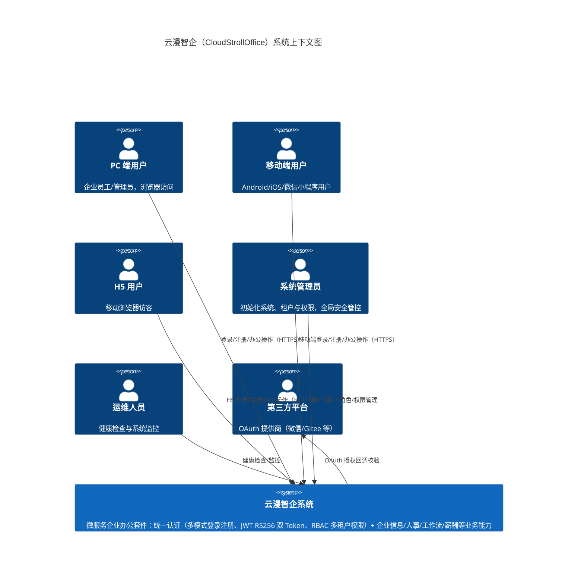
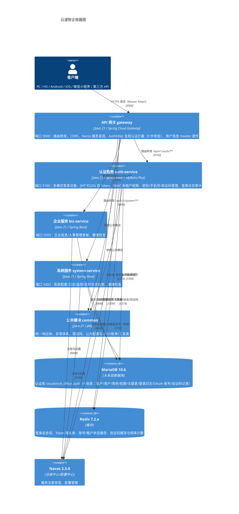
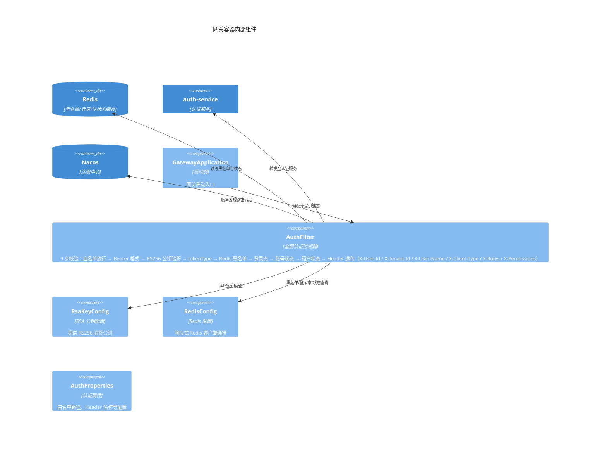
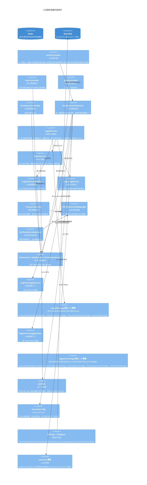
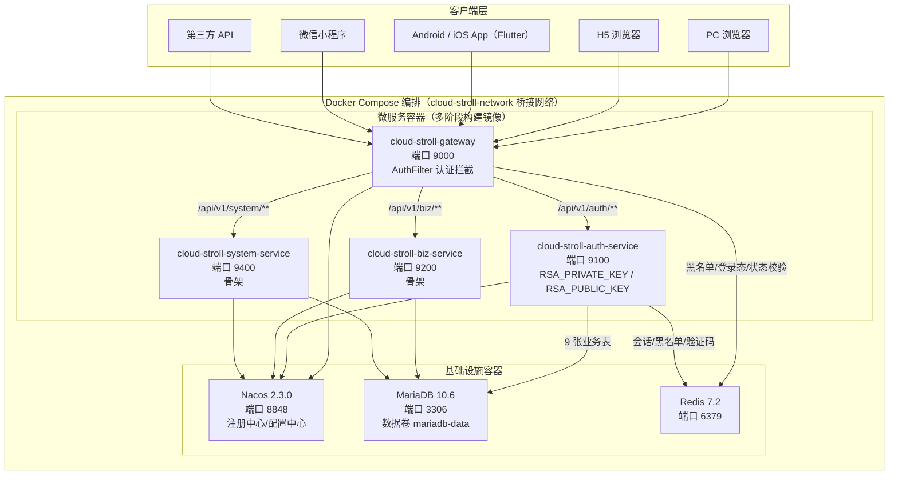
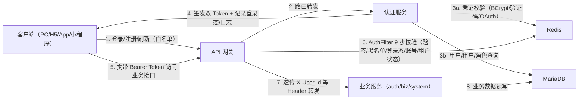
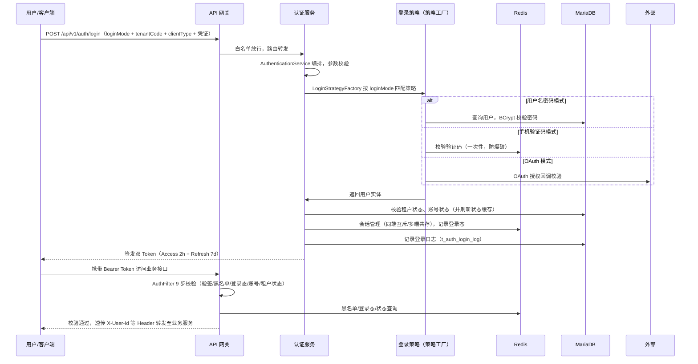
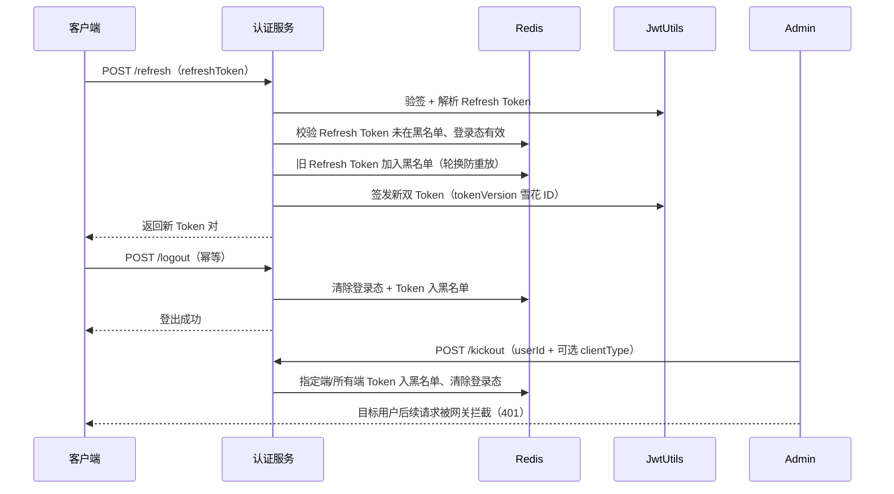

# 系统架构设计文档（SAD）
**项目名称**：云漫智企（CloudStrollOffice，英文缩写 cso）
**版本号**：v0.0.1（初始化归档版本，对应实际业务版本 v0.1.6）
**日期**：2026-08-05
**编写人**：SA

## 1. 设计目标与约束

### 1.1 设计目标

- **微服务拆分与职责隔离**：按业务域拆分为认证服务（auth-service）、企业服务（biz-service）、系统服务（system-service）三个业务服务 + API 网关（gateway） + 公共模块（common），认证与业务解耦，服务独立开发、测试、部署与伸缩，为后续企业信息、人事、工作流、薪酬等模块演进预留独立扩展空间。
- **统一认证与安全纵深防御**：以"网关统一认证 + 认证服务统一签发"为核心，实现多端（PC/H5/Android/iOS/微信小程序等 6 种客户端类型）一次登录、全端通行；通过 JWT RS256 双 Token、Redis 黑名单/登录态/状态四重校验、BCrypt 密码散列、登录日志审计等机制保障账号与会话安全。
- **多租户 RBAC 权限模型**：建立用户-角色-权限三层关联 + 租户隔离的数据模型，用户名在租户内唯一、租户间数据不可见，支撑多企业共用一套系统的 SaaS 化运营。
- **可扩展的认证能力**：登录（4 种模式）与注册（5 种模式）采用策略接口 + 工厂编排模式，新增登录/注册模式只需新增策略实现，不修改主流程代码。
- **统一规范与可观测性**：所有 REST 接口统一返回 `ApiResult<T>`、分页返回 `PageResult<T>`；29 个错误码全覆盖、全局异常统一封装；三个业务服务均提供健康检查端点，支撑基础运维监控。

### 1.2 设计约束

- **技术约束**：基于 Java 21 LTS + Spring Boot 3.2.x + Spring Cloud 2023.x 技术栈，服务间通过 Nacos 服务发现通信；关系型数据使用 MariaDB 10.6 (LTS)，缓存使用 Redis 7.2.x；客户端使用 Flutter（Dart 3）跨端实现。
- **资源约束**：本版本部署以 Docker Compose 单机编排为主（8 个容器），生产环境通过负载均衡器接入网关集群；RSA 密钥对、数据库密码等敏感信息仅通过环境变量注入，密钥文件不入库。
- **时间约束**：本版本为存量项目初始化归档（v0.0.1，对应业务版本 v0.1.6），需将现有代码能力完整反推固化为架构基线；biz-service 与 system-service 当前为骨架，仅提供健康检查，业务能力在后续版本填充。
- **合规与安全约束**：遵循 Apache License 2.0；密码禁止明文存储与日志输出；Token、验证码等敏感信息禁止日志输出；异常兜底不泄露堆栈与内部信息；登录/踢人/改密等安全事件必须留痕。

## 2. 技术栈选型及理由

| 技术方向 | 选型 | 理由 |
| --- | --- | --- |
| 编程语言 | Java 21 (OpenJDK LTS) | 长期支持版本，虚拟线程、模式匹配等新特性提升并发与代码表达力，与 Spring Boot 3.2.x 兼容 |
| 后端框架 | Spring Boot 3.2.5 | 快速构建微服务，自动装配与生态完善，内嵌 Tomcat，版本与 Java 21 对齐 |
| 微服务框架 | Spring Cloud 2023.0.1 | 微服务治理标准框架，提供网关、负载均衡、配置管理等基础设施能力 |
| 服务注册/配置中心 | Spring Cloud Alibaba Nacos 2023.0.1.0 / 2.3.0 | 服务发现 + 动态配置一体化，中文社区活跃，运维成本低 |
| API 网关 | Spring Cloud Gateway | 基于 WebFlux 的响应式网关，性能高，支持全局过滤器实现统一认证拦截 |
| ORM 框架 | MyBatis-Plus 3.5.6 | 灵活 SQL 控制 + 通用 CRUD 封装，契合复杂多表查询场景，提供分页插件与自动填充 |
| 关系型数据库 | MariaDB 10.6 (LTS) | MySQL 完全兼容、开源免费、性能稳定，社区版 LTS 长期维护 |
| 数据库连接池 | HikariCP 5.x | Spring Boot 默认连接池，性能业界领先，低开销高吞吐 |
| 缓存 | Redis 7.2.x（Spring Data Redis） | 高性能内存缓存，支撑登录态会话、Token 黑名单、账号/租户状态与验证码的实时读写 |
| 安全框架 | Spring Security（内置） | BCrypt 密码编码器 + 无状态会话管理 + 自定义 401/403 JSON 响应 |
| JWT 库 | JJWT (io.jsonwebtoken) 0.12.6 | 标准 JWT 实现，支持 RS256 非对称签名、Claims 解析与过期校验 |
| API 文档 | SpringDoc (springdoc-openapi) 2.5.0 | OpenAPI 3 自动生成，按模块分组，支持 Swagger UI 在线调试 |
| 密码加密 | BCrypt（Spring Security Crypto） | 自带盐值的慢哈希算法，抗彩虹表攻击 |
| JSON 处理 | Jackson 2.16.x | Spring 默认 JSON 库，性能与生态成熟 |
| 工具库 | Hutool 5.8.26 | 雪花 ID、加密、集合等通用工具封装，减少样板代码 |
| 代码简化 | Lombok 1.18.32 | @Data/@Slf4j/@Builder 减少样板代码 |
| 数据库驱动 | MariaDB Connector/J 3.3.3 | MariaDB 官方驱动 |
| 构建工具 | Maven 3.9+ | 多模块依赖管理成熟，父 POM 统一版本管控 |
| 单元测试 | JUnit 5 + Mockito | Spring Boot Starter Test 内置，认证服务已有 206+ 个单元测试 |
| 客户端 | Flutter（Dart 3） | 一套代码覆盖 Android/iOS/H5/桌面端，降低多端维护成本 |

## 3. 系统上下文图

## 4. 容器图

## 5. 组件图

### 5.1 API 网关（cloudoffice-gateway）组件图

### 5.2 认证服务（cloudoffice-auth-service）组件图

## 6. 部署架构图

**端口规划**：

| 容器/服务 | 端口 | 说明 |
| --- | --- | --- |
| gateway | 9000 | API 网关（唯一对外入口） |
| auth-service | 9100 | 认证服务 |
| biz-service | 9200 | 企业服务 |
| system-service | 9400 | 系统服务 |
| Nacos | 8848 | 注册中心 & 配置中心 |
| MariaDB | 3306 | 关系型数据库 |
| Redis | 6379 | 缓存 |

生产环境推荐拓扑：`负载均衡器（Nginx/ALB） → 网关实例集群 → 各微服务多实例（经 Nacos 注册发现） → MariaDB/Redis`；RSA 密钥对（`RSA_PRIVATE_KEY`/`RSA_PUBLIC_KEY`）、数据库密码等敏感配置仅通过环境变量注入，不写入镜像与仓库。

## 7. 安全架构

### 7.1 认证与授权

- **JWT RS256 双 Token**：RSA 2048 位非对称密钥对，认证服务持有私钥签名，网关持公钥验签。Access Token 有效期 2 小时，Refresh Token 有效期 7 天；刷新采用轮换机制，旧 Refresh Token 立即加入黑名单防重放。
- **网关统一认证（AuthFilter 9 步校验）**：白名单放行 → `Authorization: Bearer` 格式校验 → RS256 公钥验签 → `tokenType=access` 校验 → Redis 黑名单检查 → 登录态校验 → 账号状态校验（封禁 403） → 租户状态校验（禁用 403） → 用户信息 Header 透传（X-User-Id / X-Tenant-Id / X-User-Name / X-Client-Type / X-Roles / X-Permissions）。
- **多模式身份校验**：登录/注册按模式经策略工厂路由，密码走 BCrypt 校验、验证码走 Redis 一次性校验、OAuth 走第三方授权校验。
- **RBAC 多租户授权**：用户-角色-权限三层关联，租户间数据不可见，用户名/角色编码在租户内唯一；管理类接口由管理员角色操作。

### 7.2 传输与数据安全

- **传输安全**：生产环境经 HTTPS（负载均衡器终结 TLS）接入网关；网关配置 CORS 跨域策略。
- **密码安全**：密码使用 BCrypt 加盐散列存储，禁止明文；日志与响应禁止输出密码、Token、验证码等敏感信息。
- **密钥管理**：RSA 私钥/公钥、数据库密码等仅通过环境变量注入（`RSA_PRIVATE_KEY`/`RSA_PUBLIC_KEY`/`DB_PASSWORD` 等），密钥文件放 keys/ 且不入库，禁止提交仓库。
- **会话失效实时性**：登出、强制踢人（指定端/所有端）、改密、重置密码、账号封禁、租户停用均实时写入 Redis 黑名单/状态缓存，网关校验即刻生效。

### 7.3 审计与防滥用

- **登录日志审计**：登录全量记录（IP、客户端类型、结果、失败原因），安全事件可追溯。
- **验证码防爆破**：6 位数字、5 分钟过期、60 秒发送频率限制、一次性使用；开发环境模拟模式（`VERIFICATION_CODE_MOCK=true`）生产必须关闭。
- **统一异常不泄露**：全局异常处理器统一封装为标准 `ApiResult`，兜底不泄露堆栈与内部信息；网关/认证服务对 401/403 输出自定义 JSON 响应体。

## 8. 性能架构

- **缓存加速**：Redis 承载登录态会话、Token 黑名单、账号/租户状态缓存、验证码与频率计数，热点读取不落库；验证码默认 TTL 300 秒、会话按 Token 有效期管理，黑名单 TTL 对齐 Refresh Token 生命周期（7 天）。
- **连接池**：数据库使用 HikariCP 连接池（默认按 Spring Boot 配置），支撑服务高并发读写。
- **无状态会话**：服务不保存本地会话状态，认证状态全部外置 Redis，支持多实例水平伸缩。
- **高效 ID 生成**：JWT tokenVersion 使用 Hutool 雪花算法（Snowflake）生成，支持分布式唯一。
- **分页查询**：MyBatis-Plus 分页插件统一处理列表查询，避免全表扫描。
- **监控与健康检查**：三个业务服务提供 `/api/v1/{module}/health` 健康检查端点，返回服务名/状态/版本/时间戳；结合 Spring Boot Actuator 与容器健康检查保障可用性。
- **网关性能**：Spring Cloud Gateway 基于 WebFlux 响应式模型，全局过滤器为纯异步链路；认证校验均走 Redis 高速查询，避免同步阻塞。

## 9. 数据流图

### 9.1 认证请求总览数据流

### 9.2 登录流程数据流

### 9.3 Token 刷新与登出/踢人数据流

## 10. 架构决策记录（ADR）

| 编号 | 决策主题 | 决策内容 | 理由 | 日期 |
| --- | --- | --- | --- | --- |
| ADR-001 | 微服务架构选型 | 采用 Spring Cloud 微服务架构，拆分为 gateway/auth/biz/system/common 五个模块，而非单体应用 | 业务域（认证/企业/系统）职责独立，支持独立开发、部署与伸缩；企业信息、人事、工作流、薪酬等模块演进需要独立扩展空间 | 2026-08-05 |
| ADR-002 | 认证独立服务 + 网关统一认证 | 认证能力独立成 auth-service，网关 AuthFilter 统一拦截全部请求做认证校验，而非在业务服务内各自鉴权 | 认证与业务解耦；安全策略集中管控（白名单/验签/黑名单/状态校验单点维护）；下游服务通过可信 Header 识别用户，避免重复实现与口径漂移 | 2026-08-05 |
| ADR-003 | JWT 采用 RS256 非对称签名 | 使用 RSA 2048 位密钥对，认证服务私钥签名、网关公钥验签，而非 HS256 对称密钥 | 私钥集中管理，网关与服务仅持有公钥即可验签，防密钥单点泄露扩散；支持网关多实例安全共享校验能力 | 2026-08-05 |
| ADR-004 | 双 Token + 轮换机制 | Access Token 2h + Refresh Token 7d，刷新时旧 Refresh Token 入黑名单轮换 | 短效 Access Token 降低泄露风险；Refresh Token 轮换防重放；无感续签兼顾安全与体验 | 2026-08-05 |
| ADR-005 | Redis 承载会话与状态 | 登录态、Token 黑名单、账号/租户状态、验证码均存 Redis | 登出/踢人/改密/封禁等操作可实时使会话失效（网关即时拦截）；多实例共享状态；验证码 TTL 与频率控制天然契合 Redis 特性 | 2026-08-05 |
| ADR-006 | 多租户 RBAC 权限模型 | 用户-角色-权限三层关联 + 租户数据隔离，用户名租户内唯一 | 多企业共用一套系统（SaaS 化）；三层模型权限粒度灵活，租户间数据不可见保障隔离 | 2026-08-05 |
| ADR-007 | 登录/注册策略工厂模式 | LoginStrategy（4 种）/ RegisterStrategy（5 种）接口 + 工厂按模式路由 | 新增登录/注册模式只需新增策略实现类，不修改主流程代码；开闭原则，认证能力可扩展 | 2026-08-05 |
| ADR-008 | 数据库选型 MariaDB 10.6 | 采用 MariaDB 10.6 (LTS) 而非 MySQL 企业版 | MySQL 完全兼容、开源免费、社区版 LTS 长期维护，无商业授权成本 | 2026-08-05 |
| ADR-009 | ORM 选型 MyBatis-Plus | 采用 MyBatis-Plus 3.5.6 而非 Spring Data JPA | 复杂多表 SQL 灵活可控、通用 CRUD 减少样板代码、分页插件与自动填充内置，契合企业办公套件查询场景 | 2026-08-05 |
| ADR-010 | 密码 BCrypt 散列存储 | 密码使用 BCrypt（Spring Security Crypto）加盐散列，禁止明文 | 自带盐值的慢哈希抗彩虹表与暴力破解；生态集成简单 | 2026-08-05 |
| ADR-011 | 网关 Header 透传用户信息 | 网关验签后以 X-User-Id 等 Header 透传用户信息，下游服务不再解析 Token | 验签与身份解析集中一次完成，下游服务轻量可信；避免各服务重复解析 JWT 的性能开销与不一致 | 2026-08-05 |
| ADR-012 | 客户端选型 Flutter | 移动端采用 Flutter（Dart 3）跨端框架 | 一套代码覆盖 Android/iOS/H5/桌面端，降低多端开发与维护成本，与后端 REST API 天然配合 | 2026-08-05 |

<!-- SPDX-License-Identifier: Apache-2.0 / Copyright 2026 jenemy8023 <jenemy8023@163.com> -->
