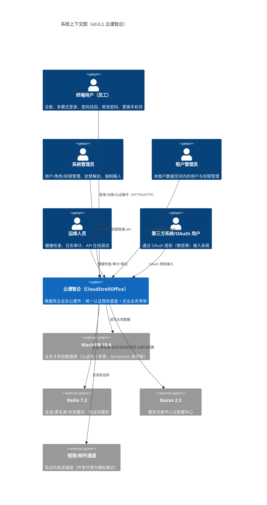
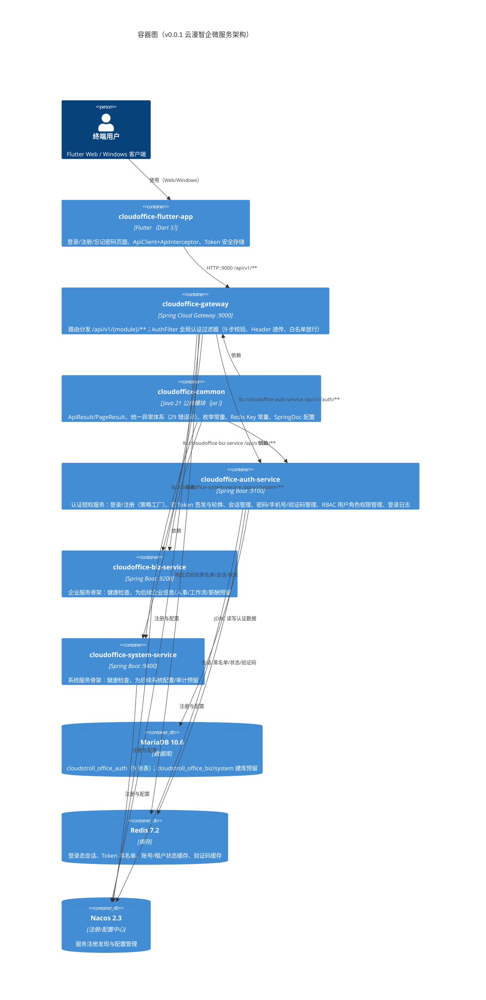
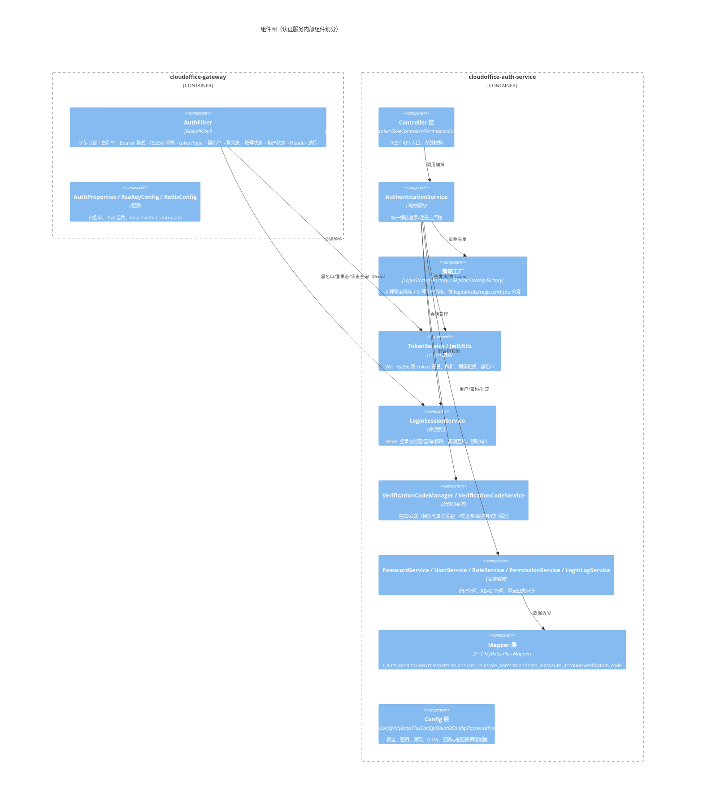
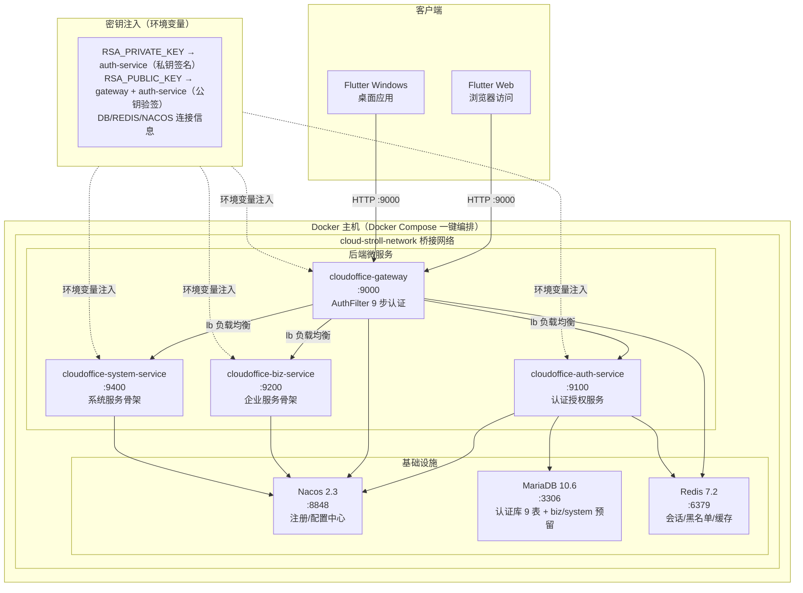
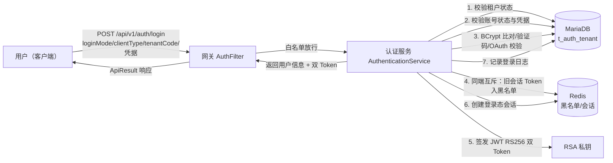
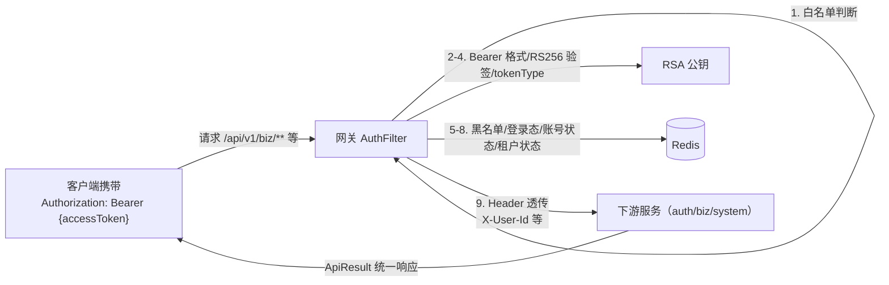
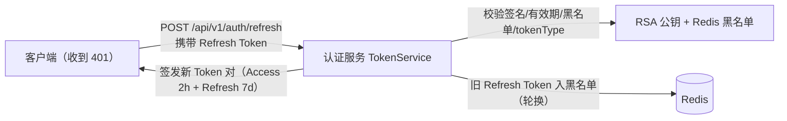

# 系统架构设计文档（SAD）

**项目名称**：云漫智企（CloudStrollOffice）
**版本号**：0.0.1
**日期**：2026-08-07
**编写人**：SA

## 1. 设计目标与约束

### 1.1 设计目标
- **G-A1 统一认证底座**：以"统一认证授权"为平台底座先行交付，为企业员工、管理员及第三方系统提供统一身份认证能力，支持 6 种客户端类型（Windows/Ubuntu/H5/Android/iOS/微信小程序）混合登录，实现"一次认证、多端通行"。
- **G-A2 微服务可扩展骨架**：采用 Maven 多模块微服务架构（common/gateway/auth-service/biz-service/system-service），模块间只依赖 common、禁止互相依赖，保证各服务可独立部署与横向扩展；biz/system 服务骨架就绪，为后续企业信息、人事、工作流、薪酬等业务版本提供扩展底座。
- **G-A3 安全纵深防御**：网关统一认证拦截（9 步校验）+ 服务端 JWT RS256 双 Token 轮换 + Redis 会话/黑名单/状态缓存 + BCrypt 密码加密，实现登出/踢人/密码重置实时生效、安全事件可审计追溯。
- **G-A4 多租户数据隔离**：基于 RBAC（用户-角色-权限）模型实现多租户数据空间隔离，租户内用户名唯一、租户间数据不可见。
- **G-A5 多端一致体验**：Flutter 客户端（Web + Windows 双平台）与后端共用同一套 API 契约（ApiResult 统一响应体、29 个统一错误码），Token 安全存储、网关地址可配置。

### 1.2 设计约束
- **技术约束**：后端统一 Java 21 + Spring Boot 3.2.5 + Spring Cloud 2023.0.1 + Spring Cloud Alibaba 2023.0.1.0；客户端统一 Flutter（Dart 3，SDK ^3.12.2）；ORM 统一 MyBatis-Plus 3.5.6；禁止引入与现有技术栈重复的第三方框架。
- **架构约束**：模块间依赖单向（下游依赖 common），服务间禁止循环依赖；所有服务注册到 Nacos，网关统一路由 `/api/v1/{module}/**`。
- **安全约束**：密码一律 BCrypt 加密存储，日志禁止输出密码与 Token；JWT 私钥仅存在于 auth-service（签名），公钥存在于 gateway 与 auth-service（验签）；密钥通过环境变量注入，禁止硬编码。
- **资源约束**：基础中间件（MariaDB 10.6 / Redis 7.2 / Nacos 2.3）通过 Docker Compose 一键编排（8 个容器）；开发环境验证码采用模拟模式，生产切换真实通道。
- **合规约束**：接口统一 ApiResult 响应结构，错误码统一 29 个，全局异常处理不泄露堆栈信息；登录失败不泄露具体原因，避免账号枚举。

## 2. 技术栈选型及理由

| 技术方向 | 选型 | 理由 |
| --- | --- | --- |
| 编程语言 | Java 21 | 长期支持版本，虚拟线程等新特性提升并发处理能力；与 Spring Boot 3.x 完全兼容 |
| 后端框架 | Spring Boot 3.2.5 | 快速构建微服务应用，生态成熟，内置 WebFlux/WebMVC 支持 |
| 微服务框架 | Spring Cloud 2023.0.1 | 提供网关、负载均衡、服务发现等微服务全套能力 |
| 微服务组件 | Spring Cloud Alibaba 2023.0.1.0（Nacos 2.3） | Nacos 承担注册中心与配置中心，服务发现/配置管理一体化，运维简单 |
| API 网关 | Spring Cloud Gateway（Reactive） | 响应式高性能网关；AuthFilter 全局过滤器实现 9 步统一认证；支持 CORS 与负载均衡路由 |
| ORM | MyBatis-Plus 3.5.6 | 无侵入增强 MyBatis，内置分页插件与逻辑删除，CRUD 开发效率高 |
| 数据库 | MariaDB 10.6 | 兼容 MySQL 生态，开源免费，稳定性与性能满足企业办公场景 |
| 缓存/会话 | Redis 7.2 | 登录态会话、Token 黑名单、状态缓存、验证码临时存储；网关用 ReactiveRedisTemplate 实现响应式校验 |
| JWT | JJWT 0.12.6 | JWT 标准实现库，支持 RS256 非对称签名算法（RSA 2048） |
| 密码加密 | Spring Security BCryptPasswordEncoder | BCrypt 加盐哈希，抗彩虹表攻击，业界标准 |
| API 文档 | SpringDoc OpenAPI 3（2.5.0） | 自动生成 Swagger UI 在线文档，按模块分组，支持在线调试 |
| 工具库 | Hutool 5.8.26 / Lombok 1.18.32 | Hutool 提供常用工具方法，Lombok 简化样板代码 |
| 客户端框架 | Flutter（Dart 3，SDK ^3.12.2） | 一套代码多端运行（Web + Windows + 移动端），UI 一致性好 |
| 客户端网络 | dio + provider + go_router + flutter_secure_storage | dio 封装 HTTP（ApiClient/ApiInterceptor 自动刷新 Token）、provider 状态管理、go_router 路由守卫、安全存储 Token |
| 部署编排 | Docker Compose | 一键编排 8 个容器（Nacos/MariaDB/Redis/gateway/auth/biz/system），开发与演示环境快速部署 |
| 代码规范 | Checkstyle（checkstyle.xml） | 统一代码风格与质量门禁 |

## 3. 系统上下文图

## 4. 容器图

## 5. 组件图

## 6. 部署架构图

部署说明：后端各服务以 Docker 容器部署于同一桥接网络，容器间通过服务名通信；端口映射：Nacos 8848、MariaDB 3306、Redis 6379、网关 9000、认证服务 9100、业务服务 9200、系统服务 9400；RSA 密钥与数据库/中间件连接信息通过 `.env` 环境变量注入，生产环境应使用密钥管理服务托管。

## 7. 安全架构

- **认证机制**：
  - 网关 AuthFilter 全局 9 步校验：白名单放行 → Bearer 格式校验 → RS256 公钥验签 → tokenType 校验（必须为 access）→ Redis 黑名单校验 → 登录态校验 → 账号状态校验 → 租户状态校验 → 用户信息 Header 透传（X-User-Id/X-Tenant-Id/X-User-Name/X-Client-Type/X-Roles/X-Permissions）。
  - JWT RS256 双 Token：Access Token 2 小时 + Refresh Token 7 天；刷新后旧 Refresh Token 立即入黑名单（防重放）；私钥仅存 auth-service，公钥存 gateway 与 auth-service。
  - 白名单端点（登录/注册/刷新/验证码发送/密码找回/健康检查/OpenAPI）直接放行；其余请求必须携带合法 Bearer Token。
- **授权机制**：
  - RBAC 模型：用户-角色-权限三层关联（t_auth_user_role / t_auth_role_permission / t_auth_permission 树形），用户权限为所分配角色权限并集；本版本提供模型与数据管理 API，接口级鉴权注解随业务版本演进。
  - 多租户隔离：登录/注册必须携带 tenantCode；用户名/角色编码在租户内唯一；数据查询与操作限定当前租户空间。
- **传输安全**：生产环境网关前端应部署 TLS 终止（HTTPS）；开发环境 HTTP 直连网关 9000；网关配置 CORS（allowedOriginPatterns 支持多来源）。
- **数据安全**：
  - 密码 BCrypt 加密存储（min 8 / max 64 字符策略），禁止明文；日志禁止输出密码与 Token。
  - JWT 密钥、数据库密码、Redis 密码一律通过环境变量注入，代码与配置文件不含真实密钥。
  - 登录日志记录 IP/客户端类型/结果/失败原因，供安全审计追溯。
- **账号安全**：
  - 会话实时可控：登出幂等（Token 入黑名单 + 会话清除）；管理员强制踢人（指定端/所有端）即时生效；密码修改/找回成功后清除该用户全部登录态。
  - 验证码：60 秒发送频率限制、5 分钟有效期、错误次数限制防暴力尝试、一次性失效、按用途隔离。
  - 登录失败统一提示，不泄露具体原因（防账号枚举）。

## 8. 性能架构

- **容量估算**：本版本为认证底座，登录/刷新为高频接口；认证库 9 张表数据量可控（租户/用户/角色/权限/日志），日志表随使用增长，后续版本可规划归档策略。
- **缓存设计**：
  - Redis 承载全部热路径数据：登录态会话（userId+clientType）、Token 黑名单（Token 签名 SHA-256 指纹）、账号状态缓存、租户状态缓存、验证码缓存（5 分钟 TTL）。
  - 网关使用 ReactiveRedisTemplate 响应式非阻塞校验，避免阻塞事件循环线程，提升网关吞吐。
- **连接池**：auth-service HikariCP（maximum-pool-size 20、minimum-idle 5）；Redis Lettuce 连接池（auth max-active 16、gateway max-active 8）。
- **异步与限流**：本版本登录/注册流程为同步事务处理；网关依赖 Spring Cloud Gateway 路由与 CORS；后续版本可引入 Spring Cloud Gateway RequestRateLimiter 限流与消息队列异步化（登录日志写入等）。
- **监控指标**：各服务提供 `/api/v1/{module}/health` 健康检查端点（服务名/状态/版本/时间戳）；SpringDoc Swagger UI 在线调试；后续版本可接入 Actuator 指标与链路追踪。

## 9. 数据流图

### 9.1 登录认证数据流

### 9.2 业务请求数据流（网关认证）

### 9.3 Token 刷新数据流

## 10. 架构决策记录（ADR）

| 编号 | 决策主题 | 决策内容 | 理由 | 日期 |
| --- | --- | --- | --- | --- |
| ADR-001 | 微服务拆分边界 | 后端拆分为 common/gateway/auth-service/biz-service/system-service 五个 Maven 模块，服务间只依赖 common、禁止互相依赖 | 认证底座与业务解耦，各服务可独立部署、独立扩展；避免循环依赖与构建耦合 | 2026-08-07 |
| ADR-002 | 认证拦截位置 | 认证校验统一收敛到网关 AuthFilter（9 步校验），下游服务不重复验签，通过 Header 透传用户信息 | 单一认证入口、全局统一策略、下游服务无感；响应式过滤不阻塞网关线程 | 2026-08-07 |
| ADR-003 | Token 方案 | JWT RS256（RSA 2048）双 Token：Access 2h + Refresh 7d + 刷新轮换（旧 Refresh 入黑名单） | 非对称签名实现签名/验签分离，私钥仅存认证服务；短效 Access + 轮换 Refresh 平衡安全与体验 | 2026-08-07 |
| ADR-004 | 会话与实时控制 | 登录态会话、Token 黑名单、账号/租户状态缓存全部放 Redis，网关每次请求校验 | 登出/踢人/封禁/密码重置实时生效，无需等待 Token 自然过期 | 2026-08-07 |
| ADR-005 | 登录/注册扩展性 | 登录（4 策略）与注册（5 策略）采用策略工厂模式（LoginStrategy/RegisterStrategy + Factory），认证编排服务统一编排 | 新增登录/注册方式只需新增策略实现，不影响既有流程与核心代码 | 2026-08-07 |
| ADR-006 | 多租户模型 | 租户独立数据空间（t_auth_tenant），登录/注册必带 tenantCode，用户名/角色编码租户内唯一，数据操作限定租户空间 | 满足多企业共用一套系统的 SaaS 场景，租户间数据不可见 | 2026-08-07 |
| ADR-007 | ORM 选型 | 采用 MyBatis-Plus 3.5.6（分页插件、逻辑删除、自动填充） | 无侵入增强 MyBatis，开发效率高，生态成熟，满足多表关联与 RBAC 查询 | 2026-08-07 |
| ADR-008 | 注册中心 | 采用 Nacos 2.3（Spring Cloud Alibaba 2023.0.1.0）承担注册中心与配置中心 | 一体化注册+配置，中文生态完善，运维简单，支持 Docker 单机模式 | 2026-08-07 |
| ADR-009 | 验证码通道 | 验证码服务抽象发送通道，开发环境模拟模式（直接返回固定验证码），生产切换真实短信/邮件通道 | 开发联调零成本，生产可平滑切换，通道实现可替换 | 2026-08-07 |
| ADR-010 | 客户端技术栈 | Flutter（Dart 3）一套代码支持 Web + Windows 双平台，dio 网络层 + flutter_secure_storage 安全存储 + go_router 路由守卫 | 跨端 UI 一致、开发效率高；Token 安全存储防明文泄漏；路由守卫保证未登录跳转 | 2026-08-07 |
| ADR-011 | 统一响应与异常 | 全接口统一 ApiResult（code/message/data/timestamp）+ PageResult 分页 + 29 个统一错误码 + 全局异常处理器（@RestControllerAdvice） | 客户端统一解析、错误语义一致、兜底响应不泄露堆栈，降低联调与运维成本 | 2026-08-07 |
| ADR-012 | 部署方式 | Docker Compose 一键编排 8 个容器（Nacos/MariaDB/Redis/gateway/auth/biz/system），密钥与连接信息环境变量注入 | 开发与演示环境快速拉起，环境差异最小化；生产环境可平滑迁移至 K8s | 2026-08-07 |

<!-- SPDX-License-Identifier: Apache-2.0 / Copyright 2026 jenemy8023 <jenemy8023@163.com> -->
