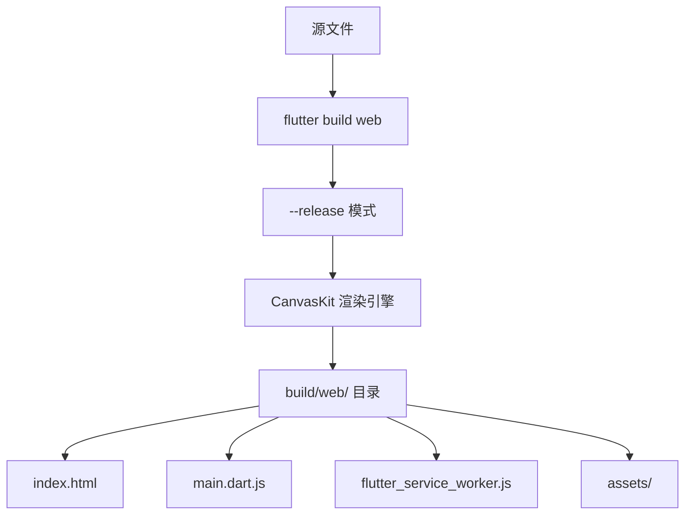
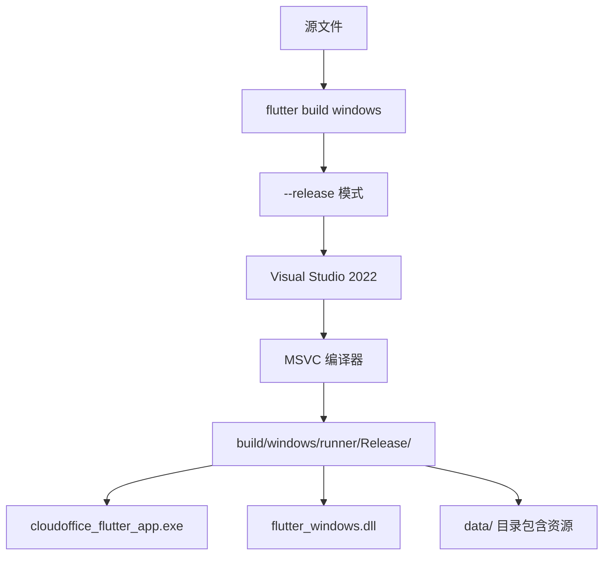

# 软件设计规格说明书（SDS）

**项目名称：** 云漫智企
**项目英文名：** CloudStrollOffice
**子项目名称：** cloudoffice-flutter-app（Flutter 前端）
**版本号：** v0.2.0
**日期：** 2026-06-24

---

## 1. 技术方案概述

### 1.1 系统定位

云漫智企（CloudStrollOffice）v0.2.0 在项目根目录下创建 `cloudoffice-flutter-app` Flutter 前端子项目，作为云漫智企面向最终用户的跨平台前端应用入口。Flutter 前端通过 API 网关（`http://localhost:9000`）与后端微服务通信，支持 Web（Chrome）和 Windows（VS2022）双平台运行。v0.2.0 阶段聚焦于用户认证基础能力——注册、登录、找回密码，形成完整的用户认证闭环，为后续业务功能页面提供认证基础设施和导航框架。

**系统定位层级：**

```
┌───────────────────────────────────────────────────────┐
│                   浏览器/桌面入口                        │
│   Chrome Web App  │  Windows Desktop App               │
└───────────────────────┬───────────────────────────────┘
                        │
┌───────────────────────▼───────────────────────────────┐
│              Flutter 前端应用 (v0.2.0)                  │
│  pubspec.yaml  →  Dio/Provider/GoRouter/SecureStorage  │
│  架构: Screen ↔ Provider ↔ Repository ↔ ApiClient     │
│  功能: 注册/登录/找回密码/首页/路由守卫                 │
└───────────────────────┬───────────────────────────────┘
                        │ HTTP/JSON (localhost:9000)
┌───────────────────────▼───────────────────────────────┐
│              Spring Cloud Gateway (端口 9000)            │
│  AuthFilter: 白名单放行 → JWT验签 → 黑名单/状态校验      │
│  路由: /api/v1/auth/** → auth-service (:9100)          │
└───────────────────────┬───────────────────────────────┘
                        │
┌───────────────────────▼───────────────────────────────┐
│              cloudoffice-auth-service (端口 9100)        │
│  策略模式认证: 多模式登录/注册/密码管理/验证码管理       │
└───────────────────────────────────────────────────────┘
```

### 1.2 架构风格

Flutter 前端采用 **Screen-Provider-Repository 三层架构**，各层职责单一、可独立测试：

```
┌─────────────────────────────────────────────────────────────────┐
│  Screen 层（页面层）                                               │
│  ┌──────────────────────────────────────────────────────────┐   │
│  │ LoginScreen / RegisterScreen / ForgotPasswordScreen      │   │
│  │ HomeScreen                                                │   │
│  │ 职责: 纯 UI 组件，通过 Provider 获取状态，发送用户事件        │   │
│  └──────────────────────┬───────────────────────────────────┘   │
│                         │ 监听 ChangeNotifier / 调用 Provider 方法  │
│  ┌──────────────────────▼───────────────────────────────────┐   │
│  │ Provider 层（状态管理层）                                     │   │
│  │ AuthProvider / ForgotPasswordProvider / HomeProvider      │   │
│  │ 职责: 继承 ChangeNotifier，管理 loading/error/success 状态   │   │
│  │       处理业务逻辑编排，调用 Repository 获取数据              │   │
│  └──────────────────────┬───────────────────────────────────┘   │
│                         │ 调用 Repository 方法                    │
│  ┌──────────────────────▼───────────────────────────────────┐   │
│  │ Repository 层（数据仓库层）                                    │   │
│  │ AuthRepository                                              │   │
│  │ 职责: 封装 API 调用逻辑，数据模型序列化/反序列化              │   │
│  │       将 DioException 转换为业务层可理解的 ApiResult          │   │
│  └──────────────────────┬───────────────────────────────────┘   │
│                         │ 调用 ApiClient 发送请求                 │
│  ┌──────────────────────▼───────────────────────────────────┐   │
│  │ ApiClient 层（HTTP 客户端层）                                  │   │
│  │ Dio 单例 + ApiInterceptor（Token 注入/刷新/错误处理）         │   │
│  │ SecureStorage（Token 安全持久化）                              │   │
│  └──────────────────────┬───────────────────────────────────┘   │
│                         │ HTTP Request                           │
│                         ▼                                        │
│                   API Gateway (:9000)                            │
└─────────────────────────────────────────────────────────────────┘
```

**层间数据流方向：** Screen → Provider → Repository → ApiClient → HTTP → Gateway → auth-service

**层间依赖方向：** 上层依赖下层，下层不依赖上层（单向依赖）

### 1.3 核心工作流

**工作流 1：用户登录流程**

```
用户输入凭证 → 点击登录 → Provider 设置 loading=true
    → Repository.login() → ApiClient.post('/api/v1/auth/login')
    → 后端校验 → 返回 TokenPairDTO
    → Repository 反序列化 → 返回 ApiResult<TokenPair>
    → Provider 保存 Token 到 SecureStorage
    → Provider 更新登录状态 → notifyListeners
    → GoRouter 重定向至首页 (/home)
```

**工作流 2：用户注册流程**

```
用户输入注册信息 → 点击注册 → Provider 设置 loading=true
    → 前端表单校验 → Repository.register()
    → ApiClient.post('/api/v1/auth/register')
    → 后端创建用户 → 返回 RegisterResult (含 TokenPair)
    → Provider 保存 Token 到 SecureStorage
    → Provider 更新登录状态 → notifyListeners
    → GoRouter 重定向至首页
```

**工作流 3：Token 自动刷新流程**

```
API 请求 → 收到 401 响应
    → ApiInterceptor 拦截
    → 检查是否正在刷新（刷新锁机制）
    → 若否: 调用 /api/v1/auth/refresh (携带 refresh_token)
    → 刷新成功: 更新 SecureStorage 中的 TokenPair，重放原请求
    → 刷新失败（refresh_token 也过期）:
        → 清除 SecureStorage 中的 Token
        → 通知 Provider 更新登录状态
        → GoRouter 重定向至登录页
```

**工作流 4：找回密码流程**

```
Step 1 (身份验证):
    用户输入手机号/邮箱 → 获取验证码 → Provider 启动 60s 倒计时
    → Repository.sendVerificationCode()
    → 输入验证码 → 校验 → 进入 Step 2

Step 2 (重置密码):
    用户输入新密码 + 确认密码 → Provider 校验一致性
    → Repository.forgotPasswordReset()
    → 成功 → 显示成功提示 → 3s 倒计时 → 自动跳转登录页
```

### 1.4 关键设计原则

| 原则 | 说明 | 实现方式 |
|------|------|---------|
| 分层解耦 | UI 层与业务逻辑严格分离，各层职责单一、可独立测试 | Screen ↔ Provider ↔ Repository ↔ ApiClient 四层单向依赖 |
| 跨平台一致性 | 同一套 Dart 代码在 Web 和 Windows 双平台运行表现一致 | 不引入 `dart:io`/`dart:html` 平台特定代码；UI 使用响应式布局自适应窗口尺寸 |
| 安全优先 | 敏感数据全链路保护，不泄露用户凭证 | Token 使用 `flutter_secure_storage` 安全存储；日志脱敏；密码不持久化 |
| 状态驱动 UI | UI 由 Provider 状态驱动，不直接操作 HTTP 或存储 | Provider 继承 `ChangeNotifier`，通过 `notifyListeners()` 触发 UI 重建 |
| 接口契约化 | Repository 层与后端 API 以数据模型为契约，类型安全 | Dart Model 类实现 `fromJson`/`toJson`，泛型 `ApiResult<T>` 统一包装响应 |
| 防重复提交 | 所有表单提交按钮在加载状态下禁用 | `LoadingButton` 组件统一管理按钮 loading 状态和禁用逻辑 |
| Token 无感续期 | 通过拦截器自动刷新 Token，用户无感知 | 响应拦截器 + 刷新锁机制，并发请求仅触发一次刷新 |

### 1.5 对应 PRD UserStory 一览

| 编号 | 标题 | 技术方案覆盖 | 优先级 |
|------|------|-------------|--------|
| US-001 | Flutter 子项目创建与双平台构建 | 第 7 章 构建与部署设计 | 高 |
| US-002 | Flutter 项目依赖与配置 | 第 1.2 节 技术栈 / 第 7 章 | 高 |
| US-003 | 统一 HTTP 客户端封装 | 第 4.1 节 ApiClient / 第 4.4 节 错误处理 | 高 |
| US-004 | Auth API 数据仓库 | 第 4.1 节 AuthRepository / 第 3 章 数据模型 | 高 |
| US-005 | 用户登录页面 | 第 4.3 节 AuthProvider / 第 2 节 auth 模块 | 高 |
| US-006 | 多模式登录支持 | 第 4.3 节 AuthProvider / 第 2 节 auth 模块 | 中 |
| US-007 | 用户注册页面 | 第 4.3 节 AuthProvider / 第 2 节 auth 模块 | 高 |
| US-008 | 多模式注册支持 | 第 4.3 节 AuthProvider / 第 2 节 auth 模块 | 中 |
| US-009 | 找回密码页面 | 第 4.3 节 ForgotPasswordProvider / 第 2 节 auth 模块 | 高 |
| US-010 | 首页与导航框架 | 第 4.3 节 HomeProvider / 第 2 节 home 模块 / 第 4.1 节 AppRouter | 中 |

---

## 2. 模块概要设计

### 2.1 模块清单

| 模块编号 | 模块名称 | 模块类型 | 模块描述 |
|---------|---------|---------|---------|
| MOD-CORE | 核心层 (core) | 基础设施 | HTTP 客户端封装、路由配置、安全存储、工具类 |
| MOD-AUTH | 认证模块 (features/auth) | 业务功能 | 登录、注册、找回密码的页面、状态管理、数据仓库、数据模型 |
| MOD-HOME | 首页模块 (features/home) | 业务功能 | 首页展示、用户个人信息、退出登录 |
| MOD-SHARED | 共享组件 (shared) | 公共组件 | 公共 UI 组件（输入框、加载按钮、密码强度指示器等）、常量定义 |

### 2.2 模块间相互关系

```
   MOD-SHARED (公共组件/常量)
       ▲          ▲
       │ 引用     │ 引用
   MOD-CORE ──► MOD-AUTH ──► MOD-HOME
   (基础设施)    (认证功能)    (首页)
       │
       ▼
   HTTP Gateway (:9000)
```

**依赖关系说明：**

| 依赖方向 | 说明 |
|---------|------|
| MOD-AUTH → MOD-CORE | AuthRepository 依赖 ApiClient 发送 HTTP 请求；路由守卫依赖 AppRouter 配置 |
| MOD-HOME → MOD-CORE | HomeScreen 依赖 AppRouter 进行页面跳转；HomeProvider 依赖 ApiClient 调用用户信息 API |
| MOD-AUTH → MOD-SHARED | Authentication 各 Screen 引用 shared/widgets/ 中的公共 UI 组件 |
| MOD-HOME → MOD-SHARED | HomeScreen 引用 shared/widgets/ 中的公共 UI 组件 |
| MOD-CORE → MOD-SHARED | core/utils/validators.dart 引用 shared/constants/ 中的常量 |

**数据流方向：** MOD-AUTH / MOD-HOME → MOD-CORE → HTTP Gateway → 后端服务

---

## 3. 核心数据模型

### 3.1 Flutter 本地数据模型（Dart Model 类）

Flutter 端**不包含本地数据库**，所有数据通过 HTTP API 从后端获取，敏感数据（Token）通过 `flutter_secure_storage` 安全存储。数据模型主要用于 API 请求体的序列化和响应体的反序列化。

#### 3.1.1 请求模型

**LoginRequest** — 登录请求体（`lib/features/auth/models/login_request.dart`）

| 字段 | 类型 | 必填 | 说明 |
|------|------|------|------|
| `loginName` | `String?` | 否（密码模式必填） | 用户名 |
| `password` | `String?` | 否（密码模式必填） | 密码（BCrypt 加密后传输） |
| `phone` | `String?` | 否（验证码模式必填） | 手机号 |
| `smsCode` | `String?` | 否（验证码模式必填） | 短信验证码 |
| `tenantCode` | `String?` | 否 | 租户编码 |
| `clientType` | `String?` | 否 | 客户端类型（自动填充：Web=H5, Windows=WINDOWS） |
| `loginMode` | `String?` | 否 | 登录模式（默认 USERNAME_PASSWORD, 可选 PHONE_CODE/PHONE_PASSWORD） |

**RegisterRequest** — 注册请求体（`lib/features/auth/models/register_request.dart`）

| 字段 | 类型 | 必填 | 说明 |
|------|------|------|------|
| `loginName` | `String?` | 否（用户名模式必填） | 用户名 |
| `password` | `String?` | 否（用户名模式必填） | 密码 |
| `userName` | `String?` | 否 | 真实姓名 |
| `phone` | `String?` | 否（手机号模式必填） | 手机号 |
| `email` | `String?` | 否 | 邮箱 |
| `registerMode` | `String?` | 否 | 注册模式（默认 USERNAME, 可选 PHONE） |
| `tenantCode` | `String?` | 否 | 租户编码 |

**SendVerificationCodeRequest** — 发送验证码请求体（`lib/features/auth/models/send_verification_code_request.dart`）

| 字段 | 类型 | 必填 | 说明 |
|------|------|------|------|
| `target` | `String` | 是 | 目标（手机号或邮箱） |
| `purpose` | `String` | 是 | 用途（LOGIN / REGISTER / FORGOT_PASSWORD / CHANGE_PHONE） |
| `mode` | `String?` | 否 | 发送方式（SMS / EMAIL） |

**PasswordForgotRequest** — 找回密码重置请求体（`lib/features/auth/models/password_forgot_request.dart`）

| 字段 | 类型 | 必填 | 说明 |
|------|------|------|------|
| `mode` | `String` | 是 | 验证方式（SMS / EMAIL） |
| `target` | `String` | 是 | 手机号或邮箱 |
| `code` | `String` | 是 | 验证码（6 位数字） |
| `newPassword` | `String` | 是 | 新密码（8-64 字符） |

#### 3.1.2 响应模型

**TokenPair** — Token 对（`lib/features/auth/models/token_pair.dart`）

| 字段 | 类型 | 说明 |
|------|------|------|
| `accessToken` | `String?` | 访问 Token（JWT，有效期默认 2 小时） |
| `refreshToken` | `String?` | 刷新 Token（JWT，有效期默认 7 天） |
| `accessTokenExpireIn` | `int?` | Access Token 过期时间（秒） |
| `refreshTokenExpireIn` | `int?` | Refresh Token 过期时间（秒） |
| `tokenType` | `String?` | Token 类型（固定值：Bearer） |

**RegisterResult** — 注册结果（`lib/features/auth/models/register_result.dart`）

| 字段 | 类型 | 说明 |
|------|------|------|
| `userId` | `int?` | 用户 ID |
| `loginName` | `String?` | 登录名 |
| `userName` | `String?` | 真实姓名 |
| `accountSettled` | `bool?` | 账号是否已完善（false 表示两步注册未完成） |
| `tokenPair` | `TokenPair?` | Token 对（登录后自动签发） |

**UserInfo** — 用户信息（`lib/features/auth/models/user_info.dart`）

| 字段 | 类型 | 说明 |
|------|------|------|
| `userId` | `int?` | 用户 ID |
| `loginName` | `String?` | 登录名 |
| `userName` | `String?` | 真实姓名 |
| `phone` | `String?` | 手机号（脱敏显示） |
| `email` | `String?` | 邮箱（脱敏显示） |
| `avatar` | `String?` | 头像 URL |

**ApiResult\<T\>** — 统一响应体泛型（`lib/core/http/api_result.dart`）

| 字段 | 类型 | 说明 |
|------|------|------|
| `code` | `int?` | 业务状态码（200=成功，非 200=业务错误） |
| `message` | `String?` | 业务提示信息 |
| `data` | `T?` | 响应数据（泛型） |
| `timestamp` | `int?` | 服务器时间戳 |

| 方法 | 返回值 | 说明 |
|------|--------|------|
| `isSuccess()` | `bool` | code == 200 返回 true，否则返回 false |
| `fromJson(json, T Function(Map<String, dynamic>) fromDataT)` | `ApiResult<T>` | 工厂构造函数，从 JSON 反序列化 |
| `toJson()` | `Map<String, dynamic>` | 序列化为 JSON Map |

### 3.2 缓存设计

Flutter 前端缓存设计针对客户端本地存储场景，不涉及分布式缓存。

| 缓存编号 | 数据 | 存储方式 | 用途 | TTL | 说明 |
|---------|------|---------|------|-----|------|
| CACHE-TOKEN | Token 对 | `flutter_secure_storage` | API 鉴权 | 持久化（直到登出或刷新失败） | 通过 SecureStorage 封装类存取 |
| CACHE-LOGIN-NAME | 登录名 | `SharedPreferences` | "记住我"功能 | 持久化 | 仅保存登录名，不保存密码 |
| CACHE-LOGIN-STATE | 登录状态 | Provider 内存状态 | 页面路由守卫判断 | 应用生命周期 | 应用重启后通过 Token 存在性判断 |
| CACHE-COUNTDOWN | 验证码倒计时 | Provider 内存状态 | 验证码按钮倒计时 | 倒计时结束自动清除 | 使用 Timer.periodic 实现，精确到秒 |
| CACHE-MODE-STATE | 多模式表单状态 | Provider 内存状态 | 维持多模式 Tab 切换后的表单数据 | 页面生命周期 | 各模式表单状态独立维护 |

**安全存储封装（`lib/core/storage/secure_storage.dart`）：**

```dart
class SecureStorage {
  static final SecureStorage _instance = SecureStorage._internal();
  factory SecureStorage() => _instance;

  final FlutterSecureStorage _storage = const FlutterSecureStorage();

  static const String _keyAccessToken = 'access_token';
  static const String _keyRefreshToken = 'refresh_token';
  static const String _keyTokenType = 'token_type';

  Future<void> saveTokenPair(TokenPair pair);
  Future<String?> getAccessToken();
  Future<String?> getRefreshToken();
  Future<void> clearTokens();
  Future<bool> hasTokens();
}
```

**Web 平台回退说明：** `flutter_secure_storage` 在 Web 平台回退至 `localStorage` 加密存储。Web 平台的安全性低于原生平台，但 v0.2.0 阶段可接受。后续版本可评估引入更安全的 Web Token 管理方案（如 HttpOnly Cookie）。

### 3.3 数据流设计

| 流程编号 | 流程名称 | 一致性要求 | 说明 |
|---------|---------|-----------|------|
| FLOW-LOGIN | 用户登录数据流 | 最终一致 | 登录成功后 Token 异步持久化到 SecureStorage |
| FLOW-REGISTER | 用户注册数据流 | 最终一致 | 注册成功后自动签发 Token |
| FLOW-REFRESH | Token 自动刷新数据流 | 最终一致 | 刷新锁机制确保并发安全 |

**FLOW-LOGIN 详细步骤：**

| 步骤 | 动作 | 数据转换 | 说明 |
|------|------|---------|------|
| 1 | LoginScreen 提交表单 | LoginRequest ← 用户输入 | Provider 调用 login() 方法 |
| 2 | AuthProvider 设置 loading | loading=true | 按钮置灰，显示加载动画 |
| 3 | AuthRepository.login() | LoginRequest → JSON → HTTP POST | 调用 ApiClient.post() |
| 4 | ApiInterceptor 注入请求头 | 无需 Token（白名单接口） | 白名单路径不注入 Authorization |
| 5 | HTTP 请求 → Gateway → auth-service | — | 后端校验 |
| 6 | 响应 → ApiClient → AuthRepository | JSON → ApiResult<TokenPair> | response.data 反序列化 |
| 7 | AuthProvider 处理结果 | TokenPair → SecureStorage | saveTokenPair() |
| 8 | AuthProvider 更新状态 | isLoggedIn=true, currentUser=UserInfo | notifyListeners() 触发 UI 更新 |
| 9 | GoRouter 路由守卫 | 检测 isLoggedIn=true | 自动跳转首页 |

---

## 4. 接口设计

本章定义 Flutter 前端的 Dart 接口契约，包括核心层 HTTP 客户端接口、数据仓库接口、Provider 状态管理接口和错误处理策略。**注意：本章定义的是 Flutter 侧的 Dart 接口，而非后端 REST API 定义。**

### 4.1 Dart 接口定义

#### 4.1.1 ApiClient 核心 HTTP 客户端

**文件：** `lib/core/http/api_client.dart`
**职责：** 基于 Dio 的单例 HTTP 客户端，统一管理基础 URL、超时配置、拦截器注册。

```dart
/// 单例 HTTP 客户端，封装 Dio 实例
class ApiClient {
  static final ApiClient _instance = ApiClient._internal();
  factory ApiClient() => _instance;

  late final Dio _dio;

  // 私有构造函数，初始化 Dio 配置
  ApiClient._internal() {
    _dio = Dio(BaseOptions(
      baseUrl: ApiConfig.baseUrl,       // http://localhost:9000
      connectTimeout: ApiConfig.connectTimeout, // 15 秒
      receiveTimeout: ApiConfig.readTimeout,    // 30 秒
      headers: {
        'Content-Type': 'application/json',
        'Accept': 'application/json',
      },
    ));

    // 注册拦截器
    _dio.interceptors.add(ApiInterceptor());
  }

  /// GET 请求
  Future<Response> get(
    String path, {
    Map<String, dynamic>? queryParameters,
    Options? options,
  });

  /// POST 请求
  Future<Response> post(
    String path, {
    dynamic data,
    Map<String, dynamic>? queryParameters,
    Options? options,
  });

  /// PUT 请求
  Future<Response> put(
    String path, {
    dynamic data,
    Map<String, dynamic>? queryParameters,
    Options? options,
  });

  /// DELETE 请求
  Future<Response> delete(
    String path, {
    dynamic data,
    Map<String, dynamic>? queryParameters,
    Options? options,
  });
}
```

**异常场景（DioException 分类处理）：**

| 异常类型 | 处理方式 |
|---------|---------|
| `DioExceptionType.connectionTimeout` | 返回友好提示"网络连接超时，请检查网络后重试" |
| `DioExceptionType.receiveTimeout` | 返回友好提示"服务器响应超时，请稍后重试" |
| `DioExceptionType.badResponse` | 解析 HTTP 状态码和业务错误码，返回后端 message |
| `DioExceptionType.cancel` | 静默忽略，不向用户提示 |
| `DioExceptionType.connectionError` | 返回友好提示"网络连接失败，请检查网络连接" |
| 其他未知异常 | 返回友好提示"系统异常，请联系管理员" |

#### 4.1.2 ApiInterceptor 请求/响应拦截器

**文件：** `lib/core/http/api_interceptor.dart`
**职责：** 请求拦截器自动注入 Token；响应拦截器处理 401 自动刷新 Token。

```dart
class ApiInterceptor extends Interceptor {
  // 刷新锁：防止多个并发请求同时触发 Token 刷新
  bool _isRefreshing = false;
  // 等待刷新的请求队列
  final _pendingRequests = <({RequestOptions options, ErrorInterceptorHandler handler})>[];

  @override
  void onRequest(RequestOptions options, RequestInterceptorHandler handler) {
    // 白名单路径不注入 Token（登录/注册/刷新/验证码/找回密码等）
    if (_isWhiteListPath(options.path)) {
      return handler.next(options);
    }

    // 从 SecureStorage 获取 access_token
    final token = await SecureStorage().getAccessToken();
    if (token != null && token.isNotEmpty) {
      options.headers['Authorization'] = 'Bearer $token';
    }
    handler.next(options);
  }

  @override
  void onError(DioException err, ErrorInterceptorHandler handler) {
    if (err.response?.statusCode == 401) {
      // 401 处理：尝试刷新 Token
      _handleTokenRefresh(err.requestOptions, handler);
    } else {
      handler.next(err);
    }
  }

  // Token 刷新逻辑（含刷新锁）
  Future<void> _handleTokenRefresh(RequestOptions options, ErrorInterceptorHandler handler);

  // 白名单路径判断
  bool _isWhiteListPath(String path) {
    const whiteList = [
      '/api/v1/auth/login',
      '/api/v1/auth/register',
      '/api/v1/auth/refresh',
      '/api/v1/auth/verification-code/send',
      '/api/v1/auth/password/forgot/send-code',
      '/api/v1/auth/password/forgot/reset',
    ];
    return whiteList.any((w) => path.contains(w));
  }
}
```

**Token 刷新流程的并发锁设计：**

```
多个并发请求同时收到 401
            │
    ┌───────▼───────┐
    │ _isRefreshing? │
    └───┬───────┬───┘
     true     false
    │           │
    ▼           ▼
  加入等待队列  设置 _isRefreshing=true
    │           发起 /api/v1/auth/refresh
    │           │
    │     ┌─────▼─────┐
    │     │ 刷新成功？  │
    │     └──┬──────┬─┘
    │    true     false
    │       │        │
    │       ▼        ▼
    │    更新 Token  清除 Token
    │     │         跳转登录页
    │     ▼
    │   重放等待队列
    │   中的所有请求
    ▼
  等待刷新完成后重放
```

#### 4.1.3 AuthRepository 数据仓库接口

**文件：** `lib/features/auth/repositories/auth_repository.dart`
**职责：** 封装认证相关的后端 API 调用，返回统一的 `ApiResult<T>` 泛型响应。

```dart
/// 认证数据仓库
class AuthRepository {
  final ApiClient _apiClient = ApiClient();

  /// 登录
  /// POST /api/v1/auth/login
  /// 请求体: LoginRequest → JSON
  /// 响应: ApiResult<TokenPair>
  /// 错误场景:
  ///   - AUTH-0001: 用户名或密码错误
  ///   - AUTH-0002: 账户已被禁用
  ///   - AUTH-0020: 验证码错误
  Future<ApiResult<TokenPair>> login(LoginRequest request);

  /// 注册
  /// POST /api/v1/auth/register
  /// 请求体: RegisterRequest → JSON
  /// 响应: ApiResult<RegisterResult>
  /// 错误场景:
  ///   - AUTH-0005: 用户名已存在
  ///   - AUTH-0020: 验证码错误
  ///   - AUTH-0022: 发送过于频繁
  Future<ApiResult<RegisterResult>> register(RegisterRequest request);

  /// 刷新 Token
  /// POST /api/v1/auth/refresh
  /// 请求体: {"refreshToken": "..."}
  /// 响应: ApiResult<TokenPair>
  /// 错误场景:
  ///   - AUTH-0003: Refresh Token 过期
  ///   - AUTH-0004: Refresh Token 无效
  Future<ApiResult<TokenPair>> refreshToken(String refreshToken);

  /// 登出
  /// POST /api/v1/auth/logout
  /// 需要登录（拦截器注入 Token）
  /// 响应: ApiResult<void>
  /// 错误场景: 网络异常（即使 API 失败也清除本地 Token）
  Future<ApiResult<void>> logout();

  /// 发送验证码
  /// POST /api/v1/auth/verification-code/send
  /// 请求体: SendVerificationCodeRequest → JSON
  /// 响应: ApiResult<void>
  /// 错误场景:
  ///   - AUTH-0022: 发送过于频繁（60 秒内不可重复发送）
  ///   - AUTH-0023: 发送失败
  Future<ApiResult<void>> sendVerificationCode(
    String target,
    String purpose, [
    String? mode,
  ]);

  /// 找回密码 - 重置密码
  /// POST /api/v1/auth/password/forgot/reset
  /// 请求体: PasswordForgotRequest → JSON
  /// 响应: ApiResult<void>
  /// 错误场景:
  ///   - AUTH-0020: 验证码错误
  ///   - AUTH-0021: 验证码已过期
  ///   - AUTH-0032: 新密码不能与旧密码相同
  Future<ApiResult<void>> forgotPasswordReset(
    String mode,
    String target,
    String code,
    String newPassword,
  );
}
```

**错误场景汇总（Repository 层处理逻辑）：**

```dart
// 所有 Repository 方法统一处理逻辑:
try {
  final response = await _apiClient.post(path, data: request.toJson());
  final apiResult = ApiResult<T>.fromJson(response.data, fromDataT);
  return apiResult;  // 无论 code 是否为 200，均返回 ApiResult，交由上层判断
} on DioException catch (e) {
  // 网络异常 → 转换为友好提示的 ApiResult
  return ApiResult<T>.error(_mapDioExceptionToMessage(e));
} catch (e) {
  // 未知异常 → 统一返回服务器异常
  return ApiResult<T>.error('服务器响应异常，请稍后重试');
}
```

#### 4.1.4 AppRouter 路由与守卫

**文件：** `lib/core/router/app_router.dart`
**职责：** 基于 GoRouter 的声明式路由配置，包含登录态路由守卫。

```dart
/// 应用路由配置
class AppRouter {
  late final GoRouter router;

  AppRouter() {
    router = GoRouter(
      initialLocation: '/login',
      redirect: _guard,              // 路由守卫
      routes: [
        GoRoute(
          path: '/login',
          name: 'login',
          builder: (context, state) => const LoginScreen(),
        ),
        GoRoute(
          path: '/register',
          name: 'register',
          builder: (context, state) => const RegisterScreen(),
        ),
        GoRoute(
          path: '/forgot-password',
          name: 'forgotPassword',
          builder: (context, state) => const ForgotPasswordScreen(),
        ),
        GoRoute(
          path: '/',
          name: 'home',
          builder: (context, state) => const HomeScreen(),
        ),
      ],
    );
  }

  /// 路由守卫逻辑
  Future<String?> _guard(BuildContext context, GoRouterState state) async {
    final authProvider = context.read<AuthProvider>();
    final isLoggedIn = await authProvider.checkLoginStatus();
    final isAuthRoute = _isAuthRoute(state.matchedLocation);

    // 已登录用户访问登录/注册/找回密码 → 重定向首页
    if (isLoggedIn && isAuthRoute) return '/';

    // 未登录用户访问首页 → 重定向登录页
    if (!isLoggedIn && !isAuthRoute) return '/login';

    // 其他情况不重定向
    return null;
  }

  bool _isAuthRoute(String location) {
    return location == '/login' ||
           location == '/register' ||
           location == '/forgot-password';
  }
}
```

### 4.2 数据模型定义

所有数据模型文件位于 `lib/features/auth/models/` 目录，使用手写 `fromJson`/`toJson` 工厂方法（不引入 `json_serializable` 以保持依赖简洁）。

#### 4.2.1 TokenPair（Token 对）

```dart
/// Token 对模型
/// 后端对应: TokenPairDTO (org.cloudstrolling.cloudoffice.common.dto.TokenPairDTO)
class TokenPair {
  final String? accessToken;
  final String? refreshToken;
  final int? accessTokenExpireIn;
  final int? refreshTokenExpireIn;
  final String? tokenType;

  const TokenPair({
    this.accessToken,
    this.refreshToken,
    this.accessTokenExpireIn,
    this.refreshTokenExpireIn,
    this.tokenType,
  });

  factory TokenPair.fromJson(Map<String, dynamic> json) => TokenPair(
    accessToken: json['accessToken'] as String?,
    refreshToken: json['refreshToken'] as String?,
    accessTokenExpireIn: json['accessTokenExpireIn'] as int?,
    refreshTokenExpireIn: json['refreshTokenExpireIn'] as int?,
    tokenType: json['tokenType'] as String?,
  );

  Map<String, dynamic> toJson() => {
    if (accessToken != null) 'accessToken': accessToken,
    if (refreshToken != null) 'refreshToken': refreshToken,
    if (accessTokenExpireIn != null) 'accessTokenExpireIn': accessTokenExpireIn,
    if (refreshTokenExpireIn != null) 'refreshTokenExpireIn': refreshTokenExpireIn,
    if (tokenType != null) 'tokenType': tokenType,
  };
}
```

#### 4.2.2 RegisterResult（注册结果）

```dart
/// 注册结果模型
/// 后端对应: RegisterResult (org.cloudstrolling.cloudoffice.auth.dto.result.RegisterResult)
class RegisterResult {
  final int? userId;
  final String? loginName;
  final String? userName;
  final bool? accountSettled;
  final TokenPair? tokenPair;

  const RegisterResult({
    this.userId,
    this.loginName,
    this.userName,
    this.accountSettled,
    this.tokenPair,
  });

  factory RegisterResult.fromJson(Map<String, dynamic> json) => RegisterResult(
    userId: json['userId'] as int?,
    loginName: json['loginName'] as String?,
    userName: json['userName'] as String?,
    accountSettled: json['accountSettled'] as bool?,
    tokenPair: json['tokenPair'] != null
        ? TokenPair.fromJson(json['tokenPair'] as Map<String, dynamic>)
        : null,
  );
}
```

#### 4.2.3 UserInfo（用户信息）

```dart
/// 用户信息模型
class UserInfo {
  final int? userId;
  final String? loginName;
  final String? userName;
  final String? phone;
  final String? email;
  final String? avatar;

  const UserInfo({
    this.userId,
    this.loginName,
    this.userName,
    this.phone,
    this.email,
    this.avatar,
  });

  factory UserInfo.fromJson(Map<String, dynamic> json) => UserInfo(
    userId: json['userId'] as int?,
    loginName: json['loginName'] as String?,
    userName: json['userName'] as String?,
    phone: json['phone'] as String?,
    email: json['email'] as String?,
    avatar: json['avatar'] as String?,
  );
}
```

### 4.3 Provider 状态管理接口

Provider 层使用 `ChangeNotifier` + `Provider` 包实现。Provider 负责：
1. 管理页面状态（loading / error / data）
2. 调用 Repository 方法获取数据
3. 处理业务逻辑错误，转换为 UI 可显示的消息
4. 调用 `notifyListeners()` 触发 UI 重建

#### 4.3.1 AuthProvider（登录/注册/登出状态管理）

**文件：** `lib/features/auth/providers/auth_provider.dart`

```dart
/// 认证状态管理
class AuthProvider extends ChangeNotifier {
  final AuthRepository _authRepository = AuthRepository();
  final SecureStorage _secureStorage = SecureStorage();

  // ─── 状态属性 ───

  /// 是否正在加载中
  bool isLoading = false;

  /// 错误信息（null 表示无错误）
  String? errorMessage;

  /// 当前登录用户信息
  UserInfo? currentUser;

  /// 是否已登录（由 Token 存在性 + 路由守卫维护）
  bool isLoggedIn = false;

  // ─── 认证方法 ───

  /// 用户名密码登录
  /// 登录成功后自动保存 Token 并更新登录状态
  /// 错误场景: 用户名/密码错误、账户被禁用、网络异常
  Future<void> login({
    required String loginName,
    required String password,
  });

  /// 手机验证码登录
  /// 登录成功后自动保存 Token 并更新登录状态
  Future<void> loginWithSmsCode({
    required String phone,
    required String smsCode,
  });

  /// 注册（用户名模式）
  /// 注册成功后自动保存 Token 并更新登录状态
  Future<void> register({
    required String loginName,
    required String password,
    required String userName,
  });

  /// 注册（手机号模式）
  Future<void> registerWithPhone({
    required String phone,
    required String smsCode,
    required String userName,
  });

  /// 登出
  /// 1. 调用后端 logout API
  /// 2. 无论成功与否，清除本地 Token
  /// 3. 更新登录状态
  Future<void> logout();

  /// 检查登录状态
  /// 读取 SecureStorage 中是否存在 access_token
  /// 返回 true=已登录, false=未登录
  Future<bool> checkLoginStatus();

  /// 刷新 Token（由 ApiInterceptor 自动触发）
  Future<bool> refreshTokenIfNeeded();

  // ─── 内部方法 ───

  /// 保存 TokenPair 到 SecureStorage
  Future<void> _saveTokenPair(TokenPair pair);

  /// 清除 SecureStorage 中的 Token
  Future<void> _clearTokens();

  /// 设置加载状态并通知 UI
  void _setLoading(bool value);

  /// 设置错误并通知 UI
  void _setError(String? message);
}
```

**状态流转矩阵：**

| 操作 | isLoading | errorMessage | isLoggedIn | currentUser |
|------|-----------|-------------|------------|-------------|
| login() 调用前 | false | null | false | null |
| login() 请求中 | true | null | false | null |
| login() 成功 | false | null | **true** | **UserInfo** |
| login() 失败 | false | **错误提示** | false | null |
| register() 成功 | false | null | **true** | **UserInfo** |
| logout() 成功 | false | null | **false** | **null** |
| checkLoginStatus() true | false | null | true | currentUser（旧值或空） |
| checkLoginStatus() false | false | null | false | null |

#### 4.3.2 ForgotPasswordProvider（找回密码状态管理）

**文件：** `lib/features/auth/providers/forgot_password_provider.dart`

```dart
/// 找回密码状态管理
class ForgotPasswordProvider extends ChangeNotifier {
  final AuthRepository _authRepository = AuthRepository();

  // ─── 步骤状态 ───

  /// 当前步骤: 0 = 身份验证, 1 = 重置密码
  int currentStep = 0;

  /// 是否正在加载中
  bool isLoading = false;

  /// 错误信息
  String? errorMessage;

  // ─── 第一步：身份验证相关 ───

  /// 验证方式 (SMS / EMAIL)
  String verificationMode = 'SMS';

  /// 目标（手机号或邮箱）
  String target = '';

  /// 验证码
  String verificationCode = '';

  /// 验证码倒计秒数（60 → 0）
  int countdownSeconds = 0;

  /// 验证码是否已发送
  bool codeSent = false;

  /// 身份验证是否已通过（用于过渡到第二步）
  bool identityVerified = false;

  // ─── 第二步：重置密码相关 ───

  /// 新密码
  String newPassword = '';

  /// 确认新密码
  String confirmPassword = '';

  /// 密码重置成功倒计时（3 → 0）
  int successCountdown = 0;

  /// 密码重置是否成功
  bool resetSuccessful = false;

  // ─── 验证码倒计时 Timer ───
  Timer? _countdownTimer;
  Timer? _successTimer;

  // ─── 方法 ───

  /// 发送验证码
  /// 触发验证码倒计时（60 秒）
  /// 错误场景: 手机号/邮箱未注册、发送频率超限
  Future<void> sendVerificationCode();

  /// 验证身份（第一步校验）
  /// 校验通过后设置 identityVerified=true 并进入第二步
  Future<bool> verifyIdentity();

  /// 重置密码（第二步提交）
  /// 成功后设置 resetSuccessful=true 并启动 3 秒倒计时
  Future<void> resetPassword();

  /// 切换到下一步骤
  void nextStep();

  /// 返回到上一步骤
  void previousStep();

  /// 启动验证码倒计时
  void startCountdown();

  /// 启动重置成功倒计时
  void startSuccessCountdown();

  /// 资源释放
  @override
  void dispose();
}
```

**验证码倒计时精度要求：**

```
Timer.periodic(Duration(seconds: 1), (timer) {
  countdownSeconds--;
  if (countdownSeconds <= 0) {
    timer.cancel();
    codeSent = false;  // 按钮恢复可用
  }
  notifyListeners();  // 每秒刷新 UI
});
```

**页面销毁时：** 在 `dispose()` 中调用 `_countdownTimer?.cancel()` 和 `_successTimer?.cancel()`，防止 Timer 泄漏。

#### 4.3.3 HomeProvider（首页状态管理）

**文件：** `lib/features/home/providers/home_provider.dart`

```dart
/// 首页状态管理
class HomeProvider extends ChangeNotifier {
  final AuthRepository _authRepository = AuthRepository();
  final SecureStorage _secureStorage = SecureStorage();

  /// 是否正在加载
  bool isLoading = false;

  /// 用户信息
  UserInfo? userInfo;

  /// 加载用户信息
  Future<void> loadUserInfo();

  /// 退出登录
  /// 1. 调用后端 logout API
  /// 2. 清除本地 Token
  /// 3. 通知 AuthProvider 更新状态
  Future<void> logout();
}
```

### 4.4 错误处理策略

#### 4.4.1 异常分类与处理矩阵

| 异常类型 | 检测时机 | 前端处理方式 | 用户提示 |
|---------|---------|-------------|---------|
| `DioExceptionType.connectionTimeout` | 请求 15 秒无响应 | 不触发重试，直接返回错误 | "网络连接超时，请检查网络后重试" |
| `DioExceptionType.receiveTimeout` | 响应 30 秒未返回 | 不触发重试，直接返回错误 | "服务器响应超时，请稍后重试" |
| `DioExceptionType.badResponse` (401) | 收到 401 响应 | 拦截器自动触发 Token 刷新 | 静默处理（刷新成功时），或跳转登录页 |
| `DioExceptionType.badResponse` (4xx 非 401) | 收到业务错误响应 | 解析后端 ApiResult 中的 message | 显示后端返回的 message |
| `DioExceptionType.badResponse` (5xx) | 收到服务器错误 | 拦截器直接返回错误 | "服务器繁忙，请稍后重试" |
| `DioExceptionType.cancel` | 请求被取消 | 静默忽略 | 无提示 |
| `DioExceptionType.connectionError` | 网络不可用 | 直接返回错误 | "网络连接失败，请检查网络连接" |
| Token 过期 (401) | 响应拦截器检测 | 自动刷新（刷新锁机制） | 静默处理 |
| Refresh Token 过期 | Token 刷新失败 | 清除本地 Token，跳转登录页 | "登录已过期，请重新登录" |

#### 4.4.2 后端业务错误码映射

| 后端错误码 | 含义 | 前端显示 |
|-----------|------|---------|
| AUTH-0001 | 用户名或密码错误 | "用户名或密码错误"（不区分是用户名不存在还是密码错误，防止用户枚举） |
| AUTH-0002 | 账户已被禁用 | "账户已被禁用，请联系管理员" |
| AUTH-0005 | 用户名已存在 | "该用户名已被注册" |
| AUTH-0012 | 账号不存在 | "该账号不存在" |
| AUTH-0020 | 验证码错误 | "验证码错误，请重新输入" |
| AUTH-0021 | 验证码已过期 | "验证码已过期，请重新获取" |
| AUTH-0022 | 发送过于频繁 | "发送过于频繁，请稍后重试" |
| AUTH-0023 | 验证码发送失败 | "验证码发送失败，请稍后重试" |
| AUTH-0032 | 新密码与旧密码相同 | "新密码不能与旧密码相同" |
| AUTH-0033 | 密码强度不足 | "密码强度不足，请设置包含字母、数字和特殊字符的密码" |
| 其他错误码 | 未知业务错误 | 显示后端返回的 `message` 字段内容 |

#### 4.4.3 Provider 层错误处理规范

```dart
// 所有 Provider 方法遵循以下错误处理模式:
Future<void> someAction() async {
  _setLoading(true);
  _setError(null);

  try {
    final result = await _authRepository.someMethod();

    if (result.isSuccess()) {
      // 处理成功结果
      _handleSuccess(result.data!);
    } else {
      // 业务错误（后端返回的 code ≠ 200）
      _setError(result.message ?? '操作失败，请稍后重试');
    }
  } catch (e) {
    // 未知异常（不应发生，但作为兜底处理）
    _setError('系统异常，请联系管理员');
    // 打印异常日志（不包含敏感信息）
    debugPrint('AuthProvider.someAction: unexpected error - $e');
  } finally {
    _setLoading(false);
  }
}
```

---

## 5. 安全设计

### 5.1 Token 管理机制

| 机制 | 说明 | 实现 |
|------|------|------|
| 安全存储 | Token 数据（access_token, refresh_token）仅存储在 `flutter_secure_storage` 中，不存入 `SharedPreferences` | `SecureStorage` 封装类统一管理 |
| 自动注入 | 请求拦截器自动从安全存储中读取 Token 并注入 `Authorization` 头 | `ApiInterceptor.onRequest()` |
| 自动刷新 | 响应拦截器捕获 401 错误，自动调用 refresh API 获取新 Token | `ApiInterceptor._handleTokenRefresh()` |
| 刷新锁 | 并发环境下仅第一个请求触发 Token 刷新，其他 401 请求等待刷新完成后重放 | `_isRefreshing` 标志 + `_pendingRequests` 队列 |
| 防死循环 | 刷新 Token 接口本身返回 401 时不再次进入刷新逻辑 | `_isWhiteListPath('/api/v1/auth/refresh')` |
| 登出清除 | 用户主动登出时清除本地安全存储中的 Token | `SecureStorage.clearTokens()` |
| 静默处理 | Token 刷新成功时用户无感知；刷新失败时清除 Token 并跳转登录页 | Provider 状态 + 路由守卫联动 |

### 5.2 密码处理

| 安全要求 | 实现方式 |
|---------|---------|
| 前端不存储密码原文 | 密码仅用于登录/注册 API 请求体，不在任何本地存储中持久化 |
| 密码不在日志中输出 | `debugPrint` 输出前确保不包含密码字段；Dio 日志拦截器过滤密码敏感字段 |
| 密码不在异常信息中暴露 | 所有异常处理将 `DioException` 的原始错误信息转换为通用友好提示，不暴露请求体细节 |
| 密码强度实时提示 | 前端在注册/找回密码页面实时显示密码强度指示器，但不做强制阻塞 |
| 密码传输安全 | 密码通过 HTTPS 传输（开发环境 HTTP，生产环境需配置 HTTPS） |
| 记住我不保存密码 | "记住我"功能仅保存登录名到 `SharedPreferences`，**绝不保存密码** |

### 5.3 表单校验安全

采用**客户端校验 + 服务端校验双重保障**策略：

| 校验层级 | 职责 | 说明 |
|---------|------|------|
| 客户端实时校验 | 格式正确性、必填项检查 | 用户体验优化，减少无效请求 |
| 客户端 onBlur 校验 | 失焦时触发的校验 | 用户输入完成后立即反馈 |
| 客户端提交前校验 | 完整表单校验 | 防止绕过 onBlur 直接提交 |
| 服务端校验 | 最终业务规则校验 | 安全底线，后端做最终校验 |

**客户端校验规则一览：**

| 字段 | 规则 | 正则/条件 | 提示 |
|------|------|----------|------|
| 登录名 | 4-64 字符 | `^[a-zA-Z0-9_]{4,64}$` | "登录名仅允许字母、数字和下划线" |
| 密码 | 8-64 字符 | 长度检查 | "密码长度不能少于 8 位" |
| 确认密码 | 与密码一致 | 字符串相等 | "两次输入的密码不一致" |
| 手机号 | 11 位数字 | `^1[3-9]\d{9}$` | "请输入正确的手机号" |
| 验证码 | 6 位数字 | `^\d{6}$` | "请输入 6 位数字验证码" |
| 真实姓名 | 2-50 字符 | 长度检查 | "真实姓名至少 2 个字符" |

### 5.4 日志安全

| 安全要求 | 实现方式 |
|---------|---------|
| 敏感信息脱敏 | Token、密码、验证码在日志输出时使用 `[REDACTED]` 替换 |
| 不输出请求体 | Dio 日志拦截器不输出包含密码/验证码的请求体内容 |
| 错误日志脱敏 | 异常捕获后转换为通用提示，不输出 DioException 的 request.data |
| 调试日志控制 | 仅在 debug/release 模式下控制日志输出级别 |
| 日志过滤 | ApiInterceptor 中实现日志过滤逻辑，自动检测并屏蔽敏感字段 |

---

## 6. 非功能需求设计

### 6.1 性能指标

| 指标 | 目标值 | 测量方式 | 说明 |
|------|--------|---------|------|
| 页面切换时间 | ≤ 500ms | Chrome DevTools Performance | GoRouter 页面跳转动画完成时间 |
| 登录/注册 API 响应 | ≤ 2s | Dio 拦截器计时（网络正常时） | 后端 API P99 响应时间 |
| 首屏加载时间（Web） | ≤ 3s | Chrome DevTools Network（中等网速模拟） | Flutter Web 首次加载资源大小 |
| Token 自动刷新 | 后台完成 ≤ 1s | 刷新 API 响应时间 | 刷新过程不阻塞用户操作 |
| 验证码倒计时精度 | ±1s | Timer 回调时间测量 | Timer.periodic(1s) 实现 |
| UI 帧率 | ≥ 55fps | Flutter DevTools Performance | 登录/注册/首页页面滚动流畅 |

**首屏加载优化措施：**

| 优化项 | 措施 |
|--------|------|
| Web 资源压缩 | Flutter Web 使用 CanvasKit 渲染引擎，开启 wasm 编译优化 |
| 延迟加载 | 非首屏页面使用 `GoRouter` 的延迟加载特性 |
| 图片/资源优化 | 使用适当尺寸的资源，避免大图加载 |
| 初始包体积控制 | 移除未使用的依赖和字体文件 |

### 6.2 跨平台适配策略

| 适配项 | Web (Chrome) | Windows (VS2022) | 处理方式 |
|--------|-------------|-----------------|---------|
| 窗口最小尺寸 | 不可控制（浏览器窗口） | 800×600 最小窗口 | Windows 端在 `main.dart` 中设置 `WindowOptions.minimumSize` |
| 默认窗口尺寸 | 浏览器全屏 | 1280×720 | Windows 端初始化默认窗口 |
| 输入法 | 浏览器原生 | Windows 原生 IME | Flutter 统一处理，无需额外配置 |
| 字体渲染 | 浏览器渲染引擎 | DirectWrite | Flutter 统一渲染，注意 Web 字体加载 |
| 安全存储 | `localStorage`（加密回退） | DPAPI / Credential Manager | `flutter_secure_storage` 自动处理平台差异 |
| Flutter 标题栏 | 浏览器 Tab 标题 | Windows 原生标题栏 | Web: `web/index.html` 的 `<title>`；Windows: `windows/runner/main.cpp` |
| 页面刷新 | 浏览器 F5 刷新重置状态 | 窗口关闭/打开 | 路由守卫在应用初始化时重新检查登录状态 |
| CORS | 需配置跨域 | 无 CORS 限制 | 开发环境通过 Gateway CORS 配置解决 |

**平台检测（仅在必须时使用）：**

```dart
// 在 ApiConfig 中根据平台设置 clientType
import 'dart:io' show Platform;  // 注意: dart:io 在 Web 不可用

// 推荐方式: 通过 Flutter API 检测平台（跨平台安全）
//
// Web 平台取不到 defaultTargetPlatform，使用 kIsWeb 判断
// Windows 平台 defaultTargetPlatform 为 TargetPlatform.windows

import 'package:flutter/foundation.dart' show kIsWeb;

class ApiConfig {
  static String get clientType {
    if (kIsWeb) return 'H5';
    return 'WINDOWS';
  }
}
```

### 6.3 可维护性设计

#### 6.3.1 Flutter 目录结构约定

```
lib/
├── main.dart                        # 应用入口（runApp）
├── app.dart                         # MaterialApp 配置（主题、路由、Provider 注册）
├── config/                          # 配置类
│   ├── api_config.dart              # API 基础配置（baseUrl、超时等）
│   └── theme_config.dart            # 主题配置（颜色、字体、组件样式）
├── core/                            # 核心层（基础设施，不依赖 features）
│   ├── http/                        # HTTP 客户端封装
│   ├── router/                      # 路由配置
│   ├── storage/                     # 本地存储封装
│   └── utils/                       # 工具类
├── features/                        # 功能模块（按业务域划分）
│   ├── auth/                        # 认证功能
│   │   ├── models/                  # 数据模型（DTO/Model）
│   │   ├── providers/               # Provider 状态管理
│   │   ├── repositories/            # 数据仓库
│   │   └── screens/                 # 页面（Widget）
│   └── home/                        # 首页
│       ├── models/                  # （未来扩展）
│       ├── providers/               # Provider 状态管理
│       ├── repositories/            # （未来扩展）
│       └── screens/                 # 页面（Widget）
└── shared/                          # 共享层（公共组件、常量）
    ├── widgets/                     # 公共 UI 组件
    └── constants/                   # 常量定义
```

#### 6.3.2 命名规范（Dart）

| 类别 | 规则 | 示例 |
|------|------|------|
| 包名 | snake_case | `auth`, `core`, `shared` |
| 文件名 | snake_case | `auth_provider.dart`, `login_screen.dart` |
| 类名 | PascalCase | `AuthProvider`, `LoginScreen`, `ApiClient` |
| 变量/方法名 | camelCase | `isLoggedIn`, `checkLoginStatus()`, `_setLoading()` |
| 枚举名 | PascalCase | `LoginMode.password`, `Purpose.register` |
| 枚举值 | camelCase | `LoginMode.password`, `Purpose.register` |
| 常量 | 小驼峰 + 前缀 \(k | `kApiBaseUrl`, `kPasswordMinLength`, `kCountdownSeconds` |
| 私有成员 | camelCase + 前缀 \(_ | `_isRefreshing`, `_pendingRequests` |
| Widget 类 | 以 `Screen` / `Widget` 结尾 | `LoginScreen`, `CustomTextField`, `LoadingButton` |
| Model 类 | 以 `Request` / `Response` / `Model` 结尾 | `LoginRequest`, `TokenPair`, `UserInfo` |
| Provider 类 | 以 `Provider` 结尾 | `AuthProvider`, `ForgotPasswordProvider`, `HomeProvider` |
| Repository 类 | 以 `Repository` 结尾 | `AuthRepository` |

#### 6.3.3 注释规范

| 场景 | 要求 |
|------|------|
| 类注释 | 说明类职责、使用方式、后端对应的 DTO 类（如有） |
| 方法注释 | 说明功能、参数、返回值、错误场景 |
| 业务逻辑注释 | 复杂逻辑处说明业务意图，而非代码做了什么 |
| 接口文档注释 | Dart 文档注释 `///` 格式，确保 IDE 提示可见 |
| 禁用无意义注释 | 禁止 `// 设置名称` 这类重复代码的注释 |

#### 6.3.4 Flutter 静态分析

`analysis_options.yaml` 启用严格规则：

```yaml
include: package:flutter_lints/flutter.yaml

linter:
  rules:
    - prefer_const_constructors
    - prefer_const_declarations
    - avoid_print
    - prefer_single_quotes
    - require_trailing_commas
    - sort_child_properties_last
    - use_key_in_widget_constructors
    - avoid_unnecessary_containers
    - prefer_const_literals_to_create_immutables

analyzer:
  errors:
    invalid_annotation_target: ignore
  exclude:
    - "**/*.g.dart"
    - "**/*.freezed.dart"
```

---

## 7. 构建与部署设计

### 7.1 Flutter Web 构建流程



**构建命令：**

```powershell
# 进入 Flutter 项目目录
cd cloudoffice-flutter-app

# 清理构建缓存
flutter clean

# 获取依赖
flutter pub get

# Web 构建（Release 模式）
flutter build web --release

# 输出路径: build/web/
```

**Web 部署注意事项：**

| 项目 | 说明 |
|------|------|
| 部署位置 | `build/web/` 目录下所有文件部署到 Web 服务器（Nginx / IIS / CDN） |
| 路由模式 | Flutter Web 默认使用 Hash 路由，GoRouter 配置 `urlPathStrategy` 为 `path` |
| 静态资源 | 所有资源文件打包在 `build/web/assets/` 目录 |
| 浏览器兼容 | Flutter 3.x Web 支持 Chrome 94+, Edge 94+, Firefox 99+, Safari 15+ |
| 错误页面 | 配置 404 页面将请求重定向到 index.html（SPA 路由要求） |

### 7.2 Flutter Windows 构建流程



**构建命令：**

```powershell
# 进入 Flutter 项目目录
cd cloudoffice-flutter-app

# 清理构建缓存
flutter clean

# 获取依赖
flutter pub get

# Windows 构建（Release 模式）
flutter build windows --release

# 输出路径: build/windows/runner/Release/
```

**Windows 构建环境要求：**

| 项目 | 要求 |
|------|------|
| IDE | Visual Studio 2022（Community / Professional / Enterprise） |
| 工作负载 | "使用 C++ 的桌面开发"（Desktop development with C++） |
| 必备组件 | MSVC v143 生成工具 + 最新 C++ ATL |
| Windows SDK | Windows 10 SDK (10.0.20348.0) 或更高版本 |
| 架构 | x64（默认） |
| 验证命令 | `flutter doctor -v` 确认 Windows 工具链通过 |

### 7.3 双平台构建差异化配置

| 配置项 | Web 平台 | Windows 平台 |
|--------|---------|-------------|
| 入口文件 | `web/index.html`（title、meta） | `windows/runner/main.cpp`（窗口标题、尺寸） |
| 图标 | `web/favicon.png` | `windows/runner/resources/app_icon.ico` |
| 应用名称 | `web/index.html` 的 `<title>` | `windows/runner/CMakeLists.txt` 中设置 |
| 最小窗口 | 无限制（浏览器窗口行为） | `windows/runner/main.cpp` 中 `SetMinimumSize()` |
| 渲染引擎 | CanvasKit（默认） | Skia（原生） |
| 安全存储 | 加密回退 localStorage | Windows DPAPI / Credential Manager |

---

## 8. 风险与缓解措施

| 风险编号 | 风险描述 | 可能性 | 影响 | 缓解措施 | 状态 |
|---------|---------|--------|------|---------|------|
| RISK-001 | `flutter_secure_storage` Web 平台安全兼容性（回退到 localStorage，加密强度不足） | 中 | 高 | ① 确保 `flutter_secure_storage_web` 子插件正确配置；② 后续版本评估 HttpOnly Cookie 方案替代；③ 安全审计明确 Web 平台 Token 保护级别 | 已缓解 |
| RISK-002 | CORS 跨域问题导致 Web 平台无法访问 API | 中 | 高 | ① 开发环境通过 Gateway 的 CORS 配置解决（设置 `Access-Control-Allow-Origin: *`）；② 验证所有 API 端点 CORS 预检请求（OPTIONS）通过；③ 生产环境配置特定的允许域 | 计划中 |
| RISK-003 | Windows 构建环境缺失（VS2022 工作负载未完整安装） | 低 | 高 | ① 执行 `flutter doctor -v` 验证 Windows 工具链；② 确认 VS2022 已安装"使用 C++ 的桌面开发"工作负载；③ 在项目文档中明确 Windows 构建环境要求 | 计划中 |
| RISK-004 | Flutter Web 渲染不一致（CanvasKit vs HTML 渲染差异） | 低 | 中 | ① 使用 CanvasKit 渲染引擎（默认）保持一致渲染效果；② 双平台 UI 测试验证所有页面的布局一致性；③ 页面设计使用响应式布局，避免像素级固定尺寸 | 已接受 |
| RISK-005 | Dio 版本兼容性（^5.x 大版本未来升级可能引入破坏性变更） | 低 | 中 | ① 锁定次版本号（如 `^5.4.0`），避免大版本自动升级；② CI 中运行 `flutter pub outdated` 检查依赖过期；③ 升级前在测试分支验证 | 已缓解 |
| RISK-006 | 多个 401 并发请求导致 Token 刷新竞态条件 | 中 | 中 | ① 实现刷新锁机制（`_isRefreshing` 标志 + 请求队列）；② 仅第一个请求触发刷新，后续请求等待刷新完成后重放；③ 刷新接口自身 401 不死循环 | 已缓解 |
| RISK-007 | Flutter Web 首屏加载性能（初始 JS 包体积较大） | 中 | 中 | ① 启用 wasm 编译（`flutter build web --wasm`）；② 使用 flutter build web --release 启用所有优化；③ 评估是否需要使用延迟加载拆分代码；④ 压缩静态资源 | 已接受 |
| RISK-008 | Provider 管理下页面状态在 Web 刷新时丢失 | 中 | 低 | ① 路由守卫在应用启动时重新检查 Token 状态；② 除 Token 外的状态（表单数据等）可在刷新后重建；③ "记住我"功能的登录名存储在 SharedPreferences 中持久化 | 已接受 |

---

## 9. 附录

### 附录 A：术语表

| 术语 | 英文 | 释义 |
|------|------|------|
| 访问令牌 | Access Token | 短时效 JWT Token（默认 2 小时），用于 API 请求鉴权，通过 `Authorization: Bearer` 请求头传递 |
| 刷新令牌 | Refresh Token | 长时效 JWT Token（默认 7 天），用于获取新的 Access Token，支持轮换机制 |
| Token 对 | TokenPair | access_token + refresh_token + tokenType + 过期时间的集合 |
| 安全存储 | Secure Storage | 使用 `flutter_secure_storage` 包实现的敏感数据持久化方案（Windows: DPAPI, Web: 加密 localStorage） |
| 统一响应体 | ApiResult | 后端统一响应格式：`{code, message, data, timestamp}`，前端以泛型 `ApiResult<T>` 承载 |
| API 网关 | Gateway | Spring Cloud Gateway（端口 9000），前端所有请求通过网关转发到后端微服务 |
| 白名单 | Auth White-list | 无需 Token 认证即可访问的 API 路径合集（登录、注册、Token 刷新、验证码、找回密码） |
| 刷新锁 | Refresh Lock | 防止多个并发请求同时触发 Token 刷新的同步机制 |
| 密码强度 | Password Strength | 密码的安全性等级（弱/中/强），基于字符组成和长度计算 |
| 路由守卫 | Route Guard | GoRouter 的 `redirect` 回调，根据登录状态控制页面访问权限 |
| Provider | ChangeNotifier Provider | Flutter 状态管理方案，通过 `ChangeNotifier` + `Provider`/`Consumer` 实现响应式 UI |

### 附录 B：后端 API 端点速查

| 前端功能 | 后端 API | 方法 | 白名单 | 请求体类型 | 响应体类型 |
|---------|---------|------|--------|-----------|-----------|
| 登录 | `/api/v1/auth/login` | POST | ✅ | `LoginRequest` | `ApiResult<TokenPairDTO>` |
| 注册 | `/api/v1/auth/register` | POST | ✅ | `RegisterRequest` | `ApiResult<RegisterResult>` |
| Token 刷新 | `/api/v1/auth/refresh` | POST | ✅ | `{"refreshToken":"..."}` | `ApiResult<TokenPairDTO>` |
| 登出 | `/api/v1/auth/logout` | POST | ❌ | 无 | `ApiResult<Void>` |
| 发送验证码 | `/api/v1/auth/verification-code/send` | POST | ✅ | `SendVerificationCodeRequest` | `ApiResult<Void>` |
| 找回密码重置 | `/api/v1/auth/password/forgot/reset` | POST | ✅ | `PasswordForgotRequest` | `ApiResult<Void>` |
| 找回密码发送验证码 | `/api/v1/auth/password/forgot/send-code` | POST | ✅ | `SendVerificationCodeRequest` | `ApiResult<Void>` |

### 附录 C：配置文件默认值

**`lib/config/api_config.dart`：**

| 属性 | 默认值 | 说明 |
|------|--------|------|
| `baseUrl` | `http://localhost:9000` | 后端 API 网关地址 |
| `connectTimeout` | `Duration(seconds: 15)` | 连接超时 |
| `readTimeout` | `Duration(seconds: 30)` | 读取超时 |
| `clientType` | `kIsWeb ? 'H5' : 'WINDOWS'` | 客户端类型，根据平台自动设置 |

**`lib/config/theme_config.dart`：**

| 属性 | 默认值 | 说明 |
|------|--------|------|
| `primaryColor` | `Color(0xFF1976D2)` | 主题色（蓝色） |
| `fontFamily` | `null` | 使用默认字体 |

### 附录 D：`pubspec.yaml` 依赖配置

```yaml
name: cloudoffice_flutter_app
description: "云漫智企（CloudStrollOffice）Flutter 前端应用"
publish_to: 'none'
version: 0.2.0

environment:
  sdk: '>=3.0.0 <4.0.0'

dependencies:
  flutter:
    sdk: flutter
  dio: ^5.4.0                  # HTTP 客户端
  provider: ^6.1.0             # 状态管理
  flutter_secure_storage: ^9.2.0  # 安全存储
  go_router: ^14.2.0           # 声明式路由

dev_dependencies:
  flutter_test:
    sdk: flutter
  flutter_lints: ^5.0.0        # 代码规范检查
  mockito: ^5.4.0              # 单元测试 Mock
  build_runner: ^2.4.0         # 代码生成（mockito 需要）

flutter:
  uses-material-design: true
```
